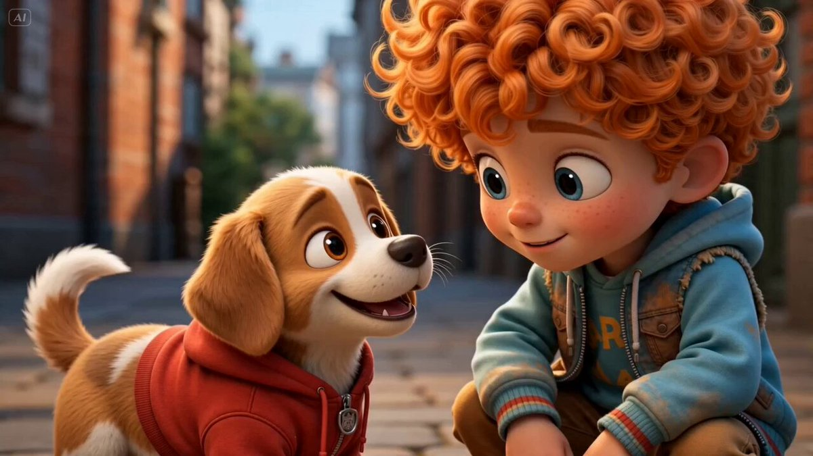

# Awesome GPT Image 2 API and Prompts

<div align="center">

<a href="https://evolink.ai/gpt-image-2-prompts?utm_source=github&utm_medium=banner&utm_campaign=awesome-gpt-image-2-API-and-Prompts"></a>

[](https://awesome.re)
[](LICENSE)
[](README.md)
[](https://github.com/EvoLinkAI/GPT-Image-2-Seedance2-Workflow)
[](https://github.com/EvoLinkAI/gpt-image-2-gen-skill)

[](README.md)
[](README_es.md)
[](README_pt.md)
[](README_ja.md)
[](README_ko.md)
[](README_de.md)
[](README_fr.md)
[](README_tr.md)
[](README_zh-TW.md)
[](README_zh-CN.md)
[](README_ru.md)

</div>

## 🍌 Introduction

Welcome to the **Awesome GPT Image 2 API and Prompts** repository! 🤗

A curated collection of **359+ high-quality GPT-Image-2 prompts**, API usage patterns, and reusable visual workflows for AI image generation.

Whether you're looking for GPT-Image-2 prompt examples, text-to-image best practices, image editing techniques, or ready-to-use prompt templates — this is your one-stop reference.

**What you'll find here:**
- 🎯 Production-ready prompts across 7 categories (portrait, poster, UI, e-commerce, ad creative, character design, comparison)
- 🔌 GPT Image 2 API integration guides and callable skills
- 🌍 Full documentation in 11 languages
- 📸 Real output images for every prompt case

Try it on Evolink: [GPT-Image-2 API](https://evolink.ai/gpt-image-2-prompts?utm_source=github&utm_medium=readme&utm_campaign=awesome-gpt-image-2-API-and-Prompts)

If you find this useful, consider giving it a star. ⭐

<a href='https://evolink.ai/gpt-image-2-prompts?utm_source=github&utm_medium=badge&utm_campaign=awesome-gpt-image-2-API-and-Prompts'></a>

## ❓ What is GPT Image 2?

**GPT Image 2** (also known as GPT-Image-2 or gpt-image-2) is OpenAI's latest image generation and editing model, integrated natively into ChatGPT and available via the OpenAI API.

**Key capabilities:**
- **Text-to-image generation** — Create photorealistic images, illustrations, posters, UI mockups, and more from natural language prompts
- **Image editing** — Modify existing images with text instructions (inpainting, outpainting, style transfer)
- **Multi-turn conversations** — Iteratively refine images through dialogue
- **High fidelity text rendering** — Accurately render text within generated images
- **Consistent character generation** — Maintain character identity across multiple generations

**Why developers use the GPT Image 2 API:**
- One API call for both generation and editing
- Superior prompt adherence compared to previous models
- Native support for aspect ratios, transparency, and batch generation
- Works with OpenAI's standard API format (`/v1/images/generations`)

> Learn more about using the API in the [Use GPT Image 2 API](#-use-gpt-image-2-api) section below.

## 📰 News

- **May 6, 2026:** Added 7 new GPT-Image-2 prompt cases (2 portrait, 5 poster) from daily curation batch after review and media validation
- **May 5, 2026:** Added 12 new GPT-Image-2 prompt cases from today's approved curation batch (4 portrait, 5 poster, 3 ui) after review and media validation
- **May 3, 2026:** Added 10 new GPT-Image-2 prompt cases from the daily approved batch (1 e-commerce, 1 ad creative, 3 portrait, 2 poster, 3 ui) after review and media validation

<details>
<summary>📜 Older Updates</summary>

- **May 2, 2026:** Added 18 new GPT-Image-2 prompt cases from the last 48-hour search batch (3 portrait, 7 poster, 4 ui, 4 comparison) after review and media validation
- **April 30, 2026:** Added 9 new GPT-Image-2 prompt cases from the last 24-hour search batch (3 portrait, 1 poster, 3 ui, 2 comparison) after approval and media validation
- **April 29, 2026:** Added 22 new GPT-Image-2 prompt cases across the review batches (3 e-commerce, 3 ad creative, 4 portrait, 2 character, 9 poster, 1 comparison), synced localized prompt entries for Cases 102 and 103, and incorporated the broader valid keep-set pass
- **April 26, 2026:** Added 9 new GPT-Image-2 prompt cases (1 character, 7 poster, 1 ui)
- **April 25, 2026:** Added 81 new GPT-Image-2 prompt cases (2 character, 20 portrait, 42 poster, 17 ui)
- **April 24, 2026:** Added 19 new GPT-Image-2 prompt cases (6 comparison, 6 poster, 7 ui)
- **April 23, 2026:** Added 5 new GPT-Image-2 prompt cases (5 ui)
- **April 23, 2026:** Standardized case titles in `README.md` and all localized README files, including menu entries, anchors, and case headings
- **April 21, 2026:** Categorized 48 new prompt cases into the gallery sections and downloaded linked output images
- **April 21, 2026:** Added 12 new GPT-Image-2 prompts across portrait, poster, UI, and comparison cases
- **April 20, 2026:** Added 10 newly curated GPT-Image-2 prompts with local image assets and README updates.
- **April 20, 2026:** Added 2 new GPT-Image-2 prompt cases (1 character, 1 poster)
- **April 19, 2026:** Added 10 new GPT-Image-2 prompts across poster, UI, and comparison cases
- **April 19, 2026:** Added 5 new GPT-Image-2 prompt cases (3 poster, 2 ui)
- **April 18, 2026:** First repository release with curated GPT-Image-2 case set

</details>

## Contents

- [🍌 Introduction](#-introduction)
- [❓ What is GPT Image 2?](#-what-is-gpt-image-2)
- [📰 News](#-news)
- [Contents](#contents)
- [🔌 Use GPT Image 2 API](#-use-gpt-image-2-api)
- [🛒 E-commerce Cases](#-e-commerce-cases)
- [📣 Ad Creative Cases](#-ad-creative-cases)
- [🍌 Portrait & Photography Cases](#-portrait--photography-cases)
- [🎨 Poster & Illustration Cases](#-poster--illustration-cases)
- [🧍 Character Design Cases](#-character-design-cases)
- [📱 UI & Social Media Mockup Cases](#-ui--social-media-mockup-cases)
- [🧪 Comparison & Community Examples](#-comparison--community-examples)
- [🤝 How to Contribute](#-how-to-contribute)
- [🙏 Acknowledge](#acknowledge)

## 🔌 Use GPT Image 2 API

Want to move from prompt inspiration to real image generation fast? Use the GPT Image 2 API docs together with the callable skill.

### 1. Quick Install the Skill

- [Go to gpt-image-2-gen-skill repository](https://github.com/EvoLinkAI/gpt-image-2-gen-skill)
- One-line install:

```bash
npx evolink-gpt-image -y
```

### 2. Quick Connect to the API

- Connect command:

```bash
curl --request POST \
  --url https://api.evolink.ai/v1/images/generations \
  --header 'Authorization: Bearer YOUR_API_KEY' \
  --header 'Content-Type: application/json' \
  --data '{
  "model": "gpt-image-2",
  "prompt": "A beautiful colorful sunset over the ocean"
}'
```

- [Get your API key](https://evolink.ai/dashboard?utm_source=github&utm_medium=readme&utm_campaign=awesome-gpt-image-2-API-and-Prompts)
- [Read GPT Image 2 API docs](https://docs.evolink.ai/en/api-manual/image-series/gpt-image-2/gpt-image-2-image-generation?utm_source=github&utm_medium=readme&utm_campaign=awesome-gpt-image-2-API-and-Prompts)

## 🛒 E-commerce Cases

> **20 curated cases** — [Explore all E-commerce Prompts →](cases/ecommerce.md)

<!-- Case 151: E-commerce Main Image - Miniature Diorama Skincare Advertisement (by @Strength04_X) -->
### Case 151: [E-commerce Main Image - Miniature Diorama Skincare Advertisement](https://x.com/Strength04_X/status/2048074514278563949) (by [@Strength04_X](https://x.com/Strength04_X))

| Output |
| :----: |
| <a href="https://evolink.ai/gpt-image-2-prompts?utm_source=github&utm_medium=picture&utm_campaign=awesome-gpt-image-2-API-and-Prompts" target="_blank" rel="noopener noreferrer"></a> |

**Prompt:**

```
A hyper-realistic miniature diorama product advertisement featuring an oversized luxury skincare pump bottle labeled "LUXEVEIL Skin Science - Radiance Nourishing Body Lotion" in cream/beige with a polished gold pump top, placed on a circular platform. Tiny figurine construction workers dressed in yellow coveralls and white hard hats swarm around the bottle climbing scaffolding, painting the bottle with rollers, operating a tower crane, working near industrial tanks and pipework, and unloading a miniature flatbed truck. The scene includes metal scaffolding structures, industrial silos, orange traffic cones, wooden barricades, and storage barrels. The overall color palette is warm beige, cream, gold, and mustard yellow. Studio photography style with soft diffused lighting, no shadows, clean beige background. The concept metaphorically shows workers "crafting" or "building" the perfect lotion. Tilt-shift miniature aesthetic, ultra-detailed, commercial product photography, 8K resolution, photorealistic CGI render.
```

<!-- Case 160: E-commerce Main Image - 9-Panel Product TVC Storyboard (by @Magncsans) -->
### Case 160: [E-commerce Main Image - 9-Panel Product TVC Storyboard](https://x.com/Magncsans/status/2047876253898903594) (by [@Magncsans](https://x.com/Magncsans))

| Output |
| :----: |
| <a href="https://evolink.ai/gpt-image-2-prompts?utm_source=github&utm_medium=picture&utm_campaign=awesome-gpt-image-2-API-and-Prompts" target="_blank" rel="noopener noreferrer"></a> |

**Prompt:**

```
Using the provided reference image, transform the single casual product photo into a polished e-commerce TVC storyboard board for a {argument name="video duration" default="15-second"} ad in a {argument name="aspect ratio" default="9:16"} vertical format, presented as a 9-panel grid. Keep the same blue-and-white ceramic ashtray as the product base, but restage it across cinematic advertising shots with warm premium lighting, shallow depth of field, and a refined lifestyle desktop environment. Add a dark storyboard layout with Chinese titles and timing for each panel. Include exactly 9 scenes: 1) environment-establishing wide shot with desk, books, window, and the product placed in context; 2) hero product medium shot on the table; 3) extreme close-up of the blue floral craftsmanship pattern; 4) use case showing a hand placing a cigarette into the ashtray with visible smoke; 5) top-down capacity display showing multiple cigarette butts inside; 6) cleaning scene under running water in a sink with a hand holding the product; 7) bottom-detail close-up showing the underside and anti-slip pads; 8) mood/lifestyle scene at night with the product on a desk, smoke rising, and ambient lamp light; 9) brand closing frame with the product as the hero plus Chinese marketing text. Add the overall header text "产品TVC分镜脚本(15秒 / 9:16竖屏 / 9宫格)" and a product subtitle naming it {argument name="product name" default="青花瓷烟灰缸"}. Give each of the 9 panels a Chinese scene title and timestamp, plus small descriptive Chinese copy beneath each image in the style of a professional commercial shot list. Use premium, realistic commercial photography throughout, consistent product identity, elegant Chinese aesthetic, and a clean high-end storyboard presentation.
```

<!-- Case 163: Burger hero image plus 9-cell ad storyboard (by @Gdgtify) -->
### Case 163: [Burger hero image plus 9-cell ad storyboard](https://x.com/Gdgtify/status/2049449869530775877) (by [@Gdgtify](https://x.com/Gdgtify))

| Output |
| :----: |
| <a href="https://evolink.ai/gpt-image-2-prompts?utm_source=github&utm_medium=picture&utm_campaign=awesome-gpt-image-2-API-and-Prompts" target="_blank" rel="noopener noreferrer"></a> |

**Prompt:**

```
Prompt 1: Create a cinematic hero image of a gourmet cheeseburger on a dark stone surface with glossy brioche bun, melted cheese, crisp lettuce, tomato, grilled patty, sauce, realistic texture, appetizing steam, warm side light, shallow depth of field, premium food commercial style, no text/logos/watermark.

Prompt 2: Create a 9-cell hybrid keyframe-to-transition storyboard sheet for a 15-second gourmet burger ad, moving from empty surface to ingredient assembly to final macro hero shot. Use large S cells and smaller T cells, motion arrows, ghosted ingredient positions, steam, sauce trails, and camera push-in icons. Style: premium food commercial, warm lighting, rich texture, appetizing, cinematic, minimal labels only. No logos, no watermark.
```

👉 **[See all 20 E-commerce prompt cases →](cases/ecommerce.md)**

## 📣 Ad Creative Cases

> **19 curated cases** — [Explore all Ad Creative Prompts →](cases/ad-creative.md)

<!-- Case 144: Luxury Chronograph Watch Ad (by @AlwaveNazca) -->
### Case 144: [Luxury Chronograph Watch Ad](https://x.com/AlwaveNazca/status/2048147643809865950) (by [@AlwaveNazca](https://x.com/AlwaveNazca))

| Output |
| :----: |
| <a href="https://evolink.ai/gpt-image-2-prompts?utm_source=github&utm_medium=picture&utm_campaign=awesome-gpt-image-2-API-and-Prompts" target="_blank" rel="noopener noreferrer"></a> |

**Prompt:**

```
A dramatic luxury product advertising image for a motorsport-inspired chronograph wristwatch in a dark studio. Center-left foreground, show a single stainless steel chronograph watch standing upright at a slight three-quarter angle, with a black dial, two red-accent subdials, slim silver hour markers, a tachymeter bezel, and visible crown and pushers on the right side. The watch has a black leather strap with bold red stitching along both edges and a sporty premium finish. To the right of the watch, place one black square presentation box slightly behind it, textured like leather, with red stitching around the lid and a silver embossed eye-shaped logo above the text "NESS STUDIO" and smaller red text "TRACK SURFACE." At the top center of the composition, add the same silver eye logo with the words "NESS STUDIO" and smaller "BY NICOLAS." Across the background, place one oversized blurred word, {argument name="headline text" default="PRECISION"}, in large gray capital letters spanning nearly the full width. The scene is set against a deep black background with cinematic red and white horizontal light streaks crossing behind the products from left to right, suggesting speed and racetrack energy. Use a glossy wet ground plane with reflective texture, catching red highlights and mirrorlike reflections beneath the watch and box. At the bottom center, add the text "CHRONOGRAPH SERIES" in clean white spaced capitals with thin red horizontal lines extending on both sides, and below it smaller red capitals reading {argument name="tagline text" default="ALSACE MADE"}. Color palette: black, charcoal gray, silver steel, vivid racing red, and a touch of white. Lighting should be high-contrast and premium, with crisp specular highlights on the metal case, subtle soft fill on the box, and moody shadows. Overall style: ultra-polished commercial product photography, luxury watch campaign, sharp focus on the products, sleek branding, high-end automotive aesthetic.
```

<!-- Case 169: Luxury chocolate campaign system (by @SPEEDAI07) -->
### Case 169: [Luxury chocolate campaign system](https://x.com/SPEEDAI07/status/2049459155086500321) (by [@SPEEDAI07](https://x.com/SPEEDAI07))

| Output |
| :----: |
| <a href="https://evolink.ai/gpt-image-2-prompts?utm_source=github&utm_medium=picture&utm_campaign=awesome-gpt-image-2-API-and-Prompts" target="_blank" rel="noopener noreferrer"></a> |

**Prompt:**

```
Create a premium, square (1:1) product advertisement for a fictional luxury chocolate brand called Noirvelle Chocolat, inspired by high-end chocolate brands. The ad should feel like a high-end editorial campaign, combining luxury food photography, refined packaging design, and cinematic lighting. Use matte black wrapper, subtle gold foil, elegant serif typography, and realistic product rendering. Generate flavor variants such as Blood Orange Noir, Salted Pistachio Muse, and Raspberry Ember with distinct mood, color palette, ingredients, headline, and supporting copy. Keep the chocolate bar as hero centerpiece with subtle reflections, shallow depth of field, luxury minimalism, and a small CTA: "Shop the drop."
```

<!-- Case 170: Surreal Brand World Poster (by @SaasJunctionHQ) -->
### Case 170: [Surreal Brand World Poster](https://x.com/SaasJunctionHQ/status/2050644926023844149) (by [@SaasJunctionHQ](https://x.com/SaasJunctionHQ))

| Output |
| :----: |
| <a href="https://evolink.ai/gpt-image-2-prompts?utm_source=github&utm_medium=picture&utm_campaign=awesome-gpt-image-2-API-and-Prompts" target="_blank" rel="noopener noreferrer"></a> |

**Prompt:**

```
A hyper-detailed surreal advertising poster for [BRAND NAME].

BACKGROUND: A large deep-toned rounded rectangle in [BRAND NAME]'s signature brand color fills 90% of the frame. Behind the subject, massive cropped brand typography bleeds off-frame, letters constructed from the brand's core material texture, embossed and lit with sharp directional rim lighting. Subtle noise grain texture overlays the background.

SUBJECT: Use the uploaded reference image. Preserve the subject's exact face and skin tone from the reference. The person faces camera in a three-quarter foreground stance, holding the brand's most iconic product directly toward the lens.

EXPRESSION: Restyle the subject's facial expression to match [BRAND NAME]'s brand personality and emotional tone.

OUTFIT: Completely restyle the subject's clothing into a character that naturally belongs to [BRAND NAME]'s universe. Use [BRAND NAME]'s exact brand palette and add small branded details.

SURREAL PRODUCT MOMENT: The product held by the subject opens, spills, or expands into a self-contained miniature world tied to [BRAND NAME]'s identity and values.

GRAPHIC LAYER: Scattered sparkle glyphs, floating micro-elements, layered soft fog, and subtle chromatic aberration at frame edges.

TEXT SYSTEM:
- TOP: Rounded pill badge, "[BRAND NAME]"
- CENTER-LEFT: Brand tagline in bold condensed uppercase
- BOTTOM STRIP: Four feature tags in a row

QUALITY: Unreal Engine render quality, octane lighting, macro lens bokeh on background elements, 8K sharp foreground.
```

👉 **[See all 19 Ad Creative prompt cases →](cases/ad-creative.md)**

## 🍌 Portrait & Photography Cases

> **68 curated cases** — [Explore all Portrait Prompts →](cases/portrait.md)

<!-- Case 1: Convenience Store Neon Portrait (by @BubbleBrain) -->
### Case 1: [Convenience Store Neon Portrait](https://x.com/BubbleBrain/status/2045167461147042202) (by [@BubbleBrain](https://x.com/BubbleBrain))

| Output |
| :----: |
| <a href="https://evolink.ai/gpt-image-2-prompts?utm_source=github&utm_medium=picture&utm_campaign=awesome-gpt-image-2-API-and-Prompts" target="_blank" rel="noopener noreferrer"></a> |

**Prompt:**

```
35mm film photography with harsh convenience store fluorescent lighting mixed with colorful neon signs from outside, authentic film grain, high contrast, slight color cast, cinematic street editorial style, intimate medium shot, early 20s sexy Chinese female idol with ultra-realistic delicate refined Chinese features, seductive almond-shaped fox eyes with natural double eyelids, high nose bridge, small sharp V-shaped jawline, flawless porcelain skin with cool ivory undertone and visible specular highlights from fluorescent light, subtle skin texture and micro pores, natural dewy makeup with soft flush on cheeks, glossy natural pink lips slightly parted, subtle natural freckles across nose and cheeks, long dark brown hair in a messy high ponytail with many loose strands falling around face and neck, wearing an oversized white button-up shirt as the only top, unbuttoned at the top with deep cleavage and loosely tied at the waist, paired with a tiny black pleated mini skirt, barefoot in simple white slides, seductive casual leaning pose against the glass door of a 24-hour convenience store at late night, body slightly arched, one leg bent with foot resting against the door frame, the other leg straight, one hand holding a bottle of iced drink, the other hand lightly pulling the hem of her mini skirt, intensely seductive playful yet slightly vulnerable gaze straight at the viewer with soft doe eyes full of quiet temptation and teasing smile, bright cold fluorescent store light from inside mixed with pink and blue neon glow from outside signs, realistic reflections on glass door, blurred convenience store interior with shelves and snacks in background, authentic 35mm film color grading with harsh lighting and neon accents, extremely sharp yet soft skin rendering, natural hair strands, realistic fabric wrinkles and drape on the oversized shirt and mini skirt, no plastic skin, no digital over-sharpening, no airbrushing, no blemishes, no moles, no oily skin, no watermark, no text, authentic late-night convenience store atmosphere
```

<!-- Case 84: Ink-Etched Family Portrait (by @gdb) -->
### Case 84: [Ink-Etched Family Portrait](https://x.com/gdb/status/2048184698195870102) (by [@gdb](https://x.com/gdb))

| Output |
| :----: |
| <a href="https://evolink.ai/gpt-image-2-prompts?utm_source=github&utm_medium=picture&utm_campaign=awesome-gpt-image-2-API-and-Prompts" target="_blank" rel="noopener noreferrer"></a> |

**Prompt:**

```
A black-and-white hand-drawn family portrait in the style of detailed pen-and-ink crosshatching on textured white paper, showing 4 people seated closely together in a casual candid composition. On the left, an adult man in a dark baseball cap worn backward and a dark T-shirt leans into the frame, with a crossbody sling bag worn across his chest and visible zipper details. On the right, an adult woman with curly hair tied up in a loose high bun wears a light T-shirt with large collegiate block letters reading {argument name="shirt text" default="CITY"}. In the center are 2 young children sitting close together, both with short curly hair and matching light-colored T-shirts printed all over with strawberries. The child on the left leans inward with one arm crossing the other child, and the child on the right tilts their head slightly upward. The adults frame the children protectively, creating a warm family snapshot feeling. Render the whole image as a monochrome etched illustration with dense fine-line hatching, engraved shadows, crisp contour lines, and a realistic yet artistic likeness, with no color, no background setting beyond a plain light paper texture, and a vertical portrait crop.
```

<!-- Case 117: Chibi 3D Mini Me Photo Effect (by @miratechtool) -->
### Case 117: [Chibi 3D Mini Me Photo Effect](https://x.com/miratechtool/status/2051691169592033488) (by [@miratechtool](https://x.com/miratechtool))

| Output |
| :----: |
| <a href="https://evolink.ai/gpt-image-2-prompts?utm_source=github&utm_medium=picture&utm_campaign=awesome-gpt-image-2-API-and-Prompts" target="_blank" rel="noopener noreferrer"></a> |

**Prompt:**

```
Mini "chibi 3D" versions of the same person appear around the original photo - sitting, climbing, playing, interacting with objects - with realistic shadows and depth. Keep base image unchanged. Add soft handwritten text: "Little versions of me... living my quiet moments." Include tiny props text like "You got this ♡". Cinematic, cozy, viral aesthetic.
```

👉 **[See all 68 Portrait & Photography prompt cases →](cases/portrait.md)**

## 🎨 Poster & Illustration Cases

> **119 curated cases** — [Explore all Poster Prompts →](cases/poster.md)

<!-- Case 79: Peacock Botanical Vintage Symmetrical Art Print (by @dotey) -->
### Case 79: [Peacock Botanical Vintage Symmetrical Art Print](https://x.com/dotey/status/2047803054422901046) (by [@dotey](https://x.com/dotey))

| Output |
| :----: |
| <a href="https://evolink.ai/gpt-image-2-prompts?utm_source=github&utm_medium=picture&utm_campaign=awesome-gpt-image-2-API-and-Prompts" target="_blank" rel="noopener noreferrer"></a> |

**Prompt:**

```
symmetrical design featuring two elegant blue peacocks with detailed feather patterns, surrounded by blue floral elements, intricate vintage botanical ornament, soft beige background, classical floral decor style with rich navy and sky blue details, decorative art illustration --ar 3:2
```

<!-- Case 193: Luxury Brand Ad Campaign Poster (by @TechieBySA) -->
### Case 193: [Luxury Brand Ad Campaign Poster](https://x.com/TechieBySA/status/2051676877794816074) (by [@TechieBySA](https://x.com/TechieBySA))

| Output |
| :----: |
| <a href="https://evolink.ai/gpt-image-2-prompts?utm_source=github&utm_medium=picture&utm_campaign=awesome-gpt-image-2-API-and-Prompts" target="_blank" rel="noopener noreferrer"></a> |

**Prompt:**

```
A world-class luxury advertising campaign poster, 4:5 ratio, for [BRAND/PRODUCT], shot in a high-end photography studio, [COLOR] dramatic lighting with vivid color gels casting bold shadows, single hero product floating center frame with hyper-reflective surface catching light streaks, cinematic lens flare, deep rich background with gradient bloom, chrome and glass material feel, oversized bold editorial typography with the brand name, razor-sharp tagline in elegant thin font, extreme detail and texture on the product, smoke or liquid elements subtly in background, feels like Apple x Nike x Lamborghini had a campaign, shot on Hasselblad, photorealistic, magazine cover quality
```

<!-- Case 191: Food Photography with Doodle Characters (by @Taaruk_) -->
### Case 191: [Food Photography with Doodle Characters](https://x.com/Taaruk_/status/2051690647997088110) (by [@Taaruk_](https://x.com/Taaruk_))

| Output |
| :----: |
| <a href="https://evolink.ai/gpt-image-2-prompts?utm_source=github&utm_medium=picture&utm_campaign=awesome-gpt-image-2-API-and-Prompts" target="_blank" rel="noopener noreferrer"></a> |

**Prompt 1 (Beach café + cute doodle characters):**

```
Aesthetic beachside café scene with a wooden table overlooking the ocean, bright daylight, soft shadows, tropical vibe. A delicious bowl of food and a coconut drink placed on the table. Add cute illustrated cartoon characters (fox, bunny, cat) sitting and relaxing around the food, with tiny hand-drawn doodles (hearts, sparkles, motion lines). Cozy wholesome mood, playful storytelling, mix of real photography and 2D illustration overlay, soft warm color grading, shallow depth of field, ultra-realistic food details, 4K.
```

**Prompt 2 (Food flatlay + playful illustrated annotations):**

```
Top-down vibrant food flatlay featuring multiple crispy fried dishes (fish, shrimp, chicken) with dipping sauces on a dark textured table. Add playful hand-drawn doodles and tiny cartoon characters interacting with the food (surfing shrimp, holding signs, cooking, playing). Include fun handwritten labels like "Golden Crunch", "Perfect Pairing", "Champion Fish". Bright colors, high contrast, crispy texture details, steam effects, dynamic composition, social media food ad style, ultra-realistic, 4K.
```

**Prompt 3 (Cozy coffee + illustrated storytelling):**

```
Warm cozy coffee scene on a rustic wooden table with a cup of latte art on a yellow saucer, coffee beans and cinnamon sticks around, small bonsai plant nearby. Add cute animated doodle characters (coffee bean with wings, cat barista painting latte art) and flowing illustrated steam forming magical shapes. Include soft handwritten typography: "Crafted Comfort – Your Daily Ritual". Golden hour lighting, warm tones, soft glow, dreamy atmosphere, shallow depth of field, ultra-realistic + 2D illustration blend, 4K.
```

👉 **[See all 119 Poster & Illustration prompt cases →](cases/poster.md)**

## 🧍 Character Design Cases

> **13 curated cases** — [Explore all Character Design Prompts →](cases/character.md)

<!-- Case 2: Persona5 Character Reference Card (by @iamrednightS) -->
### Case 2: [Persona5 Character Reference Card](https://x.com/iamrednightS/status/2045075682837836265) (by [@iamrednightS](https://x.com/iamrednightS))

| Output |
| :----: |
| <a href="https://evolink.ai/gpt-image-2-prompts?utm_source=github&utm_medium=picture&utm_campaign=awesome-gpt-image-2-API-and-Prompts" target="_blank" rel="noopener noreferrer"></a> |

**Prompt:**

```
基于此角色和背景,请制作一份类似官方设定资料的角色资料卡。
・包含三视图:正面、侧面和背面
・添加角色面部表情的变化・分解并展示服装和装备的详细部分
・添加色板・包含世界观设定的简要说明
・总体上,使用有组织的布局(白色背景,插画风格)高分辨率、专业概念艺术风格
```

<!-- Case 7: Mecha Girl Sea-City Key Visual (by @old_pgmrs_will) -->
### Case 7: [Mecha Girl Sea-City Key Visual](https://x.com/old_pgmrs_will/status/2046144801071079612) (by [@old_pgmrs_will](https://x.com/old_pgmrs_will))

| Output |
| :----: |
| <a href="https://evolink.ai/gpt-image-2-prompts?utm_source=github&utm_medium=picture&utm_campaign=awesome-gpt-image-2-API-and-Prompts" target="_blank" rel="noopener noreferrer"></a> |

**Prompt:**

```
A mecha girl mid-teens, pale skin smudged with soot and salt spray, sharp amber eyes with glowing HUD reticles, waist-length ash-white hair tied in a high ponytail whipping in the sea wind, matte gunmetal exoskeleton armor plating her shoulders, forearms and shins, exposed hydraulic pistons at the joints, chest rig with glowing cyan coolant lines, oversized oil-stained hangar jacket half slipping off one shoulder, a massive rail cannon resting on her right shoulder, dog tags and frayed red ribbon at her collar , standing off-center to the left on the rusted edge of a tilted steel platform jutting out over dark water, weight shifted onto one leg, left hand gripping the cannon strap, head turned slightly toward camera with a quiet defiant stare, steam venting from her back thrusters, her ponytail and jacket streaming sideways in the salt wind , a vast derelict sea-city at dusk, colossal megastructures of unknown purpose rising from the ocean in staggered silhouettes, bone-white monolithic towers fused with barnacled steel, cyclopean ring-shaped constructs canted at broken angles, rusted skeletal gantries threaded with dead cables, dark swells rolling between the pylons, shipwrecks half-swallowed at their feet, thick sea fog clinging to the bases while the upper structures pierce into a bruised sky, scattered faint lights blinking high in the towers like distant eyes , moody low-key lighting, cold teal ambient from the overcast sky, warm amber sodium glow leaking from a distant structure camera-right, hard backlight from a low sun behind the towers carving her silhouette, volumetric god rays cutting through sea mist, wet specular highlights on her armor , 35mm anamorphic lens, slight low angle looking up past her shoulder toward the structures, medium-wide shot, shallow depth of field with foreground rust in soft focus, horizontal lens flares, fine atmospheric haze compressing the distant megastructures into layered silhouettes , cinematic anime key visual, painterly digital illustration with crisp line art, desaturated oceanic palette of teal, bone-white and rust punched by small warm accent lights, film grain, high-contrast editorial poster aesthetic . Format 16:9.
```

<!-- Case 11: GTA 6 in Bangalore Flower Market (by @ismajc) -->
### Case 11: [GTA 6 in Bangalore Flower Market](https://x.com/ismajc/status/2048174302164394493) (by [@ismajc](https://x.com/ismajc))

| Output |
| :----: |
| <a href="https://evolink.ai/gpt-image-2-prompts?utm_source=github&utm_medium=picture&utm_campaign=awesome-gpt-image-2-API-and-Prompts" target="_blank" rel="noopener noreferrer"></a> |

**Prompt:**

```
{argument name="game" default="gta 6"} in {argument name="location" default="Bangalore's market flower"} in India
```

👉 **[See all 13 Character Design prompt cases →](cases/character.md)**

## 📱 UI & Social Media Mockup Cases

> **67 curated cases** — [Explore all UI & Mockup Prompts →](cases/ui.md)

<!-- Case 104: One-Prompt UI Design Generation (by @austinit) -->
### Case 104: [One-Prompt UI Design Generation](https://x.com/austinit/status/2044968740782272596) (by [@austinit](https://x.com/austinit))

| Output |
| :----: |
| <a href="https://evolink.ai/gpt-image-2-prompts?utm_source=github&utm_medium=picture&utm_campaign=awesome-gpt-image-2-API-and-Prompts" target="_blank" rel="noopener noreferrer"></a> |

**Prompt:**

```
用这种风格帮我生成一套UI设计系统,包含网页、移动端、卡片、控件、按钮 以及其它
```

<!-- Case 38: Cyberpunk Neon UI Design System (by @AZLnfvp) -->
### Case 38: [Cyberpunk Neon UI Design System](https://x.com/AZLnfvp/status/2046468976092533180) (by [@AZLnfvp](https://x.com/AZLnfvp))

| Output |
| :----: |
| <a href="https://evolink.ai/gpt-image-2-prompts?utm_source=github&utm_medium=picture&utm_campaign=awesome-gpt-image-2-API-and-Prompts" target="_blank" rel="noopener noreferrer"></a> |

**Prompt:**

```
用未来都市风格生成UI设计系统,灵感来自赛博朋克城市夜景,包含霓虹灯、玻璃建筑反射、高对比光影,配色以紫色、蓝色、粉色霓虹为主,设计网页Dashboard、移动端界面、卡片、按钮、控件等,视觉炫酷、层次丰富、科技感极强
```

<!-- Case 124: 12-Panel Storyboard Poster (by @bmx_ai13) -->
### Case 124: [12-Panel Storyboard Poster](https://x.com/bmx_ai13/status/2050432594647642414) (by [@bmx_ai13](https://x.com/bmx_ai13))

| Output |
| :----: |
|  |

**Prompt:**

```
A super simple workflow: 2 character images → GPT Image 2.0 storyboard → Seedance 2.0 animation. Just upload two character images and use the prompt below in GPT Image 2.0 to generate a full storyboard on a single page. Prompt: Create a clean, colorful storyboard poster in a 3x4 grid layout with 12 panels on a single page. Title at the top: "[MAIN TITLE]" Each panel must include: a scene number in a small circle, a short scene title, a colorful illustrated image, a 1-2 line description under the image. Main characters must remain visually consistent across all 12 panels: Character 1: [describe main character in detail] Character 2: [describe second character in detail] Theme/story: [overall story theme] Scene breakdown: [Scene title] - [what happens] [Scene title] - [what happens] [Scene title] - [what happens] [Scene title] - [what happens] [Scene title] - [what happens] [Scene title] - [what happens] [Scene title] - [what happens] [Scene title] - [what happens] [Scene title] - [what happens] [Scene title] - [what happens] [Scene title] - [what happens] [Scene title] - [what happens] Design style: cute 3D animated storybook style, warm emotional lighting, bright colors, soft shadows, child-friendly, clean panel borders, readable typography, neat poster composition, high detail. Important: Keep all 12 panels inside one single image. Make the layout clean and balanced. Keep the characters consistent in face, outfit, and colors. Make the text readable and properly placed. No cropped panels. No extra characters unless mentioned. Then upload that storyboard to Seedance 2.0 and use this prompt: Prompt: Generate a scene using the shots in the uploaded film storyboard. No text on screen. That's it.
```

👉 **[See all 67 UI & Social Media Mockup prompt cases →](cases/ui.md)**

## 🧪 Comparison & Community Examples

> **53 curated cases** — [Explore all Comparison Examples →](cases/comparison.md)

<!-- Case 35: Sam Altman Bear Selfie (by @JustinGorya) -->
### Case 35: [Sam Altman Bear Selfie](https://x.com/JustinGorya/status/2046510831832006970) (by [@JustinGorya](https://x.com/JustinGorya))

| Output |
| :----: |
| <a href="https://evolink.ai/gpt-image-2-prompts?utm_source=github&utm_medium=picture&utm_campaign=awesome-gpt-image-2-API-and-Prompts" target="_blank" rel="noopener noreferrer"></a> |

**Prompt:**

```
generate image: Selfie of Sam Altman riding a bear

Edit prompt: Remove the background make it transparent
```

<!-- Case 68: Naturalist-Style Food Specimen Cross-Section (by @GeekCatX) -->
### Case 68: [Naturalist-Style Food Specimen Cross-Section](https://x.com/GeekCatX/status/2046939656244318676) (by [@GeekCatX](https://x.com/GeekCatX))

| Output |
| :----: |
| <a href="https://evolink.ai/gpt-image-2-prompts?utm_source=github&utm_medium=picture&utm_campaign=awesome-gpt-image-2-API-and-Prompts" target="_blank" rel="noopener noreferrer"></a> |

**Prompt:**

```
一颗/一块/一枚【食物名称】,以博物学大师发现野外标本的方式解剖。
剖开、展开、固定--如同博物馆的珍贵藏品,
却以卡拉瓦乔为《国家地理》掌镜时的光线照亮。
每一个内部结构都以自身的材质真相发光。
截面锋利得近乎暴力。内部美丽得近乎神圣。
画面中呈现完整标本:
一半保持原状,展示【外表面描述:质感/颜色/纹理】;
另一半剖开至核心,【内部核心结构描述:最重要的1-2个内部视觉特征】清晰可见。
【补充1-2句该食物最具视觉张力的横截面细节描述】
背景:纯粹的黑丝绒。
【食物名称】悬浮其中,如同某件珍贵而危险的事物。
标注文字紧贴结构边缘,手写感衬线字体,绝不悬空飘浮。
画面包含以下标注,每处标注三行:第一行结构名称,第二行成分数据,第三行一句人话:
【结构01名称】
【成分/数据说明】
【这个结构在做什么,为什么重要】

【结构02名称】
【成分/数据说明】
【这个结构在做什么,为什么重要】
【结构03名称】
【成分/数据说明】
【这个结构在做什么,为什么重要】
【结构04名称】
【成分/数据说明】
【这个结构在做什么,为什么重要】
【结构05名称】
【成分/数据说明】
【这个结构在做什么,为什么重要】

【结构06名称】
【成分/数据说明】
【这个结构在做什么,为什么重要】
省略其他如果有继续保持这个格式
主标题,左上角,暖象牙白大写字体:
【食物名称】·解剖

斜体副标题紧随其下:
【一句揭示这种食物本质的话,不超过15字】

整体气质:奥杜邦博物插画×卡拉瓦乔光影×有史以来最美的科学摄影。
4K精度,标本照明,极致内部细节。
没有任何临床感,一切都鲜活。
写实风格,非示意图,非卡通,非简化图解。
每一种材质都有真实的物理质感:
粗糙的、光滑的、湿润的、干燥的、致密的、疏松的。
```

<!-- Case 77: Printable Paint by Numbers (by @TheRoaringToady) -->
### Case 77: [Printable Paint by Numbers](https://x.com/TheRoaringToady/status/2050469389720314030) (by [@TheRoaringToady](https://x.com/TheRoaringToady))

| Output |
| :----: |
|  |

**Prompt:**

```
🎨 This GPT Image 2 prompt turns any image into a printable paint-by-numbers page. For best results, use ChatGPT in Thinking mode. I think we should call it numberfying. The intellectuals can call it Colorbookification. 😂 I tried it with a few TurboToadToken images and the results are wild. 🐸💛 Create it. Print it. Paint it. For kids, adults, and anyone who wants an easy creative activity. Try it and post your results in the comments. Prompt below 👇 Create a professional high-resolution paint-by-numbers template from the provided image as a single PNG only. Use an A4 portrait ratio canvas at 300 DPI with a pure white background. The main artwork must be a clean black-and-white line drawing containing only black outlines, black numbers, and white unfilled paintable areas. Do not create a PDF, document, mockup, multi-page layout, or colored version. Do not use color, gray, shading, texture, gradients, transparency, or pre-filled areas in the main artwork. Analyze the original image and choose the number of colors adaptively based on image complexity, from 1 to a maximum of 14 colors. If the image has only 1-2 important colors, use only 1-2 colors; for simple images use 3-6 colors; for medium complexity use 7-10 colors; for complex, photographic, or highly detailed images use 11-14 colors. Do not force unnecessary colors. Assign each selected color one unique number and merge similar shades unless separation is essential for recognition. Convert the image into simplified, fully closed, easy-to-paint regions while preserving the recognizable composition, main objects, characters, text, logos, foreground, background, and key details. Every paintable white region must contain the correct black number, centered clearly inside the matching area, readable, upright, and not touching outlines. Large black or dark areas from the original must remain white paintable regions with the correct number, not filled black. Only tiny permanent black line details, such as mouth lines, nostrils, pupils, eyelashes, seams, or small decorative strokes, may remain unnumbered. At the bottom of the same PNG, add a neat legend section with the heading "Instructions", the sentence "Paint the areas with the matching colors.", and a list of every used number with a small color swatch and the English color name. Color swatches may appear only in the legend. Ensure the numbering exactly matches the legend, every paintable area is numbered, all regions are closed, and the final result is clean, professional, print-ready, and recognizable as the original image.
```

👉 **[See all 53 Comparison & Community prompt cases →](cases/comparison.md)**

## 🤝 How to Contribute

We welcome community contributions! If you've created or discovered a great GPT-Image-2 prompt, share it with the community.

**Ways to contribute:**

1. **Submit a prompt via Issue** — Use our [Prompt Submission Template](https://github.com/EvoLinkAI/awesome-gpt-image-2-API-and-Prompts/issues/new?template=submit-prompt.yml) to submit your prompt with output images
2. **Open a Pull Request** — Add your case directly to the appropriate `cases/*.md` file following the existing format
3. **Report issues** — Found a broken link or incorrect prompt? [Open an issue](https://github.com/EvoLinkAI/awesome-gpt-image-2-API-and-Prompts/issues/new)

**Submission guidelines:**
- Include the full, reusable prompt text (not just a description)
- Attach or link at least one output image
- Specify which category your prompt belongs to
- Credit the original author if sharing someone else's work

See [CONTRIBUTING.md](contributing.md) for detailed guidelines.

## Acknowledge

This repository was inspired by outstanding open prompt collections and community-shared GPT-Image-2 experiments.

Thanks to the creators and contributors who shared their work publicly and made these case studies possible.

[@BubbleBrain](https://x.com/BubbleBrain), [@iam_miharbi](https://x.com/iam_miharbi), [@Shinning1010](https://x.com/Shinning1010), [@patrickassale](https://x.com/patrickassale), [@Zoulinshen](https://x.com/Zoulinshen), [@WolfRiccardo](https://x.com/WolfRiccardo), [@Panda20230902](https://x.com/Panda20230902), [@liyue_ai](https://x.com/liyue_ai), [@blanplan](https://x.com/blanplan), [@4WEB1](https://x.com/4WEB1), [@lilimliliychan](https://x.com/lilimliliychan), [@Thereallo1026](https://x.com/Thereallo1026), [@iamrednightS](https://x.com/iamrednightS), [@09lyco](https://x.com/09lyco), [@tsubaki_ew](https://x.com/tsubaki_ew), [@Toshi_nyaruo_AI](https://x.com/Toshi_nyaruo_AI), [@yyu_hase](https://x.com/yyu_hase), [@austinit](https://x.com/austinit), [@MrLarus](https://x.com/MrLarus), [@rionaifantasy](https://x.com/rionaifantasy), [@alanblogsooo](https://x.com/alanblogsooo), [@SKA_Neotype](https://x.com/SKA_Neotype), [@desds1678](https://x.com/desds1678), [@samifox_ai](https://x.com/samifox_ai), [@HuliJason](https://x.com/HuliJason), [@MikelEcheve](https://x.com/MikelEcheve), [@chetaslua](https://x.com/chetaslua), [@signedbywill](https://x.com/signedbywill), [@zerolu_eth](https://x.com/zerolu_eth), [@Cheney_NehcOal](https://x.com/Cheney_NehcOal), [@cnzoecomeback](https://x.com/cnzoecomeback), [@linxiaobei888](https://x.com/linxiaobei888), [@old_pgmrs_will](https://x.com/old_pgmrs_will), [@kotsu_kotsu_san](https://x.com/kotsu_kotsu_san), [@samayousakadaru](https://x.com/samayousakadaru), [@saskr_13](https://x.com/saskr_13), [@kawai_design](https://x.com/kawai_design), [@otohitoyuuki](https://x.com/otohitoyuuki), [@jrpj2010](https://x.com/jrpj2010), [@CEs7J0Mfn8x37k5](https://x.com/CEs7J0Mfn8x37k5), [@pfanis](https://x.com/pfanis), [@yssrski](https://x.com/yssrski), [@overseas58](https://x.com/overseas58), [@opc_8838](https://x.com/opc_8838), [@RitaStar1128](https://x.com/RitaStar1128), [@Yuupapa_free](https://x.com/Yuupapa_free), [@tebasaki3D](https://x.com/tebasaki3D), [@Colin_Leeee](https://x.com/Colin_Leeee), [@IndieDevHailey](https://x.com/IndieDevHailey), [@wory37303852](https://x.com/wory37303852), [@mm_zzm44854](https://x.com/mm_zzm44854), [@sjbbxhz](https://x.com/sjbbxhz), [@GeekCatX](https://x.com/GeekCatX), [@makaneko_AI](https://x.com/makaneko_AI), [@Tanemomi_Ver2](https://x.com/Tanemomi_Ver2), [@chi_vc_](https://x.com/chi_vc_), [@S0N_IA_](https://x.com/S0N_IA_), [@Gugombly](https://x.com/Gugombly), [@rerxmsz06](https://x.com/rerxmsz06), [@Shion_yamabuki](https://x.com/Shion_yamabuki), [@SelenaGmzIN](https://x.com/SelenaGmzIN), [@chesnyfcb](https://x.com/chesnyfcb), [@MoveHiro1219](https://x.com/MoveHiro1219), [@mirochill](https://x.com/mirochill), [@Eris_Create_Lab](https://x.com/Eris_Create_Lab), [@Design4p0](https://x.com/Design4p0), [@mikko_20100518](https://x.com/mikko_20100518), [@sorane_aimusic](https://x.com/sorane_aimusic), [@Polanco_IA](https://x.com/Polanco_IA), [@Strength04_X](https://x.com/Strength04_X), [@edimakorfr](https://x.com/edimakorfr), [@ShamsAmin56](https://x.com/ShamsAmin56), [@dynamicwangs](https://x.com/dynamicwangs), [@MiguelMaestroIA](https://x.com/MiguelMaestroIA), [@gdb](https://x.com/gdb), [@ToroJushiAi](https://x.com/ToroJushiAi), [@Inshrah_ali_](https://x.com/Inshrah_ali_), [@XSydneyFan](https://x.com/XSydneyFan), [@Abdullah__Ai7](https://x.com/Abdullah__Ai7), [@yume00112211](https://x.com/yume00112211), [@jiajia232016](https://x.com/jiajia232016), [@libearal](https://x.com/libearal), [@jeremydevz](https://x.com/jeremydevz), [@megane_onesan](https://x.com/megane_onesan), [@kotobukigraphic](https://x.com/kotobukigraphic), [@Hair_Hair55](https://x.com/Hair_Hair55), [@erikmackinnon](https://x.com/erikmackinnon), [@FernandesK47117](https://x.com/FernandesK47117), [@aimikoda](https://x.com/aimikoda), [@mosthssan](https://x.com/mosthssan), [@SDAI1807097011](https://x.com/SDAI1807097011), [@AIillust_studio](https://x.com/AIillust_studio), [@Just_sharon7](https://x.com/Just_sharon7), [@AIMAG31G](https://x.com/AIMAG31G), [@yanagihara_0805](https://x.com/yanagihara_0805), [@Gorden_Sun](https://x.com/Gorden_Sun), [@m_Raiko_AIart](https://x.com/m_Raiko_AIart), [@sub_raw_jin](https://x.com/sub_raw_jin), [@harboriis](https://x.com/harboriis), [@Diplomeme](https://x.com/Diplomeme), [@zenkaiAI](https://x.com/zenkaiAI), [@_simonsmith](https://x.com/_simonsmith), [@leyu37829](https://x.com/leyu37829), [@mob_17](https://x.com/mob_17), [@komorimedia](https://x.com/komorimedia), [@degewa](https://x.com/degewa), [@GlennHasABeard](https://x.com/GlennHasABeard), [@TWnese](https://x.com/TWnese), [@Ciri_ai](https://x.com/Ciri_ai), [@tonysimons_](https://x.com/tonysimons_), [@himukai_an](https://x.com/himukai_an), [@Dakiny](https://x.com/Dakiny), [@ExquisitMe](https://x.com/ExquisitMe), [@xRahultripathi](https://x.com/xRahultripathi), [@JohnnyWang8802](https://x.com/JohnnyWang8802), [@Professor_134](https://x.com/Professor_134), [@ArtwlDesign](https://x.com/ArtwlDesign), [@hoshi122221](https://x.com/hoshi122221), [@Ray_CROWN0](https://x.com/Ray_CROWN0), [@AllaAisling](https://x.com/AllaAisling), [@AlwaveNazca](https://x.com/AlwaveNazca), [@_LaurentB](https://x.com/_LaurentB), [@Salmaaboukarr](https://x.com/Salmaaboukarr), [@silentempiredev](https://x.com/silentempiredev), [@songguoxiansen](https://x.com/songguoxiansen), [@rojassartorio](https://x.com/rojassartorio), [@WooGabriel76263](https://x.com/WooGabriel76263), [@SPEEDAI07](https://x.com/SPEEDAI07), [@Adam38363368936](https://x.com/Adam38363368936), [@Magncsans](https://x.com/Magncsans), [@ismajc](https://x.com/ismajc), [@almimeister](https://x.com/almimeister), [@sarinaashapi](https://x.com/sarinaashapi), [@Kazuch75240438](https://x.com/Kazuch75240438), [@yy7482933910896](https://x.com/yy7482933910896), [@terunari](https://x.com/terunari), [@Gerry](https://x.com/Gerry), [@xc5_](https://x.com/xc5_), [@Ayu_AI_0912](https://x.com/Ayu_AI_0912), [@16kthir0GRXgNqn](https://x.com/16kthir0GRXgNqn), [@80vul](https://x.com/80vul), [@A9Quant](https://x.com/A9Quant), [@AIwithAliya](https://x.com/AIwithAliya), [@AIwithSarah_](https://x.com/AIwithSarah_), [@AIwithSynthia](https://x.com/AIwithSynthia), [@AIwithkhan](https://x.com/AIwithkhan), [@AZLnfvp](https://x.com/AZLnfvp), [@AntCaveClub](https://x.com/AntCaveClub), [@Aurora_62340](https://x.com/Aurora_62340), [@BNBOKBt5](https://x.com/BNBOKBt5), [@ChiefMonkeyMike](https://x.com/ChiefMonkeyMike), [@ChillaiKalan__](https://x.com/ChillaiKalan__), [@CoderDaMing](https://x.com/CoderDaMing), [@D_studioproject](https://x.com/D_studioproject), [@FixlationAI](https://x.com/FixlationAI), [@Gdgtify](https://x.com/Gdgtify), [@Ghhhh3owi](https://x.com/Ghhhh3owi), [@Goodmanprotocol](https://x.com/Goodmanprotocol), [@JustinGorya](https://x.com/JustinGorya), [@Kurt_Rousey466](https://x.com/Kurt_Rousey466), [@LVWANGJI_0327](https://x.com/LVWANGJI_0327), [@LoovaAI](https://x.com/LoovaAI), [@MANISH1027512](https://x.com/MANISH1027512), [@MajaDesignJP](https://x.com/MajaDesignJP), [@Malek1173989](https://x.com/Malek1173989), [@Naiknelofar788](https://x.com/Naiknelofar788), [@Preda2005](https://x.com/Preda2005), [@PrometheanAIX](https://x.com/PrometheanAIX), [@QamarRiaz1](https://x.com/QamarRiaz1), [@ReYYYYoking](https://x.com/ReYYYYoking), [@Rufus87078959](https://x.com/Rufus87078959), [@Sheldon056](https://x.com/Sheldon056), [@Shorelyn_](https://x.com/Shorelyn_), [@SimplyAnnisa](https://x.com/SimplyAnnisa), [@Tresmort](https://x.com/Tresmort), [@Tz_2022](https://x.com/Tz_2022), [@WillSpagnoli](https://x.com/WillSpagnoli), [@XiaohuiAI666](https://x.com/XiaohuiAI666), [@ZaraIrahh](https://x.com/ZaraIrahh), [@Zhaoge01](https://x.com/Zhaoge01), [@agi_aibusi](https://x.com/agi_aibusi), [@ai_gezgini](https://x.com/ai_gezgini), [@ailovedirector](https://x.com/ailovedirector), [@akakageAI](https://x.com/akakageAI), [@alanlovelq](https://x.com/alanlovelq), [@anacoding](https://x.com/anacoding), [@andis13](https://x.com/andis13), [@caiziboshi](https://x.com/caiziboshi), [@carsonyungos](https://x.com/carsonyungos), [@cellinlab](https://x.com/cellinlab), [@charliejhills](https://x.com/charliejhills), [@chatcutapp](https://x.com/chatcutapp), [@chenenpei](https://x.com/chenenpei), [@cj858cjsoul](https://x.com/cj858cjsoul), [@ck_igarashi](https://x.com/ck_igarashi), [@commanderdgr8](https://x.com/commanderdgr8), [@dotey](https://x.com/dotey), [@elliscrosby](https://x.com/elliscrosby), [@genel_ai](https://x.com/genel_ai), [@grok](https://x.com/grok), [@happycapyai](https://x.com/happycapyai), [@hmontilla_](https://x.com/hmontilla_), [@iaPulse_](https://x.com/iaPulse_), [@iamrealsnow](https://x.com/iamrealsnow), [@iamsofiaijaz](https://x.com/iamsofiaijaz), [@joshesye](https://x.com/joshesye), [@khaiinit](https://x.com/khaiinit), [@kylegeeks](https://x.com/kylegeeks), [@laogeai](https://x.com/laogeai), [@llllegend0620](https://x.com/llllegend0620), [@loglogrog](https://x.com/loglogrog), [@madpencil_](https://x.com/madpencil_), [@mapasbr](https://x.com/mapasbr), [@meng_dagg695](https://x.com/meng_dagg695), [@miratechtool](https://x.com/miratechtool), [@nidiedeba](https://x.com/nidiedeba), [@nijisora_yuma](https://x.com/nijisora_yuma), [@pavellaslov](https://x.com/pavellaslov), [@rovvmut_](https://x.com/rovvmut_), [@rs_elwood](https://x.com/rs_elwood), [@sciencedegens](https://x.com/sciencedegens), [@sdjn_wgc](https://x.com/sdjn_wgc), [@seiiiiiiiiiiru](https://x.com/seiiiiiiiiiiru), [@sha_zdiii](https://x.com/sha_zdiii), [@stark_nico99](https://x.com/stark_nico99), [@the_wheel_2024](https://x.com/the_wheel_2024), [@underwoodxie96](https://x.com/underwoodxie96), [@verysmallwoods](https://x.com/verysmallwoods), [@weel_corp](https://x.com/weel_corp), [@workingclassbud](https://x.com/workingclassbud), [@yammamon](https://x.com/yammamon), [@zhiyangzhu22222](https://x.com/zhiyangzhu22222)

*We cannot guarantee that every case is attributed to the original creator. If anything needs to be corrected, please contact us and we will update it.*

If you have more interesting GPT-Image-2 prompt cases to share, feel free to reach out and help us expand the Evolink prompt library.

## Star History

[](https://www.star-history.com/#EvoLinkAI/awesome-gpt-image-2-API-and-Prompts&Date)
