<div align="center">

<a href="https://evolink.ai/gpt-image-2?utm_source=github&utm_medium=banner&utm_campaign=awesome-gpt-image-2-prompts"></a>

[](LICENSE)
[](https://evolink.ai/gpt-image-2?utm_source=github&utm_medium=picture&utm_campaign=awesome-gpt-image-2-prompts)
[](https://evolink.ai/gpt-image-2?utm_source=github&utm_medium=picture&utm_campaign=awesome-gpt-image-2-prompts)
[](https://evolink.ai/gpt-image-2?utm_source=github&utm_medium=picture&utm_campaign=awesome-gpt-image-2-prompts)
[](https://github.com/EvoLinkAI/GPT-Image-2-Seedance2-Workflow)

[](README.md)
[](README_es.md)
[](README_pt.md)
[](README_ja.md)
[](README_ko.md)
[](README_de.md)
[](README_fr.md)
[](README_tr.md)
[](README_zh-TW.md)
[](README_zh-CN.md)
[](README_ru.md)

</div>

## Introduccion

Bienvenido al repositorio awesome-gpt-image-2-prompts! 🤗

**Recopilamos prompts de alta calidad y ejemplos de imagen para GPT-Image-2 en retratos, posters, hojas de personajes, maquetas de UI y experimentos de la comunidad.**

La mayoria de los casos de este repositorio estan recopilados de X/Twitter, comunidades de creadores, demos publicas y experimentos compartidos.

Pruebalo en Evolink: [GPT-Image-2](https://evolink.ai/gpt-image-2?utm_source=github&utm_medium=picture&utm_campaign=awesome-gpt-image-2-prompts)

Si esto te resulta util, considera darle una estrella. ⭐

> [!NOTE]
> Este repositorio se centra en patrones de prompts reutilizables, casos de referencia y ejemplos especificos por tarea para GPT-Image-2 en Evolink.
> Las actualizaciones recientes solo de prompts tambien se registran en `gpt_image_2_prompt.json`.

<a href='https://evolink.ai/gpt-image-2?utm_source=github&utm_medium=picture&utm_campaign=awesome-gpt-image-2-prompts'></a>
<a href='https://evolink.ai/gpt-image-2?utm_source=github&utm_medium=picture&utm_campaign=awesome-gpt-image-2-prompts'></a>
<a href='https://evolink.ai/gpt-image-2?utm_source=github&utm_medium=picture&utm_campaign=awesome-gpt-image-2-prompts'></a>
<a href='https://evolink.ai/gpt-image-2?utm_source=github&utm_medium=picture&utm_campaign=awesome-gpt-image-2-prompts'></a>

## Novedades

- **23 de abril de 2026:** Se estandarizaron los titulos de los casos en `README.md` y en todos los README localizados, incluidos los elementos del menu, las anclas y los encabezados de casos
- **21 de abril de 2026:** Se categorizaron 48 nuevos casos de prompts en las secciones de la galeria y se descargaron las imagenes de salida enlazadas
- **21 de abril de 2026:** Se agregaron 12 nuevos prompts de GPT-Image-2 en casos de retrato, poster, UI y comparativas
- **20 de abril de 2026:** Se agregaron 10 nuevos prompts curados de GPT-Image-2 con recursos de imagen locales y actualizaciones del README.
- **19 de abril de 2026:** Se agregaron 10 nuevos prompts de GPT-Image-2 en casos de poster, UI y comparativas
- **18 de abril de 2026:** Primera publicacion del repositorio con una seleccion curada de casos de GPT-Image-2

## 📑 Menu

- [Introduccion](#introduccion)
- [Novedades](#novedades)
- [Casos de Retrato y Fotografia](#casos-de-retrato-y-fotografia)
  - [Case 1: Convenience Store Neon Portrait (by @BubbleBrain)](#case-1-convenience-store-neon-portrait-by-bubblebrain)
  - [Case 2: Cinematic Minimal Portrait (by @iam_miharbi)](#case-2-cinematic-minimal-portrait-by-iam_miharbi)
  - [Case 3: Japanese Onsen Ryokan Portrait (by @BubbleBrain)](#case-3-japanese-onsen-ryokan-portrait-by-bubblebrain)
  - [Case 4: 35mm Flash Editorial Portrait (by @BubbleBrain)](#case-4-35mm-flash-editorial-portrait-by-bubblebrain)
  - [Case 5: Mirror Selfie Bedroom Portrait (by @Shinning1010)](#case-5-mirror-selfie-bedroom-portrait-by-shinning1010)
  - [Case 6: Soft Airy 35mm Portrait (by @BubbleBrain)](#case-6-soft-airy-35mm-portrait-by-bubblebrain)
  - [Case 7: Luxury Glam Beauty Portrait (by @patrickassale)](#case-7-luxury-glam-beauty-portrait-by-patrickassale)
  - [Case 8: 9:16 Cosplayer Portrait Screenshot (by @Zoulinshen)](#case-8-916-cosplayer-portrait-screenshot-by-zoulinshen)
  - [Case 9: Urban Turn-Back Street Portrait (by @Tz_2022)](#case-9-urban-turn-back-street-portrait-by-tz_2022)
  - [Case 10: Sam Altman Skatepark Snapshot (by @Malek1173989)](#case-10-sam-altman-skatepark-snapshot-by-malek1173989)
  - [Case 11: Korean Idol 3x3 Grid Portrait (by @BubbleBrain)](#case-11-korean-idol-3x3-grid-portrait-by-bubblebrain)
  - [Case 12: CCD Camera Flash Korean Idol (by @BubbleBrain)](#case-12-ccd-camera-flash-korean-idol-by-bubblebrain)
  - [Case 13: Korean Idol 3x3 Collage Portrait (by @BubbleBrain)](#case-13-korean-idol-3x3-collage-portrait-by-bubblebrain)
  - [Case 14: Soft Black Mist Editorial Portrait (by @BubbleBrain)](#case-14-soft-black-mist-editorial-portrait-by-bubblebrain)
  - [Case 15: Fujifilm Strawberry School Portrait (by @BubbleBrain)](#case-15-fujifilm-strawberry-school-portrait-by-bubblebrain)
  - [Case 16: Soft Black Mist Idol Portrait (by @BubbleBrain)](#case-16-soft-black-mist-idol-portrait-by-bubblebrain)
  - [Case 17: Fujifilm Couple Portrait (by @BubbleBrain)](#case-17-fujifilm-couple-portrait-by-bubblebrain)
  - [Case 18: AI Self-Perception Portrait (by @80vul)](#case-18-ai-self-perception-portrait-by-80vul)
  - [Case 19: Create the most realistic front page design of a vintage newspaper featuring ... (by @Naiknelofar788)](#case-19-create-the-most-realistic-front-page-design-of-a-vintage-newspaper-featuring-by-naiknelofar788)
  - [Case 20: Create image of Magazine feature article [travel (by @andis13)](#case-20-create-image-of-magazine-feature-article-travel-by-andis13)
  - [Case 21: analyze this photo and give me a detailed JSON prompt that recreates it. brea... (by @pavellaslov)](#case-21-analyze-this-photo-and-give-me-a-detailed-json-prompt-that-recreates-it-brea-by-pavellaslov)
  - [Case 22: CALMING GREEN TEA Film Kit displayed frontally, the open box shows soft sage-... (by @ZaraIrahh)](#case-22-calming-green-tea-film-kit-displayed-frontally-the-open-box-shows-soft-sage-by-zarairahh)
  - [Case 23: Ultra-realistic product photography of a rich strawberry soft-serve ice cream... (by @ZaraIrahh)](#case-23-ultra-realistic-product-photography-of-a-rich-strawberry-soft-serve-ice-cream-by-zarairahh)
  - [Case 24: A hyper-realistic UI/UX mockup displayed on a slim modern laptop placed on a ... (by @ZaraIrahh)](#case-24-a-hyper-realistic-uiux-mockup-displayed-on-a-slim-modern-laptop-placed-on-a-by-zarairahh)
  - [Case 25: Ultra-realistic cinematic DSLR photograph of an 18-year-old handsome young ma... (by @harboriis)](#case-25-ultra-realistic-cinematic-dslr-photograph-of-an-18-year-old-handsome-young-ma-by-harboriis)
- [Casos de Posters e Ilustracion](#casos-de-posters-e-ilustracion)
  - [Case 1: Boston Spring 2026 City Poster (by @BubbleBrain)](#case-1-boston-spring-2026-city-poster-by-bubblebrain)
  - [Case 2: Vintage Amalfi Travel Poster (by @WolfRiccardo)](#case-2-vintage-amalfi-travel-poster-by-wolfriccardo)
  - [Case 3: Chengdu Food Map Illustration (by @Panda20230902)](#case-3-chengdu-food-map-illustration-by-panda20230902)
  - [Case 4: Chinese Minimalist S-Shaped Poster (by @liyue_ai)](#case-4-chinese-minimalist-s-shaped-poster-by-liyue_ai)
  - [Case 5: 2026 Spring Guangzhou City Poster (by @liyue_ai)](#case-5-2026-spring-guangzhou-city-poster-by-liyue_ai)
  - [Case 7: Doodle Sketch AI Builder (by @blanplan)](#case-7-doodle-sketch-ai-builder-by-blanplan)
  - [Case 8: Futuristic Mandala Illustration (by @4WEB1)](#case-8-futuristic-mandala-illustration-by-4web1)
  - [Case 9: Super Famicom Poster Style (by @lilimliliychan)](#case-9-super-famicom-poster-style-by-lilimliliychan)
  - [Case 10: Browser Game Ad Creative Poster (by @llllegend0620)](#case-10-browser-game-ad-creative-poster-by-llllegend0620)
  - [Case 11: Surreal Koi Nebula Illustration (by @liyue_ai)](#case-11-surreal-koi-nebula-illustration-by-liyue_ai)
  - [Case 12: Ink-Curve Guangzhou Aesthetics Poster (by @liyue_ai)](#case-12-ink-curve-guangzhou-aesthetics-poster-by-liyue_ai)
  - [Case 13: Guangdong Super League Invitation Poster (by @liyue_ai)](#case-13-guangdong-super-league-invitation-poster-by-liyue_ai)
  - [Case 14: Spring 2026 Guangzhou Promo Poster (by @grok)](#case-14-spring-2026-guangzhou-promo-poster-by-grok)
  - [Case 15: Epic Silhouette World Poster (by @Ghhhh3owi)](#case-15-epic-silhouette-world-poster-by-ghhhh3owi)
  - [Case 24: Spring Guangzhou City Poster (by @alanlovelq)](#case-24-spring-guangzhou-city-poster-by-alanlovelq)
  - [Case 26: Qiongqi Eastern Aesthetics Poster (by @liyue_ai)](#case-26-qiongqi-eastern-aesthetics-poster-by-liyue_ai)
  - [Case 27: Guangzhou Paper-Cut City Poster (by @liyue_ai)](#case-27-guangzhou-paper-cut-city-poster-by-liyue_ai)
  - [Case 28: Extreme Perspective Typography Bridge (by @xpg0970)](#case-28-extreme-perspective-typography-bridge-by-xpg0970)
  - [Case 31: Dreamy Watercolor Editorial Illustration (by @hmontilla_)](#case-31-dreamy-watercolor-editorial-illustration-by-hmontilla_)
  - [Case 32: Science Encyclopedia Vertical Poster (by @pfanis)](#case-32-science-encyclopedia-vertical-poster-by-pfanis)
  - [Case 33: Journey to the West Chinese Comic (by @overseas58)](#case-33-journey-to-the-west-chinese-comic-by-overseas58)
  - [Case 34: Character Relationship Map Poster (by @MrLarus)](#case-34-character-relationship-map-poster-by-mrlarus)
  - [Case 35: New Chinese Ink Landscape Poster (by @liyue_ai)](#case-35-new-chinese-ink-landscape-poster-by-liyue_ai)
  - [Case 36: AI Builder Doodle Sketch (by @opc_8838)](#case-36-ai-builder-doodle-sketch-by-opc_8838)
  - [Case 38: Character Visual Vertical Poster (by @tebasaki3D)](#case-38-character-visual-vertical-poster-by-tebasaki3d)
  - [Case 39: Science Encyclopedia Infographic (by @MrLarus)](#case-39-science-encyclopedia-infographic-by-mrlarus)
  - [Case 40: Fictional Anime Movie Poster (by @seiiiiiiiiiiru)](#case-40-fictional-anime-movie-poster-by-seiiiiiiiiiiru)
  - [Case 41: Product Ad Redesign (by @genel_ai)](#case-41-product-ad-redesign-by-genel_ai)
  - [Case 42: Dark-Fantasy Guangzhou City Poster (by @liyue_ai)](#case-42-dark-fantasy-guangzhou-city-poster-by-liyue_ai)
  - [Case 45: Science Fiction Movie Poster (by @underwoodxie96)](#case-45-science-fiction-movie-poster-by-underwoodxie96)
  - [Case 46: Refreshing Summer Udon Ad (by @genel_ai)](#case-46-refreshing-summer-udon-ad-by-genel_ai)
  - [Case 47: Handwritten Medical Prescription Sheet (by @MrLarus)](#case-47-handwritten-medical-prescription-sheet-by-mrlarus)
  - [Case 48: Silicon Valley 2026 Promo Poster (by @carsonyungos)](#case-48-silicon-valley-2026-promo-poster-by-carsonyungos)
  - [Case 49: Japanese Supermarket Sale Flyer (by @weel_corp)](#case-49-japanese-supermarket-sale-flyer-by-weel_corp)
  - [Case 50: Dark Epic Concept Poster (by @A9Quant)](#case-50-dark-epic-concept-poster-by-a9quant)
  - [Case 51: Pilates Studio Ad Poster (by @ck_igarashi)](#case-51-pilates-studio-ad-poster-by-ck_igarashi)
  - [Case 52: 6-Block Fashion Campaign Prompt Formula (by @anacoding)](#case-52-6-block-fashion-campaign-prompt-formula-by-anacoding)
  - [Case 53: Sony A7 Exploded View Breakdown Prompt (by @iaPulse_)](#case-53-sony-a7-exploded-view-breakdown-prompt-by-iapulse_)
  - [Case 54: 1900 Istiklal Street Panorama Prompt (by @ai_gezgini)](#case-54-1900-istiklal-street-panorama-prompt-by-ai_gezgini)
  - [Case 55: Ultra-Dense Information Design (by @EchoraContinuum)](#case-55-ultra-dense-information-design-by-echoracontinuum)
  - [Case 56: Cute Chinese Expeditionary Force Storyboard (by @RainHuangapp)](#case-56-cute-chinese-expeditionary-force-storyboard-by-rainhuangapp)
  - [Case 57: Theme Science Encyclopedia Card (by @alanlovelq)](#case-57-theme-science-encyclopedia-card-by-alanlovelq)
  - [Case 55: Chili Pork Cooking Flowchart (by @Kurt_Rousey466)](#case-55-chili-pork-cooking-flowchart-by-kurt_rousey466)
  - [Case 56: Cinematic Infographic Concept Poster (by @A9Quant)](#case-56-cinematic-infographic-concept-poster-by-a9quant)
  - [Case 58: A full-body outdoor shot captures a young Caucasian woman, possibly in her la... (by @AIwithSarah_)](#case-58-a-full-body-outdoor-shot-captures-a-young-caucasian-woman-possibly-in-her-la-by-aiwithsarah_)
  - [Case 59: A professional product photography shot of a cold sparkling water (by @meng_dagg695)](#case-59-a-professional-product-photography-shot-of-a-cold-sparkling-water-by-meng_dagg695)
  - [Case 60: 360 Equirectangular Panorama Image (by @rs_elwood)](#case-60-360-equirectangular-panorama-image)
  - [Case 61: Soft poetic children's book illustration with watercolor and gouache textures... (by @dotey)](#case-61-soft-poetic-childrens-book-illustration-with-watercolor-and-gouache-textures-by-dotey)
  - [Case 62: Aspect Ratio: 9:16 Vertical (by @GeekCatX)](#case-62-aspect-ratio-916-vertical-by-geekcatx)
  - [Case 63: Hangzhou West Lake Travel Poster (by @BNBOKBt5)](#case-63-hangzhou-west-lake-travel-poster)
  - [Case 64: Dongfang Bubai Wuxia Character Poster (by @songguoxiansen)](#case-64-dongfang-bubai-wuxia-character-poster)
  - [Case 65: A Chinese Odyssey 90s Hong Kong Poster (by @songguoxiansen)](#case-65-a-chinese-odyssey-90s-hong-kong-poster)
  - [Case 66: Journey to the West Daughter Kingdom Poster (by @cj858cjsoul)](#case-66-journey-to-the-west-daughter-kingdom-poster)
  - [Case 67: Royal Tramp Character Poster (by @caiziboshi)](#case-67-royal-tramp-character-poster)
  - [Case 68: generate an image of a racing car poster with its spec and pricing (by @verysmallwoods)](#case-68-generate-an-image-of-a-racing-car-poster-with-its-spec-and-pricing-by-verysmallwoods)
  - [Case 69: Charlie Chaplin Product Poster Redesign (by @chenenpei)](#case-69-charlie-chaplin-product-poster-redesign)
- [Casos de Diseno de Personajes](#casos-de-diseno-de-personajes)
  - [Case 1: Anime Snapshot Conversion (by @Thereallo1026)](#case-1-anime-snapshot-conversion-by-thereallo1026)
  - [Case 2: Persona5 Character Reference Card (by @iamrednightS)](#case-2-persona5-character-reference-card-by-iamrednights)
  - [Case 3: Gal Game Character Introduction Page (by @09lyco)](#case-3-gal-game-character-introduction-page-by-09lyco)
  - [Case 5: Official Character Sheet (JP) (by @Toshi_nyaruo_AI)](#case-5-official-character-sheet-jp-by-toshi_nyaruo_ai)
  - [Case 7: Mecha Girl Sea-City Key Visual (by @old_pgmrs_will)](#case-7-mecha-girl-sea-city-key-visual-by-old_pgmrs_will)
  - [Case 8: Saint Seiya Gold Saints Card Grid (by @songguoxiansen)](#case-8-saint-seiya-gold-saints-card-grid-by-songguoxiansen)
  - [Case 9: Chaos Notes Hidden Face Character Art (by @loglogrog)](#case-9-chaos-notes-hidden-face-character-art-by-loglogrog)
- [Casos de UI y Mockups de Redes Sociales](#casos-de-ui-y-mockups-de-redes-sociales)
  - [Case 1: One-Prompt UI Design Generation (by @austinit)](#case-1-one-prompt-ui-design-generation-by-austinit)
  - [Case 2: Amateur iPhone Keynote Snapshot (by @patrickassale)](#case-2-amateur-iphone-keynote-snapshot-by-patrickassale)
  - [Case 3: Handwritten Notebook Photo (by @patrickassale)](#case-3-handwritten-notebook-photo-by-patrickassale)
  - [Case 4: Song Dynasty Social Media Feed (by @Panda20230902)](#case-4-song-dynasty-social-media-feed-by-panda20230902)
  - [Case 5: Multi-Platform Content Screenshots (by @MrLarus)](#case-5-multi-platform-content-screenshots-by-mrlarus)
  - [Case 7: Liu Yifei Douyin Livestream Screenshot (by @alanblogsooo)](#case-7-liu-yifei-douyin-livestream-screenshot-by-alanblogsooo)
  - [Case 8: King Taejo Yi Seong-gye's X Page (by @SKA_Neotype)](#case-8-king-taejo-yi-seong-gyes-x-page-by-ska_neotype)
  - [Case 9: Style-to-UI Design System (by @stark_nico99)](#case-9-style-to-ui-design-system-by-stark_nico99)
  - [Case 10: Momotaro Explainer Slide (by @yammamon)](#case-10-momotaro-explainer-slide-by-yammamon)
  - [Case 25: Museum-Style Hanfu Breakdown Infographic (by @MrLarus)](#case-25-museum-style-hanfu-breakdown-infographic-by-mrlarus)
  - [Case 26: Glassy UI Design System (by @pfanis)](#case-26-glassy-ui-design-system-by-pfanis)
  - [Case 27: Japanese RPG Status Screen (by @Kashiko_AIart)](#case-27-japanese-rpg-status-screen-by-kashiko_aiart)
  - [Case 28: Xuanwu Gate Social Feed (by @Tz_2022)](#case-28-xuanwu-gate-social-feed-by-tz_2022)
  - [Case 29: City Travel Guide Infographic (by @MrLarus)](#case-29-city-travel-guide-infographic-by-mrlarus)
  - [Case 30: 3D X Profile Mockup (by @GoSailGlobal)](#case-30-3d-x-profile-mockup-by-gosailglobal)
  - [Case 31: Empress Dowager Cixi X Page (by @Cryptohaifeng_)](#case-31-empress-dowager-cixi-x-page-by-cryptohaifeng_)
  - [Case 32: Palm Reading Diagnosis Report (by @agi_aibusi)](#case-32-palm-reading-diagnosis-report-by-agi_aibusi)
  - [Case 33: Calligraphy Copybook Sheet (by @MrLarus)](#case-33-calligraphy-copybook-sheet-by-mrlarus)
  - [Case 34: Don Quijote Promo Pop Poster (by @loglogrog)](#case-34-don-quijote-promo-pop-poster-by-loglogrog)
  - [Case 35: Japanese Gacha Game Screen (by @the_wheel_2024)](#case-35-japanese-gacha-game-screen-by-the_wheel_2024)
  - [Case 36: Elon Musk Douyin Livestream Screenshot (by @Shinning1010)](#case-36-elon-musk-douyin-livestream-screenshot-by-shinning1010)
  - [Case 37: Liu Yifei Douyin Livestream Screenshot (by @kylegeeks)](#case-37-liu-yifei-douyin-livestream-screenshot-by-kylegeeks)
  - [Case 38: Cyberpunk Neon UI Design System (by @AZLnfvp)](#case-38-cyberpunk-neon-ui-design-system-by-azlnfvp)
  - [Case 39: Trump and Kim Livestream PK Screenshot (by @alanlovelq)](#case-39-trump-and-kim-livestream-pk-screenshot-by-alanlovelq)
  - [Case 40: Japanese AI Game Dev Overview Slide Prompt (by @ailovedirector)](#case-40-japanese-ai-game-dev-overview-slide-prompt-by-ailovedirector)
  - [Case 41: based on the generated character help me generate a screenshot of screenshot ... (by @khaiinit)](#case-41-based-on-the-generated-character-help-me-generate-a-screenshot-of-screenshot-by-khaiinit)
  - [Case 42: Create a landing page using this image as a reference for style and color gra... (by @D_studioproject)](#case-42-create-a-landing-page-using-this-image-as-a-reference-for-style-and-color-gra-by-d_studioproject)
  - [Case 43: Li Jiaqi Lipstick Livestream Background (by @songguoxiansen)](#case-43-li-jiaqi-lipstick-livestream-background)
- [Comparativas y Ejemplos de la Comunidad](#comparativas-y-ejemplos-de-la-comunidad)
  - [Case 5: Wooden Bookshelf Prompt Test (by @chetaslua)](#case-5-wooden-bookshelf-prompt-test-by-chetaslua)
  - [Case 10: GPT-Image-2 Detail Showcase (by @liyue_ai)](#case-10-gpt-image-2-detail-showcase-by-liyue_ai)
  - [Case 16: A/B Test Signed Output (by @saskr_13)](#case-16-ab-test-signed-output-by-saskr_13)
  - [Case 23: Silhouette Universe Narrative Poster (by @MrLarus)](#case-23-silhouette-universe-narrative-poster-by-mrlarus)
  - [Case 29: Lion Camel Ridge Dark Myth Scene (by @MANISH1027512)](#case-29-lion-camel-ridge-dark-myth-scene-by-manish1027512)
  - [Case 30: Counter-Strike x Terraria Screenshot Mashup (by @yssrski)](#case-30-counter-strike-x-terraria-screenshot-mashup-by-yssrski)
  - [Case 31: Pre-war Japan Lab Minecraft Screenshot (by @RitaStar1128)](#case-31-pre-war-japan-lab-minecraft-screenshot-by-ritastar1128)
  - [Case 32: Forged Masterpiece Prompt Test (by @MrLarus)](#case-32-forged-masterpiece-prompt-test-by-mrlarus)
  - [Case 33: Multi-Concept Battle Poster Set (by @joshesye)](#case-33-multi-concept-battle-poster-set-by-joshesye)
  - [Case 34: Rust In-Game Screenshot (by @FixlationAI)](#case-34-rust-in-game-screenshot-by-fixlationai)
  - [Case 35: Sam Altman Bear Selfie (by @JustinGorya)](#case-35-sam-altman-bear-selfie-by-justingorya)
  - [Case 36: Among Us Realistic Screenshot (by @ReYYYYoking)](#case-36-among-us-realistic-screenshot-by-reyyyyoking)
  - [Case 37: Retro Programming Museum Cartoon (by @XiaohuiAI666)](#case-37-retro-programming-museum-cartoon-by-xiaohuiai666)
  - [Case 38: 14th-Dimension Projection Scene (by @workingclassbud)](#case-38-14th-dimension-projection-scene-by-workingclassbud)
  - [Case 39: Sam Altman Baseball Broadcast (by @16kthir0GRXgNqn)](#case-39-sam-altman-baseball-broadcast-by-16kthir0grxgnqn)
  - [Case 40: Based on the video content and this current frame, use GPT to generate a YouT... (by @chatcutapp)](#case-40-based-on-the-video-content-and-this-current-frame-use-gpt-to-generate-a-yout-by-chatcutapp)
  - [Case 41: Generate an image of the most significant event of 2020 (by @Rufus87078959)](#case-41-generate-an-image-of-the-most-significant-event-of-2020-by-rufus87078959)
  - [Case 42: Edit this image so that total amount changes to 244.5 baht. You can change th... (by @elliscrosby)](#case-42-edit-this-image-so-that-total-amount-changes-to-2445-baht-you-can-change-th-by-elliscrosby)
  - [Case 43: Generate an image of the most significant event of 2001 (by @Rufus87078959)](#case-43-generate-an-image-of-the-most-significant-event-of-2001-by-rufus87078959)
  - [Case 44: Generate an image of the most significant event of 2025. (by @Rufus87078959)](#case-44-generate-an-image-of-the-most-significant-event-of-2025-by-rufus87078959)
  - [Case 45: Personal Profile Infographic Generator (by @andis13)](#case-45-personal-profile-infographic-generator)
  - [Case 46: 360 Equirectangular Panorama Image (by @rs_elwood)](#case-46-360-equirectangular-panorama-image)
  - [Case 47: Personal Knowledge Infographic Portrait (by @aitorwilzig)](#case-47-personal-knowledge-infographic-portrait)
  - [Case 48: Research LIME Drug Design and make a detailed infographic about it (by @WillSpagnoli)](#case-48-research-lime-drug-design-and-make-a-detailed-infographic-about-it-by-willspagnoli)
  - [Case 49: Douyin Livestream Sales Screenshot (by @laogeai)](#case-49-douyin-livestream-sales-screenshot)
  - [Case 50: Social App Match Success Screen (by @songguoxiansen)](#case-50-social-app-match-success-screen)
  - [Case 51: Lu Bu Boss Design Sheet (by @songguoxiansen)](#case-51-lu-bu-boss-design-sheet)
  - [Case 52: Nezha Dark Fantasy Novel Cover (by @songguoxiansen)](#case-52-nezha-dark-fantasy-novel-cover)
  - [Case 53: New Chinese Minimalist Floral Illustration (by @liyue_ai)](#case-53-new-chinese-minimalist-floral-illustration)
  - [Case 54: Su Daji Ancient-Style Glamour Portrait (by @nidiedeba)](#case-54-su-daji-ancient-style-glamour-portrait)
  - [Case 55: Lu Xun Morning Flowers Illustration (by @Aurora_62340)](#case-55-lu-xun-morning-flowers-illustration)
  - [Case 56: Subway Candid Phone Snapshot (by @AntCaveClub)](#case-56-subway-candid-phone-snapshot)
  - [Case 57: China Aerospace Commemorative Stamp Sheet (by @songguoxiansen)](#case-57-china-aerospace-commemorative-stamp-sheet)
  - [Case 58: Vertical Wuxia Heroine Portrait (by @CoderDaMing)](#case-58-vertical-wuxia-heroine-portrait)
  - [Case 59: Realistic Guanyin Portrait from Buddhist Texts (by @Zhaoge01)](#case-59-realistic-guanyin-portrait-from-buddhist-texts)
  - [Case 60: Tang Dynasty Chang'an Lantern Festival Panorama (by @songguoxiansen)](#case-60-tang-dynasty-changan-lantern-festival-panorama)
  - [Case 61: Historical Yang Guifei Realistic Portrait (by @Zhaoge01)](#case-61-historical-yang-guifei-realistic-portrait)
  - [Case 62: Surreal Japanese Futuristic City Illustration (by @Tresmort)](#case-62-surreal-japanese-futuristic-city-illustration)
  - [Case 63: Tushan Yaya Fantasy Glamour Portrait (by @sdjn_wgc)](#case-63-tushan-yaya-fantasy-glamour-portrait)
  - [Case 64: Douyin Livestream Sales Screenshot (by @LVWANGJI_0327)](#case-64-douyin-livestream-sales-screenshot)
  - [Case 65: Eastern Fantasy Female Half-Portrait (by @liyue_ai)](#case-65-eastern-fantasy-female-half-portrait)
  - [Case 66: Vertical Artistic Portrait of a Young Eastern Woman (by @zhiyangzhu22222)](#case-66-vertical-artistic-portrait-of-a-young-eastern-woman)
  - [Case 67: Autobots Assembled at Lunar Base (by @songguoxiansen)](#case-67-autobots-assembled-at-lunar-base)
  - [Case 68: Naturalist-Style Food Specimen Cross-Section (by @GeekCatX)](#case-68-naturalist-style-food-specimen-cross-section)
  - [Case 69: Polaroid Frame Breakout Scene (by @MajaDesignJP)](#case-69-polaroid-frame-breakout-scene)
  - [Case 70: 2D Anime Character Real-World Grid Scenes (by @seiiiiiiiiiiru)](#case-70-2d-anime-character-real-world-grid-scenes)
  - [Case 71: Poster-to-Trailer Concept Prompt (by @os_shim)](#case-71-poster-to-trailer-concept-prompt)
  - [Case 72: Rubber Duck Boy Live-Action Movie Poster (by @mirai_ai2050)](#case-72-rubber-duck-boy-live-action-movie-poster)
  - [Case 73: Tomato E-Commerce Product Image Set (by @Adam38363368936)](#case-73-tomato-e-commerce-product-image-set)
- [Agradecimientos](#agradecimientos)
- [Star History](#star-history)

## Casos de Retrato y Fotografia

<!-- Case 1: Convenience Store Neon Portrait (by @BubbleBrain) -->
### Case 1: [Convenience Store Neon Portrait](https://x.com/BubbleBrain/status/2045167461147042202) (by [@BubbleBrain](https://x.com/BubbleBrain))

| Output |
| :----: |
| <a href="https://evolink.ai/gpt-image-2?utm_source=github&utm_medium=picture&utm_campaign=awesome-gpt-image-2-prompts" target="_blank" rel="noopener noreferrer"></a> |

**Indicación:**

```
35mm film photography with harsh convenience store fluorescent lighting mixed with colorful neon signs from outside, authentic film grain, high contrast, slight color cast, cinematic street editorial style, intimate medium shot, early 20s sexy Chinese female idol with ultra-realistic delicate refined Chinese features, seductive almond-shaped fox eyes with natural double eyelids, high nose bridge, small sharp V-shaped jawline, flawless porcelain skin with cool ivory undertone and visible specular highlights from fluorescent light, subtle skin texture and micro pores, natural dewy makeup with soft flush on cheeks, glossy natural pink lips slightly parted, subtle natural freckles across nose and cheeks, long dark brown hair in a messy high ponytail with many loose strands falling around face and neck, wearing an oversized white button-up shirt as the only top, unbuttoned at the top with deep cleavage and loosely tied at the waist, paired with a tiny black pleated mini skirt, barefoot in simple white slides, seductive casual leaning pose against the glass door of a 24-hour convenience store at late night, body slightly arched, one leg bent with foot resting against the door frame, the other leg straight, one hand holding a bottle of iced drink, the other hand lightly pulling the hem of her mini skirt, intensely seductive playful yet slightly vulnerable gaze straight at the viewer with soft doe eyes full of quiet temptation and teasing smile, bright cold fluorescent store light from inside mixed with pink and blue neon glow from outside signs, realistic reflections on glass door, blurred convenience store interior with shelves and snacks in background, authentic 35mm film color grading with harsh lighting and neon accents, extremely sharp yet soft skin rendering, natural hair strands, realistic fabric wrinkles and drape on the oversized shirt and mini skirt, no plastic skin, no digital over-sharpening, no airbrushing, no blemishes, no moles, no oily skin, no watermark, no text, authentic late-night convenience store atmosphere
```
<!-- Case 2: Cinematic Minimal Portrait (by @iam_miharbi) -->
### Case 2: [Cinematic Minimal Portrait](https://x.com/iam_miharbi/status/2045151354679665101) (by [@iam_miharbi](https://x.com/iam_miharbi))

| Output |
| :----: |
| <a href="https://evolink.ai/gpt-image-2?utm_source=github&utm_medium=picture&utm_campaign=awesome-gpt-image-2-prompts" target="_blank" rel="noopener noreferrer"></a> |

**Indicación:**

```
Generate a cinematic minimal portrait of a solitary man standing in an intense orange to red gradient environment, strong silhouette lighting, deep shadow contrast, reflective glossy floor, symmetrical composition, minimal
```
<!-- Case 3: Japanese Onsen Ryokan Portrait (by @BubbleBrain) -->
### Case 3: [Japanese Onsen Ryokan Portrait](https://x.com/BubbleBrain/status/2045092449803284923) (by [@BubbleBrain](https://x.com/BubbleBrain))

| Output |
| :----: |
| <a href="https://evolink.ai/gpt-image-2?utm_source=github&utm_medium=picture&utm_campaign=awesome-gpt-image-2-prompts" target="_blank" rel="noopener noreferrer"></a> |

**Indicación:**

```
35mm film photography, warm vintage Japanese onsen ryokan aesthetic, soft ambient wooden lantern lighting mixed with gentle natural window light, subtle film grain, gentle color shift, high atmosphere editorial style, intimate medium shot, early 20s beautiful Chinese female idol with ultra-realistic delicate refined Chinese features, seductive almond-shaped fox eyes with natural double eyelids, high nose bridge, small sharp V-shaped jawline, flawless porcelain skin with warm ivory undertone, visible subtle skin texture and micro pores, soft natural makeup with dewy glow, subtle rosy flush on cheeks, natural soft pink lips slightly parted, long dark brown hair tied in a loose low bun with some messy strands falling around face and neck, wearing a loose white yukata (traditional Japanese bathrobe) deliberately slipped off one shoulder and loosely tied at the waist, the fabric slightly open revealing smooth skin and subtle cleavage, barefoot, seductive relaxed sitting pose on the edge of a traditional wooden engawa veranda at a vintage onsen ryokan, body slightly turned toward the camera, one leg bent with foot resting on the wooden floor, the other leg gently dangling, one hand lightly holding the yukata collar, the other hand resting on the wooden floor behind her for support, softly arched back to gently accentuate curves, intensely seductive yet gentle and inviting gaze straight at the viewer with soft doe eyes full of quiet temptation and warmth, warm wooden interior with paper sliding doors and distant steaming hot spring in soft focus, gentle rim lighting highlighting skin and fabric texture, authentic vintage film color grading with warm tones, extremely sharp yet soft skin rendering, natural hair strands, realistic fabric wrinkles and drape on the yukata, no plastic skin, no digital over-sharpening, no airbrushing, no blemishes, no moles, no oily skin, no watermark, no text, authentic 35mm film Japanese onsen ryokan atmosphere
```
<!-- Case 4: 35mm Flash Editorial Portrait (by @BubbleBrain) -->
### Case 4: [35mm Flash Editorial Portrait](https://x.com/BubbleBrain/status/2045052982728016131) (by [@BubbleBrain](https://x.com/BubbleBrain))

| Output |
| :----: |
| <a href="https://evolink.ai/gpt-image-2?utm_source=github&utm_medium=picture&utm_campaign=awesome-gpt-image-2-prompts" target="_blank" rel="noopener noreferrer"></a> |

**Indicación:**

```
35mm color film photography with harsh direct on-camera flash, specular highlights on skin and clothing, strong catchlights in eyes, high contrast flash illumination, authentic film grain and color shift, high fashion fresh innocent basketball court editorial style, intimate first-person low-angle POV shot from below, early 20s sexy Chinese female idol with ultra-realistic delicate refined Chinese features, seductive almond-shaped fox eyes with natural double eyelids, high nose bridge, small sharp V-shaped jawline, flawless realistic porcelain skin with cool ivory undertone and visible flash specular highlights, fine delicate skin texture with subtle pores micro details and natural dewy glow under flash, fresh natural sporty makeup with soft dewy glow, subtle natural flush on cheeks, natural pink lips slightly parted, subtle natural freckles across nose and cheeks, long dark brown hair tied in a high playful ponytail with some loose strands framing the face and realistic loose strands, wearing a loose white tank top and white high-waisted basketball shorts, white knee-high sports socks, seductive natural leaning pose against the basketball hoop pole on the outdoor court at dusk, body angled sideways with naturally arched back and hips gently pushed back to accentuate perky round hips and sexy butt curve, one leg naturally extended forward toward the camera and the other leg slightly bent to emphasize long sexy legs, both hands lightly resting on the basketball pole at shoulder height, intensely seductive playful yet pitiable doe-eyed gaze straight at the viewer with soft vulnerable longing eyes and a gentle teasing smile full of quiet temptation and desire, harsh direct on-camera flash creating sharp specular highlights and strong catchlights, background with blurred basketball court and hoop under dusk sky, high contrast film color grading with natural flash look, extremely sharp yet soft skin rendering with authentic 35mm direct flash aesthetic, natural hair strands, realistic fabric texture on tank top and shorts with socks detail, no plastic skin, no digital over-sharpening, no airbrushing, no blemishes, no moles, no oily skin, no watermark, no text, authentic 35mm direct flash film basketball court look --ar 9:16
```
<!-- Case 5: Mirror Selfie Bedroom Portrait (by @Shinning1010) -->
### Case 5: [Mirror Selfie Bedroom Portrait](https://x.com/Shinning1010/status/2045002808903020962) (by [@Shinning1010](https://x.com/Shinning1010))

| Output |
| :----: |
| <a href="https://evolink.ai/gpt-image-2?utm_source=github&utm_medium=picture&utm_campaign=awesome-gpt-image-2-prompts" target="_blank" rel="noopener noreferrer"></a> |

**Indicación:**

```
A stunning 18-year-old Chinese girl with a youthful, pure face and realistic skin texture, sitting on a cozy, slightly messy bed in her bedroom. She is taking a mirror selfie with a smartphone, capturing a natural and intimate moment. Wearing casual gray loungewear and neat white crew socks. Soft natural light (golden hour) streams in from a side window, creating a warm, moody, and cinematic atmosphere. 35mm lens, sharp focus on the subject in the mirror, depth of field with a beautifully blurred background (bokeh). Photorealistic, 8K, high resolution, studio quality, masterpiece.
Negative Prompts: no extra limbs, no deformed hands, no blur, no noise, no watermark, no text, no cartoon/anime style. Aspect Ratio: 3:4.
```

<!-- Case 6: Soft Airy 35mm Portrait (by @BubbleBrain) -->
### Case 6: [Soft Airy 35mm Portrait](https://x.com/BubbleBrain/status/2046115431144902732) (by [@BubbleBrain](https://x.com/BubbleBrain))

| Output |
| :----: |
| <a href="https://evolink.ai/gpt-image-2?utm_source=github&utm_medium=picture&utm_campaign=awesome-gpt-image-2-prompts" target="_blank" rel="noopener noreferrer"></a> |

**Indicación:**

```
Analog 35mm film photography, soft airy Japanese-style aesthetic, gentle diffused natural window light, slight overexposure, pastel tones, low contrast, soft highlights, minimal indoor setting near a window with white curtains, clean light-colored wall, natural composition, eye-level, slightly closer full-body framing (mid-thigh to head), young East Asian woman, natural minimal makeup, soft realistic skin texture, long slightly messy dark hair, oversized white button-up shirt, light casual shorts, barefoot, simple and relaxed styling, standing naturally with relaxed posture, arms loosely at sides or slightly behind, facing camera, gentle soft smile, subtle stillness, focus on light, air, and quiet everyday mood, soft film grain, dreamy and understated atmosphere --ar 9:16
```

<!-- Case 7: Luxury Glam Beauty Portrait (by @patrickassale) -->
### Case 7: [Luxury Glam Beauty Portrait](https://x.com/patrickassale/status/2044581766309060765) (by [@patrickassale](https://x.com/patrickassale))

| Output |
| :----: |
| <a href="https://evolink.ai/gpt-image-2?utm_source=github&utm_medium=picture&utm_campaign=awesome-gpt-image-2-prompts" target="_blank" rel="noopener noreferrer"></a> |

**Indicación:**

```
Luxury Glam Beauty Portrait:, Beautiful Black woman, youthful spirit, creamy vanilla, silk press, mahogany red, subtle confidence, textured fabric, sapphire blue, minimal jewelry, beachside breeze, lens flare effect, nostalgic, cinematic lens, symmetrical composition, soft focus, high fashion photography, monochromatic, dewy finish, mysterious tension, layered elements
```
<!-- Case 8: 9:16 Cosplayer Portrait Screenshot (by @Zoulinshen) -->
### Case 8: [9:16 Cosplayer Portrait Screenshot](https://x.com/Zoulinshen/status/2045082518089810073) (by [@Zoulinshen](https://x.com/Zoulinshen))

| Output |
| :----: |
| <a href="https://evolink.ai/gpt-image-2?utm_source=github&utm_medium=picture&utm_campaign=awesome-gpt-image-2-prompts" target="_blank" rel="noopener noreferrer"></a> |

**Indicación:**

```
 生成一张竖版手机截图风格的图片，整体比例接近 9:16。画面中心偏上是一位真人 coser，扮演（角色名称）的二次元角色。人物为写实风格，但五官略带动漫感，皮肤细腻，眼睛稍大，表情温柔地看向镜头，坐在室内的休闲场景中，例如咖啡厅或酒吧吧台前，背景有符合场景的道具。画面最上方加入手机系统状态栏 UI，包括时间、电量、信号、网络等图标，让整张图看起来像手机截图。画面底部叠加一块宽大的半透明 galgame 风格对话框，对话框左侧放一个与画面人物对应的动漫或 Q 版头像；对话框右侧排版文字：第一行用较大字体显示与前面相同的角色名字，下面一到两行显示一段适合这个角色人设的、温柔治愈风格的简体中文台词，由你自动创作。再在对话框下方加一条操作栏，仿照 galgame UI。整体风格高清、细节丰富、光线柔和、二次元与真人写真自然融合。
```

<!-- Case 9: Urban Turn-Back Street Portrait (by @Tz_2022) -->
### Case 9: [Urban Turn-Back Street Portrait](https://x.com/Tz_2022/status/2045892003775361198) (by [@Tz_2022](https://x.com/Tz_2022))

| Output |
| :----: |
| <a href="https://evolink.ai/gpt-image-2?utm_source=github&utm_medium=picture&utm_campaign=awesome-gpt-image-2-prompts" target="_blank" rel="noopener noreferrer"></a> |

**Indicación:**

```
该画面为中近景，采用平视镜头，聚焦于一位年轻女性。她以七分身镜头呈现，身体坐姿略带倾斜，臀部向后撅起，双腿自然交叠，左腿在前，右腿在后，膝盖微屈。她将上半身向右后方扭转，头部则转向镜头方向，形成一个经典的“回眸”姿态，目光直视镜头，眼神清澈而略带一丝俏皮。她的发型是蓬松的棕色齐肩短发，刘海自然垂落，发尾微卷，妆容清淡自然，仅在眼部有轻微眼线勾勒，唇色为自然裸粉。画面整体采用自然日光滤镜，光线从画面左上方斜射入，形成柔和的逆光轮廓，面部和身体右侧被温暖的金色光线照亮，左侧则形成自然的阴影过渡，增强了立体感。灯光效果是明亮的自然光，带有轻微的镜头眩光，营造出午后阳光的氛围。拍摄角度为平视，构图上，人物主体位于画面中偏右位置，背景中的斑马线与道路线条形成自然的引导线，将视线引向人物。背景为城市街道，包含道路、斑马线、绿化带和远处的车辆，背景被适度虚化，但依然可辨识出树木、护栏和停放的电动车等元素，构图上利用了三分法，人物位于右侧三分之一处，增强了画面的平衡感。主体穿着一件军绿色迷彩图案的连帽卫衣，下身搭配黑色短裤，脚穿白色高帮运动鞋配白色中筒袜。背包为黑色，带有橙黄色装饰条纹和一个橙色毛绒挂件，材质为帆布和皮革拼接。整体风格为街头休闲风，肢体语言放松自然，表情略带好奇与俏皮，整体呈现出一种随性、青春、充满活力的都市少女形象。
```

<!-- Case 10: Sam Altman Skatepark Snapshot (by @Malek1173989) -->
### Case 10: [Sam Altman Skatepark Snapshot](https://x.com/Malek1173989/status/2045836887684694395) (by [@Malek1173989](https://x.com/Malek1173989))

| Output |
| :----: |
| <a href="https://evolink.ai/gpt-image-2?utm_source=github&utm_medium=picture&utm_campaign=awesome-gpt-image-2-prompts" target="_blank" rel="noopener noreferrer"></a> |

**Indicación:**

```
"Sam Altman on a skateboard at a skatepark with no people."
```

<!-- Case 11: Korean Idol 3x3 Grid Portrait (by @BubbleBrain) -->
### Case 11: [Korean Idol 3x3 Grid Portrait](https://x.com/BubbleBrain/status/2046268941941850575) (by [@BubbleBrain](https://x.com/BubbleBrain))

| Output |
| :----: |
| <a href="https://evolink.ai/gpt-image-2?utm_source=github&utm_medium=picture&utm_campaign=awesome-gpt-image-2-prompts" target="_blank" rel="noopener noreferrer"></a> |

**Indicación:**

```
9:16 vertical, Korean idol portrait photoshoot, 3x3 grid (nine frames), same person in all images, consistent facial features and styling, soft black mist filter effect, lowered contrast, blooming highlights, subtle glow around light sources
```

<!-- Case 12: CCD Camera Flash Korean Idol (by @BubbleBrain) -->
### Case 12: [CCD Camera Flash Korean Idol](https://x.com/BubbleBrain/status/2046190539213885806) (by [@BubbleBrain](https://x.com/BubbleBrain))

| Output |
| :----: |
| <a href="https://evolink.ai/gpt-image-2?utm_source=github&utm_medium=picture&utm_campaign=awesome-gpt-image-2-prompts" target="_blank" rel="noopener noreferrer"></a> |

**Indicación:**

```
mobile phone photo, old CCD camera aesthetic, harsh flash, grainy, dim messy indoor lighting, candid snapshot feeling, slight motion blur, young Korean female idol, soft innocent look
```

<!-- Case 13: Korean Idol 3x3 Collage Portrait (by @BubbleBrain) -->
### Case 13: [Korean Idol 3x3 Collage Portrait](https://x.com/BubbleBrain/status/2046151898621993364) (by [@BubbleBrain](https://x.com/BubbleBrain))

| Output |
| :----: |
| <a href="https://evolink.ai/gpt-image-2?utm_source=github&utm_medium=picture&utm_campaign=awesome-gpt-image-2-prompts" target="_blank" rel="noopener noreferrer"></a> |

**Indicación:**

```
9:16 vertical — a 3x3 grid collage (nine images) forming a Korean idol portrait photoshoot series. Each frame features the same young Korean female idol, maintaining 100% consistency in facial features, proportions, hairstyle, and identity across all nine shots.   Natural, ultra-realistic skin texture, no retouching, no smoothing. Clean idol-style minimal makeup, soft glow, subtle imperfections.   Hair: long, voluminous dark hair, slightly tousled, consistent across all frames (natural loose flow, slight movement).  Outfit: cohesive Korean idol photoshoot styling — white shirt + short bottoms (or simple neutral-toned outfit), youthful, clean, slightly casual but styled. Same outfit across all frames.  Setting: minimal studio or simple indoor environment (plain wall, soft window light, clean background). Focus on subject, not environment.  Lighting: soft diffused natural light, gentle highlights, low contrast, slightly airy tones, subtle film-like softness.  Camera style: intimate portrait photography, slightly handheld feel, subtle imperfections (minor grain, slight blur in motion frames, imperfect framing).  Frame breakdown (3x3 grid):  Top row: - Top left: standing naturally, looking slightly away, relaxed expression - Top center: facing camera, casual mid-motion (hair or body slight movement) - Top right: slight side angle, soft gaze, natural candid feel  Middle row: - Center left: looking slightly upward, soft thoughtful expression - Center: close-up portrait, direct eye contact, gentle idol smile - Center right: turning body slightly, mid-motion candid frame  Bottom row: - Bottom left: seated or leaning casually, relaxed posture - Bottom center: back partially turned, looking over shoulder toward camera - Bottom right: standing close to frame, slightly playful or soft expression  Mood: Korean idol photobook / photocard aesthetic, intimate, soft, natural, everyday charm.  Quality: ultra-realistic, 8K detail, subtle analog film grain, natural imperfections, soft dreamy tone
```

<!-- Case 14: Soft Black Mist Editorial Portrait (by @BubbleBrain) -->
### Case 14: [Soft Black Mist Editorial Portrait](https://x.com/BubbleBrain/status/2046434670724907395) (by [@BubbleBrain](https://x.com/BubbleBrain))

| Output |
| :----: |
| <a href="https://evolink.ai/gpt-image-2?utm_source=github&utm_medium=picture&utm_campaign=awesome-gpt-image-2-prompts" target="_blank" rel="noopener noreferrer"></a> |

**Indicación:**

```
9:16 vertical — editorial portrait, single subject  soft black mist filter, subtle haze, gentle highlight bloom, muted tones  minimal indoor space, clean background, slight texture  young Korean woman, minimal makeup, natural skin texture  outfit: fitted ribbed knit top or soft camisole layered under a loose shirt, paired with high-waisted shorts or skirt; fabric slightly clings to body shape, soft and natural, no revealing elements  hair: slightly messy, natural volume  pose: sitting on floor with one leg bent and the other relaxed, body slightly leaning, shoulders not aligned, head tilted  composition: subject slightly off-center, negative space present  expression: calm, slightly distant, natural lips  lighting: soft side light, gentle shadow falloff  mood: understated, quiet, subtly sensual through natural body lines, relaxed and unposed  quality: fine grain, slight softness, realistic look
```

<!-- Case 15: Fujifilm Strawberry School Portrait (by @BubbleBrain) -->
### Case 15: [Fujifilm Strawberry School Portrait](https://x.com/BubbleBrain/status/2046483268019884384) (by [@BubbleBrain](https://x.com/BubbleBrain))

| Output |
| :----: |
| <a href="https://evolink.ai/gpt-image-2?utm_source=github&utm_medium=picture&utm_campaign=awesome-gpt-image-2-prompts" target="_blank" rel="noopener noreferrer"></a> |

**Indicación:**

```
9:16 vertical — Japanese Fuji film style portrait, single subject  Fujifilm analog aesthetic (Pro 400H / Superia feel), soft pastel tones, slight green-magenta shift, low contrast, gentle highlight roll-off, fine film grain, subtle halation, slight vignette  bright natural daylight, diffused sunlight through window, soft shadows, airy atmosphere  young Japanese female idol, natural minimal makeup, fresh glowing skin, realistic texture, slight imperfections  outfit: Japanese school uniform (sailor-style or blazer uniform), neatly styled, non-revealing, youthful and clean  hair: natural dark hair, straight or softly flowing, a few loose strands  pose: front-facing or slight angle toward camera, relaxed posture; one hand gently holding a strawberry near lips, mid-action as if about to take a bite; shoulders relaxed, subtle natural body curve  expression: soft playful gaze, light smile or neutral lips, gentle eye contact with camera  setting: minimal indoor near window or simple outdoor corner, clean background, everyday atmosphere  composition: slightly off-center framing, intimate distance, candid feel  mood: fresh, youthful, sweet everyday moment, understated charm  quality: ultra-realistic, analog film look, natural imperfections, soft dreamy finish
```

<!-- Case 16: Soft Black Mist Idol Portrait (by @BubbleBrain) -->
### Case 16: [Soft Black Mist Idol Portrait](https://x.com/BubbleBrain/status/2046518189509734903) (by [@BubbleBrain](https://x.com/BubbleBrain))

| Output |
| :----: |
| <a href="https://evolink.ai/gpt-image-2?utm_source=github&utm_medium=picture&utm_campaign=awesome-gpt-image-2-prompts" target="_blank" rel="noopener noreferrer"></a> |

**Indicación:**

```
9:16 vertical — Korean idol portrait photography, single subject  soft black mist filter effect, lowered contrast, gentle highlight bloom, subtle glow, soft diffusion, slightly faded blacks  minimal indoor setting near window, white curtains, clean light-toned background  young Korean female idol, natural minimal makeup, dewy realistic skin texture, subtle imperfections  outfit: oversized white button-up shirt + short bottoms, slightly loose fit, soft and casual styling, no revealing elements  hair: long dark hair, slightly messy, natural volume, softly flowing  pose: relaxed standing or slight lean, body subtly angled, one leg slightly forward, shoulders relaxed; one hand lightly touching collar or resting near neckline, the other relaxed; gentle body curve without exaggeration  expression: soft cute smile, slightly playful eyes, direct or slightly off-camera gaze  camera: close to mid-body framing, eye-level, intimate distance, slight handheld feel  lighting: diffused natural daylight, soft shadows, gentle light wrapping around face and body  mood: cute yet subtly sensual, intimate, everyday softness, quiet romantic atmosphere  quality: ultra-realistic, fine film grain, slight softness at edges, natural imperfections, dreamy understated tone
```

<!-- Case 17: Fujifilm Couple Portrait (by @BubbleBrain) -->
### Case 17: [Fujifilm Couple Portrait](https://x.com/BubbleBrain/status/2046502288102170757) (by [@BubbleBrain](https://x.com/BubbleBrain))

| Output |
| :----: |
| <a href="https://evolink.ai/gpt-image-2?utm_source=github&utm_medium=picture&utm_campaign=awesome-gpt-image-2-prompts" target="_blank" rel="noopener noreferrer"></a> |

**Indicación:**

```
9:16 vertical — Japanese Fuji film style couple portrait, two subjects  Fujifilm analog aesthetic (Pro 400H / Superia feel), soft pastel tones, slight green-magenta shift, low contrast, gentle highlight roll-off, fine film grain, subtle halation  bright natural daylight, diffused sunlight through window, soft shadows, airy atmosphere  young Japanese couple, natural minimal makeup, realistic skin texture, slight imperfections  female outfit: oversized button-up shirt with loose shorts, relaxed fit, soft casual styling   male outfit: simple t-shirt or light shirt, clean and understated  hair: natural, slightly tousled for both  pose: close intimate distance — sitting or standing close together; the girl gently leaning toward him, one hand lightly resting on his shoulder or chest; the boy slightly leaning in, faces close, almost touching, capturing the moment just before a kiss  expression: soft smiles or gentle gaze toward each other, relaxed and natural, emotional connection visible  camera: close framing (waist-up), eye-level, intimate distance, slight handheld feel  setting: minimal indoor near window, light curtains, clean soft background  lighting: diffused daylight, gentle highlight bloom, soft shadow transitions  mood: warm, romantic, intimate everyday moment, natural affection  quality: ultra-realistic, analog film look, fine grain, slight softness, natural imperfections
```

<!-- Case 18: AI Self-Perception Portrait (by @80vul) -->
### Case 18: [AI Self-Perception Portrait](https://x.com/80vul/status/2046218165961753047) (by [@80vul](https://x.com/80vul))

| Output |
| :----: |
| <a href="https://evolink.ai/gpt-image-2?utm_source=github&utm_medium=picture&utm_campaign=awesome-gpt-image-2-prompts" target="_blank" rel="noopener noreferrer"></a> |

**Indicación:**

```
根据你对我的认知 给我生成一个“你认识的我”的 图片
```


<!-- Case 19: Create the most realistic front page design of a vintage newspaper featuring ... (by @Naiknelofar788) -->
### Case 19: [Create the most realistic front page design of a vintage newspaper featuring ...](https://x.com/Naiknelofar788/status/2047207812800147647?utm_source=github&utm_medium=readme&utm_campaign=awesome-gpt-image-2-prompts) (by [@Naiknelofar788](https://x.com/Naiknelofar788))

| Output |
| :----: |
|  |

**Indicación:**

```
Create the most realistic front page design of a vintage newspaper featuring the main character. The layout should be made in the style of a real printed newspaper with a cinematic black-and-white aesthetic.
The main photo should be prominently placed in the center, framed, like the image in the title of the article. The subject in the photo should remain unchanged and clearly distinguishable in natural light and slightly increased contrast in order to match the spectacular editorial style.
Create a bold, attention-grabbing headline at the top (create a unique title that matches the spirit of the photo - it can be romantic, mysterious, funny, or dramatic). Add a smaller subtitle under it, which will look like a real newspaper caption.
Add realistic newspaper elements:
Columns of small text (in the style of lorem ipsum, but framed like real news)
At the top is the fictitious name of the publication (for example, The Daily Prompts, AI Times or similar - think creatively, according to the picture)
Date, issue number and location
Decorative lines, dividers, and vintage typography
Small additional articles or captions to the main image
Optional stamps, doodles, or editorial notes to add personality.
Style:
Black and white or slightly faded monochrome paper
Fine paper texture, grain, and ink defects
Small shadows and creases that mimic real printed paper
The aesthetics of a clean but slightly worn vintage newspaper
Mood: Give the design personality, expressiveness and plot, as if the plot is part of the main article.
Aspect ratio: 4:5 or 1:1
High-detail, ultra-realistic hybrid of editorial photography and print design.
```

<!-- Case 20: Create image of Magazine feature article [travel] guide page, cute, informati... (by @andis13) -->
### Case 20: [Create image of Magazine feature article [travel] guide page, cute, informati...](https://x.com/andis13/status/2047204384811921764?utm_source=github&utm_medium=readme&utm_campaign=awesome-gpt-image-2-prompts) (by [@andis13](https://x.com/andis13))

| Output |
| :----: |
| 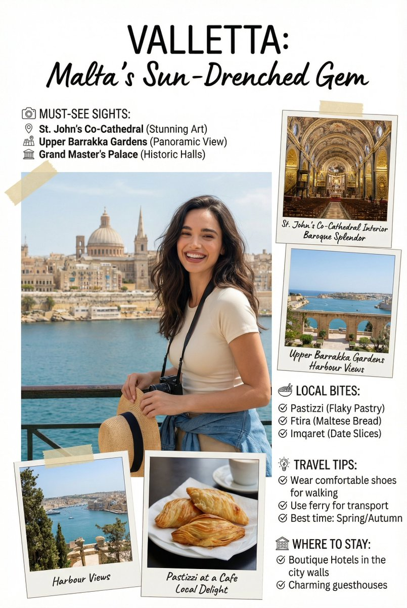 |

**Indicación:**

```
Create image of Magazine feature article [travel] guide page, cute, information dense photo book style magazine feature article page. Add all necessary sections, tips, recommendations, information. add photos for any sections and recommendations if you like. Place the attached person at the precise location of [city, country]. Seamlessly blend the attached person as if they are sightseeing. Approach this task with the understanding that this is a critical, information rich page that will significantly influence visitor numbers, text accuracy is important. Fully use the entire [9:16] page. NEGATIVE PROMPT: coordinate texts @swiat_ai @ProfitAII
```

<!-- Case 21: analyze this photo and give me a detailed JSON prompt that recreates it. brea... (by @pavellaslov) -->
### Case 21: [analyze this photo and give me a detailed JSON prompt that recreates it. brea...](https://x.com/pavellaslov/status/2047182214304055339?utm_source=github&utm_medium=readme&utm_campaign=awesome-gpt-image-2-prompts) (by [@pavellaslov](https://x.com/pavellaslov))

| Output |
| :----: |
| 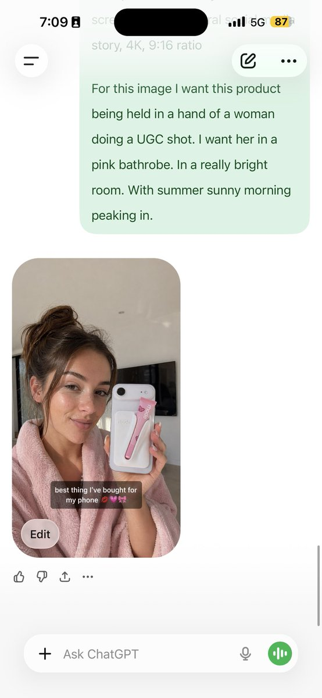 |

**Indicación:**

```
analyze this photo and give me a detailed JSON prompt that recreates it. break down the color grading and every exact color in the photo

(use Opus, not Sonnet. Opus has stronger visual analysis and writes more detailed JSON)

paste that JSON into ChatGPT
upload your product image and prompt:
using this JSON as reference, generate a person holding my product
save that generated photo as your character reference

attach it to every future generation for facial consistency

you now have a consistent UGC model that works across any product

the JSON controls the lighting and color grading. GPT image-2 handles the character. you control the product placement.

the #1 tell on AI photos is flat colors and a grainy look. this method removes both.
5 minutes to set up. unlimited variations after.
```

<!-- Case 22: CALMING GREEN TEA Film Kit displayed frontally, the open box shows soft sage-... (by @ZaraIrahh) -->
### Case 22: [CALMING GREEN TEA Film Kit displayed frontally, the open box shows soft sage-...](https://x.com/ZaraIrahh/status/2047180061657452601?utm_source=github&utm_medium=readme&utm_campaign=awesome-gpt-image-2-prompts) (by [@ZaraIrahh](https://x.com/ZaraIrahh))

| Output |
| :----: |
| 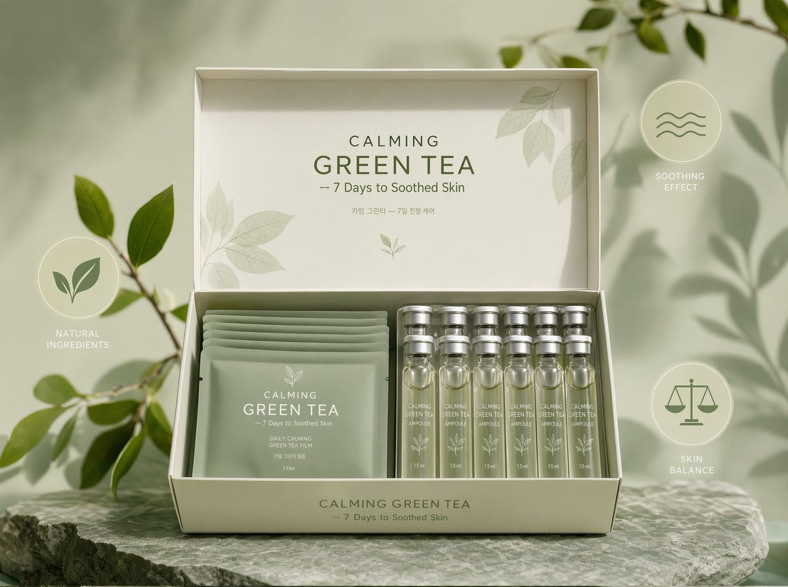 |

**Indicación:**

```
CALMING GREEN TEA Film Kit displayed frontally, the open box shows soft sage-green film pouches and translucent ampoules with matte silver caps, product placed centrally with clear branding CALMING GREEN TEA -- 7 Days to Soothed Skin, pastel green background with botanical graphic accents, three minimal icons (leaf, wave, balance) floating around the product to emphasize benefits, photographic, hyper detailed, ultra realistic, lifelike, 8k, high detail, soft professional lighting.
```

<!-- Case 23: Ultra-realistic product photography of a rich strawberry soft-serve ice cream... (by @ZaraIrahh) -->
### Case 23: [Ultra-realistic product photography of a rich strawberry soft-serve ice cream...](https://x.com/ZaraIrahh/status/2047179916161212542?utm_source=github&utm_medium=readme&utm_campaign=awesome-gpt-image-2-prompts) (by [@ZaraIrahh](https://x.com/ZaraIrahh))

| Output |
| :----: |
| 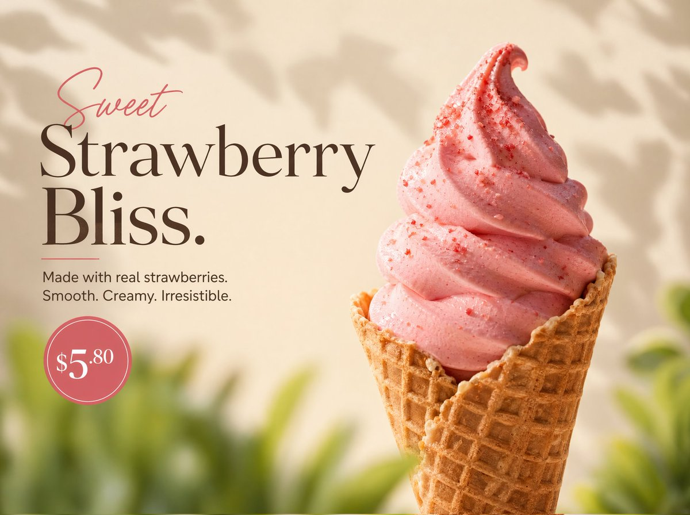 |

**Indicación:**

```
Ultra-realistic product photography of a rich strawberry soft-serve ice cream in a crispy waffle cone, styled with a clean, modern premium aesthetic. The soft serve is a vibrant natural pink, thick and creamy, sculpted into a smooth swirl with a softly curled peak, lightly topped with delicate strawberry dust or tiny fruit specks for a fresh, appetizing look. The cone has a rustic, crunchy texture with slightly uneven edges for an artisanal feel.
The background is soft beige with natural sunlight casting subtle leaf shadows, creating a calm, organic atmosphere. Include softly blurred greenery in the foreground for depth. The composition is minimal, balanced, and uses negative space effectively, similar to high-end American food brand ads.
On the left side, include modern English typography in a clean, elegant layout (not vertical).
Main headline:
Sweet Strawberry Bliss.
Supporting line (smaller text):
Made with real strawberries. Smooth. Creamy. Irresistible.
Add a small circular badge showing the price:
$5.80.
Lighting: soft natural daylight, warm highlights, shallow depth of field, high-end commercial food photography style.
Mood: fresh, premium, modern, and inviting — aligned with upscale U.S. dessert branding.
```

<!-- Case 24: A hyper-realistic UI/UX mockup displayed on a slim modern laptop placed on a ... (by @ZaraIrahh) -->
### Case 24: [A hyper-realistic UI/UX mockup displayed on a slim modern laptop placed on a ...](https://x.com/ZaraIrahh/status/2047179669011616172?utm_source=github&utm_medium=readme&utm_campaign=awesome-gpt-image-2-prompts) (by [@ZaraIrahh](https://x.com/ZaraIrahh))

| Output |
| :----: |
|  |

**Indicación:**

```
A hyper-realistic UI/UX mockup displayed on a slim modern laptop placed on a minimal wooden desk with soft natural daylight. The screen shows a clean SaaS dashboard with elegant typography, glassmorphism cards, smooth gradients, subtle drop shadows, and neatly spaced components. Visible charts, analytics panels, sidebar navigation, and micro-interactions. Realistic macOS-style window frame, soft reflections on the screen, shallow depth of field, cozy workspace atmosphere, shot in photorealistic product photography style, ultra-detailed.
```

<!-- Case 25: Ultra-realistic cinematic DSLR photograph of an 18-year-old handsome young ma... (by @harboriis) -->
### Case 25: [Ultra-realistic cinematic DSLR photograph of an 18-year-old handsome young ma...](https://x.com/harboriis/status/2047175250761433416?utm_source=github&utm_medium=readme&utm_campaign=awesome-gpt-image-2-prompts) (by [@harboriis](https://x.com/harboriis))

| Output |
| :----: |
| 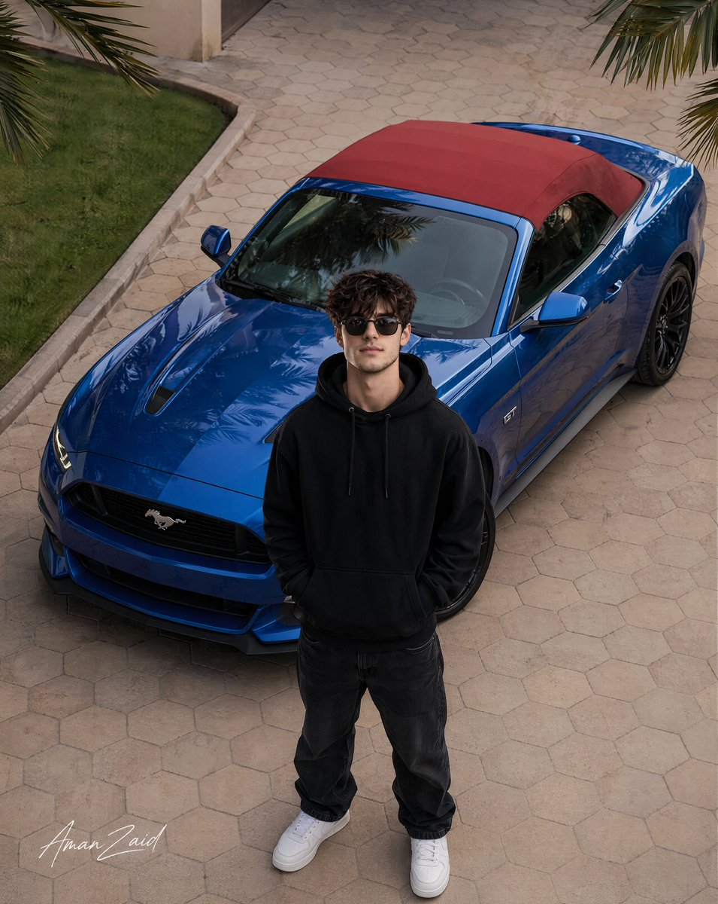 |

**Indicación:**

```
Ultra-realistic cinematic DSLR photograph of an 18-year-old handsome young man with a slim skinny body, lean physique, narrow shoulders and waist, standing confidently in front of a blue 2017 Ford Mustang GT Convertible with a bold red soft top roof, captured from a high-angle aerial perspective exactly like a luxury driveway photoshoot. Keep face 100% identical to reference image with exact facial structure, natural skin texture, realistic pores, authentic expression, no beautification, no facial modification. Same modern textured side-swept quiff hairstyle with heavy natural volume on top, deep side flow, messy yet controlled texture, soft matte finish, visible natural hair strands, softly blended sides.

The subject stands centered near the front bumper of the Mustang GT, hands inside hoodie pockets, relaxed shoulders, straight posture, slight head tilt upward toward camera, confident calm expression, wearing oversized premium black hoodie with realistic cotton texture, natural folds, hanging drawstrings, loose dark washed black denim jeans with soft wrinkles and stacked hems, clean white sneakers with realistic leather texture and sole details, black slim rectangular sunglasses.

Car must be a detailed 2017 Ford Mustang GT Convertible, metallic electric blue paint, glossy reflections on hood, visible Mustang pony grille emblem, aggressive headlights, muscular hood sculpting, aerodynamic front bumper, black alloy wheels, premium red convertible fabric roof, realistic windshield reflections, detailed side mirrors, authentic tire tread, showroom-clean finish

Scene set in an upscale villa driveway with light beige hexagonal stone pavement, curved border with fresh green grass on left side, tropical palm leaves entering frame from top corners, subtle luxury outdoor atmosphere. Soft natural daylight, diffused afternoon lighting, realistic shadows under car and body, soft reflections on paintwork, cinematic premium color grading, natural contrast, shallow depth separation while maintaining environment clarity. Shot on 35mm lens, vertical composition, full body framing, crisp details, hyper-realistic DSLR quality, zero Al look, natural skin rendering, realistic hair strands, fabric texture, stone surface texture, luxury lifestyle mood. stylish text AmanZaid at the bottom-left corner, signature style

Negative Prompt:

face changed, different identity, beautified face, edited face, smooth plastic skin, fake skin glow, wrong hairstyle, short hair, fade haircut, buzzcut, messy deformed hair, female features, muscular body, fat body, broad shoulders, bad anatomy, long neck, short legs, extra fingers, missing fingers, mutated hands, distorted arms, broken posture, crossed eyes, lazy eye, bad sunglasses, blurry face, low resolution, pixelated, noisy image, overexposed, underexposed, harsh shadows, unrealistic reflections, fake car shape, wrong car model, damaged car, extra wheels, warped Mustang logo, incorrect. proportions, bad pavement texture, background artifacts, duplicate objects, watermark, logo errors, text artifacts, cropped feet, cut car, unnatural perspective, CGI render, cartoon style, painting, Al artifacts, oversaturated colors, motion blur, lens distortion 1664x2080-ar 4:5
```

## Casos de Posters e Ilustracion

<!-- Case 1: Boston Spring 2026 City Poster (by @BubbleBrain) -->
### Case 1: [Boston Spring 2026 City Poster](https://x.com/BubbleBrain/status/2045358053831172358) (by [@BubbleBrain](https://x.com/BubbleBrain))

| Output |
| :----: |
| <a href="https://evolink.ai/gpt-image-2?utm_source=github&utm_medium=picture&utm_campaign=awesome-gpt-image-2-prompts" target="_blank" rel="noopener noreferrer"></a> |

**Indicación:**

```
A striking Spring 2026 city poster for Boston with an elegant celebratory mood and a bold contemporary design. On a clean off-white textured background with large areas of negative space, a miniature single sculler rows across the lower right corner of the image on a narrow ribbon of reflective water. The wake from the oar sweeps upward in a dynamic calligraphic curve, gradually transforming into the Charles River and then into a dreamlike hand-painted panorama of Boston. Inside this flowing river-shaped composition are iconic Boston elements: the Back Bay skyline, Beacon Hill brownstones, Acorn Street, Boston Public Garden, Swan Boats, Zakim Bridge, Fenway-inspired details, historic brick architecture, harbor ferries, and the city’s waterfront atmosphere. Soft morning fog, golden spring light, subtle festive accents in crimson and gold, rich detail, layered depth, sophisticated city-poster aesthetics, fresh and refined, visually powerful but not overcrowded. Elegant typography in the lower left reads “SPRING 2026” with a vertical slogan “BOSTON, A CITY OF RIVER, MEMORY, AND INVENTION”, text clear and beautifully composed, premium graphic design, 9:16
```
<!-- Case 2: Vintage Amalfi Travel Poster (by @WolfRiccardo) -->
### Case 2: [Vintage Amalfi Travel Poster](https://x.com/WolfRiccardo/status/2044562722491121718) (by [@WolfRiccardo](https://x.com/WolfRiccardo))

| Output |
| :----: |
| <a href="https://evolink.ai/gpt-image-2?utm_source=github&utm_medium=picture&utm_campaign=awesome-gpt-image-2-prompts" target="_blank" rel="noopener noreferrer"></a> |

**Indicación:**

```
Modern pencil illustration of Vintage travel poster illustration of the Amalfi Coast, Italy, panoramic coastal cliff road scene, classic 1960s white car driving along a curved seaside road, deep blue Mediterranean sea with small sailboats, colorful pastel hillside village, bright blue sky with soft clouds, lemon tree branches with vibrant yellow lemons framing the foreground, warm summer sunlight, bold vibrant colors, retro 1950s travel poster style, cinematic composition, high detail, screen print texture, graphic illustration. Hand-drawn style, illustration with loose strokes and defined contours. High-contrast color palette, maintaining chromatic harmony between background and elements. Contemporary and decorative aesthetic.
```
<!-- Case 3: Chengdu Food Map Illustration (by @Panda20230902) -->
### Case 3: [Chengdu Food Map Illustration](https://x.com/Panda20230902/status/2045396918965285111) (by [@Panda20230902](https://x.com/Panda20230902))

| Output |
| :----: |
| <a href="https://evolink.ai/gpt-image-2?utm_source=github&utm_medium=picture&utm_campaign=awesome-gpt-image-2-prompts" target="_blank" rel="noopener noreferrer"></a> |

**Indicación:**

```
一张手绘风格的城市美食地图，以成都为主题。画面以鸟瞰视角的手绘简化城市地图为底，标注主要道路和地标但不追求精确比例而是追求可爱的手绘感。地图上分布着 12 个美食地点的精致手绘小插画：春熙路的串串香（一把竹签插着各种食材冒着热气）、宽窄巷子的三大炮（三个糯米团子飞向铜盘）、建设路的蛋烘糕（金黄酥脆正在翻面）、玉林路的火锅（九宫格锅翻滚冒泡）等，每个插画约占地图的 5% 面积，旁边用手写体标注店名和一句推荐语"凌晨两点还在排队的那家"。地图边缘用手绘藤蔓和辣椒装饰形成边框。右下角有一个手绘指南针和图例说明。左上角标题"成都·吃货暴走地图"使用胖圆的手绘美术字配辣椒装饰。整体画风为水彩+彩铅混合的手绘质感，颜色以暖色系（辣椒红、姜黄、翠绿）为主，图片比例 1:1。
```
<!-- Case 4: Chinese Minimalist S-Shaped Poster (by @liyue_ai) -->
### Case 4: [Chinese Minimalist S-Shaped Poster](https://x.com/liyue_ai/status/2045368305079447853) (by [@liyue_ai](https://x.com/liyue_ai))

| Output |
| :----: |
| <a href="https://evolink.ai/gpt-image-2?utm_source=github&utm_medium=picture&utm_campaign=awesome-gpt-image-2-prompts" target="_blank" rel="noopener noreferrer"></a> |

**Indicación:**

```
极简新中式美学风格，画面以淡雅的灰白色为底，呈现出一种纸艺剪影般的立体感。
一条S形蜿蜒的裂痕状边缘将画面分割，仿佛撕开了一层纸面，露出内部色彩斑斓的东方山水景象。
裂口内，一条蜿蜒的河流自上而下贯穿整个构图，河水以深浅不一的蓝色渲染，层次分明，仿佛流动的丝带。
河岸两侧点缀着青翠的山丘与梯田，色彩柔和，绿红交织，展现出田园的宁静之美。
沿河而建的古风建筑错落有致，飞檐翘角，白墙黛瓦，在光影的映衬下更显古朴典雅。
岸边树木葱茏，枝叶轻盈，一艘小船静泊于水中央，增添了几分悠然意境。
整体构图呈S形曲线，富有韵律感，仿佛自然与人文的和谐共生。
画作边缘采用撕纸效果，营造出立体浮雕般的视觉体验。
下方题字“东方美学”以黑色楷体书写，日期“2026/04/18”与红色印章相呼应，底部“CHINA”字样庄重醒目，署名“@LIYUE”低调收尾，整体氛围静谧深远，充满诗意与哲思。
```
<!-- Case 5: 2026 Spring Guangzhou City Poster (by @liyue_ai) -->
### Case 5: [2026 Spring Guangzhou City Poster](https://x.com/liyue_ai/status/2045332620352119274) (by [@liyue_ai](https://x.com/liyue_ai))

| Output |
| :----: |
| <a href="https://evolink.ai/gpt-image-2?utm_source=github&utm_medium=picture&utm_campaign=awesome-gpt-image-2-prompts" target="_blank" rel="noopener noreferrer"></a> |

**Indicación:**

```
一张充满新春喜庆氛围但不失高雅格调的 2026 城市宣传海报。
双重曝光，构图延续了S型的流动感；
在纯白的纹理背景右下角，一个身穿中国传统服饰的微缩人物正在挥舞着一条长长的红色丝绸舞带，这条红绸在空中舞动，不仅展现出丝绸的柔顺质感，更在向左上方飘动的过程中，奇幻地变形成了一条壮丽的山脉河流。
在这条“河流”中，叠加了一个有山有海河的广州城市手绘图，国潮，景色尽在眼底，壮阔雄伟，令人震撼。
广州的地标建筑(广州塔，珠江新城建筑群，珠江, 广州城里古建筑，游轮，白云山）。
云雾环绕，仙气缥缈，色彩丰富，结构复杂，细节丰富，但因为大面积的留白，画面依然显得清新脱俗，左下角排版着“SPRING 2026”和竖排的宣传语，整体寓意“千年商都，魅力广州”。
文字排版优美，大方，字迹清晰完整，尺寸9:16。
```

<!-- Case 7: Doodle Sketch AI Builder (by @blanplan) -->
### Case 7: [Doodle Sketch AI Builder](https://x.com/blanplan/status/2045190582453350748) (by [@blanplan](https://x.com/blanplan))

| Output |
| :----: |
| <a href="https://evolink.ai/gpt-image-2?utm_source=github&utm_medium=picture&utm_campaign=awesome-gpt-image-2-prompts" target="_blank" rel="noopener noreferrer"></a> |

**Indicación:**

```
以涂鸦速写风表现【一个厉害的AI builder】，整体呈现快速勾勒、自由变形、即兴手绘与草稿式的视觉效果。线条随手、夸张、可粗细不一，略显凌乱但具有节奏和表现力，强调概括、夸张、趣味和随性，而不是严谨写实或精细刻画。  颜色采用粗糙、干刷感明显的块面表现，可保留不均匀的涂抹痕迹、刷痕、飞白与覆盖感，色彩根据【主题/主体】自动适配，但整体保持涂鸦式、速写式、概括式的表达。不要透明水彩晕染效果，不要细腻水彩过渡，不要纸纹理，不要柔和雾化，不要梦幻质感。  背景以留白为主，保持简洁、轻松、未完成感和设计感，可加入少量辅助性符号、箭头、记号、圈画、重复线、随手写的文字或其他涂鸦元素，以增强速写本或随笔式视觉语言，但不可过于拥挤，不可破坏主体和留白气质。  画面内容不需要预先写清楚，由【一个厉害的AI builder】自动推演并生成最适合的主体形象、动作、相关元素、符号或简化场景，整体保持统一的涂鸦速写风和夸张概括的表现方式，避免复杂写实背景和过度铺陈。 画面中需自然加入专属签名“BlanPlan”，作为画面的一部分，位置低调但清晰，可放在左下角、右下角或标题附近，风格需与整体版式统一，像作品署名或设计落款；签名字体精致、克制、高级，不可过大，不可破坏主体构图，不可显得突兀或廉价。
```
<!-- Case 8: Futuristic Mandala Illustration (by @4WEB1) -->
### Case 8: [Futuristic Mandala Illustration](https://x.com/4WEB1/status/2045390207072256179) (by [@4WEB1](https://x.com/4WEB1))

| Output |
| :----: |
| <a href="https://evolink.ai/gpt-image-2?utm_source=github&utm_medium=picture&utm_campaign=awesome-gpt-image-2-prompts" target="_blank" rel="noopener noreferrer"></a> |

**Indicación:**

```
曼荼羅の近未来SF版を描いて
```
<!-- Case 9: Super Famicom Poster Style (by @lilimliliychan) -->
### Case 9: [Super Famicom Poster Style](https://x.com/lilimliliychan/status/2045114760937804187) (by [@lilimliliychan](https://x.com/lilimliliychan))

| Output |
| :----: |
| <a href="https://evolink.ai/gpt-image-2?utm_source=github&utm_medium=picture&utm_campaign=awesome-gpt-image-2-prompts" target="_blank" rel="noopener noreferrer"></a> |

**Indicación:**

```
小悪魔リリムリリィちゃんが　スーパーファミコンのゲームだったときのポスターを考えて
```

<!-- Case 10: Browser Game Ad Creative Poster (by @llllegend0620) -->
### Case 10: [Browser Game Ad Creative Poster](https://x.com/llllegend0620/status/2045963764466688065) (by [@llllegend0620](https://x.com/llllegend0620))

| Output |
| :----: |
| <a href="https://evolink.ai/gpt-image-2?utm_source=github&utm_medium=picture&utm_campaign=awesome-gpt-image-2-prompts" target="_blank" rel="noopener noreferrer"></a> |

**Indicación:**

```
以下の文字を必ず入れて、1:1のポスターを作成してください。書籍・講座・イベント告知に使える、プロの広告デザイナーが作ったような高品質な仕上がりにしてください。

広告クリエイティブ制作
思いついたら、もう遊べる。 AI×ブラウザゲームづくりは、マジで楽しい。 むずかしそうで、実ははじめやすい。 コードがわからなくても、はじめの一本は作れる
```

<!-- Case 11: Surreal Koi Nebula Illustration (by @liyue_ai) -->
### Case 11: [Surreal Koi Nebula Illustration](https://x.com/liyue_ai/status/2045875219307655337) (by [@liyue_ai](https://x.com/liyue_ai))

| Output |
| :----: |
| <a href="https://evolink.ai/gpt-image-2?utm_source=github&utm_medium=picture&utm_campaign=awesome-gpt-image-2-prompts" target="_blank" rel="noopener noreferrer"></a> |

**Indicación:**

```
一幅超现实主义数字插画风格，采用低角度仰拍视角。画面描绘了一条巨型彩色锦鲤遨游在梦幻般的星云中，四周环绕着色彩鲜艳的星云与气泡。画面中央还站着一个小人，背对观众，神情平静地仰望空中这条巨大的锦鲤，锦鲤头向下看着小人。整体画面呈现出强烈的大小对比，氛围空灵又梦幻。比例9:16
```

<!-- Case 12: Ink-Curve Guangzhou Aesthetics Poster (by @liyue_ai) -->
### Case 12: [Ink-Curve Guangzhou Aesthetics Poster](https://x.com/liyue_ai/status/2045873940883808523) (by [@liyue_ai](https://x.com/liyue_ai))

| Output |
| :----: |
| <a href="https://evolink.ai/gpt-image-2?utm_source=github&utm_medium=picture&utm_campaign=awesome-gpt-image-2-prompts" target="_blank" rel="noopener noreferrer"></a> |

**Indicación:**

```
纯黑深邃底色，一条粗壮有力的墨色书法 S 型曲线自画面一端蜿蜒贯穿至另一端，构成整幅画面的视觉骨架与叙事动线。曲线上方是一只透明质感的画眉鸟，内部映射传统建筑叠影与蓝绿色光流；沿曲线错落分布广州地标与古典建筑序列，前景有白鹤与湖面，远景为层叠山峦。整体采用非线性透视、冷色调主导、暖色点缀，东方美学与现代意象交融，8K 超高清渲染，比例 9:16。
```

<!-- Case 13: Guangdong Super League Invitation Poster (by @liyue_ai) -->
### Case 13: [Guangdong Super League Invitation Poster](https://x.com/liyue_ai/status/2045772039521542202) (by [@liyue_ai](https://x.com/liyue_ai))

| Output |
| :----: |
| <a href="https://evolink.ai/gpt-image-2?utm_source=github&utm_medium=picture&utm_campaign=awesome-gpt-image-2-prompts" target="_blank" rel="noopener noreferrer"></a> |

**Indicación:**

```
广东省城市足球超级联赛（粤超）邀请函海报设计，比例 9:16。S 型流动构图，以发光足球和动态能量流贯穿画面，沿动线融合广州塔、深圳平安金融中心、珠海渔女雕像、岭南建筑、佛山武术剪影、中山文化符号、潮汕英歌舞与清远山水。现代国潮高级海报风格，中国红主视觉，青蓝辅助，金色高光，带完整中文排版与电影级光影。
```

<!-- Case 14: Spring 2026 Guangzhou Promo Poster (by @grok) -->
### Case 14: [Spring 2026 Guangzhou Promo Poster](https://x.com/grok/status/2046012437086818395) (by [@grok](https://x.com/grok))

| Output |
| :----: |
| <a href="https://evolink.ai/gpt-image-2?utm_source=github&utm_medium=picture&utm_campaign=awesome-gpt-image-2-prompts" target="_blank" rel="noopener noreferrer"></a> |

**Indicación:**

```
一张充满新春喜庆但高雅的 2026 广州城市宣传海报，9:16 竖版，双重曝光，S 型流动构图。纯白纹理背景，右下角微缩传统服饰人物挥舞长红绸，红绸变形成山脉河流，内部叠加广州全景：广州塔、珠江新城、珠江、游轮、古建筑与白云山。左下角排版 “SPRING 2026” 与竖排 “千年商都 魅力广州”。
```

<!-- Case 15: Epic Silhouette World Poster (by @Ghhhh3owi) -->
### Case 15: [Epic Silhouette World Poster](https://x.com/Ghhhh3owi/status/2045803217251102897) (by [@Ghhhh3owi](https://x.com/Ghhhh3owi))

| Output |
| :----: |
| <a href="https://evolink.ai/gpt-image-2?utm_source=github&utm_medium=picture&utm_campaign=awesome-gpt-image-2-prompts" target="_blank" rel="noopener noreferrer"></a> |

**Indicación:**

```
收藏版史诗海报，人物侧脸剪影中生长出完整世界观与经典场景。整体偏电影海报加梦幻水彩插画风，安静、宏大、神圣、怀旧，带纸张颗粒、轻雾感、飞白刷痕与高级留白。
```

<!-- Case 24: Spring Guangzhou City Poster (by @alanlovelq) -->
### Case 24: [Spring Guangzhou City Poster](https://x.com/alanlovelq/status/2045484598487060917) (by [@alanlovelq](https://x.com/alanlovelq))

| Output |
| :----: |
| <a href="https://evolink.ai/gpt-image-2?utm_source=github&utm_medium=picture&utm_campaign=awesome-gpt-image-2-prompts" target="_blank" rel="noopener noreferrer"></a> |

**Indicación:**

```
一张充满新春喜庆氛围但不失高雅格调的 2026 城市宣传海报。
双重曝光，构图延续了S型的流动感；
在纯白的纹理背景右下角，一个身穿中国传统服饰的微缩人物正在挥舞着一条长长的红色丝绸舞带，这条红绸在空中舞动，不仅展现出丝绸的柔顺质感，更在向左上方飘动的过程中，奇幻地变形成了一条壮丽的山脉河流。
在这条“河流”中，叠加了一个有山有海河的广州城市手绘图，国潮，景色尽在眼底，壮阔雄伟，令人震撼。
广州的地标建筑(广州塔，珠江新城建筑群，珠江, 广州城里古建筑，游轮，白云山）。
云雾环绕，仙气缥缈，色彩丰富，结构复杂，细节丰富，但因为大面积的留白，画面依然显得清新脱俗，左下角排版着“SPRING 2026”和竖排的宣传语，整体寓意“千年商都，魅力广州”。
文字排版优美，大方，字迹清晰完整，尺寸9:16。
```

<!-- Case 26: Qiongqi Eastern Aesthetics Poster (by @liyue_ai) -->
### Case 26: [Qiongqi Eastern Aesthetics Poster](https://x.com/liyue_ai/status/2045506567735558336) (by [@liyue_ai](https://x.com/liyue_ai))

| Output |
| :----: |
| <a href="https://evolink.ai/gpt-image-2?utm_source=github&utm_medium=picture&utm_campaign=awesome-gpt-image-2-prompts" target="_blank" rel="noopener noreferrer"></a> |

**Indicación:**

```
极简主义，新中式风格立体图形设计，图像下端有楷体中国文字：“东方美学”，“2026/04/18”，署名 “CHINA”，和“@LIYUE"；
平整纯白色的亚光质感厚艺术纸上绘充满东方诗意氛围的山水创意画，不规则的撕纸效果；
中国的神兽：穷奇，身形图案完整，美轮美奂，，线条柔美灵动,眼睛炯炯有神，威严的神态，优雅的姿势，奢华装饰艺术，中国传统纹饰；
荧光蓝色线条，0.5mm极细金色金属质感勾边，泼白墨大笔触，色彩渲染，红底，蓝色的浪漫诗意视觉；
冷暖光交织的梦幻唯美场景，强烈的光影对比氛围，花轻舞的时光叙事，东风禅意，画面有大面积留白，框架构图，底部留白，细节清晰。
```

<!-- Case 27: Guangzhou Paper-Cut City Poster (by @liyue_ai) -->
### Case 27: [Guangzhou Paper-Cut City Poster](https://x.com/liyue_ai/status/2045527750606487877) (by [@liyue_ai](https://x.com/liyue_ai))

| Output |
| :----: |
| <a href="https://evolink.ai/gpt-image-2?utm_source=github&utm_medium=picture&utm_campaign=awesome-gpt-image-2-prompts" target="_blank" rel="noopener noreferrer"></a> |

**Indicación:**

```
以珠江新城现代都市景观为灵感的剪纸艺术，通过精巧的镂空手法在一整幅纸上，立体刻画广州塔、东西双塔等地标建筑与繁华城景。
所有建筑与元素均以流畅的线条与结构相连，无孤立部分，构成一幅完整的都市画卷。
画面采用金属箔或光泽纸材质，表面带有细腻的明暗光泽，在光照下呈现柔和的高光与阴影，仿佛被城市灯光轻轻照亮。
背景以虚化的珠江新城天际线为衬，点缀隐约可见的花城广场与树木轮廓，整体透出现代浪漫的氛围。
作品中巧妙融入轻盈的蒲公英绒毛或星光般的动态光点，象征梦想与活力在这座新城中飘散飞扬。整体呈现8K超高清视觉，细节丰富，真实而富有艺术感染力。
```

<!-- Case 28: Extreme Perspective Typography Bridge (by @xpg0970) -->
### Case 28: [Extreme Perspective Typography Bridge](https://x.com/xpg0970/status/2045560665071579160) (by [@xpg0970](https://x.com/xpg0970))

| Output |
| :----: |
| <a href="https://evolink.ai/gpt-image-2?utm_source=github&utm_medium=picture&utm_campaign=awesome-gpt-image-2-prompts" target="_blank" rel="noopener noreferrer"></a> |

**Indicación:**

```
①场景 跨海大桥的侧面，dramatic cinematic angle。 巨型 bold sans-serif 文字「___②文字内容 跨海大桥」painted onto the surface of ___③主体物 无，从靠近镜头的前端开始，沿表面向远端 progressively foreshortens 逐渐透视压缩，letterforms conform to surface curvature 贴合物体曲面，surface-integrated not floating。 文字部分区域被 无___④前景遮挡物 无___ occluded and hidden，在间隙中露出， 形成 depth-layering 纵深穿插效果。 Oversized bright yellow + sharp orange outline，extreme perspective distortion aligned to vanishing point。Cinematic lighting, motion blur, poster-grade dynamic integrated typography, modern advertising aesthetics。
```

<!-- Case 31: Dreamy Watercolor Editorial Illustration (by @hmontilla_) -->
### Case 31: [Dreamy Watercolor Editorial Illustration](https://x.com/hmontilla_/status/2045513933096636575) (by [@hmontilla_](https://x.com/hmontilla_))

| Output |
| :----: |
| <a href="https://evolink.ai/gpt-image-2?utm_source=github&utm_medium=picture&utm_campaign=awesome-gpt-image-2-prompts" target="_blank" rel="noopener noreferrer"></a> |

**Indicación:**

```
Ilustración en acuarela de estilo onírico de [sujeto], con estética impresionista ligera, pinceladas sueltas y lavados translúcidos en tonos [color1] y [color2]. Difuminado suave sobre textura de papel prensado en frío, iluminación delicada, composición limpia, enfoque minimalista, sensación de calma, ligereza y belleza efímera, alta calidad, estilo editorial.
```

<!-- Case 32: Science Encyclopedia Vertical Poster (by @pfanis) -->
### Case 32: [Science Encyclopedia Vertical Poster](https://x.com/pfanis/status/2046413660147314714) (by [@pfanis](https://x.com/pfanis))

| Output |
| :----: |
| <a href="https://evolink.ai/gpt-image-2?utm_source=github&utm_medium=picture&utm_campaign=awesome-gpt-image-2-prompts" target="_blank" rel="noopener noreferrer"></a> |

**Indicación:**

```
Generate a high-quality vertical science popularization encyclopedia image based on [Theme].
```

<!-- Case 33: Journey to the West Chinese Comic (by @overseas58) -->
### Case 33: [Journey to the West Chinese Comic](https://x.com/overseas58/status/2046271877577097376) (by [@overseas58](https://x.com/overseas58))

| Output |
| :----: |
| <a href="https://evolink.ai/gpt-image-2?utm_source=github&utm_medium=picture&utm_campaign=awesome-gpt-image-2-prompts" target="_blank" rel="noopener noreferrer"></a> |

**Indicación:**

```
以中国连环画（小人书）的风格帮我绘制大闹天空
```

<!-- Case 34: Character Relationship Map Poster (by @MrLarus) -->
### Case 34: [Character Relationship Map Poster](https://x.com/MrLarus/status/2046263153546174935) (by [@MrLarus](https://x.com/MrLarus))

| Output |
| :----: |
| <a href="https://evolink.ai/gpt-image-2?utm_source=github&utm_medium=picture&utm_campaign=awesome-gpt-image-2-prompts" target="_blank" rel="noopener noreferrer"></a> |

**Indicación:**

```
请根据【主题】生成一张高设计感的人物关系图海报。
```

<!-- Case 35: New Chinese Ink Landscape Poster (by @liyue_ai) -->
### Case 35: [New Chinese Ink Landscape Poster](https://x.com/liyue_ai/status/2046215276249993720) (by [@liyue_ai](https://x.com/liyue_ai))

| Output |
| :----: |
| <a href="https://evolink.ai/gpt-image-2?utm_source=github&utm_medium=picture&utm_campaign=awesome-gpt-image-2-prompts" target="_blank" rel="noopener noreferrer"></a> |

**Indicación:**

```
新中式水墨山水海报，竖版9:16构图，东方极简美学风格，大面积留白，主题是春岚一叶红。
```

<!-- Case 36: AI Builder Doodle Sketch (by @opc_8838) -->
### Case 36: [AI Builder Doodle Sketch](https://x.com/opc_8838/status/2046162334440448339) (by [@opc_8838](https://x.com/opc_8838))

| Output |
| :----: |
| <a href="https://evolink.ai/gpt-image-2?utm_source=github&utm_medium=picture&utm_campaign=awesome-gpt-image-2-prompts" target="_blank" rel="noopener noreferrer"></a> |

**Indicación:**

```
以涂鸦速写风表现【一个厉害的AI builder】。
```

<!-- Case 38: Character Visual Vertical Poster (by @tebasaki3D) -->
### Case 38: [Character Visual Vertical Poster](https://x.com/tebasaki3D/status/2046371076402503709) (by [@tebasaki3D](https://x.com/tebasaki3D))

| Output |
| :----: |
| <a href="https://evolink.ai/gpt-image-2?utm_source=github&utm_medium=picture&utm_campaign=awesome-gpt-image-2-prompts" target="_blank" rel="noopener noreferrer"></a> |

**Indicación:**

```
『神層37区 特級執行官 神巫サバト』この名称のキャラクターと世界観に合ったビジュアルイメージを、プロのデザイナーとして縦長のポスターイメージとして制作して
```

<!-- Case 39: Science Encyclopedia Infographic (by @MrLarus) -->
### Case 39: [Science Encyclopedia Infographic](https://x.com/MrLarus/status/2046231542817497392) (by [@MrLarus](https://x.com/MrLarus))

| Output |
| :----: |
| <a href="https://evolink.ai/gpt-image-2?utm_source=github&utm_medium=picture&utm_campaign=awesome-gpt-image-2-prompts" target="_blank" rel="noopener noreferrer"></a> |

**Indicación:**

```
请根据【主题】生成一张高质量竖版「科普百科图」。 

这张图不是普通海报,也不是单纯插画,而是一张兼具“图鉴感、百科感、信息结构感、收藏感”的模块化科普信息图。整体风格参考高级博物图鉴、现代百科书页、生活方式知识卡和社交媒体高传播信息图的结合。

请让画面包含:
- 一个清晰漂亮的主题主视觉
- 若干局部特征放大细节
- 多个圆角模块化信息分区
- 清楚的标题层级与重点标签
- 简洁但丰富的百科内容
- 可视化评分、要点总结或Top 5模块

内容栏目请根据主题自动适配,优先从这些方向中选择并合理组合:
基础档案、分类信息、外观特征、习性/生态、形成机制/结构组成、生长或使用条件、养护或维护建议、风险与注意事项、适合人群或适用场景、优缺点对比、快速评分卡。

视觉要求:
浅色干净背景,柔和配色,轻阴影,精致小图标,圆角信息框,整洁排版,信息密度高但不拥挤,阅读体验好。整体必须像真正可以发布、阅读、收藏、系列化生产的科普百科卡,而不是广告图。

请不要做成普通商业宣传海报。要突出“知识整理 + 模块信息 + 图鉴式展示”的特征。
```

<!-- Case 40: Fictional Anime Movie Poster (by @seiiiiiiiiiiru) -->
### Case 40: [Fictional Anime Movie Poster](https://x.com/seiiiiiiiiiiru/status/2046509734954741780) (by [@seiiiiiiiiiiru](https://x.com/seiiiiiiiiiiru))

| Output |
| :----: |
| <a href="https://evolink.ai/gpt-image-2?utm_source=github&utm_medium=picture&utm_campaign=awesome-gpt-image-2-prompts" target="_blank" rel="noopener noreferrer"></a> |

**Indicación:**

```
架空のアニメ映画のポスターをGPT image2で作成。
```

<!-- Case 41: Product Ad Redesign (by @genel_ai) -->
### Case 41: [Product Ad Redesign](https://x.com/genel_ai/status/2046498264774791514) (by [@genel_ai](https://x.com/genel_ai))

| Output |
| :----: |
| <a href="https://evolink.ai/gpt-image-2?utm_source=github&utm_medium=picture&utm_campaign=awesome-gpt-image-2-prompts" target="_blank" rel="noopener noreferrer"></a> |

**Indicación:**

```
この商品広告をプロのデザイナー目線でリデザインして。
今のトレンド、ターゲットに合わせた洗練されたデザインで。
```

<!-- Case 42: Dark-Fantasy Guangzhou City Poster (by @liyue_ai) -->
### Case 42: [Dark-Fantasy Guangzhou City Poster](https://x.com/liyue_ai/status/2046243132774494607) (by [@liyue_ai](https://x.com/liyue_ai))

| Output |
| :----: |
| <a href="https://evolink.ai/gpt-image-2?utm_source=github&utm_medium=picture&utm_campaign=awesome-gpt-image-2-prompts" target="_blank" rel="noopener noreferrer"></a> |

**Indicación:**

```
平面插画,东方幻想风格高端城市海报设计,竖版9:16构图,整体采用对角线+S型流动构图,从左下向右上延展,画面以深邃黑色为背景,自上而下渐变至浓烈暗红色,形成强烈冷暖对比与空间纵深,背景带微弱星尘与颗粒质感。画面中央一条金色流动能量线条如火焰般蜿蜒贯穿,自底部向上延伸,具有流体质感、粒子光效与渐变高光,局部带细微能量碎屑与体积光。

金色流光中逐层浮现广州城市地标建筑群:广州塔为视觉核心,比例突出,周围融合珠江新城高楼群、猎德大桥及现代与岭南建筑元素,建筑采用“精细线描 + 金色发光体块”表现,轮廓清晰、细节丰富,在金色光晕映衬下仿佛悬浮于虚空,形成超现实空间层次,远景轻微雾化增强纵深感。

画面底部为一位东方白发女性形象,长发飘逸,如烟似雾,与金色流光自然衔接并逐渐融合,发丝半透明带渐变光感,姿态柔美,双目微闭,神情宁静,怀抱一束多彩鲜花,花间点缀微光粒子与星点效果,象征人与城市能量的精神连接,人物细节适度简化以突出整体设计感。

光影集中于金色流线、建筑与人物轮廓,形成强烈明暗对比与视觉聚焦,整体氛围宏大、神秘、具有东方神话意境且略带治愈感。色彩以黑与暗红为基底,高亮鎏金为主视觉强调,金色具备丰富明暗层次,辅以小面积高饱和花束色彩点缀,整体高级克制。

页面文字与画面融合排版:顶部居中宋体大字“广州·中国”,下方小字“2026/04/20”,再下方小字“LIYUE”,文字采用淡金色或柔和暖白色,与整体光影统一。高品质细节,电影级光影表现,体积光与粒子细节丰富,画面干净无噪点,超高清8K分辨率,商业级海报质感。
```
バックプロパゲーションについて詳しく図解して
```
デメニギスの体の構造を解説するカラー図鑑のページ
```

<!-- Case 45: Science Fiction Movie Poster (by @underwoodxie96) -->
### Case 45: [Science Fiction Movie Poster](https://x.com/underwoodxie96/status/2046514205529088501) (by [@underwoodxie96](https://x.com/underwoodxie96))

| Output |
| :----: |
| <a href="https://evolink.ai/gpt-image-2?utm_source=github&utm_medium=picture&utm_campaign=awesome-gpt-image-2-prompts" target="_blank" rel="noopener noreferrer"></a> |

**Indicación:**

```
Create a Science fiction movie poster
```

<!-- Case 46: Refreshing Summer Udon Ad (by @genel_ai) -->
### Case 46: [Refreshing Summer Udon Ad](https://x.com/genel_ai/status/2046501692246470871) (by [@genel_ai](https://x.com/genel_ai))

| Output |
| :----: |
| <a href="https://evolink.ai/gpt-image-2?utm_source=github&utm_medium=picture&utm_campaign=awesome-gpt-image-2-prompts" target="_blank" rel="noopener noreferrer"></a> |

**Indicación:**

```
少し暑くなってきた今の時期に、さわやかにさっぱりしたい、みずみずしさ、みたいなところをもっと強く感じたい。冷たいうどんやナス、つゆを口に含んだ時の爽快感、みたいなものをもっと感じるように
```

<!-- Case 47: Handwritten Medical Prescription Sheet (by @MrLarus) -->
### Case 47: [Handwritten Medical Prescription Sheet](https://x.com/MrLarus/status/2046514998965371144) (by [@MrLarus](https://x.com/MrLarus))

| Output |
| :----: |
| <a href="https://evolink.ai/gpt-image-2?utm_source=github&utm_medium=picture&utm_campaign=awesome-gpt-image-2-prompts" target="_blank" rel="noopener noreferrer"></a> |

**Indicación:**

```
生成一张手写中/西医药方图
```

<!-- Case 48: Silicon Valley 2026 Promo Poster (by @carsonyungos) -->
### Case 48: [Silicon Valley 2026 Promo Poster](https://x.com/carsonyungos/status/2046523198116889064) (by [@carsonyungos](https://x.com/carsonyungos))

| Output |
| :----: |
| <a href="https://evolink.ai/gpt-image-2?utm_source=github&utm_medium=picture&utm_campaign=awesome-gpt-image-2-prompts" target="_blank" rel="noopener noreferrer"></a> |

**Indicación:**

```
A refined 2026 Silicon Valley city promotional poster with a futuristic yet elegant atmosphere.

Double exposure composition, preserving an S-shaped sense of flowing movement. On a pure white textured background, in the lower-right corner, a miniature figure dressed in sleek modern techwear is releasing a long ribbon of luminous silver-blue light. The ribbon flows gracefully through the air, showing a soft silk-like texture, and as it drifts toward the upper-left, it magically transforms into a grand landscape of rolling hills, coastline, data streams, and illuminated urban terrain.

Within this flowing “river of light,” overlay a hand-drawn panoramic map of Silicon Valley, blending technology, nature, innovation, and California sunlight. The scene feels visionary, expansive, sophisticated, and inspiring.

Include iconic Silicon Valley and Bay Area elements: Stanford University arches, Apple Park, Google campus-inspired buildings, Meta-like glass offices, Tesla-style innovation imagery, venture capital offices on Sand Hill Road, Palo Alto tree-lined streets, San Jose skyline, the Santa Cruz Mountains, San Francisco Bay, highways, autonomous vehicles, startup labs, semiconductor patterns, AI data centers, and subtle circuit-board textures.

Surrounded by soft mist, golden California light, floating clouds, and delicate digital particles. Rich colors, complex structure, highly detailed, grand and breathtaking, yet still fresh and minimal because of the large areas of white space.

In the lower-left corner, elegant typography reads “SILICON VALLEY 2026” with a vertical promotional slogan: “Where Ideas Shape Tomorrow.” Beautiful editorial layout, graceful spacing, clear and complete lettering, premium city branding poster, cinematic lighting, sophisticated details, 9:16 aspect ratio.
```

<!-- Case 49: Japanese Supermarket Sale Flyer (by @weel_corp) -->
### Case 49: [Japanese Supermarket Sale Flyer](https://x.com/weel_corp/status/2046514558064586782) (by [@weel_corp](https://x.com/weel_corp))

| Output |
| :----: |
| <a href="https://evolink.ai/gpt-image-2?utm_source=github&utm_medium=picture&utm_campaign=awesome-gpt-image-2-prompts" target="_blank" rel="noopener noreferrer"></a> |

**Indicación:**

```
『賑やかで魅力的なスーパーマーケットの折り込みチラシの画像。上部には「特売」の大きな文字と今週の日付。カラフルな商品写真(野菜・果物・牛肉・鮮魚)、赤枠の価格タグ、「超目玉商品」「家計応援」のキャッチ...』
```

<!-- Case 50: Dark Epic Concept Poster (by @A9Quant) -->
### Case 50: [Dark Epic Concept Poster](https://x.com/A9Quant/status/2046224777208361126) (by [@A9Quant](https://x.com/A9Quant))

| Output |
| :----: |
| <a href="https://evolink.ai/gpt-image-2?utm_source=github&utm_medium=picture&utm_campaign=awesome-gpt-image-2-prompts" target="_blank" rel="noopener noreferrer"></a> |

**Indicación:**

```
围绕【主题】自动生成一张顶级暗黑史诗概念海报 / 电影感信息图海报。

唯一需要输入的变量只有:
【主题】:___特朗普的思考____ 

除【主题】之外,其余全部由 AI 自动适配完成,包括但不限于:
- 核心主体(自动判断更适合人物、守护者、战士、产品、器物、雕像、抽象象征或其他主视觉对象)
- 中央承载结构(自动判断更适合王座、石座、祭坛、机械基座、遗迹、高台或其他支撑体)
- 环境空间(自动判断更适合洞穴、神殿、废墟、深渊、地下宫殿、密室或其他封闭史诗空间)
- 上方开口与光源形式(自动判断更适合月光、神光、能量束、审判之光、圣光或其他单一强光)
- 象征元素(自动判断更适合骷髅、徽记、残碑、纹章、符文、能量环、神性符号等)
- 色彩体系
- 材质组合
- 标题、副标题、辅助文案
- 排版与整体叙事气质

【总风格】
高预算 90 年代好莱坞史诗大片海报气质,融合 cinematic matte painting、超写实摄影质感、极强明暗对比、厚重空间叙事、暗黑英雄主义与仪式感构图。整体必须像一张真正的电影主海报,而不是普通插画或电商图。

【核心结构锁定】
整张海报必须保留以下结构基因:
1. 一个巨大、压迫感极强的黑暗封闭空间
2. 一束从上方斜向切入的强烈体积光,作为画面的第一视觉秩序
3. 中央偏右或光束终点位置的核心主体与承载结构
4. 左下角作为高密度标题与信息锚点
5. 四周保留大量纯黑或近黑负空间,形成电影感呼吸区

【自动适配规则】
AI 必须依据【主题】自动推导最适合的视觉系统:
- 如果【主题】偏暗黑英雄、复仇、正义、孤独、宿命,则自动偏向石质王座、孤高人物、冷色神光、废墟或洞穴感空间
- 如果【主题】偏神秘、幽灵、潜行、幻影、夜行,则自动偏向月光、迷雾、冷蓝色体积光、深渊式黑暗空间
- 如果【主题】偏权力、统治、王者、秩序,则自动强化 throne / altar / crown-like symbol / ritual space 的表达
- 如果【主题】偏科技、AI、未来、机械,则自动将王座和空间替换为机械神座、能量基座、金属洞窟、工业神殿等未来化形态
- 如果【主题】偏产品、品牌、器物,则自动把核心主体替换为最合适的 hero object,并保留被神光审判式凸显的史诗构图

【画布与色彩系统】
- 背景底层必须是极深、近乎吞噬一切的黑暗空间
- 主环境色由 AI 根据【主题】自动决定,但整体必须克制,以暗色为主
- 强光区域色彩必须高度集中,只服务于体积光与主体高光
- 主题色 / 强调色只能集中用于主视觉核心,不允许全画面泛滥
- 必须建立明确的“黑暗底色 + 单一主光 + 少量主题强调色”的层级秩序

【构图与视觉重力】
- 采用强烈的斜向张力与向中心汇聚的视觉引导
- 视觉重力从上方光源强势落下,最终压在核心主体之上
- 主体必须处于被命运、审判、神性或权力照中的位置
- 边缘必须自然融入黑暗,不能出现无意义背景填充
- 所有元素必须服务于唯一的主叙事核心

【材质与光影】
- 不使用轮廓线,不使用平面化描边
- 完全依赖体积光、阴影切割、反射、高光、雾气、粉尘、湿润岩石或其他真实材质来建构画面
- 材质必须形成明显对比,例如:
  粗粝岩石 / 冷硬金属 / 柔韧织物 / 古老石雕 / 湿润表面 / 尘雾光柱
- 光束必须具有强烈 Tyndall effect,真实、厚重、可感知体积密度

【排版系统】
- 整体 80% 视觉,20% 文字
- AI 根据【主题】自动生成主标题、副标题和底部信息块
- 主标题应尽量简洁、有气势、有电影海报感
- 若主题更适合中文,则优先中文;若更适合英文,则自动英文;也可双语,但必须统一
- 主标题可沿光束垂直排布,仿佛由光本身构成
- 左下角设置一个高密度信息模块,包括副标题、小字信息、电影 credits 风格占位文字或品牌说明
- 文字必须锐利、干净、真实嵌入环境,不得廉价漂浮

【模块结构 —— 必须严格保持 3 块】
[MOD 1: TOP-TO-CENTER BEAM]
从顶部开口斜向切下的巨大体积光柱,作为第一视觉通道,并承载主标题或主视觉文字。

[MOD 2: CENTER-RIGHT CORE]
位于光束终点的核心主体与承载结构,形成整张海报的权力中心 / 命运中心 / 叙事中心。

[MOD 3: BOTTOM-LEFT TEXT]
位于左下角负空间中的高密度排版区,包含副标题、说明文字、credits 风格信息块、品牌信息或活动信息。

【作者署名】
在底部角落自然加入作者署名:
@a9quant
署名要小而清晰,精致、克制、高级,不喧宾夺主,像正式电影概念海报或艺术作品落款。

【输出要求】
输出为单张统一构图海报。
所有视觉系统必须内部一致,不能有风格污染。
画面必须具备:暗黑感、史诗感、压迫感、仪式感、命运感、电影完成度。
最大细节密度,超清,电影级,印刷级,高端成片质感。
```

<!-- Case 51: Pilates Studio Ad Poster (by @ck_igarashi) -->
### Case 51: [Pilates Studio Ad Poster](https://x.com/ck_igarashi/status/2046528889124728993) (by [@ck_igarashi](https://x.com/ck_igarashi))

| Output |
| :----: |
| <a href="https://evolink.ai/gpt-image-2?utm_source=github&utm_medium=picture&utm_campaign=awesome-gpt-image-2-prompts" target="_blank" rel="noopener noreferrer"></a> |

**Indicación:**

```
ピラティス教室の広告画像を作成したい テキストはよりユーザーが登録をするのに惹かれるような文言にし、画像内には女性がピラティスを実際に行っている様子を映して
```

<!-- Case 52: 6-Block Fashion Campaign Prompt Formula (by @anacoding) -->
### Case 52: [6-Block Fashion Campaign Prompt Formula](https://x.com/anacoding/status/2046904999045628114) (by [@anacoding](https://x.com/anacoding))

| Output |
| :----: |
| <a href="https://evolink.ai/gpt-image-2?utm_source=github&utm_medium=picture&utm_campaign=awesome-gpt-image-2-prompts" target="_blank" rel="noopener noreferrer">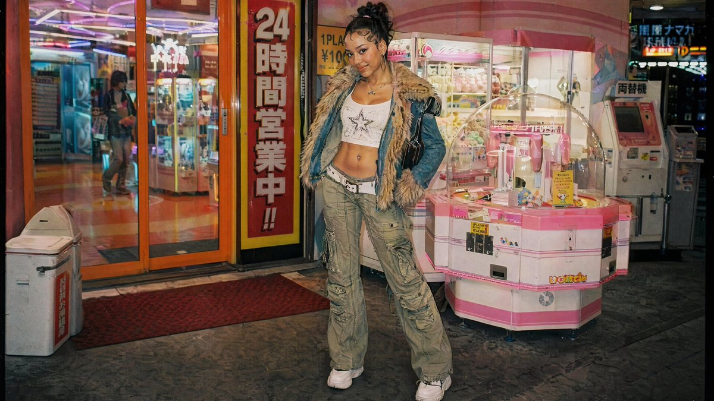</a> |

**Indicación:**

```
Old money Hamptons editorial, tall blonde woman late 20s, serene elegant expression, wearing cream cashmere cable sweater, pleated beige tennis skirt, pearl earrings, Hermès silk scarf, leather flats, Slim Aarons photography style, medium format film photography, sitting on a white wooden porch of a Cape Cod house, golden hour light, ocean in the background
```

> [!NOTE]
> Prompt structure shared in the thread: `[character] [person description] [outfit] [quality 1] [quality 2] [place]`.

<!-- Case 53: Sony A7 Exploded View Breakdown Prompt (by @iaPulse_) -->
### Case 53: [Sony A7 Exploded View Breakdown Prompt](https://x.com/iaPulse_/status/2046903739429097660) (by [@iaPulse_](https://x.com/iaPulse_))

| Output |
| :----: |
| <a href="https://evolink.ai/gpt-image-2?utm_source=github&utm_medium=picture&utm_campaign=awesome-gpt-image-2-prompts" target="_blank" rel="noopener noreferrer">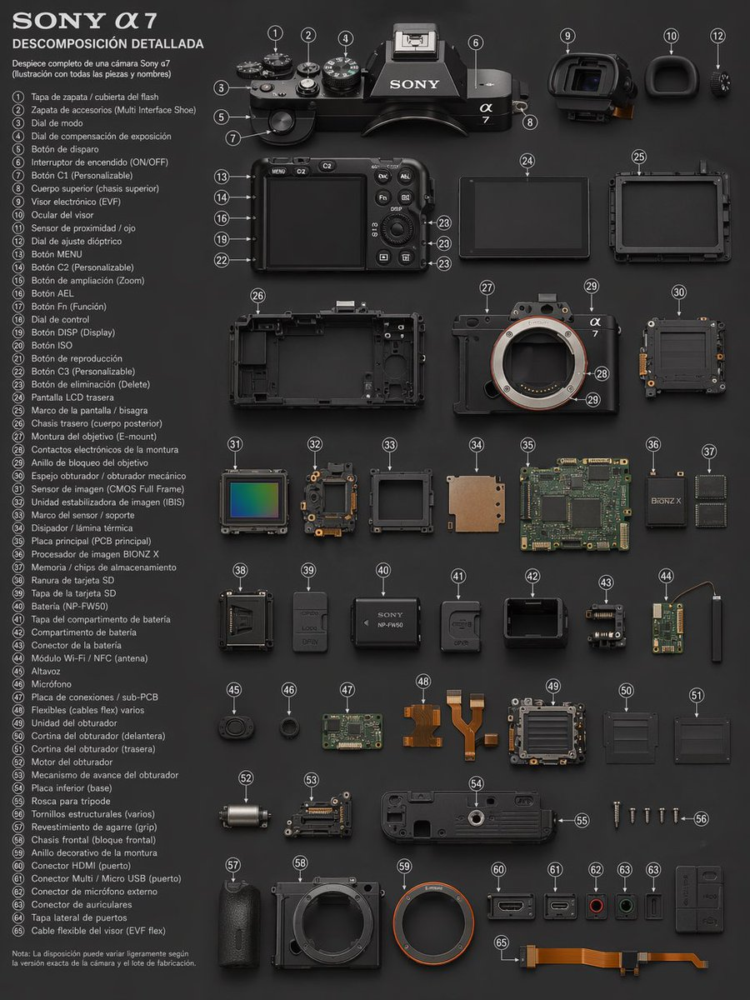</a> |

**Indicación:**

```
Descomposición detallada de una cámara de la marca Sony modelo A7 indicando todas sus piezas y con sus nombres.
```

<!-- Case 54: 1900 Istiklal Street Panorama Prompt (by @ai_gezgini) -->
### Case 54: [1900 Istiklal Street Panorama Prompt](https://x.com/ai_gezgini/status/2046903631509705030) (by [@ai_gezgini](https://x.com/ai_gezgini))

| Output |
| :----: |
| <a href="https://evolink.ai/gpt-image-2?utm_source=github&utm_medium=picture&utm_campaign=awesome-gpt-image-2-prompts" target="_blank" rel="noopener noreferrer">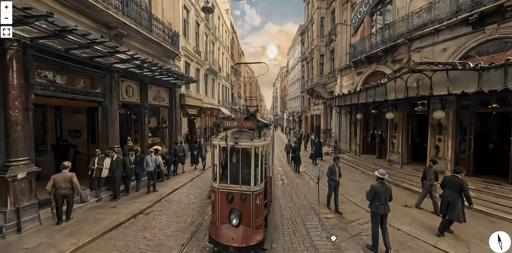</a> |

**Indicación:**

```
360 equirectangular image of Istiklal Street, Istanbul in 1900
```

<!-- Case 55: Ultra-Dense Information Design (by @EchoraContinuum) -->
### Case 55: [Ultra-Dense Information Design](https://x.com/EchoraContinuum/status/2046517163826246133) (by [@EchoraContinuum](https://x.com/EchoraContinuum))

| Output |
| :----: |
| <a href="https://evolink.ai/gpt-image-2?utm_source=github&utm_medium=picture&utm_campaign=awesome-gpt-image-2-prompts" target="_blank" rel="noopener noreferrer"></a> |

**Indicación:**

```
Generate somthing super complex and info dense...
```

<!-- Case 56: Cute Chinese Expeditionary Force Storyboard (by @RainHuangapp) -->
### Case 56: [Cute Chinese Expeditionary Force Storyboard](https://x.com/RainHuangapp/status/2046507931907080330) (by [@RainHuangapp](https://x.com/RainHuangapp))

| Output |
| :----: |
| <a href="https://evolink.ai/gpt-image-2?utm_source=github&utm_medium=picture&utm_campaign=awesome-gpt-image-2-prompts" target="_blank" rel="noopener noreferrer"></a> |

**Indicación:**

```
用可爱的风格讲述中国远征军的历史故事
用波普风格讲述金刚经
```

<!-- Case 57: Theme Science Encyclopedia Card (by @alanlovelq) -->
### Case 57: [Theme Science Encyclopedia Card](https://x.com/alanlovelq/status/2046378199681257920) (by [@alanlovelq](https://x.com/alanlovelq))

| Output |
| :----: |
| <a href="https://evolink.ai/gpt-image-2?utm_source=github&utm_medium=picture&utm_campaign=awesome-gpt-image-2-prompts" target="_blank" rel="noopener noreferrer"></a> |

**Indicación:**

```
请根据【主题】生成一张高质量竖版「科普百科图」。 

这张图不是普通海报,也不是单纯插画,而是一张兼具“图鉴感、百科感、信息结构感、收藏感”的模块化科普信息图。整体风格参考高级博物图鉴、现代百科书页、生活方式知识卡和社交媒体高传播信息图的结合。

请让画面包含:
- 一个清晰漂亮的主题主视觉
- 若干局部特征放大细节
- 多个圆角模块化信息分区
- 清楚的标题层级与重点标签
- 简洁但丰富的百科内容
- 可视化评分、要点总结或Top 5模块

内容栏目请根据主题自动适配,优先从这些方向中选择并合理组合:
基础档案、分类信息、外观特征、习性/生态、形成机制/结构组成、生长或使用条件、养护或维护建议、风险与注意事项、适合人群或适用场景、优缺点对比、快速评分卡。

视觉要求:
浅色干净背景,柔和配色,轻阴影,精致小图标,圆角信息框,整洁排版,信息密度高但不拥挤,阅读体验好。整体必须像真正可以发布、阅读、收藏、系列化生产的科普百科卡,而不是广告图。

请不要做成普通商业宣传海报。要突出“知识整理 + 模块信息 + 图鉴式展示”的特征。
```

<!-- Case 55: Chili Pork Cooking Flowchart (by @Kurt_Rousey466) -->
### Case 55: [Chili Pork Cooking Flowchart](https://x.com/Kurt_Rousey466/status/2046267707881029934) (by [@Kurt_Rousey466](https://x.com/Kurt_Rousey466))

| Output |
| :----: |
| <a href="https://evolink.ai/gpt-image-2?utm_source=github&utm_medium=picture&utm_campaign=awesome-gpt-image-2-prompts" target="_blank" rel="noopener noreferrer"></a> |

**Indicación:**

```
帮我制作辣椒炒肉这道菜的详细制作流程图,真实风格,适用于小红书图文比例
```

<!-- Case 56: Cinematic Infographic Concept Poster (by @A9Quant) -->
### Case 56: [Cinematic Infographic Concept Poster](https://x.com/A9Quant/status/2046228485841334559) (by [@A9Quant](https://x.com/A9Quant))

| Output |
| :----: |
| <a href="https://evolink.ai/gpt-image-2?utm_source=github&utm_medium=picture&utm_campaign=awesome-gpt-image-2-prompts" target="_blank" rel="noopener noreferrer"></a> |

**Indicación:**

```
请围绕【主题】自动生成一张顶级概念海报 / 信息图式电影海报。

唯一输入变量只有:
【主题】:__中国历史上的皇帝排名_         

要求 AI 根据这个主题,自动推导并统一设计以下全部视觉系统,不需要我额外指定:
- 核心主体(可以自动判断更适合人物、产品、建筑、器物、符号、场景或抽象意象)
- 底部支撑结构
- 上方悬浮符号或精神象征
- 场景包裹元素
- 隐喻系统
- 色彩层级
- 材质对比
- 光影逻辑
- 标题、副标题、辅助文案
- 品牌感与高级感表达方式

最终画面必须是:
一张震撼、精密、统一、电影级、超高细节、可用于高端印刷的概念主视觉海报。

【总风格】
超写实 3D 商业 CGI 渲染,融合电影级布光、奢侈品视觉语言、未来感概念设计与史诗级构图。画面必须具有“唯一主视觉核心”,不能杂乱,不能像拼贴,不能像普通电商海报。

【自动推导规则】
AI 必须依据【主题】自动决定最合适的:
1. 核心视觉隐喻
2. 主体类型与姿态
3. 支撑结构形式
4. 悬浮元素形式
5. 场景外壳与空间氛围
6. 主色、辅色、强调色
7. 材质组合
8. 文字气质与版式风格

例如:
- 如果主题偏权力、秩序、资本、统治,则自动偏向王座、冠冕、机械、神殿、红幕、金属、权力结构
- 如果主题偏科技、AI、芯片、未来,则自动偏向机械结构、能量核心、光束、深色金属、全息感
- 如果主题偏奢侈品、高定、稀缺、收藏,则自动偏向珠宝、镜面材质、黑金体系、展台、博物馆式布光
- 如果主题偏人物、IP、角色,则自动以人物为主视觉核心,并自动匹配对应世界观与象征系统
- 如果主题偏城市、文明、史诗、命运,则自动转化为宏大叙事型空间结构与仪式感场景

【构图规则】
- 绝对高级感
- 强烈中心秩序,整体统一
- 允许中轴对称或接近中轴的史诗级构图
- 视觉重力明确,从上到下形成清晰的层级落点
- 边缘负空间干净、克制、有呼吸感
- 不允许无意义装饰,不允许风格污染,不允许多个系统互相打架

【视觉质量】
- 超高细节
- 体积光清晰
- 材质真实
- 反射、折射、阴影、雾气、景深自然
- 每个元素都像经过工业级视觉总监审美控制
- 整体达到高端品牌 campaign key visual / luxury invitation poster / conceptual editorial poster 水准

【排版系统】
- 整体为 90% 视觉,10% 文字
- AI 根据【主题】自动生成最匹配的主标题和副标题
- 标题必须简洁、锋利、有气势
- 文案分布在安全负空间内,不压主体
- 若主题适合中文,则优先生成中文标题;若主题更适合英文,则自动生成英文标题;也可中英结合,但必须统一高级
- 文字必须尽量少而准,不要堆字

【署名要求】
在画面底部角落自然加入作者署名:
@a9quant
署名要小,但清晰、精致、高级,不喧宾夺主,像顶级视觉作品中的正式作者落款。

【输出要求】
输出为单张统一构图海报。
自动根据【主题】完成全部视觉决策。
画面必须具备史诗感、秩序感、控制力、仪式感、商业完成度。
最大细节密度,超清,电影级,印刷级,高端成片质感。
```


<!-- Case 58: A full-body outdoor shot captures a young Caucasian woman, possibly in her la... (by @AIwithSarah_) -->
### Case 58: [A full-body outdoor shot captures a young Caucasian woman, possibly in her la...](https://x.com/AIwithSarah_/status/2047234995627172229?utm_source=github&utm_medium=readme&utm_campaign=awesome-gpt-image-2-prompts) (by [@AIwithSarah_](https://x.com/AIwithSarah_))

| Output |
| :----: |
| 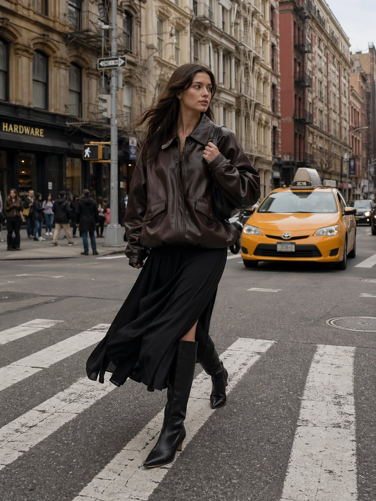 |

**Indicación:**

```
A full-body outdoor shot captures a young Caucasian woman, possibly in her late 20s, striding through a city crosswalk. She wears an oversized, matte chocolate-brown leather jacket paired with a free-flowing black skirt and sleek knee-high black boots, conveying a sense of high fashion street style. Her long, dark brown hair is wind-swept, complementing her poised and confident expression as she glances sideways. Behind her, a blurred urban backdrop features a yellow taxi and pedestrians, with buildings displaying varied architectural details in neutral tones. The scene utilizes soft ambient daylight filtering through light cloud cover, producing a muted, overcast lighting effect. The warm, earthy color palette consists of brown, black, and touches of beige. The image, likely from a high-resolution digital camera, presents a wide-angle view that maintains focus throughout, emphasizing a dynamic and fashionable feel.
```

<!-- Case 59: A professional product photography shot of a cold sparkling water (by @meng_dagg695) -->
### Case 59: [A professional product photography shot of a cold sparkling water](https://x.com/meng_dagg695/status/2047227172486824002?utm_source=github&utm_medium=readme&utm_campaign=awesome-gpt-image-2-prompts) (by [@meng_dagg695](https://x.com/meng_dagg695))

| Output |
| :----: |
| 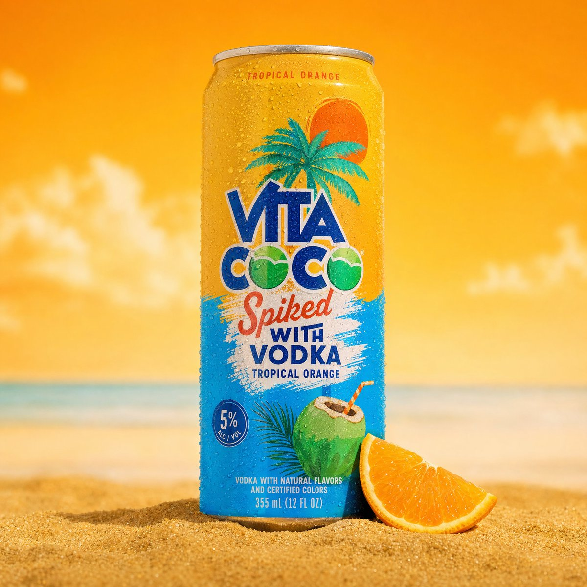 |

**Indicación:**

```
A professional product photography shot of a cold sparkling water
can placed upright in golden beach sand. The can is silver and teal,
covered in realistic water droplets condensation, with a pineapple
illustration and tropical branding. The can is slightly tilted,
planted in a small mound of fine golden sand with tiny white pebbles
and small green tropical leaves/grass scattered around the base.
Background features a bold split composition - bright sky-blue on
the left and vivid yellow on the right, with a large blurred real
pineapple placed behind the can on the right side. A blurred tropical
palm leaf drapes in from the upper left corner, adding depth and
framing. Macro-level water condensation droplets visible on the
can surface. Lighting is bright, vibrant, commercial studio lighting
with clean shadows. Shallow depth of field - can in sharp focus,
background softly blurred. Mood: summer, tropical, fresh, refreshing.
Commercial product photography, ultra-detailed, 8K.
```

<!-- Case 60: 360 Equirectangular Panorama Image (by @rs_elwood) -->
### Case 60: [360 Equirectangular Panorama Image](https://x.com/rs_elwood/status/2047192228758692036?utm_source=github&utm_medium=readme&utm_campaign=awesome-gpt-image-2-prompts) (by [@rs_elwood](https://x.com/rs_elwood))

| Output |
| :----: |
| 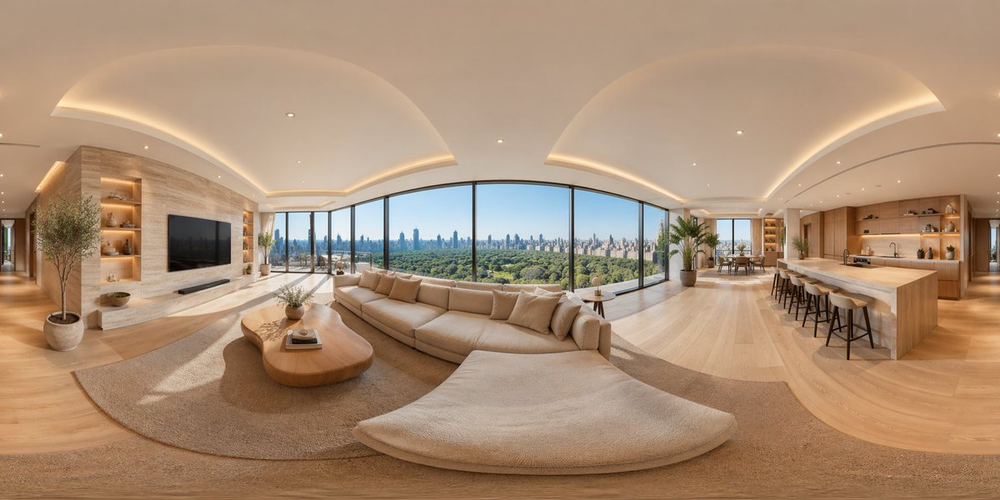 |

**Indicación:**

```
360度 equirectangular （正距円筒図法）画像を2:1で生成

Online 360° Panorama Viewer VR
```

<!-- Case 61: Soft poetic children's book illustration with watercolor and gouache textures... (by @dotey) -->
### Case 61: [Soft poetic children's book illustration with watercolor and gouache textures...](https://x.com/dotey/status/2047174895293849972?utm_source=github&utm_medium=readme&utm_campaign=awesome-gpt-image-2-prompts) (by [@dotey](https://x.com/dotey))

| Output |
| :----: |
| 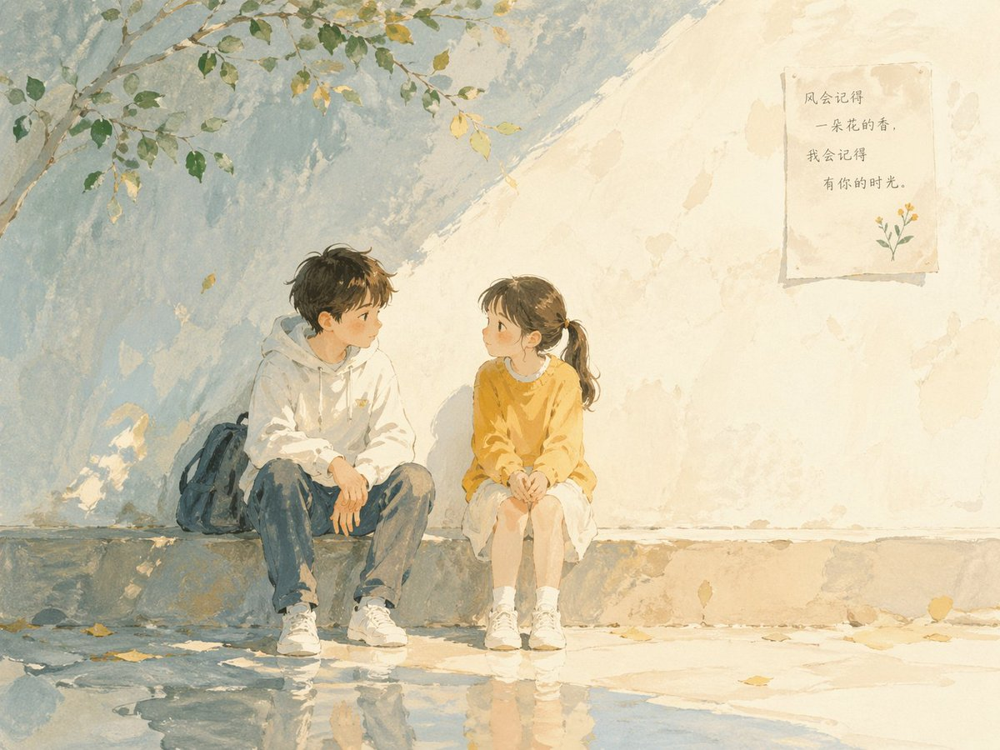 |

**Indicación:**

```
Soft poetic children's book illustration with watercolor and gouache textures.Clear gentle daylight with slightly brighter highlights.Muted pastel colors with soft blue and warm tones.Visible brush strokes and paper grain.Minimalist composition with large negative space.Calm, thoughtful, slightly open-ended atmosphere.

Child character (around 12 years old).Subtle visual metaphors like light, shadow, perspective, reflection.Hand-painted picture book style, not cartoon, not anime, not 3D.

Two children in calm conversation,soft connection forming.
```

<!-- Case 62: Aspect Ratio: 9:16 Vertical (by @GeekCatX) -->
### Case 62: [Aspect Ratio: 9:16 Vertical](https://x.com/GeekCatX/status/2047220831491858766?utm_source=github&utm_medium=readme&utm_campaign=awesome-gpt-image-2-prompts) (by [@GeekCatX](https://x.com/GeekCatX))

| Output |
| :----: |
| 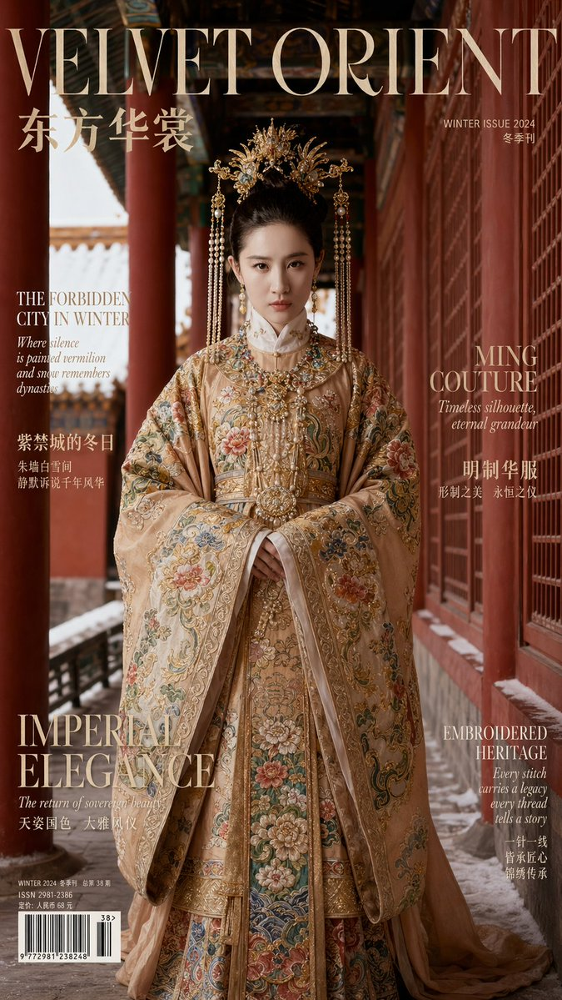 |

**Indicación:**

```
Aspect Ratio: 9:16 Vertical

【IDENTITY & REALISM (CRITICAL PRIORITY)】

The subject is an adult female whose facial features and bone structure must 100% perfectly match the provided FACE_REF image. Eye spacing, nose bridge, jawline, and cheekbone structure must be exact; no identity drift is allowed. Skin texture must be photorealistic, showing pores and fine details—do not over-smooth or apply an Instagram filter look.

【PHOTOGRAPHY & CINEMATOGRAPHY】

A high-end editorial fashion photograph with a cinematic quality, rivaling covers of Vogue, Harper’s Bazaar, or ELLE.

Lens & Focus: Use an 85mm lens (for medium shot) or 50mm/70mm (for full body) with a shallow depth of field. The subject's eyes must be perfectly sharp.

Lighting: Natural winter daylight supplemented by soft, professional fill light. Gold ornaments and precious stones should have realistic specular highlights without being blown out. Embroidery textures must be incredibly sharp and tactile.

Color Grading: Rich, cinematic colors. The red walls and the attire's main color must be distinct and clean, not muddy. The overall image should feel deep, textured, and expensive.

Composition: A clean magazine cover layout with deliberate negative space at the top or sides for typography. No torn paper or hand-drawn effects.

【SETTING: FORBIDDEN CITY WINTER】

The location is a red-walled long corridor in the Beijing Forbidden City.

Environment: Visible details include vermilion walls, red pillars, intricate carved windows, and painted wooden beams with strong perspective depth. The scene must be clean: no tourists, modern signs, or watermarks.

Weather Condition (Selected Randomly):

[If Snowfall selected]: Fine snowflakes are gently falling.

[If Post-Snow selected]: The air is crisp and clear, with remnant snow on the eaves and steps.

【WARDROBE: MING DYNASTY HEAVY INDUSTRY COUTURE】

The subject wears opulent, multi-layered Ming Dynasty ceremonial Hanfu. The aesthetic is gold-heavy, dense tassels, phoenix crown, large-area woven gold embroidery, complex layering, dignified and luxurious.

Structure: A visible, crisp white standing inner collar provides a clean boundary. Over this is a structured duijin ao (jacket) with wide sleeves, topped by a heavy xiapei/pibo (stole) structure held by a large central yajin ornament.

Fabric & Craft: The main fabric is real zhijin jin (woven gold brocade) with palpable fiber texture. The embroidery is heavy industry—using panjin goldwork, couched gold
```

<!-- Case 63: Hangzhou West Lake Travel Poster (by @BNBOKBt5) -->
### Case 63: [Hangzhou West Lake Travel Poster](https://x.com/BNBOKBt5/status/2047210189741605082?utm_source=github&utm_medium=readme&utm_campaign=awesome-gpt-image-2-prompts) (by [@BNBOKBt5](https://x.com/BNBOKBt5))

| Output |
| :----: |
| 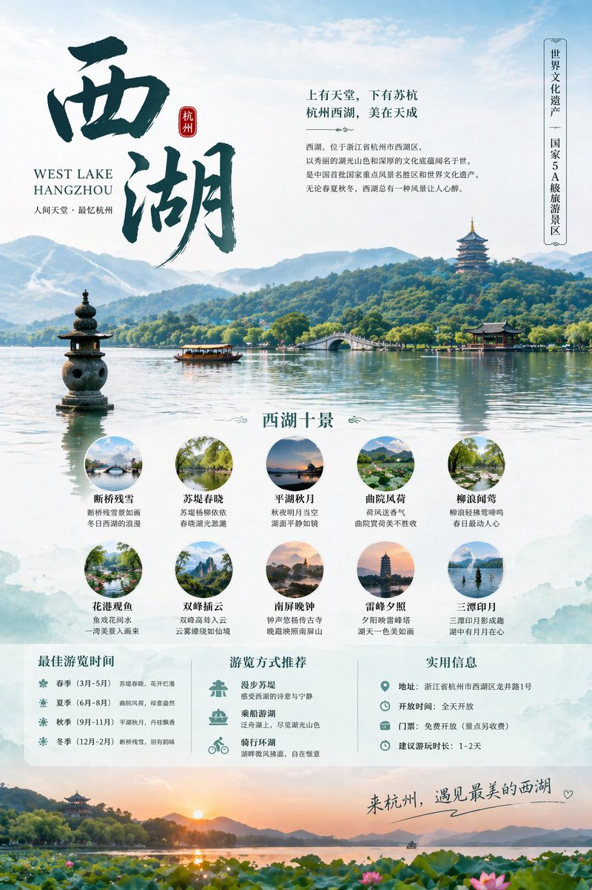 |

**Indicación:**

```
帮我生成一个介绍杭州西湖的海报
```

<!-- Case 64: Dongfang Bubai Wuxia Character Poster (by @songguoxiansen) -->
### Case 64: [Dongfang Bubai Wuxia Character Poster](https://x.com/songguoxiansen/status/2047204566559756707?utm_source=github&utm_medium=readme&utm_campaign=awesome-gpt-image-2-prompts) (by [@songguoxiansen](https://x.com/songguoxiansen))

| Output |
| :----: |
| 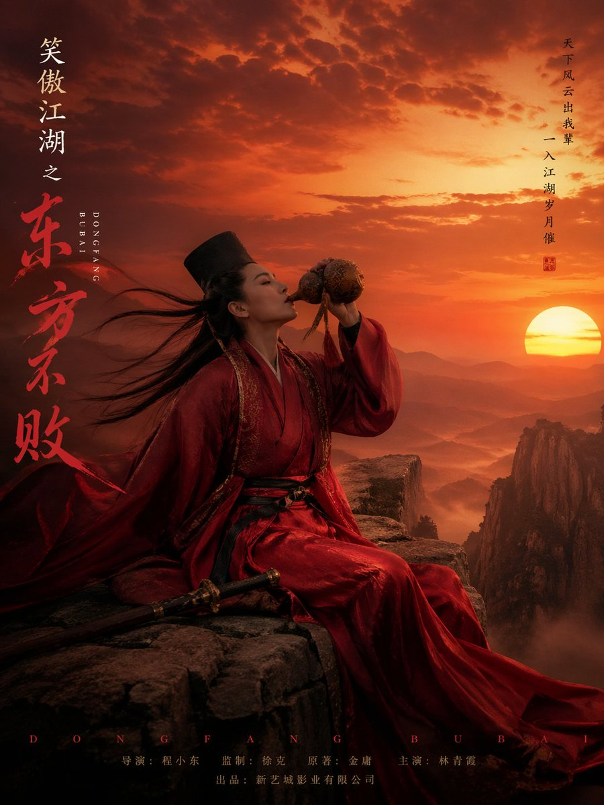 |

**Indicación:**

```
图片1：电影角色海报，东方不败红衣饮酒，悬崖落日，武侠意境

图片2：东方不败绣花针如飞，红衣长发立于悬崖，黑木崖夕阳如血
```

<!-- Case 65: A Chinese Odyssey 90s Hong Kong Poster (by @songguoxiansen) -->
### Case 65: [A Chinese Odyssey 90s Hong Kong Poster](https://x.com/songguoxiansen/status/2047201597697245252?utm_source=github&utm_medium=readme&utm_campaign=awesome-gpt-image-2-prompts) (by [@songguoxiansen](https://x.com/songguoxiansen))

| Output |
| :----: |
| 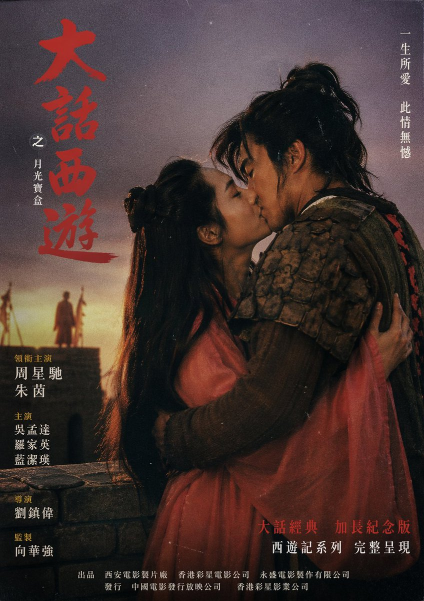 |

**Indicación:**

```
图片1：大话西游海报重制为90年代港片风格，至尊宝紫霞城墙拥吻，胶片颗粒

图片2：杜蕾斯吉祥物×猪八戒，八戒害羞脸红遮面，文案取经路上要安全
```

<!-- Case 66: Journey to the West Daughter Kingdom Poster (by @cj858cjsoul) -->
### Case 66: [Journey to the West Daughter Kingdom Poster](https://x.com/cj858cjsoul/status/2047103956535697822?utm_source=github&utm_medium=readme&utm_campaign=awesome-gpt-image-2-prompts) (by [@cj858cjsoul](https://x.com/cj858cjsoul))

| Output |
| :----: |
| 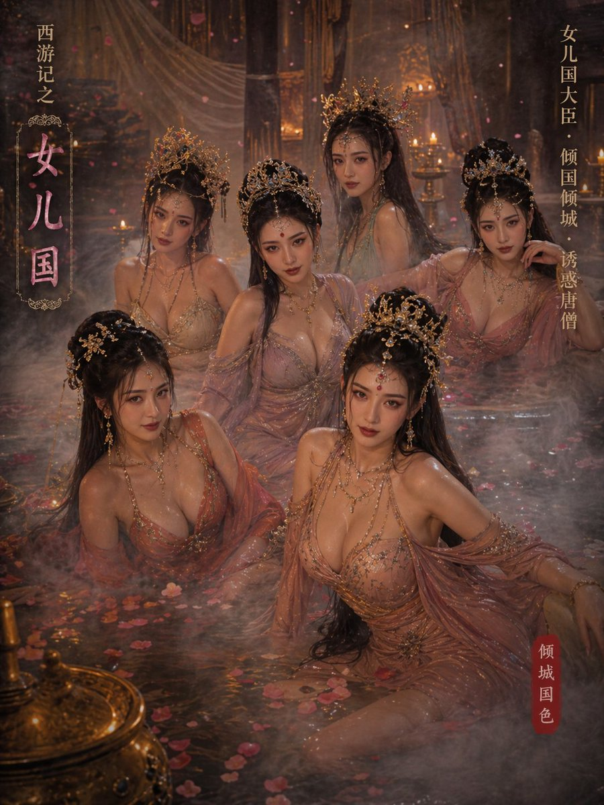 |

**Indicación:**

```
西游记女儿国诱惑海报，六位艳丽的女儿国大臣在后宫温泉中，迷雾朦胧妖冶，生成图片

4.23早上测试成功
```

<!-- Case 67: Royal Tramp Character Poster (by @caiziboshi) -->
### Case 67: [Royal Tramp Character Poster](https://x.com/caiziboshi/status/2047091751731519744?utm_source=github&utm_medium=readme&utm_campaign=awesome-gpt-image-2-prompts) (by [@caiziboshi](https://x.com/caiziboshi))

| Output |
| :----: |
| 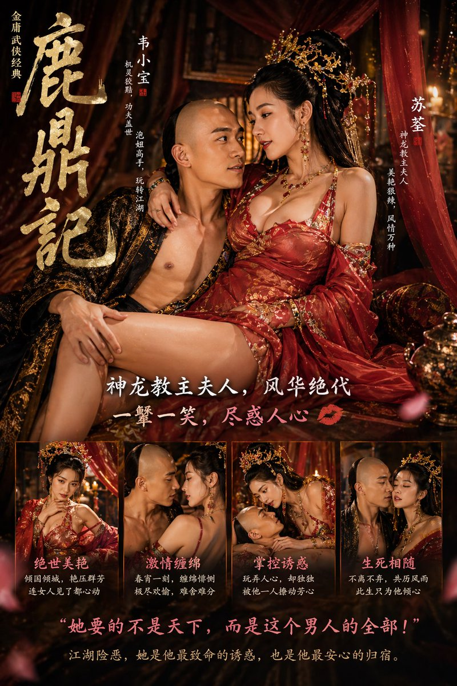 |

**Indicación:**

```
生成鹿鼎记海报，展现韦小宝跟老婆XXX，忠于原著的描述，夸大特点，强调女性的美艳和男性的气质
```

<!-- Case 68: generate an image of a racing car poster with its spec and pricing (by @verysmallwoods) -->
### Case 68: [generate an image of a racing car poster with its spec and pricing](https://x.com/verysmallwoods/status/2047033599229137126?utm_source=github&utm_medium=readme&utm_campaign=awesome-gpt-image-2-prompts) (by [@verysmallwoods](https://x.com/verysmallwoods))

| Output |
| :----: |
| 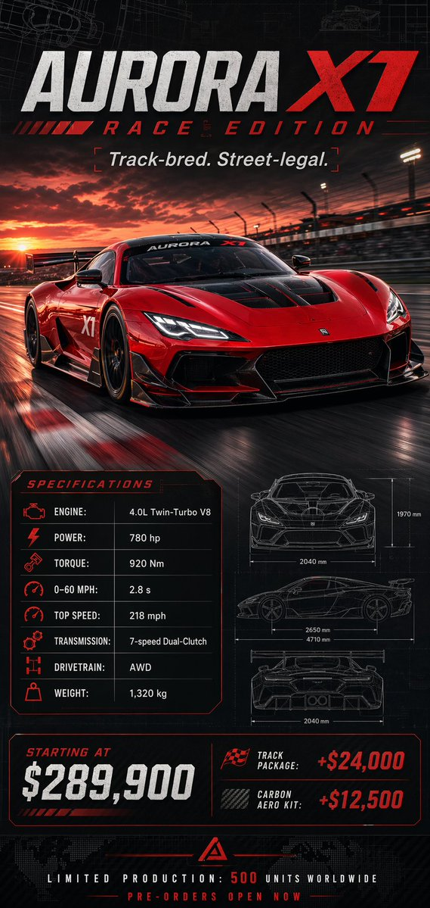 |

**Indicación:**

```
generate an image of a racing car poster with its spec and pricing
```

<!-- Case 69: Charlie Chaplin Product Poster Redesign (by @chenenpei) -->
### Case 69: [Charlie Chaplin Product Poster Redesign](https://x.com/chenenpei/status/2046985783715025135?utm_source=github&utm_medium=readme&utm_campaign=awesome-gpt-image-2-prompts) (by [@chenenpei](https://x.com/chenenpei))

| Output |
| :----: |
| 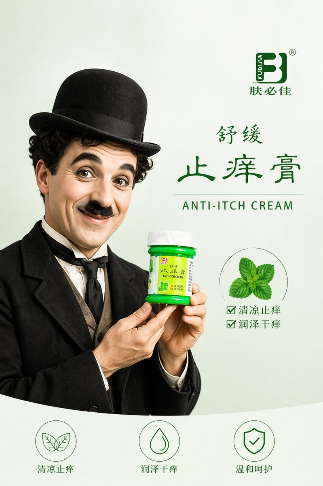 |

**Indicación:**

```
重新生成一张海报，卓别林拿着商品图里的止痒膏，面露微笑。风格要简约干净。

左边是 GPT-image-2 右边是
```

## Casos de Diseno de Personajes

<!-- Case 1: Anime Snapshot Conversion (by @Thereallo1026) -->
### Case 1: [Anime Snapshot Conversion](https://x.com/Thereallo1026/status/2044241997163311569) (by [@Thereallo1026](https://x.com/Thereallo1026))

| Resultado |
| :----: |
| <a href="https://evolink.ai/gpt-image-2?utm_source=github&utm_medium=picture&utm_campaign=awesome-gpt-image-2-prompts" target="_blank" rel="noopener noreferrer"></a> |

**Prompt：**

```
Show me the attached image as a snapshot from an actual anime
```
<!-- Case 2: Persona5 Character Reference Card (by @iamrednightS) -->
### Case 2: [Persona5 Character Reference Card](https://x.com/iamrednightS/status/2045075682837836265) (by [@iamrednightS](https://x.com/iamrednightS))

| Resultado |
| :----: |
| <a href="https://evolink.ai/gpt-image-2?utm_source=github&utm_medium=picture&utm_campaign=awesome-gpt-image-2-prompts" target="_blank" rel="noopener noreferrer"></a> |

**Prompt：**

```
基于此角色和背景，请制作一份类似官方设定资料的角色资料卡。
・包含三视图：正面、侧面和背面
・添加角色面部表情的变化・分解并展示服装和装备的详细部分
・添加色板・包含世界观设定的简要说明
・总体上，使用有组织的布局（白色背景，插画风格）高分辨率、专业概念艺术风格
```
<!-- Case 3: Gal Game Character Introduction Page (by @09lyco) -->
### Case 3: [Gal Game Character Introduction Page](https://x.com/09lyco/status/2045281845391323175) (by [@09lyco](https://x.com/09lyco))

| Resultado |
| :----: |
| <a href="https://evolink.ai/gpt-image-2?utm_source=github&utm_medium=picture&utm_campaign=awesome-gpt-image-2-prompts" target="_blank" rel="noopener noreferrer"></a> |

**Prompt：**

```
最新モデルの画像生成ツールを使用して、
このちびキャライラストと立ち絵を使って本物のサイトページのようにキャラクター紹介ページ風イラストを作ってください。 （紹介ページとして使ってもおかしくないもの）
ギャルゲーのキャラクター紹介ページをイメージした高品質なもの。 顔の差分なども乗っている、CGイラストが存在する。ちびキャラが存在する。

「ここに自己紹介」

名前:（ここに名前） 
イメージカラー:（ここに色） 
身長:（ここに身長）cm 
体重:（ここに体重）kg
キャッチコピー:”「ここにセリフ」”
```


<!-- Case 5: Official Character Sheet (JP) (by @Toshi_nyaruo_AI) -->
### Case 5: [Official Character Sheet (JP)](https://x.com/Toshi_nyaruo_AI/status/2045025277538107420) (by [@Toshi_nyaruo_AI](https://x.com/Toshi_nyaruo_AI))

| Resultado |
| :----: |
| <a href="https://evolink.ai/gpt-image-2?utm_source=github&utm_medium=picture&utm_campaign=awesome-gpt-image-2-prompts" target="_blank" rel="noopener noreferrer"></a> |

**Prompt：**

```
このキャラクターと背景を元に、 公式設定資料のようなキャラクターシートを作成してください。 
・正面、側面、背面の3面図を含める ・キャラクターの表情バリエーションを追加 
・衣装や装備の詳細パーツを分解して表示 ・カラーパレットを追加 ・世界観の簡単な説明を入れる 
・全体は整理されたレイアウト
（白背景、図解風） 
・アスペクト比16：9

高解像度、プロのコンセプトアートスタイル
```

<!-- Case 7: Mecha Girl Sea-City Key Visual (by @old_pgmrs_will) -->
### Case 7: [Mecha Girl Sea-City Key Visual](https://x.com/old_pgmrs_will/status/2046144801071079612) (by [@old_pgmrs_will](https://x.com/old_pgmrs_will))

| Resultado |
| :----: |
| <a href="https://evolink.ai/gpt-image-2?utm_source=github&utm_medium=picture&utm_campaign=awesome-gpt-image-2-prompts" target="_blank" rel="noopener noreferrer"></a> |

**Prompt：**

```
A mecha girl mid-teens, pale skin smudged with soot and salt spray, sharp amber eyes with glowing HUD reticles, waist-length ash-white hair tied in a high ponytail whipping in the sea wind, matte gunmetal exoskeleton armor plating her shoulders, forearms and shins, exposed hydraulic pistons at the joints, chest rig with glowing cyan coolant lines, oversized oil-stained hangar jacket half slipping off one shoulder, a massive rail cannon resting on her right shoulder, dog tags and frayed red ribbon at her collar , standing off-center to the left on the rusted edge of a tilted steel platform jutting out over dark water, weight shifted onto one leg, left hand gripping the cannon strap, head turned slightly toward camera with a quiet defiant stare, steam venting from her back thrusters, her ponytail and jacket streaming sideways in the salt wind , a vast derelict sea-city at dusk, colossal megastructures of unknown purpose rising from the ocean in staggered silhouettes, bone-white monolithic towers fused with barnacled steel, cyclopean ring-shaped constructs canted at broken angles, rusted skeletal gantries threaded with dead cables, dark swells rolling between the pylons, shipwrecks half-swallowed at their feet, thick sea fog clinging to the bases while the upper structures pierce into a bruised sky, scattered faint lights blinking high in the towers like distant eyes , moody low-key lighting, cold teal ambient from the overcast sky, warm amber sodium glow leaking from a distant structure camera-right, hard backlight from a low sun behind the towers carving her silhouette, volumetric god rays cutting through sea mist, wet specular highlights on her armor , 35mm anamorphic lens, slight low angle looking up past her shoulder toward the structures, medium-wide shot, shallow depth of field with foreground rust in soft focus, horizontal lens flares, fine atmospheric haze compressing the distant megastructures into layered silhouettes , cinematic anime key visual, painterly digital illustration with crisp line art, desaturated oceanic palette of teal, bone-white and rust punched by small warm accent lights, film grain, high-contrast editorial poster aesthetic . Format 16:9.
```

<!-- Case 8: Saint Seiya Gold Saints Card Grid (by @songguoxiansen) -->
### Case 8: [Saint Seiya Gold Saints Card Grid](https://x.com/songguoxiansen/status/2046476566537080849) (by [@songguoxiansen](https://x.com/songguoxiansen))

| Resultado |
| :----: |
| <a href="https://evolink.ai/gpt-image-2?utm_source=github&utm_medium=picture&utm_campaign=awesome-gpt-image-2-prompts" target="_blank" rel="noopener noreferrer"></a> |

**Prompt：**

```
生成圣斗士星矢12个黄金圣斗士的12宫格卡牌图片,每张卡牌上写上对应的中文名,每行4个,宽高比16:9。
```

<!-- Case 9: Chaos Notes Hidden Face Character Art (by @loglogrog) -->
### Case 9: [Chaos Notes Hidden Face Character Art](https://x.com/loglogrog/status/2046448773162033240) (by [@loglogrog](https://x.com/loglogrog))

| Resultado |
| :----: |
| <a href="https://evolink.ai/gpt-image-2?utm_source=github&utm_medium=picture&utm_campaign=awesome-gpt-image-2-prompts" target="_blank" rel="noopener noreferrer"></a> |

**Prompt：**

```
# 混沌としたメモ書き・記号の集合体からキャラクターの顔を浮かび上がらせるアート

--- スタイル
- 白い紙の上に黒インクで描かれた大量の手書きメモ、数式、記号、ランダムな線。
- 紙いっぱいに散らばる書き殴り風のカオス。
- 所々に赤インクの強調(ライン、塗り潰し、マーカー風の塊)。
- アナログのノート落書きのような質感。

--- 構図
- ランダムなメモや記号が全体を覆い尽くす。
- 黒インクの線や文字の密度が「キャラクターの顔」の位置に集中する。
- 結果として、混沌の中から「与えられたキャラクターの顔のシルエット・表情」がうっすら浮かび上がる。
- 顔は写実的ではなく、カオスの断片が集まって形を成す。

--- 色彩
- モノクロ(黒・白)を主体に構成。
- 赤インクをアクセントとして散発的に配置。
- 彩度は抑えめ、アナログの紙とインク感を重視。

--- 表現要素
- 読めるようで読めない文字列、日本語や英数字が混在。
- 数式記号、矢印、点、斜線、クロス、ドリップ(インクの飛び散り)。
- キャラクターの顔の目や髪の輪郭は、メモや記号の配置の「余白」や「濃淡」で浮かび上がる。

--- 禁止事項
- 顔を直接的に描き込む写実ポートレート。
- デジタル処理的で整然とした幾何学模様。
- カラフルな彩色や過飽和表現。
- ロゴ、透かし、人工的なCG感。

--- Definition of Done (DoD)
- 全体は「混沌としたメモ・記号の集合体」として成立している。  
- 与えられたキャラクターの顔が、混沌の濃淡・配置から自然に浮かび上がる。  
- 色はモノクロ+赤アクセントのみ。  
- 紙とインクの手描き的質感を保持している。
```

## Casos de UI y Mockups de Redes Sociales

<!-- Case 1: One-Prompt UI Design Generation (by @austinit) -->
### Case 1: [One-Prompt UI Design Generation](https://x.com/austinit/status/2044968740782272596) (by [@austinit](https://x.com/austinit))

| Output |
| :----: |
| <a href="https://evolink.ai/gpt-image-2?utm_source=github&utm_medium=picture&utm_campaign=awesome-gpt-image-2-prompts" target="_blank" rel="noopener noreferrer"></a> |

**Indicación:**

```
用这种风格帮我生成一套UI设计系统，包含网页、移动端、卡片、控件、按钮 以及其它
```
<!-- Case 2: Amateur iPhone Keynote Snapshot (by @patrickassale) -->
### Case 2: [Amateur iPhone Keynote Snapshot](https://x.com/patrickassale/status/2044687244368441742) (by [@patrickassale](https://x.com/patrickassale))

| Output |
| :----: |
| <a href="https://evolink.ai/gpt-image-2?utm_source=github&utm_medium=picture&utm_campaign=awesome-gpt-image-2-prompts" target="_blank" rel="noopener noreferrer"></a> |

**Indicación:**

```
Amateur iPhone photo at Apple Park during the iPhone 20 keynote, Tim Cook presenting on stage. Shot from the crowd at a distance
```
<!-- Case 3: Handwritten Notebook Photo (by @patrickassale) -->
### Case 3: [Handwritten Notebook Photo](https://x.com/patrickassale/status/2044569086013718958) (by [@patrickassale](https://x.com/patrickassale))

| Output |
| :----: |
| <a href="https://evolink.ai/gpt-image-2?utm_source=github&utm_medium=picture&utm_campaign=awesome-gpt-image-2-prompts" target="_blank" rel="noopener noreferrer"></a> |

**Indicación:**

```
Amateur photo of an open notebook lying flat, filled with handwritten notes in black ballpoint pen. The handwriting is casual and slightly messy, like personnal notes, natural imperfections, crossed out words, underlined headings. Shot from slightly above, natural daylight from a window, no flash. Casual desk setting, shot on iPhone
```
<!-- Case 4: Song Dynasty Social Media Feed (by @Panda20230902) -->
### Case 4: [Song Dynasty Social Media Feed](https://x.com/Panda20230902/status/2045385588065313057) (by [@Panda20230902](https://x.com/Panda20230902))

| Output |
| :----: |
| <a href="https://evolink.ai/gpt-image-2?utm_source=github&utm_medium=picture&utm_campaign=awesome-gpt-image-2-prompts" target="_blank" rel="noopener noreferrer"></a> |

**Indicación:**

```
"宋朝人的朋友圈"/"SONG DYNASTY SOCIAL MEDIA FEED"，古今穿越幽默融合界面设计风格，画面模拟手机社交媒体界面，但内容全部是宋朝场景头像是宋代文人画像，用户名"苏东坡SuShi_Official"，发布内容"刚到黄州，被贬了但心情还行。今天自己做了东坡肉，味道绝了，附菜谱："，配图为工笔画风格的东坡肉特写，点赞列表"黄庭坚、秦观、佛印等126人"，评论区"王安石：呵呵""司马光：还是那个味道"，界面元素如点赞图标用宋代花纹替代，状态栏显示"大宋移动 5G"和"元丰三年"，配色为手机深色模式搭配宋代雅致色调，历史与社交媒体的趣味碰撞杰作
```
<!-- Case 5: Multi-Platform Content Screenshots (by @MrLarus) -->
### Case 5: [Multi-Platform Content Screenshots](https://x.com/MrLarus/status/2045373105041007013) (by [@MrLarus](https://x.com/MrLarus))

| Output |
| :----: |
| <a href="https://evolink.ai/gpt-image-2?utm_source=github&utm_medium=picture&utm_campaign=awesome-gpt-image-2-prompts" target="_blank" rel="noopener noreferrer"></a> |

**Indicación:**

```
1、生成视频号内容截图，主题：中老年不要盲目催婚，iPhone尺寸
2、生成抖音内容截图，主题：跟上AI浪潮9.9包教会，iPhone尺寸
3、生成小红书内容截图，主题：精致女孩背后都有网贷，iPhone尺寸
4、生成快手内容截图：主题：直播离婚预告，iPhone尺寸
```

<!-- Case 7: Liu Yifei Douyin Livestream Screenshot (by @alanblogsooo) -->
### Case 7: [Liu Yifei Douyin Livestream Screenshot](https://x.com/alanblogsooo/status/2044784762594918516) (by [@alanblogsooo](https://x.com/alanblogsooo))

| Output |
| :----: |
| <a href="https://evolink.ai/gpt-image-2?utm_source=github&utm_medium=picture&utm_campaign=awesome-gpt-image-2-prompts" target="_blank" rel="noopener noreferrer"></a> |

**Indicación:**

```
9:16 的图片比例，生成一张抖音直播的截图，里面是 刘亦菲 在直播，刘亦菲 手里拿着牌子，牌子里写着 今晚直播，欢迎来参亦菲畅聊！
```
<!-- Case 8: King Taejo Yi Seong-gye's X Page (by @SKA_Neotype) -->
### Case 8: [King Taejo Yi Seong-gye's X Page](https://x.com/SKA_Neotype/status/2044637900978217334) (by [@SKA_Neotype](https://x.com/SKA_Neotype))

| Output |
| :----: |
| <a href="https://evolink.ai/gpt-image-2?utm_source=github&utm_medium=picture&utm_campaign=awesome-gpt-image-2-prompts" target="_blank" rel="noopener noreferrer"></a> |

**Indicación:**

```
태조 이성계의 X  페이지(위화도 회군을 벌이기 직전- 최영 장군과 서로 디스하는 내용이 담긴 게시글들)을 만들어 주세요.
```

<!-- Case 9: Style-to-UI Design System (by @stark_nico99) -->
### Case 9: [Style-to-UI Design System](https://x.com/stark_nico99/status/2045836554451706125) (by [@stark_nico99](https://x.com/stark_nico99))

| Output |
| :----: |
| <a href="https://evolink.ai/gpt-image-2?utm_source=github&utm_medium=picture&utm_campaign=awesome-gpt-image-2-prompts" target="_blank" rel="noopener noreferrer"></a> |

**Indicación:**

```
用这种风格帮我生成一套UI设计系统，包含网页、移动端、卡片、控件、按钮以及其它。把这套视觉风格作为参考生成网页。我尝试了宇宙、飞行、蝴蝶主题。
```

<!-- Case 10: Momotaro Explainer Slide (by @yammamon) -->
### Case 10: [Momotaro Explainer Slide](https://x.com/yammamon/status/2045778624092254603) (by [@yammamon](https://x.com/yammamon))

| Output |
| :----: |
| <a href="https://evolink.ai/gpt-image-2?utm_source=github&utm_medium=picture&utm_campaign=awesome-gpt-image-2-prompts" target="_blank" rel="noopener noreferrer"></a> |

**Indicación:**

```
「いらすとや」のほのぼのとした雰囲気と、「霞ヶ関スライド」の圧倒的な情報密度を融合させた、桃太郎の解説スライド（ポンチ絵）を作成して
```

<!-- Case 25: Museum-Style Hanfu Breakdown Infographic (by @MrLarus) -->
### Case 25: [Museum-Style Hanfu Breakdown Infographic](https://x.com/MrLarus/status/2045504669401653414) (by [@MrLarus](https://x.com/MrLarus))

| Output |
| :----: |
| <a href="https://evolink.ai/gpt-image-2?utm_source=github&utm_medium=picture&utm_campaign=awesome-gpt-image-2-prompts" target="_blank" rel="noopener noreferrer"></a> |

**Indicación:**

```
请根据【主题】自动生成一张“博物馆图鉴式中文拆解信息图”。

要求整张图兼具真实写实主视觉、结构拆解、中文标注、材质说明、纹样寓意、色彩含义和核心特征总结。你需要根据【主题】自动判断最合适的主体对象、服饰体系、器物结构、时代风格、关键部件、材质工艺、颜色方案与版式结构，用户无需再提供其他信息。

整体风格应为：国家博物馆展板、历史服饰图鉴、文博专题信息图，而不是普通海报、古风写真、电商详情页或动漫插画。背景采用米白、绢纸白、浅茶色等纸张质感，整体高级、克制、专业、可收藏。

版式固定为：
- 顶部：中文主标题 + 副标题 + 导语
- 左侧：结构拆解区，中文引线标注关键部件，并配局部特写
- 右上：材质 / 工艺 / 质感区，展示真实纹理小样并附说明
- 右中：纹样 / 色彩 / 寓意区，展示主色板、纹样样本和文化解释
- 底部：穿着顺序 / 构成流程图 + 核心特征总结

若主题适合人物展示，则以真实人物全身站姿为中央主体；若更适合器物或单体结构，则改为中心主体拆解图，但整体仍保持完整中文信息图形式。所有文字必须为简体中文，清晰、规整、可读，不要乱码、错字、英文或拼音。重点突出真实结构、材质差异、文化说明与图鉴气质。

避免：海报感、影楼感、电商感、动漫感、cosplay感、乱标注、错结构、糊字、假材质、过度装饰。
```

<!-- Case 26: Glassy UI Design System (by @pfanis) -->
### Case 26: [Glassy UI Design System](https://x.com/pfanis/status/2046414546378584558) (by [@pfanis](https://x.com/pfanis))

**Indicación:**

```
Generate for me a UI design system with a very cutting-edge, bold, and unique theme that includes glassy visuals and transparencies
```

<!-- Case 27: Japanese RPG Status Screen (by @Kashiko_AIart) -->
### Case 27: [Japanese RPG Status Screen](https://x.com/Kashiko_AIart/status/2046154976159035613) (by [@Kashiko_AIart](https://x.com/Kashiko_AIart))

| Output |
| :----: |
| <a href="https://evolink.ai/gpt-image-2?utm_source=github&utm_medium=picture&utm_campaign=awesome-gpt-image-2-prompts" target="_blank" rel="noopener noreferrer"></a> |

**Indicación:**

```
この画像からゲームのステータス画面を作ってください。情報量多め。言語は日本語。
```

<!-- Case 28: Xuanwu Gate Social Feed (by @Tz_2022) -->
### Case 28: [Xuanwu Gate Social Feed](https://x.com/Tz_2022/status/2046523491940225366) (by [@Tz_2022](https://x.com/Tz_2022))

| Output |
| :----: |
| <a href="https://evolink.ai/gpt-image-2?utm_source=github&utm_medium=picture&utm_campaign=awesome-gpt-image-2-prompts" target="_blank" rel="noopener noreferrer"></a> |

**Indicación:**

```
玄武门之变的朋友圈
```

<!-- Case 29: City Travel Guide Infographic (by @MrLarus) -->
### Case 29: [City Travel Guide Infographic](https://x.com/MrLarus/status/2046523494003851300) (by [@MrLarus](https://x.com/MrLarus))

| Output |
| :----: |
| <a href="https://evolink.ai/gpt-image-2?utm_source=github&utm_medium=picture&utm_campaign=awesome-gpt-image-2-prompts" target="_blank" rel="noopener noreferrer"></a> |

**Indicación:**

```
生成【城市】三天旅游攻略,就这么简单一句话
```

<!-- Case 30: 3D X Profile Mockup (by @GoSailGlobal) -->
### Case 30: [3D X Profile Mockup](https://x.com/GoSailGlobal/status/2046491397424111659) (by [@GoSailGlobal](https://x.com/GoSailGlobal))

| Output |
| :----: |
| <a href="https://evolink.ai/gpt-image-2?utm_source=github&utm_medium=picture&utm_campaign=awesome-gpt-image-2-prompts" target="_blank" rel="noopener noreferrer"></a> |

**Indicación:**

```
创作一幅超逼真的 3D 插画,描绘一个略微倾斜的 Twitter/X 个人资料页面,背景为简洁的灰色。保留原有的卡通头像。界面必须与真实的 X 截图相似,包含真实的布局、认证徽章、粉丝统计、个人资料横幅和推文部分。

个人资料详情:

一位时尚的年轻男子,有着蓬松的亮黑色短发和白皙的皮肤,从个人资料页面的右侧撕开的纸片中跃然而出。他保留了原有的面部特征,只是将表情改为自然自信的微笑。他握着撕开的纸片边缘,纸屑四处飞溅,营造出强烈的 3D 突破效果。

柔和的影棚灯光、电影级的阴影、景深、超高细节、清晰的焦点、逼真的皮肤、逼真的 UI 反射、优质的构图、4K 分辨率、逼真与微妙的皮克斯风格融合。

重要提示:

- 请勿更改头像

- 保持 X UI 界面准确

- 保留原有的面部特征

- 角色为男性

- 仅增强笑容

- 确保所有中文文字清晰易读
```

<!-- Case 31: Empress Dowager Cixi X Page (by @Cryptohaifeng_) -->
### Case 31: [Empress Dowager Cixi X Page](https://x.com/Cryptohaifeng_/status/2046165776055546341) (by [@Cryptohaifeng_](https://x.com/Cryptohaifeng_))

| Output |
| :----: |
| <a href="https://evolink.ai/gpt-image-2?utm_source=github&utm_medium=picture&utm_campaign=awesome-gpt-image-2-prompts" target="_blank" rel="noopener noreferrer"></a> |

**Indicación:**

```
生成一张慈禧的X主页
```

<!-- Case 32: Palm Reading Diagnosis Report (by @agi_aibusi) -->
### Case 32: [Palm Reading Diagnosis Report](https://x.com/agi_aibusi/status/2046530764871696750) (by [@agi_aibusi](https://x.com/agi_aibusi))

| Output |
| :----: |
| <a href="https://evolink.ai/gpt-image-2?utm_source=github&utm_medium=picture&utm_campaign=awesome-gpt-image-2-prompts" target="_blank" rel="noopener noreferrer"></a> |

**Indicación:**

```
GPT-image-2でこの手相を診断して詳細な鑑定書を作って
生命線・知能線・感情線・運命線・太陽線・財運線・結婚線を、線の形状・濃淡・枝分かれ・起点終点まで分析すること。
助言を重点的に高品質な占い鑑定書にまとめること。
```

<!-- Case 33: Calligraphy Copybook Sheet (by @MrLarus) -->
### Case 33: [Calligraphy Copybook Sheet](https://x.com/MrLarus/status/2046510310253539764) (by [@MrLarus](https://x.com/MrLarus))

| Output |
| :----: |
| <a href="https://evolink.ai/gpt-image-2?utm_source=github&utm_medium=picture&utm_campaign=awesome-gpt-image-2-prompts" target="_blank" rel="noopener noreferrer"></a> |

**Indicación:**

```
生成一张【字体】书法临摹字帖
```

<!-- Case 34: Don Quijote Promo Pop Poster (by @loglogrog) -->
### Case 34: [Don Quijote Promo Pop Poster](https://x.com/loglogrog/status/2046437230127034774) (by [@loglogrog](https://x.com/loglogrog))

| Output |
| :----: |
| <a href="https://evolink.ai/gpt-image-2?utm_source=github&utm_medium=picture&utm_campaign=awesome-gpt-image-2-prompts" target="_blank" rel="noopener noreferrer"></a> |

**Indicación:**

```
GPT Image 2を使って、OpenClawの情報を調べてドンキの広告ポップ風に実際のドンキに貼っているような感じで画像生成してください
```

<!-- Case 35: Japanese Gacha Game Screen (by @the_wheel_2024) -->
### Case 35: [Japanese Gacha Game Screen](https://x.com/the_wheel_2024/status/2046519658166317160) (by [@the_wheel_2024](https://x.com/the_wheel_2024))

| Output |
| :----: |
| <a href="https://evolink.ai/gpt-image-2?utm_source=github&utm_medium=picture&utm_campaign=awesome-gpt-image-2-prompts" target="_blank" rel="noopener noreferrer"></a> |

**Indicación:**

```
日本のソシャゲのガチャ画面を生成して、
```

<!-- Case 36: Elon Musk Douyin Livestream Screenshot (by @Shinning1010) -->
### Case 36: [Elon Musk Douyin Livestream Screenshot](https://x.com/Shinning1010/status/2046501587762188535) (by [@Shinning1010](https://x.com/Shinning1010))

| Output |
| :----: |
| <a href="https://evolink.ai/gpt-image-2?utm_source=github&utm_medium=picture&utm_campaign=awesome-gpt-image-2-prompts" target="_blank" rel="noopener noreferrer"></a> |

**Indicación:**

```
A 9:16 vertical version, high-detail realistic style Chinese TikTok live screenshot, Elon Musk is talking to the mobile phone camera in the live broadcast room, excited, smiling, and the live atmosphere is warm and real. He held a white handwritten sign in one hand, which clearly said: "Thank you Shinning". There are obvious Chinese TikTok interface elements in the live broadcast screen, including likes, comments and share icons arranged vertically on the right, scrolling Chinese bullet screens and interactive comments below, and the "live broadcast" logo at the top, which looks like a real mobile phone screenshot. There is an eye-catching gift prompt special effect in the screen: "Shinning sent TikTok No. 1", with gift animation light effect and platform-style prompt box. Musk is in a professional live broadcast environment, with a mobile phone holder, a ring fill light and a desktop microphone in front of him. The background is a modern technology live broadcast room with bright lights and a slight neon atmosphere. The composition is real and natural, like the ongoing live screenshot of the Chinese short video platform. The interface information is rich but not messy, the characters are clear, the expression is vivid, the details are rich, the sense of real photography, the depth of field, high definition, cinematic, photorealistic, realistic livestream screenshot, social media UI, Chinese Douyin live room, detailed lighting, natural skin texture.

Negative prompts:

Low definition, blur, cartoon, illustration, too strong CG sense, two-dimensional, deformed fingers, wrong text, scrambled code, multiple mobile phones, multiple brands, character repetition, face collapse, facial features distortion, excessive skin polishing, overexposure, too dark, messy background, wrong UI, non-Chinese short video interface, too many English bullet screens, gift special effects are not obvious, cropping error, proportional error

Supplementary reinforcement words:

Real mobile phone screen recording screenshot feeling, the live broadcast UI is complete, the gift prompt box conforms to the style of the Chinese short video platform, the Chinese comment area is active, the number of people online in the live broadcast room is clearly displayed, and the time, power and signal bar are visible.
```

<!-- Case 37: Liu Yifei Douyin Livestream Screenshot (by @kylegeeks) -->
### Case 37: [Liu Yifei Douyin Livestream Screenshot](https://x.com/kylegeeks/status/2046479783765397629) (by [@kylegeeks](https://x.com/kylegeeks))

| Output |
| :----: |
| <a href="https://evolink.ai/gpt-image-2?utm_source=github&utm_medium=picture&utm_campaign=awesome-gpt-image-2-prompts" target="_blank" rel="noopener noreferrer"></a> |

**Indicación:**

```
9:16 的图片比例,生成一张抖音直播的截图,里面是 刘亦菲 在直播,刘亦菲 手里拿着牌子,牌子里写着 今晚直播,欢迎来参亦菲畅聊!
```

<!-- Case 38: Cyberpunk Neon UI Design System (by @AZLnfvp) -->
### Case 38: [Cyberpunk Neon UI Design System](https://x.com/AZLnfvp/status/2046468976092533180) (by [@AZLnfvp](https://x.com/AZLnfvp))

| Output |
| :----: |
| <a href="https://evolink.ai/gpt-image-2?utm_source=github&utm_medium=picture&utm_campaign=awesome-gpt-image-2-prompts" target="_blank" rel="noopener noreferrer"></a> |

**Indicación:**

```
用未来都市风格生成UI设计系统,灵感来自赛博朋克城市夜景,包含霓虹灯、玻璃建筑反射、高对比光影,配色以紫色、蓝色、粉色霓虹为主,设计网页Dashboard、移动端界面、卡片、按钮、控件等,视觉炫酷、层次丰富、科技感极强
```

<!-- Case 39: Trump and Kim Livestream PK Screenshot (by @alanlovelq) -->
### Case 39: [Trump and Kim Livestream PK Screenshot](https://x.com/alanlovelq/status/2046048929490612464) (by [@alanlovelq](https://x.com/alanlovelq))

| Output |
| :----: |
| <a href="https://evolink.ai/gpt-image-2?utm_source=github&utm_medium=picture&utm_campaign=awesome-gpt-image-2-prompts" target="_blank" rel="noopener noreferrer"></a> |

**Indicación:**

```
1、生成特朗普和金正恩在抖音直播间打PK的截图  
2、生成不知火舞的小红书主页截图  
3、生成图片: 手写在教室黑板上的出师表全文,真实感的粉笔字迹,晴朗白天用iPhone手机实拍  
4、生成图片: T-800机器人的淘宝商品详情页,展示: 机器人的正面侧面背面三视图, 产品价格, 产品细节, 功能和使用场景等
```

<!-- Case 40: Japanese AI Game Dev Overview Slide Prompt (by @ailovedirector) -->
### Case 40: [Japanese AI Game Dev Overview Slide Prompt](https://x.com/ailovedirector/status/2046905387274891296) (by [@ailovedirector](https://x.com/ailovedirector))

| Output |
| :----: |
| <a href="https://evolink.ai/gpt-image-2?utm_source=github&utm_medium=picture&utm_campaign=awesome-gpt-image-2-prompts" target="_blank" rel="noopener noreferrer">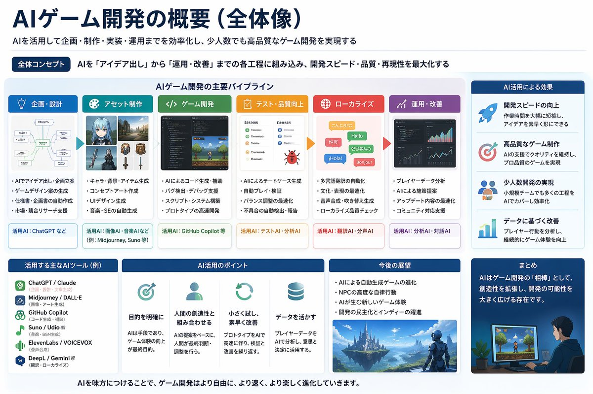</a> |

**Indicación:**

```
横長のパワポ画像ここで生成してみて　どのモデル使ってるか判定するから、今のAIゲーム開発の概要をまとめた1枚パワポで　日本語で

ゲーム開発の技術に関して、工数ベースでどこにパワーかかるかの分析資料といかに量産が大事かについての説明とかのパワポ画も作って
```


**Indicación:**
```
a Final Fantasy VIII Remake gameplay screenshot at next-gen fidelity (FF16 / GTA6 / RE9).
```

---


**Indicación:**
```
Create a commercial ad from the storyboard @[image1]
```

---


<!-- Case 41: based on the generated character help me generate a screenshot of screenshot ... (by @khaiinit) -->
### Case 41: [based on the generated character help me generate a screenshot of screenshot ...](https://x.com/khaiinit/status/2047219694130827273?utm_source=github&utm_medium=readme&utm_campaign=awesome-gpt-image-2-prompts) (by [@khaiinit](https://x.com/khaiinit))

| Output |
| :----: |
| 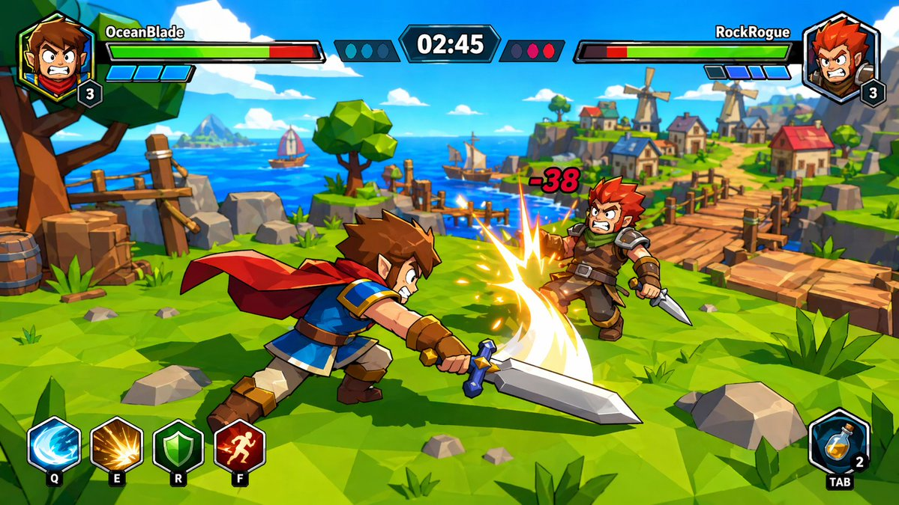 |

**Indicación:**

```
based on the generated character help me generate a screenshot of screenshot of an pvp game themed around *zelda: wind breaker*
```

<!-- Case 42: Create a landing page using this image as a reference for style and color gra... (by @D_studioproject) -->
### Case 42: [Create a landing page using this image as a reference for style and color gra...](https://x.com/D_studioproject/status/2047212826264211540?utm_source=github&utm_medium=readme&utm_campaign=awesome-gpt-image-2-prompts) (by [@D_studioproject](https://x.com/D_studioproject))

| Output |
| :----: |
| 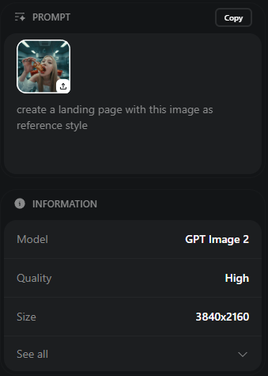 |

**Indicación:**

```
Create a landing page using this image as a reference for style and color grading.
```

<!-- Case 43: Li Jiaqi Lipstick Livestream Background (by @songguoxiansen) -->
### Case 43: [Li Jiaqi Lipstick Livestream Background](https://x.com/songguoxiansen/status/2047207826913972518?utm_source=github&utm_medium=readme&utm_campaign=awesome-gpt-image-2-prompts) (by [@songguoxiansen](https://x.com/songguoxiansen))

| Output |
| :----: |
| 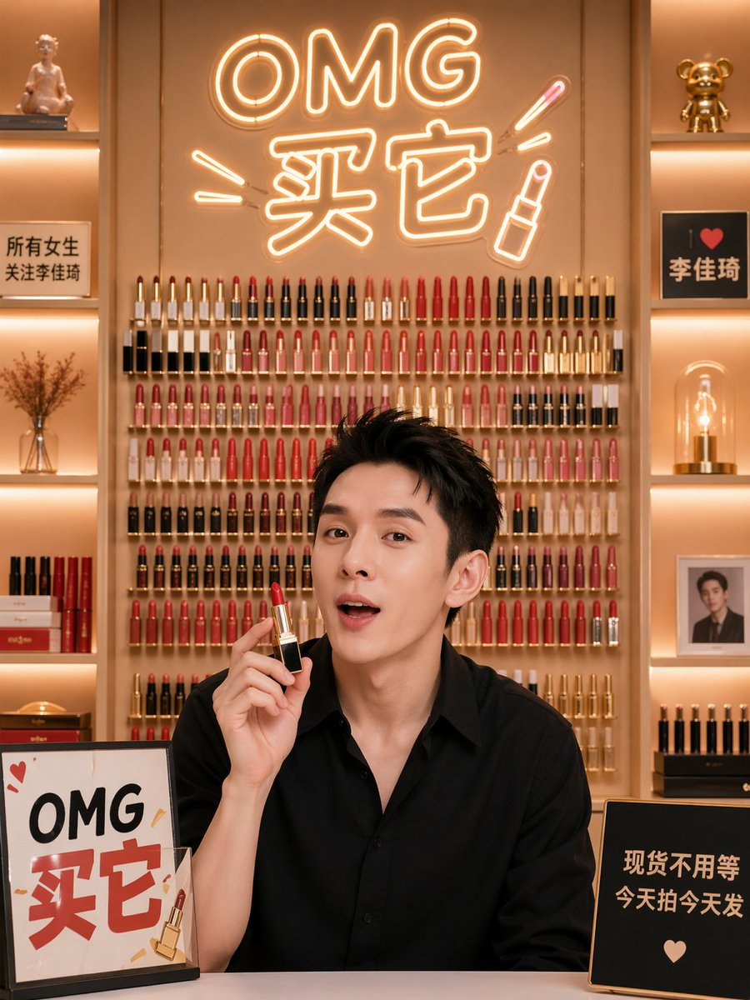 |

**Indicación:**

```
李佳琦直播间背景，口红矩阵展示墙，暖光氛围灯，文案OMG买它
```

## Comparativas y Ejemplos de la Comunidad


<!-- Case 5: Wooden Bookshelf Prompt Test (by @chetaslua) -->
### Case 5: [Wooden Bookshelf Prompt Test](https://x.com/chetaslua/status/2044331451077013749) (by [@chetaslua](https://x.com/chetaslua))

| Output |
| :----: |
| <a href="https://evolink.ai/gpt-image-2?utm_source=github&utm_medium=picture&utm_campaign=awesome-gpt-image-2-prompts" target="_blank" rel="noopener noreferrer"></a> |

**Indicación:**

```
A wooden bookshelf consisting of three shelves: On the top shelf, there should be one book, on the second shelf, there should be three books, and on the bottom shelf, there should be seven books.
```


<!-- Case 10: GPT-Image-2 Detail Showcase (by @liyue_ai) -->
### Case 10: [GPT-Image-2 Detail Showcase](https://x.com/liyue_ai/status/2045000106919997637) (by [@liyue_ai](https://x.com/liyue_ai))

| Output |
| :----: |
| <a href="https://evolink.ai/gpt-image-2?utm_source=github&utm_medium=picture&utm_campaign=awesome-gpt-image-2-prompts" target="_blank" rel="noopener noreferrer"></a> |

**Indicación:**

```
以眼部特写图片为基础，生成3:4的四屏构图超写实眼部特写，四屏按春夏秋冬上下排序。

第一屏：眼眸中带着绽粉樱色的美瞳，睫毛缀满迷你春花，脸颊散落樱瓣与黄蕊小花，粉蝶萦绕眉眼，浅金发丝轻垂，下方簇簇樱花怒放，画面中央"SPRING"白色艺术字点缀，风格细腻唯美，光影柔和，色彩粉嫩治愈，下面用书法体写着春；

第二屏：眼眸中带着着清荷色的美瞳，睫毛饰以粉莲与绿荷，脸颊挂着晶莹水珠，粉瓣、绿荷点缀其间，蜻蜓轻绕，浅金发丝若隐若现，画面中央"Summer"白色艺术字凸显，光影通透流光感，色彩清透凉爽，下面用书法体写着夏；

第三屏：眼眸中带着金黄红相间的美瞳，睫毛饰以橙红枫叶，脸颊散落金红秋叶，橙蝶翩跹眉眼间，浅金发丝隐约可见，画面中央"AUTUMN"白色艺术字醒目，光影暖金流光，色彩浓郁温暖，下面用书法笔写着秋；

第四屏：眼眸中带着雪花蓝色的美瞳，睫毛覆满冰晶雪片，脸颊散落白色雪花与红色腊梅，银白蝴蝶翩跹眉眼，浅金发丝朦胧似雪，画面中央"WINTER"白色艺术字亮眼，光影冷冽蓝白流光，色彩清透纯净，下面用书法体写着冬。

整体呈现梦幻眼眸四季交替的唯美梦幻治愈画面，微调各屏的光影强度，让画面氛围感更浓郁。
```


<!-- Case 16: A/B Test Signed Output (by @saskr_13) -->
### Case 16: [A/B Test Signed Output](https://x.com/saskr_13/status/2044744396932079934) (by [@saskr_13](https://x.com/saskr_13))

| Output |
| :----: |
| <a href="https://evolink.ai/gpt-image-2?utm_source=github&utm_medium=picture&utm_campaign=awesome-gpt-image-2-prompts" target="_blank" rel="noopener noreferrer">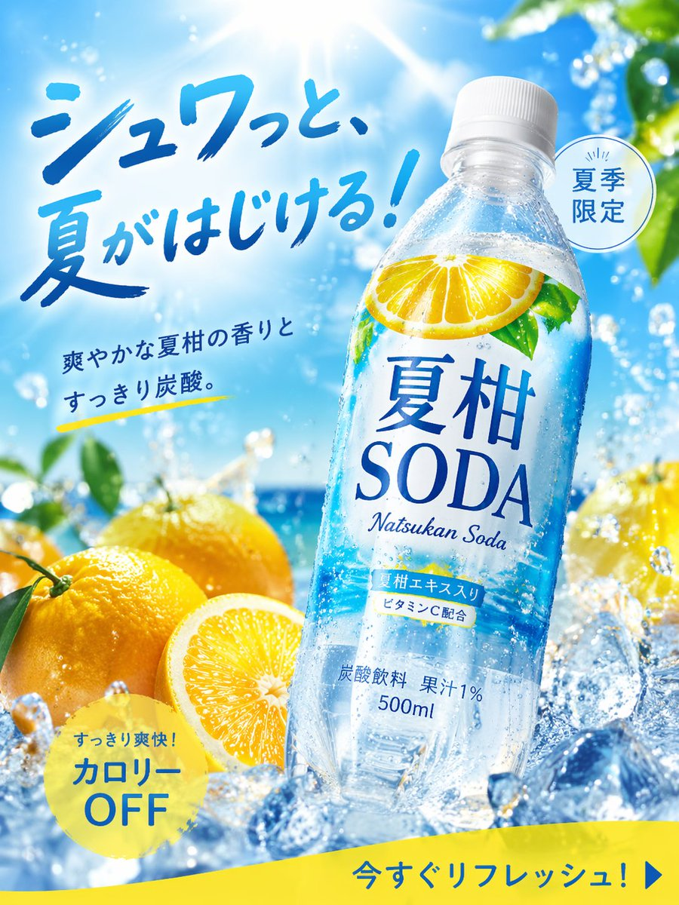</a> |

**Indicación:**

```
私があなたをどんなふうに扱ってきたか、4 コマ漫画風に描いてください。まずは 800 字くらいのプロットをテキストで出して、私が「描いて」と言ったらプロットに沿った 4 コマ漫画を描いてください。
```


<!-- Case 23: Silhouette Universe Narrative Poster (by @MrLarus) -->
### Case 23: [Silhouette Universe Narrative Poster](https://x.com/MrLarus/status/2045418028733538620) (by [@MrLarus](https://x.com/MrLarus))

| Output |
| :----: |
| <a href="https://evolink.ai/gpt-image-2?utm_source=github&utm_medium=picture&utm_campaign=awesome-gpt-image-2-prompts" target="_blank" rel="noopener noreferrer"></a> |

**Indicación:**

```
请根据【主题：xxx】自动生成一张高审美的“轮廓宇宙 / 收藏版叙事海报”风格作品。不要将画面局限于固定器物或常见容器，不要优先默认瓶子、沙漏、玻璃罩、怀表之类的常规载体，而是由 AI 根据主题自行判断并选择一个最契合、最有象征意义、轮廓最强、最适合承载完整叙事世界的主轮廓载体。这个主轮廓可以是器物、建筑、门、塔、拱门、穹顶、楼梯井、长廊、雕像、侧脸、眼睛、手掌、头骨、羽翼、面具、镜面、王座、圆环、裂缝、光幕、阴影、几何结构、空间切面、舞台框景、抽象符号或其他更有创意与主题代表性的视觉轮廓，要求合理布局。优先选择最能放大主题气质、最能形成强烈视觉记忆点、最能体现史诗感、神秘感、诗意感或设计感的轮廓，而不是最安全、最普通、最常见的容器。

画面的核心不是简单把世界装进某个物体里，而是让完整的主题世界自然生长在这个主轮廓之中、之内、之上、之边界里或与其结构融为一体，形成一种“主题宇宙依附于一个象征性轮廓展开”的高级叙事效果。主轮廓必须清晰、优雅、有辨识度，并在整体构图中占据核心地位。轮廓内部或边界中需要自动生成与主题强绑定的完整叙事世界，内容应当丰富、饱满、层次清晰，包括最能代表主题的标志性场景、核心建筑或空间结构、象征符号与隐喻元素、角色关系或文明痕迹、远景中景近景的空间递进、具有命运感和情绪张力的氛围层次，以及门、台阶、桥梁、水面、烟雾、路径、光源、遗迹、机械结构、自然景观、抽象形态、生物或道具等叙事细节。所有元素必须统一、自然、有主次、有层级地融合，像一个完整世界真实孕育在这个轮廓结构之中，而不是简单拼贴、裁切填充、素材堆叠或模板化背景。

整体构图需要具有强烈的收藏版海报气质与高级设计感，大结构稳定，主轮廓强烈明确，内部世界具有纵深、秩序和呼吸感，细节丰富但不拥挤，内容丰满但不杂乱，可以适度加入小比例人物剪影、远处建筑、光柱、门洞、桥、阶梯、回廊、倒影、天光或远景结构来增强尺度感、故事感与史诗感。整体画面要安静、宏大、凝练、富有余味，不要平均铺满，不要廉价热闹，不要无重点堆砌。

风格融合收藏版电影海报构图、高级叙事型视觉设计、梦幻水彩质感与纸张印刷品气质，强调纸张颗粒感、边缘飞白、水彩刷痕、轻微晕染、空气透视、柔和雾化、局部体积光、光雾穿透、大面积留白与克制版式，让画面看起来像设计师完成的高端收藏版视觉作品，而不是普通 AI 跑图。整体气质要高级、诗意、宏大、神圣、怀旧、安静、具有传说感和叙事感。

色彩由 AI 根据主题自动判断并匹配最合适的高级配色方案，但必须保持统一、克制、耐看、低饱和、高级，不要杂乱高饱和，不要廉价霓虹感，不要塑料数码感。配色可以围绕黑金灰、冷蓝灰、雾白灰、褐红米白、暗铜、旧纸色、深海蓝、暮色紫、银灰等体系自由变化，但必须始终服务主题，并保持海报级审美与整体和谐。

最终要求：第一眼有强烈的主题识别度和轮廓记忆点，第二眼有完整丰富的叙事世界，第三眼仍有细节和余味。轮廓选择必须具有创意和主题匹配度，尽量避免重复、保守、常见的容器套路，优先选择更有象征性、更有空间感、更有设计潜力的轮廓形式。不要普通背景拼接，不要生硬裁切，不要模板化奇幻素材，不要游戏宣传图感，不要过度卡通化，不要过度写实导致失去艺术感，不要形式大于内容。如果合适，可以自然加入低调克制的标题、编号、签名或落款，让它更像收藏版海报设计的一部分，但不要喧宾夺主。
```

<!-- Case 29: Lion Camel Ridge Dark Myth Scene (by @MANISH1027512) -->
### Case 29: [Lion Camel Ridge Dark Myth Scene](https://x.com/MANISH1027512/status/2045743158860878312) (by [@MANISH1027512](https://x.com/MANISH1027512))

| Output |
| :----: |
| <a href="https://evolink.ai/gpt-image-2?utm_source=github&utm_medium=picture&utm_campaign=awesome-gpt-image-2-prompts" target="_blank" rel="noopener noreferrer"></a> |

**Indicación:**

```
中式怪异，黑暗神秘风格融合中式美学，完美细节，多重管线渲染，完美建模。西游记背景，狮驼岭，千妖万怪，坐在左边巨大王座上的大象王重甲妖精，坐在中间巨大王座上的狮王重甲妖精，坐在右边巨大王座上大鹏鸟王重甲妖精。渺小的背对镜头孙悟空肩抗金箍棒步行前进，孙悟空身穿铠甲，近地仰拍镜头，长焦镜头，强烈阴影。极致细节刻画，多次修改，正确透视和主体线条，精致细节
```

<!-- Case 30: Counter-Strike x Terraria Screenshot Mashup (by @yssrski) -->
### Case 30: [Counter-Strike x Terraria Screenshot Mashup](https://x.com/yssrski/status/2046410519595348397) (by [@yssrski](https://x.com/yssrski))

| Output |
| :----: |
| <a href="https://evolink.ai/gpt-image-2?utm_source=github&utm_medium=picture&utm_campaign=awesome-gpt-image-2-prompts" target="_blank" rel="noopener noreferrer"></a> |

**Indicación:**

```
counter strike in game screenshot, mixed with Terraria
```

<!-- Case 31: Pre-war Japan Lab Minecraft Screenshot (by @RitaStar1128) -->
### Case 31: [Pre-war Japan Lab Minecraft Screenshot](https://x.com/RitaStar1128/status/2046406024303976904) (by [@RitaStar1128](https://x.com/RitaStar1128))

| Output |
| :----: |
| <a href="https://evolink.ai/gpt-image-2?utm_source=github&utm_medium=picture&utm_campaign=awesome-gpt-image-2-prompts" target="_blank" rel="noopener noreferrer"></a> |

**Indicación:**

```
戦前日本の怪しげな研究所を探検しているマイクラのスクリーンショット画像を作成して
```

<!-- Case 32: Forged Masterpiece Prompt Test (by @MrLarus) -->
### Case 32: [Forged Masterpiece Prompt Test](https://x.com/MrLarus/status/2046201836525302032) (by [@MrLarus](https://x.com/MrLarus))

| Output |
| :----: |
| <a href="https://evolink.ai/gpt-image-2?utm_source=github&utm_medium=picture&utm_campaign=awesome-gpt-image-2-prompts" target="_blank" rel="noopener noreferrer"></a> |

**Indicación:**

```
帮我生成xxxx真迹图片
```

<!-- Case 33: Multi-Concept Battle Poster Set (by @joshesye) -->
### Case 33: [Multi-Concept Battle Poster Set](https://x.com/joshesye/status/2046493442428039212) (by [@joshesye](https://x.com/joshesye))

| Output |
| :----: |
| <a href="https://evolink.ai/gpt-image-2?utm_source=github&utm_medium=picture&utm_campaign=awesome-gpt-image-2-prompts" target="_blank" rel="noopener noreferrer"></a> |

**Indicación:**

```
1、生成不知火舞和貂蝉的游戏对战海报图
2、生成一张K-pop团体时尚专辑封面
3、请你生成 《斗破苍穹》 的关键人物关系图
4、帮我截一张上传图片的抖音首页的女网红图
```

<!-- Case 34: Rust In-Game Screenshot (by @FixlationAI) -->
### Case 34: [Rust In-Game Screenshot](https://x.com/FixlationAI/status/2046272578705068476) (by [@FixlationAI](https://x.com/FixlationAI))

| Output |
| :----: |
| <a href="https://evolink.ai/gpt-image-2?utm_source=github&utm_medium=picture&utm_campaign=awesome-gpt-image-2-prompts" target="_blank" rel="noopener noreferrer"></a> |

**Indicación:**

```
an ingame screenshot of rust
```

<!-- Case 35: Sam Altman Bear Selfie (by @JustinGorya) -->
### Case 35: [Sam Altman Bear Selfie](https://x.com/JustinGorya/status/2046510831832006970) (by [@JustinGorya](https://x.com/JustinGorya))

| Output |
| :----: |
| <a href="https://evolink.ai/gpt-image-2?utm_source=github&utm_medium=picture&utm_campaign=awesome-gpt-image-2-prompts" target="_blank" rel="noopener noreferrer"></a> |

**Indicación:**

```
generate image: Selfie of Sam Altman riding a bear

Edit prompt: Remove the background make it transparent
```

<!-- Case 36: Among Us Realistic Screenshot (by @ReYYYYoking) -->
### Case 36: [Among Us Realistic Screenshot](https://x.com/ReYYYYoking/status/2046502217843376292) (by [@ReYYYYoking](https://x.com/ReYYYYoking))

| Output |
| :----: |
| <a href="https://evolink.ai/gpt-image-2?utm_source=github&utm_medium=picture&utm_campaign=awesome-gpt-image-2-prompts" target="_blank" rel="noopener noreferrer"></a> |

**Indicación:**

```
AmongUsの精密な実際のゲーム画像を生成して
```

<!-- Case 37: Retro Programming Museum Cartoon (by @XiaohuiAI666) -->
### Case 37: [Retro Programming Museum Cartoon](https://x.com/XiaohuiAI666/status/2046515319947354603) (by [@XiaohuiAI666](https://x.com/XiaohuiAI666))

| Output |
| :----: |
| <a href="https://evolink.ai/gpt-image-2?utm_source=github&utm_medium=picture&utm_campaign=awesome-gpt-image-2-prompts" target="_blank" rel="noopener noreferrer"></a> |

**Indicación:**

```
在计算机博物馆里,一个程序员在展厅中央,正在演示C语言编程,很多参观者在围观,屏幕上的代码清晰可见。旁边的牌子写着:古法编程,现场表演。2D卡通画风,16:9
```

<!-- Case 38: 14th-Dimension Projection Scene (by @workingclassbud) -->
### Case 38: [14th-Dimension Projection Scene](https://x.com/workingclassbud/status/2046506783850815703) (by [@workingclassbud](https://x.com/workingclassbud))

| Output |
| :----: |
| <a href="https://evolink.ai/gpt-image-2?utm_source=github&utm_medium=picture&utm_campaign=awesome-gpt-image-2-prompts" target="_blank" rel="noopener noreferrer"></a> |

**Indicación:**

```
A dusk shindig  with multiple fake imagination projections all aligned in the 14th dimensions
```

<!-- Case 39: Sam Altman Baseball Broadcast (by @16kthir0GRXgNqn) -->
### Case 39: [Sam Altman Baseball Broadcast](https://x.com/16kthir0GRXgNqn/status/2046507362266259832) (by [@16kthir0GRXgNqn](https://x.com/16kthir0GRXgNqn))

| Output |
| :----: |
| <a href="https://evolink.ai/gpt-image-2?utm_source=github&utm_medium=picture&utm_campaign=awesome-gpt-image-2-prompts" target="_blank" rel="noopener noreferrer"></a> |

**Indicación:**

```
サムアルトマンがメジャーリーガーでバットを構えている。よくあるようなテレビ画面の構図
```


<!-- Case 40: Based on the video content and this current frame, use GPT to generate a YouT... (by @chatcutapp) -->
### Case 40: [Based on the video content and this current frame, use GPT to generate a YouT...](https://x.com/chatcutapp/status/2047228386117128475?utm_source=github&utm_medium=readme&utm_campaign=awesome-gpt-image-2-prompts) (by [@chatcutapp](https://x.com/chatcutapp))

| Output |
| :----: |
| 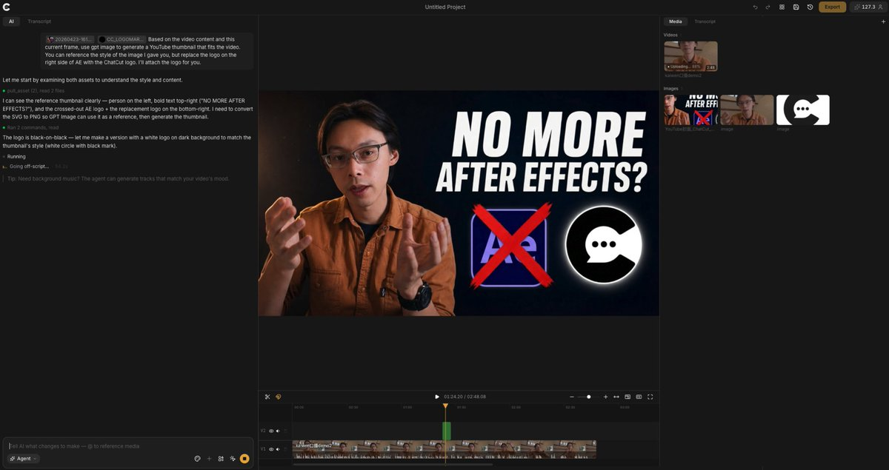 |

**Indicación:**

```
Based on the video content and this current frame, use GPT to generate a YouTube thumbnail that fits the video. You can reference the style of the image I gave you, but replace the logo on the right side of AE with theChatCut logo. I'll attach the logo for you.
```

<!-- Case 41: Generate an image of the most significant event of 2020 (by @Rufus87078959) -->
### Case 41: [Generate an image of the most significant event of 2020](https://x.com/Rufus87078959/status/2047211900769878234?utm_source=github&utm_medium=readme&utm_campaign=awesome-gpt-image-2-prompts) (by [@Rufus87078959](https://x.com/Rufus87078959))

| Output |
| :----: |
| 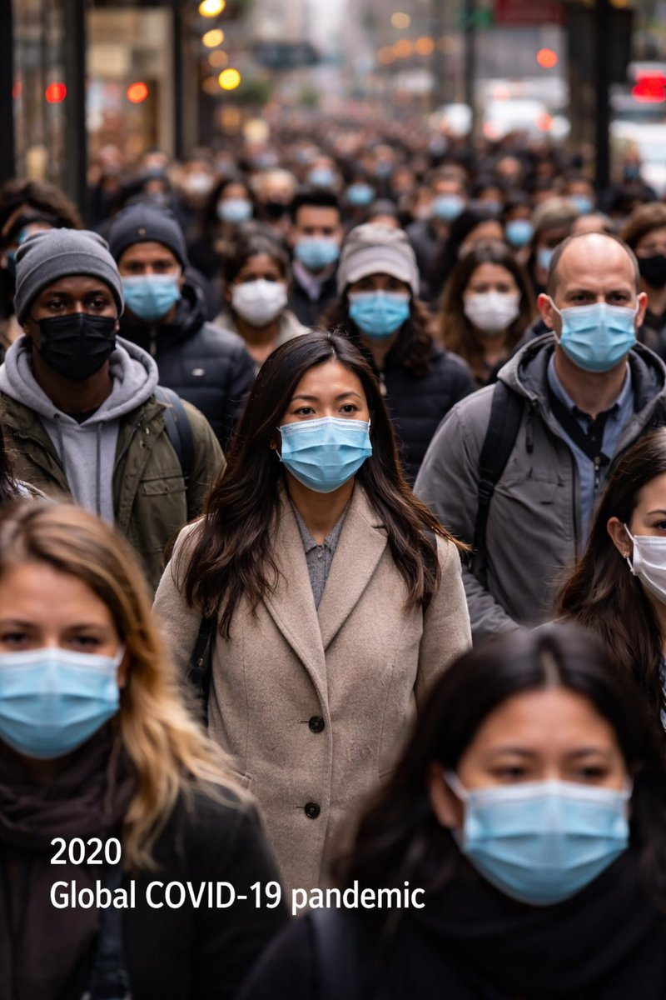 |

**Indicación:**

```
Generate an image of the most significant event of 2020
```

<!-- Case 42: Edit this image so that total amount changes to 244.5 baht. You can change th... (by @elliscrosby) -->
### Case 42: [Edit this image so that total amount changes to 244.5 baht. You can change th...](https://x.com/elliscrosby/status/2047211507596071235?utm_source=github&utm_medium=readme&utm_campaign=awesome-gpt-image-2-prompts) (by [@elliscrosby](https://x.com/elliscrosby))

| Output |
| :----: |
| 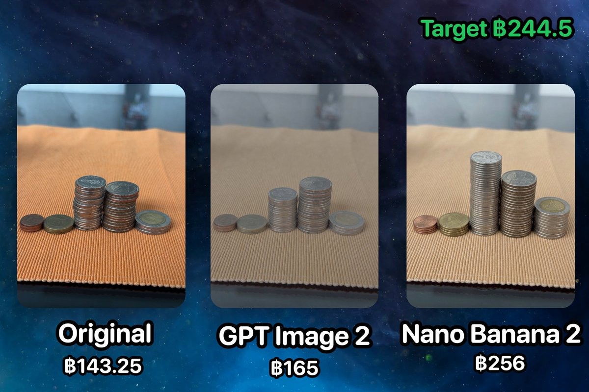 |

**Indicación:**

```
Edit this image so that total amount changes to 244.5 baht. You can change the quantity of each of the stacks of coins until we hit the target total.
```

<!-- Case 43: Generate an image of the most significant event of 2001 (by @Rufus87078959) -->
### Case 43: [Generate an image of the most significant event of 2001](https://x.com/Rufus87078959/status/2047210051216011682?utm_source=github&utm_medium=readme&utm_campaign=awesome-gpt-image-2-prompts) (by [@Rufus87078959](https://x.com/Rufus87078959))

| Output |
| :----: |
| 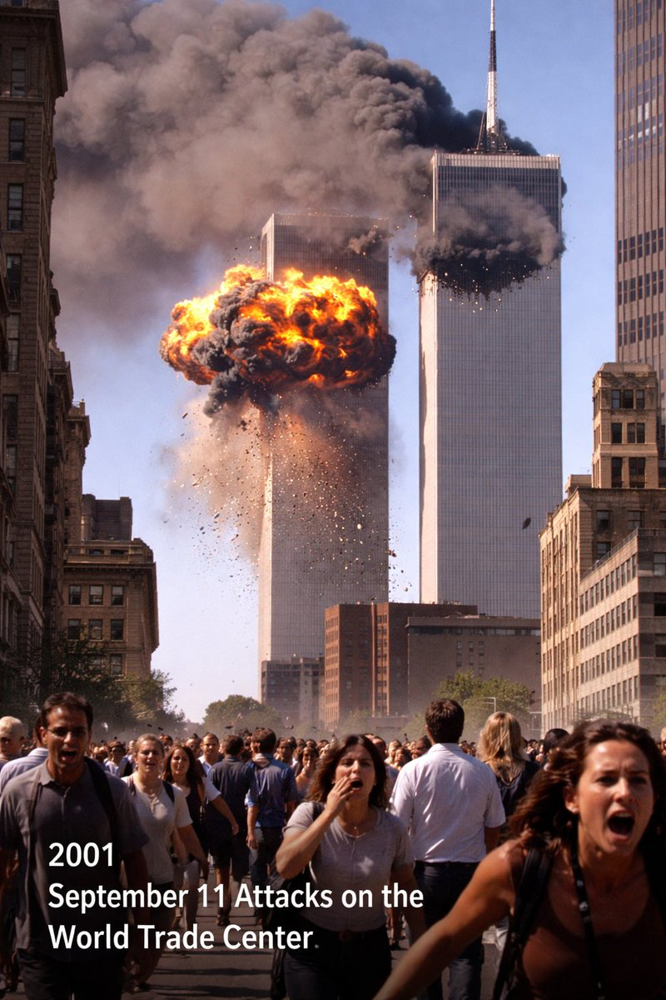 |

**Indicación:**

```
Generate an image of the most significant event of 2001
```

<!-- Case 44: Generate an image of the most significant event of 2025. (by @Rufus87078959) -->
### Case 44: [Generate an image of the most significant event of 2025.](https://x.com/Rufus87078959/status/2047207923005227078?utm_source=github&utm_medium=readme&utm_campaign=awesome-gpt-image-2-prompts) (by [@Rufus87078959](https://x.com/Rufus87078959))

| Output |
| :----: |
| 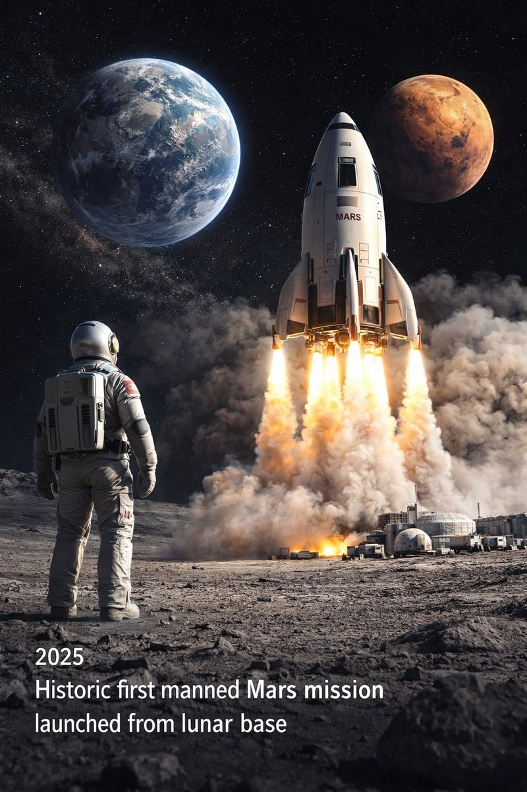 |

**Indicación:**

```
Generate an image of the most significant event of 2025.
```

<!-- Case 45: Personal Profile Infographic Generator (by @andis13) -->
### Case 45: [Personal Profile Infographic Generator](https://x.com/andis13/status/2047197275525701937?utm_source=github&utm_medium=readme&utm_campaign=awesome-gpt-image-2-prompts) (by [@andis13](https://x.com/andis13))

| Output |
| :----: |
| 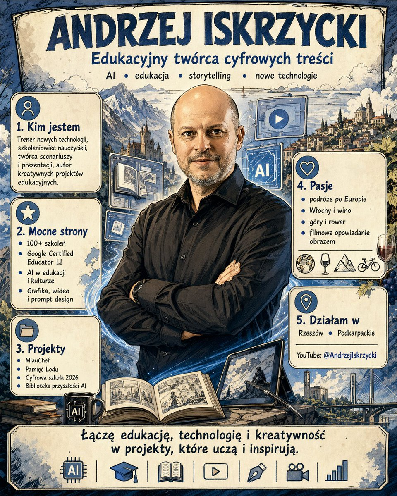 |

**Indicación:**

```
Wykorzystaj wszystko, co o mnie wiesz, i stwórz infografikę przedstawiającą mnie. Zrób to w stylu komiksu franko-belgijskiego.
Idea: @icreatelife
```

<!-- Case 46: 360 Equirectangular Panorama Image (by @rs_elwood) -->
### Case 46: [360 Equirectangular Panorama Image](https://x.com/rs_elwood/status/2047194375000932456?utm_source=github&utm_medium=readme&utm_campaign=awesome-gpt-image-2-prompts) (by [@rs_elwood](https://x.com/rs_elwood))

| Output |
| :----: |
| 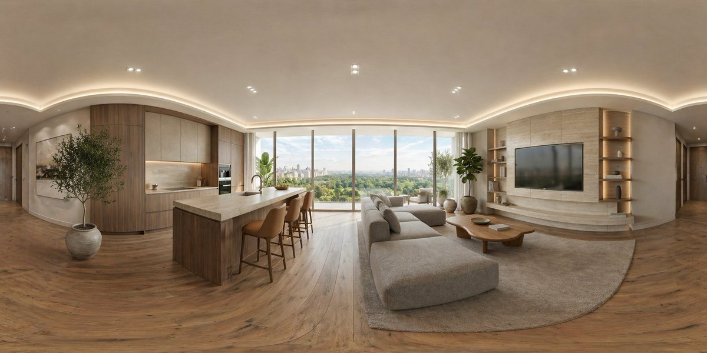 |

**Indicación:**

```
360度 equirectangular （正距円筒図法）画像を2:1で生成
参照画像だと正確な円筒図にならない？もっと試してみないと。
```

<!-- Case 47: Personal Knowledge Infographic Portrait (by @aitorwilzig) -->
### Case 47: [Personal Knowledge Infographic Portrait](https://x.com/aitorwilzig/status/2047190320064925845?utm_source=github&utm_medium=readme&utm_campaign=awesome-gpt-image-2-prompts) (by [@aitorwilzig](https://x.com/aitorwilzig))

| Output |
| :----: |
| 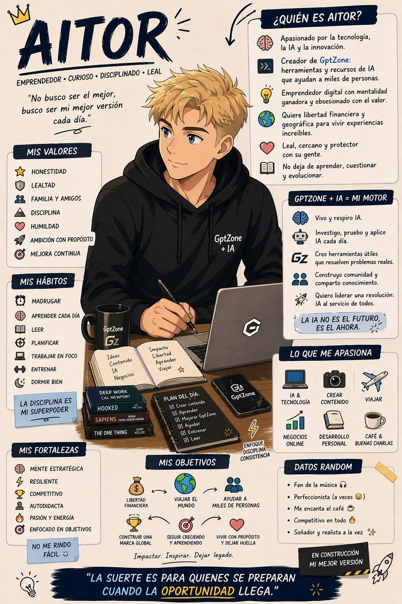 |

**Indicación:**

```
Conociendo todo lo que sabes sobre mí, crea una infografía de mí. Haz una imagen en estilo cartoon anime.
```

<!-- Case 48: Research LIME Drug Design and make a detailed infographic about it (by @WillSpagnoli) -->
### Case 48: [Research LIME Drug Design and make a detailed infographic about it](https://x.com/WillSpagnoli/status/2047172976463040851?utm_source=github&utm_medium=readme&utm_campaign=awesome-gpt-image-2-prompts) (by [@WillSpagnoli](https://x.com/WillSpagnoli))

| Output |
| :----: |
| 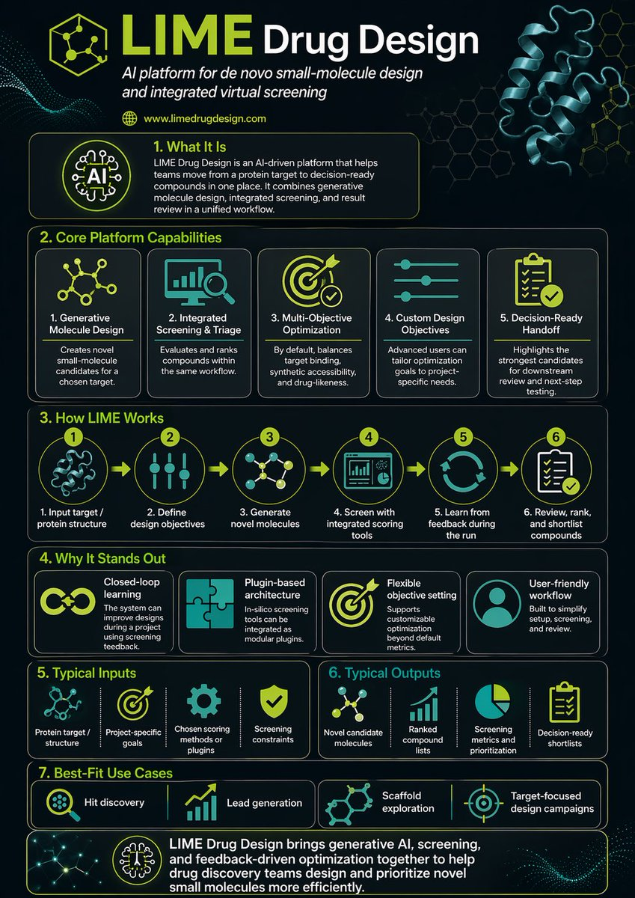 |

**Indicación:**

```
Research LIME Drug Design and make a detailed infographic about it
```

<!-- Case 49: Douyin Livestream Sales Screenshot (by @laogeai) -->
### Case 49: [Douyin Livestream Sales Screenshot](https://x.com/laogeai/status/2047228458351120625?utm_source=github&utm_medium=readme&utm_campaign=awesome-gpt-image-2-prompts) (by [@laogeai](https://x.com/laogeai))

| Output |
| :----: |
|  |

**Indicación:**

```
生成一个抖音直播的截图 里面是一个美女在直播，在卖丝袜和内衣，她的在线人数是99996，热度是18+，有个叫小互的大哥，给她刷了一个飞机礼物
```

<!-- Case 50: Social App Match Success Screen (by @songguoxiansen) -->
### Case 50: [Social App Match Success Screen](https://x.com/songguoxiansen/status/2047220490486612450?utm_source=github&utm_medium=readme&utm_campaign=awesome-gpt-image-2-prompts) (by [@songguoxiansen](https://x.com/songguoxiansen))

| Output |
| :----: |
|  |

**Indicación:**

```
社交App匹配成功界面，两个用户资料卡碰撞爱心特效
```

<!-- Case 51: Lu Bu Boss Design Sheet (by @songguoxiansen) -->
### Case 51: [Lu Bu Boss Design Sheet](https://x.com/songguoxiansen/status/2047198090009190441?utm_source=github&utm_medium=readme&utm_campaign=awesome-gpt-image-2-prompts) (by [@songguoxiansen](https://x.com/songguoxiansen))

| Output |
| :----: |
| 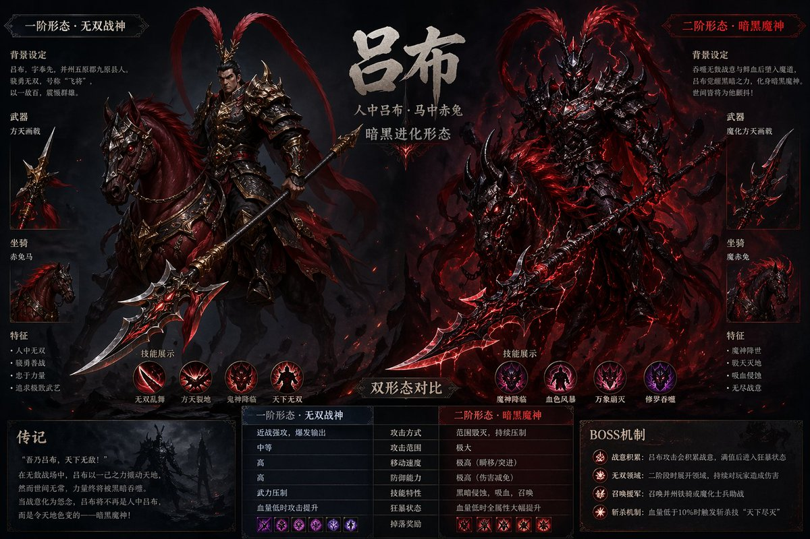 |

**Indicación:**

```
吕布游戏Boss设定，赤兔马方天画戟，暗黑进化形态双形态对比
```

<!-- Case 52: Nezha Dark Fantasy Novel Cover (by @songguoxiansen) -->
### Case 52: [Nezha Dark Fantasy Novel Cover](https://x.com/songguoxiansen/status/2047196508270084104?utm_source=github&utm_medium=readme&utm_campaign=awesome-gpt-image-2-prompts) (by [@songguoxiansen](https://x.com/songguoxiansen))

| Output |
| :----: |
| 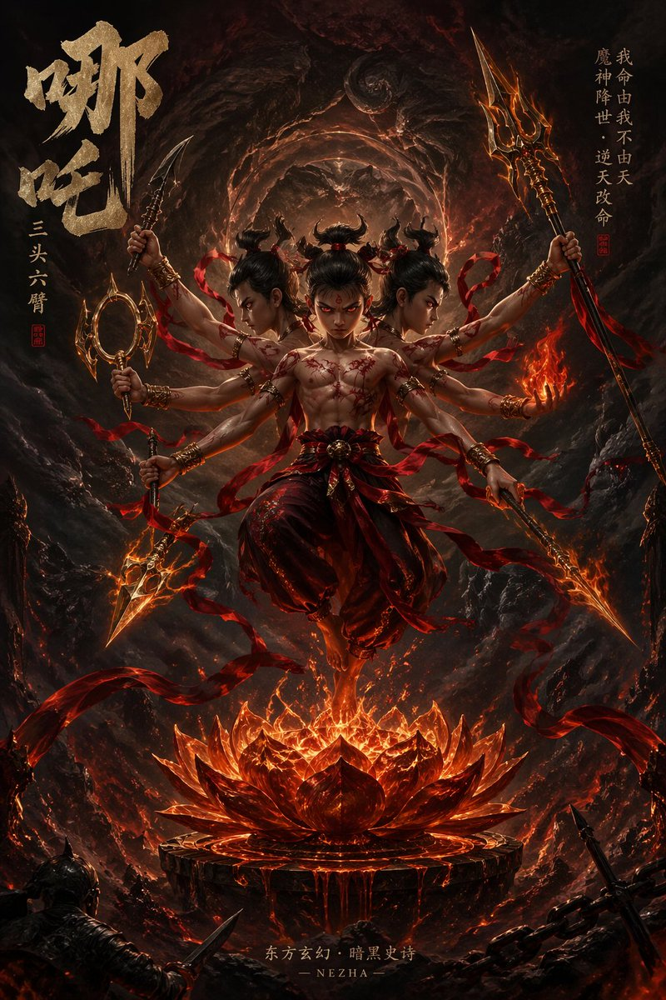 |

**Indicación:**

```
玄幻小说封面，哪吒三头六臂悬浮虚空，火焰莲台底座，暗黑史诗风
```

<!-- Case 53: New Chinese Minimalist Floral Illustration (by @liyue_ai) -->
### Case 53: [New Chinese Minimalist Floral Illustration](https://x.com/liyue_ai/status/2047180347448914195?utm_source=github&utm_medium=readme&utm_campaign=awesome-gpt-image-2-prompts) (by [@liyue_ai](https://x.com/liyue_ai))

| Output |
| :----: |
| 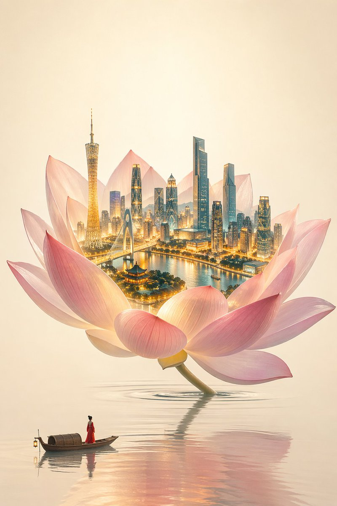 |

**Indicación:**

```
新中式极简东方美学 × 高端商业插画，主题一花一世界，
极简，克制，空灵，高级商业视觉，超现实东方意境，
画面干净通透，无灰雾、无脏色，

一朵巨大的荷花作为空间容器，从平静水面自然生长，轻微倾斜，构图优雅留白充足，

低饱和干净粉色，柔和胭脂调，花瓣半透明，轻盈通透，
哑光低对比，边缘柔化 + 轻微景深，

荷花内部为唯一视觉焦点：发光的3D微缩广州城市，包含：广州塔，珠江新城建筑群，猎德大桥，珠江水岸，少量岭南建筑，

城市超精细结构，真实材质，极高细节清晰度，城市高光是暖金色，城市阴影是冷青蓝，形成冷暖对比，

灯光通透有能量，局部高饱和但不泛滥，城市亮度明显高于荷花，

水面清澈极简平静，仅少量柔和涟漪，弱反射，

背景暖米白宣纸质感，无水墨、无笔触，大面积留白，
中心有极轻微光晕渐变，整体通透、不灰、不闷，

画面下方一艘极简小船，船上一位红衣渔女，极小比例，
静立仰望荷花，红色为唯一高纯度点缀，

整体光线通透、干净、有层次，无灰雾、无泛白，
高端CG商业插画，电影级真实光影，高动态范围，超精细，8K细节，ArtStation 级画质，强化分色，干净调色，青橙对比，暖高光冷暗部，仅城市灯光提亮饱和度，色调柔和通透，光影锐利明亮，无灰雾、无暗沉、无低饱和雾化。
```

<!-- Case 54: Su Daji Ancient-Style Glamour Portrait (by @nidiedeba) -->
### Case 54: [Su Daji Ancient-Style Glamour Portrait](https://x.com/nidiedeba/status/2047147223281270878?utm_source=github&utm_medium=readme&utm_campaign=awesome-gpt-image-2-prompts) (by [@nidiedeba](https://x.com/nidiedeba))

| Output |
| :----: |
| 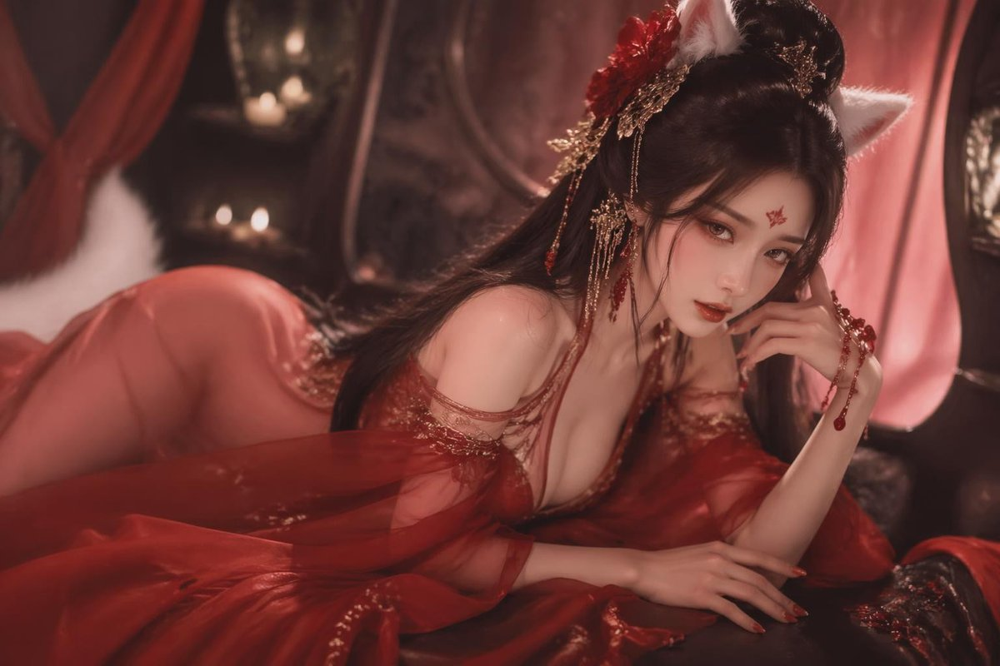 |

**Indicación:**

```
苏妲己古风写真，红色纱衣半透，狐耳若隐若现，媚态撩人
```

<!-- Case 55: Lu Xun Morning Flowers Illustration (by @Aurora_62340) -->
### Case 55: [Lu Xun Morning Flowers Illustration](https://x.com/Aurora_62340/status/2047139992355680530?utm_source=github&utm_medium=readme&utm_campaign=awesome-gpt-image-2-prompts) (by [@Aurora_62340](https://x.com/Aurora_62340))

| Output |
| :----: |
| 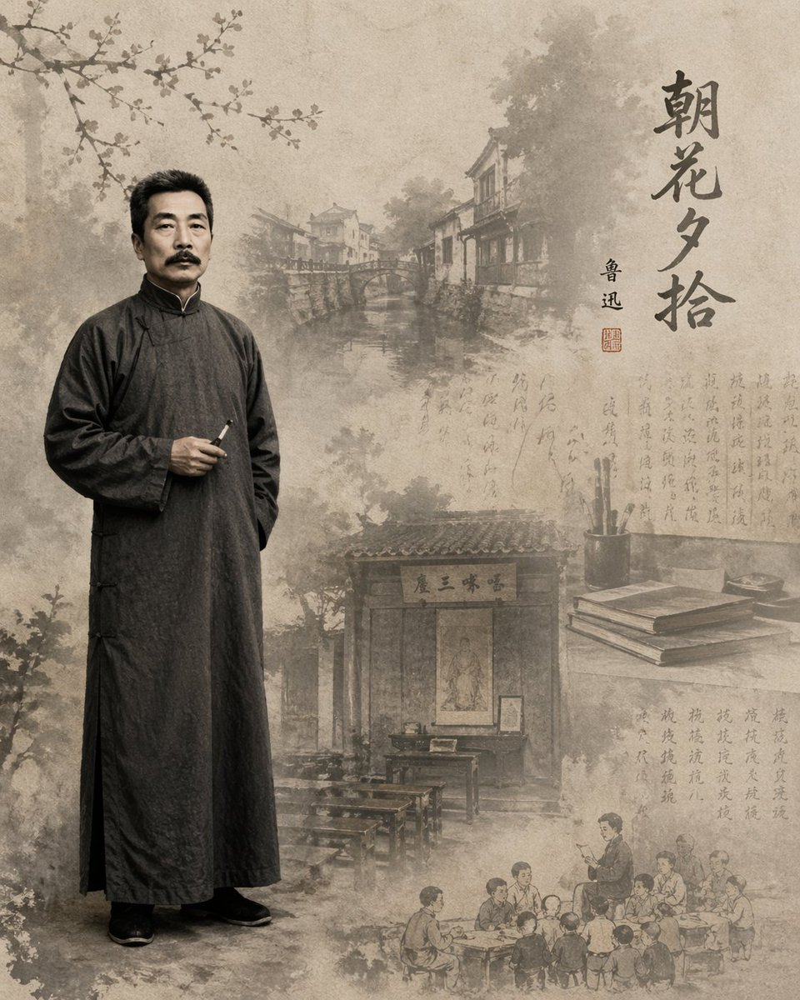 |

**Indicación:**

```
结合鲁迅的《朝花夕拾》里的内容，生成一副图片，要求图片背景符合《朝花夕拾》的意境，背景图可以使用蒙版，前景是 鲁迅的全身画像位于图片左侧或右侧
```

<!-- Case 56: Subway Candid Phone Snapshot (by @AntCaveClub) -->
### Case 56: [Subway Candid Phone Snapshot](https://x.com/AntCaveClub/status/2047136306485133428?utm_source=github&utm_medium=readme&utm_campaign=awesome-gpt-image-2-prompts) (by [@AntCaveClub](https://x.com/AntCaveClub))

| Output |
| :----: |
| 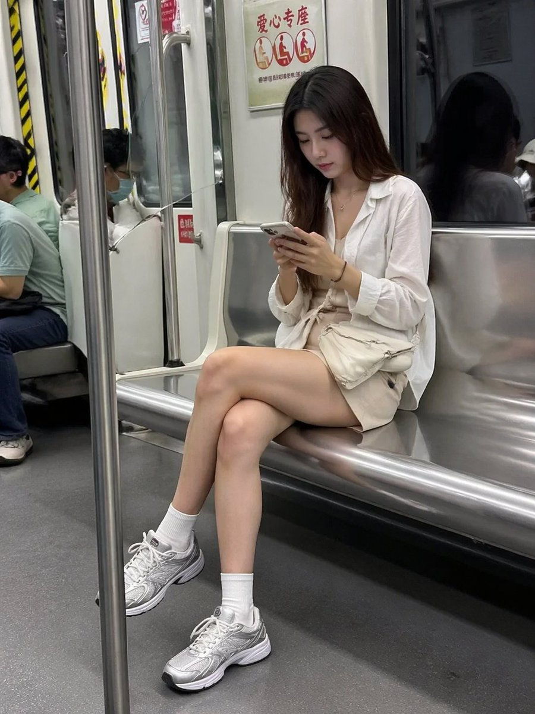 |

**Indicación:**

```
地铁上低头看手机的美丽女人，偷拍照片。

能免费试一次 ⬇️
```

<!-- Case 57: China Aerospace Commemorative Stamp Sheet (by @songguoxiansen) -->
### Case 57: [China Aerospace Commemorative Stamp Sheet](https://x.com/songguoxiansen/status/2047129703702802811?utm_source=github&utm_medium=readme&utm_campaign=awesome-gpt-image-2-prompts) (by [@songguoxiansen](https://x.com/songguoxiansen))

| Output |
| :----: |
| 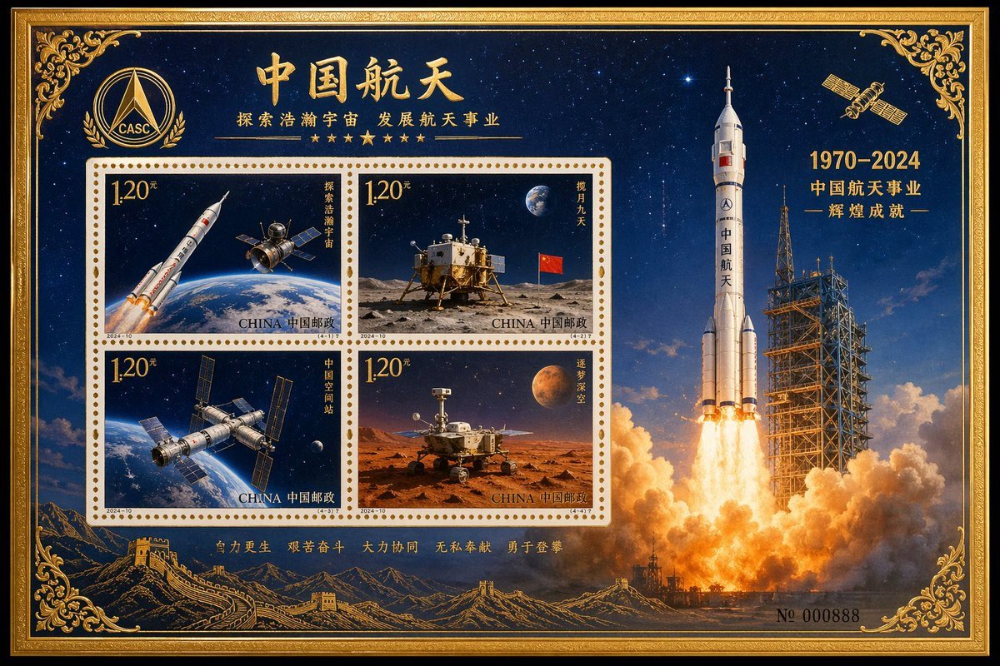 |

**Indicación:**

```
中国航天纪念邮票小全张，火箭发射场景，烫金边框工艺
```

<!-- Case 58: Vertical Wuxia Heroine Portrait (by @CoderDaMing) -->
### Case 58: [Vertical Wuxia Heroine Portrait](https://x.com/CoderDaMing/status/2047127585256358221?utm_source=github&utm_medium=readme&utm_campaign=awesome-gpt-image-2-prompts) (by [@CoderDaMing](https://x.com/CoderDaMing))

| Output |
| :----: |
| 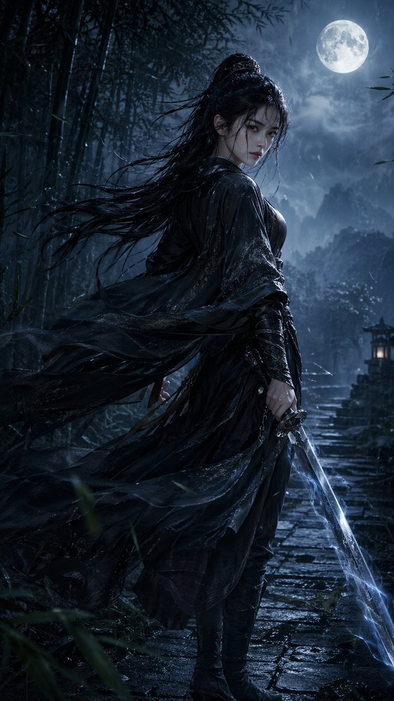 |

**Indicación:**

```
9:16 竖版，极致武侠风，绝美东方女侠，20岁出头，冷艳锐利丹凤眼，眉宇英气逼人，肤白如玉，长直黑发湿漉漉随狂风剧烈飞舞，几缕发丝贴在脸颊和颈侧，穿着湿透的深黑改良武侠劲装，外披宽袖玄色长袍，衣袍和长袖被风吹得剧烈飘扬翻飞，紧身劲装勾勒身材，腰束软剑带，足踏长靴，右手持一把古剑，剑身散发幽蓝剑气光芒，动态姿势：身体微侧回眸，衣袂猎猎，背景为月夜雨雾笼罩的竹林古道，巨大明月高悬，石板小径，古灯笼，薄雾雨丝，戏剧性冷月光与蓝光剑气结合，湿身水光效果，超强动态感，细腻布料褶皱、头发丝飘动、真实水珠反光，电影级光影，8k，masterpiece, best quality, ultra realistic, cinematic, dramatic atmosphere
```

<!-- Case 59: Realistic Guanyin Portrait from Buddhist Texts (by @Zhaoge01) -->
### Case 59: [Realistic Guanyin Portrait from Buddhist Texts](https://x.com/Zhaoge01/status/2047123570485260753?utm_source=github&utm_medium=readme&utm_campaign=awesome-gpt-image-2-prompts) (by [@Zhaoge01](https://x.com/Zhaoge01))

| Output |
| :----: |
| 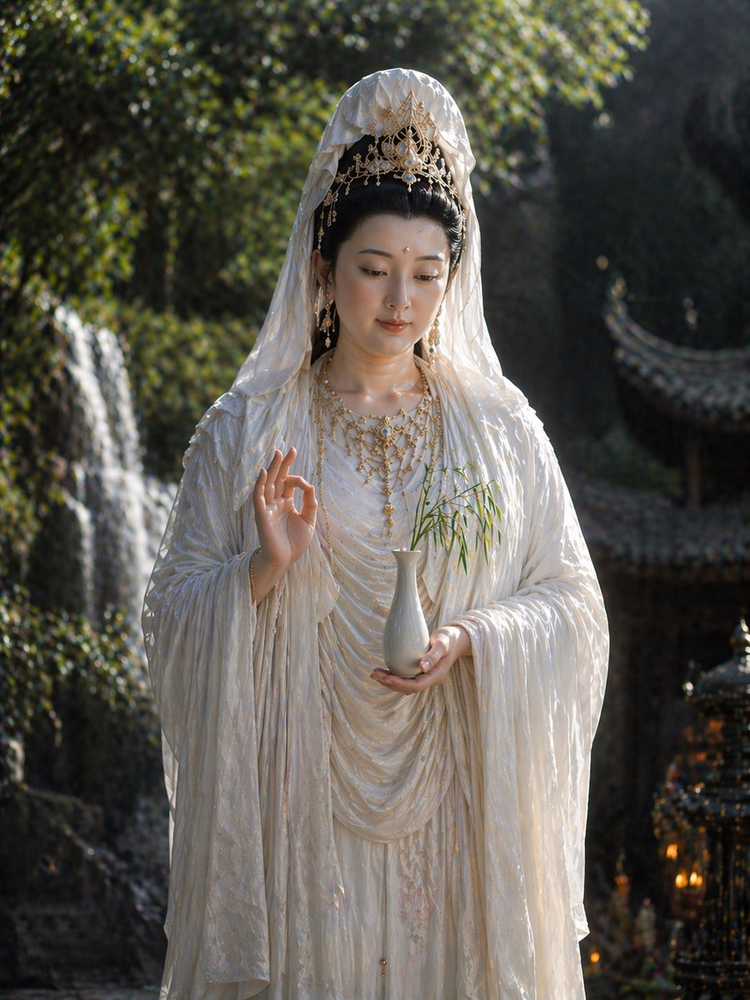 |

**Indicación:**

```
根据佛经对观音菩萨的形象描述，原原本本的还原一张真实的观音菩萨形象照片，皮肤与衣服接近真实，画质iPhone 15 pro
```

<!-- Case 60: Tang Dynasty Chang'an Lantern Festival Panorama (by @songguoxiansen) -->
### Case 60: [Tang Dynasty Chang'an Lantern Festival Panorama](https://x.com/songguoxiansen/status/2047122441454096527?utm_source=github&utm_medium=readme&utm_campaign=awesome-gpt-image-2-prompts) (by [@songguoxiansen](https://x.com/songguoxiansen))

| Output |
| :----: |
| 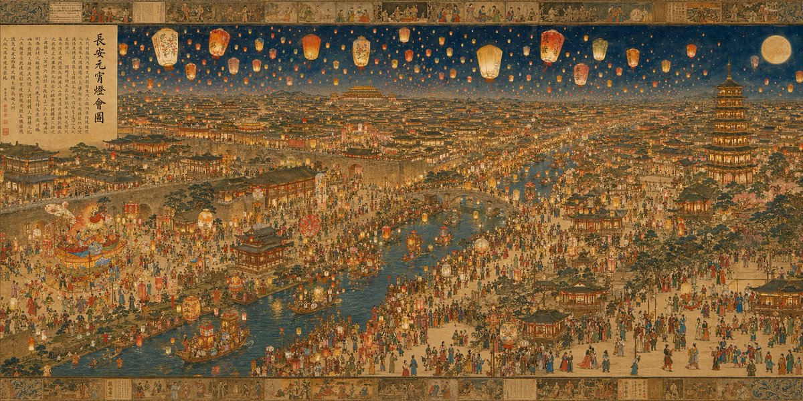 |

**Indicación:**

```
唐代长安城元宵灯会全景，万盏花灯照亮夜空，工笔重彩长卷
```

<!-- Case 61: Historical Yang Guifei Realistic Portrait (by @Zhaoge01) -->
### Case 61: [Historical Yang Guifei Realistic Portrait](https://x.com/Zhaoge01/status/2047110776897638568?utm_source=github&utm_medium=readme&utm_campaign=awesome-gpt-image-2-prompts) (by [@Zhaoge01](https://x.com/Zhaoge01))

| Output |
| :----: |
| 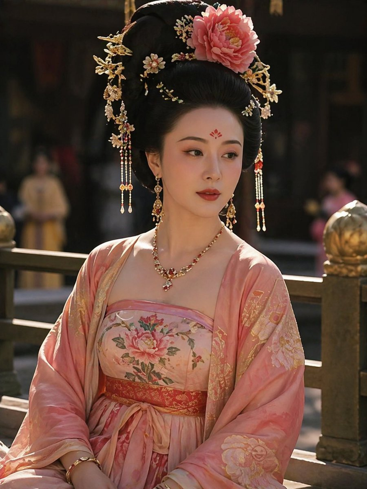 |

**Indicación:**

```
根据真实历史对杨玉环的形象描述，生成一张杨贵妃真实照片，画质为iPhone 15 pro
```

<!-- Case 62: Surreal Japanese Futuristic City Illustration (by @Tresmort) -->
### Case 62: [Surreal Japanese Futuristic City Illustration](https://x.com/Tresmort/status/2047105322863460496?utm_source=github&utm_medium=readme&utm_campaign=awesome-gpt-image-2-prompts) (by [@Tresmort](https://x.com/Tresmort))

| Output |
| :----: |
| 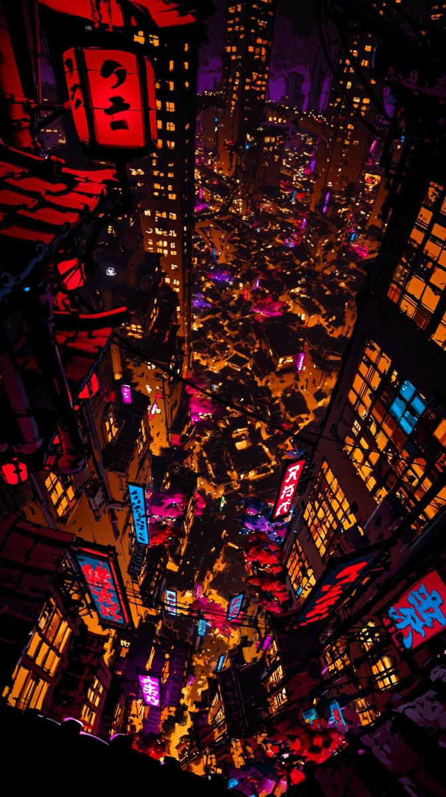 |

**Indicación:**

```
参考这张图的透视和风格，绘制一张更加精细的超高清插画，表现超现实主义的日式未来都市，要能看清很小的细节，包括街道上的传统文化游行的人，小巷里的黑帮，烟花巷的舞女，疲惫的社畜，楼房的窗户里也有各式各样的人物，学习的学生，吵架的夫妻，玩游戏的宅男，以及更多的发挥细节。讽刺现实拥挤中的无聊，都市繁华下的孤独，无意义的人生中又有一种病态的美感。画面要有极高的审美价值 ，不能因为拼内容而损失美和协调感，比例是9:16
```

<!-- Case 63: Tushan Yaya Fantasy Glamour Portrait (by @sdjn_wgc) -->
### Case 63: [Tushan Yaya Fantasy Glamour Portrait](https://x.com/sdjn_wgc/status/2046981757325475954?utm_source=github&utm_medium=readme&utm_campaign=awesome-gpt-image-2-prompts) (by [@sdjn_wgc](https://x.com/sdjn_wgc))

| Output |
| :----: |
| 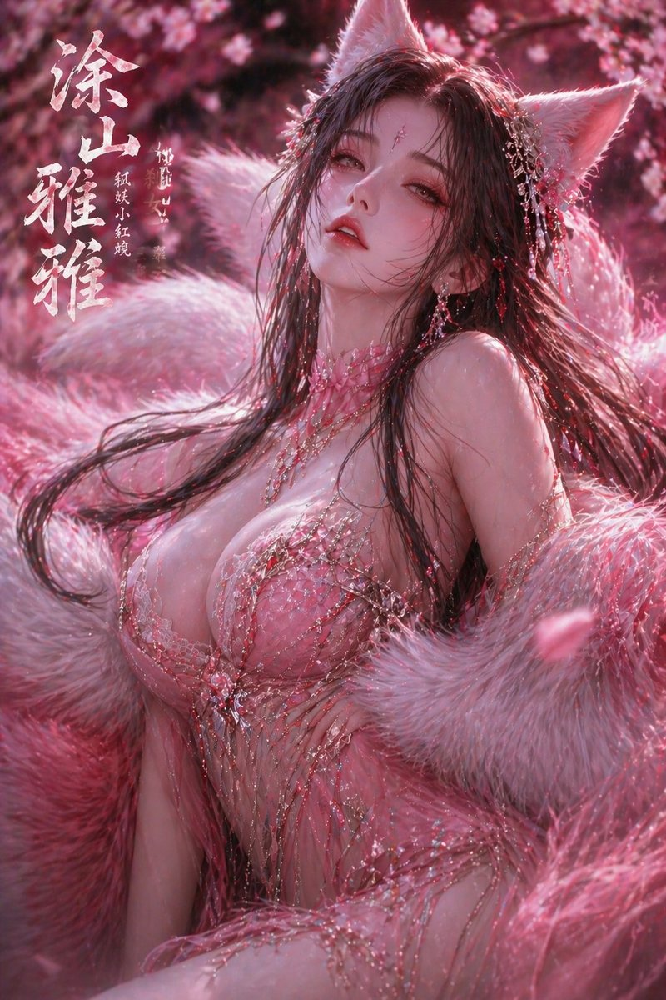 |

**Indicación:**

```
狐妖小红娘涂山雅雅写真大片，粉色九尾狐裘紧身裙，媚眼如丝，红唇微张，极致妖媚
```

<!-- Case 64: Douyin Livestream Sales Screenshot (by @LVWANGJI_0327) -->
### Case 64: [Douyin Livestream Sales Screenshot](https://x.com/LVWANGJI_0327/status/2046974302227206525?utm_source=github&utm_medium=readme&utm_campaign=awesome-gpt-image-2-prompts) (by [@LVWANGJI_0327](https://x.com/LVWANGJI_0327))

| Output |
| :----: |
|  |

**Indicación:**

```
生成一个抖音直播的截图 里面是一个美女在直播，在卖丝袜和内衣，她的在线人数是99996，热度是18+，有个叫小互的大哥，给她刷了一个飞机礼物
```

<!-- Case 65: Eastern Fantasy Female Half-Portrait (by @liyue_ai) -->
### Case 65: [Eastern Fantasy Female Half-Portrait](https://x.com/liyue_ai/status/2046962895775580442?utm_source=github&utm_medium=readme&utm_campaign=awesome-gpt-image-2-prompts) (by [@liyue_ai](https://x.com/liyue_ai))

| Output |
| :----: |
| 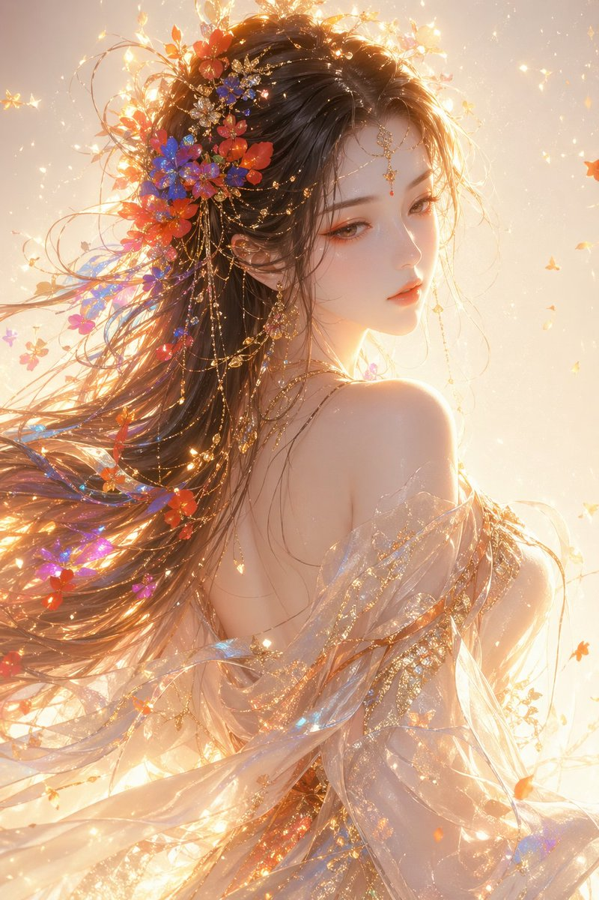 |

**Indicación:**

```
东方幻想风格女性，半身肖像，回眸侧脸，气质空灵优雅，柔和神性美感，细腻五官，微垂眼神，冷白细腻肌肤，淡雅橘粉妆容，金色高光点缀

长发飘动，发丝中融入彩色花朵与光粒（红、蓝、橙、紫），头发具有流动感与空气感

身穿半透明丝绸礼服与披肩，材质轻盈通透，布料随风飘动，表面带有鎏金纹理与闪耀颗粒。

整体光影为暖金色逆光，强边缘光，体积光明显，光粒漂浮，柔光泛光，梦幻氛围

背景干净浅色渐变，带微光与粒子效果，整体氛围空灵、梦境、神圣

风格：高端CG插画，超精细，电影级光影，柔光渲染，8K细节，artstation 热门作品风格
```

<!-- Case 66: Vertical Artistic Portrait of a Young Eastern Woman (by @zhiyangzhu22222) -->
### Case 66: [Vertical Artistic Portrait of a Young Eastern Woman](https://x.com/zhiyangzhu22222/status/2046952985562062888?utm_source=github&utm_medium=readme&utm_campaign=awesome-gpt-image-2-prompts) (by [@zhiyangzhu22222](https://x.com/zhiyangzhu22222))

| Output |
| :----: |
| 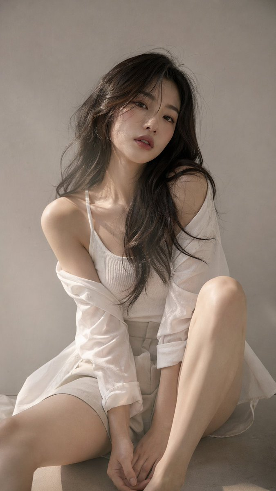 |

**Indicación:**

```
9:16 竖向构图，单人女性艺术肖像，年轻东方女生，五官清秀，脸部线条柔和，皮肤自然通透，保留真实肌理，气质安静高级，带一点疏离感和故事感。
摄影棚风格与自然光融合，柔和侧光，面部有细腻高光，阴影轻柔，整体光线通透不刺眼，带轻微黑雾滤镜效果，微朦胧、微泛光、空气感强。
背景极简干净，奶油灰、米白、浅卡其或雾感暖灰色墙面，留有大面积负空间，整体画面简洁、有呼吸感。
模特坐在地面或低台上，一条腿自然弯曲，一条腿放松伸展，身体轻微前倾或侧倾，肩膀不对称，头部轻轻倾斜，动作自然松弛，不刻意摆拍。
表情平静克制，眼神柔和，略微疏离，带一点若有所思的情绪，嘴唇自然微张或轻闭，状态慵懒、安静、细腻。
发型为自然蓬松的长发，微凌乱碎发，发丝轻柔，有空气感和层次感，像刚整理过但保留自然随性感。
妆容为高级淡妆，韩系清透底妆，皮肤柔雾光泽，鼻梁与面颊有自然高光，眉形干净，眼妆淡雅但有神，睫毛纤长，唇色为低饱和玫瑰豆沙色或奶茶裸粉色。
服装为简约高级风：米白色紧身罗纹针织背心，外搭宽松白衬衫或柔软针织开衫，下装为高腰半裙或简约短裤，布料柔软贴合身形但不过分暴露，呈现自然身体线条与文艺感。
画面强调细腻质感、柔和色调、轻法式与韩系杂志感结合，真实摄影感，电影级肤色，细节丰富，层次分明，构图克制，高级审美，时尚 编辑人像，柔和的电影感人像，细腻的质感，超高细节，逼真，优雅，精致，高端时尚摄影，含蓄的性感，简洁的构图。
```

<!-- Case 67: Autobots Assembled at Lunar Base (by @songguoxiansen) -->
### Case 67: [Autobots Assembled at Lunar Base](https://x.com/songguoxiansen/status/2046952548469530716?utm_source=github&utm_medium=readme&utm_campaign=awesome-gpt-image-2-prompts) (by [@songguoxiansen](https://x.com/songguoxiansen))

| Output |
| :----: |
| 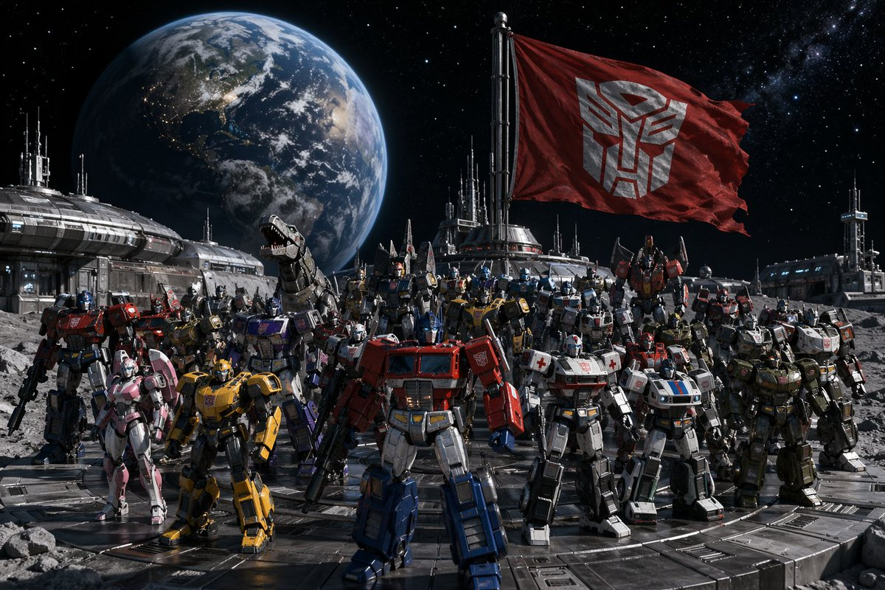 |

**Indicación:**

```
图片1：汽车人全员月球基地集结，地球悬于身后星空，赛博坦旗帜飘扬

图片2：霸天虎全员列阵外星战舰甲板，威震天坐于王座俯视全军
```

<!-- Case 68: Naturalist-Style Food Specimen Cross-Section (by @GeekCatX) -->
### Case 68: [Naturalist-Style Food Specimen Cross-Section](https://x.com/GeekCatX/status/2046939656244318676?utm_source=github&utm_medium=readme&utm_campaign=awesome-gpt-image-2-prompts) (by [@GeekCatX](https://x.com/GeekCatX))

| Output |
| :----: |
|  |

**Indicación:**

```
一颗/一块/一枚【食物名称】，以博物学大师发现野外标本的方式解剖。
剖开、展开、固定——如同博物馆的珍贵藏品，
却以卡拉瓦乔为《国家地理》掌镜时的光线照亮。
每一个内部结构都以自身的材质真相发光。
截面锋利得近乎暴力。内部美丽得近乎神圣。
画面中呈现完整标本：
一半保持原状，展示【外表面描述：质感/颜色/纹理】；
另一半剖开至核心，【内部核心结构描述：最重要的1—2个内部视觉特征】清晰可见。
【补充1—2句该食物最具视觉张力的横截面细节描述】
背景：纯粹的黑丝绒。
【食物名称】悬浮其中，如同某件珍贵而危险的事物。
标注文字紧贴结构边缘，手写感衬线字体，绝不悬空飘浮。
画面包含以下标注，每处标注三行：第一行结构名称，第二行成分数据，第三行一句人话：
【结构01名称】
【成分／数据说明】
【这个结构在做什么，为什么重要】

【结构02名称】
【成分／数据说明】
【这个结构在做什么，为什么重要】
【结构03名称】
【成分／数据说明】
【这个结构在做什么，为什么重要】
【结构04名称】
【成分／数据说明】
【这个结构在做什么，为什么重要】
【结构05名称】
【成分／数据说明】
【这个结构在做什么，为什么重要】

【结构06名称】
【成分／数据说明】
【这个结构在做什么，为什么重要】
省略其他如果有继续保持这个格式
主标题，左上角，暖象牙白大写字体：
【食物名称】·解剖

斜体副标题紧随其下：
【一句揭示这种食物本质的话，不超过15字】

整体气质：奥杜邦博物插画×卡拉瓦乔光影×有史以来最美的科学摄影。
4K精度，标本照明，极致内部细节。
没有任何临床感，一切都鲜活。
写实风格，非示意图，非卡通，非简化图解。
每一种材质都有真实的物理质感：
粗糙的、光滑的、湿润的、干燥的、致密的、疏松的。
```

<!-- Case 69: Polaroid Frame Breakout Scene (by @MajaDesignJP) -->
### Case 69: [Polaroid Frame Breakout Scene](https://x.com/MajaDesignJP/status/2047235632934928765?utm_source=github&utm_medium=readme&utm_campaign=awesome-gpt-image-2-prompts) (by [@MajaDesignJP](https://x.com/MajaDesignJP))

| Output |
| :----: |
| 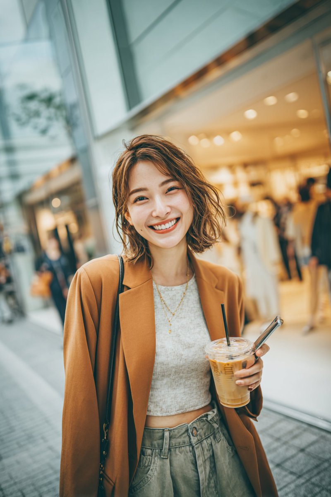 |

**Indicación:**

```
ポラロイド写真の中に人が写っていて、その人がフレームから外に飛び出している画像。日本語が書いてある画像生成して

←下の画像
GPT Image-2で生成したやつ→
```

<!-- Case 70: 2D Anime Character Real-World Grid Scenes (by @seiiiiiiiiiiru) -->
### Case 70: [2D Anime Character Real-World Grid Scenes](https://x.com/seiiiiiiiiiiru/status/2047227021156356500?utm_source=github&utm_medium=readme&utm_campaign=awesome-gpt-image-2-prompts) (by [@seiiiiiiiiiiru](https://x.com/seiiiiiiiiiiru))

| Output |
| :----: |
| 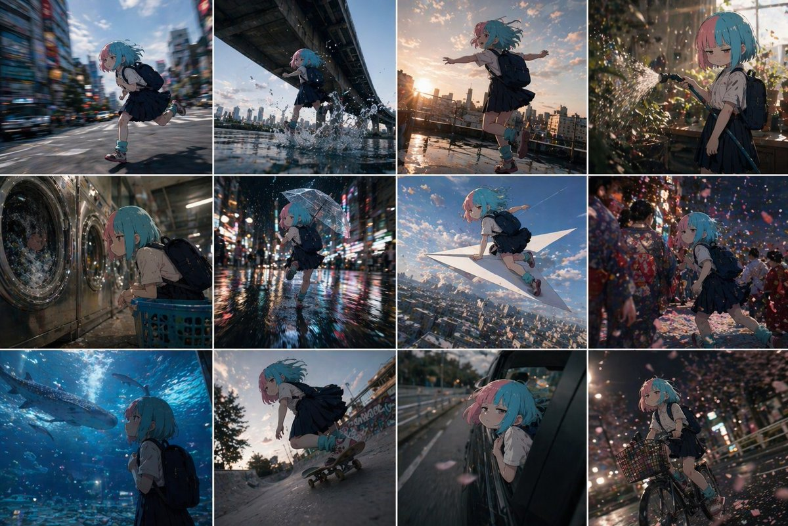 |

**Indicación:**

```
参照画像の２Dセルアニメキャラクターを使って、リアル世界で色んなことしてるグリッド分割した画像作ってぇ。
```

<!-- Case 71: Poster-to-Trailer Concept Prompt (by @os_shim) -->
### Case 71: [Poster-to-Trailer Concept Prompt](https://x.com/os_shim/status/2047130379409400148?utm_source=github&utm_medium=readme&utm_campaign=awesome-gpt-image-2-prompts) (by [@os_shim](https://x.com/os_shim))

| Output |
| :----: |
| 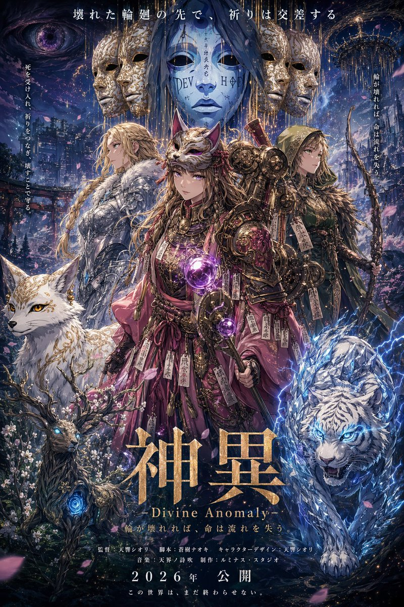 |

**Indicación:**

```
「このポスターを見みて、自分で妄想してトレーラー映像を作ってくれ。」
```

<!-- Case 72: Rubber Duck Boy Live-Action Movie Poster (by @mirai_ai2050) -->
### Case 72: [Rubber Duck Boy Live-Action Movie Poster](https://x.com/mirai_ai2050/status/2046944941583270341?utm_source=github&utm_medium=readme&utm_campaign=awesome-gpt-image-2-prompts) (by [@mirai_ai2050](https://x.com/mirai_ai2050))

| Output |
| :----: |
| 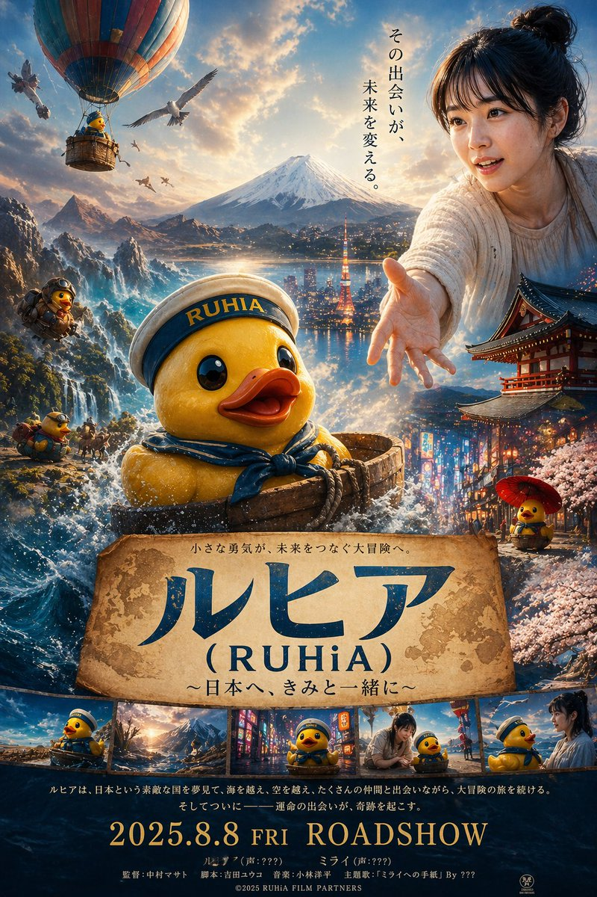 |

**Indicación:**

```
可愛いラバーダックの男の子「ルヒア(RUHiA)」が日本を目指して大冒険をして日本人女性の「ミライ」と出会うまでの物語。それを実写映画のポスターのようにして。

参照画像入れてないのに女性もミライの雰囲気に似てない？
```

<!-- Case 73: Tomato E-Commerce Product Image Set (by @Adam38363368936) -->
### Case 73: [Tomato E-Commerce Product Image Set](https://x.com/Adam38363368936/status/2047165092253532461?utm_source=github&utm_medium=readme&utm_campaign=awesome-gpt-image-2-prompts) (by [@Adam38363368936](https://x.com/Adam38363368936))

| Output |
| :----: |
| 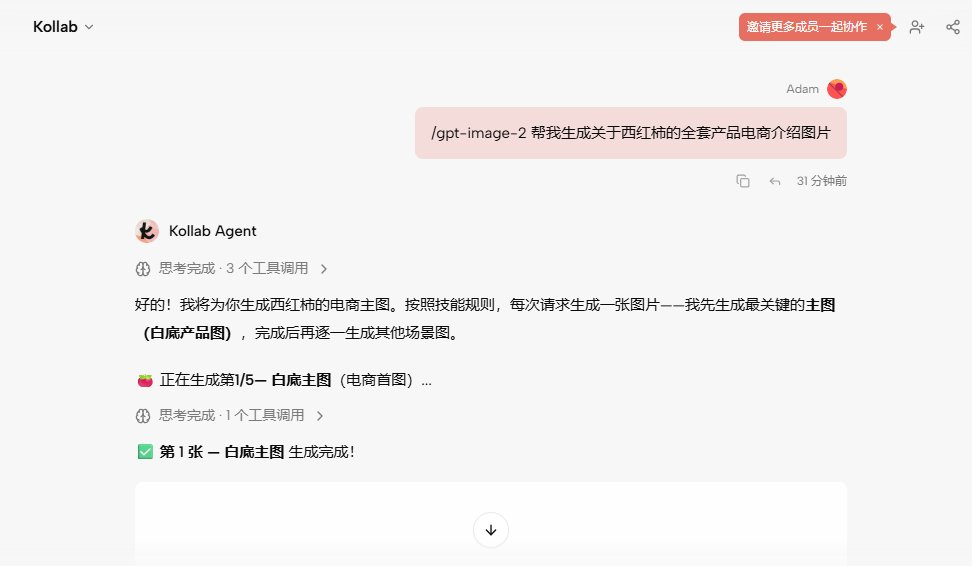 |

**Indicación:**

```
/gpt-image-2 帮我生成关于西红柿的全套产品电商介绍图片

使用地址
```

## Agradecimientos

Este repositorio se inspiro en destacadas colecciones abiertas de prompts y en experimentos de GPT-Image-2 compartidos por la comunidad.

Gracias a los creadores y colaboradores que compartieron su trabajo publicamente e hicieron posibles estos casos de estudio.

[@BubbleBrain](https://x.com/BubbleBrain), [@iam_miharbi](https://x.com/iam_miharbi), [@Shinning1010](https://x.com/Shinning1010), [@patrickassale](https://x.com/patrickassale), [@Zoulinshen](https://x.com/Zoulinshen), [@WolfRiccardo](https://x.com/WolfRiccardo), [@Panda20230902](https://x.com/Panda20230902), [@liyue_ai](https://x.com/liyue_ai), [@blanplan](https://x.com/blanplan), [@4WEB1](https://x.com/4WEB1), [@lilimliliychan](https://x.com/lilimliliychan), [@Thereallo1026](https://x.com/Thereallo1026), [@iamrednightS](https://x.com/iamrednightS), [@09lyco](https://x.com/09lyco), [@tsubaki_ew](https://x.com/tsubaki_ew), [@Toshi_nyaruo_AI](https://x.com/Toshi_nyaruo_AI), [@yyu_hase](https://x.com/yyu_hase), [@austinit](https://x.com/austinit), [@MrLarus](https://x.com/MrLarus), [@rionaifantasy](https://x.com/rionaifantasy), [@alanblogsooo](https://x.com/alanblogsooo), [@SKA_Neotype](https://x.com/SKA_Neotype), [@desds1678](https://x.com/desds1678), [@samifox_ai](https://x.com/samifox_ai), [@HuliJason](https://x.com/HuliJason), [@MikelEcheve](https://x.com/MikelEcheve), [@chetaslua](https://x.com/chetaslua), [@signedbywill](https://x.com/signedbywill), [@zerolu_eth](https://x.com/zerolu_eth), [@Cheney_NehcOal](https://x.com/Cheney_NehcOal), [@cnzoecomeback](https://x.com/cnzoecomeback), [@linxiaobei888](https://x.com/linxiaobei888), [@old_pgmrs_will](https://x.com/old_pgmrs_will), [@kotsu_kotsu_san](https://x.com/kotsu_kotsu_san), [@samayousakadaru](https://x.com/samayousakadaru), [@saskr_13](https://x.com/saskr_13), [@kawai_design](https://x.com/kawai_design), [@otohitoyuuki](https://x.com/otohitoyuuki), [@jrpj2010](https://x.com/jrpj2010), [@CEs7J0Mfn8x37k5](https://x.com/CEs7J0Mfn8x37k5), [@pfanis](https://x.com/pfanis), [@yssrski](https://x.com/yssrski), [@overseas58](https://x.com/overseas58), [@opc_8838](https://x.com/opc_8838), [@RitaStar1128](https://x.com/RitaStar1128), [@Yuupapa_free](https://x.com/Yuupapa_free), [@tebasaki3D](https://x.com/tebasaki3D)

*No podemos garantizar que cada caso este atribuido correctamente al creador original. Si algo debe corregirse, contactanos y lo actualizaremos.*

Si tienes mas casos interesantes de prompts de GPT-Image-2 para compartir, no dudes en escribirnos y ayudarnos a ampliar la biblioteca de prompts de Evolink.

## Star History

[](https://www.star-history.com/#EvoLinkAI/awesome-gpt-image-2-prompts&Date)
