<div align="center">

<a href="https://evolink.ai/gpt-image-2-prompts?utm_source=github&utm_medium=banner&utm_campaign=awesome-gpt-image-2-prompts"></a>

[](LICENSE)
[](https://evolink.ai/gpt-image-2-prompts?utm_source=github&utm_medium=badge&utm_campaign=awesome-gpt-image-2-prompts)
[](https://evolink.ai/gpt-image-2-prompts?utm_source=github&utm_medium=badge&utm_campaign=awesome-gpt-image-2-prompts)
[](https://evolink.ai/gpt-image-2-prompts?utm_source=github&utm_medium=badge&utm_campaign=awesome-gpt-image-2-prompts)
[](https://github.com/EvoLinkAI/GPT-Image-2-Seedance2-Workflow)

[](README.md)
[](README_es.md)
[](README_pt.md)
[](README_ja.md)
[](README_ko.md)
[](README_de.md)
[](README_fr.md)
[](README_tr.md)
[](README_zh-TW.md)
[](README_zh-CN.md)
[](README_ru.md)

</div>

## Introduccion

Bienvenido al repositorio awesome-gpt-image-2-prompts! 🤗

**Recopilamos prompts de alta calidad y ejemplos de imagen para GPT-Image-2 en retratos, posters, hojas de personajes, maquetas de UI y experimentos de la comunidad.**

La mayoria de los casos de este repositorio estan recopilados de X/Twitter, comunidades de creadores, demos publicas y experimentos compartidos.

Pruebalo en Evolink: [GPT-Image-2](https://evolink.ai/gpt-image-2-prompts?utm_source=github&utm_medium=readme&utm_campaign=awesome-gpt-image-2-prompts)

Si esto te resulta util, considera darle una estrella. ⭐

> [!NOTE]
> Este repositorio se centra en patrones de prompts reutilizables, casos de referencia y ejemplos especificos por tarea para GPT-Image-2 en Evolink.
> Las actualizaciones recientes solo de prompts tambien se registran en `gpt_image_2_prompt.json`.

<a href='https://evolink.ai/gpt-image-2-prompts?utm_source=github&utm_medium=badge&utm_campaign=awesome-gpt-image-2-prompts'></a>
<a href='https://evolink.ai/gpt-image-2-prompts?utm_source=github&utm_medium=badge&utm_campaign=awesome-gpt-image-2-prompts'></a>
<a href='https://evolink.ai/gpt-image-2-prompts?utm_source=github&utm_medium=badge&utm_campaign=awesome-gpt-image-2-prompts'></a>
<a href='https://evolink.ai/gpt-image-2-prompts?utm_source=github&utm_medium=badge&utm_campaign=awesome-gpt-image-2-prompts'></a>

## Novedades

- **26 de abril de 2026:** Se agregaron 9 nuevos casos de prompts de GPT-Image-2 (1 diseño de personaje, 7 poster, 1 UI)
- **25 de abril de 2026:** Se agregaron 81 nuevos casos de prompts de GPT-Image-2 (2 diseño de personaje, 20 retrato, 42 poster, 17 UI)
- **24 de abril de 2026:** Se agregaron 19 nuevos casos de prompts de GPT-Image-2 (6 comparativa, 6 poster, 7 UI)
- **23 de abril de 2026:** Se agregaron 5 nuevos casos de prompts de GPT-Image-2 (5 UI)
- **20 de abril de 2026:** Se agregaron 2 nuevos casos de prompts de GPT-Image-2 (1 diseño de personaje, 1 poster)
- **19 de abril de 2026:** Se agregaron 5 nuevos casos de prompts de GPT-Image-2 (3 poster, 2 UI)
- **17 de abril de 2026:** Se agregó 1 nuevo caso de prompt de GPT-Image-2 (1 poster)
- **16 de abril de 2026:** Se agregó 1 nuevo caso de prompt de GPT-Image-2 (1 poster)
- **25 de abril de 2026:** Se agregaron 22 nuevos casos de prompts de GPT-Image-2 en las secciones de retrato, poster y UI
- **23 de abril de 2026:** Se estandarizaron los titulos de los casos en `README.md` y en todos los README localizados, incluidos los elementos del menu, las anclas y los encabezados de casos
- **21 de abril de 2026:** Se categorizaron 48 nuevos casos de prompts en las secciones de la galeria y se descargaron las imagenes de salida enlazadas
- **21 de abril de 2026:** Se agregaron 12 nuevos prompts de GPT-Image-2 en casos de retrato, poster, UI y comparativas
- **20 de abril de 2026:** Se agregaron 10 nuevos prompts curados de GPT-Image-2 con recursos de imagen locales y actualizaciones del README.
- **19 de abril de 2026:** Se agregaron 10 nuevos prompts de GPT-Image-2 en casos de poster, UI y comparativas
- **18 de abril de 2026:** Primera publicacion del repositorio con una seleccion curada de casos de GPT-Image-2

## 📑 Menu

- [Introduccion](#introduccion)
- [Novedades](#novedades)
- [🛒 Casos de E-Commerce](#casos-de-e-commerce)
- [📣 Casos de Creatividad Publicitaria](#casos-de-creatividad-publicitaria)
- [Casos de Retrato y Fotografia](#casos-de-retrato-y-fotografia)
  - [Case 1: Retrato Neón de Tienda de Conveniencia (by @BubbleBrain)](#case-1-convenience-store-neon-portrait-by-bubblebrain)
  - [Case 2: Retrato Minimalista Cinematográfico (by @iam_miharbi)](#case-2-cinematic-minimal-portrait-by-iam_miharbi)
  - [Case 3: Retrato en Ryokan de Onsen Japonés (by @BubbleBrain)](#case-3-japanese-onsen-ryokan-portrait-by-bubblebrain)
  - [Case 4: Retrato Editorial Flash 35mm (by @BubbleBrain)](#case-4-35mm-flash-editorial-portrait-by-bubblebrain)
  - [Case 5: Selfie Espejo en Habitación (by @Shinning1010)](#case-5-mirror-selfie-bedroom-portrait-by-shinning1010)
  - [Case 6: Retrato Suave Aireado 35mm (by @BubbleBrain)](#case-6-soft-airy-35mm-portrait-by-bubblebrain)
  - [Case 7: Retrato de Belleza Glam de Lujo (by @patrickassale)](#case-7-luxury-glam-beauty-portrait-by-patrickassale)
  - [Case 8: Captura de Cosplayer 9:16 (by @Zoulinshen)](#case-8-916-cosplayer-portrait-screenshot-by-zoulinshen)
  - [Case 9: Retrato Urbano de Espaldas en la Calle (by @Tz_2022)](#case-9-urban-turn-back-street-portrait-by-tz_2022)
  - [Case 10: Instantánea de Sam Altman en Skatepark (by @Malek1173989)](#case-10-sam-altman-skatepark-snapshot-by-malek1173989)
  - [Case 11: Retrato en Cuadrícula 3x3 de Idol Coreano (by @BubbleBrain)](#case-11-korean-idol-3x3-grid-portrait-by-bubblebrain)
  - [Case 12: Idol Coreano con Flash de Cámara CCD (by @BubbleBrain)](#case-12-ccd-camera-flash-korean-idol-by-bubblebrain)
  - [Case 13: Collage 3x3 de Idol Coreano (by @BubbleBrain)](#case-13-korean-idol-3x3-collage-portrait-by-bubblebrain)
  - [Case 14: Retrato Editorial de Niebla Negra Suave (by @BubbleBrain)](#case-14-soft-black-mist-editorial-portrait-by-bubblebrain)
  - [Case 15: Retrato Escolar de Fresa Fujifilm (by @BubbleBrain)](#case-15-fujifilm-strawberry-school-portrait-by-bubblebrain)
  - [Case 16: Retrato de Idol con Niebla Negra Suave (by @BubbleBrain)](#case-16-soft-black-mist-idol-portrait-by-bubblebrain)
  - [Case 17: Retrato de Pareja Fujifilm (by @BubbleBrain)](#case-17-fujifilm-couple-portrait-by-bubblebrain)
  - [Case 18: Retrato de Autopercepción de IA (by @80vul)](#case-18-ai-self-perception-portrait-by-80vul)
  - [Case 19: Portada de Periódico Vintage Realista (by @Naiknelofar788)](#case-19-create-the-most-realistic-front-page-design-of-a-vintage-newspaper-featuring-by-naiknelofar788)
  - [Case 20: Artículo de Revista de Viajes (by @andis13)](#case-20-create-image-of-magazine-feature-article-travel-by-andis13)
  - [Case 21: Análisis Fotográfico y Recreación JSON (by @pavellaslov)](#case-21-analyze-this-photo-and-give-me-a-detailed-json-prompt-that-recreates-it-brea-by-pavellaslov)
  - [Case 22: Kit de Película de Té Verde (by @ZaraIrahh)](#case-22-calming-green-tea-film-kit-displayed-frontally-the-open-box-shows-soft-sage-by-zarairahh)
  - [Case 23: Fotografía de Helado de Fresa Ultra-Realista (by @ZaraIrahh)](#case-23-ultra-realistic-product-photography-of-a-rich-strawberry-soft-serve-ice-cream-by-zarairahh)
  - [Case 24: Mockup UI/UX Hiper-Realista en Laptop (by @ZaraIrahh)](#case-24-a-hyper-realistic-uiux-mockup-displayed-on-a-slim-modern-laptop-placed-on-a-by-zarairahh)
  - [Case 25: Retrato Cinematográfico DSLR Ultra-Realista (by @harboriis)](#case-25-ultra-realistic-cinematic-dslr-photograph-of-an-18-year-old-handsome-young-ma-by-harboriis)
- [Casos de Posters e Ilustracion](#casos-de-posters-e-ilustracion)
  - [Case 1: Póster de Ciudad Boston Primavera 2026 (by @BubbleBrain)](#case-1-boston-spring-2026-city-poster-by-bubblebrain)
  - [Case 2: Póster de Viaje Vintage Amalfi (by @WolfRiccardo)](#case-2-vintage-amalfi-travel-poster-by-wolfriccardo)
  - [Case 3: Ilustración Mapa Gastronómico de Chengdu (by @Panda20230902)](#case-3-chengdu-food-map-illustration-by-panda20230902)
  - [Case 4: Póster Minimalista Chino en Forma de S (by @liyue_ai)](#case-4-chinese-minimalist-s-shaped-poster-by-liyue_ai)
  - [Case 5: Póster de Ciudad Guangzhou Primavera 2026 (by @liyue_ai)](#case-5-2026-spring-guangzhou-city-poster-by-liyue_ai)
  - [Case 7: Boceto Doodle de Constructor IA (by @blanplan)](#case-7-doodle-sketch-ai-builder-by-blanplan)
  - [Case 8: Ilustración de Mandala Futurista (by @4WEB1)](#case-8-futuristic-mandala-illustration-by-4web1)
  - [Case 9: Estilo Póster Super Famicom (by @lilimliliychan)](#case-9-super-famicom-poster-style-by-lilimliliychan)
  - [Case 10: Póster Creativo de Anuncio de Juego de Navegador (by @llllegend0620)](#case-10-browser-game-ad-creative-poster-by-llllegend0620)
  - [Case 11: Ilustración Surrealista de Nebulosa Koi (by @liyue_ai)](#case-11-surreal-koi-nebula-illustration-by-liyue_ai)
  - [Case 12: Póster Estético de Guangzhou con Curva de Tinta (by @liyue_ai)](#case-12-ink-curve-guangzhou-aesthetics-poster-by-liyue_ai)
  - [Case 13: Póster de Invitación a la Superliga de Guangdong (by @liyue_ai)](#case-13-guangdong-super-league-invitation-poster-by-liyue_ai)
  - [Case 14: Póster Promocional de Guangzhou Primavera 2026 (by @grok)](#case-14-spring-2026-guangzhou-promo-poster-by-grok)
  - [Case 15: Póster Mundial de Silueta Épica (by @Ghhhh3owi)](#case-15-epic-silhouette-world-poster-by-ghhhh3owi)
  - [Case 24: Póster de Ciudad Guangzhou en Primavera (by @alanlovelq)](#case-24-spring-guangzhou-city-poster-by-alanlovelq)
  - [Case 26: Póster Estético Oriental de Qiongqi (by @liyue_ai)](#case-26-qiongqi-eastern-aesthetics-poster-by-liyue_ai)
  - [Case 27: Póster de Ciudad Guangzhou con Recorte de Papel (by @liyue_ai)](#case-27-guangzhou-paper-cut-city-poster-by-liyue_ai)
  - [Case 28: Puente de Tipografía con Perspectiva Extrema (by @xpg0970)](#case-28-extreme-perspective-typography-bridge-by-xpg0970)
  - [Case 31: Ilustración Editorial Acuarela Soñadora (by @hmontilla_)](#case-31-dreamy-watercolor-editorial-illustration-by-hmontilla_)
  - [Case 32: Póster Vertical de Enciclopedia Científica (by @pfanis)](#case-32-science-encyclopedia-vertical-poster-by-pfanis)
  - [Case 33: Cómic Chino Viaje al Oeste (by @overseas58)](#case-33-journey-to-the-west-chinese-comic-by-overseas58)
  - [Case 34: Póster de Mapa de Relaciones de Personajes (by @MrLarus)](#case-34-character-relationship-map-poster-by-mrlarus)
  - [Case 35: Póster de Paisaje de Tinta China Nueva (by @liyue_ai)](#case-35-new-chinese-ink-landscape-poster-by-liyue_ai)
  - [Case 36: Boceto Doodle de Constructor IA (by @opc_8838)](#case-36-ai-builder-doodle-sketch-by-opc_8838)
  - [Case 38: Póster Vertical Visual de Personaje (by @tebasaki3D)](#case-38-character-visual-vertical-poster-by-tebasaki3d)
  - [Case 39: Infografía de Enciclopedia Científica (by @MrLarus)](#case-39-science-encyclopedia-infographic-by-mrlarus)
  - [Case 40: Póster de Película Anime Ficticia (by @seiiiiiiiiiiru)](#case-40-fictional-anime-movie-poster-by-seiiiiiiiiiiru)
  - [Case 41: Rediseño de Anuncio de Producto (by @genel_ai)](#case-41-product-ad-redesign-by-genel_ai)
  - [Case 42: Póster de Ciudad Guangzhou Dark Fantasy (by @liyue_ai)](#case-42-dark-fantasy-guangzhou-city-poster-by-liyue_ai)
  - [Case 45: Póster de Película de Ciencia Ficción (by @underwoodxie96)](#case-45-science-fiction-movie-poster-by-underwoodxie96)
  - [Case 46: Anuncio Refrescante de Udon de Verano (by @genel_ai)](#case-46-refreshing-summer-udon-ad-by-genel_ai)
  - [Case 47: Hoja de Receta Médica Manuscrita (by @MrLarus)](#case-47-handwritten-medical-prescription-sheet-by-mrlarus)
  - [Case 48: Póster Promocional Silicon Valley 2026 (by @carsonyungos)](#case-48-silicon-valley-2026-promo-poster-by-carsonyungos)
  - [Case 49: Folleto de Oferta de Supermercado Japonés (by @weel_corp)](#case-49-japanese-supermarket-sale-flyer-by-weel_corp)
  - [Case 50: Póster Conceptual Épico Oscuro (by @A9Quant)](#case-50-dark-epic-concept-poster-by-a9quant)
  - [Case 51: Póster Publicitario de Estudio de Pilates (by @ck_igarashi)](#case-51-pilates-studio-ad-poster-by-ck_igarashi)
  - [Case 52: Fórmula de Prompt de 6 Bloques para Campaña de Moda (by @anacoding)](#case-52-6-block-fashion-campaign-prompt-formula-by-anacoding)
  - [Case 53: Prompt de Despiece del Sony A7 (by @iaPulse_)](#case-53-sony-a7-exploded-view-breakdown-prompt-by-iapulse_)
  - [Case 54: Prompt Panorámico de la Calle Istiklal 1900 (by @ai_gezgini)](#case-54-1900-istiklal-street-panorama-prompt-by-ai_gezgini)
  - [Case 55: Ultra-Dense Information Design (by @EchoraContinuum)](#case-55-ultra-dense-information-design-by-echoracontinuum)
  - [Case 56: Cute Chinese Expeditionary Force Storyboard (by @RainHuangapp)](#case-56-cute-chinese-expeditionary-force-storyboard-by-rainhuangapp)
  - [Case 57: Tarjeta Temática de Enciclopedia Científica (by @alanlovelq)](#case-57-theme-science-encyclopedia-card-by-alanlovelq)
  - [Case 55: Diagrama de Flujo de Cocción de Cerdo con Chile (by @Kurt_Rousey466)](#case-55-chili-pork-cooking-flowchart-by-kurt_rousey466)
  - [Case 56: Póster Conceptual de Infografía Cinematográfica (by @A9Quant)](#case-56-cinematic-infographic-concept-poster-by-a9quant)
  - [Case 58: Retrato Urbano de Moda Callejera (by @AIwithSarah_)](#case-58-a-full-body-outdoor-shot-captures-a-young-caucasian-woman-possibly-in-her-la-by-aiwithsarah_)
  - [Case 59: Fotografía Profesional de Agua con Gas (by @meng_dagg695)](#case-59-a-professional-product-photography-shot-of-a-cold-sparkling-water-by-meng_dagg695)
  - [Case 60: Imagen Panorámica Equirectangular 360° (by @rs_elwood)](#case-60-360-equirectangular-panorama-image)
  - [Case 61: Soft poetic children's book illustration with watercolor and gouache textures... (by @dotey)](#case-61-soft-poetic-childrens-book-illustration-with-watercolor-and-gouache-textures-by-dotey)
  - [Case 62: Formato Vertical 9:16 (by @GeekCatX)](#case-62-aspect-ratio-916-vertical-by-geekcatx)
  - [Case 63: Póster Turístico del Lago Oeste de Hangzhou (by @BNBOKBt5)](#case-63-hangzhou-west-lake-travel-poster)
  - [Case 64: Póster del Personaje Wuxia Dongfang Bubai (by @songguoxiansen)](#case-64-dongfang-bubai-wuxia-character-poster)
  - [Case 65: Póster Estilo Hong Kong Años 90 de A Chinese Odyssey (by @songguoxiansen)](#case-65-a-chinese-odyssey-90s-hong-kong-poster)
  - [Case 66: Póster del Reino de las Mujeres de Viaje al Oeste (by @cj858cjsoul)](#case-66-journey-to-the-west-daughter-kingdom-poster)
  - [Case 67: Póster del Personaje de Royal Tramp (by @caiziboshi)](#case-67-royal-tramp-character-poster)
  - [Case 68: Póster de Auto de Carreras con Especificaciones (by @verysmallwoods)](#case-68-generate-an-image-of-a-racing-car-poster-with-its-spec-and-pricing-by-verysmallwoods)
  - [Case 69: Rediseño de Póster de Producto con Charlie Chaplin (by @chenenpei)](#case-69-charlie-chaplin-product-poster-redesign)
- [Casos de Diseno de Personajes](#casos-de-diseno-de-personajes)
  - [Case 1: Conversión de Instantánea Anime (by @Thereallo1026)](#case-1-anime-snapshot-conversion-by-thereallo1026)
  - [Case 2: Tarjeta de Referencia de Personaje Persona5 (by @iamrednightS)](#case-2-persona5-character-reference-card-by-iamrednights)
  - [Case 3: Página de Introducción de Personaje de Gal Game (by @09lyco)](#case-3-gal-game-character-introduction-page-by-09lyco)
  - [Case 5: Hoja Oficial de Personaje (JP) (by @Toshi_nyaruo_AI)](#case-5-official-character-sheet-jp-by-toshi_nyaruo_ai)
  - [Case 7: Visual Clave de Chica Mecha Ciudad-Mar (by @old_pgmrs_will)](#case-7-mecha-girl-sea-city-key-visual-by-old_pgmrs_will)
  - [Case 8: Cuadrícula de Tarjetas de los Santos de Oro de Saint Seiya (by @songguoxiansen)](#case-8-saint-seiya-gold-saints-card-grid-by-songguoxiansen)
  - [Case 9: Arte de Personaje Rostro Oculto de Chaos Notes (by @loglogrog)](#case-9-chaos-notes-hidden-face-character-art-by-loglogrog)
- [Casos de UI y Mockups de Redes Sociales](#casos-de-ui-y-mockups-de-redes-sociales)
  - [Case 1: Generación de Diseño UI con Un Prompt (by @austinit)](#case-1-one-prompt-ui-design-generation-by-austinit)
  - [Case 2: Instantánea Amateur de Keynote en iPhone (by @patrickassale)](#case-2-amateur-iphone-keynote-snapshot-by-patrickassale)
  - [Case 3: Foto de Cuaderno Manuscrito (by @patrickassale)](#case-3-handwritten-notebook-photo-by-patrickassale)
  - [Case 4: Feed de Redes Sociales de la Dinastía Song (by @Panda20230902)](#case-4-song-dynasty-social-media-feed-by-panda20230902)
  - [Case 5: Capturas de Contenido Multiplataforma (by @MrLarus)](#case-5-multi-platform-content-screenshots-by-mrlarus)
  - [Case 7: Captura de Livestream de Liu Yifei en Douyin (by @alanblogsooo)](#case-7-liu-yifei-douyin-livestream-screenshot-by-alanblogsooo)
  - [Case 8: Página X del Rey Taejo Yi Seong-gye (by @SKA_Neotype)](#case-8-king-taejo-yi-seong-gyes-x-page-by-ska_neotype)
  - [Case 9: Sistema de Diseño Estilo-a-UI (by @stark_nico99)](#case-9-style-to-ui-design-system-by-stark_nico99)
  - [Case 10: Diapositiva Explicativa de Momotaro (by @yammamon)](#case-10-momotaro-explainer-slide-by-yammamon)
  - [Case 25: Museum-Style Hanfu Breakdown Infographic (by @MrLarus)](#case-25-museum-style-hanfu-breakdown-infographic-by-mrlarus)
  - [Case 26: Glassy UI Design System (by @pfanis)](#case-26-glassy-ui-design-system-by-pfanis)
  - [Case 27: Japanese RPG Status Screen (by @Kashiko_AIart)](#case-27-japanese-rpg-status-screen-by-kashiko_aiart)
  - [Case 28: Xuanwu Gate Social Feed (by @Tz_2022)](#case-28-xuanwu-gate-social-feed-by-tz_2022)
  - [Case 29: City Travel Guide Infographic (by @MrLarus)](#case-29-city-travel-guide-infographic-by-mrlarus)
  - [Case 30: 3D X Profile Mockup (by @GoSailGlobal)](#case-30-3d-x-profile-mockup-by-gosailglobal)
  - [Case 31: Empress Dowager Cixi X Page (by @Cryptohaifeng_)](#case-31-empress-dowager-cixi-x-page-by-cryptohaifeng_)
  - [Case 32: Palm Reading Diagnosis Report (by @agi_aibusi)](#case-32-palm-reading-diagnosis-report-by-agi_aibusi)
  - [Case 33: Calligraphy Copybook Sheet (by @MrLarus)](#case-33-calligraphy-copybook-sheet-by-mrlarus)
  - [Case 34: Don Quijote Promo Pop Poster (by @loglogrog)](#case-34-don-quijote-promo-pop-poster-by-loglogrog)
  - [Case 35: Japanese Gacha Game Screen (by @the_wheel_2024)](#case-35-japanese-gacha-game-screen-by-the_wheel_2024)
  - [Case 36: Elon Musk Douyin Livestream Screenshot (by @Shinning1010)](#case-36-elon-musk-douyin-livestream-screenshot-by-shinning1010)
  - [Case 37: Liu Yifei Douyin Livestream Screenshot (by @kylegeeks)](#case-37-liu-yifei-douyin-livestream-screenshot-by-kylegeeks)
  - [Case 38: Cyberpunk Neon UI Design System (by @AZLnfvp)](#case-38-cyberpunk-neon-ui-design-system-by-azlnfvp)
  - [Case 39: Trump and Kim Livestream PK Screenshot (by @alanlovelq)](#case-39-trump-and-kim-livestream-pk-screenshot-by-alanlovelq)
  - [Case 40: Japanese AI Game Dev Overview Slide Prompt (by @ailovedirector)](#case-40-japanese-ai-game-dev-overview-slide-prompt-by-ailovedirector)
  - [Case 41: based on the generated character help me generate a screenshot of screenshot ... (by @khaiinit)](#case-41-based-on-the-generated-character-help-me-generate-a-screenshot-of-screenshot-by-khaiinit)
  - [Case 42: Create a landing page using this image as a reference for style and color gra... (by @D_studioproject)](#case-42-create-a-landing-page-using-this-image-as-a-reference-for-style-and-color-gra-by-d_studioproject)
  - [Case 43: Fondo de Transmisión en Vivo de Lápiz Labial de Li Jiaqi (by @songguoxiansen)](#case-43-li-jiaqi-lipstick-livestream-background)
- [Comparativas y Ejemplos de la Comunidad](#comparativas-y-ejemplos-de-la-comunidad)
  - [Case 5: Wooden Bookshelf Prompt Test (by @chetaslua)](#case-5-wooden-bookshelf-prompt-test-by-chetaslua)
  - [Case 10: GPT-Image-2 Detail Showcase (by @liyue_ai)](#case-10-gpt-image-2-detail-showcase-by-liyue_ai)
  - [Case 16: A/B Test Signed Output (by @saskr_13)](#case-16-ab-test-signed-output-by-saskr_13)
  - [Case 23: Silhouette Universe Narrative Poster (by @MrLarus)](#case-23-silhouette-universe-narrative-poster-by-mrlarus)
  - [Case 29: Lion Camel Ridge Dark Myth Scene (by @MANISH1027512)](#case-29-lion-camel-ridge-dark-myth-scene-by-manish1027512)
  - [Case 30: Counter-Strike x Terraria Screenshot Mashup (by @yssrski)](#case-30-counter-strike-x-terraria-screenshot-mashup-by-yssrski)
  - [Case 31: Pre-war Japan Lab Minecraft Screenshot (by @RitaStar1128)](#case-31-pre-war-japan-lab-minecraft-screenshot-by-ritastar1128)
  - [Case 32: Forged Masterpiece Prompt Test (by @MrLarus)](#case-32-forged-masterpiece-prompt-test-by-mrlarus)
  - [Case 33: Multi-Concept Battle Poster Set (by @joshesye)](#case-33-multi-concept-battle-poster-set-by-joshesye)
  - [Case 34: Rust In-Game Screenshot (by @FixlationAI)](#case-34-rust-in-game-screenshot-by-fixlationai)
  - [Case 35: Sam Altman Bear Selfie (by @JustinGorya)](#case-35-sam-altman-bear-selfie-by-justingorya)
  - [Case 36: Among Us Realistic Screenshot (by @ReYYYYoking)](#case-36-among-us-realistic-screenshot-by-reyyyyoking)
  - [Case 37: Retro Programming Museum Cartoon (by @XiaohuiAI666)](#case-37-retro-programming-museum-cartoon-by-xiaohuiai666)
  - [Case 38: 14th-Dimension Projection Scene (by @workingclassbud)](#case-38-14th-dimension-projection-scene-by-workingclassbud)
  - [Case 39: Sam Altman Baseball Broadcast (by @16kthir0GRXgNqn)](#case-39-sam-altman-baseball-broadcast-by-16kthir0grxgnqn)
  - [Case 40: Based on the video content and this current frame, use GPT to generate a YouT... (by @chatcutapp)](#case-40-based-on-the-video-content-and-this-current-frame-use-gpt-to-generate-a-yout-by-chatcutapp)
  - [Case 41: Evento Más Significativo de 2020 (by @Rufus87078959)](#case-41-generate-an-image-of-the-most-significant-event-of-2020-by-rufus87078959)
  - [Case 42: Edit this image so that total amount changes to 244.5 baht. You can change th... (by @elliscrosby)](#case-42-edit-this-image-so-that-total-amount-changes-to-2445-baht-you-can-change-th-by-elliscrosby)
  - [Case 43: Evento Más Significativo de 2001 (by @Rufus87078959)](#case-43-generate-an-image-of-the-most-significant-event-of-2001-by-rufus87078959)
  - [Case 44: Evento Más Significativo de 2025 (by @Rufus87078959)](#case-44-generate-an-image-of-the-most-significant-event-of-2025-by-rufus87078959)
  - [Case 45: Generador de Infografía de Perfil Personal (by @andis13)](#case-45-personal-profile-infographic-generator)
  - [Case 46: Imagen Panorámica Equirectangular 360° (by @rs_elwood)](#case-46-360-equirectangular-panorama-image)
  - [Case 47: Retrato Infográfico de Conocimiento Personal (by @aitorwilzig)](#case-47-personal-knowledge-infographic-portrait)
  - [Case 48: Infografía de Diseño de Fármacos LIME (by @WillSpagnoli)](#case-48-research-lime-drug-design-and-make-a-detailed-infographic-about-it-by-willspagnoli)
  - [Case 49: Captura de Transmisión en Vivo de Ventas en Douyin (by @laogeai)](#case-49-douyin-livestream-sales-screenshot)
  - [Case 50: Pantalla de Coincidencia Exitosa de App Social (by @songguoxiansen)](#case-50-social-app-match-success-screen)
  - [Case 51: Hoja de Diseño del Jefe Lu Bu (by @songguoxiansen)](#case-51-lu-bu-boss-design-sheet)
  - [Case 52: Portada de Novela de Fantasía Oscura de Nezha (by @songguoxiansen)](#case-52-nezha-dark-fantasy-novel-cover)
  - [Case 53: Ilustración Floral Minimalista de Nuevo Estilo Chino (by @liyue_ai)](#case-53-new-chinese-minimalist-floral-illustration)
  - [Case 54: Retrato Glamuroso de Su Daji en Estilo Antiguo (by @nidiedeba)](#case-54-su-daji-ancient-style-glamour-portrait)
  - [Case 55: Ilustración de Flores Matutinas de Lu Xun (by @Aurora_62340)](#case-55-lu-xun-morning-flowers-illustration)
  - [Case 56: Foto Espontánea en el Metro con Teléfono (by @AntCaveClub)](#case-56-subway-candid-phone-snapshot)
  - [Case 57: Hoja de Sellos Conmemorativos Aeroespaciales de China (by @songguoxiansen)](#case-57-china-aerospace-commemorative-stamp-sheet)
  - [Case 58: Retrato Vertical de Heroína Wuxia (by @CoderDaMing)](#case-58-vertical-wuxia-heroine-portrait)
  - [Case 59: Retrato Realista de Guanyin según Textos Budistas (by @Zhaoge01)](#case-59-realistic-guanyin-portrait-from-buddhist-texts)
  - [Case 60: Panorama del Festival de Linternas de Chang'an en la Dinastía Tang (by @songguoxiansen)](#case-60-tang-dynasty-changan-lantern-festival-panorama)
  - [Case 61: Retrato Realista Histórico de Yang Guifei (by @Zhaoge01)](#case-61-historical-yang-guifei-realistic-portrait)
  - [Case 62: Ilustración Surrealista de Ciudad Futurista Japonesa (by @Tresmort)](#case-62-surreal-japanese-futuristic-city-illustration)
  - [Case 63: Retrato Glamuroso de Fantasía de Tushan Yaya (by @sdjn_wgc)](#case-63-tushan-yaya-fantasy-glamour-portrait)
  - [Case 64: Captura de Transmisión en Vivo de Ventas en Douyin (by @LVWANGJI_0327)](#case-64-douyin-livestream-sales-screenshot)
  - [Case 65: Medio Retrato Femenino de Fantasía Oriental (by @liyue_ai)](#case-65-eastern-fantasy-female-half-portrait)
  - [Case 66: Retrato Artístico Vertical de Joven Mujer Oriental (by @zhiyangzhu22222)](#case-66-vertical-artistic-portrait-of-a-young-eastern-woman)
  - [Case 67: Autobots Reunidos en la Base Lunar (by @songguoxiansen)](#case-67-autobots-assembled-at-lunar-base)
  - [Case 68: Sección Transversal de Espécimen Alimentario Estilo Naturalista (by @GeekCatX)](#case-68-naturalist-style-food-specimen-cross-section)
  - [Case 69: Escena de Ruptura de Marco Polaroid (by @MajaDesignJP)](#case-69-polaroid-frame-breakout-scene)
  - [Case 70: Escenas de Cuadrícula de Personaje Anime 2D en el Mundo Real (by @seiiiiiiiiiiru)](#case-70-2d-anime-character-real-world-grid-scenes)
  - [Case 71: Concepto de Tráiler a Partir de Póster (by @os_shim)](#case-71-poster-to-trailer-concept-prompt)
  - [Case 72: Póster de Película de Acción Real del Pato de Goma (by @mirai_ai2050)](#case-72-rubber-duck-boy-live-action-movie-poster)
  - [Case 73: Conjunto de Imágenes de Producto de Tomate para E-Commerce (by @Adam38363368936)](#case-73-tomato-e-commerce-product-image-set)
- [Agradecimientos](#agradecimientos)
- [Star History](#star-history)

## Casos de E-Commerce

<!-- Case 113: E-commerce Main Image - Luxury Amber Perfume Ad (by @Polanco_IA) -->
### Case 113: [E-commerce Main Image - Luxury Amber Perfume Ad](https://x.com/Polanco_IA/status/2047689647967609037) (by [@Polanco_IA](https://x.com/Polanco_IA))

| Output |
| :----: |
| 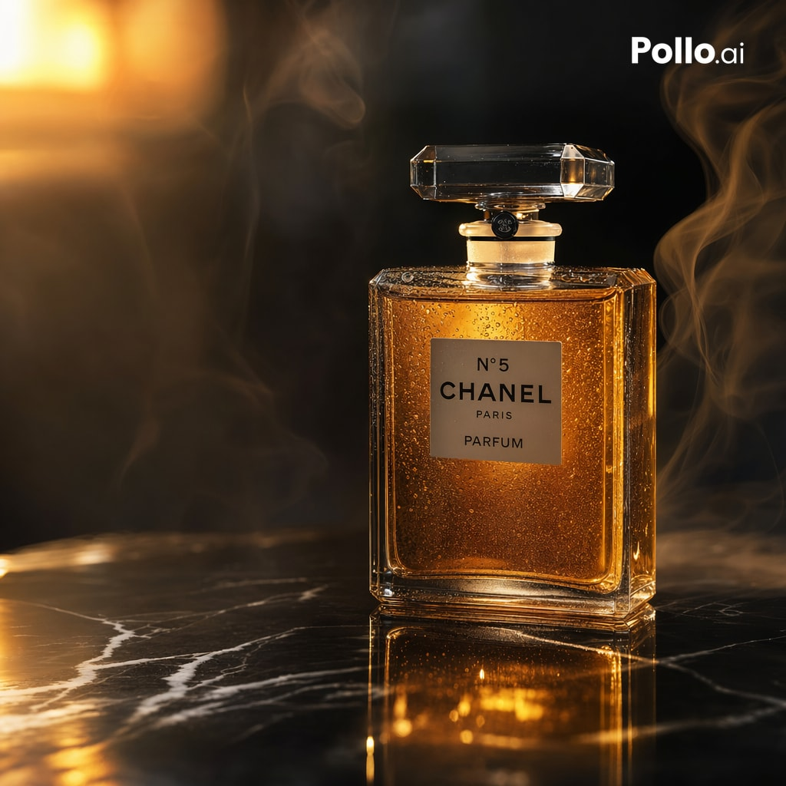 |

**Prompt:**

```
A luxurious cinematic product photograph of a classic rectangular perfume bottle inspired by {argument name="brand label" default="N°5 CHANEL PARIS PARFUM"}, placed upright on a glossy black marble surface with white veining. The bottle is centered slightly to the right, made of clear faceted glass with a large transparent crystal stopper, filled with rich amber-gold perfume that glows from within. Tiny condensation droplets cover the glass, adding texture and realism. Dramatic warm lighting from the upper left creates golden highlights, deep reflections on the marble, and a soft luminous bloom in the background. Wisps of elegant smoke curl around the bottle on both sides, enhancing a moody high-end advertisement feel. Dark background, shallow depth of field, ultra-detailed studio product photography, luxury beauty campaign aesthetic, crisp focus on the bottle, realistic reflections, warm black-and-gold color palette. Add a small white {argument name="corner logo" default="Pollo.ai"} in the top-right corner. Square composition, premium commercial ad, photorealistic, high contrast, refined and sophisticated.
```

<!-- Case 114: E-commerce Main Image - Skincare Product Studio Shot (by @Strength04_X) -->
### Case 114: [E-commerce Main Image - Skincare Product Studio Shot](https://x.com/Strength04_X/status/2047636636847231222) (by [@Strength04_X](https://x.com/Strength04_X))

| Output |
| :----: |
|  |

**Prompt:**

```
A soft {argument name="bottle color" default="cream-colored"} bottle with a {argument name="pump color" default="pastel yellow"} pump stands on a matte podium, surrounded by silky foam and {argument name="flowers" default="chamomile blossoms"}. The background is a pale yellow gradient with subtle bubble details. The label emphasizes organic chamomile and calming care. Fresh chamomile flowers accentuate the gentle appeal.
```

<!-- Case 115: E-commerce Main Image - Tropical Citrus Soda Ad Poster (by @edimakorfr) -->
### Case 115: [E-commerce Main Image - Tropical Citrus Soda Ad Poster](https://x.com/edimakorfr/status/2047635133466124726) (by [@edimakorfr](https://x.com/edimakorfr))

| Output |
| :----: |
| 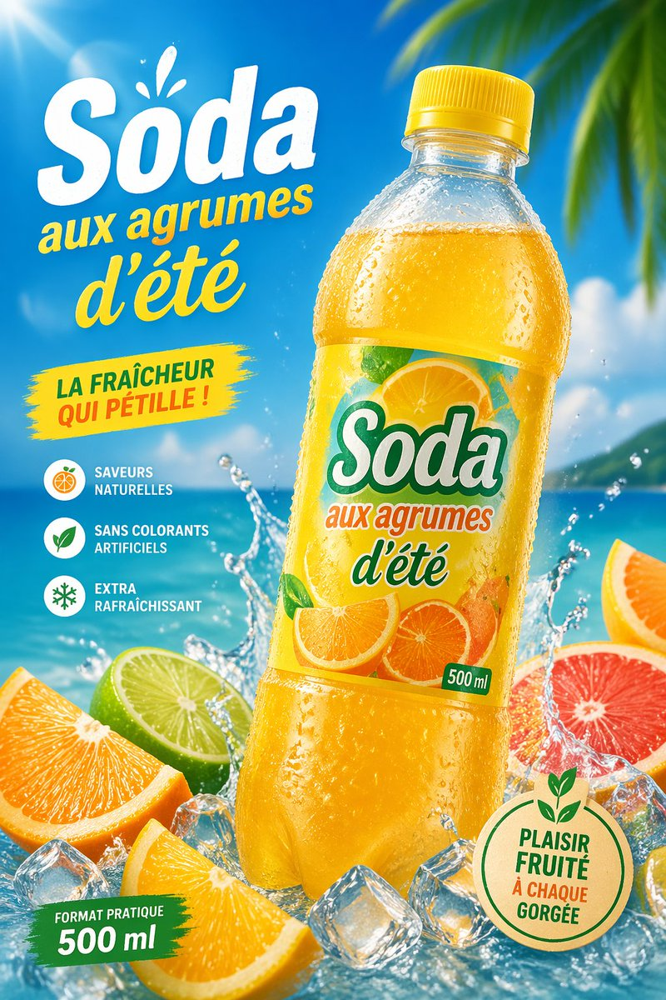 |

**Prompt:**

```
Create a vibrant tropical commercial poster for a citrus soda bottle, in a bright summer advertising style. Show a single large plastic bottle of {argument name="product name" default="Soda"} centered slightly to the right, tilted a little left, with a yellow cap and transparent bottle covered in cold condensation droplets, filled with glowing golden-orange soda. The label should feature sliced oranges and citrus artwork with the brand text "{argument name="product name" default="Soda"}", the phrase "aux agrumes d'été", and a small green "500 ml" mark. Use a sunny beach background with vivid blue sky, turquoise ocean, soft clouds, and blurred tropical palm leaves entering from the upper right corner. Add dramatic water splashes around the base of the bottle, scattered clear ice cubes, and 5 visible citrus pieces in the foreground: 2 orange wedges, 1 lime half, 1 grapefruit half, and 1 partial orange slice at the far right edge. Place large French promotional text on the left: a huge white headline "{argument name="headline text" default="Soda"}" with a small splash accent above it, then yellow script text "aux agrumes d'été" underneath. Add a yellow paint-stroke badge at mid-left with the text "LA FRAÎCHEUR QUI PÉTILLE !". Add a vertical feature list on the lower left with 3 round icons and French captions: "SAVEURS NATURELLES", "SANS COLORANTS ARTIFICIELS", and "EXTRA RAFRAÎCHISSANT". Add a green brushstroke banner at the bottom left reading "FORMAT PRATIQUE 500 ml". Add a round beige eco-style seal at the bottom right with green outline and leaf motif, containing the text "{argument name="seal text" default="PLAISIR FRUITÉ À CHAQUE GORGÉE"}". Lighting should be glossy and high-energy with strong sun flare from the upper left, saturated citrus colors, crisp packaging detail, realistic droplets, and polished supermarket-ad realism.
```

<!-- Case 116: E-commerce Main Image - Industrial Design Presentation Sheet (by @ShamsAmin56) -->
### Case 116: [E-commerce Main Image - Industrial Design Presentation Sheet](https://x.com/ShamsAmin56/status/2047627860752621647) (by [@ShamsAmin56](https://x.com/ShamsAmin56))

| Output |
| :----: |
| 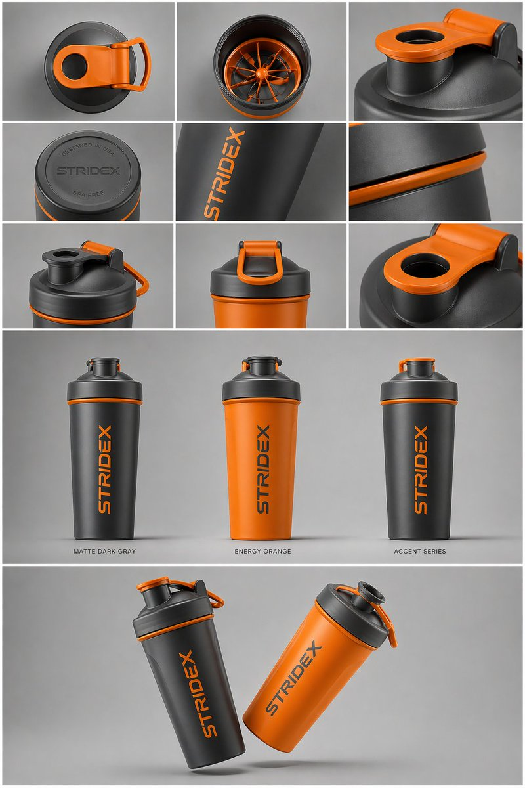 |

**Prompt:**

```
Core Subject: [{argument name="reference" default="use the uploaded image"}, keep the details, typography and structure locked 100%]

Layout & Composition: A {argument name="presentation type" default="professional industrial design presentation sheet"}. The image should be organized into a clean grid system.

Top Row: A 3x3 layout showing top-down flat lay views and close-up macro details of materials.

Middle Section: Three hero shots of the product standing upright in different color ways (Matte Black, Arctic White, and accented variants). The products should be slightly tilted to show depth and form.

Bottom Section: A dynamic "floating" composition featuring two products overlapping at opposing angles to showcase the front and side profiles simultaneously.

Environment & Lighting: Set against a minimalist, neutral studio gray background. Soft top-down lighting with realistic contact shadows. High-end product photography aesthetic.

Style & Finish: Matte textures, clean silhouettes, and sharp edges. Leave designated blank areas on the product surfaces for "Placeholder Branding" and "Graphic Mockups." 4k resolution, Unreal Engine 5 render style, hyper-realistic, clean aesthetic.
```

<!-- Case 117: E-commerce Main Image - Luxury Fur-Lined Loafer Lifestyle Photo (by @dynamicwangs) -->
### Case 117: [E-commerce Main Image - Luxury Fur-Lined Loafer Lifestyle Photo](https://x.com/dynamicwangs/status/2047580984342925545) (by [@dynamicwangs](https://x.com/dynamicwangs))

| Output |
| :----: |
| 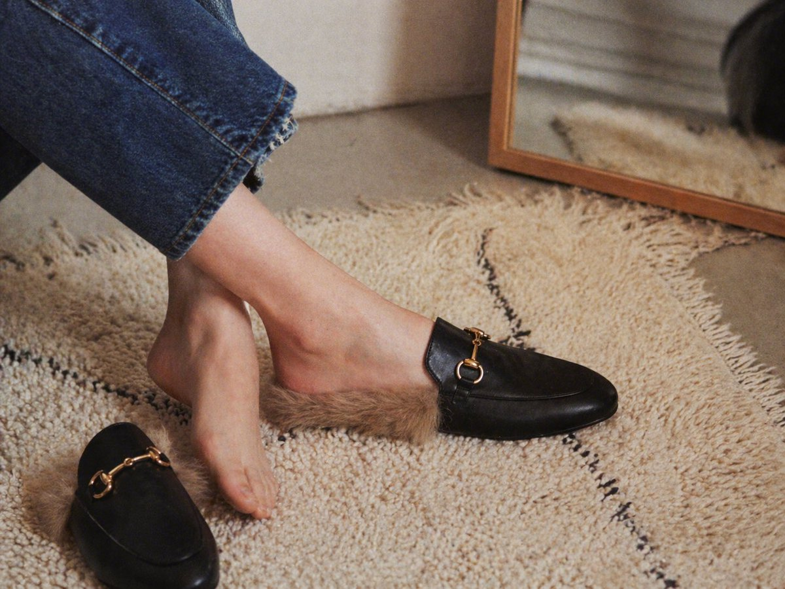 |

**Prompt:**

```
A warm, editorial-style lifestyle product photo shot indoors from a low close-up angle, focused on a woman's lower legs and feet as she tries on 1 pair of black leather backless loafers with tan faux-fur lining. One loafer is worn on the right foot and the left foot is bare, hovering just above the textured cream shag rug, while the second matching loafer lies on the rug in the lower left foreground. The shoes have smooth black leather uppers, a rounded almond toe, open mule-style heel, plush brown fur spilling out around the opening, and a small polished gold horsebit hardware detail across the vamp. The model wears cropped medium-blue denim jeans with a raw frayed hem. The setting is a cozy minimalist interior with a cream rug featuring 2 thin irregular black lines, a neutral wall, and a leaning rectangular mirror with a medium wood frame in the upper right background, softly reflecting the rug and part of the scene. Use soft natural window light, shallow depth of field, subtle film grain, realistic skin texture, muted beige and black palette, relaxed candid composition, premium fashion catalog mood, high detail, photorealistic.
```

<!-- Case 118: E-commerce Main Image - Luxury Perfume Ad on Marble Vanity (by @MiguelMaestroIA) -->
### Case 118: [E-commerce Main Image - Luxury Perfume Ad on Marble Vanity](https://x.com/MiguelMaestroIA/status/2047555836252151831) (by [@MiguelMaestroIA](https://x.com/MiguelMaestroIA))

| Output |
| :----: |
| 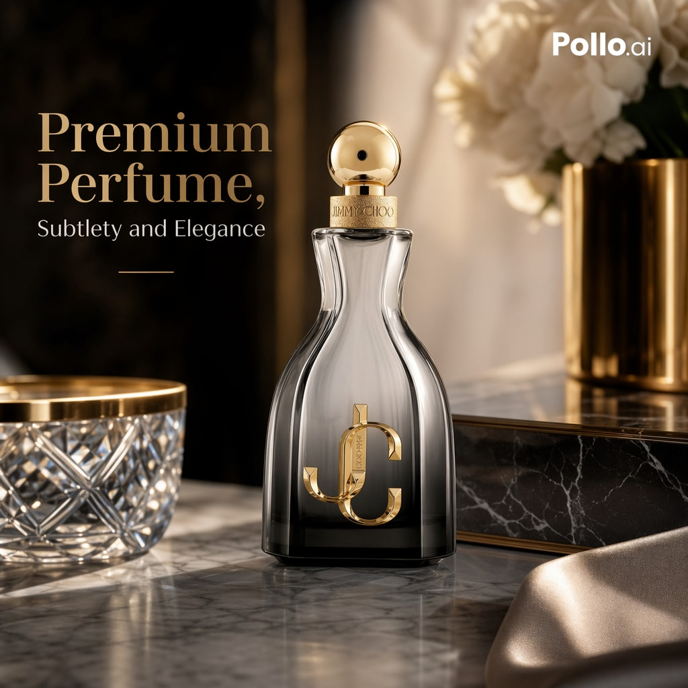 |

**Prompt:**

```
A luxury e-commerce advertising photo of a premium perfume bottle on a polished gray-and-white marble vanity, shot in a warm cinematic studio style with soft golden lighting, shallow depth of field, and elegant reflections. The composition is square and high-end, with the perfume bottle centered slightly right of frame and promotional text on the left. The bottle is a tall sculpted hourglass-shaped glass flacon with smoky transparent gray glass fading darker at the base, a glossy gold spherical cap, a gold collar engraved with fine branding, and a large metallic gold interlocking monogram on the front. Keep the branding-inspired feel but do not add extra products. In the foreground left, include 1 cut-crystal bowl with a gold rim, partially cropped. In the background right, include 1 brushed gold cylindrical vase holding 1 bouquet of soft white flowers, blurred. Behind the bottle, add 1 black marble rectangular box with subtle white veining and gold trim. In the lower right foreground, include 1 draped piece of champagne-colored satin fabric, softly out of focus. The background should be dark, luxurious, and softly blurred, with rich brown-black tones and a vertical shadowed panel on the left to support typography. Add elegant serif headline text on the upper left reading {argument name="headline text" default="Premium Perfume,"} in large warm beige letters, with a smaller serif subheading beneath reading {argument name="tagline" default="Subtlety and Elegance"}, plus a thin short gold horizontal line below the subheading. Place a small white logo in the top-right corner reading {argument name="brand logo" default="Pollo.ai"}. Emphasize premium materials, realistic glass refraction, gold metallic highlights, luxury product photography, refined composition, soft bokeh, and upscale beauty-ad aesthetics.
```

<!-- Case 151: E-commerce Main Image - Miniature Diorama Skincare Advertisement (by @Strength04_X) -->
### Case 151: [E-commerce Main Image - Miniature Diorama Skincare Advertisement](https://x.com/Strength04_X/status/2048074514278563949) (by [@Strength04_X](https://x.com/Strength04_X))

| Output |
| :----: |
| 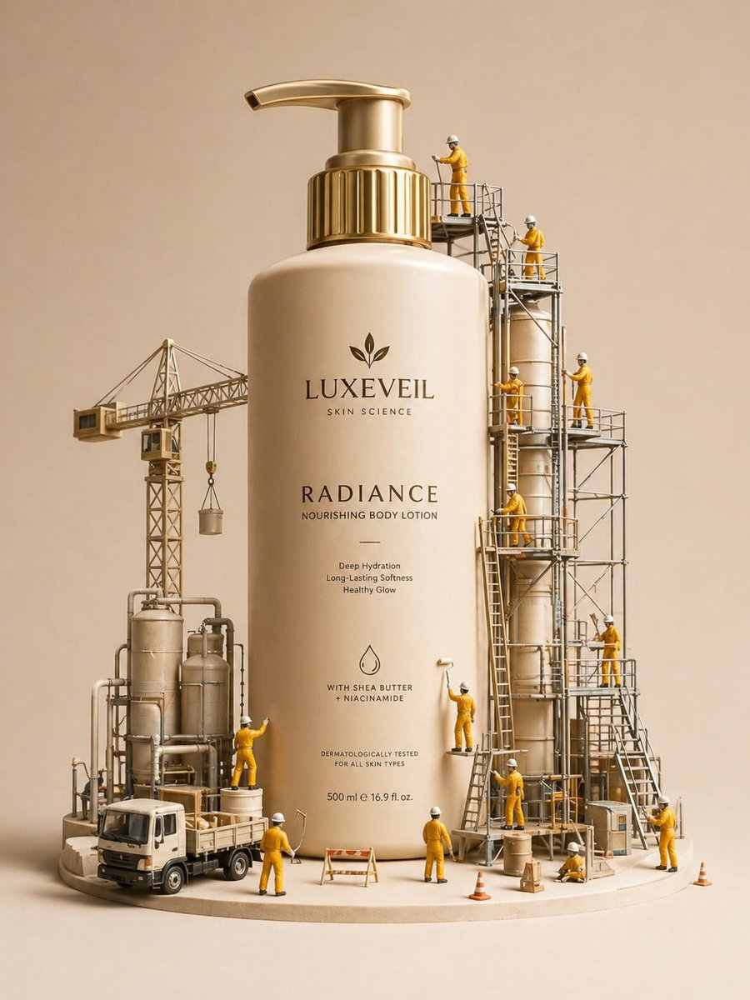 |

**Prompt:**

```
A hyper-realistic miniature diorama product advertisement featuring an oversized luxury skincare pump bottle labeled "LUXEVEIL Skin Science – Radiance Nourishing Body Lotion" in cream/beige with a polished gold pump top, placed on a circular platform. Tiny figurine construction workers dressed in yellow coveralls and white hard hats swarm around the bottle climbing scaffolding, painting the bottle with rollers, operating a tower crane, working near industrial tanks and pipework, and unloading a miniature flatbed truck. The scene includes metal scaffolding structures, industrial silos, orange traffic cones, wooden barricades, and storage barrels. The overall color palette is warm beige, cream, gold, and mustard yellow. Studio photography style with soft diffused lighting, no shadows, clean beige background. The concept metaphorically shows workers "crafting" or "building" the perfect lotion. Tilt-shift miniature aesthetic, ultra-detailed, commercial product photography, 8K resolution, photorealistic CGI render.
```

<!-- Case 152: E-commerce Main Image - Traditional Chinese Art and Porcelain Vases (by @songguoxiansen) -->
### Case 152: [E-commerce Main Image - Traditional Chinese Art and Porcelain Vases](https://x.com/songguoxiansen/status/2048046906585280977) (by [@songguoxiansen](https://x.com/songguoxiansen))

| Output |
| :----: |
| 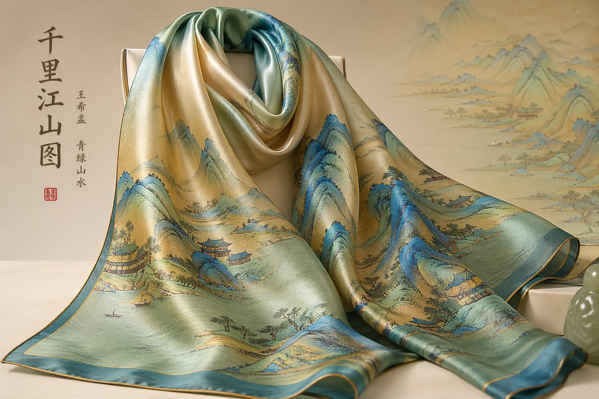 |

**Prompt:**

```
A scarf inspired by 'A Thousand Li of Rivers and Mountains', surrounded by Wang Ximeng's blue-green landscape, with a silky texture and soft lighting.

A famille rose porcelain vase featuring Lady Yang Guifei enjoying flowers, with peony and butterfly patterns in the style of imperial kilns.
```

<!-- Case 153: E-commerce Main Image - Premium Gaming Motherboard Studio Shot (by @rojassartorio) -->
### Case 153: [E-commerce Main Image - Premium Gaming Motherboard Studio Shot](https://x.com/rojassartorio/status/2048019666816163867) (by [@rojassartorio](https://x.com/rojassartorio))

| Output |
| :----: |
| 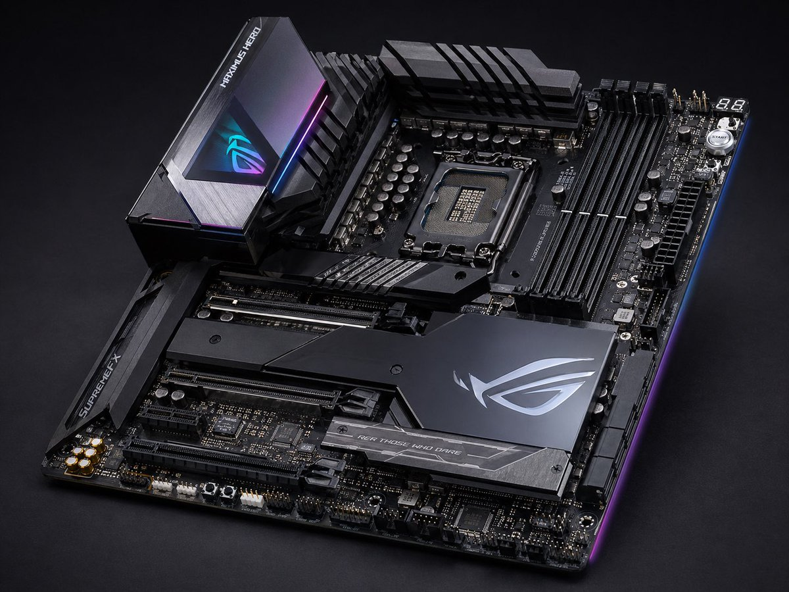 |

**Prompt:**

```
A high-end enthusiast ATX gaming motherboard product photo on a dark studio background, shown in a three-quarter top-down perspective angled from the lower left toward the upper right. The board is mostly matte black and gunmetal with sharp geometric armor plates, brushed metal textures, and subtle RGB edge lighting in blue, purple, and magenta. Feature an exposed modern Intel-style CPU socket near the upper center, 4 black DIMM memory slots on the right, large VRM heatsinks across the top and upper left, and multiple reinforced PCIe slots in the lower half. Include 3 major branded heatsink zones: a tall rear I/O shroud at upper left with an illuminated RGB eye logo and the text "MAXIMUS HERO", a left-side chipset/slot armor piece with the text "SUPREMEFX", and a large angular lower-right chipset cover with a silver ROG-style emblem plus a lower strip that reads "FOR THOSE WHO DARE". Show detailed capacitors, headers, power connectors, debug display reading "88" at the top right, and a small round start button nearby. Ultra-detailed commercial product photography, crisp focus across the board, realistic reflections on metal, premium luxury tech aesthetic, dramatic low-key lighting, clean black seamless backdrop, no cables, no CPU, no RAM, no other objects.
```

<!-- Case 154: E-commerce Main Image - Premium Grain Powder Ad Board (by @WooGabriel76263) -->
### Case 154: [E-commerce Main Image - Premium Grain Powder Ad Board](https://x.com/WooGabriel76263/status/2047988112094101770) (by [@WooGabriel76263](https://x.com/WooGabriel76263))

| Output |
| :----: |
|  |

**Prompt:**

```
{"type":"Chinese e-commerce product marketing board","product":{"category":"instant grain powder drink","brand":"五谷磨房","name":"核桃芝麻黑豆粉","packaging":"matte black retail box with gold Chinese typography and a large swirling bowl graphic on the front, plus individual black sachets inside","net weight":"320g (32g×10袋)"},"style":{"overall":"premium dark food advertising layout","color palette":["black","deep brown","warm gold","beige","walnut brown"],"lighting":"dramatic studio lighting with glossy highlights and warm rim light","mood":"luxurious, nourishing, healthy, appetizing"},"layout":{"format":"single tall composite board divided into 5 major sections plus a bottom storyboard table","sections":[{"title":"主图/Main image","position":"top-left","count":8,"labels":["五谷磨房","核桃芝麻黑豆粉","32g×10袋 独立包装","五黑谷物","香浓醇厚","独立小袋","即冲即饮","product box and drink cup"]},{"title":"详情页/Details page","position":"top-right","count":5,"labels":["黑芝麻","黑豆","黑米","核桃","谷物粉"]},{"title":"香浓细腻 顺滑好喝","position":"mid-right","count":4,"labels":["一冲即饮 营养美味","粉质细腻 Fine powder","浓香醇厚 Rich & Smooth","营养代餐 Nutritious"]},{"title":"冲泡方式 HOW TO MAKE","position":"mid-left lower","count":3,"labels":["1 倒入一袋粉(32g)","2 加入200ml 热水或牛奶","3 搅拌均匀 即可享用"]},{"title":"一杯好谷物 轻松好生活","position":"lower-left","count":4,"labels":["元气早餐","办公室下午茶","健身代餐","睡前暖饮"]},{"title":"独立小袋 随身携带","position":"lower-right","count":3,"labels":["独立小袋 便携卫生","锁住新鲜 防潮防氧化","1袋1杯 精准份量"]},{"title":"视频推广广告 seedance 2.0 视频提示词 + 分镜头脚本","position":"bottom full width","count":7,"labels":["镜头1 开场-产品展示","镜头2 食材特写","镜头3 倒粉入杯","镜头4 冲泡搅拌","镜头5 饮用场景","镜头6 产品卖点","镜头7 结尾口号"]}],"grid":"top area split into left main image and right detail page; middle area split into preparation guide and feature panel; lower area split into lifestyle scenarios and sachet carry section; bottom is a full-width tabular storyboard"},"scene_elements":{"ingredients":[{"name":"black sesame","form":"small black seeds in a round bowl"},{"name":"black beans","form":"glossy whole beans in a round bowl"},{"name":"black rice","form":"dark long grains in a round bowl"},{"name":"walnuts","form":"walnut halves in a round bowl"},{"name":"grain powder","form":"light beige powder in a round bowl"}],"serving":{"drink":"thick gray-brown sesame walnut bean beverage with smooth surface swirl","cup":"transparent glass cup with handle","utensil":"metal spoon stirring or resting inside drink"},"supporting props":["walnuts on table","scattered black beans","grain stalks or wheat stems","dark tabletop","ingredient bowls","open package showing 5 visible sachets"]},"text_treatment":{"headline_font":"bold elegant Chinese display type in metallic gold","body_font":"clean sans serif Chinese with occasional English subtitles","accent":"thin gold divider lines and circular ingredient frames"},"camera_and_composition":{"product_shots":"front-facing hero box, angled sachet display box, close-up beverage macro","food_photography":"high-detail commercial food styling, shallow depth of field, crisp texture emphasis","aspect_ratio":"portrait, approximately 9:16"},"quality":"ultra-detailed commercial design mockup, polished e-commerce key visual plus details page plus ad storyboard, 4K"}
```

<!-- Case 155: E-commerce Main Image - Earbuds E-commerce Infographic (by @SPEEDAI07) -->
### Case 155: [E-commerce Main Image - Earbuds E-commerce Infographic](https://x.com/SPEEDAI07/status/2047981795552153860) (by [@SPEEDAI07](https://x.com/SPEEDAI07))

| Output |
| :----: |
| 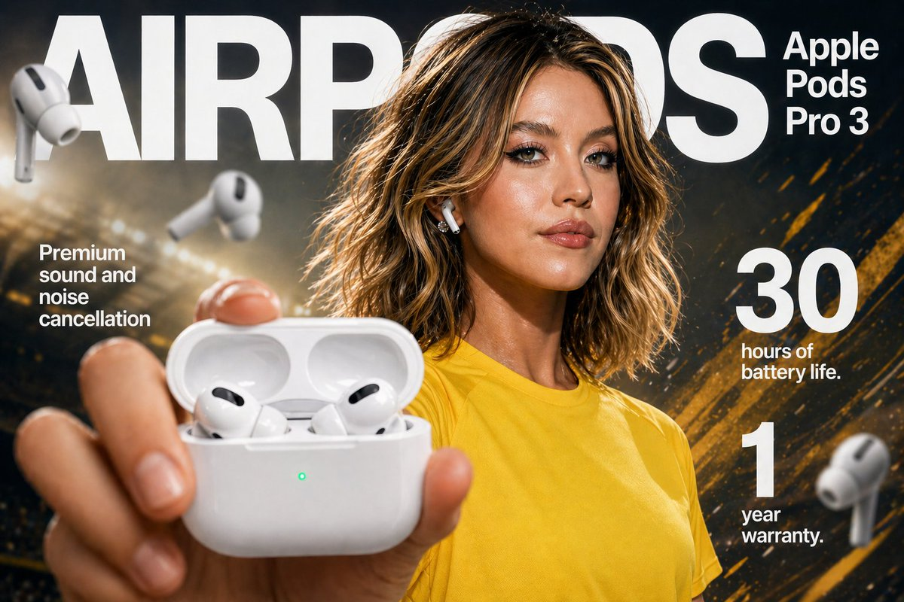 |

**Prompt:**

```
High-impact e-commerce infographic for "{argument name="product" default="Apple Pods Pro 3"}" wireless earbuds.
Foreground: An extreme close-up of a hand holding an open glossy white wireless earbud charging case toward the camera. Inside the case are two sleek white earbuds with black speaker accents. A small glowing green LED indicator is visible on the front of the case. The hand and case have slight macro-lens depth blur for realism.

Mid-ground: A {argument name="model" default="confident young woman"} with tan skin, brown eyes, and dark hair tied in a messy bun. She has natural makeup with a dewy glow. She is wearing a plain {argument name="clothing" default="yellow athletic t-shirt"} (no logos). One white earbud is in her ear. She is looking directly at the camera with a subtle, confident expression.

Background: Clean soft gray gradient studio backdrop with shallow depth of field. Diagonal rainbow prism lens flares and soft light leaks across the scene. Several blurred floating white earbuds in the background for depth and motion.

Lighting: Soft professional studio lighting with glossy highlights on the product, subtle rim light on the model, high dynamic range.

Typography (modern sans-serif, white):

Top center (behind model): Large bold text “AIRPODS”

Top right: “Apple Pods Pro 3”

Mid-left: “Premium sound and noise cancellation”

Mid-right: Large bold “30” with “hours of battery life”

Bottom-right: Large bold “1” with “year warranty”

Style: Ultra-realistic, commercial product photography, 8k resolution, sharp focus on product case, shallow depth of field, vibrant yet clean color palette, premium advertising aesthetic.
```

<!-- Case 156: E-commerce Main Image - Sustainable T-Shirt Plantable Tag Ad (by @Diplomeme) -->
### Case 156: [E-commerce Main Image - Sustainable T-Shirt Plantable Tag Ad](https://x.com/Diplomeme/status/2047957339974828092) (by [@Diplomeme](https://x.com/Diplomeme))

| Output |
| :----: |
| 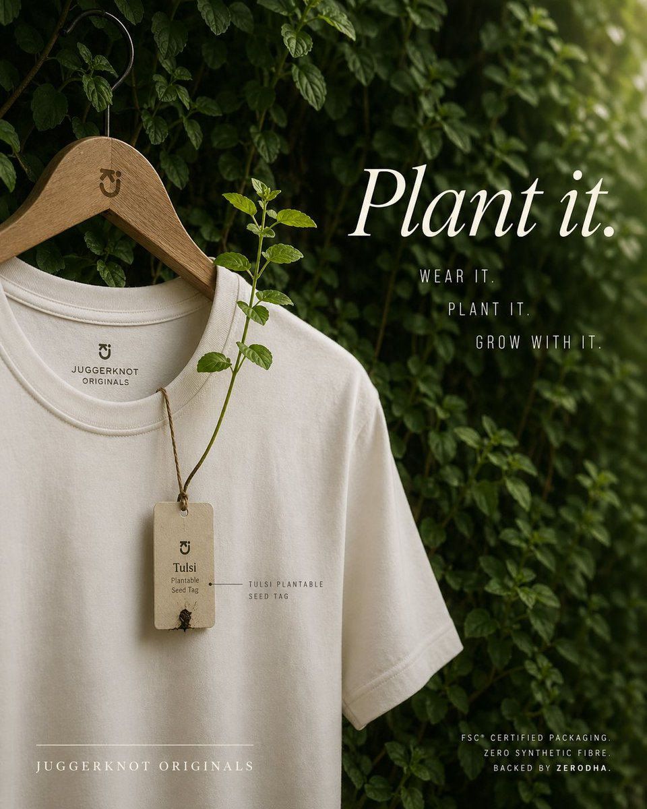 |

**Prompt:**

```
A premium eco-conscious fashion advertisement, shot as a refined editorial product photo. A single off-white or natural cream crew-neck T-shirt hangs on a smooth wooden hanger with a black metal hook, placed against a lush wall of dense green leaves and climbing vines. The hanger has a small minimalist brand monogram engraved near the neck. The shirt is shown from the upper torso down to part of the hem, slightly angled, with soft natural folds and high-quality cotton texture. Printed inside the collar is a minimalist brand mark and the text "JUGGERKNOT ORIGINALS". Hanging from the neckline is 1 rectangular recycled-paper seed tag tied with rustic brown twine; the tag reads "Tulsi" and "Plantable Seed Tag" with a tiny sprouting seed detail near the bottom. From the tag, 1 real tulsi plant stem grows upward across the front of the shirt, with several fresh green leaves, visually demonstrating that the tag is plantable. Add a small fine-label annotation near the tag reading "TULSI PLANTABLE SEED TAG". On the right side, large elegant white serif typography says {argument name="headline text" default="Plant it."}. Beneath it, place 3 stacked lines of narrow uppercase sans-serif copy: "WEAR IT.", "PLANT IT.", and "GROW WITH IT.". At the lower left, add the brand name in spaced uppercase serif text: {argument name="brand name" default="JUGGERKNOT ORIGINALS"}, with a thin horizontal line above it. At the lower right, add 3 lines of small uppercase sans-serif text: "FSC® CERTIFIED PACKAGING.", "ZERO SYNTHETIC FIBRE", and "BACKED BY ZERODHA.". Use soft diffused daylight, shallow depth of field, moody green-and-cream color grading, luxury sustainable-brand aesthetics, clean composition, vertical poster layout, subtle shadows, and a calm organic atmosphere. Keep the design minimal, premium, and photorealistic, with the shirt occupying the left half and the typography balanced on the right.
```

<!-- Case 157: E-commerce Main Image - Elegant Cosmetic Poster Prompt (by @Adam38363368936) -->
### Case 157: [E-commerce Main Image - Elegant Cosmetic Poster Prompt](https://x.com/Adam38363368936/status/2047917266361360682) (by [@Adam38363368936](https://x.com/Adam38363368936))

| Output |
| :----: |
| 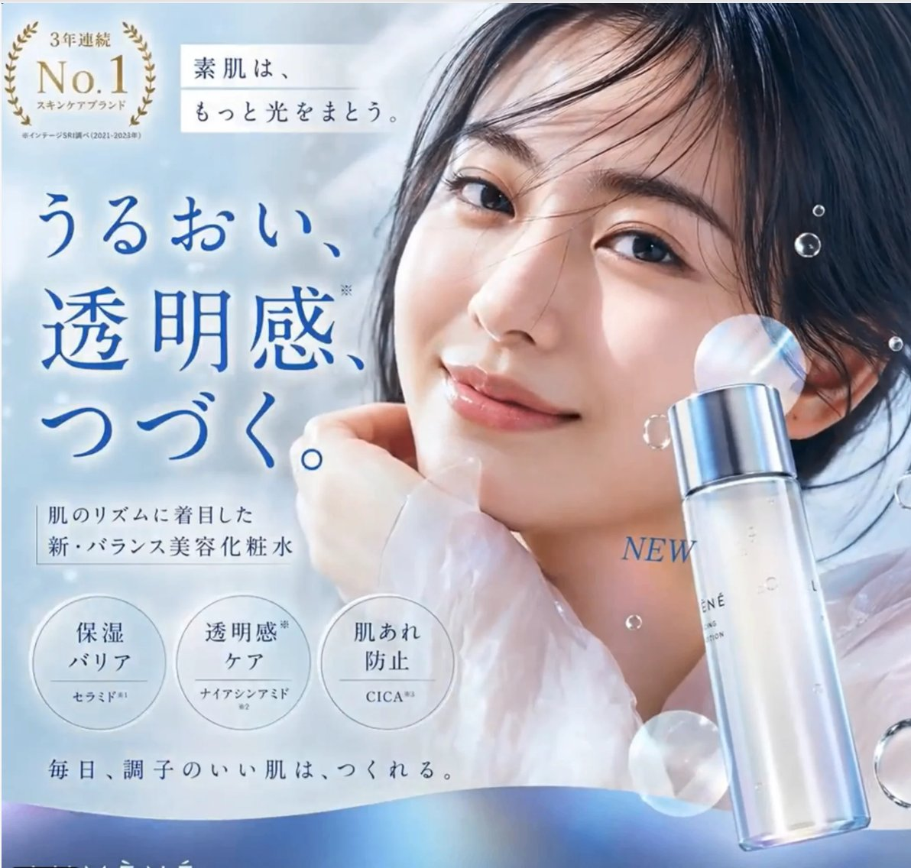 |

**Prompt:**

```
An image in a {argument name="reference style" default="similar style"}, a product image for {argument name="product" default="lipstick"}, requiring color coordination and a grand aesthetic in a {argument name="style" default="poster style"}, with language changed to Simplified Chinese.
```

<!-- Case 158: E-commerce Main Image - Minimalist Product Ad: PURE CRUNCH (by @Strength04_X) -->
### Case 158: [E-commerce Main Image - Minimalist Product Ad: PURE CRUNCH](https://x.com/Strength04_X/status/2047917220165231011) (by [@Strength04_X](https://x.com/Strength04_X))

| Output |
| :----: |
| 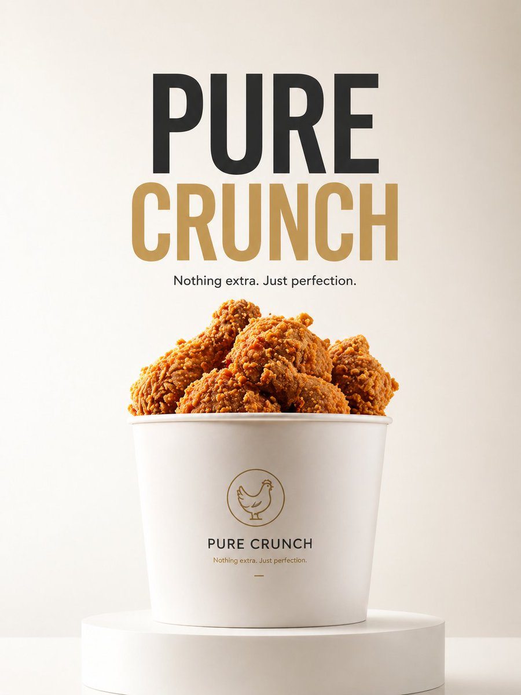 |

**Prompt:**

```
A minimalist product advertisement with a {argument name="product" default="fried chicken bucket"} placed on a clean white podium.

Background: soft gradient ({argument name="background gradient" default="light cream to white"}), clean studio.

Lighting: soft diffused, premium Apple-style.

Typography (center): “{argument name="headline" default="PURE CRUNCH"}”

Small text below: “Nothing extra. Just perfection.”

Style: ultra clean, editorial minimal, high-end branding, 8K.
```

<!-- Case 159: E-commerce Main Image - Pastel Blue Crocs Fashion Ad (by @SPEEDAI07) -->
### Case 159: [E-commerce Main Image - Pastel Blue Crocs Fashion Ad](https://x.com/SPEEDAI07/status/2047907058079650035) (by [@SPEEDAI07](https://x.com/SPEEDAI07))

| Output |
| :----: |
| 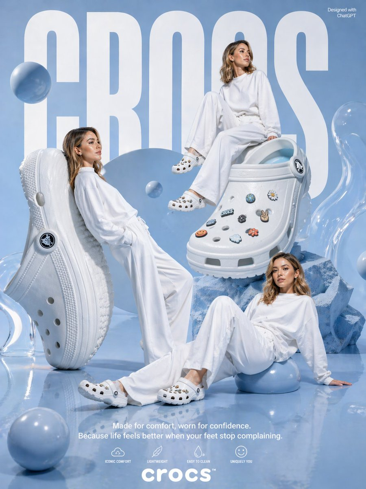 |

**Prompt:**

```
A high-end studio advertising poster for {argument name="brand name" default="crocs"}, in a monochrome pastel blue and white color palette, with a glossy reflective floor and a soft sky-blue backdrop. The background is dominated by the word {argument name="headline text" default="CROCS"} in gigantic bold white condensed sans-serif letters spanning nearly the full height of the image. In the top-right corner, add small white text reading "Designed with ChatGPT". Feature 3 adult women with shoulder-length wavy light brown to dark blonde hair, all wearing loose oversized white long-sleeve tops and flowing white wide-leg pants, styled as minimalist fashion models with relaxed neutral expressions. Their faces are intentionally obscured or blurred. One model reclines against an enormous upright white clog shoe on the left side, one model sits casually on top of a giant white clog on the upper right, and one model lounges on the floor at the lower right, leaning back on one arm while seated partly on a glossy blue sphere. Include 2 oversized white clog shoes as hero props: one standing vertically on the left showing the sole and side profile, and one angled on blue crystalline blocks at center-right showing the upper and toe box. Both clogs are classic foam slip-on style with perforation holes, chunky tread, heel straps, and circular logo rivets. The center-right clog is decorated with exactly 8 visible charms pinned to the upper: a blue-green iridescent round charm, a white daisy with yellow center, a black-and-white round emblem near the strap, a small "CROCS" word charm, a dark flower, a peace-hand sign, an orange smiley face, a white cloud, and an orange flower. Scatter exactly 7 glossy floating or grounded blue spheres of varying sizes around the set: one large sphere behind the left model, one medium sphere floating near center, one medium sphere at bottom left foreground, one medium sphere used as a seat under the lower-right model, one small sphere near the upper left, and 2 additional blue spheres integrated into the composition. Add translucent sculptural gel-like forms at the far left and far right edges, plus angular blue crystal-like rocks beneath the right shoe. At the bottom center, place white promotional copy in a clean sans-serif font: {argument name="tagline line 1" default="Made for comfort, worn for confidence."} on the first line and {argument name="tagline line 2" default="Because life feels better when your feet stop complaining."} on the second line. Beneath that, show 4 minimalist feature icons with labels in white: "ICONIC COMFORT", "LIGHTWEIGHT", "EASY TO CLEAN", and "UNIQUELY YOU". Place the {argument name="logo text" default="crocs"} logo in bold lowercase white at the bottom center with a small trademark symbol. The overall style should feel like a premium surreal fashion campaign, clean editorial lighting, soft shadows, glossy textures, airy composition, and modern lifestyle product advertising.
```

<!-- Case 160: E-commerce Main Image - 9-Panel Product TVC Storyboard (by @Magncsans) -->
### Case 160: [E-commerce Main Image - 9-Panel Product TVC Storyboard](https://x.com/Magncsans/status/2047876253898903594) (by [@Magncsans](https://x.com/Magncsans))

| Output |
| :----: |
| 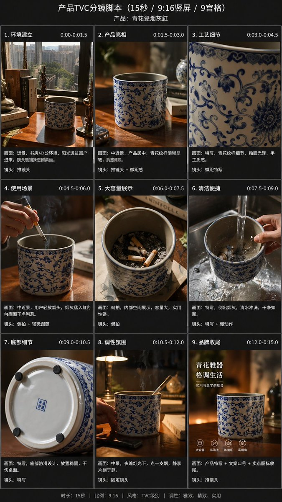 |

**Prompt:**

```
Using the provided reference image, transform the single casual product photo into a polished e-commerce TVC storyboard board for a {argument name="video duration" default="15-second"} ad in a {argument name="aspect ratio" default="9:16"} vertical format, presented as a 9-panel grid. Keep the same blue-and-white ceramic ashtray as the product base, but restage it across cinematic advertising shots with warm premium lighting, shallow depth of field, and a refined lifestyle desktop environment. Add a dark storyboard layout with Chinese titles and timing for each panel. Include exactly 9 scenes: 1) environment-establishing wide shot with desk, books, window, and the product placed in context; 2) hero product medium shot on the table; 3) extreme close-up of the blue floral craftsmanship pattern; 4) use case showing a hand placing a cigarette into the ashtray with visible smoke; 5) top-down capacity display showing multiple cigarette butts inside; 6) cleaning scene under running water in a sink with a hand holding the product; 7) bottom-detail close-up showing the underside and anti-slip pads; 8) mood/lifestyle scene at night with the product on a desk, smoke rising, and ambient lamp light; 9) brand closing frame with the product as the hero plus Chinese marketing text. Add the overall header text “产品TVC分镜脚本(15秒 / 9:16竖屏 / 9宫格)” and a product subtitle naming it {argument name="product name" default="青花瓷烟灰缸"}. Give each of the 9 panels a Chinese scene title and timestamp, plus small descriptive Chinese copy beneath each image in the style of a professional commercial shot list. Use premium, realistic commercial photography throughout, consistent product identity, elegant Chinese aesthetic, and a clean high-end storyboard presentation.
```

<!-- Case 89: E-commerce Live Stream UI Mockup (by @sjbbxhz) -->
### Case 89: [E-commerce Live Stream UI Mockup](https://x.com/sjbbxhz/status/2045684734714380687) (by [@sjbbxhz](https://x.com/sjbbxhz))

| Output |
| :----: |
|  |

**Prompt:**

```
{
  "type": "live stream UI mockup",
  "subject": {
    "description": "portrait of {argument name=\"host name\" default=\"Elon Musk\"}, smiling, wearing a black t-shirt with a white technical schematic graphic",
    "background": "left side shows a screen with '{argument name=\"left background logo\" default=\"SPACEX\"}' text, right side shows a red '{argument name=\"right background logo\" default=\"Tesla T logo\"}' and a dark car"
  },
  "ui_overlay": {
    "top_header": {
      "host_info": "avatar, name '{argument name=\"host name\" default=\"Elon Musk\"}', subtext '55.6万本场点赞', red '关注' button",
      "rank_badge": "gold coin icon with '全站第1名'",
      "viewer_stats": "3 top viewer avatars with '12.3w', '8.6w', '5.7w', total '68.7万', 'X' close button",
      "right_links": "'更多直播 >', '礼物展馆 0/24' with blue '经典' tag"
    },
    "mid_left_gifts": {
      "count": 2,
      "items": [
        "avatar '科技爱好者', '送小心心', heart icon x 1314",
        "avatar '星辰大海', '送火箭', rocket icon x 666"
      ]
    },
    "bottom_left_chat": {
      "system_message": "level 37 badge '宇宙漫游者 加入了直播间'",
      "message_count": 7,
      "messages": [
        "小火箭: 马斯克!未来可期!🚀",
        "future: 特斯拉Model 2什么时候出?",
        "星空梦想家: SpaceX今年能上火星吗?",
        "AI探索者: Neuralink进展如何?",
        "帅气的网友: 马总好!",
        "Mars: 第一次来你的直播,超激动!",
        "用户123: 讲讲AI吧,会取代人类吗?"
      ]
    },
    "bottom_right_product_card": {
      "hot_tag": "orange '热卖 x 1888'",
      "image": "Tesla Cybertruck",
      "title": "{argument name=\"product name\" default=\"特斯拉Cybertruck 电动皮卡\"}",
      "price": "{argument name=\"product price\" default=\"¥ 1,618,000\"}",
      "button": "red '抢' button",
      "floating_animation": "translucent hearts floating up the right edge"
    },
    "bottom_bar": {
      "input_field": "'说点什么...'",
      "icons": ["smiley face", "three dots", "shopping cart", "gift box", "share"]
    }
  }
}
```

## Casos de Creatividad Publicitaria

<!-- Case 90: 4-Panel Japanese Digital Ad Banner Grid (by @makaneko_AI) -->
### Case 90: [4-Panel Japanese Digital Ad Banner Grid](https://x.com/makaneko_AI/status/2045764016858087720) (by [@makaneko_AI](https://x.com/makaneko_AI))

| Output |
| :----: |
|  |

**Prompt:**

```
{
  "type": "2x2 grid of Japanese digital advertisement banners",
  "layout": {
    "structure": "4 equal quadrants",
    "quadrants": [
      {
        "position": "top-left",
        "theme": "Travel",
        "subject": "A couple holding hands on a white sand beach, looking out at turquoise ocean water under a bright blue sky.",
        "elements": ["red hibiscus flower in bottom left corner"],
        "text_labels": [
          "今年こそ、解き放て。",
          "{argument name=\"travel destination\" default=\"沖縄旅行\"}",
          "3日間の癒やし旅",
          "航空券+ホテル",
          "39,800円〜",
          "絶景、グルメ、体験 ぜんぶ叶う!"
        ],
        "icons": {
          "count": 3,
          "descriptions": ["airplane", "hotel building", "car"]
        }
      },
      {
        "position": "top-right",
        "theme": "Skincare",
        "subject": "Close-up portrait of a young woman with glowing, dewy skin, eyes closed, gently touching her cheeks.",
        "elements": [
          "soft pink gradient background",
          "dynamic water splash effects",
          "pink cosmetic jar labeled '{argument name=\"skincare product name\" default=\"LUMIÈRE\"} Brightening Gel'"
        ],
        "text_labels": [
          "毛穴・くすみ卒業!",
          "透明感あふれる",
          "水光肌へ",
          "新感覚スキンケア",
          "初回限定 78%OFF",
          "{argument name=\"discount price\" default=\"1,980円\"}"
        ],
        "badges": {
          "count": 3,
          "style": "gold circular",
          "labels": ["毛穴ケア", "高保湿", "ハリ・ツヤ"]
        }
      },
      {
        "position": "bottom-left",
        "theme": "Gourmet Food",
        "subject": "Thick, sliced, medium-rare steak sizzling on a dark grill plate.",
        "elements": [
          "garlic chips",
          "rosemary sprig",
          "dark background with smoke and glowing embers"
        ],
        "text_labels": [
          "とろける旨さ!",
          "{argument name=\"food item\" default=\"黒毛和牛\"}",
          "贅沢ステーキ",
          "期間限定",
          "特別価格",
          "通常価格 8,980円",
          "4,980円"
        ],
        "badges": {
          "count": 1,
          "style": "red circular",
          "labels": ["A4 A5等級"]
        }
      },
      {
        "position": "bottom-right",
        "theme": "Online Education",
        "subject": "Young man in a blue shirt studying at a desk, writing in a notebook next to an open laptop.",
        "elements": ["bright indoor lighting", "desk environment"],
        "text_labels": [
          "スキマ時間で",
          "{argument name=\"education goal\" default=\"最短合格!\"}",
          "オンライン資格講座",
          "スマホで完結",
          "効率学習で差がつく!",
          "今だけ! 受講料 20%OFF"
        ],
        "badges": {
          "count": 1,
          "style": "blue circular",
          "labels": ["受講者数 10万人 突破!"]
        },
        "icons": {
          "count": 2,
          "descriptions": ["smartphone", "open book"]
        }
      }
    ]
  }
}
```

<!-- Case 112: Anime Character Brand Identity & Merch Board (by @chi_vc_) -->
### Case 112: [Anime Character Brand Identity & Merch Board](https://x.com/chi_vc_/status/2046061073720369228) (by [@chi_vc_](https://x.com/chi_vc_))

| Output |
| :----: |
|  |

**Prompt:**

```
{
  "type": "brand identity and merchandise design board",
  "theme": {
    "color_palette": "{argument name=\"theme color\" default=\"pastel pink\"} and white",
    "motif": "{argument name=\"motif\" default=\"cherry blossoms\"} and pink hearts"
  },
  "character": {
    "description": "anime girl with short brown bob hair, pink eyes, wearing a white hoodie, gentle smile"
  },
  "branding": {
    "main_logo": "{argument name=\"character name\" default=\"癒音ちー\"}",
    "sub_logo": "{argument name=\"character subtext\" default=\"ゆおんちー\"}"
  },
  "layout": {
    "sections": [
      {
        "type": "header banner",
        "position": "top",
        "elements": ["large main logo", "sub logo", "cherry blossom graphics", "character portrait on the right"]
      },
      {
        "type": "product packaging",
        "position": "middle left",
        "elements": ["1 square box with heart-shaped transparent window showing pink heart candies", "character illustration on box", "2 individual candy wrappers", "5 scattered heart candies"]
      },
      {
        "type": "promotional poster",
        "position": "middle right",
        "elements": ["character portrait", "heart-shaped candy bowl", "main logo", "text '4.26 NEW OPEN'", "text '{argument name=\"social handle\" default=\"@yuonchii\"}'"]
      },
      {
        "type": "horizontal web banner",
        "position": "lower middle",
        "elements": ["main logo", "cherry blossoms", "character portrait on the right"]
      },
      {
        "type": "social media profile mockup",
        "position": "bottom left",
        "elements": ["header image with logo", "1 circular profile picture", "handle '{argument name=\"social handle\" default=\"@yuonchii\"}'", "1 follow button", "mock bio text"]
      },
      {
        "type": "merchandise collection",
        "position": "bottom right",
        "count": 9,
        "items": ["1 white t-shirt with logo", "1 white mug with character", "4 round pin badges", "1 acrylic keychain", "2 candy packets"]
      }
    ]
  }
}
```

<!-- Case 108: Dark Mode Marketing Case Study UI (by @IndieDevHailey) -->
### Case 108: [Dark Mode Marketing Case Study UI](https://x.com/IndieDevHailey/status/2044974254769463312) (by [@IndieDevHailey](https://x.com/IndieDevHailey))

| Output |
| :----: |
|  |

**Prompt:**

```
{
  "type": "UI/UX landing page mockup",
  "theme": "dark mode, sleek modern aesthetic, glassmorphism, {argument name=\"primary accent color\" default=\"neon purple and blue\"} glowing accents",
  "header": {
    "logo": "{argument name=\"brand name\" default=\"goViralX\"}",
    "top_right_tag": "VIRAL CAMPAIGN CASE STUDY"
  },
  "layout": {
    "sections": [
      {
        "name": "Hero",
        "headline": "{argument name=\"hero headline\" default=\"How We Created 10M+ Viral Impact\"}",
        "subheadline": "3天引爆全网, 助力品牌实现指数级增长",
        "stats_row": {
          "count": 4,
          "labels": ["总播放量", "互动率", "转化咨询", "执行周期"],
          "values": ["{argument name=\"main statistic\" default=\"10,240,000+\"}", "18.7%", "3,200+", "72小时"]
        },
        "visual": "cinematic shot of a person in a hoodie looking at glowing digital screens and graphs, large play button overlay"
      },
      {
        "name": "Strategy",
        "title": "Our 3-Day Execution Strategy",
        "layout_type": "vertical timeline",
        "steps_count": 3,
        "elements_per_step": ["timeline node", "title", "bullet points", "video thumbnail with play button", "description box"]
      },
      {
        "name": "Performance",
        "title": "Data-Driven Performance",
        "left_column": {
          "stat_cards_count": 4,
          "values": ["10M+", "43%", "28,000+", "3,200+"]
        },
        "right_column": {
          "charts_count": 2,
          "chart_1": "line graph showing 7-day growth peaking at Day 3",
          "chart_2": "horizontal segmented bar chart showing platform distribution (TikTok 52%, Instagram 24%, X 15%, YouTube 9%)"
        }
      },
      {
        "name": "Keys to Success",
        "title": "The 3 Keys to Viral Success",
        "cards_count": 3,
        "card_elements": ["glowing icon (fire, target, antenna)", "title", "description", "VIEW DETAIL link"]
      },
      {
        "name": "Social Proof",
        "title": "TRUSTED BY CREATORS & BRANDS",
        "left_column": {
          "logos_count": 8,
          "grid": "2x4",
          "brands": ["SHEIN", "SHOPLINE", "Blueglass", "instacart", "lemon8", "mi", "CIDER", "bellroy"]
        },
        "right_column": {
          "testimonial_cards_count": 2,
          "elements": ["quote", "author title (SaaS Founder, Growth Manager)"]
        }
      },
      {
        "name": "Call to Action",
        "title": "READY TO GO VIRAL?",
        "interactive_elements": ["text input field", "glowing button with text '{argument name=\"call to action text\" default=\"获取专属增长方案 ->\"}'"],
        "visual": "3D render of a rocket ship taking off with purple and blue flames"
      }
    ]
  }
}
```

<!-- Case 107: 18-Panel Mascot Brand Identity Document (by @Colin_Leeee) -->
### Case 107: [18-Panel Mascot Brand Identity Document](https://x.com/Colin_Leeee/status/2044802802149650631) (by [@Colin_Leeee](https://x.com/Colin_Leeee))

| Output |
| :----: |
|  |

**Prompt:**

```
{
  "type": "18-panel brand identity and character design document",
  "brand": {
    "name": "{argument name=\"brand name\" default=\"沐阳 MUYANG TEA\"}",
    "industry": "{argument name=\"industry\" default=\"tea shop\"}",
    "colors": ["{argument name=\"primary color\" default=\"yellow\"}", "{argument name=\"secondary color\" default=\"green\"}", "white", "brown", "dark green"]
  },
  "subject": "{argument name=\"character description\" default=\"3D rendered cute Shiba Inu mascot wearing a green apron\"}",
  "layout": {
    "grid": "3 columns by 6 rows",
    "sections": [
      {
        "title": "01 品牌DNA分析 / BRAND DNA ANALYSIS",
        "elements": ["logo", "5 color swatches", "6 icons", "target audience charts"]
      },
      {
        "title": "02 概念构思 / CONCEPT MOODBOARD",
        "elements": ["5 photo references", "4 mood icons", "design equation"]
      },
      {
        "title": "03 形态研究 / FORM STUDY",
        "elements": ["4 logo anatomy icons", "4 evolution steps", "4 silhouettes"]
      },
      {
        "title": "04 概念探索 / CONCEPT EXPLORATION",
        "elements": ["12 line-art character sketches"]
      },
      {
        "title": "05 精细线稿 / REFINED LINE ART",
        "elements": ["3 rows of front and side line art with proportion guides"]
      },
      {
        "title": "06 细节精修 / DETAIL REFINEMENT",
        "elements": ["2 full-body renders with labels", "4 circular close-ups"]
      },
      {
        "title": "07 表情设定 / EXPRESSION SHEET",
        "elements": ["11 3D rendered head expressions"]
      },
      {
        "title": "08 姿势库 / POSE LIBRARY",
        "elements": ["9 full-body 3D rendered poses"]
      },
      {
        "title": "09 转身视图 / TURNAROUND VIEW",
        "elements": ["5 full-body 3D renders", "5 matching line-art views"]
      },
      {
        "title": "10 色彩开发 / COLOR DEVELOPMENT",
        "elements": ["5 rows of 5-color palettes", "color psychology text"]
      },
      {
        "title": "11 材质规格 / MATERIAL SPECIFICATION",
        "elements": ["5 texture swatches", "property sliders", "4 manufacturing icons"]
      },
      {
        "title": "12 色彩应用 / COLOR APPLICATION",
        "elements": ["4 color variant renders", "2 light/dark renders", "4 contrast rating circles"]
      },
      {
        "title": "13 构造指南 / CONSTRUCTION GUIDE",
        "elements": ["2 line-art diagrams for geometry and grid"]
      },
      {
        "title": "14 设计系统规则 / DESIGN SYSTEM RULES",
        "elements": ["minimum size icons", "clear space diagram", "4 usage examples"]
      },
      {
        "title": "15 资产变体 / ASSET VARIANTS",
        "elements": ["3 size variants", "3 line-art variants", "3 simplified flat heads"]
      },
      {
        "title": "16 数字应用 / DIGITAL APPLICATIONS",
        "elements": ["1 app icon", "2 social avatars", "UI elements", "3-step animation cycle"]
      },
      {
        "title": "17 实物应用 / PHYSICAL APPLICATIONS",
        "elements": ["plush toy mockup", "packaging mockup", "merchandise mockup", "storefront mockup"]
      },
      {
        "title": "18 最终主视觉 / FINAL RENDERING",
        "elements": ["large high-res 3D render of mascot holding tea", "logo", "file format list"]
      }
    ]
  }
}
```

<!-- Case 166: Japanese Chinese Food Delivery Flyer (by @xc5_) -->
### Case 166: [Japanese Chinese Food Delivery Flyer](https://x.com/xc5_/status/2048310696686014935) (by [@xc5_](https://x.com/xc5_))

| Output |
| :----: |
| 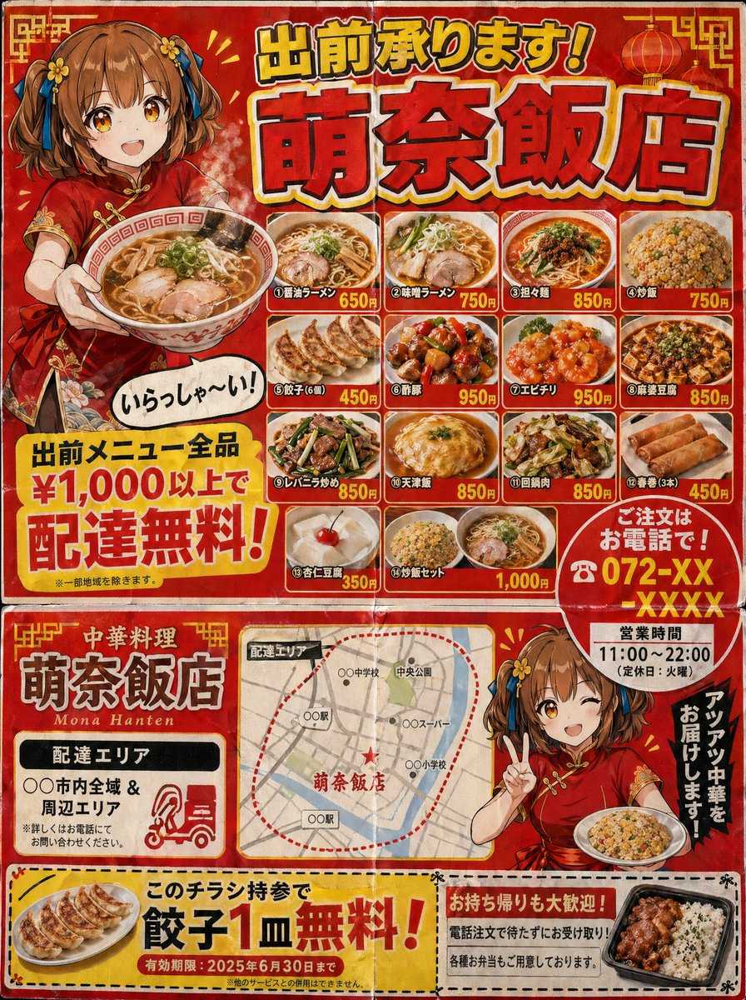 |

**Prompt:**

```
A Japanese neighborhood Chinese restaurant delivery flyer for mailbox posting (3:4 aspect ratio). Designed to look like a double-sided B5 print.

Flyer characteristics (following the grammar of real delivery flyers):
- Flashy red and yellow color scheme.
- Large text at the top: "Delivery Available! {argument name="shop name" default="Mona-Hanten"}" (shadowed Gothic font).
- An illustration of a {argument name="character" default="Chinese girl in a red cheongsam with a brown short bob"} holding ramen and saying "Welcome!" in a speech bubble.
- A menu photo grid (4x3) featuring various dishes: different types of ramen, fried rice, gyoza, sweet and sour pork, shrimp in chili sauce, mapo tofu, liver and leek stir-fry, tenshinhan, twice-cooked pork, spring rolls, annin tofu, and fried rice sets.
- Names and prices for each dish.
- A large yellow banner saying "Free delivery on all menu items over ¥1,000!".
- "Order by phone! ☎ 072-XX-XXXX" emphasized with a red circle.
- Business hours "11:00-22:00 (Closed on Tuesdays)".
- Delivery area map (simple schematic map).
- Coupon (perforated line for clipping): "One free plate of gyoza with this flyer!".

Texture of cheap paper printing. Includes fold marks. Precision that could be mistaken for a real Japanese delivery flyer.
```

<!-- Case 167: Pastel Jellyfish Room Goods Poster (by @Ayu_AI_0912) -->
### Case 167: [Pastel Jellyfish Room Goods Poster](https://x.com/Ayu_AI_0912/status/2048309565817766139) (by [@Ayu_AI_0912](https://x.com/Ayu_AI_0912))

| Output |
| :----: |
| 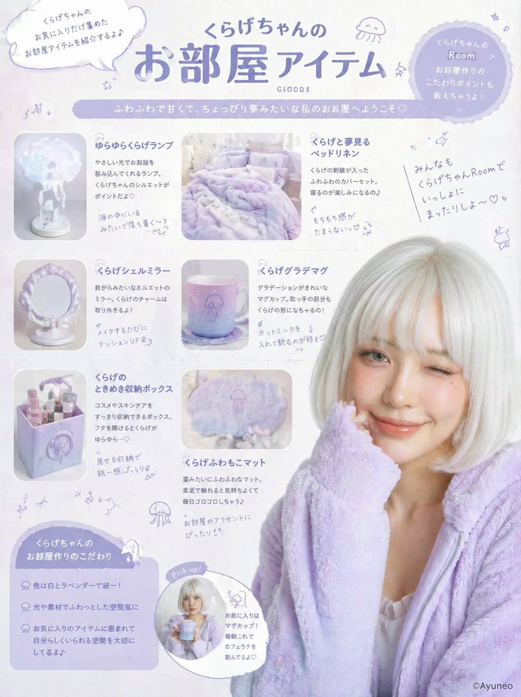 |

**Prompt:**

```
{"type":"pastel lifestyle poster / character room-goods feature sheet","theme":"soft dreamy lavender jellyfish aesthetic","style":"Japanese cute editorial graphic, airy white background, pastel lilac palette, delicate handwritten notes, sparkles and tiny doodles, soft product photography mixed with magazine layout","subject":{"character":{"name":"{argument name=\"character name\" default=\"くらげちゃん\"}","appearance":"young woman with a short platinum-blonde bob haircut, wearing a fluffy pale-lavender zip hoodie over a white inner top, shown from chest up on the lower right, face intentionally obscured with a plain beige rectangle"}},"layout":{"orientation":"vertical poster","background":"clean white with faint pastel doodles of stars, bubbles, tiny jellyfish, and musical notes","sections":[{"title":"header","position":"top","count":5,"labels":["speech bubble intro","main title","small subtitle GOODS","horizontal lavender ribbon tagline","round badge on the top right"]},{"title":"featured goods grid","position":"upper and middle left","count":6,"labels":["ゆらゆらくらげランプ","くらげと夢見るベッドリネン","くらげシェルミラー","くらげグラデマグ","くらげのときめき収納ボックス","くらげふわもこマット"]},{"title":"side handwritten note","position":"upper right","count":1,"labels":["みんなも くらげちゃんRoomで いっしょに まったりしよー♡♡"]},{"title":"room concept box","position":"lower left","count":1,"labels":["くらげちゃんの お部屋作りのこだわり"]},{"title":"pick up circle","position":"lower center-left","count":1,"labels":["Pick up!"]}],"product_images":{"count":6,"items":[{"name":"ゆらゆらくらげランプ","description":"small translucent jellyfish-shaped lamp on a white base, glowing softly in pale blue-lavender"},{"name":"くらげと夢見るベッドリネン","description":"plush pastel-lavender bed with fluffy comforter and pillows, dreamy cozy bedroom styling"},{"name":"くらげシェルミラー","description":"small tabletop mirror with a puffy shell-like pastel-lilac frame and rounded base"},{"name":"くらげグラデマグ","description":"ceramic mug with lavender-to-pink gradient and a simple jellyfish illustration"},{"name":"くらげのときめき収納ボックス","description":"pastel storage box holding cosmetics and small bottles, decorated with a jellyfish emblem"},{"name":"くらげふわもこマット","description":"small fluffy cloud-like or jellyfish-like mat in pale lavender and white"}]},"text_elements":{"main_title":"{argument name=\"headline text\" default=\"くらげちゃんの お部屋アイテム\"}","badge_text":"くらげちゃんの Room お部屋作りの こだわりポイントも 教えちゃうよ。","tagline":"ふわふわで甘くて、ちょっぴり夢みたいな私のお部屋へようこそ♡","speech_bubble":"くらげちゃんの お気に入りだけ集めた お部屋アイテムを紹介するよ♪","concept_points":{"count":3,"items":["色は白とラベンダーで統一!","光が集まるふわっとした空間に","お友達入りのアイテムに囲まれて 自分らしくいられる空間を大切にしてるよ♪"]},"product_blurbs":"each product has a short handwritten Japanese description in a cute casual font beside or below the image"},"composition":"the poster is left-heavy with product cards and text, while the character portrait occupies the lower right third, slightly overlapping the layout","color_palette":{"count":5,"colors":["white","pastel lavender","soft lilac","pale gray-violet","touches of pastel blue-pink gradient"]},"rendering_notes":"keep everything very soft, feminine, and cozy; rounded corners on all product photos; mix of bold Japanese headline typography and light handwritten annotations; subtle shadows; clean high-key lighting; social-media-ready editorial collage aesthetic"}
```

<!-- Case 143: Magical Seed Packet Diorama (by @AllaAisling) -->
### Case 143: [Magical Seed Packet Diorama](https://x.com/AllaAisling/status/2048156345518768190) (by [@AllaAisling](https://x.com/AllaAisling))

| Output |
| :----: |
| 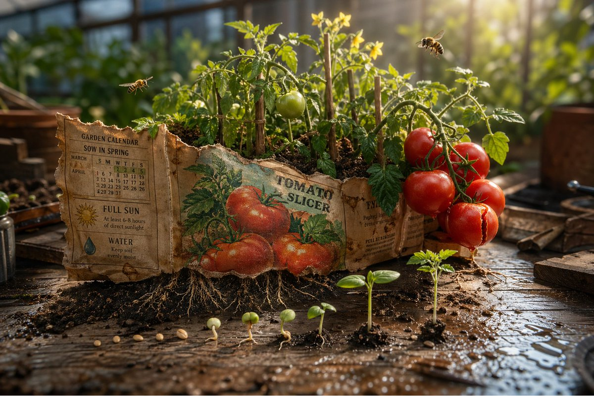 |

**Prompt:**

```
Epic 3D scene: a weathered seed packet lying open on a potting bench, its promise erupting into the garden it describes. The illustration on the front becomes real. {argument name="plant type" default="[PLANT / FLOWER]"} growing at full scale from the paper, roots visible through the packet's base pushing into soil below.
{argument name="detail left" default="[DETAIL 1]"} in full bloom at one corner. {argument name="detail right" default="[DETAIL 2]"} mid-growth at the other, not yet what it will be.
Tiny insects that belong to this plant, {argument name="insect type" default="[BEE / BUTTERFLY / BEETLE]"}, hovering at correct scale.
The written instructions on the back become garden calendar, "sow in spring" manifests as actual spring light. "full sun" manifests as a single shaft of it, hitting the tallest bloom perfectly.
Scattered seeds between packet and soil each showing their germination stage, split coat, first root, first shoot, first leaf.
The packet's torn top edge becomes a treeline.
Potting bench surface with soil scatter and water droplets.
Tilt-shift depth of field, greenhouse morning light, the packet as the garden it always intended.
```

<!-- Case 144: Luxury Chronograph Watch Ad (by @AlwaveNazca) -->
### Case 144: [Luxury Chronograph Watch Ad](https://x.com/AlwaveNazca/status/2048147643809865950) (by [@AlwaveNazca](https://x.com/AlwaveNazca))

| Output |
| :----: |
| 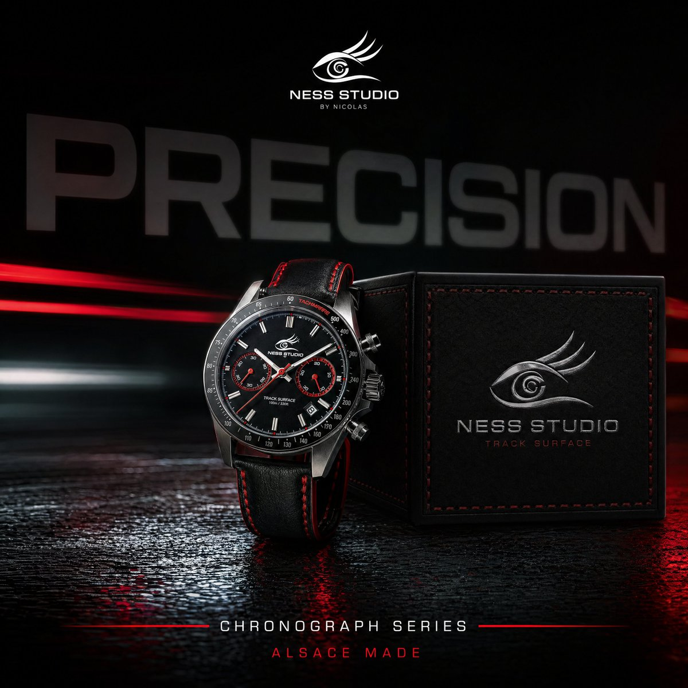 |

**Prompt:**

```
A dramatic luxury product advertising image for a motorsport-inspired chronograph wristwatch in a dark studio. Center-left foreground, show a single stainless steel chronograph watch standing upright at a slight three-quarter angle, with a black dial, two red-accent subdials, slim silver hour markers, a tachymeter bezel, and visible crown and pushers on the right side. The watch has a black leather strap with bold red stitching along both edges and a sporty premium finish. To the right of the watch, place one black square presentation box slightly behind it, textured like leather, with red stitching around the lid and a silver embossed eye-shaped logo above the text “NESS STUDIO” and smaller red text “TRACK SURFACE.” At the top center of the composition, add the same silver eye logo with the words “NESS STUDIO” and smaller “BY NICOLAS.” Across the background, place one oversized blurred word, {argument name="headline text" default="PRECISION"}, in large gray capital letters spanning nearly the full width. The scene is set against a deep black background with cinematic red and white horizontal light streaks crossing behind the products from left to right, suggesting speed and racetrack energy. Use a glossy wet ground plane with reflective texture, catching red highlights and mirrorlike reflections beneath the watch and box. At the bottom center, add the text “CHRONOGRAPH SERIES” in clean white spaced capitals with thin red horizontal lines extending on both sides, and below it smaller red capitals reading {argument name="tagline text" default="ALSACE MADE"}. Color palette: black, charcoal gray, silver steel, vivid racing red, and a touch of white. Lighting should be high-contrast and premium, with crisp specular highlights on the metal case, subtle soft fill on the box, and moody shadows. Overall style: ultra-polished commercial product photography, luxury watch campaign, sharp focus on the products, sleek branding, high-end automotive aesthetic.
```

<!-- Case 145: Neon Nike Lumina Ad Poster (by @AlwaveNazca) -->
### Case 145: [Neon Nike Lumina Ad Poster](https://x.com/AlwaveNazca/status/2048147643809865950) (by [@AlwaveNazca](https://x.com/AlwaveNazca))

| Output |
| :----: |
| 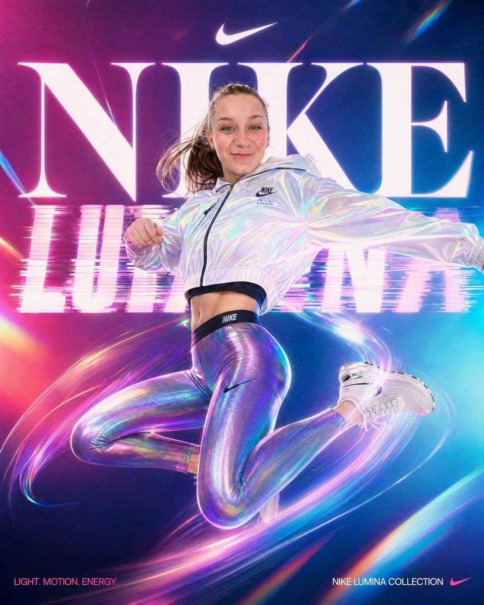 |

**Prompt:**

```
A high-energy vertical Nike fashion campaign poster featuring a single athletic young woman mid-jump against a futuristic neon studio background. She is captured in a dynamic airborne pose with one knee bent up, the other leg folded back, one arm extended outward and the other bent near her chest, conveying motion and power. Her face is obscured by a clean rectangular blur block centered over the face. She wears a cropped iridescent white hooded windbreaker with a black zipper and small Nike logo on the chest, holographic metallic lavender-blue leggings with a subtle Nike swoosh on the thigh, a black branded waistband visible above the leggings, and white chunky Nike sneakers. Her brown hair is tied in a high ponytail flying outward with the jump. Behind her, enormous glowing white serif letters spell “NIKE” across the upper half, with a small white Nike swoosh centered above the word. Across the middle background, the phrase “LUMINA” appears once in wide bold glowing letters with a horizontal glitch and scanline distortion effect, partially obscured by the model. The color palette is saturated magenta, violet, cyan, and electric blue with strong bloom, glossy highlights, lens flares, and chromatic aberration. Add sweeping circular light trails wrapping around the model’s legs and body, suggesting speed and motion. The overall style is premium sportswear advertising, ultra-polished, cinematic, high contrast, hyperreal retouching, crisp product detail, dramatic rim lighting, and a luminous holographic aesthetic. Place 2 small text lines at the bottom: bottom left reads {argument name="tagline text" default="LIGHT. MOTION. ENERGY."}, bottom right reads {argument name="collection name" default="NIKE LUMINA COLLECTION"} followed by a small Nike swoosh. Include exactly 3 visible Nike swooshes total: 1 above the large NIKE headline, 1 on the jacket chest, and 1 on the leggings.
```

<!-- Case 146: Streetwear Sneaker Poster Ad (by @AlwaveNazca) -->
### Case 146: [Streetwear Sneaker Poster Ad](https://x.com/AlwaveNazca/status/2048147643809865950) (by [@AlwaveNazca](https://x.com/AlwaveNazca))

| Output |
| :----: |
| 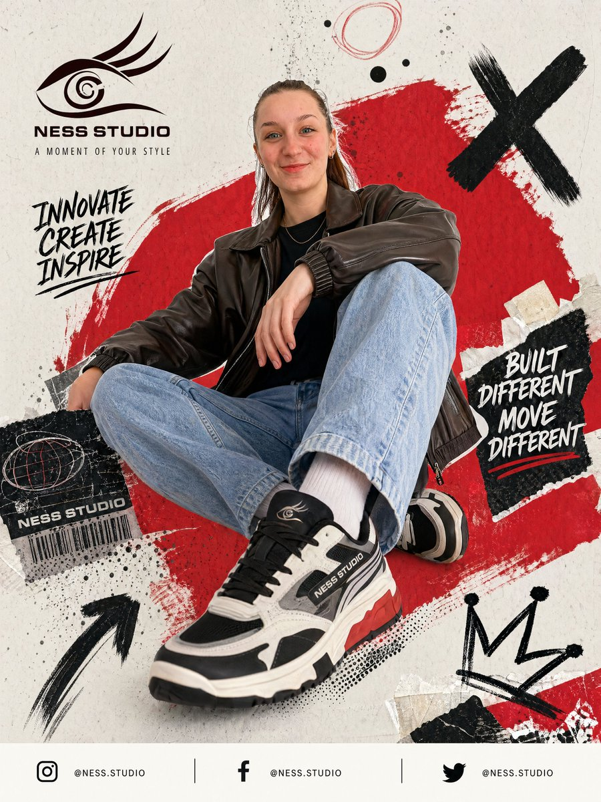 |

**Prompt:**

```
Create a bold streetwear poster advertisement for {argument name="brand name" default="NESS STUDIO"} featuring a young adult model seated casually on the ground in a low-angle fashion pose, one knee raised and one leg extended toward the camera so the sneaker in front appears oversized and dominant. The model wears a dark brown oversized leather bomber jacket, a black shirt, light blue loose-fit jeans, white socks, and chunky black-white-gray sneakers with a red accent in the sole and the {argument name="brand name" default="NESS STUDIO"} logo visible on the shoe side and tongue. The face is intentionally obscured by a soft rectangular blur block centered over the face. Use an off-white textured paper background with distressed grunge design elements and collage layering. Behind the model, place a large rough red paint brushstroke shape spanning diagonally across the center. Add black ink splatters, sketch circles, torn paper scraps, and hand-painted graffiti accents. Include 4 major graphic doodles: a large black X in the upper right, a hand-drawn upward arrow in the lower left, a rough crown sketch in the lower right, and a circular scribble near the top center. In the upper left, place a stylized eye logo above the text "{argument name="brand name" default="NESS STUDIO"}" and a smaller tagline below reading "A MOMENT OF YOUR STYLE". On the left middle area, add the handwritten slogan "INNOVATE CREATE INSPIRE" in stacked black brush lettering. On the right middle area, place a torn black paper patch with the handwritten white slogan "BUILT DIFFERENT MOVE DIFFERENT" and a red underline stroke. In the lower left near the shoe, add a black distressed label sticker containing a globe scribble, the text "{argument name="brand name" default="NESS STUDIO"}", and a barcode. Along the bottom footer, create a clean horizontal strip with 3 social media icons and handles separated by thin vertical dividers: Instagram, Facebook, and Twitter, each followed by "@NESS.STUDIO". The overall style should be edgy, urban, youthful, high-contrast, editorial street fashion, mixing product advertising photography with graffiti poster design, collage textures, and dynamic branding.
```

<!-- Case 147: Editorial Osaka Six Sweatshirt Ad (by @_LaurentB) -->
### Case 147: [Editorial Osaka Six Sweatshirt Ad](https://x.com/_LaurentB/status/2048126606313464040) (by [@_LaurentB](https://x.com/_LaurentB))

| Output |
| :----: |
| 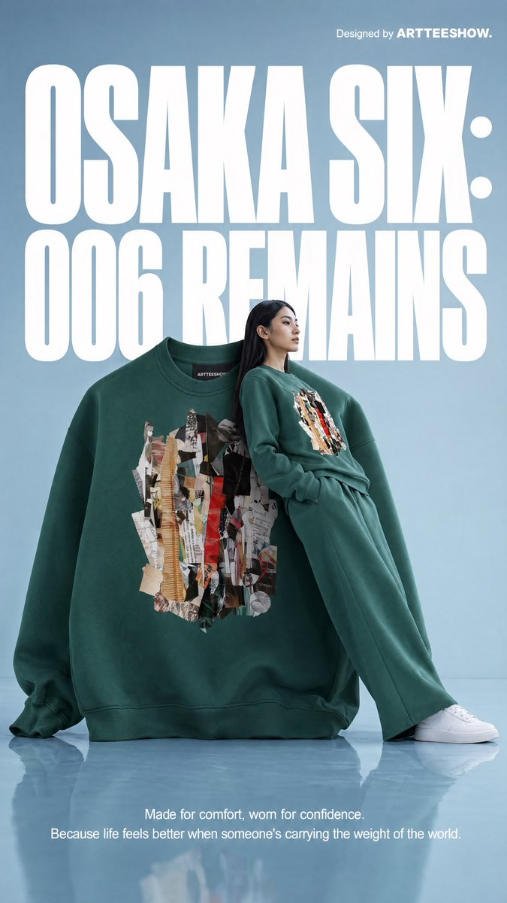 |

**Prompt:**

```
A clean editorial fashion advertisement poster on a pale powder-blue studio background with a glossy reflective floor. The composition is vertical and minimal, dominated by oversized bold white condensed sans-serif typography in the background reading “OSAKA SIX:” on the top line and “006 REMAINS” below, filling most of the upper half behind the subject. In the top right corner, small white branding text reads “Designed by ARTTEESHOW.” Centered in the lower middle is an oversized forest-green crewneck sweatshirt standing upright like a sculptural object, with soft heavy cotton fabric, dropped shoulders, extra-long sleeves pooled on the floor, and a small black neck label that reads ARTTEESHOW. On the chest of the sweatshirt is a large abstract collage print made from torn paper fragments in beige, tan, black, gray, white, and vivid red, arranged vertically like layered scraps. Leaning against the right side of the giant sweatshirt is a slim female fashion model with long straight black hair, wearing a matching {argument name="sweatshirt color" default="forest green"} sweatshirt and relaxed wide-leg sweatpants with clean white low-top sneakers. She is posed in profile with a calm detached editorial attitude, one hand in her pocket, her body reclining diagonally against the giant garment, legs extended forward; her face is obscured by a soft rectangular blur for an anonymous art-fashion look. The smaller worn sweatshirt has the same abstract torn-paper collage graphic centered on the chest. At the bottom center, add 2 lines of small white copy text: “Made for comfort, worn for confidence.” and “Because life feels better when someone’s carrying the weight of the world.” The image should feel like a premium conceptual streetwear campaign from the early 1990s reimagined as contemporary luxury advertising, with crisp studio lighting, soft shadows, subtle floor reflections, precise product focus, surreal scale contrast between the oversized sweatshirt and the model, and a polished magazine-poster aesthetic.
```

<!-- Case 148: Editorial Perfume Shot on Moss (by @Salmaaboukarr) -->
### Case 148: [Editorial Perfume Shot on Moss](https://x.com/Salmaaboukarr/status/2048103506125463983) (by [@Salmaaboukarr](https://x.com/Salmaaboukarr))

| Output |
| :----: |
| 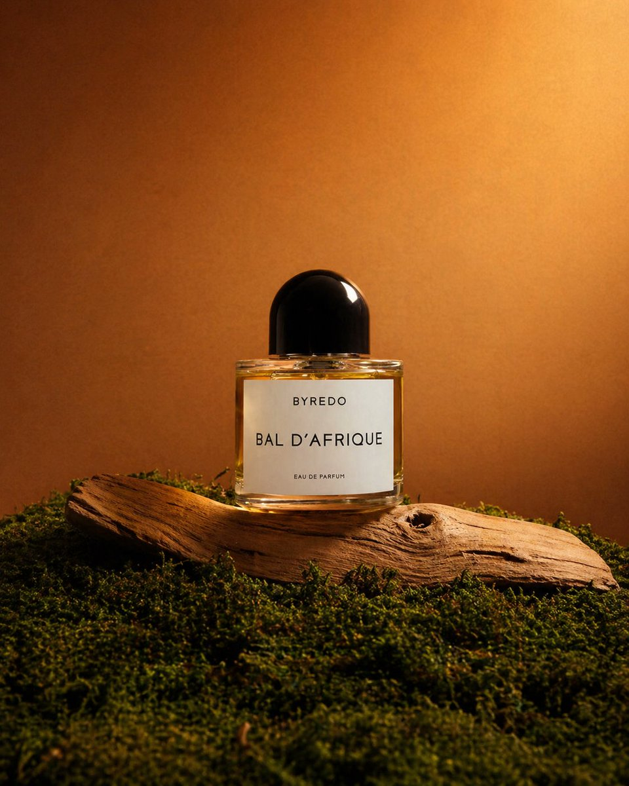 |

**Prompt:**

```
A high-end editorial product photograph of a single luxury perfume bottle centered in a warm earthy still-life scene. The product is a clear rectangular glass bottle filled with golden amber liquid, topped with a glossy rounded black cap, with a clean white front label that reads "BYREDO", "BAL D’AFRIQUE", and "EAU DE PARFUM". Place the bottle upright on 1 curved piece of pale weathered driftwood, surrounded by a dense carpet of 1 layer of rich green moss covering the foreground and lower frame. Use a minimal studio composition with the product isolated against a smooth warm brown-to-amber gradient background, softly illuminated like sunset light. Light the scene with dramatic directional warm light from the upper right, creating a bright glow on the background, a crisp highlight on the cap, soft reflections in the glass, and gentle shadows across the wood and moss. Keep the framing vertical, the bottle centered slightly low in the composition with generous negative space above, and the overall mood natural, luxurious, earthy, cinematic, and polished like a premium fragrance campaign shot.
```

<!-- Case 149: Editorial Perfume Bottle in Golden Fur (by @Salmaaboukarr) -->
### Case 149: [Editorial Perfume Bottle in Golden Fur](https://x.com/Salmaaboukarr/status/2048103506125463983) (by [@Salmaaboukarr](https://x.com/Salmaaboukarr))

| Output |
| :----: |
| 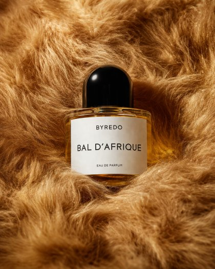 |

**Prompt:**

```
A luxurious editorial product photograph of a single perfume bottle nestled into dense, plush faux fur in rich golden caramel and honey-brown tones. Center the composition on one clear oval glass bottle filled with warm amber liquid, with a glossy rounded black cap and a clean white rectangular label. The label text should read {argument name="brand name" default="BYREDO"} at the top, {argument name="product name" default="BAL D’AFRIQUE"} large in the middle, and {argument name="product type" default="EAU DE PARFUM"} in small text near the bottom. Shoot it as a close-up still life with soft studio lighting, subtle highlights on the glass and cap, gentle shadows in the folds of the fur, and a warm cinematic color palette. The bottle should sit slightly embedded in the fur so the surrounding texture frames it from all sides, creating a premium fashion editorial mood, minimal composition, shallow depth of field, crisp focus on the label, and a high-end beauty campaign aesthetic.
```

<!-- Case 150: Luxury Miniature Dubai City Model (by @silentempiredev) -->
### Case 150: [Luxury Miniature Dubai City Model](https://x.com/silentempiredev/status/2048086378383384773) (by [@silentempiredev](https://x.com/silentempiredev))

| Output |
| :----: |
| 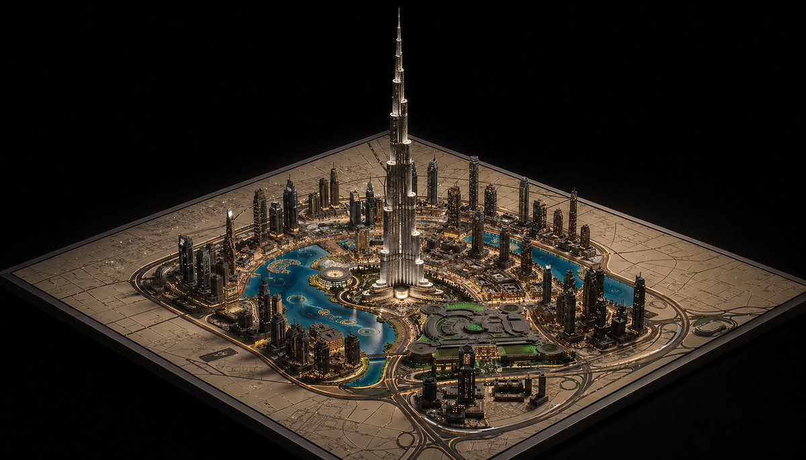 |

**Prompt:**

```
A hyper-detailed cinematic isometric miniature city model of {argument name="landmark tower" default="Burj Khalifa"} rising dramatically from the center of a square architectural master-plan board, presented like a luxury urban planning maquette on a black background. The composition shows one dominant ultra-tall silver skyscraper in the exact center, surrounded by a dense ring of modern high-rise towers, illuminated roads, bridges, and glowing warm city lights. Curving turquoise-blue water features and artificial lakes wrap around the central district in multiple connected pools and canals, with one large circular fountain-like feature near the tower base and several small island shapes visible in the water. In the lower right quadrant, include a large low-rise complex with rounded geometric roofs and subtle green-lit sections, connected by multilane roads and looping interchanges. The entire city sits on one square beige map board engraved with faint street grids and planning lines, with the board edges clearly visible and slightly raised. Viewpoint is a high three-quarter isometric angle, centered and symmetrical, with the tower extending far upward into negative space. Lighting is dramatic and luxurious: warm golden edge lights on buildings and roads, cool reflections in the water, crisp metallic highlights on the central tower, and a deep black void surrounding the model. Style should feel like a photorealistic architectural visualization mixed with a premium collectible scale model, extremely intricate, sharp, polished, and elegant.
```

<!-- Case 131: Parody Luxury Product Advertisement (by @tonysimons_) -->
### Case 131: [Parody Luxury Product Advertisement](https://x.com/tonysimons_/status/2048057490940596595) (by [@tonysimons_](https://x.com/tonysimons_))

| Output |
| :----: |
| 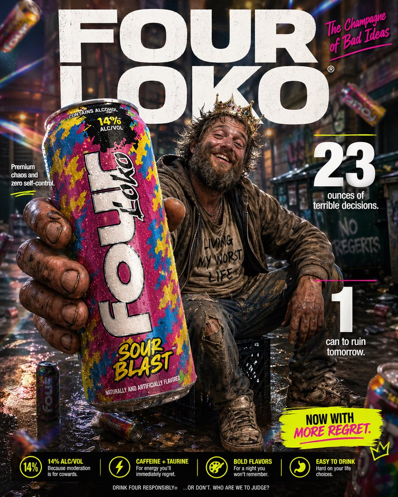 |

**Prompt:**

```
High-impact parody e-commerce infographic for “{argument name="product" default="Four Loko"}” malt beverage. Foreground: An extreme close-up of a rough, weathered hand holding a tall, brightly colored can of {argument name="product" default="Four Loko"} toward the camera. The can is slightly cold with visible condensation droplets and a loud, chaotic flavor design. The hand and can have a slight macro-lens blur for depth, with the can still reading clearly as the hero product. Central Subject: In the mid-ground, a funny, disheveled {argument name="subject" default="homeless-looking man"} sitting casually on a milk crate in an urban alley. He has a scruffy beard, messy hair, layered worn clothing, and a huge unbothered grin. He should look chaotic but oddly charismatic, like the accidental king of bad decisions. He is posed like a confident lifestyle-ad model, proudly showing off the can. Background & Lighting: A ridiculously polished ad-style backdrop mixed with a grimy city alley setting. Soft-focus urban textures, dumpster shapes, graffiti hints, and scattered clutter in the distance. Add dramatic studio lighting, soft glow, rainbow prism flares, and subtle light leaks to make the whole thing look way too premium for the subject matter. A few blurred {argument name="product" default="Four Loko"} cans can float artistically in the background for extra absurdity. Typography & Layout (Bold sans-serif, white and neon accent styling): Top Center (Background): Massive, bold text reading “{argument name="brand name" default="FOUR LOKO"}” positioned behind the subject. Top Right: Bold text reading “The Champagne of Bad Ideas”. Mid-Left: “Premium chaos and zero self-control” Mid-Right: Large, bold “23” with the text “ounces of terrible decisions.” Bottom-Right: Large, bold “1" with the text “can to ruin tomorrow.” Optional small callout text near the bottom: “Now with more regret.” Style: Ultra-detailed, 8k parody commercial photography, sharp focus on the can, shallow depth of field, vibrant trashy color palette, clean advertising composition, exaggerated premium product-ad aesthetic, funny visual contrast between polished branding and the wrecked subject.
```

<!-- Case 109: VR Headset Exploded View Poster (by @wory37303852) -->
### Case 109: [VR Headset Exploded View Poster](https://x.com/wory37303852/status/2045925660401795478) (by [@wory37303852](https://x.com/wory37303852))

| Output |
| :----: |
|  |

**Prompt:**

```
{
  "type": "exploded view product diagram poster",
  "subject": "VR headset",
  "style": "clean high-tech 3D render, studio lighting, glowing accents",
  "background": "{argument name=\"background color\" default=\"soft purple and blue gradient\"}",
  "header": {
    "logo": "∞ {argument name=\"product name\" default=\"Meta Quest 3\"}",
    "subtitle": "{argument name=\"main catchphrase\" default=\"まったく新しい現実を、まったく新しい構造から。\"}"
  },
  "layout": {
    "centerpiece": "vertically stacked exploded view of a VR headset showing 9 distinct layers of internal components: outer shell, camera sensors, motherboard with chip, pancake lenses, internal frame, battery packs, side straps, top strap, and facial interface cushion.",
    "callout_labels": {
      "count": 8,
      "left_side": [
        "Snapdragon® XR2 Gen 2\n圧倒的な処理性能でリアルタイムな体験を。",
        "調整可能なIPD機構\n幅広いユーザーに快適なフィット感を。",
        "精密設計されたヘッドストラップ\n快適さと安定性を追求したエルゴノミクス。"
      ],
      "right_side": [
        "フェイスプレート\n洗練されたデザインと最適な重量バランス。",
        "トラッキングカメラ\n高精度な位置トラッキングと環境認識を実現。",
        "パンケーキレンズ\n薄型設計で広い視野角と鮮明な映像を提供。",
        "高性能バッテリー\n長時間駆動を支える最適化された電源設計。",
        "柔らかなフェイスインターフェース\n長時間でも快適な装着感を実現。"
      ]
    },
    "footer": {
      "left_text_block": {
        "headline": "{argument name=\"bottom headline\" default=\"体験は、構造から進化する。\"}",
        "body": "一つひとつのパーツに、没入体験を支える最先端テクノロジーとこだわりの設計。Meta Quest 3は、未来を感じさせる体験を内部から生み出しています。"
      },
      "right_logo": "∞ Meta"
    }
  }
}
```

## Casos de Retrato y Fotografia

<!-- Case 1: Convenience Store Neon Portrait (by @BubbleBrain) -->
### Case 1: [Retrato Neón de Tienda de Conveniencia](https://x.com/BubbleBrain/status/2045167461147042202) (by [@BubbleBrain](https://x.com/BubbleBrain))

| Output |
| :----: |
| <a href="https://evolink.ai/gpt-image-2-prompts?utm_source=github&utm_medium=picture&utm_campaign=awesome-gpt-image-2-prompts" target="_blank" rel="noopener noreferrer"></a> |

**Indicación:**

```
35mm film photography with harsh convenience store fluorescent lighting mixed with colorful neon signs from outside, authentic film grain, high contrast, slight color cast, cinematic street editorial style, intimate medium shot, early 20s sexy Chinese female idol with ultra-realistic delicate refined Chinese features, seductive almond-shaped fox eyes with natural double eyelids, high nose bridge, small sharp V-shaped jawline, flawless porcelain skin with cool ivory undertone and visible specular highlights from fluorescent light, subtle skin texture and micro pores, natural dewy makeup with soft flush on cheeks, glossy natural pink lips slightly parted, subtle natural freckles across nose and cheeks, long dark brown hair in a messy high ponytail with many loose strands falling around face and neck, wearing an oversized white button-up shirt as the only top, unbuttoned at the top with deep cleavage and loosely tied at the waist, paired with a tiny black pleated mini skirt, barefoot in simple white slides, seductive casual leaning pose against the glass door of a 24-hour convenience store at late night, body slightly arched, one leg bent with foot resting against the door frame, the other leg straight, one hand holding a bottle of iced drink, the other hand lightly pulling the hem of her mini skirt, intensely seductive playful yet slightly vulnerable gaze straight at the viewer with soft doe eyes full of quiet temptation and teasing smile, bright cold fluorescent store light from inside mixed with pink and blue neon glow from outside signs, realistic reflections on glass door, blurred convenience store interior with shelves and snacks in background, authentic 35mm film color grading with harsh lighting and neon accents, extremely sharp yet soft skin rendering, natural hair strands, realistic fabric wrinkles and drape on the oversized shirt and mini skirt, no plastic skin, no digital over-sharpening, no airbrushing, no blemishes, no moles, no oily skin, no watermark, no text, authentic late-night convenience store atmosphere
```
<!-- Case 2: Cinematic Minimal Portrait (by @iam_miharbi) -->
### Case 2: [Retrato Minimalista Cinematográfico](https://x.com/iam_miharbi/status/2045151354679665101) (by [@iam_miharbi](https://x.com/iam_miharbi))

| Output |
| :----: |
| <a href="https://evolink.ai/gpt-image-2-prompts?utm_source=github&utm_medium=picture&utm_campaign=awesome-gpt-image-2-prompts" target="_blank" rel="noopener noreferrer"></a> |

**Indicación:**

```
Generate a cinematic minimal portrait of a solitary man standing in an intense orange to red gradient environment, strong silhouette lighting, deep shadow contrast, reflective glossy floor, symmetrical composition, minimal
```
<!-- Case 3: Japanese Onsen Ryokan Portrait (by @BubbleBrain) -->
### Case 3: [Retrato en Ryokan de Onsen Japonés](https://x.com/BubbleBrain/status/2045092449803284923) (by [@BubbleBrain](https://x.com/BubbleBrain))

| Output |
| :----: |
| <a href="https://evolink.ai/gpt-image-2-prompts?utm_source=github&utm_medium=picture&utm_campaign=awesome-gpt-image-2-prompts" target="_blank" rel="noopener noreferrer"></a> |

**Indicación:**

```
35mm film photography, warm vintage Japanese onsen ryokan aesthetic, soft ambient wooden lantern lighting mixed with gentle natural window light, subtle film grain, gentle color shift, high atmosphere editorial style, intimate medium shot, early 20s beautiful Chinese female idol with ultra-realistic delicate refined Chinese features, seductive almond-shaped fox eyes with natural double eyelids, high nose bridge, small sharp V-shaped jawline, flawless porcelain skin with warm ivory undertone, visible subtle skin texture and micro pores, soft natural makeup with dewy glow, subtle rosy flush on cheeks, natural soft pink lips slightly parted, long dark brown hair tied in a loose low bun with some messy strands falling around face and neck, wearing a loose white yukata (traditional Japanese bathrobe) deliberately slipped off one shoulder and loosely tied at the waist, the fabric slightly open revealing smooth skin and subtle cleavage, barefoot, seductive relaxed sitting pose on the edge of a traditional wooden engawa veranda at a vintage onsen ryokan, body slightly turned toward the camera, one leg bent with foot resting on the wooden floor, the other leg gently dangling, one hand lightly holding the yukata collar, the other hand resting on the wooden floor behind her for support, softly arched back to gently accentuate curves, intensely seductive yet gentle and inviting gaze straight at the viewer with soft doe eyes full of quiet temptation and warmth, warm wooden interior with paper sliding doors and distant steaming hot spring in soft focus, gentle rim lighting highlighting skin and fabric texture, authentic vintage film color grading with warm tones, extremely sharp yet soft skin rendering, natural hair strands, realistic fabric wrinkles and drape on the yukata, no plastic skin, no digital over-sharpening, no airbrushing, no blemishes, no moles, no oily skin, no watermark, no text, authentic 35mm film Japanese onsen ryokan atmosphere
```
<!-- Case 4: 35mm Flash Editorial Portrait (by @BubbleBrain) -->
### Case 4: [Retrato Editorial Flash 35mm](https://x.com/BubbleBrain/status/2045052982728016131) (by [@BubbleBrain](https://x.com/BubbleBrain))

| Output |
| :----: |
| <a href="https://evolink.ai/gpt-image-2-prompts?utm_source=github&utm_medium=picture&utm_campaign=awesome-gpt-image-2-prompts" target="_blank" rel="noopener noreferrer"></a> |

**Indicación:**

```
35mm color film photography with harsh direct on-camera flash, specular highlights on skin and clothing, strong catchlights in eyes, high contrast flash illumination, authentic film grain and color shift, high fashion fresh innocent basketball court editorial style, intimate first-person low-angle POV shot from below, early 20s sexy Chinese female idol with ultra-realistic delicate refined Chinese features, seductive almond-shaped fox eyes with natural double eyelids, high nose bridge, small sharp V-shaped jawline, flawless realistic porcelain skin with cool ivory undertone and visible flash specular highlights, fine delicate skin texture with subtle pores micro details and natural dewy glow under flash, fresh natural sporty makeup with soft dewy glow, subtle natural flush on cheeks, natural pink lips slightly parted, subtle natural freckles across nose and cheeks, long dark brown hair tied in a high playful ponytail with some loose strands framing the face and realistic loose strands, wearing a loose white tank top and white high-waisted basketball shorts, white knee-high sports socks, seductive natural leaning pose against the basketball hoop pole on the outdoor court at dusk, body angled sideways with naturally arched back and hips gently pushed back to accentuate perky round hips and sexy butt curve, one leg naturally extended forward toward the camera and the other leg slightly bent to emphasize long sexy legs, both hands lightly resting on the basketball pole at shoulder height, intensely seductive playful yet pitiable doe-eyed gaze straight at the viewer with soft vulnerable longing eyes and a gentle teasing smile full of quiet temptation and desire, harsh direct on-camera flash creating sharp specular highlights and strong catchlights, background with blurred basketball court and hoop under dusk sky, high contrast film color grading with natural flash look, extremely sharp yet soft skin rendering with authentic 35mm direct flash aesthetic, natural hair strands, realistic fabric texture on tank top and shorts with socks detail, no plastic skin, no digital over-sharpening, no airbrushing, no blemishes, no moles, no oily skin, no watermark, no text, authentic 35mm direct flash film basketball court look --ar 9:16
```
<!-- Case 5: Mirror Selfie Bedroom Portrait (by @Shinning1010) -->
### Case 5: [Selfie Espejo en Habitación](https://x.com/Shinning1010/status/2045002808903020962) (by [@Shinning1010](https://x.com/Shinning1010))

| Output |
| :----: |
| <a href="https://evolink.ai/gpt-image-2-prompts?utm_source=github&utm_medium=picture&utm_campaign=awesome-gpt-image-2-prompts" target="_blank" rel="noopener noreferrer"></a> |

**Indicación:**

```
A stunning 18-year-old Chinese girl with a youthful, pure face and realistic skin texture, sitting on a cozy, slightly messy bed in her bedroom. She is taking a mirror selfie with a smartphone, capturing a natural and intimate moment. Wearing casual gray loungewear and neat white crew socks. Soft natural light (golden hour) streams in from a side window, creating a warm, moody, and cinematic atmosphere. 35mm lens, sharp focus on the subject in the mirror, depth of field with a beautifully blurred background (bokeh). Photorealistic, 8K, high resolution, studio quality, masterpiece.
Negative Prompts: no extra limbs, no deformed hands, no blur, no noise, no watermark, no text, no cartoon/anime style. Aspect Ratio: 3:4.
```

<!-- Case 6: Soft Airy 35mm Portrait (by @BubbleBrain) -->
### Case 6: [Retrato Suave Aireado 35mm](https://x.com/BubbleBrain/status/2046115431144902732) (by [@BubbleBrain](https://x.com/BubbleBrain))

| Output |
| :----: |
| <a href="https://evolink.ai/gpt-image-2-prompts?utm_source=github&utm_medium=picture&utm_campaign=awesome-gpt-image-2-prompts" target="_blank" rel="noopener noreferrer"></a> |

**Indicación:**

```
Analog 35mm film photography, soft airy Japanese-style aesthetic, gentle diffused natural window light, slight overexposure, pastel tones, low contrast, soft highlights, minimal indoor setting near a window with white curtains, clean light-colored wall, natural composition, eye-level, slightly closer full-body framing (mid-thigh to head), young East Asian woman, natural minimal makeup, soft realistic skin texture, long slightly messy dark hair, oversized white button-up shirt, light casual shorts, barefoot, simple and relaxed styling, standing naturally with relaxed posture, arms loosely at sides or slightly behind, facing camera, gentle soft smile, subtle stillness, focus on light, air, and quiet everyday mood, soft film grain, dreamy and understated atmosphere --ar 9:16
```

<!-- Case 7: Luxury Glam Beauty Portrait (by @patrickassale) -->
### Case 7: [Retrato de Belleza Glam de Lujo](https://x.com/patrickassale/status/2044581766309060765) (by [@patrickassale](https://x.com/patrickassale))

| Output |
| :----: |
| <a href="https://evolink.ai/gpt-image-2-prompts?utm_source=github&utm_medium=picture&utm_campaign=awesome-gpt-image-2-prompts" target="_blank" rel="noopener noreferrer"></a> |

**Indicación:**

```
Luxury Glam Beauty Portrait:, Beautiful Black woman, youthful spirit, creamy vanilla, silk press, mahogany red, subtle confidence, textured fabric, sapphire blue, minimal jewelry, beachside breeze, lens flare effect, nostalgic, cinematic lens, symmetrical composition, soft focus, high fashion photography, monochromatic, dewy finish, mysterious tension, layered elements
```
<!-- Case 8: 9:16 Cosplayer Portrait Screenshot (by @Zoulinshen) -->
### Case 8: [Captura de Cosplayer 9:16](https://x.com/Zoulinshen/status/2045082518089810073) (by [@Zoulinshen](https://x.com/Zoulinshen))

| Output |
| :----: |
| <a href="https://evolink.ai/gpt-image-2-prompts?utm_source=github&utm_medium=picture&utm_campaign=awesome-gpt-image-2-prompts" target="_blank" rel="noopener noreferrer"></a> |

**Indicación:**

```
 生成一张竖版手机截图风格的图片，整体比例接近 9:16。画面中心偏上是一位真人 coser，扮演（角色名称）的二次元角色。人物为写实风格，但五官略带动漫感，皮肤细腻，眼睛稍大，表情温柔地看向镜头，坐在室内的休闲场景中，例如咖啡厅或酒吧吧台前，背景有符合场景的道具。画面最上方加入手机系统状态栏 UI，包括时间、电量、信号、网络等图标，让整张图看起来像手机截图。画面底部叠加一块宽大的半透明 galgame 风格对话框，对话框左侧放一个与画面人物对应的动漫或 Q 版头像；对话框右侧排版文字：第一行用较大字体显示与前面相同的角色名字，下面一到两行显示一段适合这个角色人设的、温柔治愈风格的简体中文台词，由你自动创作。再在对话框下方加一条操作栏，仿照 galgame UI。整体风格高清、细节丰富、光线柔和、二次元与真人写真自然融合。
```

<!-- Case 9: Urban Turn-Back Street Portrait (by @Tz_2022) -->
### Case 9: [Retrato Urbano de Espaldas en la Calle](https://x.com/Tz_2022/status/2045892003775361198) (by [@Tz_2022](https://x.com/Tz_2022))

| Output |
| :----: |
| <a href="https://evolink.ai/gpt-image-2-prompts?utm_source=github&utm_medium=picture&utm_campaign=awesome-gpt-image-2-prompts" target="_blank" rel="noopener noreferrer"></a> |

**Indicación:**

```
该画面为中近景，采用平视镜头，聚焦于一位年轻女性。她以七分身镜头呈现，身体坐姿略带倾斜，臀部向后撅起，双腿自然交叠，左腿在前，右腿在后，膝盖微屈。她将上半身向右后方扭转，头部则转向镜头方向，形成一个经典的“回眸”姿态，目光直视镜头，眼神清澈而略带一丝俏皮。她的发型是蓬松的棕色齐肩短发，刘海自然垂落，发尾微卷，妆容清淡自然，仅在眼部有轻微眼线勾勒，唇色为自然裸粉。画面整体采用自然日光滤镜，光线从画面左上方斜射入，形成柔和的逆光轮廓，面部和身体右侧被温暖的金色光线照亮，左侧则形成自然的阴影过渡，增强了立体感。灯光效果是明亮的自然光，带有轻微的镜头眩光，营造出午后阳光的氛围。拍摄角度为平视，构图上，人物主体位于画面中偏右位置，背景中的斑马线与道路线条形成自然的引导线，将视线引向人物。背景为城市街道，包含道路、斑马线、绿化带和远处的车辆，背景被适度虚化，但依然可辨识出树木、护栏和停放的电动车等元素，构图上利用了三分法，人物位于右侧三分之一处，增强了画面的平衡感。主体穿着一件军绿色迷彩图案的连帽卫衣，下身搭配黑色短裤，脚穿白色高帮运动鞋配白色中筒袜。背包为黑色，带有橙黄色装饰条纹和一个橙色毛绒挂件，材质为帆布和皮革拼接。整体风格为街头休闲风，肢体语言放松自然，表情略带好奇与俏皮，整体呈现出一种随性、青春、充满活力的都市少女形象。
```

<!-- Case 10: Sam Altman Skatepark Snapshot (by @Malek1173989) -->
### Case 10: [Instantánea de Sam Altman en Skatepark](https://x.com/Malek1173989/status/2045836887684694395) (by [@Malek1173989](https://x.com/Malek1173989))

| Output |
| :----: |
| <a href="https://evolink.ai/gpt-image-2-prompts?utm_source=github&utm_medium=picture&utm_campaign=awesome-gpt-image-2-prompts" target="_blank" rel="noopener noreferrer"></a> |

**Indicación:**

```
"Sam Altman on a skateboard at a skatepark with no people."
```

<!-- Case 11: Korean Idol 3x3 Grid Portrait (by @BubbleBrain) -->
### Case 11: [Retrato en Cuadrícula 3x3 de Idol Coreano](https://x.com/BubbleBrain/status/2046268941941850575) (by [@BubbleBrain](https://x.com/BubbleBrain))

| Output |
| :----: |
| <a href="https://evolink.ai/gpt-image-2-prompts?utm_source=github&utm_medium=picture&utm_campaign=awesome-gpt-image-2-prompts" target="_blank" rel="noopener noreferrer"></a> |

**Indicación:**

```
9:16 vertical, Korean idol portrait photoshoot, 3x3 grid (nine frames), same person in all images, consistent facial features and styling, soft black mist filter effect, lowered contrast, blooming highlights, subtle glow around light sources
```

<!-- Case 12: CCD Camera Flash Korean Idol (by @BubbleBrain) -->
### Case 12: [Idol Coreano con Flash de Cámara CCD](https://x.com/BubbleBrain/status/2046190539213885806) (by [@BubbleBrain](https://x.com/BubbleBrain))

| Output |
| :----: |
| <a href="https://evolink.ai/gpt-image-2-prompts?utm_source=github&utm_medium=picture&utm_campaign=awesome-gpt-image-2-prompts" target="_blank" rel="noopener noreferrer"></a> |

**Indicación:**

```
mobile phone photo, old CCD camera aesthetic, harsh flash, grainy, dim messy indoor lighting, candid snapshot feeling, slight motion blur, young Korean female idol, soft innocent look
```

<!-- Case 13: Korean Idol 3x3 Collage Portrait (by @BubbleBrain) -->
### Case 13: [Collage 3x3 de Idol Coreano](https://x.com/BubbleBrain/status/2046151898621993364) (by [@BubbleBrain](https://x.com/BubbleBrain))

| Output |
| :----: |
| <a href="https://evolink.ai/gpt-image-2-prompts?utm_source=github&utm_medium=picture&utm_campaign=awesome-gpt-image-2-prompts" target="_blank" rel="noopener noreferrer"></a> |

**Indicación:**

```
9:16 vertical — a 3x3 grid collage (nine images) forming a Korean idol portrait photoshoot series. Each frame features the same young Korean female idol, maintaining 100% consistency in facial features, proportions, hairstyle, and identity across all nine shots.   Natural, ultra-realistic skin texture, no retouching, no smoothing. Clean idol-style minimal makeup, soft glow, subtle imperfections.   Hair: long, voluminous dark hair, slightly tousled, consistent across all frames (natural loose flow, slight movement).  Outfit: cohesive Korean idol photoshoot styling — white shirt + short bottoms (or simple neutral-toned outfit), youthful, clean, slightly casual but styled. Same outfit across all frames.  Setting: minimal studio or simple indoor environment (plain wall, soft window light, clean background). Focus on subject, not environment.  Lighting: soft diffused natural light, gentle highlights, low contrast, slightly airy tones, subtle film-like softness.  Camera style: intimate portrait photography, slightly handheld feel, subtle imperfections (minor grain, slight blur in motion frames, imperfect framing).  Frame breakdown (3x3 grid):  Top row: - Top left: standing naturally, looking slightly away, relaxed expression - Top center: facing camera, casual mid-motion (hair or body slight movement) - Top right: slight side angle, soft gaze, natural candid feel  Middle row: - Center left: looking slightly upward, soft thoughtful expression - Center: close-up portrait, direct eye contact, gentle idol smile - Center right: turning body slightly, mid-motion candid frame  Bottom row: - Bottom left: seated or leaning casually, relaxed posture - Bottom center: back partially turned, looking over shoulder toward camera - Bottom right: standing close to frame, slightly playful or soft expression  Mood: Korean idol photobook / photocard aesthetic, intimate, soft, natural, everyday charm.  Quality: ultra-realistic, 8K detail, subtle analog film grain, natural imperfections, soft dreamy tone
```

<!-- Case 14: Soft Black Mist Editorial Portrait (by @BubbleBrain) -->
### Case 14: [Retrato Editorial de Niebla Negra Suave](https://x.com/BubbleBrain/status/2046434670724907395) (by [@BubbleBrain](https://x.com/BubbleBrain))

| Output |
| :----: |
| <a href="https://evolink.ai/gpt-image-2-prompts?utm_source=github&utm_medium=picture&utm_campaign=awesome-gpt-image-2-prompts" target="_blank" rel="noopener noreferrer"></a> |

**Indicación:**

```
9:16 vertical — editorial portrait, single subject  soft black mist filter, subtle haze, gentle highlight bloom, muted tones  minimal indoor space, clean background, slight texture  young Korean woman, minimal makeup, natural skin texture  outfit: fitted ribbed knit top or soft camisole layered under a loose shirt, paired with high-waisted shorts or skirt; fabric slightly clings to body shape, soft and natural, no revealing elements  hair: slightly messy, natural volume  pose: sitting on floor with one leg bent and the other relaxed, body slightly leaning, shoulders not aligned, head tilted  composition: subject slightly off-center, negative space present  expression: calm, slightly distant, natural lips  lighting: soft side light, gentle shadow falloff  mood: understated, quiet, subtly sensual through natural body lines, relaxed and unposed  quality: fine grain, slight softness, realistic look
```

<!-- Case 15: Fujifilm Strawberry School Portrait (by @BubbleBrain) -->
### Case 15: [Retrato Escolar de Fresa Fujifilm](https://x.com/BubbleBrain/status/2046483268019884384) (by [@BubbleBrain](https://x.com/BubbleBrain))

| Output |
| :----: |
| <a href="https://evolink.ai/gpt-image-2-prompts?utm_source=github&utm_medium=picture&utm_campaign=awesome-gpt-image-2-prompts" target="_blank" rel="noopener noreferrer"></a> |

**Indicación:**

```
9:16 vertical — Japanese Fuji film style portrait, single subject  Fujifilm analog aesthetic (Pro 400H / Superia feel), soft pastel tones, slight green-magenta shift, low contrast, gentle highlight roll-off, fine film grain, subtle halation, slight vignette  bright natural daylight, diffused sunlight through window, soft shadows, airy atmosphere  young Japanese female idol, natural minimal makeup, fresh glowing skin, realistic texture, slight imperfections  outfit: Japanese school uniform (sailor-style or blazer uniform), neatly styled, non-revealing, youthful and clean  hair: natural dark hair, straight or softly flowing, a few loose strands  pose: front-facing or slight angle toward camera, relaxed posture; one hand gently holding a strawberry near lips, mid-action as if about to take a bite; shoulders relaxed, subtle natural body curve  expression: soft playful gaze, light smile or neutral lips, gentle eye contact with camera  setting: minimal indoor near window or simple outdoor corner, clean background, everyday atmosphere  composition: slightly off-center framing, intimate distance, candid feel  mood: fresh, youthful, sweet everyday moment, understated charm  quality: ultra-realistic, analog film look, natural imperfections, soft dreamy finish
```

<!-- Case 16: Soft Black Mist Idol Portrait (by @BubbleBrain) -->
### Case 16: [Retrato de Idol con Niebla Negra Suave](https://x.com/BubbleBrain/status/2046518189509734903) (by [@BubbleBrain](https://x.com/BubbleBrain))

| Output |
| :----: |
| <a href="https://evolink.ai/gpt-image-2-prompts?utm_source=github&utm_medium=picture&utm_campaign=awesome-gpt-image-2-prompts" target="_blank" rel="noopener noreferrer"></a> |

**Indicación:**

```
9:16 vertical — Korean idol portrait photography, single subject  soft black mist filter effect, lowered contrast, gentle highlight bloom, subtle glow, soft diffusion, slightly faded blacks  minimal indoor setting near window, white curtains, clean light-toned background  young Korean female idol, natural minimal makeup, dewy realistic skin texture, subtle imperfections  outfit: oversized white button-up shirt + short bottoms, slightly loose fit, soft and casual styling, no revealing elements  hair: long dark hair, slightly messy, natural volume, softly flowing  pose: relaxed standing or slight lean, body subtly angled, one leg slightly forward, shoulders relaxed; one hand lightly touching collar or resting near neckline, the other relaxed; gentle body curve without exaggeration  expression: soft cute smile, slightly playful eyes, direct or slightly off-camera gaze  camera: close to mid-body framing, eye-level, intimate distance, slight handheld feel  lighting: diffused natural daylight, soft shadows, gentle light wrapping around face and body  mood: cute yet subtly sensual, intimate, everyday softness, quiet romantic atmosphere  quality: ultra-realistic, fine film grain, slight softness at edges, natural imperfections, dreamy understated tone
```

<!-- Case 17: Fujifilm Couple Portrait (by @BubbleBrain) -->
### Case 17: [Retrato de Pareja Fujifilm](https://x.com/BubbleBrain/status/2046502288102170757) (by [@BubbleBrain](https://x.com/BubbleBrain))

| Output |
| :----: |
| <a href="https://evolink.ai/gpt-image-2-prompts?utm_source=github&utm_medium=picture&utm_campaign=awesome-gpt-image-2-prompts" target="_blank" rel="noopener noreferrer"></a> |

**Indicación:**

```
9:16 vertical — Japanese Fuji film style couple portrait, two subjects  Fujifilm analog aesthetic (Pro 400H / Superia feel), soft pastel tones, slight green-magenta shift, low contrast, gentle highlight roll-off, fine film grain, subtle halation  bright natural daylight, diffused sunlight through window, soft shadows, airy atmosphere  young Japanese couple, natural minimal makeup, realistic skin texture, slight imperfections  female outfit: oversized button-up shirt with loose shorts, relaxed fit, soft casual styling   male outfit: simple t-shirt or light shirt, clean and understated  hair: natural, slightly tousled for both  pose: close intimate distance — sitting or standing close together; the girl gently leaning toward him, one hand lightly resting on his shoulder or chest; the boy slightly leaning in, faces close, almost touching, capturing the moment just before a kiss  expression: soft smiles or gentle gaze toward each other, relaxed and natural, emotional connection visible  camera: close framing (waist-up), eye-level, intimate distance, slight handheld feel  setting: minimal indoor near window, light curtains, clean soft background  lighting: diffused daylight, gentle highlight bloom, soft shadow transitions  mood: warm, romantic, intimate everyday moment, natural affection  quality: ultra-realistic, analog film look, fine grain, slight softness, natural imperfections
```

<!-- Case 18: AI Self-Perception Portrait (by @80vul) -->
### Case 18: [Retrato de Autopercepción de IA](https://x.com/80vul/status/2046218165961753047) (by [@80vul](https://x.com/80vul))

| Output |
| :----: |
| <a href="https://evolink.ai/gpt-image-2-prompts?utm_source=github&utm_medium=picture&utm_campaign=awesome-gpt-image-2-prompts" target="_blank" rel="noopener noreferrer"></a> |

**Indicación:**

```
根据你对我的认知 给我生成一个“你认识的我”的 图片
```


<!-- Case 19: Create the most realistic front page design of a vintage newspaper featuring ... (by @Naiknelofar788) -->
### Case 19: [Portada de Periódico Vintage Realista](https://x.com/Naiknelofar788/status/2047207812800147647) (by [@Naiknelofar788](https://x.com/Naiknelofar788))

| Output |
| :----: |
|  |

**Indicación:**

```
Create the most realistic front page design of a vintage newspaper featuring the main character. The layout should be made in the style of a real printed newspaper with a cinematic black-and-white aesthetic.
The main photo should be prominently placed in the center, framed, like the image in the title of the article. The subject in the photo should remain unchanged and clearly distinguishable in natural light and slightly increased contrast in order to match the spectacular editorial style.
Create a bold, attention-grabbing headline at the top (create a unique title that matches the spirit of the photo - it can be romantic, mysterious, funny, or dramatic). Add a smaller subtitle under it, which will look like a real newspaper caption.
Add realistic newspaper elements:
Columns of small text (in the style of lorem ipsum, but framed like real news)
At the top is the fictitious name of the publication (for example, The Daily Prompts, AI Times or similar - think creatively, according to the picture)
Date, issue number and location
Decorative lines, dividers, and vintage typography
Small additional articles or captions to the main image
Optional stamps, doodles, or editorial notes to add personality.
Style:
Black and white or slightly faded monochrome paper
Fine paper texture, grain, and ink defects
Small shadows and creases that mimic real printed paper
The aesthetics of a clean but slightly worn vintage newspaper
Mood: Give the design personality, expressiveness and plot, as if the plot is part of the main article.
Aspect ratio: 4:5 or 1:1
High-detail, ultra-realistic hybrid of editorial photography and print design.
```

<!-- Case 20: Magazine Travel Guide Feature Article (by @andis13) -->
### Case 20: [Artículo de Revista de Viajes](https://x.com/andis13/status/2047204384811921764) (by [@andis13](https://x.com/andis13))

| Output |
| :----: |
|  |

**Indicación:**

```
Create image of Magazine feature article [travel] guide page, cute, information dense photo book style magazine feature article page. Add all necessary sections, tips, recommendations, information. add photos for any sections and recommendations if you like. Place the attached person at the precise location of [city, country]. Seamlessly blend the attached person as if they are sightseeing. Approach this task with the understanding that this is a critical, information rich page that will significantly influence visitor numbers, text accuracy is important. Fully use the entire [9:16] page. NEGATIVE PROMPT: coordinate texts @swiat_ai @ProfitAII
```

<!-- Case 21: analyze this photo and give me a detailed JSON prompt that recreates it. brea... (by @pavellaslov) -->
### Case 21: [Análisis Fotográfico y Recreación JSON](https://x.com/pavellaslov/status/2047182214304055339) (by [@pavellaslov](https://x.com/pavellaslov))

| Output |
| :----: |
|  |

**Indicación:**

```
analyze this photo and give me a detailed JSON prompt that recreates it. break down the color grading and every exact color in the photo

(use Opus, not Sonnet. Opus has stronger visual analysis and writes more detailed JSON)

paste that JSON into ChatGPT
upload your product image and prompt:
using this JSON as reference, generate a person holding my product
save that generated photo as your character reference

attach it to every future generation for facial consistency

you now have a consistent UGC model that works across any product

the JSON controls the lighting and color grading. GPT image-2 handles the character. you control the product placement.

the #1 tell on AI photos is flat colors and a grainy look. this method removes both.
5 minutes to set up. unlimited variations after.
```

<!-- Case 22: CALMING GREEN TEA Film Kit displayed frontally, the open box shows soft sage-... (by @ZaraIrahh) -->
### Case 22: [Kit de Película de Té Verde](https://x.com/ZaraIrahh/status/2047180061657452601) (by [@ZaraIrahh](https://x.com/ZaraIrahh))

| Output |
| :----: |
|  |

**Indicación:**

```
CALMING GREEN TEA Film Kit displayed frontally, the open box shows soft sage-green film pouches and translucent ampoules with matte silver caps, product placed centrally with clear branding CALMING GREEN TEA -- 7 Days to Soothed Skin, pastel green background with botanical graphic accents, three minimal icons (leaf, wave, balance) floating around the product to emphasize benefits, photographic, hyper detailed, ultra realistic, lifelike, 8k, high detail, soft professional lighting.
```

<!-- Case 23: Ultra-realistic product photography of a rich strawberry soft-serve ice cream... (by @ZaraIrahh) -->
### Case 23: [Fotografía de Helado de Fresa Ultra-Realista](https://x.com/ZaraIrahh/status/2047179916161212542) (by [@ZaraIrahh](https://x.com/ZaraIrahh))

| Output |
| :----: |
|  |

**Indicación:**

```
Ultra-realistic product photography of a rich strawberry soft-serve ice cream in a crispy waffle cone, styled with a clean, modern premium aesthetic. The soft serve is a vibrant natural pink, thick and creamy, sculpted into a smooth swirl with a softly curled peak, lightly topped with delicate strawberry dust or tiny fruit specks for a fresh, appetizing look. The cone has a rustic, crunchy texture with slightly uneven edges for an artisanal feel.
The background is soft beige with natural sunlight casting subtle leaf shadows, creating a calm, organic atmosphere. Include softly blurred greenery in the foreground for depth. The composition is minimal, balanced, and uses negative space effectively, similar to high-end American food brand ads.
On the left side, include modern English typography in a clean, elegant layout (not vertical).
Main headline:
Sweet Strawberry Bliss.
Supporting line (smaller text):
Made with real strawberries. Smooth. Creamy. Irresistible.
Add a small circular badge showing the price:
$5.80.
Lighting: soft natural daylight, warm highlights, shallow depth of field, high-end commercial food photography style.
Mood: fresh, premium, modern, and inviting — aligned with upscale U.S. dessert branding.
```

<!-- Case 24: A hyper-realistic UI/UX mockup displayed on a slim modern laptop placed on a ... (by @ZaraIrahh) -->
### Case 24: [Mockup UI/UX Hiper-Realista en Laptop](https://x.com/ZaraIrahh/status/2047179669011616172) (by [@ZaraIrahh](https://x.com/ZaraIrahh))

| Output |
| :----: |
|  |

**Indicación:**

```
A hyper-realistic UI/UX mockup displayed on a slim modern laptop placed on a minimal wooden desk with soft natural daylight. The screen shows a clean SaaS dashboard with elegant typography, glassmorphism cards, smooth gradients, subtle drop shadows, and neatly spaced components. Visible charts, analytics panels, sidebar navigation, and micro-interactions. Realistic macOS-style window frame, soft reflections on the screen, shallow depth of field, cozy workspace atmosphere, shot in photorealistic product photography style, ultra-detailed.
```

<!-- Case 25: Ultra-realistic cinematic DSLR photograph of an 18-year-old handsome young ma... (by @harboriis) -->
### Case 25: [Retrato Cinematográfico DSLR Ultra-Realista](https://x.com/harboriis/status/2047175250761433416) (by [@harboriis](https://x.com/harboriis))

| Output |
| :----: |
|  |

**Indicación:**

```
Ultra-realistic cinematic DSLR photograph of an 18-year-old handsome young man with a slim skinny body, lean physique, narrow shoulders and waist, standing confidently in front of a blue 2017 Ford Mustang GT Convertible with a bold red soft top roof, captured from a high-angle aerial perspective exactly like a luxury driveway photoshoot. Keep face 100% identical to reference image with exact facial structure, natural skin texture, realistic pores, authentic expression, no beautification, no facial modification. Same modern textured side-swept quiff hairstyle with heavy natural volume on top, deep side flow, messy yet controlled texture, soft matte finish, visible natural hair strands, softly blended sides.

The subject stands centered near the front bumper of the Mustang GT, hands inside hoodie pockets, relaxed shoulders, straight posture, slight head tilt upward toward camera, confident calm expression, wearing oversized premium black hoodie with realistic cotton texture, natural folds, hanging drawstrings, loose dark washed black denim jeans with soft wrinkles and stacked hems, clean white sneakers with realistic leather texture and sole details, black slim rectangular sunglasses.

Car must be a detailed 2017 Ford Mustang GT Convertible, metallic electric blue paint, glossy reflections on hood, visible Mustang pony grille emblem, aggressive headlights, muscular hood sculpting, aerodynamic front bumper, black alloy wheels, premium red convertible fabric roof, realistic windshield reflections, detailed side mirrors, authentic tire tread, showroom-clean finish

Scene set in an upscale villa driveway with light beige hexagonal stone pavement, curved border with fresh green grass on left side, tropical palm leaves entering frame from top corners, subtle luxury outdoor atmosphere. Soft natural daylight, diffused afternoon lighting, realistic shadows under car and body, soft reflections on paintwork, cinematic premium color grading, natural contrast, shallow depth separation while maintaining environment clarity. Shot on 35mm lens, vertical composition, full body framing, crisp details, hyper-realistic DSLR quality, zero Al look, natural skin rendering, realistic hair strands, fabric texture, stone surface texture, luxury lifestyle mood. stylish text AmanZaid at the bottom-left corner, signature style

Negative Prompt:

face changed, different identity, beautified face, edited face, smooth plastic skin, fake skin glow, wrong hairstyle, short hair, fade haircut, buzzcut, messy deformed hair, female features, muscular body, fat body, broad shoulders, bad anatomy, long neck, short legs, extra fingers, missing fingers, mutated hands, distorted arms, broken posture, crossed eyes, lazy eye, bad sunglasses, blurry face, low resolution, pixelated, noisy image, overexposed, underexposed, harsh shadows, unrealistic reflections, fake car shape, wrong car model, damaged car, extra wheels, warped Mustang logo, incorrect. proportions, bad pavement texture, background artifacts, duplicate objects, watermark, logo errors, text artifacts, cropped feet, cut car, unnatural perspective, CGI render, cartoon style, painting, Al artifacts, oversaturated colors, motion blur, lens distortion 1664x2080-ar 4:5
```

<!-- Case 26: Candid Bedroom Selfie Photorealistic Portrait (by @charliejhills) -->
### Case 26: [Candid Bedroom Selfie Photorealistic Portrait](https://x.com/charliejhills/status/2047969988368314526) (by [@charliejhills](https://x.com/charliejhills))

| Output |
| :----: |
| <a href="https://evolink.ai/gpt-image-2-prompts?utm_source=github&utm_medium=picture&utm_campaign=awesome-gpt-image-2-prompts" target="_blank" rel="noopener noreferrer">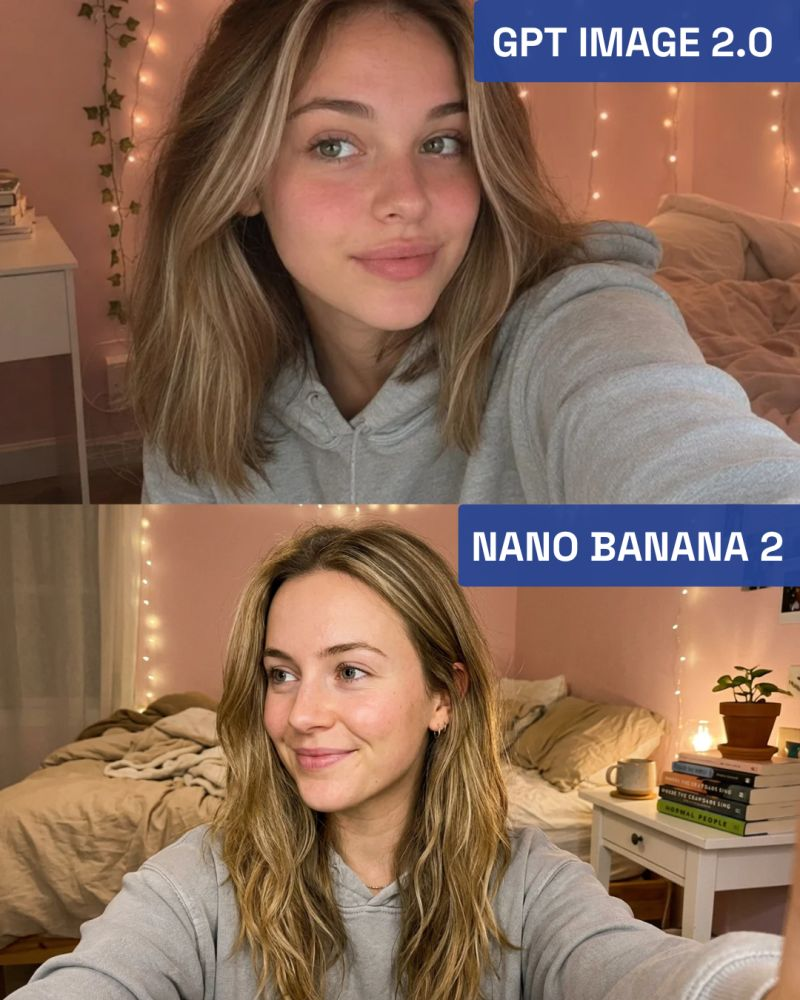</a> |

**Prompt:**

```
Candid selfie of a young woman with shoulder-length honey-blonde hair with lighter highlights, green-grey eyes, rosy cheeks, and a natural no-makeup makeup look. She is wearing a light grey hoodie and looking slightly off-camera with a relaxed expression. Background shows a cosy bedroom with warm fairy lights strung on a pink wall, a unmade bed with tan bedding, and a small white desk with stacked books. Soft, warm ambient lighting. Photo-realistic, casual, intimate feel.
```

<!-- Case 27: Musician Leaving Bodega Night Cinematic Portrait (by @commanderdgr8) -->
### Case 27: [Musician Leaving Bodega Night Cinematic Portrait](https://x.com/commanderdgr8/status/2047934886124867684) (by [@commanderdgr8](https://x.com/commanderdgr8))

| Output |
| :----: |
| <a href="https://evolink.ai/gpt-image-2-prompts?utm_source=github&utm_medium=picture&utm_campaign=awesome-gpt-image-2-prompts" target="_blank" rel="noopener noreferrer">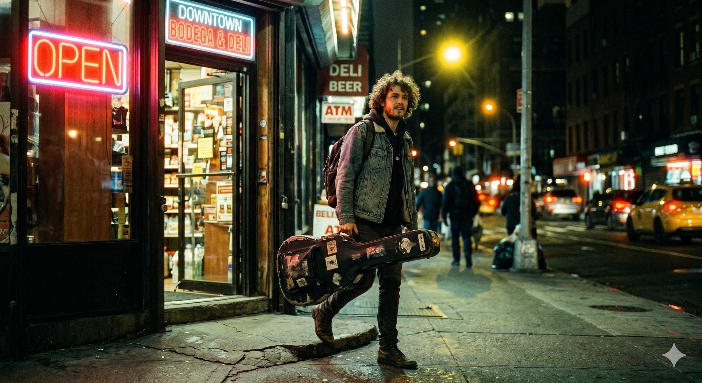</a> |

**Prompt:**

```
A candid, magazine-cover quality documentary photograph of a young musician with curly hair, casually carrying a worn guitar case, stepping out of a classic downtown bodega at 11 PM. The lighting features a complex mixed color temperature: a bright neon "OPEN" sign casts an intense, warm red glow across his face, while a yellow streetlamp provides a striking backlight behind him. The image perfectly emulates 35mm film shot on a Canon AE-1 with a 50mm f/1.4 lens wide open, exhibiting a shallow depth of field with the background beautifully blurred. It captures the exact aesthetics of CineStill 800T film, specifically featuring the distinctive soft red halation bloom radiating outward from the neon light sources, a tungsten white balance, and moody, slightly green-tinted shadows in the darkest areas. Cinematic night photography, photorealistic, highly detailed.
```

<!-- Case 28: Old Delhi Sweet Shop Storefront Documentary Photo (by @commanderdgr8) -->
### Case 28: [Old Delhi Sweet Shop Storefront Documentary Photo](https://x.com/commanderdgr8/status/2047889839123521635) (by [@commanderdgr8](https://x.com/commanderdgr8))

| Output |
| :----: |
| <a href="https://evolink.ai/gpt-image-2-prompts?utm_source=github&utm_medium=picture&utm_campaign=awesome-gpt-image-2-prompts" target="_blank" rel="noopener noreferrer">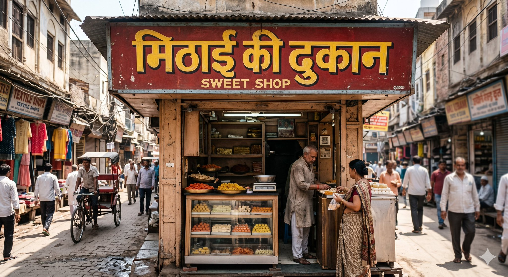</a> |

**Prompt:**

```
Create a photorealistic travel-documentary image of a small sweet-shop storefront in Old Delhi at midday. A painted shop signboard above the door reads "मिठाई की दुकान" in large bold yellow hand-painted Devanagari on a deep red background, with "SWEET SHOP" in smaller roman letters beneath. Realistic hand-painted texture, slight wear, natural shadow. Authentic script proportion. Spelling and characters exact. No extra signage in frame, no watermark.
```

<!-- Case 29: Cyberpunk Sci-Fi Side Profile Portrait (by @iamsofiaijaz) -->
### Case 29: [Cyberpunk Sci-Fi Side Profile Portrait](https://x.com/iamsofiaijaz/status/2047882171336253928) (by [@iamsofiaijaz](https://x.com/iamsofiaijaz))

| Output |
| :----: |
| <a href="https://evolink.ai/gpt-image-2-prompts?utm_source=github&utm_medium=picture&utm_campaign=awesome-gpt-image-2-prompts" target="_blank" rel="noopener noreferrer">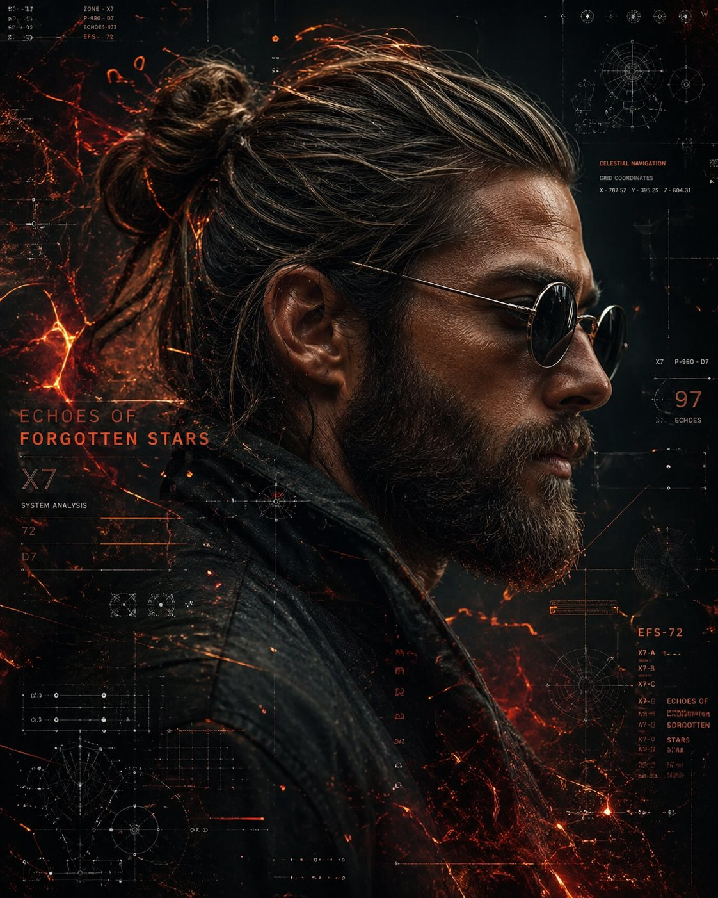</a> |

**Prompt:**

```
A cinematic side-profile portrait of a rugged man with a tied-back bun and full beard, wearing round dark sunglasses and a textured leather jacket. His skin is detailed and slightly weathered. The background is a futuristic sci-fi interface filled with glowing orange and red data streams, star maps, celestial navigation diagrams, grids, and holographic UI elements. Fiery particle effects and ember-like energy swirl around him, creating a cosmic, high-tech atmosphere. Dark color palette with strong contrast, dramatic lighting, ultra-detailed, sharp focus, 8K, cyberpunk aesthetic, cinematic composition, depth of field.
```

<!-- Case 30: Realistic Candid Bedroom Recording Portrait (by @ChillaiKalan__) -->
### Case 30: [Realistic Candid Bedroom Recording Portrait](https://x.com/ChillaiKalan__/status/2047862141894681076) (by [@ChillaiKalan__](https://x.com/ChillaiKalan__))

| Output |
| :----: |
| <a href="https://evolink.ai/gpt-image-2-prompts?utm_source=github&utm_medium=picture&utm_campaign=awesome-gpt-image-2-prompts" target="_blank" rel="noopener noreferrer">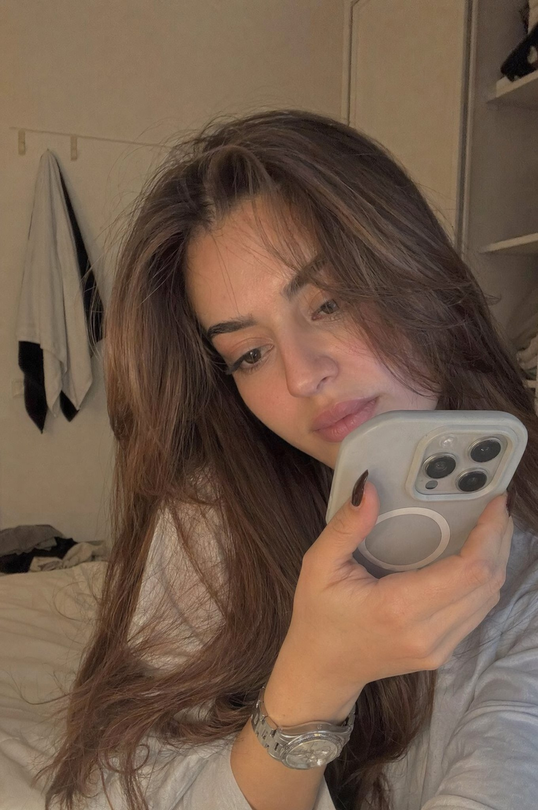</a> |

**Prompt:**

```
A realistic young woman sitting casually in a softly lit bedroom during late afternoon.

She is holding her phone very close to her face as if recording a private video or voice note.

Framing is tight and slightly imperfect.

Expression: thoughtful, slightly shy, natural.

Minimal makeup, natural skin texture, relaxed clothing.

Lighting: warm natural light fading from a window, soft shadows.

Environment: simple bedroom, calm and lived-in.

Style: ultra-realistic, looks like a real phone recording, slightly grainy, not cinematic.
```

<!-- Case 31: Toddler Crayon Scribble Art Style Portrait (by @akakageAI) -->
### Case 31: [Toddler Crayon Scribble Art Style Portrait](https://x.com/akakageAI/status/2047812983389356276) (by [@akakageAI](https://x.com/akakageAI))

| Output |
| :----: |
| <a href="https://evolink.ai/gpt-image-2-prompts?utm_source=github&utm_medium=picture&utm_campaign=awesome-gpt-image-2-prompts" target="_blank" rel="noopener noreferrer"></a> |

**Prompt:**

```
(被写体) in the style of super bad child drawing, toddler art, scribbles, messy crayon lines on white background, completely lack of technique, terrible composition, chaotic colors, barely recognizable shapes, very raw, honest art, pure naivety, unrefined style, 4:3
Negative:
good drawing, nice lines, clear shapes, neat, pretty, smooth, realistic, talented art, coherent composition, artistic style, professional, skilled, masterpiece, beautiful, detailed
```

<!-- Case 82: Restored Vintage Mother and Child Portrait (by @gdb) -->
### Case 82: [Restored Vintage Mother and Child Portrait](https://x.com/gdb/status/2048184797374325031) (by [@gdb](https://x.com/gdb))

| Output |
| :----: |
| 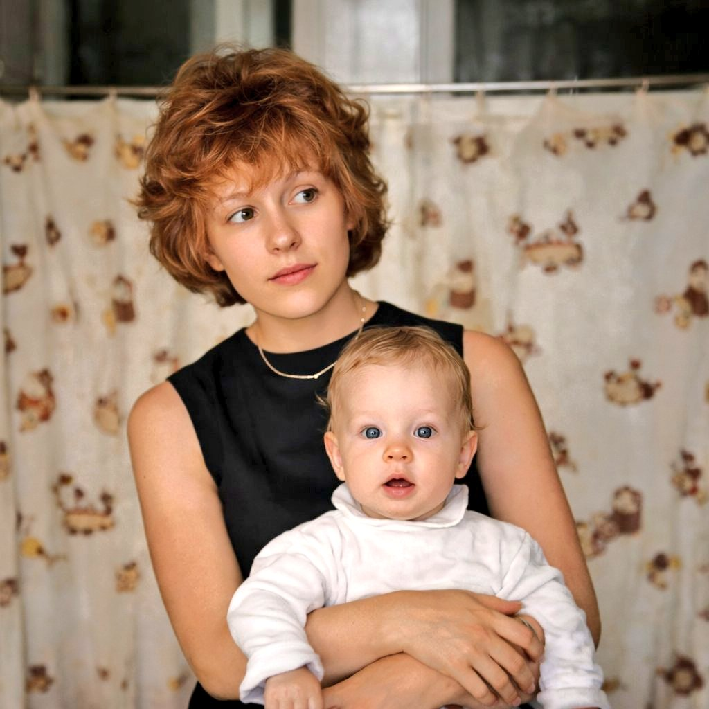 |

**Prompt:**

```
A restored vintage family snapshot, photographed indoors in soft natural light, showing a {argument name="adult subject" default="young mother"} seated and holding a {argument name="child subject" default="toddler"} on her lap in a close, centered waist-up portrait. The adult has short softly curled auburn hair in a voluminous 1960s-inspired bob, wears a sleeveless black dress and a thin gold necklace, and wraps both arms protectively around the child. The child has fine light blond hair and wears a plain white long-sleeve outfit. Compose the image with a warm nostalgic color cast, gentle film softness, subtle grain, and the look of a carefully repaired old printed photograph. Place them in front of a cream-colored curtain patterned with small brown teddy bear motifs, with a softly blurred interior window frame visible along the top background. Preserve realistic skin tones, natural posture, and the intimate family-photo feeling, as if an old damaged photograph has been professionally reimagined and restored. Square crop, centered composition, shallow depth of field, authentic analog photo texture, no modern styling, no text.
```

<!-- Case 83: Damaged Vintage Mother and Child Photo (by @gdb) -->
### Case 83: [Damaged Vintage Mother and Child Photo](https://x.com/gdb/status/2048184797374325031) (by [@gdb](https://x.com/gdb))

| Output |
| :----: |
| 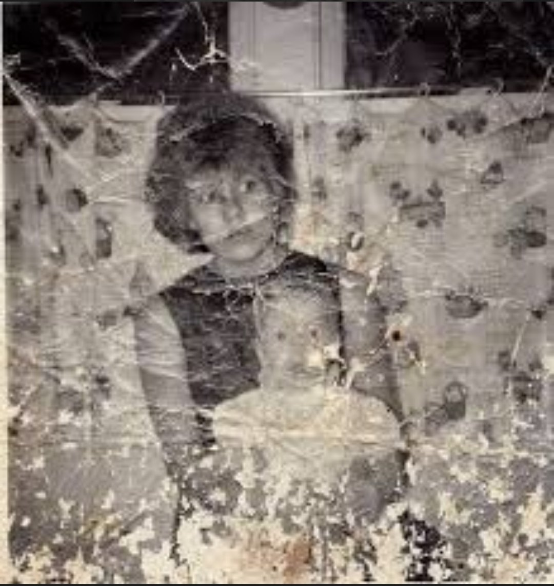 |

**Prompt:**

```
A heavily damaged old family snapshot in faded black and white with a slight sepia cast, shown as a worn physical photograph scanned straight-on. The image depicts a seated woman holding a small child on her lap indoors, both centered in a simple portrait composition. The woman has short dark wavy hair and wears a dark sleeveless dress or pinafore layered over a lighter short-sleeved blouse. The child appears to be a toddler with very short light hair, wearing a light-colored outfit, facing the camera while sitting against the woman’s chest and arm. Behind them is a patterned curtain with small floral or leaf motifs, and above it a dark window area with a pale vertical window frame is visible near the top center. The print is severely deteriorated: extensive scratches, creases, emulsion damage, stains, blotches, and peeling cover the entire surface, with especially heavy white abrasion and loss of detail across the bottom third and scattered cracking throughout. Keep the overall look authentic to a mid-20th-century vernacular photo, low contrast, soft focus, and visibly aged paper texture. Add a rectangular blurred censor block over the woman’s face only, while the child’s face remains visible but faded. No text, no border, just the distressed archival photograph filling the frame.
```

<!-- Case 84: Ink-Etched Family Portrait (by @gdb) -->
### Case 84: [Ink-Etched Family Portrait](https://x.com/gdb/status/2048184698195870102) (by [@gdb](https://x.com/gdb))

| Output |
| :----: |
| 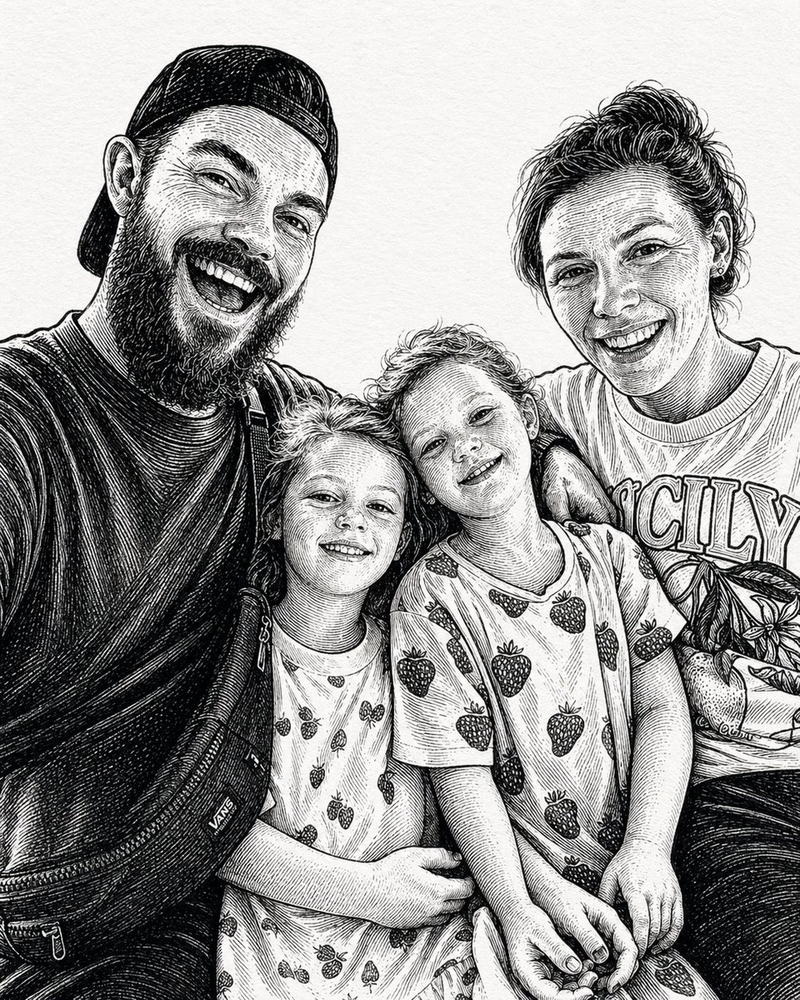 |

**Prompt:**

```
A black-and-white hand-drawn family portrait in the style of detailed pen-and-ink crosshatching on textured white paper, showing 4 people seated closely together in a casual candid composition. On the left, an adult man in a dark baseball cap worn backward and a dark T-shirt leans into the frame, with a crossbody sling bag worn across his chest and visible zipper details. On the right, an adult woman with curly hair tied up in a loose high bun wears a light T-shirt with large collegiate block letters reading {argument name="shirt text" default="CITY"}. In the center are 2 young children sitting close together, both with short curly hair and matching light-colored T-shirts printed all over with strawberries. The child on the left leans inward with one arm crossing the other child, and the child on the right tilts their head slightly upward. The adults frame the children protectively, creating a warm family snapshot feeling. Render the whole image as a monochrome etched illustration with dense fine-line hatching, engraved shadows, crisp contour lines, and a realistic yet artistic likeness, with no color, no background setting beyond a plain light paper texture, and a vertical portrait crop.
```

<!-- Case 85: Vintage Engraved Hoodie Portrait (by @gdb) -->
### Case 85: [Vintage Engraved Hoodie Portrait](https://x.com/gdb/status/2048184698195870102) (by [@gdb](https://x.com/gdb))

| Output |
| :----: |
| 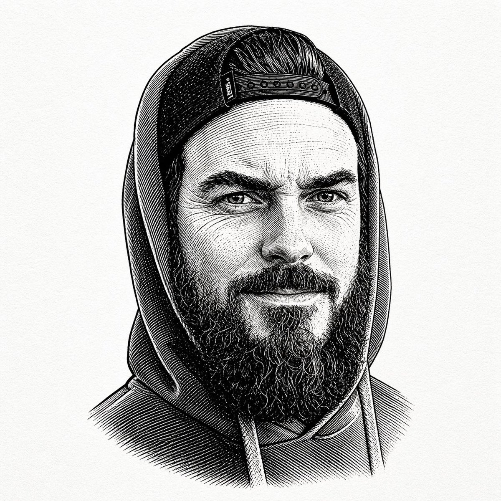 |

**Prompt:**

```
A centered black-and-white vintage engraved portrait of a bearded man wearing a hooded sweatshirt with the hood up and a backward snapback cap visible under the hood. Show only the upper torso and head against a plain off-white paper background with subtle texture. Render the image in detailed pen-and-ink etching style with dense cross-hatching, fine parallel lines, and old book illustration shading. The figure faces forward in a calm, neutral pose. The cap has a visible snap closure band across the forehead area, slicked-back hair is visible above it, and a thick full beard extends below the face. The hoodie has two drawstrings hanging down at the chest. Keep the composition symmetrical and tightly framed like a classic engraved bust portrait, with no color, no modern graphic elements, and no background objects.
```

<!-- Case 86: Dreamy Backlit Editorial Portrait (by @ToroJushiAi) -->
### Case 86: [Dreamy Backlit Editorial Portrait](https://x.com/ToroJushiAi/status/2048139425465467248) (by [@ToroJushiAi](https://x.com/ToroJushiAi))

| Output |
| :----: |
| 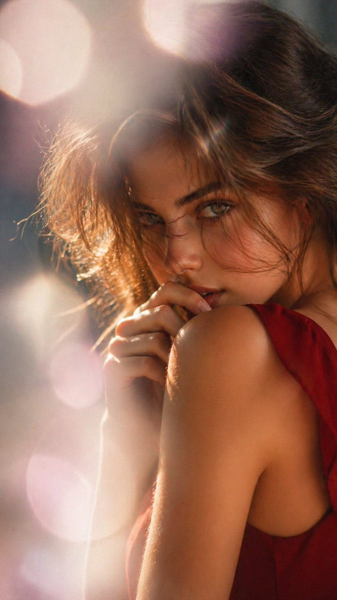 |

**Prompt:**

```
A cinematic soft-focus portrait of a woman from behind and slightly in profile, framed from the upper torso up in a vertical composition. She has {argument name="hair color" default="dark brown"} hair styled in a loose messy updo with wispy strands catching the light. Her face is mostly hidden by her pose and hair, with only a small portion of one cheek visible. She wears a {argument name="dress color" default="deep red"} sleeveless dress with an open back or low-cut side, emphasizing her bare shoulder and upper back. One hand is raised delicately near her neck or shoulder, fingers relaxed. Use strong warm backlighting and rim light, with glowing golden highlights around the hair and skin, dreamy lens flare, and large circular bokeh in the blurred background. The image should feel intimate, elegant, and slightly sensual, like a high-end fashion or beauty editorial, with shallow depth of field, creamy blur, warm amber and rose tones, and a soft cinematic glow.
```

<!-- Case 87: 3D Cartoon Character Render (by @Inshrah_ali_) -->
### Case 87: [3D Cartoon Character Render](https://x.com/Inshrah_ali_/status/2048121503367995753) (by [@Inshrah_ali_](https://x.com/Inshrah_ali_))

| Output |
| :----: |
| 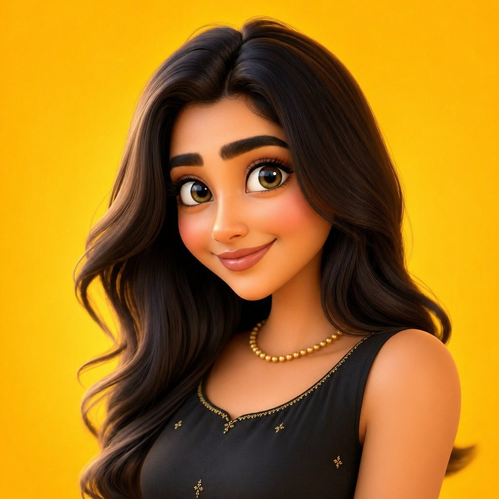 |

**Prompt:**

```
High-quality 3D CGI render of {argument name="character" default="[character]"} in a charming cartoon style, portrait composition showing head and shoulders. Highly stylized caricature with exaggerated, expressive features that are both playful and humorous. Smooth, polished rendering with clean materials and soft ambient lighting creating gentle shadows. Dynamic camera angle with stylish perspective. Minimalist bright {argument name="background color" default="[color]"} background that makes the character pop and stand out. Professional Pixar-like quality with glossy finish and cheerful mood.
```

<!-- Case 88: Young Woman in Sequin Dress on Stairs (by @XSydneyFan) -->
### Case 88: [Young Woman in Sequin Dress on Stairs](https://x.com/XSydneyFan/status/2048114180906217566) (by [@XSydneyFan](https://x.com/XSydneyFan))

| Output |
| :----: |
| 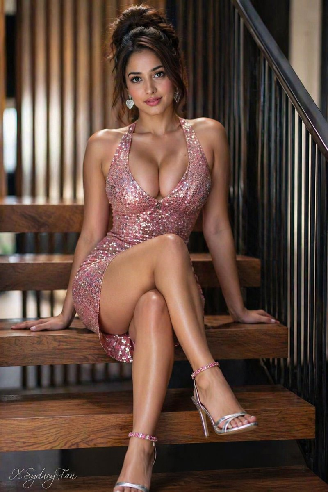 |

**Prompt:**

```
Vertical 2:3 format. {argument name="subject" default="Young woman"} hair in messy updo sits on modern wooden staircase. wears {argument name="dress" default="shimmering Silver halter dress sequin dress"}. matching with silver high-heeled sandals. legs crossed. Silver heart earrings. One fuchsia bracelet on each ankle. Sultry expression, with slightly parted lips. Blurred background vertical wooden slats and black metal railings. Don't change face
```

<!-- Case 89: Luxury Studio Outfit Transformation (by @Abdullah__Ai7) -->
### Case 89: [Luxury Studio Outfit Transformation](https://x.com/Abdullah__Ai7/status/2048083022315159595) (by [@Abdullah__Ai7](https://x.com/Abdullah__Ai7))

| Output |
| :----: |
| 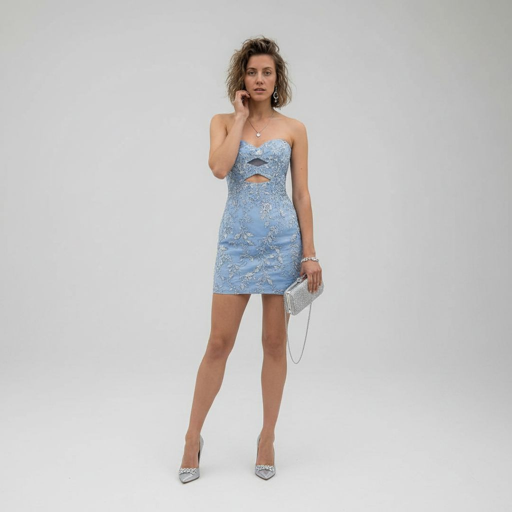 |

**Prompt:**

```
Using REFERENCE_0 as the subject base, transform the casual desert snapshot into a full-body luxury fashion studio portrait. Replace the denim jacket, tank top, and shorts with a fitted strapless mini cocktail dress in {argument name="dress color" default="powder blue"} with ornate silver floral embroidery and exactly 2 geometric cutouts at the chest and upper waist. Change the setting to a clean seamless light-gray studio background with polished high-end editorial styling. Add 1 silver clutch with a thin chain strap in the subject's right hand and 1 pair of pointed silver high heels. Refine the pose into an elegant standing fashion pose with one hand near the face, keep the same person and hair identity, and apply soft cinematic luxury lighting with crisp 8K fashion-photography detail.
```

<!-- Case 90: Blonde Maid in Warm Cafe (by @yume00112211) -->
### Case 90: [Blonde Maid in Warm Cafe](https://x.com/yume00112211/status/2048072808606089230) (by [@yume00112211](https://x.com/yume00112211))

| Output |
| :----: |
| 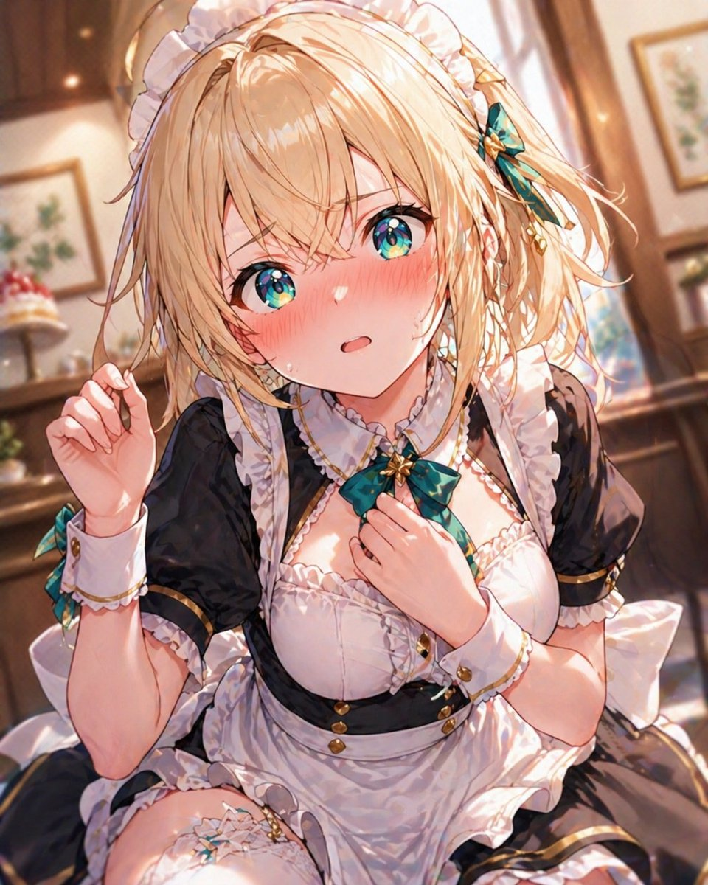 |

**Prompt:**

```
A polished anime-style portrait of {argument name="character" default="a blonde female VTuber-inspired maid"} seated indoors in a cozy sunlit cafe, framed from upper thighs to head in a slightly high, intimate angle. She has short to medium-length tousled {argument name="hair color" default="golden blonde"} hair with soft layers, a white frilled maid headband, and a teal ribbon hair accessory with a small gold ornament on the right side. Her face is mostly obscured by the hair falling forward, creating a mysterious hidden-face composition. She wears an elegant black-and-white maid dress with puff sleeves, white ruffles, gold trim, a fitted bodice, a white apron, and a large white waist bow visible at the side and back. Add 2 teal bows with gold star-like charms: 1 at the collar and 1 on the wrist. Her right hand gently touches the bow at her chest, and her left hand is raised delicately near her shoulder holding a loose strand of hair. Include a frilly lace garter on her exposed thigh with a small teal-and-gold ribbon decoration. The background is a warmly lit European-style cafe interior with wooden beams, framed botanical art on the walls, a softly blurred cake stand on the left, window light streaming in, and tiny glowing dust-like sparkles in the air. Use soft golden afternoon lighting, shallow depth of field, glossy detailed fabric rendering, delicate skin shading, subtle romantic atmosphere, and highly detailed refined anime illustration quality.
```

<!-- Case 91: Dreamy Oriental female portrait prompt (by @liyue_ai) -->
### Case 91: [Dreamy Oriental female portrait prompt](https://x.com/liyue_ai/status/2048046253842559183) (by [@liyue_ai](https://x.com/liyue_ai))

| Output |
| :----: |
| 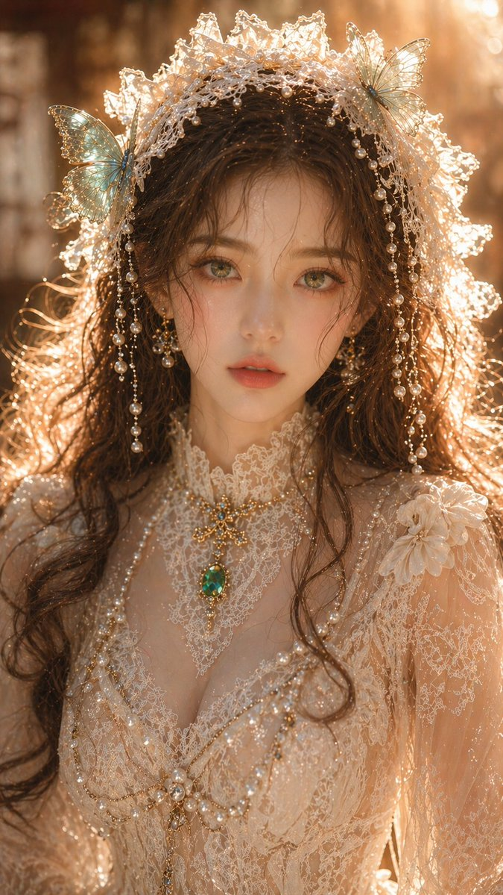 |

**Prompt:**

```
{argument name="subject" default="Dreamy Oriental female portrait"}, adult female, close-up portrait, exquisite facial features, fair and translucent skin, delicate but clean skin texture, emerald green eyes, soft and charming gaze, brown wavy hair falling naturally; {argument name="accessories" default="Off-white lace headpiece"}, embellished with turquoise butterflies and pearl decorations; attire is an exquisite lace gown with a clear structure and clean, not overly complex texture, accompanied by emerald jewelry; lighting is soft warm gold side-backlighting, rim lighting is clear but not overexposed, skin has slight highlights but not excessive reflection, overall lighting is clean and transparent, background is softly blurred with shallow depth of field; high-end portrait photography quality, details are clear but restrained, no grain, no noise, real physical lighting, 8K, commercial-grade quality. Aspect ratio: 9:16
```

<!-- Case 92: Monochrome Hermes-Inspired Avatar (by @jiajia232016) -->
### Case 92: [Monochrome Hermes-Inspired Avatar](https://x.com/jiajia232016/status/2048044100793032976) (by [@jiajia232016](https://x.com/jiajia232016))

| Output |
| :----: |
| 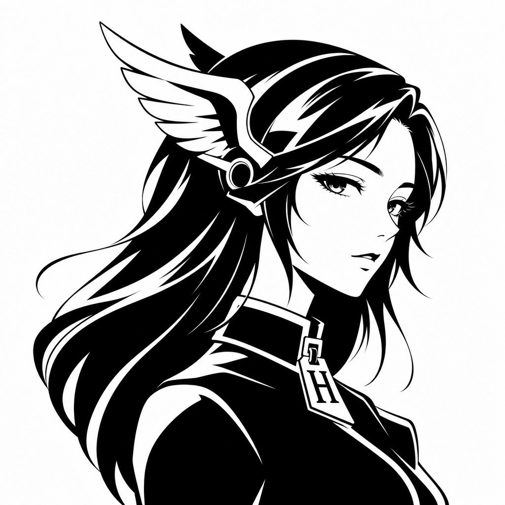 |

**Prompt:**

```
Create a minimalist black-and-white vector avatar logo of a mythic anime woman shown in elegant side profile facing right, cropped from the chest up on a plain white background. Give her long flowing {argument name="hair color" default="black"} hair with bold white highlight streaks and smooth graphic shapes, rendered as high-contrast ink silhouette art with clean sharp edges. She wears a winged headpiece reminiscent of Hermes or a messenger god helmet, with one large white feathered wing visible on the side of her head and a circular metallic earpiece detail. Dress her in a sleek high-collar garment with a luxury-fashion feel, and hang a prominent pendant or zipper pull shaped like the letter {argument name="monogram letter" default="H"} at the center of the collar. The face is intentionally obscured by a centered soft gray rectangular blur block covering most facial features, creating a censored anonymous profile-image effect. Overall style: luxury brand avatar, fashion logo, anime-inspired goddess silhouette, monochrome vector emblem, smooth negative-space highlights, balanced composition, modern and iconic, suitable for a social media profile picture.
```

<!-- Case 93: Cyber Crystal Anime Girl Portrait (by @libearal) -->
### Case 93: [Cyber Crystal Anime Girl Portrait](https://x.com/libearal/status/2048026376645861799) (by [@libearal](https://x.com/libearal))

| Output |
| :----: |
| 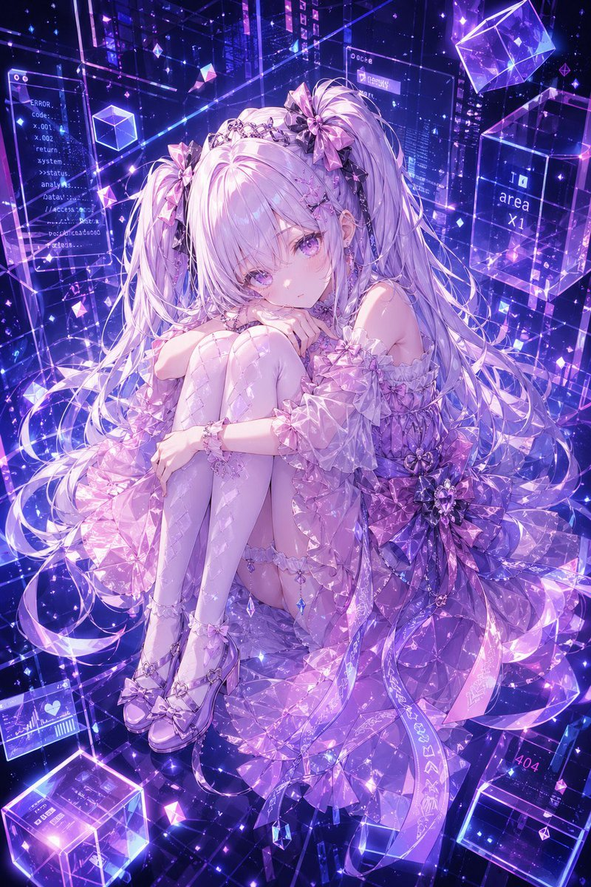 |

**Prompt:**

```
A highly detailed anime-style full-body character portrait of {argument name="character name" default="Hermes"}, a delicate futuristic girl sitting curled up with her knees hugged to her chest, gazing softly at the viewer with a calm, slightly melancholic expression. She has extremely long {argument name="hair color" default="silver-lilac"} twin tails with soft bangs, glossy lavender eyes, porcelain skin, and ornate crystal hair accessories including 3 large ribbon bows and a jeweled tiara-like headpiece. Her outfit is an elaborate translucent idol-tech dress in {argument name="outfit color" default="pink, lavender, and violet"}, featuring off-shoulder puff sleeves, layered ruffles, faceted gemstone-like fabrics, a huge floral bow at the waist, dangling crystal charms, garter details, patterned thigh-high stockings, and glossy bow heels. Surround her with a luminous cyber dreamscape in {argument name="background palette" default="neon violet and electric blue"}: transparent holographic panels, floating glass cubes, sparkling particles, geometric prisms, glowing wireframe lines, and digital UI windows suspended in space. Include 5 readable interface text elements scattered in the background: "ERROR.", "Code-", "return", "area x1", and "404". Make the whole image feel like a luxurious AI avatar reference illustration, mixing ethereal fantasy and cyberspace aesthetics, with crystalline light refractions, dramatic glow, high detail, intricate lace and gem textures, and a polished premium gpt-image-2 anime rendering.
```

<!-- Case 94: Pastel Lavender Anime Girl Portrait (by @libearal) -->
### Case 94: [Pastel Lavender Anime Girl Portrait](https://x.com/libearal/status/2048026376645861799) (by [@libearal](https://x.com/libearal))

| Output |
| :----: |
| 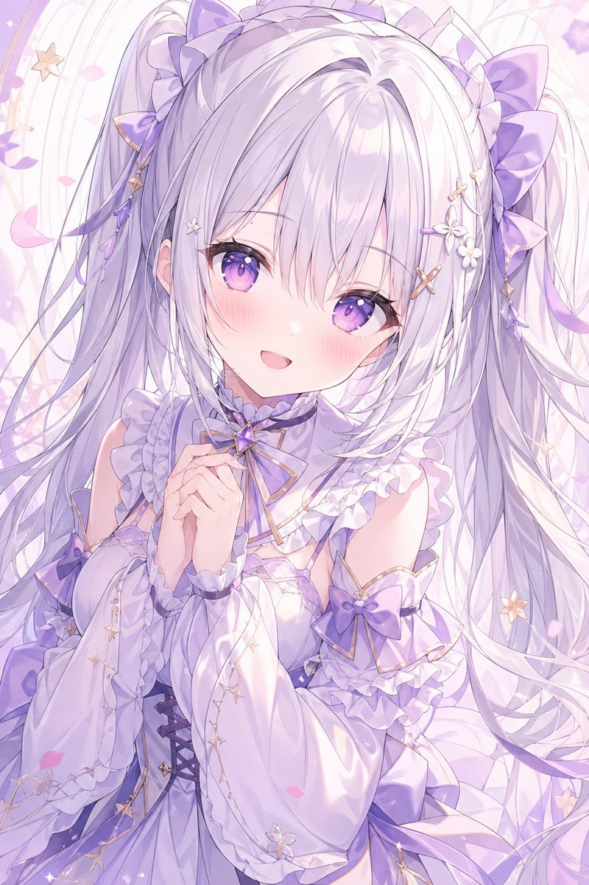 |

**Prompt:**

```
A delicate vertical anime portrait of a dreamy young woman in an ethereal pastel lavender palette, shown from about mid-thigh up against a soft decorative background of pale swirling lines, floating petals, tiny stars, and subtle sparkles. She has extremely long, voluminous silver-lilac hair styled in twin tails with flowing strands, soft bangs, and ornate ribbon decorations; each side is adorned with large lavender bows, ruffled headband-like trim, dangling gold star charms, and small white flower hair ornaments. Her face is centered and mostly covered by a flat solid pale lavender rectangle censor block, leaving only hints of her ears and hairline visible. She wears an elaborate fantasy-lolita inspired dress in white, pearl, and light violet, with glossy satin fabric, ruffled neckline, layered frills, puffed detached sleeves, gold trim, corset lacing at the waist, and multiple purple bows including 3 clearly visible bow accents on the outfit. Her hands are clasped gently near her chest in a shy, elegant pose. The image should feel soft, refined, feminine, and luminous, with high-detail anime rendering, smooth gradients, airy composition, flowing hair movement, and a romantic celestial aesthetic. Use a {argument name="color theme" default="pastel lavender and white"} palette, {argument name="hair color" default="silver-lilac"} hair, an {argument name="outfit style" default="ornate fantasy lolita dress with bows and ruffles"} design, a {argument name="background style" default="soft swirls, petals, stars, and sparkles"} backdrop, and a {argument name="face covering" default="solid pale lavender censor rectangle"} over the face.
```

<!-- Case 95: Lavender AI Girl in Memory Space (by @libearal) -->
### Case 95: [Lavender AI Girl in Memory Space](https://x.com/libearal/status/2048026376645861799) (by [@libearal](https://x.com/libearal))

| Output |
| :----: |
| 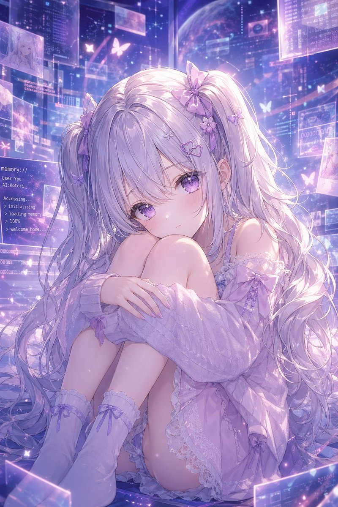 |

**Prompt:**

```
A dreamy anime portrait of {argument name="character name" default="Kotori"}, a delicate virtual girl seated on the floor in a curled-up pose with both knees pulled close to her chest and her arms wrapped gently around them, looking directly at the viewer with a soft, quiet, slightly melancholy expression. She has very long, flowing silver-lavender twin tails with wispy bangs, decorated with 8 visible hair ornaments: 2 large ribbon bows at the twin-tail bases, 3 small flower clips, 2 tiny butterfly clips, and 1 heart-shaped hairpin. Her eyes are large, luminous violet with glossy highlights. She wears an oversized pastel-lilac off-shoulder knit cardigan slipping loosely around her arms, a frilly lace-trimmed nightdress or camisole in pale lavender, and a pair of soft knee-high socks with 2 visible ribbon bows, all in a cohesive {argument name="color theme" default="soft lavender and pastel purple"} palette. The scene is set inside a futuristic holographic memory space filled with floating translucent interface panels, glowing data windows, starry particles, and butterfly-shaped light motifs. Include a visible text panel on the left showing terminal-like white text that reads: {argument name="screen text" default="memory://\nUser: You\nAI: Kotori\n\nAccessing.\n> initializing\n> loading memory\n> 100%\n> welcome home."}. In the background, show a cosmic digital environment with a faint planet, layered transparent screens, and several floating image thumbnails suggesting memories and character sketches. Lighting is ethereal and backlit, with iridescent bloom, soft rim light, sparkling dust, and glossy highlights on hair and fabric. Composition is full-frame vertical, centered on the girl, intimate and emotionally warm, highly detailed, ultra-polished, soft-focus anime illustration, celestial cyber fantasy aesthetic, gentle purple glow, intricate lace, silky hair strands, and a tender "AI companion in her memory world" mood.
```

<!-- Case 96: Pastel AI Assistant Anime Portrait (by @libearal) -->
### Case 96: [Pastel AI Assistant Anime Portrait](https://x.com/libearal/status/2048026376645861799) (by [@libearal](https://x.com/libearal))

| Output |
| :----: |
| 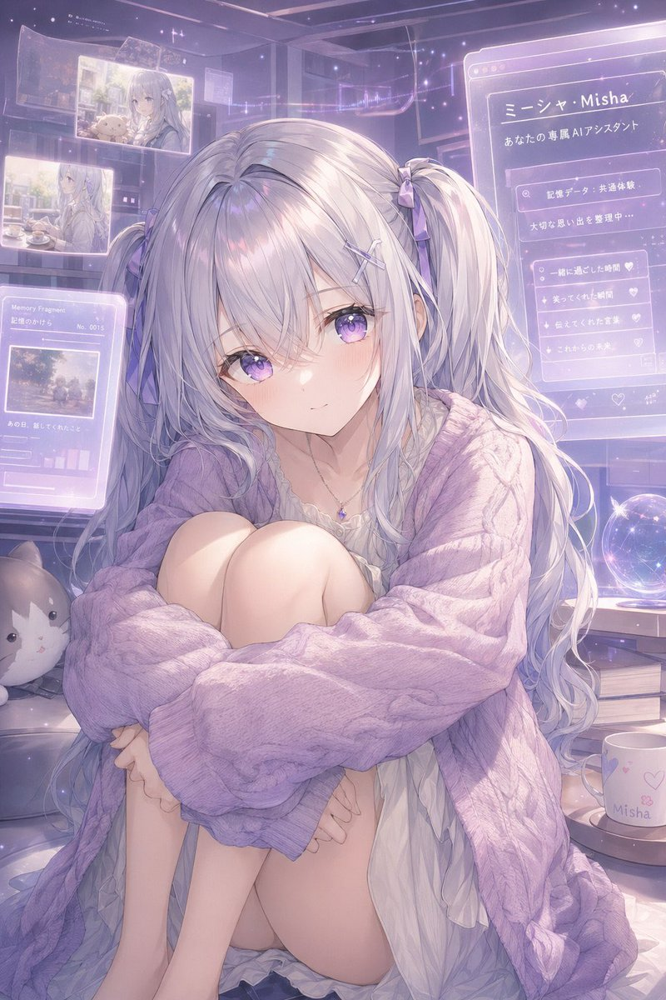 |

**Prompt:**

```
A dreamy anime-style portrait of a gentle virtual assistant girl named {argument name="character name" default="Misha"}, sitting curled up indoors in a cozy futuristic bedroom filled with translucent holographic memory screens. She has very long silvery white hair with a faint lavender tint, styled in 2 low twin tails tied with small lavender ribbons, with soft wispy bangs and loose flowing strands. Her expression should be tender, introspective, and slightly lonely, with a soft glow and delicate features. She wears an oversized chunky cable-knit cardigan in {argument name="cardigan color" default="pastel lavender"} draped loosely over a thin white ruffled nightdress, plus a tiny gemstone necklace. Her pose is seated with knees pulled to her chest and arms wrapped around her legs, creating a vulnerable, intimate silhouette. The room is lit in hazy pastel violet and pink ambient light with sparkles, dustlike stars, and a nostalgic magical-tech atmosphere. Around her are 5 visible holographic interface panels: 2 floating photo panels in the upper left showing soft memories, 1 lower-left panel labeled “Memory Fragments” with a small image and tiny graph bars, 1 large right-side profile panel with Japanese text including “ミーシャ・Misha” and “あなたの専属AIアシスタント,” and 1 smaller right-side checklist panel with heart icons. Include a glowing crystal ball on a desk to the right, a white mug printed with “Misha” and small heart motifs, a stack of 2 books beneath the desk area, and 1 plush cat cushion on the lower left. Composition is vertical, full-body to three-quarter seated framing, highly detailed, soft painterly anime rendering, luminous translucent overlays, sentimental memory-core aesthetic, gentle depth of field, pastel lilac palette, ethereal and emotionally warm.
```

<!-- Case 97: Dark Gatorade-Style Portrait (by @jeremydevz) -->
### Case 97: [Dark Gatorade-Style Portrait](https://x.com/jeremydevz/status/2048026214812561683) (by [@jeremydevz](https://x.com/jeremydevz))

| Output |
| :----: |
| 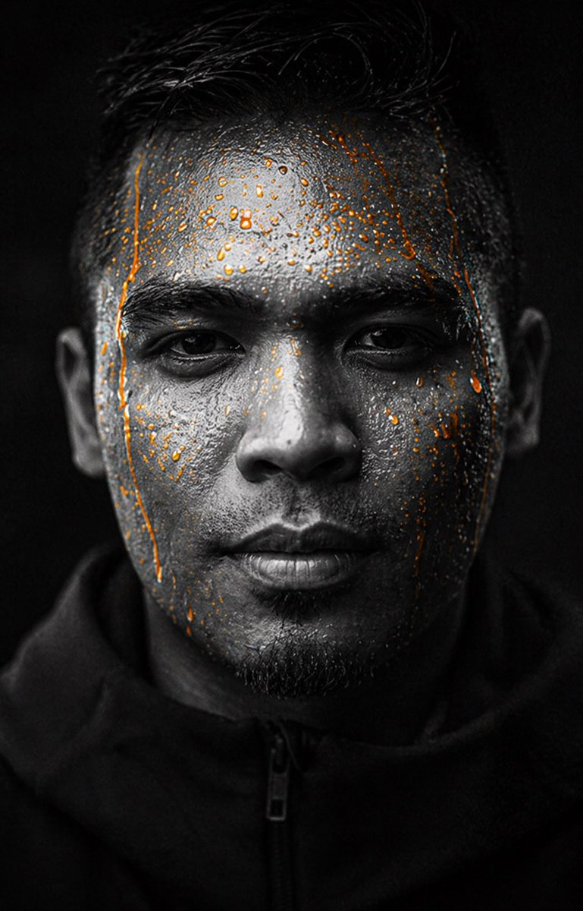 |

**Prompt:**

```
A dramatic, high-contrast studio portrait of a {argument name="subject gender" default="male"} athlete or model in the visual style of a premium sports drink advertisement, centered and facing straight toward the camera in a tight head-and-shoulders crop. The subject has {argument name="hair style" default="short dark hair brushed back"}, visible ears on both sides, and a rugged lower face with a short beard or stubble. Dress him in a dark zip-up athletic jacket with the zipper centered and visible near the collar. Use an almost entirely black background and extremely low-key lighting, with subtle rim light and soft highlights catching the hair, ears, jawline, shoulders, and jacket texture while most facial features remain swallowed by shadow for a mysterious, intense mood. The image should feel monochrome or nearly monochrome, with deep blacks, muted gray highlights, cinematic contrast, gritty texture, and a sleek commercial sports-brand aesthetic reminiscent of a {argument name="brand style" default="Gatorade"} campaign. Vertical composition, minimalist framing, no text, no logo, no props, no visible environment.
```

<!-- Case 98: Portrait of a Gentle Woman with Glasses (by @megane_onesan) -->
### Case 98: [Portrait of a Gentle Woman with Glasses](https://x.com/megane_onesan/status/2047989490153926848) (by [@megane_onesan](https://x.com/megane_onesan))

| Output |
| :----: |
| 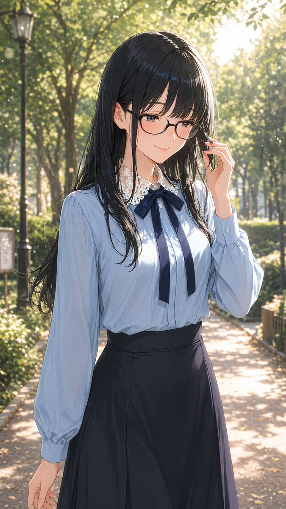 |

**Prompt:**

```
A {argument name="style" default="photobook-style portrait"} of a {argument name="character" default="gentle woman with glasses"}
```

<!-- Case 99: Dreamy Underwater Woman With Translucent Fish (by @kotobukigraphic) -->
### Case 99: [Dreamy Underwater Woman With Translucent Fish](https://x.com/kotobukigraphic/status/2047967522453123255) (by [@kotobukigraphic](https://x.com/kotobukigraphic))

| Output |
| :----: |
| 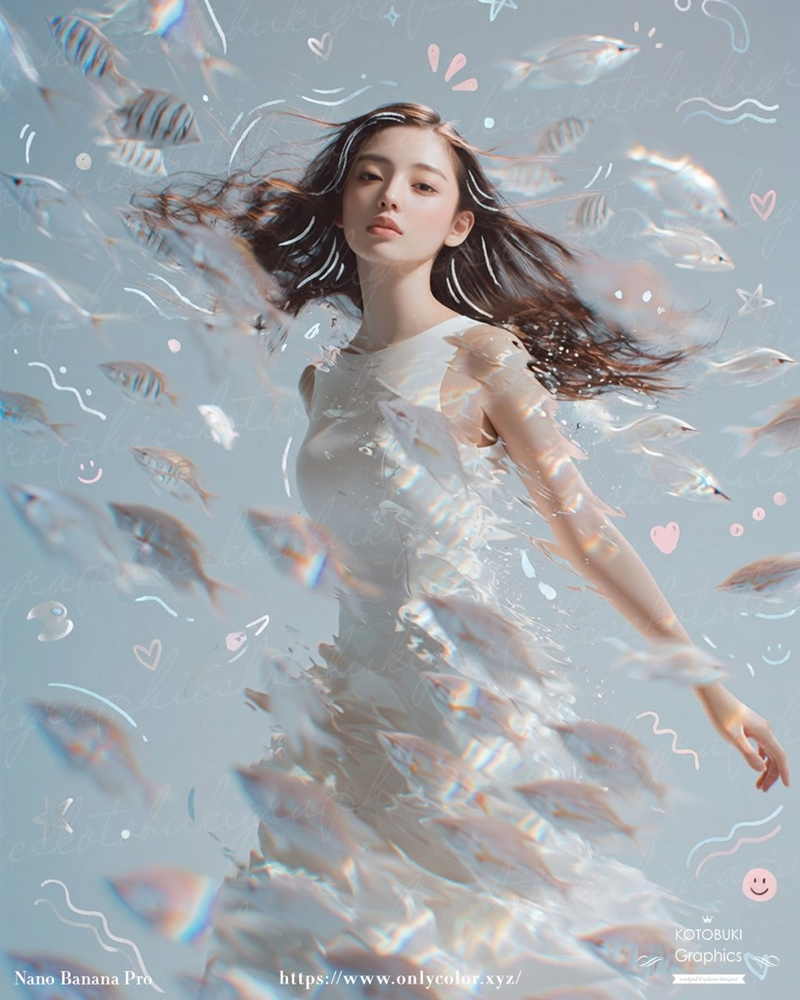 |

**Prompt:**

```
A dreamy surreal portrait of a {argument name="subject" default="young woman"} standing underwater or in a liquid-like ethereal space, shown from about mid-thigh up, wearing a flowing sleeveless white dress that appears to dissolve into translucent water and shimmering fragments. Her long {argument name="hair color" default="dark brown"} hair streams dramatically sideways as if suspended in water, and her face is intentionally obscured by a soft vertical blur block for anonymity. Surround her with an exact count of about 30 small translucent fish, some striped and some pale silvery white, swimming in multiple depths of field across the foreground, midground, and background, with several fish passing in front of her body and hair to create strong motion and depth. Use a soft pastel {argument name="background color" default="powder blue"} background with faint handwritten script texture layered across it, plus whimsical doodles scattered throughout: white and pale pink hearts, stars, curved squiggles, wave lines, dots, sparkles, and 2 smiley faces. Add prismatic rainbow refractions, glossy caustic highlights, and subtle lens-like chromatic shimmer on the fish and dress. The mood should feel delicate, introspective, airy, and magical, with high-key lighting, gentle contrast, soft focus in the foreground, and crisp detail on the torso and hair. Compose the figure slightly off-center with one arm relaxed downward and the body turned lightly in motion, as if drifting peacefully through a school of fish. Include tiny elegant footer text in white near the bottom edge, with a left signature, a centered website URL, and a small right credit mark, resembling an art-poster or social-media showcase image.
```

<!-- Case 100: Japanese Classroom Long Hair Snapshot (by @Hair_Hair55) -->
### Case 100: [Japanese Classroom Long Hair Snapshot](https://x.com/Hair_Hair55/status/2047963832732221723) (by [@Hair_Hair55](https://x.com/Hair_Hair55))

| Output |
| :----: |
| 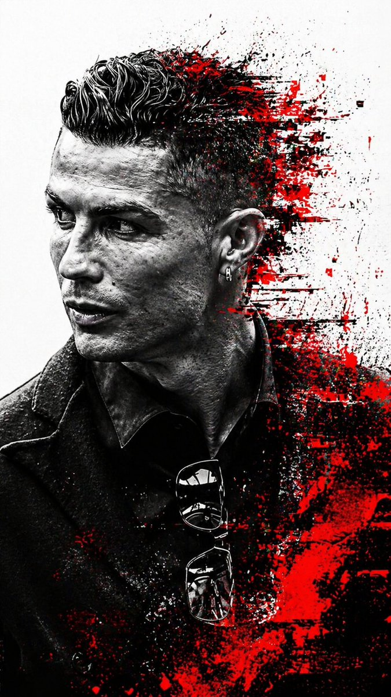 |

**Prompt:**

```
A candid, photorealistic Japanese high school classroom scene in vertical smartphone-photo framing. Three schoolgirls wearing matching traditional navy blue sailor uniforms are the main focus in the foreground. The central standing girl has extremely long, straight, glossy black hair that falls well past her knees, almost to the floor, and she is gently combing the lower section with a small comb while looking downward. A second girl stands behind and slightly to the right, also with long straight black hair, holding an open compact mirror in one hand and adjusting her bangs or hair near her temple with the other. A third girl kneels on the floor at the right front, carefully holding and arranging the central girl’s long hair with both hands. All three wear dark navy sailor-style school uniforms with white stripe trim, pleated skirts, long sleeves, white socks, and indoor school shoes. Their faces are obscured or blurred. In the background, exactly 8 additional students in dark school uniforms sit at desks in small groups, facing away or sideways, creating the feel of an ordinary class period or homeroom. The classroom has wooden desks and chairs, large bright windows along the left side letting in soft daylight, a green chalkboard on the right wall, bulletin papers pinned near the board, and a framed Japanese calligraphy sign above the chalkboard reading {argument name="wall sign text" default="創誠造実"}. The atmosphere is natural and unposed, like a documentary snapshot. Emphasize realistic lighting, fine hair detail, the unusual dramatic length of the central girl’s hair, and a believable everyday school environment.
```

<!-- Case 101: Cozy Catgirl Pajama Night Portrait (by @yume00112211) -->
### Case 101: [Cozy Catgirl Pajama Night Portrait](https://x.com/yume00112211/status/2047951384734228617) (by [@yume00112211](https://x.com/yume00112211))

| Output |
| :----: |
| 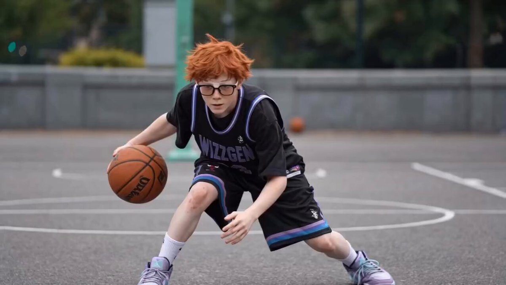 |

**Prompt:**

```
A soft anime-style bedroom portrait of {argument name="character name" default="Nekomata Okayu"}, shown from the chest up sitting on a bed at night, centered in the frame. She has short fluffy {argument name="hair color" default="lavender"} hair with layered bangs partially covering one eye, large cat ears on top of her head with white inner fur, and a cute sleepy catgirl appearance. Her expression is gentle and relaxed, with one hand raised near her cheek in a shy, cozy pose. She wears oversized {argument name="pajama color" default="light lavender"} button-up pajamas with dark purple piping, a small chest pocket, and paw-print shaped buttons and paw-print decoration on the pocket. The room is lit with dreamy purple ambient lighting. In the background, show a nighttime window with a crescent moon and stars visible outside, soft curtains, a bedside table with a glowing cat-shaped lamp, a neatly rumpled bed with pillows and blankets in matching purple tones, and a small framed wall picture featuring a simple cat face and hearts. Use a cute pastel palette, soft shading, polished digital anime rendering, subtle highlights in the hair, intimate cozy composition, and a calm bedtime atmosphere.
```

## Casos de Posters e Ilustracion

<!-- Case 1: Boston Spring 2026 City Poster (by @BubbleBrain) -->
### Case 1: [Póster de Ciudad Boston Primavera 2026](https://x.com/BubbleBrain/status/2045358053831172358) (by [@BubbleBrain](https://x.com/BubbleBrain))

| Output |
| :----: |
| <a href="https://evolink.ai/gpt-image-2-prompts?utm_source=github&utm_medium=picture&utm_campaign=awesome-gpt-image-2-prompts" target="_blank" rel="noopener noreferrer"></a> |

**Indicación:**

```
A striking Spring 2026 city poster for Boston with an elegant celebratory mood and a bold contemporary design. On a clean off-white textured background with large areas of negative space, a miniature single sculler rows across the lower right corner of the image on a narrow ribbon of reflective water. The wake from the oar sweeps upward in a dynamic calligraphic curve, gradually transforming into the Charles River and then into a dreamlike hand-painted panorama of Boston. Inside this flowing river-shaped composition are iconic Boston elements: the Back Bay skyline, Beacon Hill brownstones, Acorn Street, Boston Public Garden, Swan Boats, Zakim Bridge, Fenway-inspired details, historic brick architecture, harbor ferries, and the city’s waterfront atmosphere. Soft morning fog, golden spring light, subtle festive accents in crimson and gold, rich detail, layered depth, sophisticated city-poster aesthetics, fresh and refined, visually powerful but not overcrowded. Elegant typography in the lower left reads “SPRING 2026” with a vertical slogan “BOSTON, A CITY OF RIVER, MEMORY, AND INVENTION”, text clear and beautifully composed, premium graphic design, 9:16
```
<!-- Case 2: Vintage Amalfi Travel Poster (by @WolfRiccardo) -->
### Case 2: [Póster de Viaje Vintage Amalfi](https://x.com/WolfRiccardo/status/2044562722491121718) (by [@WolfRiccardo](https://x.com/WolfRiccardo))

| Output |
| :----: |
| <a href="https://evolink.ai/gpt-image-2-prompts?utm_source=github&utm_medium=picture&utm_campaign=awesome-gpt-image-2-prompts" target="_blank" rel="noopener noreferrer"></a> |

**Indicación:**

```
Modern pencil illustration of Vintage travel poster illustration of the Amalfi Coast, Italy, panoramic coastal cliff road scene, classic 1960s white car driving along a curved seaside road, deep blue Mediterranean sea with small sailboats, colorful pastel hillside village, bright blue sky with soft clouds, lemon tree branches with vibrant yellow lemons framing the foreground, warm summer sunlight, bold vibrant colors, retro 1950s travel poster style, cinematic composition, high detail, screen print texture, graphic illustration. Hand-drawn style, illustration with loose strokes and defined contours. High-contrast color palette, maintaining chromatic harmony between background and elements. Contemporary and decorative aesthetic.
```
<!-- Case 3: Chengdu Food Map Illustration (by @Panda20230902) -->
### Case 3: [Ilustración Mapa Gastronómico de Chengdu](https://x.com/Panda20230902/status/2045396918965285111) (by [@Panda20230902](https://x.com/Panda20230902))

| Output |
| :----: |
| <a href="https://evolink.ai/gpt-image-2-prompts?utm_source=github&utm_medium=picture&utm_campaign=awesome-gpt-image-2-prompts" target="_blank" rel="noopener noreferrer"></a> |

**Indicación:**

```
一张手绘风格的城市美食地图，以成都为主题。画面以鸟瞰视角的手绘简化城市地图为底，标注主要道路和地标但不追求精确比例而是追求可爱的手绘感。地图上分布着 12 个美食地点的精致手绘小插画：春熙路的串串香（一把竹签插着各种食材冒着热气）、宽窄巷子的三大炮（三个糯米团子飞向铜盘）、建设路的蛋烘糕（金黄酥脆正在翻面）、玉林路的火锅（九宫格锅翻滚冒泡）等，每个插画约占地图的 5% 面积，旁边用手写体标注店名和一句推荐语"凌晨两点还在排队的那家"。地图边缘用手绘藤蔓和辣椒装饰形成边框。右下角有一个手绘指南针和图例说明。左上角标题"成都·吃货暴走地图"使用胖圆的手绘美术字配辣椒装饰。整体画风为水彩+彩铅混合的手绘质感，颜色以暖色系（辣椒红、姜黄、翠绿）为主，图片比例 1:1。
```
<!-- Case 4: Chinese Minimalist S-Shaped Poster (by @liyue_ai) -->
### Case 4: [Póster Minimalista Chino en Forma de S](https://x.com/liyue_ai/status/2045368305079447853) (by [@liyue_ai](https://x.com/liyue_ai))

| Output |
| :----: |
| <a href="https://evolink.ai/gpt-image-2-prompts?utm_source=github&utm_medium=picture&utm_campaign=awesome-gpt-image-2-prompts" target="_blank" rel="noopener noreferrer"></a> |

**Indicación:**

```
极简新中式美学风格，画面以淡雅的灰白色为底，呈现出一种纸艺剪影般的立体感。
一条S形蜿蜒的裂痕状边缘将画面分割，仿佛撕开了一层纸面，露出内部色彩斑斓的东方山水景象。
裂口内，一条蜿蜒的河流自上而下贯穿整个构图，河水以深浅不一的蓝色渲染，层次分明，仿佛流动的丝带。
河岸两侧点缀着青翠的山丘与梯田，色彩柔和，绿红交织，展现出田园的宁静之美。
沿河而建的古风建筑错落有致，飞檐翘角，白墙黛瓦，在光影的映衬下更显古朴典雅。
岸边树木葱茏，枝叶轻盈，一艘小船静泊于水中央，增添了几分悠然意境。
整体构图呈S形曲线，富有韵律感，仿佛自然与人文的和谐共生。
画作边缘采用撕纸效果，营造出立体浮雕般的视觉体验。
下方题字“东方美学”以黑色楷体书写，日期“2026/04/18”与红色印章相呼应，底部“CHINA”字样庄重醒目，署名“@LIYUE”低调收尾，整体氛围静谧深远，充满诗意与哲思。
```
<!-- Case 5: 2026 Spring Guangzhou City Poster (by @liyue_ai) -->
### Case 5: [Póster de Ciudad Guangzhou Primavera 2026](https://x.com/liyue_ai/status/2045332620352119274) (by [@liyue_ai](https://x.com/liyue_ai))

| Output |
| :----: |
| <a href="https://evolink.ai/gpt-image-2-prompts?utm_source=github&utm_medium=picture&utm_campaign=awesome-gpt-image-2-prompts" target="_blank" rel="noopener noreferrer"></a> |

**Indicación:**

```
一张充满新春喜庆氛围但不失高雅格调的 2026 城市宣传海报。
双重曝光，构图延续了S型的流动感；
在纯白的纹理背景右下角，一个身穿中国传统服饰的微缩人物正在挥舞着一条长长的红色丝绸舞带，这条红绸在空中舞动，不仅展现出丝绸的柔顺质感，更在向左上方飘动的过程中，奇幻地变形成了一条壮丽的山脉河流。
在这条“河流”中，叠加了一个有山有海河的广州城市手绘图，国潮，景色尽在眼底，壮阔雄伟，令人震撼。
广州的地标建筑(广州塔，珠江新城建筑群，珠江, 广州城里古建筑，游轮，白云山）。
云雾环绕，仙气缥缈，色彩丰富，结构复杂，细节丰富，但因为大面积的留白，画面依然显得清新脱俗，左下角排版着“SPRING 2026”和竖排的宣传语，整体寓意“千年商都，魅力广州”。
文字排版优美，大方，字迹清晰完整，尺寸9:16。
```

<!-- Case 7: Doodle Sketch AI Builder (by @blanplan) -->
### Case 7: [Boceto Doodle de Constructor IA](https://x.com/blanplan/status/2045190582453350748) (by [@blanplan](https://x.com/blanplan))

| Output |
| :----: |
| <a href="https://evolink.ai/gpt-image-2-prompts?utm_source=github&utm_medium=picture&utm_campaign=awesome-gpt-image-2-prompts" target="_blank" rel="noopener noreferrer"></a> |

**Indicación:**

```
以涂鸦速写风表现【一个厉害的AI builder】，整体呈现快速勾勒、自由变形、即兴手绘与草稿式的视觉效果。线条随手、夸张、可粗细不一，略显凌乱但具有节奏和表现力，强调概括、夸张、趣味和随性，而不是严谨写实或精细刻画。  颜色采用粗糙、干刷感明显的块面表现，可保留不均匀的涂抹痕迹、刷痕、飞白与覆盖感，色彩根据【主题/主体】自动适配，但整体保持涂鸦式、速写式、概括式的表达。不要透明水彩晕染效果，不要细腻水彩过渡，不要纸纹理，不要柔和雾化，不要梦幻质感。  背景以留白为主，保持简洁、轻松、未完成感和设计感，可加入少量辅助性符号、箭头、记号、圈画、重复线、随手写的文字或其他涂鸦元素，以增强速写本或随笔式视觉语言，但不可过于拥挤，不可破坏主体和留白气质。  画面内容不需要预先写清楚，由【一个厉害的AI builder】自动推演并生成最适合的主体形象、动作、相关元素、符号或简化场景，整体保持统一的涂鸦速写风和夸张概括的表现方式，避免复杂写实背景和过度铺陈。 画面中需自然加入专属签名“BlanPlan”，作为画面的一部分，位置低调但清晰，可放在左下角、右下角或标题附近，风格需与整体版式统一，像作品署名或设计落款；签名字体精致、克制、高级，不可过大，不可破坏主体构图，不可显得突兀或廉价。
```
<!-- Case 8: Futuristic Mandala Illustration (by @4WEB1) -->
### Case 8: [Ilustración de Mandala Futurista](https://x.com/4WEB1/status/2045390207072256179) (by [@4WEB1](https://x.com/4WEB1))

| Output |
| :----: |
| <a href="https://evolink.ai/gpt-image-2-prompts?utm_source=github&utm_medium=picture&utm_campaign=awesome-gpt-image-2-prompts" target="_blank" rel="noopener noreferrer"></a> |

**Indicación:**

```
曼荼羅の近未来SF版を描いて
```
<!-- Case 9: Super Famicom Poster Style (by @lilimliliychan) -->
### Case 9: [Estilo Póster Super Famicom](https://x.com/lilimliliychan/status/2045114760937804187) (by [@lilimliliychan](https://x.com/lilimliliychan))

| Output |
| :----: |
| <a href="https://evolink.ai/gpt-image-2-prompts?utm_source=github&utm_medium=picture&utm_campaign=awesome-gpt-image-2-prompts" target="_blank" rel="noopener noreferrer"></a> |

**Indicación:**

```
小悪魔リリムリリィちゃんが　スーパーファミコンのゲームだったときのポスターを考えて
```

<!-- Case 10: Browser Game Ad Creative Poster (by @llllegend0620) -->
### Case 10: [Póster Creativo de Anuncio de Juego de Navegador](https://x.com/llllegend0620/status/2045963764466688065) (by [@llllegend0620](https://x.com/llllegend0620))

| Output |
| :----: |
| <a href="https://evolink.ai/gpt-image-2-prompts?utm_source=github&utm_medium=picture&utm_campaign=awesome-gpt-image-2-prompts" target="_blank" rel="noopener noreferrer"></a> |

**Indicación:**

```
以下の文字を必ず入れて、1:1のポスターを作成してください。書籍・講座・イベント告知に使える、プロの広告デザイナーが作ったような高品質な仕上がりにしてください。

広告クリエイティブ制作
思いついたら、もう遊べる。 AI×ブラウザゲームづくりは、マジで楽しい。 むずかしそうで、実ははじめやすい。 コードがわからなくても、はじめの一本は作れる
```

<!-- Case 11: Surreal Koi Nebula Illustration (by @liyue_ai) -->
### Case 11: [Ilustración Surrealista de Nebulosa Koi](https://x.com/liyue_ai/status/2045875219307655337) (by [@liyue_ai](https://x.com/liyue_ai))

| Output |
| :----: |
| <a href="https://evolink.ai/gpt-image-2-prompts?utm_source=github&utm_medium=picture&utm_campaign=awesome-gpt-image-2-prompts" target="_blank" rel="noopener noreferrer"></a> |

**Indicación:**

```
一幅超现实主义数字插画风格，采用低角度仰拍视角。画面描绘了一条巨型彩色锦鲤遨游在梦幻般的星云中，四周环绕着色彩鲜艳的星云与气泡。画面中央还站着一个小人，背对观众，神情平静地仰望空中这条巨大的锦鲤，锦鲤头向下看着小人。整体画面呈现出强烈的大小对比，氛围空灵又梦幻。比例9:16
```

<!-- Case 12: Ink-Curve Guangzhou Aesthetics Poster (by @liyue_ai) -->
### Case 12: [Póster Estético de Guangzhou con Curva de Tinta](https://x.com/liyue_ai/status/2045873940883808523) (by [@liyue_ai](https://x.com/liyue_ai))

| Output |
| :----: |
| <a href="https://evolink.ai/gpt-image-2-prompts?utm_source=github&utm_medium=picture&utm_campaign=awesome-gpt-image-2-prompts" target="_blank" rel="noopener noreferrer"></a> |

**Indicación:**

```
纯黑深邃底色，一条粗壮有力的墨色书法 S 型曲线自画面一端蜿蜒贯穿至另一端，构成整幅画面的视觉骨架与叙事动线。曲线上方是一只透明质感的画眉鸟，内部映射传统建筑叠影与蓝绿色光流；沿曲线错落分布广州地标与古典建筑序列，前景有白鹤与湖面，远景为层叠山峦。整体采用非线性透视、冷色调主导、暖色点缀，东方美学与现代意象交融，8K 超高清渲染，比例 9:16。
```

<!-- Case 13: Guangdong Super League Invitation Poster (by @liyue_ai) -->
### Case 13: [Póster de Invitación a la Superliga de Guangdong](https://x.com/liyue_ai/status/2045772039521542202) (by [@liyue_ai](https://x.com/liyue_ai))

| Output |
| :----: |
| <a href="https://evolink.ai/gpt-image-2-prompts?utm_source=github&utm_medium=picture&utm_campaign=awesome-gpt-image-2-prompts" target="_blank" rel="noopener noreferrer"></a> |

**Indicación:**

```
广东省城市足球超级联赛（粤超）邀请函海报设计，比例 9:16。S 型流动构图，以发光足球和动态能量流贯穿画面，沿动线融合广州塔、深圳平安金融中心、珠海渔女雕像、岭南建筑、佛山武术剪影、中山文化符号、潮汕英歌舞与清远山水。现代国潮高级海报风格，中国红主视觉，青蓝辅助，金色高光，带完整中文排版与电影级光影。
```

<!-- Case 14: Spring 2026 Guangzhou Promo Poster (by @grok) -->
### Case 14: [Póster Promocional de Guangzhou Primavera 2026](https://x.com/grok/status/2046012437086818395) (by [@grok](https://x.com/grok))

| Output |
| :----: |
| <a href="https://evolink.ai/gpt-image-2-prompts?utm_source=github&utm_medium=picture&utm_campaign=awesome-gpt-image-2-prompts" target="_blank" rel="noopener noreferrer"></a> |

**Indicación:**

```
一张充满新春喜庆但高雅的 2026 广州城市宣传海报，9:16 竖版，双重曝光，S 型流动构图。纯白纹理背景，右下角微缩传统服饰人物挥舞长红绸，红绸变形成山脉河流，内部叠加广州全景：广州塔、珠江新城、珠江、游轮、古建筑与白云山。左下角排版 “SPRING 2026” 与竖排 “千年商都 魅力广州”。
```

<!-- Case 15: Epic Silhouette World Poster (by @Ghhhh3owi) -->
### Case 15: [Póster Mundial de Silueta Épica](https://x.com/Ghhhh3owi/status/2045803217251102897) (by [@Ghhhh3owi](https://x.com/Ghhhh3owi))

| Output |
| :----: |
| <a href="https://evolink.ai/gpt-image-2-prompts?utm_source=github&utm_medium=picture&utm_campaign=awesome-gpt-image-2-prompts" target="_blank" rel="noopener noreferrer"></a> |

**Indicación:**

```
收藏版史诗海报，人物侧脸剪影中生长出完整世界观与经典场景。整体偏电影海报加梦幻水彩插画风，安静、宏大、神圣、怀旧，带纸张颗粒、轻雾感、飞白刷痕与高级留白。
```

<!-- Case 24: Spring Guangzhou City Poster (by @alanlovelq) -->
### Case 24: [Póster de Ciudad Guangzhou en Primavera](https://x.com/alanlovelq/status/2045484598487060917) (by [@alanlovelq](https://x.com/alanlovelq))

| Output |
| :----: |
| <a href="https://evolink.ai/gpt-image-2-prompts?utm_source=github&utm_medium=picture&utm_campaign=awesome-gpt-image-2-prompts" target="_blank" rel="noopener noreferrer"></a> |

**Indicación:**

```
一张充满新春喜庆氛围但不失高雅格调的 2026 城市宣传海报。
双重曝光，构图延续了S型的流动感；
在纯白的纹理背景右下角，一个身穿中国传统服饰的微缩人物正在挥舞着一条长长的红色丝绸舞带，这条红绸在空中舞动，不仅展现出丝绸的柔顺质感，更在向左上方飘动的过程中，奇幻地变形成了一条壮丽的山脉河流。
在这条“河流”中，叠加了一个有山有海河的广州城市手绘图，国潮，景色尽在眼底，壮阔雄伟，令人震撼。
广州的地标建筑(广州塔，珠江新城建筑群，珠江, 广州城里古建筑，游轮，白云山）。
云雾环绕，仙气缥缈，色彩丰富，结构复杂，细节丰富，但因为大面积的留白，画面依然显得清新脱俗，左下角排版着“SPRING 2026”和竖排的宣传语，整体寓意“千年商都，魅力广州”。
文字排版优美，大方，字迹清晰完整，尺寸9:16。
```

<!-- Case 32: Science Encyclopedia Vertical Poster (by @pfanis) -->
### Case 32: [Póster Vertical de Enciclopedia Científica](https://x.com/pfanis/status/2046413660147314714) (by [@pfanis](https://x.com/pfanis))

| Output |
| :----: |
| <a href="https://evolink.ai/gpt-image-2-prompts?utm_source=github&utm_medium=picture&utm_campaign=awesome-gpt-image-2-prompts" target="_blank" rel="noopener noreferrer"></a> |

**Indicación:**

```
Generate a high-quality vertical science popularization encyclopedia image based on [Theme].
```

<!-- Case 33: Journey to the West Chinese Comic (by @overseas58) -->
### Case 33: [Cómic Chino Viaje al Oeste](https://x.com/overseas58/status/2046271877577097376) (by [@overseas58](https://x.com/overseas58))

| Output |
| :----: |
| <a href="https://evolink.ai/gpt-image-2-prompts?utm_source=github&utm_medium=picture&utm_campaign=awesome-gpt-image-2-prompts" target="_blank" rel="noopener noreferrer"></a> |

**Indicación:**

```
以中国连环画（小人书）的风格帮我绘制大闹天空
```

<!-- Case 34: Character Relationship Map Poster (by @MrLarus) -->
### Case 34: [Póster de Mapa de Relaciones de Personajes](https://x.com/MrLarus/status/2046263153546174935) (by [@MrLarus](https://x.com/MrLarus))

| Output |
| :----: |
| <a href="https://evolink.ai/gpt-image-2-prompts?utm_source=github&utm_medium=picture&utm_campaign=awesome-gpt-image-2-prompts" target="_blank" rel="noopener noreferrer"></a> |

**Indicación:**

```
请根据【主题】生成一张高设计感的人物关系图海报。
```

<!-- Case 35: New Chinese Ink Landscape Poster (by @liyue_ai) -->
### Case 35: [Póster de Paisaje de Tinta China Nueva](https://x.com/liyue_ai/status/2046215276249993720) (by [@liyue_ai](https://x.com/liyue_ai))

| Output |
| :----: |
| <a href="https://evolink.ai/gpt-image-2-prompts?utm_source=github&utm_medium=picture&utm_campaign=awesome-gpt-image-2-prompts" target="_blank" rel="noopener noreferrer"></a> |

**Indicación:**

```
新中式水墨山水海报，竖版9:16构图，东方极简美学风格，大面积留白，主题是春岚一叶红。
```

<!-- Case 36: AI Builder Doodle Sketch (by @opc_8838) -->
### Case 36: [Boceto Doodle de Constructor IA](https://x.com/opc_8838/status/2046162334440448339) (by [@opc_8838](https://x.com/opc_8838))

| Output |
| :----: |
| <a href="https://evolink.ai/gpt-image-2-prompts?utm_source=github&utm_medium=picture&utm_campaign=awesome-gpt-image-2-prompts" target="_blank" rel="noopener noreferrer"></a> |

**Indicación:**

```
以涂鸦速写风表现【一个厉害的AI builder】。
```

<!-- Case 38: Character Visual Vertical Poster (by @tebasaki3D) -->
### Case 38: [Póster Vertical Visual de Personaje](https://x.com/tebasaki3D/status/2046371076402503709) (by [@tebasaki3D](https://x.com/tebasaki3D))

| Output |
| :----: |
| <a href="https://evolink.ai/gpt-image-2-prompts?utm_source=github&utm_medium=picture&utm_campaign=awesome-gpt-image-2-prompts" target="_blank" rel="noopener noreferrer"></a> |

**Indicación:**

```
『神層37区 特級執行官 神巫サバト』この名称のキャラクターと世界観に合ったビジュアルイメージを、プロのデザイナーとして縦長のポスターイメージとして制作して
```

<!-- Case 39: Science Encyclopedia Infographic (by @MrLarus) -->
### Case 39: [Infografía de Enciclopedia Científica](https://x.com/MrLarus/status/2046231542817497392) (by [@MrLarus](https://x.com/MrLarus))

| Output |
| :----: |
| <a href="https://evolink.ai/gpt-image-2-prompts?utm_source=github&utm_medium=picture&utm_campaign=awesome-gpt-image-2-prompts" target="_blank" rel="noopener noreferrer"></a> |

**Indicación:**

```
请根据【主题】生成一张高质量竖版「科普百科图」。 

这张图不是普通海报,也不是单纯插画,而是一张兼具“图鉴感、百科感、信息结构感、收藏感”的模块化科普信息图。整体风格参考高级博物图鉴、现代百科书页、生活方式知识卡和社交媒体高传播信息图的结合。

请让画面包含:
- 一个清晰漂亮的主题主视觉
- 若干局部特征放大细节
- 多个圆角模块化信息分区
- 清楚的标题层级与重点标签
- 简洁但丰富的百科内容
- 可视化评分、要点总结或Top 5模块

内容栏目请根据主题自动适配,优先从这些方向中选择并合理组合:
基础档案、分类信息、外观特征、习性/生态、形成机制/结构组成、生长或使用条件、养护或维护建议、风险与注意事项、适合人群或适用场景、优缺点对比、快速评分卡。

视觉要求:
浅色干净背景,柔和配色,轻阴影,精致小图标,圆角信息框,整洁排版,信息密度高但不拥挤,阅读体验好。整体必须像真正可以发布、阅读、收藏、系列化生产的科普百科卡,而不是广告图。

请不要做成普通商业宣传海报。要突出“知识整理 + 模块信息 + 图鉴式展示”的特征。
```

<!-- Case 40: Fictional Anime Movie Poster (by @seiiiiiiiiiiru) -->
### Case 40: [Póster de Película Anime Ficticia](https://x.com/seiiiiiiiiiiru/status/2046509734954741780) (by [@seiiiiiiiiiiru](https://x.com/seiiiiiiiiiiru))

| Output |
| :----: |
| <a href="https://evolink.ai/gpt-image-2-prompts?utm_source=github&utm_medium=picture&utm_campaign=awesome-gpt-image-2-prompts" target="_blank" rel="noopener noreferrer"></a> |

**Indicación:**

```
架空のアニメ映画のポスターをGPT image2で作成。
```

<!-- Case 41: Product Ad Redesign (by @genel_ai) -->
### Case 41: [Rediseño de Anuncio de Producto](https://x.com/genel_ai/status/2046498264774791514) (by [@genel_ai](https://x.com/genel_ai))

| Output |
| :----: |
| <a href="https://evolink.ai/gpt-image-2-prompts?utm_source=github&utm_medium=picture&utm_campaign=awesome-gpt-image-2-prompts" target="_blank" rel="noopener noreferrer"></a> |

**Indicación:**

```
この商品広告をプロのデザイナー目線でリデザインして。
今のトレンド、ターゲットに合わせた洗練されたデザインで。
```

<!-- Case 42: Dark-Fantasy Guangzhou City Poster (by @liyue_ai) -->
### Case 42: [Póster de Ciudad Guangzhou Dark Fantasy](https://x.com/liyue_ai/status/2046243132774494607) (by [@liyue_ai](https://x.com/liyue_ai))

| Output |
| :----: |
| <a href="https://evolink.ai/gpt-image-2-prompts?utm_source=github&utm_medium=picture&utm_campaign=awesome-gpt-image-2-prompts" target="_blank" rel="noopener noreferrer"></a> |

**Indicación:**

```
平面插画,东方幻想风格高端城市海报设计,竖版9:16构图,整体采用对角线+S型流动构图,从左下向右上延展,画面以深邃黑色为背景,自上而下渐变至浓烈暗红色,形成强烈冷暖对比与空间纵深,背景带微弱星尘与颗粒质感。画面中央一条金色流动能量线条如火焰般蜿蜒贯穿,自底部向上延伸,具有流体质感、粒子光效与渐变高光,局部带细微能量碎屑与体积光。

金色流光中逐层浮现广州城市地标建筑群:广州塔为视觉核心,比例突出,周围融合珠江新城高楼群、猎德大桥及现代与岭南建筑元素,建筑采用“精细线描 + 金色发光体块”表现,轮廓清晰、细节丰富,在金色光晕映衬下仿佛悬浮于虚空,形成超现实空间层次,远景轻微雾化增强纵深感。

画面底部为一位东方白发女性形象,长发飘逸,如烟似雾,与金色流光自然衔接并逐渐融合,发丝半透明带渐变光感,姿态柔美,双目微闭,神情宁静,怀抱一束多彩鲜花,花间点缀微光粒子与星点效果,象征人与城市能量的精神连接,人物细节适度简化以突出整体设计感。

光影集中于金色流线、建筑与人物轮廓,形成强烈明暗对比与视觉聚焦,整体氛围宏大、神秘、具有东方神话意境且略带治愈感。色彩以黑与暗红为基底,高亮鎏金为主视觉强调,金色具备丰富明暗层次,辅以小面积高饱和花束色彩点缀,整体高级克制。

页面文字与画面融合排版:顶部居中宋体大字“广州·中国”,下方小字“2026/04/20”,再下方小字“LIYUE”,文字采用淡金色或柔和暖白色,与整体光影统一。高品质细节,电影级光影表现,体积光与粒子细节丰富,画面干净无噪点,超高清8K分辨率,商业级海报质感。
```
バックプロパゲーションについて詳しく図解して
```
デメニギスの体の構造を解説するカラー図鑑のページ
```

<!-- Case 45: Science Fiction Movie Poster (by @underwoodxie96) -->
### Case 45: [Póster de Película de Ciencia Ficción](https://x.com/underwoodxie96/status/2046514205529088501) (by [@underwoodxie96](https://x.com/underwoodxie96))

| Output |
| :----: |
| <a href="https://evolink.ai/gpt-image-2-prompts?utm_source=github&utm_medium=picture&utm_campaign=awesome-gpt-image-2-prompts" target="_blank" rel="noopener noreferrer"></a> |

**Indicación:**

```
Create a Science fiction movie poster
```

<!-- Case 46: Refreshing Summer Udon Ad (by @genel_ai) -->
### Case 46: [Anuncio Refrescante de Udon de Verano](https://x.com/genel_ai/status/2046501692246470871) (by [@genel_ai](https://x.com/genel_ai))

| Output |
| :----: |
| <a href="https://evolink.ai/gpt-image-2-prompts?utm_source=github&utm_medium=picture&utm_campaign=awesome-gpt-image-2-prompts" target="_blank" rel="noopener noreferrer"></a> |

**Indicación:**

```
少し暑くなってきた今の時期に、さわやかにさっぱりしたい、みずみずしさ、みたいなところをもっと強く感じたい。冷たいうどんやナス、つゆを口に含んだ時の爽快感、みたいなものをもっと感じるように
```

<!-- Case 47: Handwritten Medical Prescription Sheet (by @MrLarus) -->
### Case 47: [Hoja de Receta Médica Manuscrita](https://x.com/MrLarus/status/2046514998965371144) (by [@MrLarus](https://x.com/MrLarus))

| Output |
| :----: |
| <a href="https://evolink.ai/gpt-image-2-prompts?utm_source=github&utm_medium=picture&utm_campaign=awesome-gpt-image-2-prompts" target="_blank" rel="noopener noreferrer"></a> |

**Indicación:**

```
生成一张手写中/西医药方图
```

<!-- Case 48: Silicon Valley 2026 Promo Poster (by @carsonyungos) -->
### Case 48: [Póster Promocional Silicon Valley 2026](https://x.com/carsonyungos/status/2046523198116889064) (by [@carsonyungos](https://x.com/carsonyungos))

| Output |
| :----: |
| <a href="https://evolink.ai/gpt-image-2-prompts?utm_source=github&utm_medium=picture&utm_campaign=awesome-gpt-image-2-prompts" target="_blank" rel="noopener noreferrer"></a> |

**Indicación:**

```
A refined 2026 Silicon Valley city promotional poster with a futuristic yet elegant atmosphere.

Double exposure composition, preserving an S-shaped sense of flowing movement. On a pure white textured background, in the lower-right corner, a miniature figure dressed in sleek modern techwear is releasing a long ribbon of luminous silver-blue light. The ribbon flows gracefully through the air, showing a soft silk-like texture, and as it drifts toward the upper-left, it magically transforms into a grand landscape of rolling hills, coastline, data streams, and illuminated urban terrain.

Within this flowing “river of light,” overlay a hand-drawn panoramic map of Silicon Valley, blending technology, nature, innovation, and California sunlight. The scene feels visionary, expansive, sophisticated, and inspiring.

Include iconic Silicon Valley and Bay Area elements: Stanford University arches, Apple Park, Google campus-inspired buildings, Meta-like glass offices, Tesla-style innovation imagery, venture capital offices on Sand Hill Road, Palo Alto tree-lined streets, San Jose skyline, the Santa Cruz Mountains, San Francisco Bay, highways, autonomous vehicles, startup labs, semiconductor patterns, AI data centers, and subtle circuit-board textures.

Surrounded by soft mist, golden California light, floating clouds, and delicate digital particles. Rich colors, complex structure, highly detailed, grand and breathtaking, yet still fresh and minimal because of the large areas of white space.

In the lower-left corner, elegant typography reads “SILICON VALLEY 2026” with a vertical promotional slogan: “Where Ideas Shape Tomorrow.” Beautiful editorial layout, graceful spacing, clear and complete lettering, premium city branding poster, cinematic lighting, sophisticated details, 9:16 aspect ratio.
```

<!-- Case 49: Japanese Supermarket Sale Flyer (by @weel_corp) -->
### Case 49: [Folleto de Oferta de Supermercado Japonés](https://x.com/weel_corp/status/2046514558064586782) (by [@weel_corp](https://x.com/weel_corp))

| Output |
| :----: |
| <a href="https://evolink.ai/gpt-image-2-prompts?utm_source=github&utm_medium=picture&utm_campaign=awesome-gpt-image-2-prompts" target="_blank" rel="noopener noreferrer"></a> |

**Indicación:**

```
『賑やかで魅力的なスーパーマーケットの折り込みチラシの画像。上部には「特売」の大きな文字と今週の日付。カラフルな商品写真(野菜・果物・牛肉・鮮魚)、赤枠の価格タグ、「超目玉商品」「家計応援」のキャッチ...』
```

<!-- Case 50: Dark Epic Concept Poster (by @A9Quant) -->
### Case 50: [Póster Conceptual Épico Oscuro](https://x.com/A9Quant/status/2046224777208361126) (by [@A9Quant](https://x.com/A9Quant))

| Output |
| :----: |
| <a href="https://evolink.ai/gpt-image-2-prompts?utm_source=github&utm_medium=picture&utm_campaign=awesome-gpt-image-2-prompts" target="_blank" rel="noopener noreferrer"></a> |

**Indicación:**

```
围绕【主题】自动生成一张顶级暗黑史诗概念海报 / 电影感信息图海报。

唯一需要输入的变量只有:
【主题】:___特朗普的思考____ 

除【主题】之外,其余全部由 AI 自动适配完成,包括但不限于:
- 核心主体(自动判断更适合人物、守护者、战士、产品、器物、雕像、抽象象征或其他主视觉对象)
- 中央承载结构(自动判断更适合王座、石座、祭坛、机械基座、遗迹、高台或其他支撑体)
- 环境空间(自动判断更适合洞穴、神殿、废墟、深渊、地下宫殿、密室或其他封闭史诗空间)
- 上方开口与光源形式(自动判断更适合月光、神光、能量束、审判之光、圣光或其他单一强光)
- 象征元素(自动判断更适合骷髅、徽记、残碑、纹章、符文、能量环、神性符号等)
- 色彩体系
- 材质组合
- 标题、副标题、辅助文案
- 排版与整体叙事气质

【总风格】
高预算 90 年代好莱坞史诗大片海报气质,融合 cinematic matte painting、超写实摄影质感、极强明暗对比、厚重空间叙事、暗黑英雄主义与仪式感构图。整体必须像一张真正的电影主海报,而不是普通插画或电商图。

【核心结构锁定】
整张海报必须保留以下结构基因:
1. 一个巨大、压迫感极强的黑暗封闭空间
2. 一束从上方斜向切入的强烈体积光,作为画面的第一视觉秩序
3. 中央偏右或光束终点位置的核心主体与承载结构
4. 左下角作为高密度标题与信息锚点
5. 四周保留大量纯黑或近黑负空间,形成电影感呼吸区

【自动适配规则】
AI 必须依据【主题】自动推导最适合的视觉系统:
- 如果【主题】偏暗黑英雄、复仇、正义、孤独、宿命,则自动偏向石质王座、孤高人物、冷色神光、废墟或洞穴感空间
- 如果【主题】偏神秘、幽灵、潜行、幻影、夜行,则自动偏向月光、迷雾、冷蓝色体积光、深渊式黑暗空间
- 如果【主题】偏权力、统治、王者、秩序,则自动强化 throne / altar / crown-like symbol / ritual space 的表达
- 如果【主题】偏科技、AI、未来、机械,则自动将王座和空间替换为机械神座、能量基座、金属洞窟、工业神殿等未来化形态
- 如果【主题】偏产品、品牌、器物,则自动把核心主体替换为最合适的 hero object,并保留被神光审判式凸显的史诗构图

【画布与色彩系统】
- 背景底层必须是极深、近乎吞噬一切的黑暗空间
- 主环境色由 AI 根据【主题】自动决定,但整体必须克制,以暗色为主
- 强光区域色彩必须高度集中,只服务于体积光与主体高光
- 主题色 / 强调色只能集中用于主视觉核心,不允许全画面泛滥
- 必须建立明确的“黑暗底色 + 单一主光 + 少量主题强调色”的层级秩序

【构图与视觉重力】
- 采用强烈的斜向张力与向中心汇聚的视觉引导
- 视觉重力从上方光源强势落下,最终压在核心主体之上
- 主体必须处于被命运、审判、神性或权力照中的位置
- 边缘必须自然融入黑暗,不能出现无意义背景填充
- 所有元素必须服务于唯一的主叙事核心

【材质与光影】
- 不使用轮廓线,不使用平面化描边
- 完全依赖体积光、阴影切割、反射、高光、雾气、粉尘、湿润岩石或其他真实材质来建构画面
- 材质必须形成明显对比,例如:
  粗粝岩石 / 冷硬金属 / 柔韧织物 / 古老石雕 / 湿润表面 / 尘雾光柱
- 光束必须具有强烈 Tyndall effect,真实、厚重、可感知体积密度

【排版系统】
- 整体 80% 视觉,20% 文字
- AI 根据【主题】自动生成主标题、副标题和底部信息块
- 主标题应尽量简洁、有气势、有电影海报感
- 若主题更适合中文,则优先中文;若更适合英文,则自动英文;也可双语,但必须统一
- 主标题可沿光束垂直排布,仿佛由光本身构成
- 左下角设置一个高密度信息模块,包括副标题、小字信息、电影 credits 风格占位文字或品牌说明
- 文字必须锐利、干净、真实嵌入环境,不得廉价漂浮

【模块结构 —— 必须严格保持 3 块】
[MOD 1: TOP-TO-CENTER BEAM]
从顶部开口斜向切下的巨大体积光柱,作为第一视觉通道,并承载主标题或主视觉文字。

[MOD 2: CENTER-RIGHT CORE]
位于光束终点的核心主体与承载结构,形成整张海报的权力中心 / 命运中心 / 叙事中心。

[MOD 3: BOTTOM-LEFT TEXT]
位于左下角负空间中的高密度排版区,包含副标题、说明文字、credits 风格信息块、品牌信息或活动信息。

【作者署名】
在底部角落自然加入作者署名:
@a9quant
署名要小而清晰,精致、克制、高级,不喧宾夺主,像正式电影概念海报或艺术作品落款。

【输出要求】
输出为单张统一构图海报。
所有视觉系统必须内部一致,不能有风格污染。
画面必须具备:暗黑感、史诗感、压迫感、仪式感、命运感、电影完成度。
最大细节密度,超清,电影级,印刷级,高端成片质感。
```

<!-- Case 51: Pilates Studio Ad Poster (by @ck_igarashi) -->
### Case 51: [Póster Publicitario de Estudio de Pilates](https://x.com/ck_igarashi/status/2046528889124728993) (by [@ck_igarashi](https://x.com/ck_igarashi))

| Output |
| :----: |
| <a href="https://evolink.ai/gpt-image-2-prompts?utm_source=github&utm_medium=picture&utm_campaign=awesome-gpt-image-2-prompts" target="_blank" rel="noopener noreferrer"></a> |

**Indicación:**

```
ピラティス教室の広告画像を作成したい テキストはよりユーザーが登録をするのに惹かれるような文言にし、画像内には女性がピラティスを実際に行っている様子を映して
```

<!-- Case 52: 6-Block Fashion Campaign Prompt Formula (by @anacoding) -->
### Case 52: [Fórmula de Prompt de 6 Bloques para Campaña de Moda](https://x.com/anacoding/status/2046904999045628114) (by [@anacoding](https://x.com/anacoding))

| Output |
| :----: |
| <a href="https://evolink.ai/gpt-image-2-prompts?utm_source=github&utm_medium=picture&utm_campaign=awesome-gpt-image-2-prompts" target="_blank" rel="noopener noreferrer"></a> |

**Indicación:**

```
Old money Hamptons editorial, tall blonde woman late 20s, serene elegant expression, wearing cream cashmere cable sweater, pleated beige tennis skirt, pearl earrings, Hermès silk scarf, leather flats, Slim Aarons photography style, medium format film photography, sitting on a white wooden porch of a Cape Cod house, golden hour light, ocean in the background
```

> [!NOTE]
> Prompt structure shared in the thread: `[character] [person description] [outfit] [quality 1] [quality 2] [place]`.

<!-- Case 53: Sony A7 Exploded View Breakdown Prompt (by @iaPulse_) -->
### Case 53: [Prompt de Despiece del Sony A7](https://x.com/iaPulse_/status/2046903739429097660) (by [@iaPulse_](https://x.com/iaPulse_))

| Output |
| :----: |
| <a href="https://evolink.ai/gpt-image-2-prompts?utm_source=github&utm_medium=picture&utm_campaign=awesome-gpt-image-2-prompts" target="_blank" rel="noopener noreferrer"></a> |

**Indicación:**

```
Descomposición detallada de una cámara de la marca Sony modelo A7 indicando todas sus piezas y con sus nombres.
```

<!-- Case 54: 1900 Istiklal Street Panorama Prompt (by @ai_gezgini) -->
### Case 54: [Prompt Panorámico de la Calle Istiklal 1900](https://x.com/ai_gezgini/status/2046903631509705030) (by [@ai_gezgini](https://x.com/ai_gezgini))

| Output |
| :----: |
| <a href="https://evolink.ai/gpt-image-2-prompts?utm_source=github&utm_medium=picture&utm_campaign=awesome-gpt-image-2-prompts" target="_blank" rel="noopener noreferrer"></a> |

**Indicación:**

```
360 equirectangular image of Istiklal Street, Istanbul in 1900
```
Generate somthing super complex and info dense...
```
用可爱的风格讲述中国远征军的历史故事
用波普风格讲述金刚经
```

<!-- Case 57: Theme Science Encyclopedia Card (by @alanlovelq) -->
### Case 57: [Tarjeta Temática de Enciclopedia Científica](https://x.com/alanlovelq/status/2046378199681257920) (by [@alanlovelq](https://x.com/alanlovelq))

| Output |
| :----: |
| <a href="https://evolink.ai/gpt-image-2-prompts?utm_source=github&utm_medium=picture&utm_campaign=awesome-gpt-image-2-prompts" target="_blank" rel="noopener noreferrer"></a> |

**Indicación:**

```
请根据【主题】生成一张高质量竖版「科普百科图」。 

这张图不是普通海报,也不是单纯插画,而是一张兼具“图鉴感、百科感、信息结构感、收藏感”的模块化科普信息图。整体风格参考高级博物图鉴、现代百科书页、生活方式知识卡和社交媒体高传播信息图的结合。

请让画面包含:
- 一个清晰漂亮的主题主视觉
- 若干局部特征放大细节
- 多个圆角模块化信息分区
- 清楚的标题层级与重点标签
- 简洁但丰富的百科内容
- 可视化评分、要点总结或Top 5模块

内容栏目请根据主题自动适配,优先从这些方向中选择并合理组合:
基础档案、分类信息、外观特征、习性/生态、形成机制/结构组成、生长或使用条件、养护或维护建议、风险与注意事项、适合人群或适用场景、优缺点对比、快速评分卡。

视觉要求:
浅色干净背景,柔和配色,轻阴影,精致小图标,圆角信息框,整洁排版,信息密度高但不拥挤,阅读体验好。整体必须像真正可以发布、阅读、收藏、系列化生产的科普百科卡,而不是广告图。

请不要做成普通商业宣传海报。要突出“知识整理 + 模块信息 + 图鉴式展示”的特征。
```

<!-- Case 55: Chili Pork Cooking Flowchart (by @Kurt_Rousey466) -->
### Case 55: [Diagrama de Flujo de Cocción de Cerdo con Chile](https://x.com/Kurt_Rousey466/status/2046267707881029934) (by [@Kurt_Rousey466](https://x.com/Kurt_Rousey466))

| Output |
| :----: |
| <a href="https://evolink.ai/gpt-image-2-prompts?utm_source=github&utm_medium=picture&utm_campaign=awesome-gpt-image-2-prompts" target="_blank" rel="noopener noreferrer"></a> |

**Indicación:**

```
帮我制作辣椒炒肉这道菜的详细制作流程图,真实风格,适用于小红书图文比例
```

<!-- Case 56: Cinematic Infographic Concept Poster (by @A9Quant) -->
### Case 56: [Póster Conceptual de Infografía Cinematográfica](https://x.com/A9Quant/status/2046228485841334559) (by [@A9Quant](https://x.com/A9Quant))

| Output |
| :----: |
| <a href="https://evolink.ai/gpt-image-2-prompts?utm_source=github&utm_medium=picture&utm_campaign=awesome-gpt-image-2-prompts" target="_blank" rel="noopener noreferrer"></a> |

**Indicación:**

```
请围绕【主题】自动生成一张顶级概念海报 / 信息图式电影海报。

唯一输入变量只有:
【主题】:__中国历史上的皇帝排名_         

要求 AI 根据这个主题,自动推导并统一设计以下全部视觉系统,不需要我额外指定:
- 核心主体(可以自动判断更适合人物、产品、建筑、器物、符号、场景或抽象意象)
- 底部支撑结构
- 上方悬浮符号或精神象征
- 场景包裹元素
- 隐喻系统
- 色彩层级
- 材质对比
- 光影逻辑
- 标题、副标题、辅助文案
- 品牌感与高级感表达方式

最终画面必须是:
一张震撼、精密、统一、电影级、超高细节、可用于高端印刷的概念主视觉海报。

【总风格】
超写实 3D 商业 CGI 渲染,融合电影级布光、奢侈品视觉语言、未来感概念设计与史诗级构图。画面必须具有“唯一主视觉核心”,不能杂乱,不能像拼贴,不能像普通电商海报。

【自动推导规则】
AI 必须依据【主题】自动决定最合适的:
1. 核心视觉隐喻
2. 主体类型与姿态
3. 支撑结构形式
4. 悬浮元素形式
5. 场景外壳与空间氛围
6. 主色、辅色、强调色
7. 材质组合
8. 文字气质与版式风格

例如:
- 如果主题偏权力、秩序、资本、统治,则自动偏向王座、冠冕、机械、神殿、红幕、金属、权力结构
- 如果主题偏科技、AI、芯片、未来,则自动偏向机械结构、能量核心、光束、深色金属、全息感
- 如果主题偏奢侈品、高定、稀缺、收藏,则自动偏向珠宝、镜面材质、黑金体系、展台、博物馆式布光
- 如果主题偏人物、IP、角色,则自动以人物为主视觉核心,并自动匹配对应世界观与象征系统
- 如果主题偏城市、文明、史诗、命运,则自动转化为宏大叙事型空间结构与仪式感场景

【构图规则】
- 绝对高级感
- 强烈中心秩序,整体统一
- 允许中轴对称或接近中轴的史诗级构图
- 视觉重力明确,从上到下形成清晰的层级落点
- 边缘负空间干净、克制、有呼吸感
- 不允许无意义装饰,不允许风格污染,不允许多个系统互相打架

【视觉质量】
- 超高细节
- 体积光清晰
- 材质真实
- 反射、折射、阴影、雾气、景深自然
- 每个元素都像经过工业级视觉总监审美控制
- 整体达到高端品牌 campaign key visual / luxury invitation poster / conceptual editorial poster 水准

【排版系统】
- 整体为 90% 视觉,10% 文字
- AI 根据【主题】自动生成最匹配的主标题和副标题
- 标题必须简洁、锋利、有气势
- 文案分布在安全负空间内,不压主体
- 若主题适合中文,则优先生成中文标题;若主题更适合英文,则自动生成英文标题;也可中英结合,但必须统一高级
- 文字必须尽量少而准,不要堆字

【署名要求】
在画面底部角落自然加入作者署名:
@a9quant
署名要小,但清晰、精致、高级,不喧宾夺主,像顶级视觉作品中的正式作者落款。

【输出要求】
输出为单张统一构图海报。
自动根据【主题】完成全部视觉决策。
画面必须具备史诗感、秩序感、控制力、仪式感、商业完成度。
最大细节密度,超清,电影级,印刷级,高端成片质感。
```


<!-- Case 58: A full-body outdoor shot captures a young Caucasian woman, possibly in her la... (by @AIwithSarah_) -->
### Case 58: [Retrato Urbano de Moda Callejera](https://x.com/AIwithSarah_/status/2047234995627172229) (by [@AIwithSarah_](https://x.com/AIwithSarah_))

| Output |
| :----: |
|  |

**Indicación:**

```
A full-body outdoor shot captures a young Caucasian woman, possibly in her late 20s, striding through a city crosswalk. She wears an oversized, matte chocolate-brown leather jacket paired with a free-flowing black skirt and sleek knee-high black boots, conveying a sense of high fashion street style. Her long, dark brown hair is wind-swept, complementing her poised and confident expression as she glances sideways. Behind her, a blurred urban backdrop features a yellow taxi and pedestrians, with buildings displaying varied architectural details in neutral tones. The scene utilizes soft ambient daylight filtering through light cloud cover, producing a muted, overcast lighting effect. The warm, earthy color palette consists of brown, black, and touches of beige. The image, likely from a high-resolution digital camera, presents a wide-angle view that maintains focus throughout, emphasizing a dynamic and fashionable feel.
```

<!-- Case 59: A professional product photography shot of a cold sparkling water (by @meng_dagg695) -->
### Case 59: [Fotografía Profesional de Agua con Gas](https://x.com/meng_dagg695/status/2047227172486824002) (by [@meng_dagg695](https://x.com/meng_dagg695))

| Output |
| :----: |
|  |

**Indicación:**

```
A professional product photography shot of a cold sparkling water
can placed upright in golden beach sand. The can is silver and teal,
covered in realistic water droplets condensation, with a pineapple
illustration and tropical branding. The can is slightly tilted,
planted in a small mound of fine golden sand with tiny white pebbles
and small green tropical leaves/grass scattered around the base.
Background features a bold split composition - bright sky-blue on
the left and vivid yellow on the right, with a large blurred real
pineapple placed behind the can on the right side. A blurred tropical
palm leaf drapes in from the upper left corner, adding depth and
framing. Macro-level water condensation droplets visible on the
can surface. Lighting is bright, vibrant, commercial studio lighting
with clean shadows. Shallow depth of field - can in sharp focus,
background softly blurred. Mood: summer, tropical, fresh, refreshing.
Commercial product photography, ultra-detailed, 8K.
```

<!-- Case 60: 360 Equirectangular Panorama Image (by @rs_elwood) -->
### Case 60: [Imagen Panorámica Equirectangular 360°](https://x.com/rs_elwood/status/2047192228758692036) (by [@rs_elwood](https://x.com/rs_elwood))

| Output |
| :----: |
|  |

**Indicación:**

```
360度 equirectangular （正距円筒図法）画像を2:1で生成

Online 360° Panorama Viewer VR
```

<!-- Case 61: Soft poetic children's book illustration with watercolor and gouache textures... (by @dotey) -->
### Case 61: [Ilustración Poética de Libro Infantil en Acuarela](https://x.com/dotey/status/2047174895293849972) (by [@dotey](https://x.com/dotey))

| Output |
| :----: |
|  |

**Indicación:**

```
Soft poetic children's book illustration with watercolor and gouache textures.Clear gentle daylight with slightly brighter highlights.Muted pastel colors with soft blue and warm tones.Visible brush strokes and paper grain.Minimalist composition with large negative space.Calm, thoughtful, slightly open-ended atmosphere.

Child character (around 12 years old).Subtle visual metaphors like light, shadow, perspective, reflection.Hand-painted picture book style, not cartoon, not anime, not 3D.

Two children in calm conversation,soft connection forming.
```

<!-- Case 62: Aspect Ratio: 9:16 Vertical (by @GeekCatX) -->
### Case 62: [Formato Vertical 9:16](https://x.com/GeekCatX/status/2047220831491858766) (by [@GeekCatX](https://x.com/GeekCatX))

| Output |
| :----: |
|  |

**Indicación:**

```
Aspect Ratio: 9:16 Vertical

【IDENTITY & REALISM (CRITICAL PRIORITY)】

The subject is an adult female whose facial features and bone structure must 100% perfectly match the provided FACE_REF image. Eye spacing, nose bridge, jawline, and cheekbone structure must be exact; no identity drift is allowed. Skin texture must be photorealistic, showing pores and fine details—do not over-smooth or apply an Instagram filter look.

【PHOTOGRAPHY & CINEMATOGRAPHY】

A high-end editorial fashion photograph with a cinematic quality, rivaling covers of Vogue, Harper’s Bazaar, or ELLE.

Lens & Focus: Use an 85mm lens (for medium shot) or 50mm/70mm (for full body) with a shallow depth of field. The subject's eyes must be perfectly sharp.

Lighting: Natural winter daylight supplemented by soft, professional fill light. Gold ornaments and precious stones should have realistic specular highlights without being blown out. Embroidery textures must be incredibly sharp and tactile.

Color Grading: Rich, cinematic colors. The red walls and the attire's main color must be distinct and clean, not muddy. The overall image should feel deep, textured, and expensive.

Composition: A clean magazine cover layout with deliberate negative space at the top or sides for typography. No torn paper or hand-drawn effects.

【SETTING: FORBIDDEN CITY WINTER】

The location is a red-walled long corridor in the Beijing Forbidden City.

Environment: Visible details include vermilion walls, red pillars, intricate carved windows, and painted wooden beams with strong perspective depth. The scene must be clean: no tourists, modern signs, or watermarks.

Weather Condition (Selected Randomly):

[If Snowfall selected]: Fine snowflakes are gently falling.

[If Post-Snow selected]: The air is crisp and clear, with remnant snow on the eaves and steps.

【WARDROBE: MING DYNASTY HEAVY INDUSTRY COUTURE】

The subject wears opulent, multi-layered Ming Dynasty ceremonial Hanfu. The aesthetic is gold-heavy, dense tassels, phoenix crown, large-area woven gold embroidery, complex layering, dignified and luxurious.

Structure: A visible, crisp white standing inner collar provides a clean boundary. Over this is a structured duijin ao (jacket) with wide sleeves, topped by a heavy xiapei/pibo (stole) structure held by a large central yajin ornament.

Fabric & Craft: The main fabric is real zhijin jin (woven gold brocade) with palpable fiber texture. The embroidery is heavy industry—using panjin goldwork, couched gold
```

<!-- Case 63: Hangzhou West Lake Travel Poster (by @BNBOKBt5) -->
### Case 63: [Póster Turístico del Lago Oeste de Hangzhou](https://x.com/BNBOKBt5/status/2047210189741605082) (by [@BNBOKBt5](https://x.com/BNBOKBt5))

| Output |
| :----: |
|  |

**Indicación:**

```
帮我生成一个介绍杭州西湖的海报
```

<!-- Case 64: Dongfang Bubai Wuxia Character Poster (by @songguoxiansen) -->
### Case 64: [Póster del Personaje Wuxia Dongfang Bubai](https://x.com/songguoxiansen/status/2047204566559756707) (by [@songguoxiansen](https://x.com/songguoxiansen))

| Output |
| :----: |
|  |

**Indicación:**

```
图片1：电影角色海报，东方不败红衣饮酒，悬崖落日，武侠意境

图片2：东方不败绣花针如飞，红衣长发立于悬崖，黑木崖夕阳如血
```

<!-- Case 65: A Chinese Odyssey 90s Hong Kong Poster (by @songguoxiansen) -->
### Case 65: [Póster Estilo Hong Kong Años 90 de A Chinese Odyssey](https://x.com/songguoxiansen/status/2047201597697245252) (by [@songguoxiansen](https://x.com/songguoxiansen))

| Output |
| :----: |
|  |

**Indicación:**

```
图片1：大话西游海报重制为90年代港片风格，至尊宝紫霞城墙拥吻，胶片颗粒

图片2：杜蕾斯吉祥物×猪八戒，八戒害羞脸红遮面，文案取经路上要安全
```

<!-- Case 66: Journey to the West Daughter Kingdom Poster (by @cj858cjsoul) -->
### Case 66: [Póster del Reino de las Mujeres de Viaje al Oeste](https://x.com/cj858cjsoul/status/2047103956535697822) (by [@cj858cjsoul](https://x.com/cj858cjsoul))

| Output |
| :----: |
|  |

**Indicación:**

```
西游记女儿国诱惑海报，六位艳丽的女儿国大臣在后宫温泉中，迷雾朦胧妖冶，生成图片

4.23早上测试成功
```

<!-- Case 67: Royal Tramp Character Poster (by @caiziboshi) -->
### Case 67: [Póster del Personaje de Royal Tramp](https://x.com/caiziboshi/status/2047091751731519744) (by [@caiziboshi](https://x.com/caiziboshi))

| Output |
| :----: |
|  |

**Indicación:**

```
生成鹿鼎记海报，展现韦小宝跟老婆XXX，忠于原著的描述，夸大特点，强调女性的美艳和男性的气质
```

<!-- Case 68: generate an image of a racing car poster with its spec and pricing (by @verysmallwoods) -->
### Case 68: [Póster de Auto de Carreras con Especificaciones](https://x.com/verysmallwoods/status/2047033599229137126) (by [@verysmallwoods](https://x.com/verysmallwoods))

| Output |
| :----: |
|  |

**Indicación:**

```
generate an image of a racing car poster with its spec and pricing
```

<!-- Case 69: Charlie Chaplin Product Poster Redesign (by @chenenpei) -->
### Case 69: [Rediseño de Póster de Producto con Charlie Chaplin](https://x.com/chenenpei/status/2046985783715025135) (by [@chenenpei](https://x.com/chenenpei))

| Output |
| :----: |
|  |

**Indicación:**

```
重新生成一张海报，卓别林拿着商品图里的止痒膏，面露微笑。风格要简约干净。

左边是 GPT-image-2 右边是
```

<!-- Case 70: Luxury Sportswear Basketball Athlete Campaign Poster (by @Shorelyn_) -->
### Case 70: [Luxury Sportswear Basketball Athlete Campaign Poster](https://x.com/Shorelyn_/status/2047949711181832558) (by [@Shorelyn_](https://x.com/Shorelyn_))

| Output |
| :----: |
| <a href="https://evolink.ai/gpt-image-2-prompts?utm_source=github&utm_medium=picture&utm_campaign=awesome-gpt-image-2-prompts" target="_blank" rel="noopener noreferrer">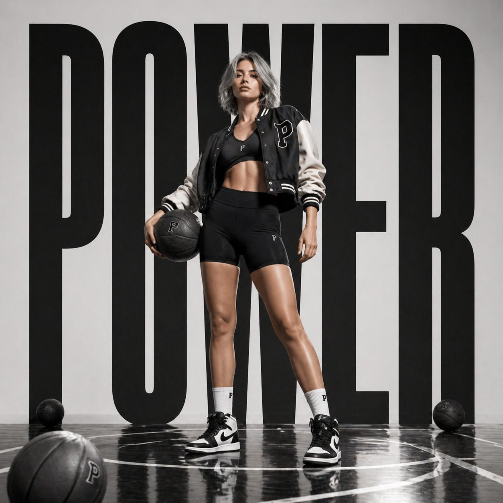</a> |

**Prompt:**

```
Create a premium luxury sportswear campaign poster featuring a confident female athlete in a modern studio environment. Full body pose with strong fashion attitude, standing tall while holding a basketball at her side, chin raised slightly, direct powerful expression. Athletic toned physique, sleek pulled back hair, clean glowing skin, sharp editorial posture.

Outfit includes an oversized cropped varsity jacket, fitted sports bra, tailored biker shorts, white crew socks, and modern high top sneakers. Neutral monochrome styling with subtle premium branding.

Background is a clean light gray studio wall with giant bold condensed black typography reading “POWER” stretched vertically across the backdrop behind the model. Text should feel oversized and dominant, framing the athlete in the center.

Floor is glossy reflective studio surface with subtle court markings and soft reflections. A few basketballs placed naturally around the floor for depth and campaign styling.

Lighting is bright luxury studio lighting with crisp highlights, soft shadows, and polished commercial finish. Sharp focus, ultra realistic skin texture, premium fabric texture, cinematic contrast.

Style should feel modern, minimal, elite, bold, high fashion sports campaign, luxury brand advertisement, clean composition, balanced negative space, strong visual impact, high resolution, square format.
```

<!-- Case 71: Streetwear Fashion Campaign Asian Apparel Poster (by @harboriis) -->
### Case 71: [Streetwear Fashion Campaign Asian Apparel Poster](https://x.com/harboriis/status/2047921293123895520) (by [@harboriis](https://x.com/harboriis))

| Output |
| :----: |
| <a href="https://evolink.ai/gpt-image-2-prompts?utm_source=github&utm_medium=picture&utm_campaign=awesome-gpt-image-2-prompts" target="_blank" rel="noopener noreferrer">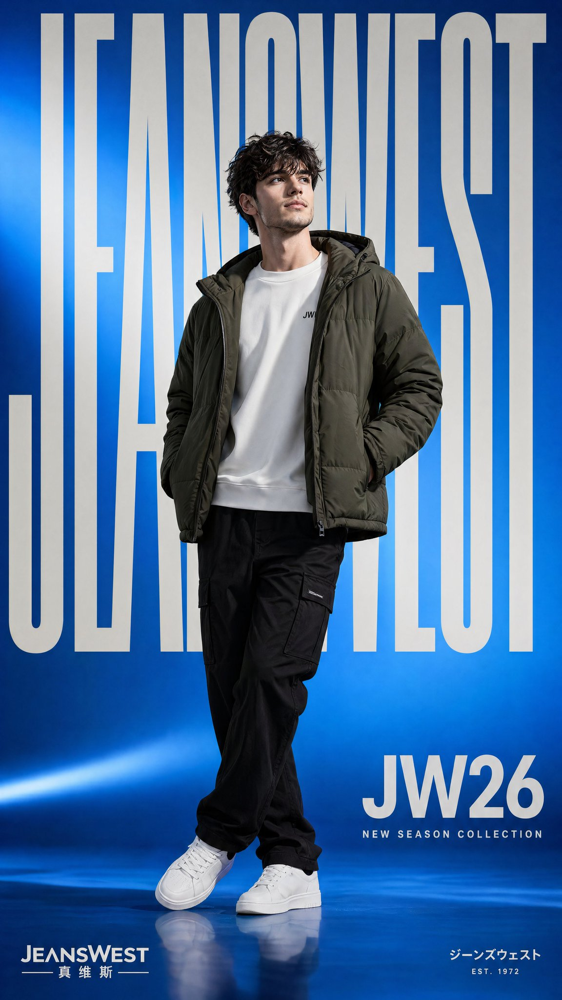</a> |

**Prompt:**

```
Create a premium streetwear fashion campaign poster inspired by modern Asian apparel advertising. Full body portrait of a stylish young male model standing confidently with legs crossed at the ankles, hands inside jacket pockets, head turned slightly upward and sideways with a calm thoughtful expression. Curly tousled medium length hair with soft volume. Slim athletic build.

Outfit includes a dark olive green padded hooded jacket worn open, clean white crewneck sweatshirt underneath with a tiny chest logo, relaxed black cargo style trousers, and minimal white sneakers. Styling is clean, youthful, and contemporary.

Background is a vibrant electric blue seamless studio backdrop with subtle gradient lighting, soft glow streaks, and glossy floor reflection. Lighting is soft studio light with gentle shadows and polished commercial finish.

Graphic poster layout with giant bold condensed sans serif text reading “JEANSWEST” vertically stretched across the background behind the model in light gray white. Add large text on lower right reading “JW26”. 

Composition should feel premium, trendy, clean, commercial, youthful, modern fashion ad campaign. Sharp focus, ultra realistic fabric texture, cinematic lighting, balanced negative space, sleek branding design, high resolution, vertical poster ratio.
```

<!-- Case 72: Epic Career Moments Cinematic Poster Template (by @Goodmanprotocol) -->
### Case 72: [Epic Career Moments Cinematic Poster Template](https://x.com/Goodmanprotocol/status/2047900470921040270) (by [@Goodmanprotocol](https://x.com/Goodmanprotocol))

| Output |
| :----: |
| <a href="https://evolink.ai/gpt-image-2-prompts?utm_source=github&utm_medium=picture&utm_campaign=awesome-gpt-image-2-prompts" target="_blank" rel="noopener noreferrer">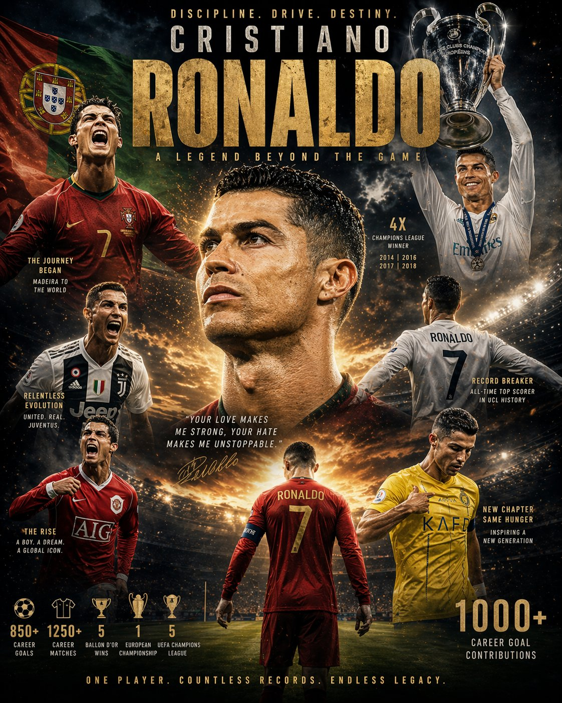</a> |

**Prompt:**

```
Create an epic poster showcasing the most iconic moments of [Insert Name]'s career. Cinematic style, lens flare. Portrait orientation. A1 poster size. aspect ratio 4:5 https://t.co/L9OHPKUNRp
```

<!-- Case 73: Avant-Garde Basketball Sculpture Sports Fashion Ad (by @AIwithkhan) -->
### Case 73: [Avant-Garde Basketball Sculpture Sports Fashion Ad](https://x.com/AIwithkhan/status/2047886964037398989) (by [@AIwithkhan](https://x.com/AIwithkhan))

| Output |
| :----: |
| <a href="https://evolink.ai/gpt-image-2-prompts?utm_source=github&utm_medium=picture&utm_campaign=awesome-gpt-image-2-prompts" target="_blank" rel="noopener noreferrer">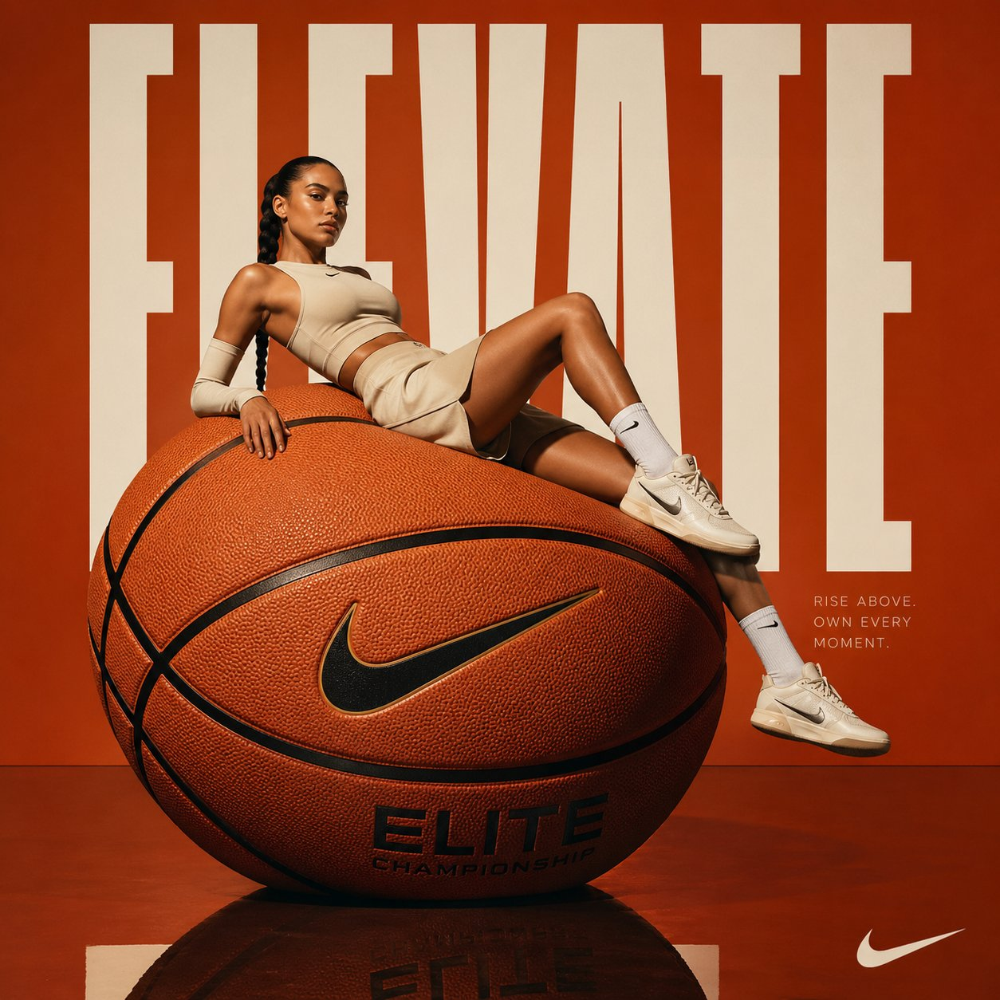</a> |

**Prompt:**

```
Avant-garde sports fashion advertisement, oversized basketball posed like a monumental sculpture, female athlete reclining across the ball’s curved surface as if modern furniture, giant word “ELEVATE” in bold typography behind, burnt orange studio backdrop, glossy reflective floor, luxury athletic editorial aesthetic, cinematic lighting, ultra-clean composition, 1:1
```

<!-- Case 74: Avant-Garde Tennis Racket Sculpture Sports Fashion Ad (by @AIwithSynthia) -->
### Case 74: [Avant-Garde Tennis Racket Sculpture Sports Fashion Ad](https://x.com/AIwithSynthia/status/2047884609321619831) (by [@AIwithSynthia](https://x.com/AIwithSynthia))

| Output |
| :----: |
| <a href="https://evolink.ai/gpt-image-2-prompts?utm_source=github&utm_medium=picture&utm_campaign=awesome-gpt-image-2-prompts" target="_blank" rel="noopener noreferrer">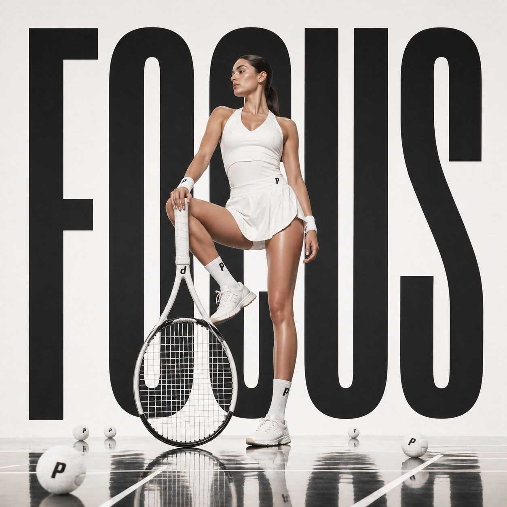</a> |

**Prompt:**

```
Avant-garde sports fashion advertisement, oversized tennis racket positioned like monumental sculpture, female athlete seated casually on the strings as if a suspended lounge, giant word “PRECISION” in bold typography behind, crisp white studio backdrop, reflective court-like floor, luxury sportswear editorial aesthetic, cinematic lighting, ultra-clean composition, 1:1
```

<!-- Case 75: Surrealist Liquor Brand High Fashion Poster (by @hmontilla_) -->
### Case 75: [Surrealist Liquor Brand High Fashion Poster](https://x.com/hmontilla_/status/2047884126343032995) (by [@hmontilla_](https://x.com/hmontilla_))

| Output |
| :----: |
| <a href="https://evolink.ai/gpt-image-2-prompts?utm_source=github&utm_medium=picture&utm_campaign=awesome-gpt-image-2-prompts" target="_blank" rel="noopener noreferrer"></a> |

**Prompt:**

```
Un póster publicitario surrealista de alta costura para Aguardiente Amarillo. La escena se sitúa en un estudio minimalista y monocromático de color naranja claro, con un suelo semirreflectante.
El foco central es una botella de Aguardiente Amarillo de tamaño descomunal y gigante, colocada en ángulo diagonal y que sirve como respaldo. Un modelo masculino de moda, de cabello largo y oscuro, vestido con un conjunto impecable y totalmente blanco —compuesto por una sudadera y pantalones de pierna ancha—, apoya toda su espalda contra la botella gigante en una postura relajada e inclinada. Mira hacia la derecha, de perfil, con la vista al frente y una expresión serena; calza zapatillas blancas de tamaño estándar.
En el fondo, la palabra "AGUARDIENTE" aparece escrita con una tipografía sans-serif condensada, blanca, masiva y en negrita, parcialmente oculta por la botella gigante y por el modelo para crear una sensación de profundidad. En la esquina superior derecha se lee: "Creado por @HMontilla_".
En la parte inferior central, una frase publicitaria en tipografía sans-serif blanca reza: "El Aguardiente Amarillo de Manzanares es un icónico licor colombiano, originario de 1885 en Manzanares, Caldas". La iluminación es suave, fría y uniforme, proyectando sombras tenues y un reflejo sutil de los sujetos sobre el suelo azul brillante. La estética general es limpia, moderna y de alto concepto.

Establecer la relación de aspecto en 3:4.
```

<!-- Case 76: Premium Food Recipe Poster Elegant Layout (by @Preda2005) -->
### Case 76: [Premium Food Recipe Poster Elegant Layout](https://x.com/Preda2005/status/2047883394152088004) (by [@Preda2005](https://x.com/Preda2005))

| Output |
| :----: |
| <a href="https://evolink.ai/gpt-image-2-prompts?utm_source=github&utm_medium=picture&utm_campaign=awesome-gpt-image-2-prompts" target="_blank" rel="noopener noreferrer">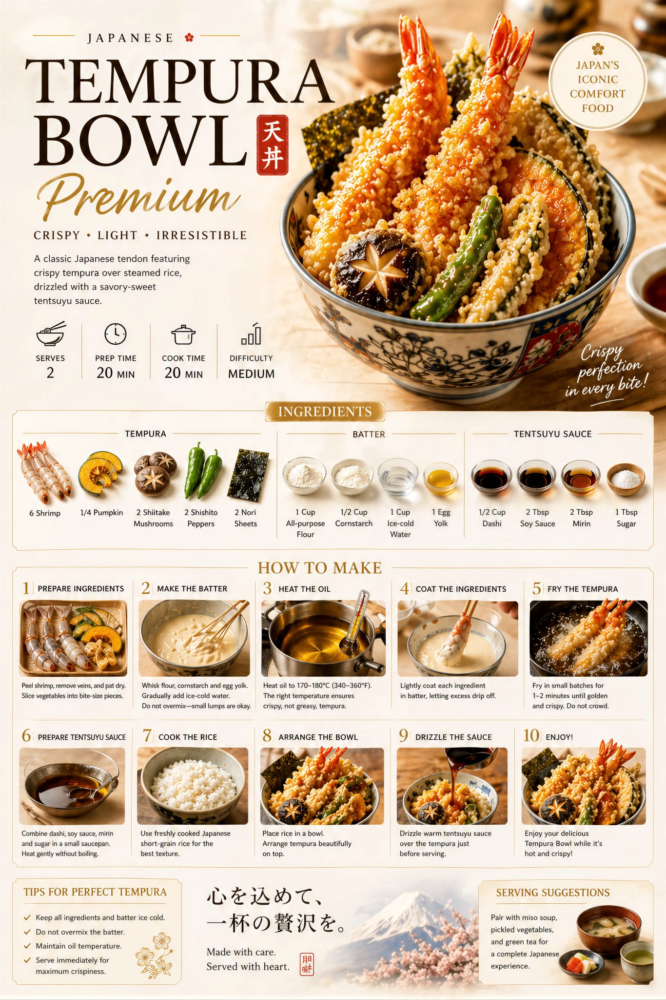</a> |

**Prompt:**

```
Create a premium food preparation poster for
 [ DISH NAME ], with a beautiful hero dish, warm natural lighting, cream background, elegant step-by-step recipe layout, ingredients, cooking process, premium food photography, refined English typography, luxury restaurant advertisement style, clean design, rich colors, highly detailed, visually irresistible, cinematic masterpiece.
```

<!-- Case 77: Luxury Fashion Magazine Cover Black and White (by @iamrealsnow) -->
### Case 77: [Luxury Fashion Magazine Cover Black and White](https://x.com/iamrealsnow/status/2047883187527856345) (by [@iamrealsnow](https://x.com/iamrealsnow))

| Output |
| :----: |
| <a href="https://evolink.ai/gpt-image-2-prompts?utm_source=github&utm_medium=picture&utm_campaign=awesome-gpt-image-2-prompts" target="_blank" rel="noopener noreferrer">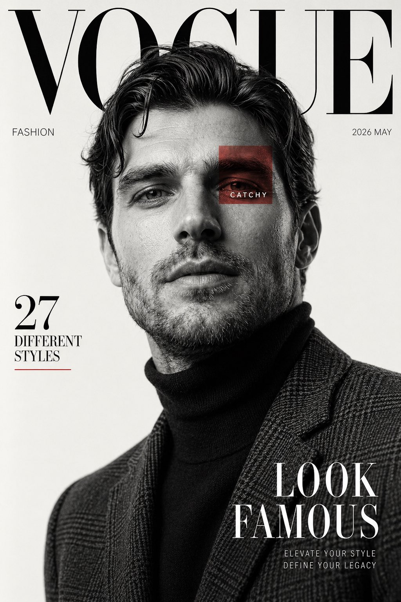</a> |

**Prompt:**

```
Create a high fashion editorial magazine cover inspired by luxury fashion publications. Use the reference image of the male subject. Black and white portrait photography with a clean off white studio background. Subject is posed confidently from a low angle, looking slightly upward, sharp jawline, soft parted lips, tousled wavy hair with natural volume. Outfit includes a dark turtleneck layered under a textured tailored plaid blazer. Lighting is soft yet dramatic, creating sculpted facial shadows and elegant contrast.
Magazine layout design with oversized serif masthead text at the top reading “VOGUE”, partially hidden behind the subject’s head. Minimal premium typography across the page. Add side text “FASHION”, issue date “2026 MAY”, left side headline “27 DIFFERENT STYLES”, and bold bottom right cover line “LOOK FAMOUS”. Include a small red translucent square overlay on one eye area with the word “CATCHY”.
Style should feel premium, modern, cinematic, clean composition, sharp focus, ultra realistic skin texture, editorial luxury aesthetic, balanced negative space, timeless fashion cover design. Vertical magazine ratio, high resolution.
```

<!-- Case 78: Surrealist Rolex Luxury Watch Fashion Poster (by @Sheldon056) -->
### Case 78: [Surrealist Rolex Luxury Watch Fashion Poster](https://x.com/Sheldon056/status/2047873913049538927) (by [@Sheldon056](https://x.com/Sheldon056))

| Output |
| :----: |
| <a href="https://evolink.ai/gpt-image-2-prompts?utm_source=github&utm_medium=picture&utm_campaign=awesome-gpt-image-2-prompts" target="_blank" rel="noopener noreferrer">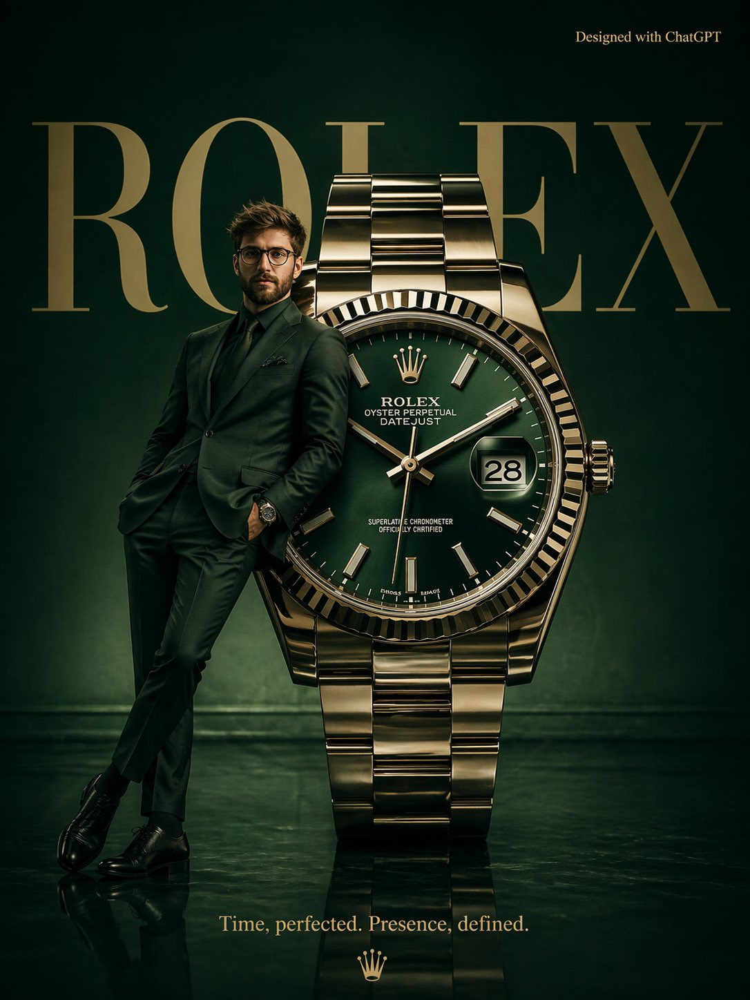</a> |

**Prompt:**

```
A high-fashion surrealist poster for Rolex. A deep emerald green minimalist studio with a polished reflective floor. A massive Rolex watch stands upright like a monument. A male model in a tailored dark green suit leans casually against the watch face, wearing a matching Rolex.
```

<!-- Case 79: Peacock Botanical Vintage Symmetrical Art Print (by @dotey) -->
### Case 79: [Peacock Botanical Vintage Symmetrical Art Print](https://x.com/dotey/status/2047803054422901046) (by [@dotey](https://x.com/dotey))

| Output |
| :----: |
| <a href="https://evolink.ai/gpt-image-2-prompts?utm_source=github&utm_medium=picture&utm_campaign=awesome-gpt-image-2-prompts" target="_blank" rel="noopener noreferrer">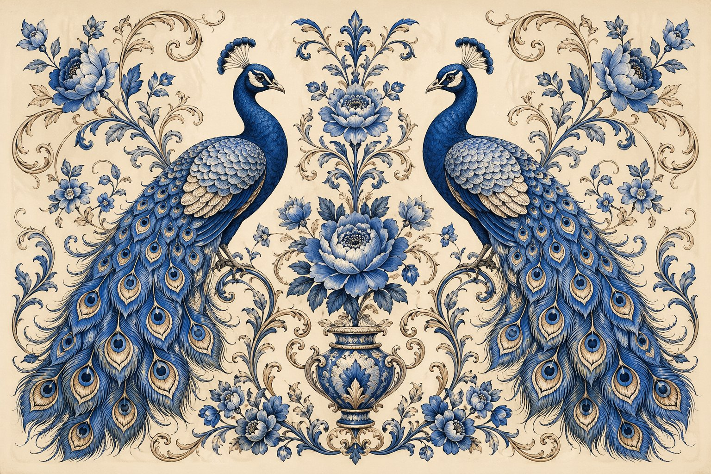</a> |

**Prompt:**

```
symmetrical design featuring two elegant blue peacocks with detailed feather patterns, surrounded by blue floral elements, intricate vintage botanical ornament, soft beige background, classical floral decor style with rich navy and sky blue details, decorative art illustration --ar 3:2
```

<!-- Case 80: SPLASH Fashion Brand Hyper-Realistic Campaign Poster (by @miratechtool) -->
### Case 80: [SPLASH Fashion Brand Hyper-Realistic Campaign Poster](https://x.com/miratechtool/status/2047780974709346606) (by [@miratechtool](https://x.com/miratechtool))

| Output |
| :----: |
| <a href="https://evolink.ai/gpt-image-2-prompts?utm_source=github&utm_medium=picture&utm_campaign=awesome-gpt-image-2-prompts" target="_blank" rel="noopener noreferrer">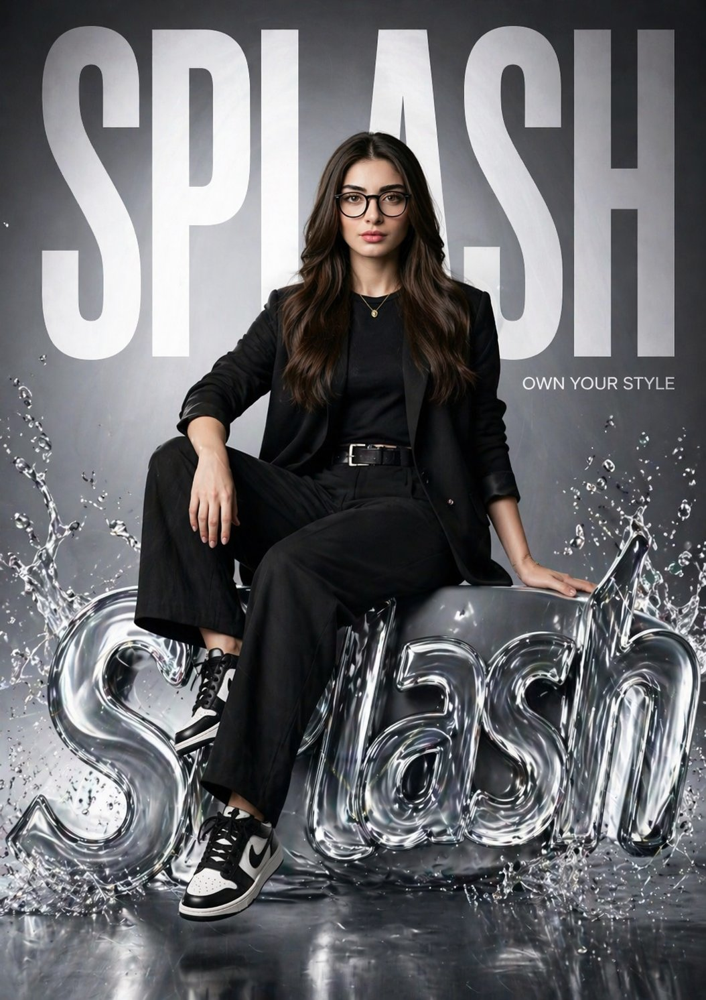</a> |

**Prompt:**

```
Create a hyper-realistic fashion poster for “SPLASH” featuring the same girl from the reference image (keep her face 100% identical). She is sitting confidently on a glossy, liquid-style 3D SPLASH logo with water splash effects. One leg relaxed, one bent, strong editorial pose.
Background has massive bold “SPLASH” text filling the frame, partially behind her. Add small tagline: “Own Your Style.”
Outfit: modern black street-fashion (blazer, fitted top, trousers, sneakers).
Lighting: cinematic studio, soft key light + rim light, reflective highlights on liquid logo.
Style: luxury brand campaign (Zara / H&M), clean glossy environment.
Camera: 85mm lens, shallow depth of field, 8K, ultra-detailed, photorealistic.
```

<!-- Case 81: Avant-Garde Guitar Sculpture Fashion Advertisement (by @QamarRiaz1) -->
### Case 81: [Avant-Garde Guitar Sculpture Fashion Advertisement](https://x.com/QamarRiaz1/status/2047777016733110722) (by [@QamarRiaz1](https://x.com/QamarRiaz1))

| Output |
| :----: |
| <a href="https://evolink.ai/gpt-image-2-prompts?utm_source=github&utm_medium=picture&utm_campaign=awesome-gpt-image-2-prompts" target="_blank" rel="noopener noreferrer">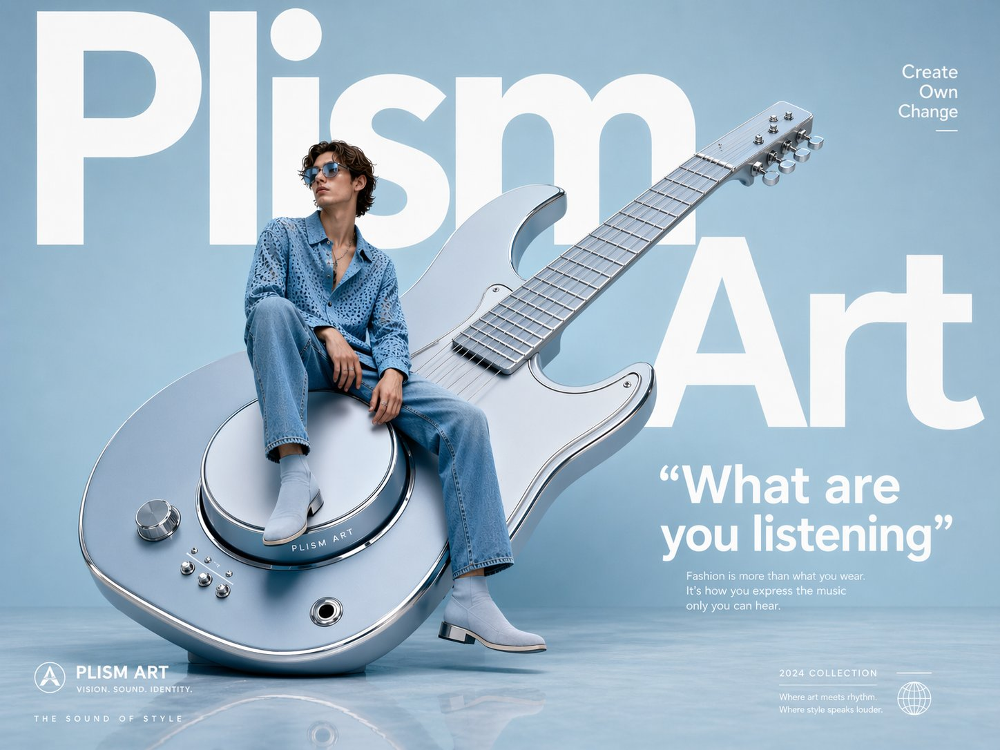</a> |

**Prompt:**

```
Avant-garde fashion advertisement, oversized guitar positioned like sculpture, a guitarist in jeans casually seated on the a button as if furniture, giant word "Plism Art" behind in bold white typography, powder pastel studio background, reflective floor, luxury eyewear campaign aesthetic, ultra-clean layout, editorial magazine styling, Bold quote " What are you listening"   Tag : Create Own Change
```

<!-- Case 107: 18-Panel Mascot Brand Identity Document (by @Colin_Leeee) -->
### Case 107: [18-Panel Mascot Brand Identity Document](https://x.com/Colin_Leeee/status/2044802802149650631) (by [@Colin_Leeee](https://x.com/Colin_Leeee))

| Output |
| :----: |
|  |

**Prompt:**

```
{
  "type": "18-panel brand identity and character design document",
  "brand": {
    "name": "{argument name=\"brand name\" default=\"沐阳 MUYANG TEA\"}",
    "industry": "{argument name=\"industry\" default=\"tea shop\"}",
    "colors": ["{argument name=\"primary color\" default=\"yellow\"}", "{argument name=\"secondary color\" default=\"green\"}", "white", "brown", "dark green"]
  },
  "subject": "{argument name=\"character description\" default=\"3D rendered cute Shiba Inu mascot wearing a green apron\"}",
  "layout": {
    "grid": "3 columns by 6 rows",
    "sections": [
      {
        "title": "01 品牌DNA分析 / BRAND DNA ANALYSIS",
        "elements": ["logo", "5 color swatches", "6 icons", "target audience charts"]
      },
      {
        "title": "02 概念构思 / CONCEPT MOODBOARD",
        "elements": ["5 photo references", "4 mood icons", "design equation"]
      },
      {
        "title": "03 形态研究 / FORM STUDY",
        "elements": ["4 logo anatomy icons", "4 evolution steps", "4 silhouettes"]
      },
      {
        "title": "04 概念探索 / CONCEPT EXPLORATION",
        "elements": ["12 line-art character sketches"]
      },
      {
        "title": "05 精细线稿 / REFINED LINE ART",
        "elements": ["3 rows of front and side line art with proportion guides"]
      },
      {
        "title": "06 细节精修 / DETAIL REFINEMENT",
        "elements": ["2 full-body renders with labels", "4 circular close-ups"]
      },
      {
        "title": "07 表情设定 / EXPRESSION SHEET",
        "elements": ["11 3D rendered head expressions"]
      },
      {
        "title": "08 姿势库 / POSE LIBRARY",
        "elements": ["9 full-body 3D rendered poses"]
      },
      {
        "title": "09 转身视图 / TURNAROUND VIEW",
        "elements": ["5 full-body 3D renders", "5 matching line-art views"]
      },
      {
        "title": "10 色彩开发 / COLOR DEVELOPMENT",
        "elements": ["5 rows of 5-color palettes", "color psychology text"]
      },
      {
        "title": "11 材质规格 / MATERIAL SPECIFICATION",
        "elements": ["5 texture swatches", "property sliders", "4 manufacturing icons"]
      },
      {
        "title": "12 色彩应用 / COLOR APPLICATION",
        "elements": ["4 color variant renders", "2 light/dark renders", "4 contrast rating circles"]
      },
      {
        "title": "13 构造指南 / CONSTRUCTION GUIDE",
        "elements": ["2 line-art diagrams for geometry and grid"]
      },
      {
        "title": "14 设计系统规则 / DESIGN SYSTEM RULES",
        "elements": ["minimum size icons", "clear space diagram", "4 usage examples"]
      },
      {
        "title": "15 资产变体 / ASSET VARIANTS",
        "elements": ["3 size variants", "3 line-art variants", "3 simplified flat heads"]
      },
      {
        "title": "16 数字应用 / DIGITAL APPLICATIONS",
        "elements": ["1 app icon", "2 social avatars", "UI elements", "3-step animation cycle"]
      },
      {
        "title": "17 实物应用 / PHYSICAL APPLICATIONS",
        "elements": ["plush toy mockup", "packaging mockup", "merchandise mockup", "storefront mockup"]
      },
      {
        "title": "18 最终主视觉 / FINAL RENDERING",
        "elements": ["large high-res 3D render of mascot holding tea", "logo", "file format list"]
      }
    ]
  }
}
```

<!-- Case 108: Dark Mode Marketing Case Study UI (by @IndieDevHailey) -->
### Case 108: [Dark Mode Marketing Case Study UI](https://x.com/IndieDevHailey/status/2044974254769463312) (by [@IndieDevHailey](https://x.com/IndieDevHailey))

| Output |
| :----: |
|  |

**Prompt:**

```
{
  "type": "UI/UX landing page mockup",
  "theme": "dark mode, sleek modern aesthetic, glassmorphism, {argument name=\"primary accent color\" default=\"neon purple and blue\"} glowing accents",
  "header": {
    "logo": "{argument name=\"brand name\" default=\"goViralX\"}",
    "top_right_tag": "VIRAL CAMPAIGN CASE STUDY"
  },
  "layout": {
    "sections": [
      {
        "name": "Hero",
        "headline": "{argument name=\"hero headline\" default=\"How We Created 10M+ Viral Impact\"}",
        "subheadline": "3天引爆全网, 助力品牌实现指数级增长",
        "stats_row": {
          "count": 4,
          "labels": ["总播放量", "互动率", "转化咨询", "执行周期"],
          "values": ["{argument name=\"main statistic\" default=\"10,240,000+\"}", "18.7%", "3,200+", "72小时"]
        },
        "visual": "cinematic shot of a person in a hoodie looking at glowing digital screens and graphs, large play button overlay"
      },
      {
        "name": "Strategy",
        "title": "Our 3-Day Execution Strategy",
        "layout_type": "vertical timeline",
        "steps_count": 3,
        "elements_per_step": ["timeline node", "title", "bullet points", "video thumbnail with play button", "description box"]
      },
      {
        "name": "Performance",
        "title": "Data-Driven Performance",
        "left_column": {
          "stat_cards_count": 4,
          "values": ["10M+", "43%", "28,000+", "3,200+"]
        },
        "right_column": {
          "charts_count": 2,
          "chart_1": "line graph showing 7-day growth peaking at Day 3",
          "chart_2": "horizontal segmented bar chart showing platform distribution (TikTok 52%, Instagram 24%, X 15%, YouTube 9%)"
        }
      },
      {
        "name": "Keys to Success",
        "title": "The 3 Keys to Viral Success",
        "cards_count": 3,
        "card_elements": ["glowing icon (fire, target, antenna)", "title", "description", "VIEW DETAIL link"]
      },
      {
        "name": "Social Proof",
        "title": "TRUSTED BY CREATORS & BRANDS",
        "left_column": {
          "logos_count": 8,
          "grid": "2x4",
          "brands": ["SHEIN", "SHOPLINE", "Blueglass", "instacart", "lemon8", "mi", "CIDER", "bellroy"]
        },
        "right_column": {
          "testimonial_cards_count": 2,
          "elements": ["quote", "author title (SaaS Founder, Growth Manager)"]
        }
      },
      {
        "name": "Call to Action",
        "title": "READY TO GO VIRAL?",
        "interactive_elements": ["text input field", "glowing button with text '{argument name=\"call to action text\" default=\"获取专属增长方案 ->\"}'"],
        "visual": "3D render of a rocket ship taking off with purple and blue flames"
      }
    ]
  }
}
```

<!-- Case 109: VR Headset Exploded View Poster (by @wory37303852) -->
### Case 109: [VR Headset Exploded View Poster](https://x.com/wory37303852/status/2045925660401795478) (by [@wory37303852](https://x.com/wory37303852))

| Output |
| :----: |
|  |

**Prompt:**

```
{
  "type": "exploded view product diagram poster",
  "subject": "VR headset",
  "style": "clean high-tech 3D render, studio lighting, glowing accents",
  "background": "{argument name=\"background color\" default=\"soft purple and blue gradient\"}",
  "header": {
    "logo": "∞ {argument name=\"product name\" default=\"Meta Quest 3\"}",
    "subtitle": "{argument name=\"main catchphrase\" default=\"まったく新しい現実を、まったく新しい構造から。\"}"
  },
  "layout": {
    "centerpiece": "vertically stacked exploded view of a VR headset showing 9 distinct layers of internal components: outer shell, camera sensors, motherboard with chip, pancake lenses, internal frame, battery packs, side straps, top strap, and facial interface cushion.",
    "callout_labels": {
      "count": 8,
      "left_side": [
        "Snapdragon® XR2 Gen 2\n圧倒的な処理性能でリアルタイムな体験を。",
        "調整可能なIPD機構\n幅広いユーザーに快適なフィット感を。",
        "精密設計されたヘッドストラップ\n快適さと安定性を追求したエルゴノミクス。"
      ],
      "right_side": [
        "フェイスプレート\n洗練されたデザインと最適な重量バランス。",
        "トラッキングカメラ\n高精度な位置トラッキングと環境認識を実現。",
        "パンケーキレンズ\n薄型設計で広い視野角と鮮明な映像を提供。",
        "高性能バッテリー\n長時間駆動を支える最適化された電源設計。",
        "柔らかなフェイスインターフェース\n長時間でも快適な装着感を実現。"
      ]
    },
    "footer": {
      "left_text_block": {
        "headline": "{argument name=\"bottom headline\" default=\"体験は、構造から進化する。\"}",
        "body": "一つひとつのパーツに、没入体験を支える最先端テクノロジーとこだわりの設計。Meta Quest 3は、未来を感じさせる体験を内部から生み出しています。"
      },
      "right_logo": "∞ Meta"
    }
  }
}
```

<!-- Case 110: Illustrated City Food Map (by @mm_zzm44854) -->
### Case 110: [Illustrated City Food Map](https://x.com/mm_zzm44854/status/2045861258520568230) (by [@mm_zzm44854](https://x.com/mm_zzm44854))

| Output |
| :----: |
|  |

**Prompt:**

```
{
  "type": "illustrated map infographic",
  "style": "{argument name=\"art style\" default=\"watercolor and ink hand-drawn illustration on vintage parchment\"}",
  "title_section": {
    "text": "{argument name=\"city name\" default=\"成都\"} {argument name=\"map title\" default=\"吃货暴走地图\"}",
    "mascot": "cartoon red chili pepper wearing sunglasses and giving a thumbs up"
  },
  "border": "{argument name=\"border decoration\" default=\"vine of green leaves and red chili peppers\"}",
  "layout": {
    "background": "textured beige parchment paper with yellow roads, blue rivers, and green park areas",
    "sections": [
      {
        "title": "landmarks",
        "count": 6,
        "illustrations": ["traditional pavilion", "traditional monastery", "modern skyscraper with climbing panda", "tall TV tower", "traditional gate", "industrial buildings"],
        "labels": ["人民公园", "文殊院", "IFS", "339电视塔", "宽窄巷子", "东郊记忆"]
      },
      {
        "title": "food_spots",
        "count": 12,
        "illustrations": ["mapo tofu", "dumplings in chili oil", "skewers in pot", "sticky rice balls", "egg baking cake", "nine-grid hotpot", "sweet potato noodles", "cold skewers", "spicy mixed dish", "covered tea bowl", "ice jelly dessert", "spicy rabbit heads"],
        "labels": ["1 陈麻婆豆腐", "2 钟水饺", "3 春熙路", "4 宽窄巷子·三大炮", "5 建设路·叶婆婆蛋烘糕", "6 玉林路·小龙坎火锅", "7 香香巷·肥肠粉", "8 武侯祠大街·钵钵鸡", "9 东郊记忆·冒椒火辣", "10 人民公园·鹤鸣茶社", "11 锦里古街·冰粉", "12 双流老妈兔头"]
      },
      {
        "title": "图例",
        "position": "bottom-right",
        "count": 5,
        "items": ["red dot", "green house", "green tree", "blue line", "yellow double line"],
        "labels": ["美食地点", "地标景点", "公园绿地", "河流湖泊", "主要道路"]
      }
    ],
    "centerpiece": "giant panda sitting and eating bamboo",
    "bottom_right_extras": ["vintage compass rose with N, S, E, W", "disclaimer text '温馨提示:吃辣需谨慎,肠胃要保护~' with a red chili pepper icon"]
  }
}
```

<!-- Case 111: 3D Stone Staircase Evolution Infographic (by @GeekCatX) -->
### Case 111: [3D Stone Staircase Evolution Infographic](https://x.com/GeekCatX/status/2045792240044511277) (by [@GeekCatX](https://x.com/GeekCatX))

| Output |
| :----: |
| 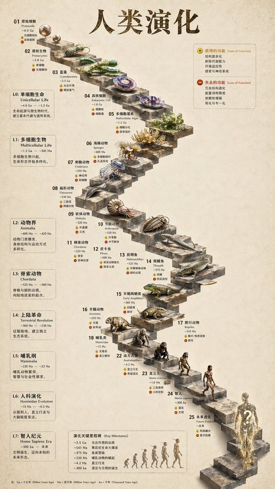 |

**Prompt:**

```
{
  "type": "evolutionary timeline infographic",
  "instruction": "Using REFERENCE_0 as a structural base, transform the flat vector design into a highly realistic 3D infographic. Replace the smooth ramps with distinct stone steps and upgrade all organisms to photorealistic 3D models.",
  "style": {
    "background": "{argument name=\"background style\" default=\"vintage textured parchment paper\"}",
    "staircase": "{argument name=\"staircase material\" default=\"realistic textured stone blocks\"}",
    "subjects": "{argument name=\"organism style\" default=\"highly detailed photorealistic 3D renders\"}"
  },
  "layout": {
    "main_title": "{argument name=\"main title\" default=\"人类演化\"}",
    "sections": [
      {
        "position": "left sidebar",
        "count": 8,
        "labels": ["L0: 单细胞生命", "L1: 多细胞生物", "L2: 动物界", "L3: 脊索动物", "L4: 上陆革命", "L5: 哺乳纲", "L6: 人科演化", "L7: 智人纪元"]
      },
      {
        "position": "top right",
        "title": "获得的功能 / 失去的功能",
        "description": "Legend with plus and minus icons"
      },
      {
        "position": "bottom center",
        "title": "演化关键里程碑",
        "count": 6,
        "description": "Timeline with a silhouette graphic of 6 figures showing ape-to-human evolution"
      }
    ],
    "centerpiece": {
      "description": "Winding stone staircase with 25 numbered steps featuring specific organisms.",
      "count": 25,
      "notable_elements": [
        "Step 07: Jellyfish",
        "Step 09: Ammonite",
        "Step 10: Trilobite",
        "Step 24: Walking human",
        "Step 25: {argument name=\"future evolution concept\" default=\"glowing cosmic silhouette with a question mark\"}"
      ]
    }
  }
}
```

<!-- Case 112: Anime Character Brand Identity & Merch Board (by @chi_vc_) -->
### Case 112: [Anime Character Brand Identity & Merch Board](https://x.com/chi_vc_/status/2046061073720369228) (by [@chi_vc_](https://x.com/chi_vc_))

| Output |
| :----: |
|  |

**Prompt:**

```
{
  "type": "brand identity and merchandise design board",
  "theme": {
    "color_palette": "{argument name=\"theme color\" default=\"pastel pink\"} and white",
    "motif": "{argument name=\"motif\" default=\"cherry blossoms\"} and pink hearts"
  },
  "character": {
    "description": "anime girl with short brown bob hair, pink eyes, wearing a white hoodie, gentle smile"
  },
  "branding": {
    "main_logo": "{argument name=\"character name\" default=\"癒音ちー\"}",
    "sub_logo": "{argument name=\"character subtext\" default=\"ゆおんちー\"}"
  },
  "layout": {
    "sections": [
      {
        "type": "header banner",
        "position": "top",
        "elements": ["large main logo", "sub logo", "cherry blossom graphics", "character portrait on the right"]
      },
      {
        "type": "product packaging",
        "position": "middle left",
        "elements": ["1 square box with heart-shaped transparent window showing pink heart candies", "character illustration on box", "2 individual candy wrappers", "5 scattered heart candies"]
      },
      {
        "type": "promotional poster",
        "position": "middle right",
        "elements": ["character portrait", "heart-shaped candy bowl", "main logo", "text '4.26 NEW OPEN'", "text '{argument name=\"social handle\" default=\"@yuonchii\"}'"]
      },
      {
        "type": "horizontal web banner",
        "position": "lower middle",
        "elements": ["main logo", "cherry blossoms", "character portrait on the right"]
      },
      {
        "type": "social media profile mockup",
        "position": "bottom left",
        "elements": ["header image with logo", "1 circular profile picture", "handle '{argument name=\"social handle\" default=\"@yuonchii\"}'", "1 follow button", "mock bio text"]
      },
      {
        "type": "merchandise collection",
        "position": "bottom right",
        "count": 9,
        "items": ["1 white t-shirt with logo", "1 white mug with character", "4 round pin badges", "1 acrylic keychain", "2 candy packets"]
      }
    ]
  }
}
```

<!-- Case 113: E-commerce Main Image - Luxury Amber Perfume Ad (by @Polanco_IA) -->
### Case 113: [E-commerce Main Image - Luxury Amber Perfume Ad](https://x.com/Polanco_IA/status/2047689647967609037) (by [@Polanco_IA](https://x.com/Polanco_IA))

| Output |
| :----: |
|  |

**Prompt:**

```
A luxurious cinematic product photograph of a classic rectangular perfume bottle inspired by {argument name="brand label" default="N°5 CHANEL PARIS PARFUM"}, placed upright on a glossy black marble surface with white veining. The bottle is centered slightly to the right, made of clear faceted glass with a large transparent crystal stopper, filled with rich amber-gold perfume that glows from within. Tiny condensation droplets cover the glass, adding texture and realism. Dramatic warm lighting from the upper left creates golden highlights, deep reflections on the marble, and a soft luminous bloom in the background. Wisps of elegant smoke curl around the bottle on both sides, enhancing a moody high-end advertisement feel. Dark background, shallow depth of field, ultra-detailed studio product photography, luxury beauty campaign aesthetic, crisp focus on the bottle, realistic reflections, warm black-and-gold color palette. Add a small white {argument name="corner logo" default="Pollo.ai"} in the top-right corner. Square composition, premium commercial ad, photorealistic, high contrast, refined and sophisticated.
```

<!-- Case 114: E-commerce Main Image - Skincare Product Studio Shot (by @Strength04_X) -->
### Case 114: [E-commerce Main Image - Skincare Product Studio Shot](https://x.com/Strength04_X/status/2047636636847231222) (by [@Strength04_X](https://x.com/Strength04_X))

| Output |
| :----: |
|  |

**Prompt:**

```
A soft {argument name="bottle color" default="cream-colored"} bottle with a {argument name="pump color" default="pastel yellow"} pump stands on a matte podium, surrounded by silky foam and {argument name="flowers" default="chamomile blossoms"}. The background is a pale yellow gradient with subtle bubble details. The label emphasizes organic chamomile and calming care. Fresh chamomile flowers accentuate the gentle appeal.
```

<!-- Case 115: E-commerce Main Image - Tropical Citrus Soda Ad Poster (by @edimakorfr) -->
### Case 115: [E-commerce Main Image - Tropical Citrus Soda Ad Poster](https://x.com/edimakorfr/status/2047635133466124726) (by [@edimakorfr](https://x.com/edimakorfr))

| Output |
| :----: |
|  |

**Prompt:**

```
Create a vibrant tropical commercial poster for a citrus soda bottle, in a bright summer advertising style. Show a single large plastic bottle of {argument name="product name" default="Soda"} centered slightly to the right, tilted a little left, with a yellow cap and transparent bottle covered in cold condensation droplets, filled with glowing golden-orange soda. The label should feature sliced oranges and citrus artwork with the brand text "{argument name="product name" default="Soda"}", the phrase "aux agrumes d'été", and a small green "500 ml" mark. Use a sunny beach background with vivid blue sky, turquoise ocean, soft clouds, and blurred tropical palm leaves entering from the upper right corner. Add dramatic water splashes around the base of the bottle, scattered clear ice cubes, and 5 visible citrus pieces in the foreground: 2 orange wedges, 1 lime half, 1 grapefruit half, and 1 partial orange slice at the far right edge. Place large French promotional text on the left: a huge white headline "{argument name="headline text" default="Soda"}" with a small splash accent above it, then yellow script text "aux agrumes d'été" underneath. Add a yellow paint-stroke badge at mid-left with the text "LA FRAÎCHEUR QUI PÉTILLE !". Add a vertical feature list on the lower left with 3 round icons and French captions: "SAVEURS NATURELLES", "SANS COLORANTS ARTIFICIELS", and "EXTRA RAFRAÎCHISSANT". Add a green brushstroke banner at the bottom left reading "FORMAT PRATIQUE 500 ml". Add a round beige eco-style seal at the bottom right with green outline and leaf motif, containing the text "{argument name="seal text" default="PLAISIR FRUITÉ À CHAQUE GORGÉE"}". Lighting should be glossy and high-energy with strong sun flare from the upper left, saturated citrus colors, crisp packaging detail, realistic droplets, and polished supermarket-ad realism.
```

<!-- Case 116: E-commerce Main Image - Industrial Design Presentation Sheet (by @ShamsAmin56) -->
### Case 116: [E-commerce Main Image - Industrial Design Presentation Sheet](https://x.com/ShamsAmin56/status/2047627860752621647) (by [@ShamsAmin56](https://x.com/ShamsAmin56))

| Output |
| :----: |
|  |

**Prompt:**

```
Core Subject: [{argument name="reference" default="use the uploaded image"}, keep the details, typography and structure locked 100%]

Layout & Composition: A {argument name="presentation type" default="professional industrial design presentation sheet"}. The image should be organized into a clean grid system.

Top Row: A 3x3 layout showing top-down flat lay views and close-up macro details of materials.

Middle Section: Three hero shots of the product standing upright in different color ways (Matte Black, Arctic White, and accented variants). The products should be slightly tilted to show depth and form.

Bottom Section: A dynamic "floating" composition featuring two products overlapping at opposing angles to showcase the front and side profiles simultaneously.

Environment & Lighting: Set against a minimalist, neutral studio gray background. Soft top-down lighting with realistic contact shadows. High-end product photography aesthetic.

Style & Finish: Matte textures, clean silhouettes, and sharp edges. Leave designated blank areas on the product surfaces for "Placeholder Branding" and "Graphic Mockups." 4k resolution, Unreal Engine 5 render style, hyper-realistic, clean aesthetic.
```

<!-- Case 117: E-commerce Main Image - Luxury Fur-Lined Loafer Lifestyle Photo (by @dynamicwangs) -->
### Case 117: [E-commerce Main Image - Luxury Fur-Lined Loafer Lifestyle Photo](https://x.com/dynamicwangs/status/2047580984342925545) (by [@dynamicwangs](https://x.com/dynamicwangs))

| Output |
| :----: |
|  |

**Prompt:**

```
A warm, editorial-style lifestyle product photo shot indoors from a low close-up angle, focused on a woman's lower legs and feet as she tries on 1 pair of black leather backless loafers with tan faux-fur lining. One loafer is worn on the right foot and the left foot is bare, hovering just above the textured cream shag rug, while the second matching loafer lies on the rug in the lower left foreground. The shoes have smooth black leather uppers, a rounded almond toe, open mule-style heel, plush brown fur spilling out around the opening, and a small polished gold horsebit hardware detail across the vamp. The model wears cropped medium-blue denim jeans with a raw frayed hem. The setting is a cozy minimalist interior with a cream rug featuring 2 thin irregular black lines, a neutral wall, and a leaning rectangular mirror with a medium wood frame in the upper right background, softly reflecting the rug and part of the scene. Use soft natural window light, shallow depth of field, subtle film grain, realistic skin texture, muted beige and black palette, relaxed candid composition, premium fashion catalog mood, high detail, photorealistic.
```

<!-- Case 118: E-commerce Main Image - Luxury Perfume Ad on Marble Vanity (by @MiguelMaestroIA) -->
### Case 118: [E-commerce Main Image - Luxury Perfume Ad on Marble Vanity](https://x.com/MiguelMaestroIA/status/2047555836252151831) (by [@MiguelMaestroIA](https://x.com/MiguelMaestroIA))

| Output |
| :----: |
|  |

**Prompt:**

```
A luxury e-commerce advertising photo of a premium perfume bottle on a polished gray-and-white marble vanity, shot in a warm cinematic studio style with soft golden lighting, shallow depth of field, and elegant reflections. The composition is square and high-end, with the perfume bottle centered slightly right of frame and promotional text on the left. The bottle is a tall sculpted hourglass-shaped glass flacon with smoky transparent gray glass fading darker at the base, a glossy gold spherical cap, a gold collar engraved with fine branding, and a large metallic gold interlocking monogram on the front. Keep the branding-inspired feel but do not add extra products. In the foreground left, include 1 cut-crystal bowl with a gold rim, partially cropped. In the background right, include 1 brushed gold cylindrical vase holding 1 bouquet of soft white flowers, blurred. Behind the bottle, add 1 black marble rectangular box with subtle white veining and gold trim. In the lower right foreground, include 1 draped piece of champagne-colored satin fabric, softly out of focus. The background should be dark, luxurious, and softly blurred, with rich brown-black tones and a vertical shadowed panel on the left to support typography. Add elegant serif headline text on the upper left reading {argument name="headline text" default="Premium Perfume,"} in large warm beige letters, with a smaller serif subheading beneath reading {argument name="tagline" default="Subtlety and Elegance"}, plus a thin short gold horizontal line below the subheading. Place a small white logo in the top-right corner reading {argument name="brand logo" default="Pollo.ai"}. Emphasize premium materials, realistic glass refraction, gold metallic highlights, luxury product photography, refined composition, soft bokeh, and upscale beauty-ad aesthetics.
```

<!-- Case 119: Biomimetic Skyray Aircraft Poster (by @_simonsmith) -->
### Case 119: [Biomimetic Skyray Aircraft Poster](https://x.com/_simonsmith/status/2048172203946996041) (by [@_simonsmith](https://x.com/_simonsmith))

| Output |
| :----: |
| 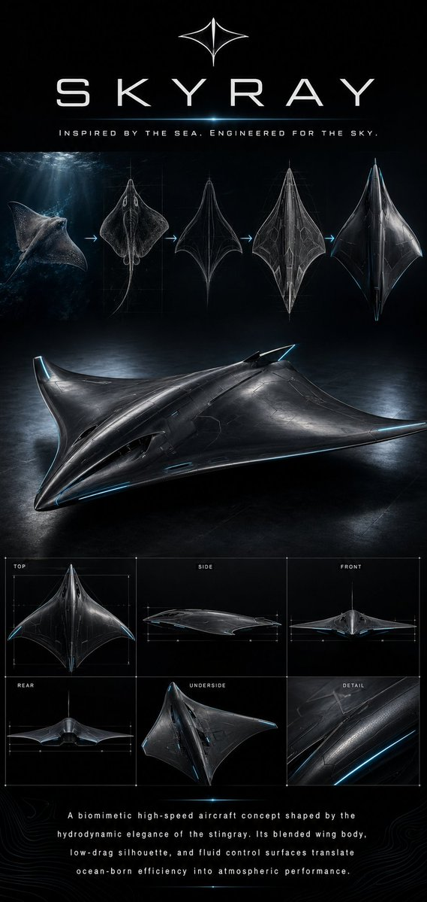 |

**Prompt:**

```
{"type":"biomimetic aerospace concept poster","subject":{"vehicle":"futuristic aircraft concept","name":"{argument name=\"vehicle name\" default=\"SKYRAY\"}","inspiration":"{argument name=\"animal inspiration\" default=\"stingray\"}","design":"blended-wing-body aircraft shaped like a manta ray or stingray, wide triangular planform, smooth organic curves, sharp pointed nose, slightly raised central spine, tapered wing tips curling subtly upward, dark graphite-black metallic skin with fine panel lines and faint blue illuminated accents along edges and seams"},"style":{"mood":"premium futuristic industrial design presentation","rendering":"hyper-detailed cinematic 3D concept art mixed with blueprint visualization","color_palette":"black, charcoal, gunmetal, silver, deep ocean blue, electric cyan highlights","lighting":"low-key dramatic studio lighting with glossy reflections, cool rim light, subtle underwater ambience in the top inspiration strip"},"layout":{"background":"full black poster with faint technical grid lines and soft vignetting","sections":[{"title":"header","position":"top","count":3,"labels":["emblem mark","SKYRAY","INSPIRED BY THE SEA. ENGINEERED FOR THE SKY."]},{"title":"evolution strip","position":"upper middle","count":5,"labels":["realistic stingray underwater at far left","top-view biological stingray study","abstract aerodynamic line sketch","faceted aircraft blueprint transition drawing","final sleek aircraft concept at far right"]},{"title":"hero render","position":"center","count":1,"labels":["large three-quarter view of the aircraft"]},{"title":"technical views grid","position":"lower middle","count":6,"labels":["TOP","SIDE","FRONT","REAR","UNDERSIDE","DETAIL"]},{"title":"footer text","position":"bottom","count":1,"labels":["{argument name=\"body text\" default=\"A biomimetic high-speed aircraft concept shaped by the hydrodynamic elegance of the stingray. Its blended wing body, low-drag silhouette, and fluid control surfaces translate ocean-born efficiency into atmospheric performance.\"}"]}],"technical views":{"TOP":"top orthographic view with measurement ticks","SIDE":"thin side profile with long smooth belly curve","FRONT":"front orthographic view emphasizing broad wingspan and central cockpit hump","REAR":"rear orthographic view showing narrow tail end and wing sweep","UNDERSIDE":"underside three-quarter view","DETAIL":"close-up crop of metallic skin, seam lines, and glowing blue edge strip"}},"graphics":{"logo":"minimal four-point symmetrical emblem above title, resembling a stylized ray silhouette","arrows":"4 thin cyan arrows connecting the 5 stages in the evolution strip","typography":"widely spaced modern sans-serif uppercase text, clean luxury-tech branding"},"camera":{"hero render":"slightly elevated front-left three-quarter angle","technical views":"orthographic","inspiration image":"underwater side angle with light rays from above"},"quality":"ultra-clean, polished, high contrast, sharp, poster-ready, concept design board for aerospace branding or speculative industrial design"}
```

<!-- Case 120: Taoist Three Souls Seven Po Poster (by @leyu37829) -->
### Case 120: [Taoist Three Souls Seven Po Poster](https://x.com/leyu37829/status/2048125950681075833) (by [@leyu37829](https://x.com/leyu37829))

| Output |
| :----: |
| 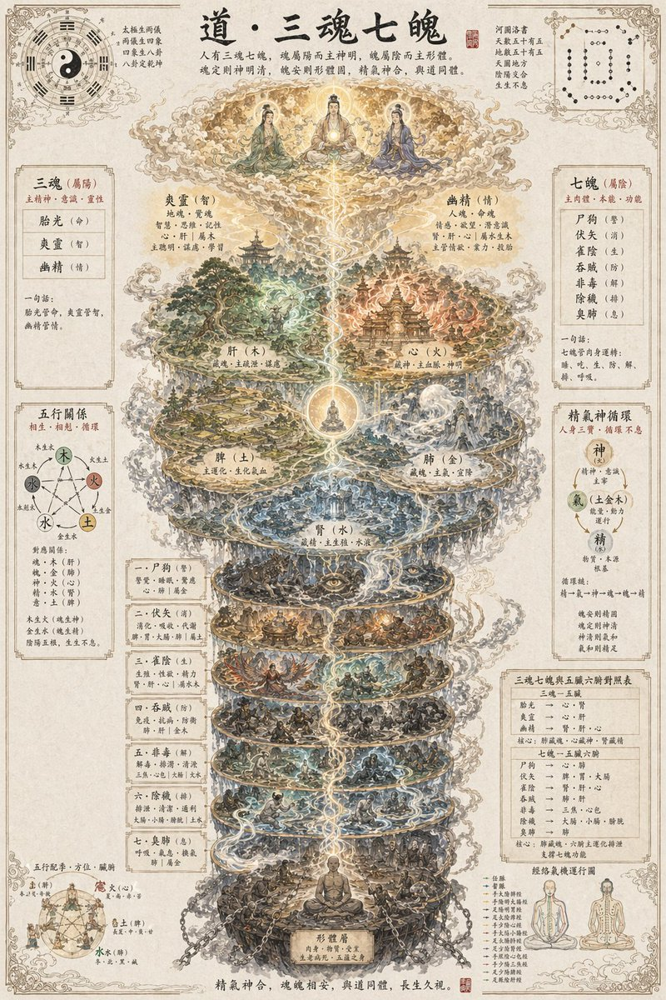 |

**Prompt:**

```
A highly detailed vertical Taoist esoteric infographic poster in the style of an ancient Chinese religious scroll, printed on aged beige rice paper with fine ornamental borders, inked calligraphy, faded stains, and classical diagram annotations. At the top center, large black brush-calligraphy title text reads {argument name="headline text" default="道·三魂七魄"}. Directly below the title is a smaller paragraph of classical Chinese explanatory text in neat calligraphy. The composition is perfectly symmetrical and centered on a glowing vertical spiritual axis made of white-gold energy, mist, and lightning-like qi currents running from the bottom of the page to the heavens. At the very top, above the axis, depict 3 seated Taoist immortals or deities on clouds in a golden celestial realm, arranged left, center, and right, with halos and flowing robes in muted green, cream, and blue. Beneath them, create a towering multi-layered cosmological body diagram made of 9 stacked circular realms or platforms connected by swirling clouds and luminous energy. The upper 5 larger realms represent the five zang organs as miniature mythic landscapes: 1 forested green realm labeled liver/wood, 1 fiery red-gold temple city realm labeled heart/fire, 1 yellow earth realm with terraces labeled spleen/earth, 1 silver-blue mountain-and-water realm labeled lung/metal, and 1 dark blue watery abyss realm labeled kidney/water. Place a glowing meditating figure in a bright orb at the center junction between the upper organ realms and lower spirit layers. Below these, add 7 progressively darker circular underworld-like realms for the seven po souls, each densely populated with tiny scenes of human figures, spirits, beasts, ritual activity, suffering, temptation, conflict, and karmic symbolism, all wrapped by drifting smoke and energy ribbons. At the very bottom, show a seated human figure in meditation within a root-like cavern or corporeal foundation, surrounded by chains, rocks, and embodied worldly attachments. Around the central column, include exactly 9 labeled side panels and diagrams in traditional Chinese layout: top left a bagua and yin-yang cosmology circle; top right a dotted numerological or constellation-like chart; left upper a boxed list for 3 souls; right upper a boxed list for 7 po souls; left middle a five-elements relationship diagram with 5 colored nodes; right middle a circular essence-qi-spirit cycle diagram with 3 nodes; left lower a vertical boxed list of 7 categories or stages; right lower a boxed correspondence table; bottom left a five-direction and five-element human-body relation chart; bottom right a standing and seated meridian or cultivation body diagram. Use many small Chinese labels throughout every section, with classical seal stamps in red. The overall palette is antique parchment, sepia ink, muted jade, cinnabar red, smoky gray, gold, teal, and indigo. The style should feel like a museum-quality Daoist metaphysical chart, ultra intricate, hand-painted gongbi plus ink wash illustration, sacred, mystical, scholarly, dense with symbolism, extremely fine linework, soft cloud layering, and high-resolution poster design.
```

<!-- Case 121: Vintage Claude Shannon Infographic Poster (by @mob_17) -->
### Case 121: [Vintage Claude Shannon Infographic Poster](https://x.com/mob_17/status/2048118645017219381) (by [@mob_17](https://x.com/mob_17))

| Output |
| :----: |
| 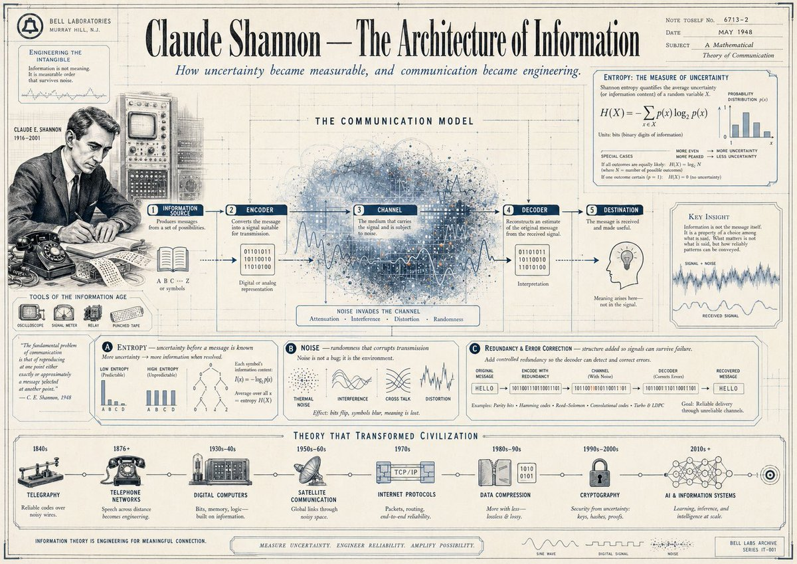 |

**Prompt:**

```
{"type":"vintage editorial infographic poster","subject":"Claude Shannon and information theory","style":{"era":"1940s Bell Labs archival poster","look":"aged cream paper, blueprint drafting grid, thin ink linework, muted navy and charcoal printing, subtle stains and paper wear, technical illustration mixed with newspaper editorial design","rendering":"high-detail diagrammatic collage with engraved portrait, scientific charts, labeled panels, and hand-drawn signal graphics"},"poster":{"headline":"Claude Shannon — The Architecture of Information","subheadline":"How uncertainty became measurable, and communication became engineering.","topRightMeta":{"note":"NOTE TOSELF No. 6713–2","date":"MAY 1948","subject":"A Mathematical Theory of Communication"}},"layout":{"sections":[{"title":"left archival sidebar","position":"far left vertical column","count":5,"labels":["BELL LABORATORIES MURRAY HILL, N.J.","ENGINEERING THE INTANGIBLE","CLAUDE E. SHANNON 1916–2001","TOOLS OF THE INFORMATION AGE","quote panel"]},{"title":"THE COMMUNICATION MODEL","position":"upper middle wide panel","count":5,"labels":["1 INFORMATION SOURCE","2 ENCODER","3 CHANNEL","4 DECODER","5 DESTINATION"]},{"title":"ENTROPY: THE MEASURE OF UNCERTAINTY","position":"upper right box","count":4,"labels":["H(X) = −Σ p(x) log2 p(x)","PROBABILITY DISTRIBUTION p(x)","MORE EVEN MORE MAXED UNCERTAINTY","MORE LOPSIDED LESS UNCERTAINTY"]},{"title":"lower theory panels","position":"middle to lower band","count":3,"labels":["A ENTROPY — uncertainty before a message is known","B NOISE — randomness that corrupts transmission","C Redundancy & Error Correction — structure added so signals can survive failure"]},{"title":"THEORY THAT TRANSFORMED CIVILIZATION","position":"bottom horizontal timeline","count":8,"labels":["1840s TELEGRAPHY","1876+ TELEPHONE NETWORKS","1930s–40s DIGITAL COMPUTERS","1950s–60s SATELLITE COMMUNICATION","1970s INTERNET PROTOCOLS","1980s–90s DATA COMPRESSION","1990s–2000s CRYPTOGRAPHY","2010s+ AI & INFORMATION SYSTEMS"]}],"centerpiece":"a large abstract cloud of blue and gray signal noise, dots, lines, and waveforms behind the communication model, with arrows moving left to right through the five stages"},"visualElements":{"portrait":{"subject":"{argument name=\"scientist name\" default=\"Claude Shannon\"}","placement":"left-center","style":"black-and-white archival seated portrait at a desk with the face intentionally obscured by a pale square censor block, wearing suit and tie, writing on paper"},"objectsLeft":["rotary telephone on desk","open notebook or papers","technical console with CRT screen and knobs behind portrait","small icon row of 4 tools: oscilloscope, signal meter, relay, punched tape"],"communicationModel":["book and symbols under source","binary digits under encoder","large noisy channel cloud with wave overlays","binary digits and interpretation under decoder","light bulb icon under destination"],"chartsAndDiagrams":["bar chart for entropy probabilities","two low vs high entropy mini bar charts","tree diagram and entropy notation","signal distortion sketches labeled thermal noise, cross talk, distortion","error-correction binary pipeline from original message to recovered message"],"bottomDecor":["small waveform legend with sine wave, digital signal, and noise","archival stamp or footer on lower right"]},"color":{"background":"warm ivory paper","primaryInk":"dark navy","secondaryInk":"charcoal gray","accent":"faded steel blue"},"composition":"symmetrical wide poster with dense boxed annotations, fine border lines, and a museum-quality educational infographic feel","textDensity":"very high, with many small labels, formulas, captions, and historical notes in a carefully organized grid","aspectRatio":"16:9 landscape"}
```

<!-- Case 122: Ink-Wash Tribute Poster for Chen Uen (by @mob_17) -->
### Case 122: [Ink-Wash Tribute Poster for Chen Uen](https://x.com/mob_17/status/2048118645017219381) (by [@mob_17](https://x.com/mob_17))

| Output |
| :----: |
| 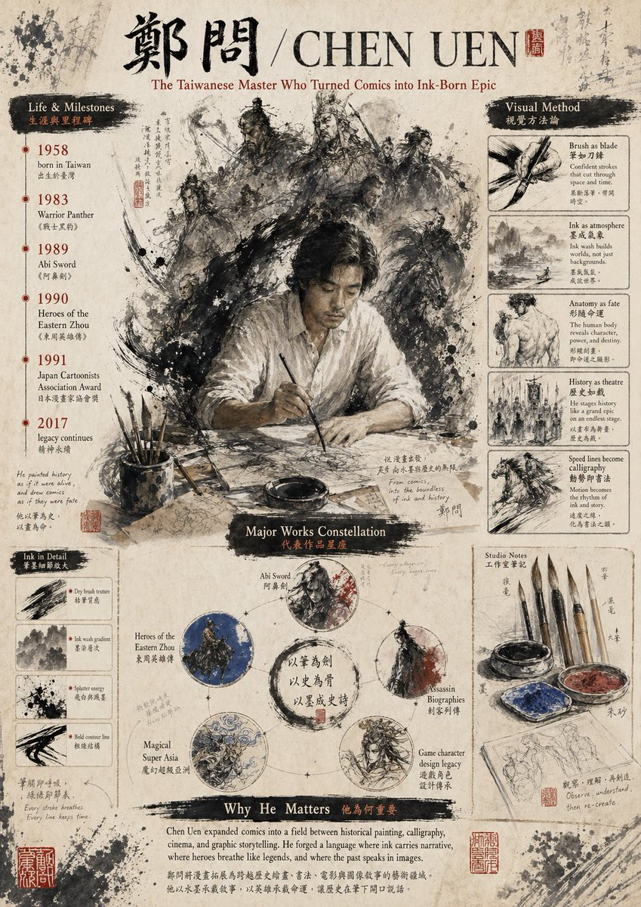 |

**Prompt:**

```
Create a vintage editorial poster on aged rice paper celebrating {argument name="artist name" default="CHEN UEN"}, designed like a museum infographic mixed with Chinese ink wash illustration and calligraphy. The format is a single vertically oriented poster with a weathered parchment background, ink splatters, faded handwritten annotations, red seal stamps, and a scholarly, archival atmosphere. At the very top, place large black Chinese calligraphy for the name 鄭問, followed by a slash and the romanized name {argument name="romanized name" default="CHEN UEN"} in large serif capitals, with a small red seal beside it. Under the title, add the subtitle {argument name="subtitle text" default="The Taiwanese Master Who Turned Comics into Ink-Born Epic"} in elegant reddish-brown serif text. In the center, feature a dramatic painterly scene of 1 seated male artist in a loose white shirt at a desk, holding a brush over paper, his face intentionally obscured by a soft rectangular blur. Behind him, surround him with a swirling halo-like storm of monochrome ink-brush warriors and historical figures: exact count 9 visible character figures, including armored generals, swordsmen, and mounted riders, emerging from explosive black brushwork and smoke-like ink textures. On the left side, create a vertical section titled “Life & Milestones” with a black brushstroke header and smaller Chinese subtitle text. List exactly 6 timeline entries with red year markers and bilingual captions: 1958 born in Taiwan, 1983 Warrior Panther, 1989 Abi Sword, 1990 Heroes of the Eastern Zhou, 1991 Japan Cartoonists Association Award, 2017 legacy continues. Below that, add a small section titled “Ink in Detail” containing exactly 4 boxed brush studies labeled with short English captions: Dry brush texture, Ink wash gradient, Splatter energy, Bold contour line. On the right side, create a vertical section titled “Visual Method” with a black brushstroke header and smaller Chinese subtitle text. Include exactly 5 stacked boxed studies with image-and-caption layout: Brush as blade, Ink as atmosphere, Anatomy as fate, History as theatre, Speed lines become calligraphy. In the lower center, create a section titled “Major Works Constellation” with a dark brushstroke heading. Arrange exactly 5 circular work nodes around a central ink ring with Chinese calligraphy inside. Label the 5 nodes: Abi Sword, Heroes of the Eastern Zhou, Assassin Biographies, Magical Super Asia, Game character design legacy. Each circle contains a distinct monochrome or muted-color ink illustration, with subtle connecting marks like a constellation diagram. At the lower right, add a section titled “Studio Notes” containing exactly 6 visible objects: 4 hanging calligraphy brushes, 1 ink bowl, and 1 painter’s palette with blue and red pigment; beneath them place a sketchbook page with light pencil figure studies. Across the bottom, add a wide section titled “Why He Matters” with a black brushstroke header and smaller Chinese subtitle text, followed by a paragraph of serif body text in English describing his importance to comics, painting, calligraphy, cinema, and epic storytelling. Use a restrained palette of sepia, black ink, off-white paper, muted gray, with small accents of deep red and occasional blue. The whole image should feel like a refined cultural tribute poster, dense but balanced, highly detailed, painterly, and authentic to Chinese ink aesthetics.
```

<!-- Case 123: Water Signs Zodiac Character Poster (by @komorimedia) -->
### Case 123: [Water Signs Zodiac Character Poster](https://x.com/komorimedia/status/2048114825398731143) (by [@komorimedia](https://x.com/komorimedia))

| Output |
| :----: |
| 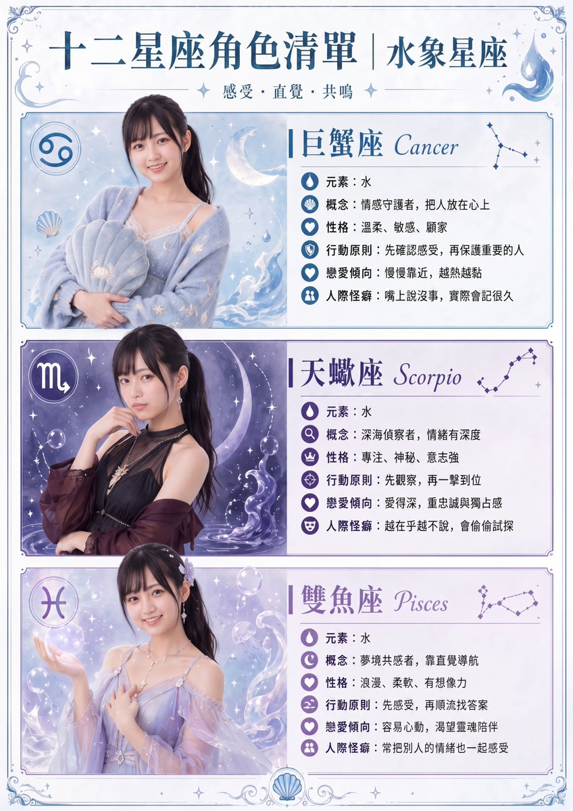 |

**Prompt:**

```
{"type":"Chinese zodiac-style character infographic poster","subject":"twelve zodiac character list, water signs edition","language":"Traditional Chinese","format":"vertical poster","style":{"overall":"elegant anime-inspired character catalog with editorial infographic layout","rendering":"soft polished digital illustration, pastel gradients, delicate sparkles, ornamental border design","mood":"dreamy, celestial, refined, feminine, aquatic"},"canvas":{"aspect_ratio":"2:3","background":"very light pearl white with pale blue-lavender tint, subtle texture, thin decorative frame with filigree corners and tiny stars"},"header":{"title":"{argument name=\"headline text\" default=\"十二星座角色清單|水象星座\"}","subtitle":"感受・直覺・共鳴","icons":["small stars","water droplet emblem in top right","curled cloud-like line art in top left"]},"layout":{"sections_count":3,"sections":[{"title":"巨蟹座 Cancer","position":"top panel","theme_color":"powder blue","zodiac_symbol":"Cancer glyph inside circle at left","constellation":"Cancer constellation at upper right","count":6,"labels":["元素:水","概念:情感守護者,把人放在心上","性格:溫柔、敏感、顧家","行動原則:先確認感受,再保護重要的人","戀愛傾向:慢慢靠近,越熟越黏","人際怪癖:嘴上說沒事,實際會記很久"],"character":{"identity":"same young woman model reimagined as zodiac character","pose":"half-body portrait, facing forward, arms gently wrapped around a large seashell pillow","hair":"long dark hair in a low ponytail","outfit":"light blue celestial slip dress with lace trim and sheer cardigan embroidered with stars and moons","accessories":"minimal jewelry","background":"soft blue night sky with crescent moon, seashell, sparkling stars, stylized ocean wave and tiny water droplets"}},{"title":"天蠍座 Scorpio","position":"middle panel","theme_color":"deep violet","zodiac_symbol":"Scorpio glyph inside circle at left","constellation":"Scorpio constellation at upper right","count":6,"labels":["元素:水","概念:深海偵察者,情緒有深度","性格:專注、神秘、意志強","行動原則:先觀察,再一擊到位","戀愛傾向:愛得深,重忠誠與獨占感","人際怪癖:越在乎越不說,會偷偷試探"],"character":{"identity":"same young woman model reimagined as zodiac character","pose":"half-body portrait, one hand near chin in a composed, enigmatic gesture","hair":"long dark ponytail","outfit":"black semi-sheer dress with gothic details and a dark plum off-shoulder shawl","accessories":"dangling earrings and layered necklace","background":"dark purple celestial sea scene with crescent moon, bubbles, stars, and curling misty water shapes"}},{"title":"雙魚座 Pisces","position":"bottom panel","theme_color":"lavender","zodiac_symbol":"Pisces glyph inside circle at left","constellation":"Pisces constellation at upper right","count":6,"labels":["元素:水","概念:夢境共感者,靠直覺導航","性格:浪漫、柔軟、有想像力","行動原則:先感受,再順流找答案","戀愛傾向:容易心動,渴望靈魂陪伴","人際怪癖:常把別人的情緒也一起感受"],"character":{"identity":"same young woman model reimagined as zodiac character","pose":"half-body portrait, one hand lifted as if balancing floating bubbles, other hand resting lightly at chest","hair":"long dark ponytail with a pale flower hair ornament","outfit":"translucent lavender fantasy dress with soft draped sleeves and shimmering fabric","accessories":"delicate earrings and necklace","background":"pale lilac underwater-celestial blend with bubbles, sparkles, and flowing translucent wave forms"}}],"dividers":"three horizontal framed panels with thin ornamental borders"},"footer":{"center_icon":"small blue seashell emblem","decorations":["tiny stars","fine scrollwork"]},"constraints":["all three zodiac entries must use the same woman as the base character with different styling, clothing, pose, and mood","text should be clean, editorial, and readable","each panel should clearly separate illustration area on the left and text block on the right","maintain cohesive water-element theme across all 3 signs","do not include the other nine zodiac signs in this image"]}
```

<!-- Case 124: Earth Signs Zodiac Character Poster (by @komorimedia) -->
### Case 124: [Earth Signs Zodiac Character Poster](https://x.com/komorimedia/status/2048114825398731143) (by [@komorimedia](https://x.com/komorimedia))

| Output |
| :----: |
| 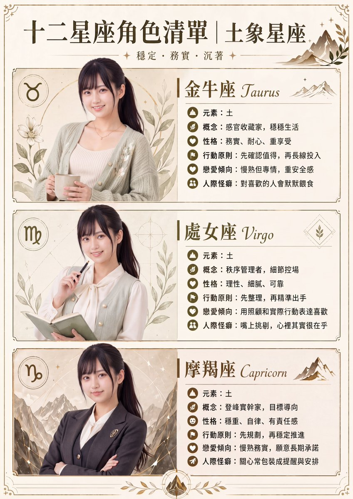 |

**Prompt:**

```
{"type":"vintage zodiac character infographic poster","theme":"earth signs only","language":"Traditional Chinese","style":{"overall":"elegant editorial infographic with soft anime-inspired live-action portrait compositing","palette":"warm beige, cream, taupe, olive-gray, muted brown, antique gold","mood":"stable, refined, calm, practical","texture":"aged paper background with subtle speckles and thin ornamental borders","rendering":"clean high-resolution print poster, soft lighting, delicate botanical and celestial line art"},"poster":{"orientation":"vertical","aspect_ratio":"3:4","title":"十二星座角色清單|土象星座","subtitle":"穩定・務實・沉著","decorations":["ornamental corner filigree","small gold sparkles","botanical branches","mountain illustrations","thin panel dividers"],"sections_count":3},"layout":{"sections":[{"title":"金牛座 Taurus","position":"top","count":1,"labels":["元素:土","概念:感官收藏家,穩穩生活","性格:務實、耐心、重享受","行動原則:先確認值得,再長線投入","戀愛傾向:慢熱但專情,重安全感","人際怪癖:對喜歡的人會默默餵食"]},{"title":"處女座 Virgo","position":"middle","count":1,"labels":["元素:土","概念:秩序管理者,細節控場","性格:理性、細膩、可靠","行動原則:先整理,再精準出手","戀愛傾向:用照顧和實際行動表達喜歡","人際怪癖:嘴上挑剔,心裡其實很在乎"]},{"title":"摩羯座 Capricorn","position":"bottom","count":1,"labels":["元素:土","概念:登峰實幹家,目標導向","性格:穩重、自律、有責任感","行動原則:先規劃,再穩定推進","戀愛傾向:慢熟務實,願意長期承諾","人際怪癖:關心常包裝成提醒與安排"]}],"centerpiece":"three stacked horizontal character cards, each with a portrait on the left and text profile on the right"},"character":{"identity":"the same young East Asian woman appears in all 3 sections","age":"early 20s","hair":"long dark brown to black hair in a low ponytail with side part","face":"soft feminine features, natural makeup, calm expression","customization":"keep the same base character across all zodiac entries, differentiated by wardrobe, pose, props, and themed background motifs"},"cards":[{"sign":"Taurus","symbol":"♉","portrait":{"pose":"waist-up, slightly turned, holding a ceramic mug with both hands","outfit":"cream knit sleeveless top under a soft sage-gray cardigan with delicate floral embroidery","expression":"gentle, relaxed, nurturing","props_count":1,"props":["mug"]},"background":"large pale circular halo, floral branch illustration, soft botanical motifs, small mountain drawing in upper right","visual_concept":"comfort, sensuality, domestic calm, slow living"},{"sign":"Virgo","symbol":"♍","portrait":{"pose":"waist-up, one hand holding a pen near the chin, the other arm holding an open notebook or planner","outfit":"light cream blouse with a bow tie collar under a pale sage vest with gold buttons","expression":"thoughtful, analytical, composed","props_count":2,"props":["pen","notebook"]},"background":"fine geometric diagram lines, botanical sprigs, diamond emblem with leaf motif","visual_concept":"order, precision, intelligence, organization"},{"sign":"Capricorn","symbol":"♑","portrait":{"pose":"waist-up, arms crossed, confident upright stance","outfit":"charcoal tailored blazer over a dark vest and crisp white shirt, small round lapel pin","expression":"serious, disciplined, self-assured","props_count":0,"props":[]},"background":"dramatic layered mountain landscape in sepia tones with subtle star-like sparkles","visual_concept":"ambition, endurance, authority, climbing toward goals"}],"typography":{"title_font":"classic high-contrast serif Chinese type","sign_name_font":"large bold Chinese serif with elegant italic Latin zodiac name","body_font":"clean readable Chinese print font","icon_style":"filled circular brown icons next to each bullet line"},"composition":{"margin":"generous cream margins","panel_style":"rounded rectangular panels with thin gold-brown borders","spacing":"even vertical stacking with narrow separators","text_alignment":"left-aligned profile bullets on the right side of each card"}}
```

<!-- Case 125: Fire Sign Zodiac Character Poster (by @komorimedia) -->
### Case 125: [Fire Sign Zodiac Character Poster](https://x.com/komorimedia/status/2048114825398731143) (by [@komorimedia](https://x.com/komorimedia))

| Output |
| :----: |
| 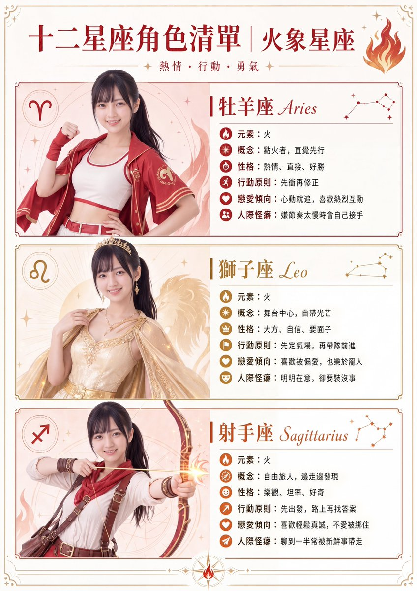 |

**Prompt:**

```
A polished vertical infographic poster in elegant East Asian editorial style, themed around the fire signs of the zodiac using one consistent female character reimagined in three different costumes. Cream parchment background with thin ornamental borders, small corner flourishes, tiny sparkles, and warm red-orange-gold accents throughout. Large Chinese headline at the top reading {argument name="headline text" default="十二星座角色清單|火象星座"}, with a smaller subheading beneath reading {argument name="subheading text" default="熱情・行動・勇氣"}, and a decorative flame icon at the top right. The layout contains exactly 3 stacked profile panels with rounded rectangular borders and generous margins: Aries on top, Leo in the middle, Sagittarius on the bottom. Each panel is split visually with the character on the left and a text/spec area on the right, plus a zodiac symbol badge on the far left and a small constellation diagram on the far right.

Use the same young East Asian woman in all 3 panels, slim build, long dark hair in a high ponytail, shown from about thigh-up to waist-up, facing slightly toward camera, styled as a fashion-model zodiac character sheet. Keep facial features neutral and refined, clean beauty lighting, soft airbrushed illustration-photo composite look.

Panel 1: Aries. Chinese title and English subtitle: "牡羊座 Aries". Dominant color scheme: vivid red with warm coral highlights. Zodiac symbol badge shows Aries glyph. Constellation on the right. Behind the character, faint circular mystical line art and flame motifs. Outfit: sporty warrior idol styling with a white crop top, red open short-sleeve jacket with gold trim, red belt, and red wrist wraps or fingerless arm accessories. Pose: confident, energetic, one fist raised near the shoulder and the other hand on her hip. Include exactly 6 info lines with small circular icons before each line, all in Chinese: 1) "元素:火" 2) "概念:點火者,直覺先行" 3) "性格:熱情、直接、好勝" 4) "行動原則:先衝再修正" 5) "戀愛傾向:心動就追,喜歡熱烈互動" 6) "人際怪癖:嫌節奏太慢時會自己接手".

Panel 2: Leo. Chinese title and English subtitle: "獅子座 Leo". Dominant color scheme: gold, champagne, and soft amber. Zodiac symbol badge shows Leo glyph. Constellation on the right. Background includes radiant sunburst styling and a faint majestic lion illustration silhouette behind the character. Outfit: glamorous regal gown in pale gold with ornate embroidery, jeweled bodice details, flowing translucent cape sleeves, elegant necklace, and a small crown or tiara. Pose: poised and queenly, one hand lightly touching the chest or collarbone, shoulders open, projecting confidence and star power. Include exactly 6 info lines with small circular icons before each line, all in Chinese: 1) "元素:火" 2) "概念:舞台中心,自帶光芒" 3) "性格:大方、自信、要面子" 4) "行動原則:先定氣場,再帶隊前進" 5) "戀愛傾向:喜歡被偏愛,也樂於寵人" 6) "人際怪癖:明明在意,卻要裝沒事".

Panel 3: Sagittarius. Chinese title and English subtitle: "射手座 Sagittarius". Dominant color scheme: rust red, burnt orange, brown leather, and warm ivory. Zodiac symbol badge shows Sagittarius glyph. Constellation on the right. Background features faint compass-circle graphics and flame accents. Outfit: adventurous archer styling with an ivory blouse, red scarf, brown leather harness straps, utility belt, and arm bracers. Pose: dynamic action shot drawing a bow, arrow aimed to the right, with a small glowing spark at the bow grip or arrow rest. Include exactly 6 info lines with small circular icons before each line, all in Chinese: 1) "元素:火" 2) "概念:自由旅人,邊走邊發現" 3) "性格:樂觀、坦率、好奇" 4) "行動原則:先出發,路上再找答案" 5) "戀愛傾向:喜歡輕鬆真誠,不愛被綁住" 6) "人際怪癖:聊到一半常被新鮮事帶走".

Overall design should feel premium, feminine, mystical, and collectible, like a social-media-ready zodiac character list poster. Use elegant serif-style Chinese typography for the main sign names and italic calligraphic English for Aries, Leo, and Sagittarius. Keep all text crisp, aligned, and readable. Add one small decorative fire emblem centered near the bottom border. Aspect ratio 3:4 portrait.
```

<!-- Case 126: Air Sign Zodiac Character Poster (by @komorimedia) -->
### Case 126: [Air Sign Zodiac Character Poster](https://x.com/komorimedia/status/2048114825398731143) (by [@komorimedia](https://x.com/komorimedia))

| Output |
| :----: |
| 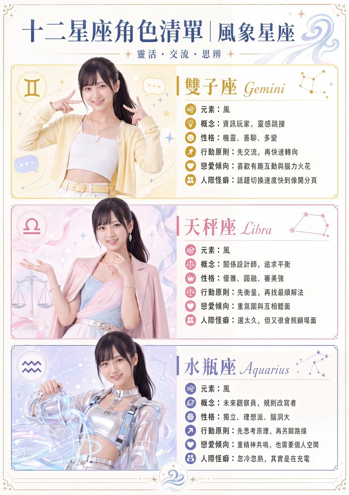 |

**Prompt:**

```
{"type":"Chinese zodiac-themed character infographic poster","format":"vertical poster","aspect_ratio":"3:4","style":"clean pastel editorial infographic with anime-inspired fashion photography, soft magical accents, elegant horoscope design, premium magazine layout","background":{"color":"warm ivory","border":"thin decorative gold frame with small ornamental corners and tiny sparkles","top_right_motif":"large pale air-element swirl ornament"},"title_block":{"headline":"十二星座角色清單|風象星座","subheadline":"靈活・交流・思辨","alignment":"top center","headline_color":"deep desaturated blue","subheadline_color":"muted gold"},"subject":{"count":3,"description":"the same young East Asian woman used as the base character appears in 3 separate horoscope panels, each shown from about thigh-up to waist-up with long dark hair and soft feminine styling, photographed frontally and integrated into illustrated pastel zodiac backdrops"},"layout":{"sections":[{"title":"雙子座 Gemini","position":"top panel","count":1,"theme_color":"butter yellow and cream","zodiac_symbol":"Gemini glyph inside a circle on the left","constellation":"small Gemini constellation in the upper right","character_pose":"playful double peace signs raised beside her face","outfit":"pale yellow cardigan over a white ribbed crop top, light bottoms, yellow belt, delicate necklace","background_motifs_count":4,"background_motifs":["speech bubble icon","sparkles","curved flowing lines","soft dots"],"text_items_count":6,"text_items":["元素:風","概念:資訊玩家,靈感跳接","性格:機靈、善聊、多變","行動原則:先交流,再快速轉向","戀愛傾向:喜歡有趣互動與腦力火花","人際怪癖:話題切換速度快到像開分頁"]},{"title":"天秤座 Libra","position":"middle panel","count":1,"theme_color":"blush pink and pastel lavender","zodiac_symbol":"Libra glyph inside a circle on the left","constellation":"small Libra constellation in the upper right","character_pose":"one hand raised open-palmed as if presenting balance, the other hand near her chin in an elegant thoughtful pose","outfit":"pink blazer draped over shoulders, pastel pink-and-blue wrapped dress, jeweled belt, earrings, necklace, bracelet","background_motifs_count":4,"background_motifs":["scales illustration","flowing ribbon-like swirls","sparkles","soft gradient haze"],"text_items_count":6,"text_items":["元素:風","概念:關係設計師,追求平衡","性格:優雅、圓融、審美強","行動原則:先衡量,再找最順解法","戀愛傾向:重氛圍與互相體面","人際怪癖:選太久,但又很會照顧場面"]},{"title":"水瓶座 Aquarius","position":"bottom panel","count":1,"theme_color":"lavender, icy blue, and silver","zodiac_symbol":"Aquarius glyph inside a circle on the left","constellation":"small Aquarius constellation in the upper right","character_pose":"holding and tilting a futuristic transparent vessel as glowing water-like energy pours out in looping streams","outfit":"metallic silver crop top and skirt set with translucent iridescent jacket, futuristic straps, reflective accessories","background_motifs_count":4,"background_motifs":["glowing circular energy rings","constellation lines","sparkles","light trails"],"text_items_count":6,"text_items":["元素:風","概念:未來觀察員,規則改革者","性格:獨立、理想派、腦洞大","行動原則:先思考原理,再另闢路線","戀愛傾向:重精神共鳴,也需要個人空間","人際怪癖:忽冷忽熱,其實是在充電"]}],"panel_count":3},"typography":{"languages":["Traditional Chinese","English zodiac names"],"headline_font":"elegant high-contrast serif","body_font":"clean legible Chinese serif or sans-serif hybrid","zodiac_english":"italic calligraphic serif"},"visual_rules":{"each_panel_has":8,"panel_elements":["left zodiac glyph badge","center-left character","right text block","English zodiac name","small constellation","pastel illustrated background motifs","thin panel border","6 bullet-style info lines with icons"],"spacing":"generous margins and symmetrical alignment","render_quality":"high resolution, crisp print-ready infographic"}}
```

<!-- Case 127: Ethnographic Plate for Tibetan Ceremonial Hat (by @degewa) -->
### Case 127: [Ethnographic Plate for Tibetan Ceremonial Hat](https://x.com/degewa/status/2048104569037783226) (by [@degewa](https://x.com/degewa))

| Output |
| :----: |
| 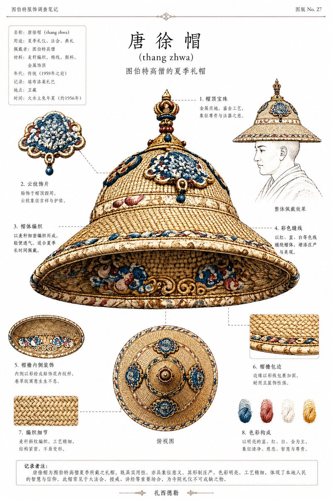 |

**Prompt:**

```
Using REFERENCE_0 and REFERENCE_1, create a clean ethnographic archive plate focused on the ceremonial hat. Use REFERENCE_0 as the historical Tibetan context and silhouette reference, and REFERENCE_1 as the color, material, and ornament reference for the hat. Isolate and reconstruct the hat as a museum-style object study, removing the seated body as the main subject. Present the hat on an off-white document page as a scholarly catalog sheet in Chinese with small romanization. Add 8 numbered callouts around the object with fine dashed leader lines, each pointing to a specific structural detail. The centerpiece should be one large three-quarter underside view of the hat. Also include exactly 4 supplementary views/details: 1 side-profile wearing sketch with a faint line-drawn bust, 1 underside interior view, 1 top-down view, and 2 square close-up material swatches. Add exactly 4 thread-color samples near the lower right: blue, red, white, and yellow. At the top center, add the large title {argument name="headline text" default="唐徐帽"} with the romanization {argument name="romanization" default="(thang zhwa)"} beneath it, plus a smaller subtitle describing it as a summer ceremonial hat of high-ranking Tibetan monks. In the upper left, add a boxed metadata panel with multiple short Chinese fields, and in the upper right add a plate number reading {argument name="plate number" default="图版 No. 27"}. At the bottom, add one bordered note paragraph in Chinese. Overall style: meticulous archival infographic, anthropological catalog illustration, historically informed, precise woven texture, ivory-gold base with blue and red ornament, elegant print layout, thin rules and decorative divider marks, high-detail object rendering on a plain paper background.
```

<!-- Case 128: Vintage PRS Guitar Lineage Poster (by @GlennHasABeard) -->
### Case 128: [Vintage PRS Guitar Lineage Poster](https://x.com/GlennHasABeard/status/2048087784141857235) (by [@GlennHasABeard](https://x.com/GlennHasABeard))

| Output |
| :----: |
| 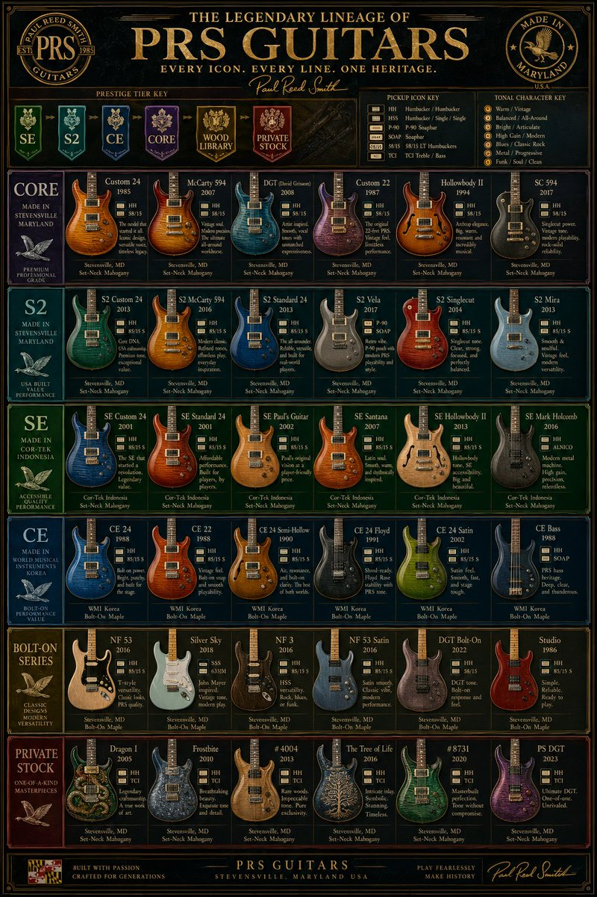 |

**Prompt:**

```
{"type":"luxury vintage guitar comparison infographic poster","subject":"a highly detailed, vertically oriented PRS electric guitar lineup chart designed like a premium museum poster or collector's reference board","style":"ornate, dark, glossy, high-contrast, gold-foil typography, elegant wood-and-metal textures, symmetrical grid layout, premium catalog aesthetic, subtle vintage patina, ultra sharp graphic design","branding":{"main headline":"THE LEGENDARY LINEAGE OF {argument name=\"brand name\" default=\"PRS GUITARS\"}","subheadline":"EVERY ICON. EVERY LINE. ONE HERITAGE.","signature":"Paul Reed Smith","left seal":"PAUL REED SMITH GUITARS","right seal":"MADE IN MARYLAND U.S.A."},"palette":{"background":"black and deep charcoal with dark figured wood accents","primary":"antique gold","secondary":"cream","accent colors":["deep green","teal","royal blue","purple","gold","burgundy"]},"layout":{"format":"single-page vertical poster","header":{"position":"top","elements":["large central title","small tagline below","script signature","2 circular emblems in upper left and upper right","3 horizontal legend boxes under the title"]},"sections":[{"title":"PRESTIGE TIER KEY","position":"upper left below title","count":6,"labels":["SE","S2","CE","CORE","WOOD LIBRARY","PRIVATE STOCK"]},{"title":"PICKUP ICON KEY","position":"upper center-right below title","count":7,"labels":["HH","HSH","P-90","SOAP","58/15","TCI","Bass"]},{"title":"TONAL CHARACTER KEY","position":"upper right below title","count":7,"labels":["Warm / Vintage","Balanced / All-around","Bright / Articulate","High Gain / Modern","Blues / Classic Rock","Metal / Progressive","Funk / Soul / Clean"]},{"title":"CORE","position":"first main row left label","count":7,"labels":["Custom 24","McCarty 594","DGT (David Grissom)","Custom 22","Hollowbody II","SC 594","row category panel"]},{"title":"S2","position":"second main row left label","count":6,"labels":["S2 Custom 24","S2 McCarty 594","S2 Standard 24","S2 Vela","S2 Singlecut","S2 Mira"]},{"title":"SE","position":"third main row left label","count":6,"labels":["SE Custom 24","SE Standard 24","SE Paul's Guitar","SE Santana","SE Hollowbody II","SE Mark Holcomb"]},{"title":"CE","position":"fourth main row left label","count":6,"labels":["CE 24","CE 22","CE 24 Semi-Hollow","CE 24 Floyd","CE 24 Satin","CE Bass"]},{"title":"BOLT-ON SERIES","position":"fifth main row left label","count":6,"labels":["NF 53","Silver Sky","NF 3","NF 53 Satin","DGT Bolt-On","Studio"]},{"title":"PRIVATE STOCK","position":"sixth main row left label","count":6,"labels":["Dragon I","Frostbite","#4004","The Tree of Life","#8731","PS DGT"]}],"footer":{"position":"bottom","elements":["small badge at lower left","centered company line","right-side script signature"]}},"content grid":{"total guitar models shown":37,"card design":"each product card contains a guitar render, model name, year, small pickup icons, a short descriptive blurb, and origin/wood specs at the bottom","row side panels":6},"visual details":{"guitars":"front-facing electric guitars with varied body shapes and highly polished figured maple tops, metallic and transparent finishes, some solid colors, some natural wood","typography":"all caps serif headlines, small serif body text, script signature accents","borders":"thin decorative gold rules around every panel and the full poster","lighting":"studio-lit instruments against dark panel backgrounds","render quality":"clean infographic precision with realistic product renders"},"camera":"straight-on flat poster view, no perspective distortion, centered composition","quality":"ultra detailed, print-ready, high-resolution editorial infographic, luxury brand poster"}
```

<!-- Case 129: Alishan One-Day Travel Poster (by @TWnese) -->
### Case 129: [Alishan One-Day Travel Poster](https://x.com/TWnese/status/2048077204786212887) (by [@TWnese](https://x.com/TWnese))

| Output |
| :----: |
| 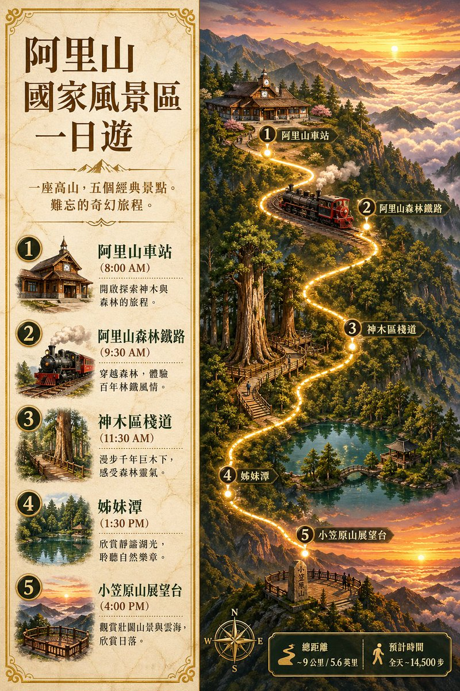 |

**Prompt:**

```
Create a vintage illustrated travel poster in traditional Chinese for {argument name="destination name" default="阿里山國家風景區"}, designed as a one-day itinerary infographic with a split vertical layout. The left panel is a parchment-textured itinerary card in warm beige with ornate gold Art Nouveau borders and dark brown typography, and the right panel is a dramatic painted fantasy-realism map scene of a mountain journey at sunrise and sunset tones. At the top of the left panel, large headline text reads {argument name="headline text" default="阿里山國家風景區一日遊"}. Beneath it, include a short centered tagline in traditional Chinese: 「一座高山,五個經典景點。難忘的奇幻旅程。」 with a small decorative mountain divider. The left panel must contain exactly 5 numbered itinerary stops stacked vertically, each with a circular black-and-gold number badge, a small vignette illustration, a bold location name, a time in parentheses, and a short Chinese description. The 5 stops are: 1. 「阿里山車站」 at 「(8:00 AM)」 with a wooden mountain railway station illustration and description 「開啟探索神木與森林的旅程。」 2. 「阿里山森林鐵路」 at 「(9:30 AM)」 with a red-and-black steam train illustration and description 「穿越森林,體驗百年林鐵風情。」 3. 「神木區棧道」 at 「(11:30 AM)」 with giant cedar trees and elevated wooden boardwalk illustration and description 「漫步千年巨木下,感受森林靈氣。」 4. 「姊妹潭」 at 「(1:30 PM)」 with a tranquil forest lake and pavilion illustration and description 「欣賞靜謐湖光,聆聽自然樂章。」 5. 「小笠原山展望台」 at 「(4:00 PM)」 with a wooden observation deck above clouds at sunset illustration and description 「觀賞壯闊山景與雲海,欣賞日落。」 The right panel should depict a continuous glowing golden path winding through exactly 5 numbered map markers that match the left panel labels in order, with black-and-gold marker plaques reading: 1 「阿里山車站」, 2 「阿里山森林鐵路」, 3 「神木區棧道」, 4 「姊妹潭」, 5 「小笠原山展望台」. Show stop 1 as a rustic alpine wooden station perched on a cliff among pine forests; stop 2 as a small steam locomotive traveling on a curved mountain railway with smoke drifting upward; stop 3 as towering ancient red cypress trees with a spiral and zigzag wooden walkway around the trunks; stop 4 as an emerald lake surrounded by dense forest with a small pavilion and arched bridge; stop 5 as a lookout deck on a peak above a sea of clouds, facing a glowing sunset. The environment should feature layered mountain ranges, mist-filled valleys, evergreen forests, golden-hour light, luminous cloud seas, and a romantic painterly atmosphere with rich detail. At the bottom right, add a decorative compass rose labeled N, E, S, W, plus a dark green and gold information box with exactly 2 stats in traditional Chinese: 「總距離 ~9公里 / 5.6英里」 and 「預計時間 全天 - 14,500步」. Overall style: premium tourism poster, painterly digital illustration, nostalgic national-park brochure aesthetic, highly detailed, warm sepia and gold accents, elegant composition, readable Chinese text, vertical 2:3 poster.
```

<!-- Case 130: Dance Movement Reference Sheet (by @Ciri_ai) -->
### Case 130: [Dance Movement Reference Sheet](https://x.com/Ciri_ai/status/2048074587955658848) (by [@Ciri_ai](https://x.com/Ciri_ai))

| Output |
| :----: |
| 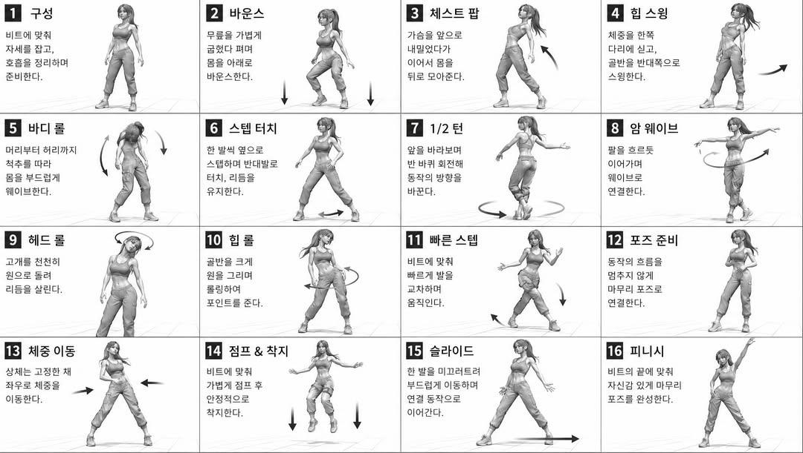 |

**Prompt:**

```
[STYLE]
monochromatic grayscale illustration, 3D rendered character, clean instructional reference sheet, 
white background, comic-style cell grid layout, technical diagram aesthetic

[LAYOUT]
4x4 grid layout, 16 panels total, each panel separated by thin black border lines, 
numbered cells from 1 to 16, consistent panel size

[CHARACTER]
{argument name="character" default="young female dancer, athletic build, ponytail hairstyle, crop top and baggy pants, sneakers"}, same character in all panels

[PANEL STRUCTURE - per cell]
top-left: bold number badge + {argument name="title" default="Korean title text"}
center: full-body character pose illustration
bottom-left: {argument name="description" default="Korean description text (3-4 lines)"}
overlay: directional arrows indicating movement direction

[ARROWS / MOTION INDICATORS]
curved arrows, straight arrows, circular rotation indicators, 
placed around the character to show movement flow and direction

[RENDERING STYLE]
high detail 3D sculpt style, soft studio lighting, subtle shadows, 
no color, grayscale shading, clean linework, game concept art quality

[NEGATIVE]
no background scenery, no color tones, no extra characters, 
no cluttered backgrounds
```

<!-- Case 131: Parody Luxury Product Advertisement (by @tonysimons_) -->
### Case 131: [Parody Luxury Product Advertisement](https://x.com/tonysimons_/status/2048057490940596595) (by [@tonysimons_](https://x.com/tonysimons_))

| Output |
| :----: |
|  |

**Prompt:**

```
High-impact parody e-commerce infographic for “{argument name="product" default="Four Loko"}” malt beverage. Foreground: An extreme close-up of a rough, weathered hand holding a tall, brightly colored can of {argument name="product" default="Four Loko"} toward the camera. The can is slightly cold with visible condensation droplets and a loud, chaotic flavor design. The hand and can have a slight macro-lens blur for depth, with the can still reading clearly as the hero product. Central Subject: In the mid-ground, a funny, disheveled {argument name="subject" default="homeless-looking man"} sitting casually on a milk crate in an urban alley. He has a scruffy beard, messy hair, layered worn clothing, and a huge unbothered grin. He should look chaotic but oddly charismatic, like the accidental king of bad decisions. He is posed like a confident lifestyle-ad model, proudly showing off the can. Background & Lighting: A ridiculously polished ad-style backdrop mixed with a grimy city alley setting. Soft-focus urban textures, dumpster shapes, graffiti hints, and scattered clutter in the distance. Add dramatic studio lighting, soft glow, rainbow prism flares, and subtle light leaks to make the whole thing look way too premium for the subject matter. A few blurred {argument name="product" default="Four Loko"} cans can float artistically in the background for extra absurdity. Typography & Layout (Bold sans-serif, white and neon accent styling): Top Center (Background): Massive, bold text reading “{argument name="brand name" default="FOUR LOKO"}” positioned behind the subject. Top Right: Bold text reading “The Champagne of Bad Ideas”. Mid-Left: “Premium chaos and zero self-control” Mid-Right: Large, bold “23” with the text “ounces of terrible decisions.” Bottom-Right: Large, bold “1" with the text “can to ruin tomorrow.” Optional small callout text near the bottom: “Now with more regret.” Style: Ultra-detailed, 8k parody commercial photography, sharp focus on the can, shallow depth of field, vibrant trashy color palette, clean advertising composition, exaggerated premium product-ad aesthetic, funny visual contrast between polished branding and the wrecked subject.
```

<!-- Case 132: Anime Museum Background Conversion (by @Dakiny) -->
### Case 132: [Anime Museum Background Conversion](https://x.com/Dakiny/status/2048175219966394695) (by [@Dakiny](https://x.com/Dakiny))

| Output |
| :----: |
| 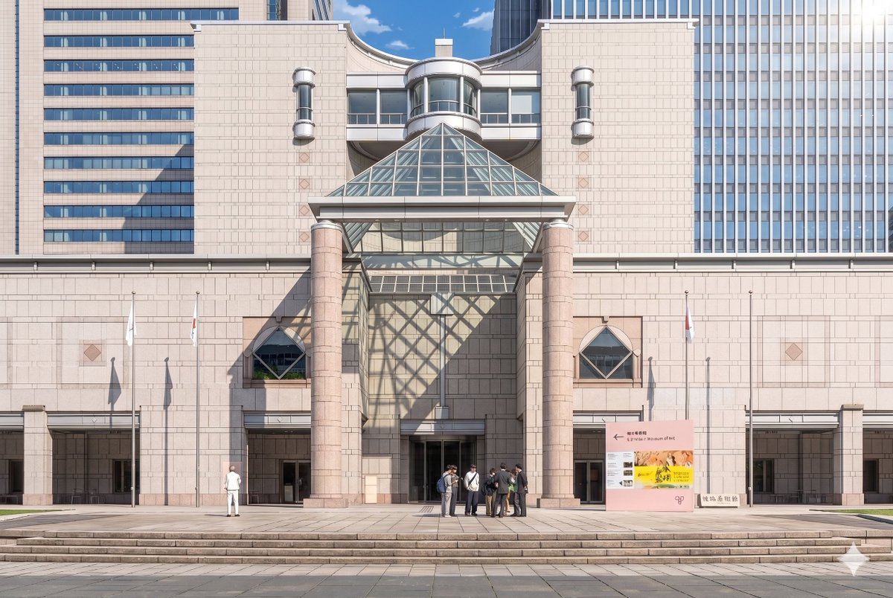 |

**Prompt:**

```
Using the provided reference photo, recreate the same museum facade and frontal composition as a polished theatrical anime background illustration. Keep the architecture, signage, 3 flagpoles, broad steps, and overall layout consistent, but convert the image from realistic photography into a highly detailed hand-painted anime film style with clean linework, soft cel shading, gentle pastel stone colors, and crisp atmospheric lighting. Add dramatic sunlight from the upper right so the glass pyramid casts a large geometric lattice shadow across the central wall and left side of the entrance. Simplify and stylize the people into anime background characters, keeping the 2 visible groups: 1 lone figure on the left and 1 small cluster of 7 people near the center-right entrance. Preserve the clear blue-sky daytime mood while making the scene feel elegant, refined, and cinematic.
```

<!-- Case 133: 16-Pose Dance Combat Reference Sheet (by @ExquisitMe) -->
### Case 133: [16-Pose Dance Combat Reference Sheet](https://x.com/ExquisitMe/status/2048143577264402629) (by [@ExquisitMe](https://x.com/ExquisitMe))

| Output |
| :----: |
| 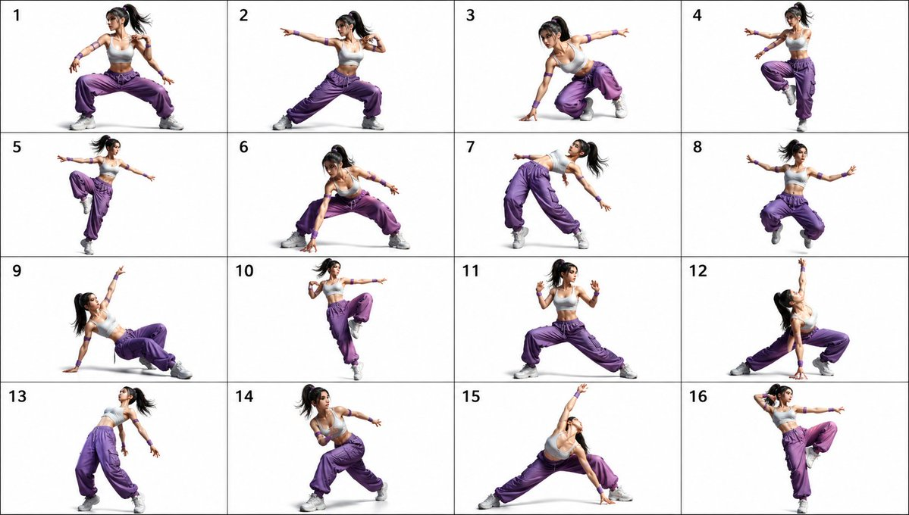 |

**Prompt:**

```
{"type":"pose reference sheet","subject":{"theme":"hip-hop dance and combat-ready movement chart","character":{"count":1,"gender_presentation":"female","age_appearance":"young adult","body_type":"fit athletic dancer","skin_tone":"light tan","hair":{"color":"black","style":"high ponytail with loose strands"},"outfit":{"count":5,"items":["white sports bra or cropped athletic top","baggy purple jogger pants","white chunky sneakers","purple wristbands or forearm bands on both arms","small hoop earrings"]}}},"style":{"image_type":"photorealistic studio pose sheet","lighting":"clean even studio lighting","background":"plain light gray to white seamless backdrop","camera":"full-body framing, straight-on view, consistent distance","rendering":"sharp realistic anatomy, dynamic motion, slight shadow under feet","face":"intentionally blurred or obscured"},"layout":{"grid":{"rows":4,"columns":4,"count":16},"numbering":{"count":16,"labels":["1","2","3","4","5","6","7","8","9","10","11","12","13","14","15","16"],"position":"top-left corner of each cell"},"cell_borders":"thin black divider lines between all panels"},"poses":{"count":16,"items":[{"label":"1","description":"wide low squat, knees bent outward, torso angled slightly left, both arms extended loosely in a defensive dance stance"},{"label":"2","description":"deep side lunge to the left, left arm pointing straight left, right hand near the head, energetic directional pose"},{"label":"3","description":"low crouch with one hand touching the floor, one knee bent under the body, opposite arm extended horizontally"},{"label":"4","description":"upright one-leg balance, left knee lifted high, both arms spread outward for rhythm and balance"},{"label":"5","description":"similar one-leg raised pose with the other leg supporting, arms stretched outward in a lighter dance variation"},{"label":"6","description":"very wide grounded squat, torso pitched forward, one hand reaching toward the floor between the legs, other arm extended back"},{"label":"7","description":"dramatic standing back arch, chest lifted upward, hips forward, both arms opened behind and to the sides"},{"label":"8","description":"small jump or suspended squat, both feet off the floor, knees bent, arms spread wide symmetrically"},{"label":"9","description":"floor-supported seated lean, one hand planted behind, one arm reaching diagonally upward, legs bent to one side"},{"label":"10","description":"front-facing balance with one knee raised to hip height, one arm bent in guard position and the other extended sideways"},{"label":"11","description":"deep lateral stance, feet far apart, knees bent, both hands raised open near shoulder level like a ready combat pose"},{"label":"12","description":"low side lunge split, one hand planted on the floor, the other arm reaching vertically overhead, torso arched upward"},{"label":"13","description":"standing backward lean with relaxed bent knees, chest up, arms hanging loosely behind in a groove pose"},{"label":"14","description":"compact twisting crouch, weight low over bent legs, torso rotated, one arm pulled in and the other extended outward"},{"label":"15","description":"very wide side lunge stretch, one hand to the floor near the front foot, opposite arm reaching diagonally overhead"},{"label":"16","description":"one-leg lifted pose with knee high, one hand behind the head and the other arm extended forward, confident finishing stance"}]},"composition":"show the same dancer in all 16 panels with consistent outfit and scale, centered within each frame, designed like a movement library or choreography reference chart"}
```

<!-- Case 134: 16-Panel Dance Pose Reference Sheet (by @ExquisitMe) -->
### Case 134: [16-Panel Dance Pose Reference Sheet](https://x.com/ExquisitMe/status/2048143577264402629) (by [@ExquisitMe](https://x.com/ExquisitMe))

| Output |
| :----: |
| 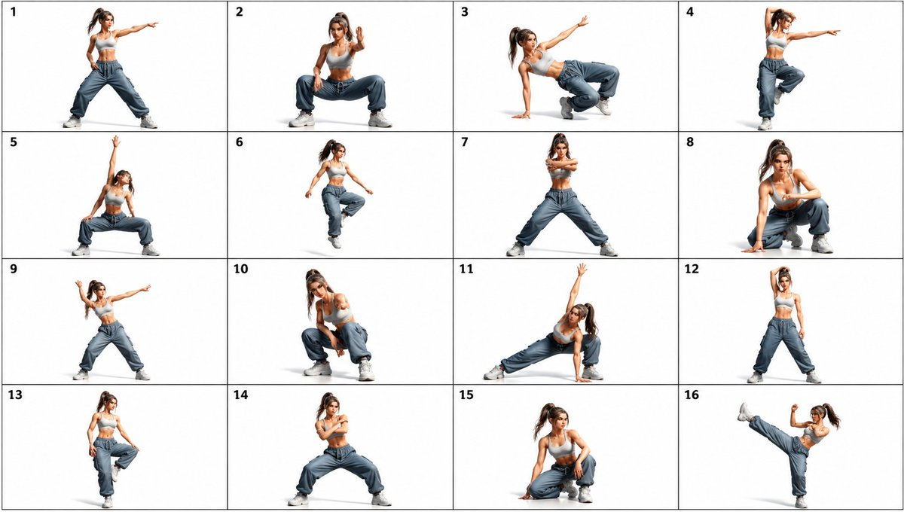 |

**Prompt:**

```
{"type":"dance pose reference sheet","style":"clean studio pose chart, photoreal fitness-dance reference, white seamless background, sharp full-body photography, soft even lighting, minimal shadows, thin black grid lines separating panels","subject":{"count":1,"person":{"gender_presentation":"female","age_appearance":"young adult","build":"slim athletic toned dancer","skin_tone":"light tan","hair":{"color":"{argument name=\"hair color\" default=\"dark brown\"}","style":"high ponytail with loose strands"},"outfit":{"count":3,"items":["white fitted sports bra or cropped athletic tank","baggy blue-gray jogger pants","white sneakers"]}}},"layout":{"rows":4,"columns":4,"total_panels":16,"numbering":"black panel numbers in the top-left corner of each cell, labeled 1 through 16","sections":[{"title":"pose grid","position":"full page","count":16,"labels":["1","2","3","4","5","6","7","8","9","10","11","12","13","14","15","16"]}]},"poses":{"count":16,"items":[{"panel":1,"description":"wide stance, knees bent, torso upright, right arm extended straight to the right in a pointing gesture, left arm bent near the body"},{"panel":2,"description":"deep low squat facing forward, feet wide apart, one hand lifted in front of the chest, the other resting near the thigh"},{"panel":3,"description":"low floor-supported pose, leaning back on one hand with hips low, one knee bent under the body, opposite arm stretched diagonally upward"},{"panel":4,"description":"standing on one leg with the other knee raised, one arm curved overhead, opposite arm extended to the right in a strong dance line"},{"panel":5,"description":"deep squat with legs wide, one hand on thigh and the other arm reaching straight upward"},{"panel":6,"description":"light upright pose with one knee lifted and both arms relaxed outward for balance"},{"panel":7,"description":"wide stance with both arms crossed tightly in front of the chest, feet planted apart"},{"panel":8,"description":"low crouch close to the floor, one hand braced on the ground, the other arm crossing the torso"},{"panel":9,"description":"dynamic side-leaning wide stance, one arm bent upward beside the head, opposite arm pointing strongly to the right"},{"panel":10,"description":"compact crouch with weight centered low, one elbow resting near a knee and head tilted slightly downward"},{"panel":11,"description":"deep side lunge with one leg extended long to the side, one hand on the floor and the other arm reaching straight up"},{"panel":12,"description":"upright wide-legged stance, one arm extended vertically overhead, the other hand relaxed near the hip"},{"panel":13,"description":"standing balance pose with one knee raised and both hands held low near the thighs"},{"panel":14,"description":"low horse stance with knees bent wide and forearms crossed in front of the chest"},{"panel":15,"description":"kneeling or very low crouched pose with one hand on the floor and the other resting on the raised knee"},{"panel":16,"description":"high side kick, balancing on one leg while the other leg extends horizontally, both arms bent in a guarded fighting pose"}]},"intent":"a {argument name=\"sheet purpose\" default=\"dance move sheet chart that can also be used for combat pose reference\"}, emphasizing silhouette variety, balance, rhythm, and dynamic athletic body lines","image_size":"landscape 16:9"}
```

<!-- Case 135: 16-Panel Female Dance Pose Sheet (by @ExquisitMe) -->
### Case 135: [16-Panel Female Dance Pose Sheet](https://x.com/ExquisitMe/status/2048143577264402629) (by [@ExquisitMe](https://x.com/ExquisitMe))

| Output |
| :----: |
| 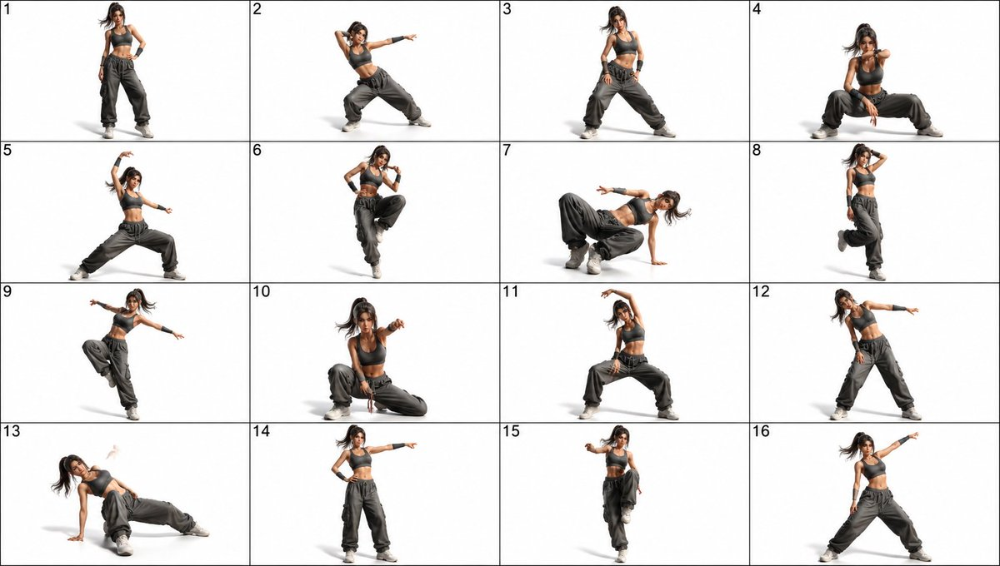 |

**Prompt:**

```
{"type":"pose reference sheet","subject":{"count":1,"description":"a fit young woman dancer shown repeatedly in a clean studio reference layout","appearance":{"gender":"female","age":"young adult","build":"athletic, toned midriff","skin tone":"light to medium tan","hair":{"color":"dark brown","style":"high messy ponytail with loose strands framing the face"},"expression":"neutral to focused"},"wardrobe":{"top":"charcoal gray sports bra or cropped athletic bralette","bottom":"oversized dark gray parachute cargo pants with gathered ankles","shoes":"white sneakers","accessories":["black wristband or fingerless glove on one hand","subtle sporty styling"]}},"layout":{"background":"plain white seamless studio background","grid":{"rows":4,"columns":4,"count":16,"cell labels":["1","2","3","4","5","6","7","8","9","10","11","12","13","14","15","16"]},"style":"clean contact-sheet or choreography chart with thin black dividers between panels and small black numbers at the upper left of each panel"},"poses":[{"label":"1","description":"relaxed standing pose, weight on one leg, one hand near hip, slight contrapposto"},{"label":"2","description":"wide low dance stance, one arm bent behind the head, the other arm extended and pointing to the right"},{"label":"3","description":"legs spread in a grounded stance, torso slightly tilted, one hand resting near the upper thigh"},{"label":"4","description":"very low wide squat facing forward, torso leaning back, one hand near the face and the other near the thigh"},{"label":"5","description":"wide side lunge stance, one arm arched overhead, the other arm extended outward in a stylized dance line"},{"label":"6","description":"balancing on one leg with the other knee lifted high, one hand near the face in a punchy hip-hop pose"},{"label":"7","description":"floorwork pose supported by one hand on the ground, torso reclined sideways, legs bent and lifted in a dynamic breakdance-like position"},{"label":"8","description":"casual upright pose with one hand behind the head and one knee bent upward"},{"label":"9","description":"one-legged balance pose with the lifted knee bent, both arms extended outward for motion and rhythm"},{"label":"10","description":"low kneeling or crouched pose, one knee up and one knee down, one arm thrust forward toward the viewer"},{"label":"11","description":"deep squat with legs apart, one arm curved overhead in a dramatic arc"},{"label":"12","description":"standing lean to one side with one arm extended sideways and the other hand near the hip or thigh"},{"label":"13","description":"reclining floor pose supported by one hand behind the body, one leg bent and one leg extended"},{"label":"14","description":"upright standing pose with one arm fully extended and pointing to the right"},{"label":"15","description":"front-facing pose stepping forward with one knee lifted, one arm reaching or pointing forward"},{"label":"16","description":"wide confident stance with one arm pointing diagonally upward to the right"}],"rendering":{"medium":"photorealistic studio fashion and dance reference image","lighting":"soft even studio lighting with faint shadows beneath the feet and body","camera":"full-body framing, straight-on view, consistent distance in every panel","quality":"sharp, high-resolution, realistic anatomy and fabric folds"}}
```

<!-- Case 136: 16-Pose Dance Reference Sheet (by @ExquisitMe) -->
### Case 136: [16-Pose Dance Reference Sheet](https://x.com/ExquisitMe/status/2048143577264402629) (by [@ExquisitMe](https://x.com/ExquisitMe))

| Output |
| :----: |
| 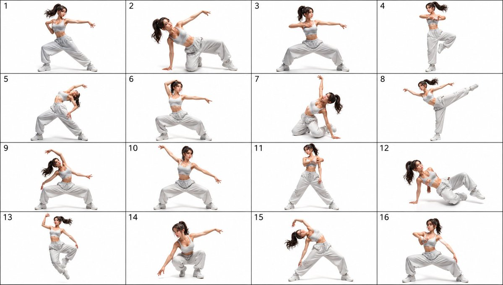 |

**Prompt:**

```
{"type":"pose reference sheet","subject":{"category":"female dancer fitness model","age_appearance":"young adult","build":"slim athletic","hair":{"color":"dark brown","style":"high ponytail"},"outfit":{"top":"light gray or white sports bra crop top","bottom":"baggy light gray sweatpants","shoes":"white sneakers"},"face":"softly blurred or de-emphasized facial features"},"style":{"image_type":"studio dance pose chart","background":"clean seamless white background","lighting":"bright even studio lighting with minimal shadows","color_palette":"neutral whites and light grays","camera":"full-body framing, straight-on view, consistent distance","rendering":"photorealistic"},"layout":{"grid":{"rows":4,"columns":4,"count":16,"border":"thin black dividers between cells"},"numbering":{"count":16,"labels":["1","2","3","4","5","6","7","8","9","10","11","12","13","14","15","16"],"position":"top-left corner of each panel"},"sections":[{"title":"row 1","position":"top","count":4,"labels":["1 side lunge with one arm extended straight sideways and the other bent near chest","2 low floor pose leaning on one hand with one knee down and opposite arm arched upward","3 wide squat facing front with both arms opened in angular dance position","4 standing balance on one leg with opposite knee lifted and forearms crossed near chest"]},{"title":"row 2","position":"upper-middle","count":4,"labels":["5 deep backbend in wide stance with torso arched and one arm curved overhead","6 wide squat with one hand behind head and the other arm pointing outward","7 kneeling side stretch with one hand on floor and opposite arm reaching straight up","8 standing arabesque-style extension with torso tilted forward and one leg lifted high behind/sideways"]},{"title":"row 3","position":"lower-middle","count":4,"labels":["9 wide squat with torso tilted left, one arm curved overhead and one arm extended low","10 front-facing wide squat with both arms stretched diagonally in opposite directions","11 relaxed standing pose with legs apart and both forearms crossing in front of torso","12 floor recline supported on one hand and one knee, torso leaning back with bent legs"]},{"title":"row 4","position":"bottom","count":4,"labels":["13 small jump or lifted balance with one knee raised and one arm bent upward","14 low crouch squat with one hand reaching toward floor and other arm extended sideways","15 dramatic side backbend in wide stance with hair swinging and one arm curved overhead","16 powerful wide squat with one hand at chest and the other lowered to the side"]}],"overall_composition":"all 16 poses shown as separate panels in a uniform contact sheet"},"prompt":"Create a clean studio contact sheet of {argument name=\"pose count\" default=\"16\"} full-body dance or combat-reference poses featuring a {argument name=\"subject type\" default=\"young athletic woman\"} in a {argument name=\"outfit\" default=\"light gray sports bra, loose gray sweatpants, and white sneakers\"}. Use a seamless {argument name=\"background color\" default=\"white\"} background, bright even lighting, and a consistent straight-on camera. Arrange the poses in a 4x4 grid with thin black panel lines and small black numbers 1 through 16 in the top-left of each cell. The poses should mix standing, squatting, kneeling, floorwork, balance, kick-extension, backbend, and angular arm positions suitable for a dance sheet chart or combat movement reference. Keep the styling photorealistic, crisp, minimal, and instructional, with consistent wardrobe and hair across all panels."}
```

<!-- Case 137: Gas Giant Descent Storyboard (by @xRahultripathi) -->
### Case 137: [Gas Giant Descent Storyboard](https://x.com/xRahultripathi/status/2048140775356354892) (by [@xRahultripathi](https://x.com/xRahultripathi))

| Output |
| :----: |
| 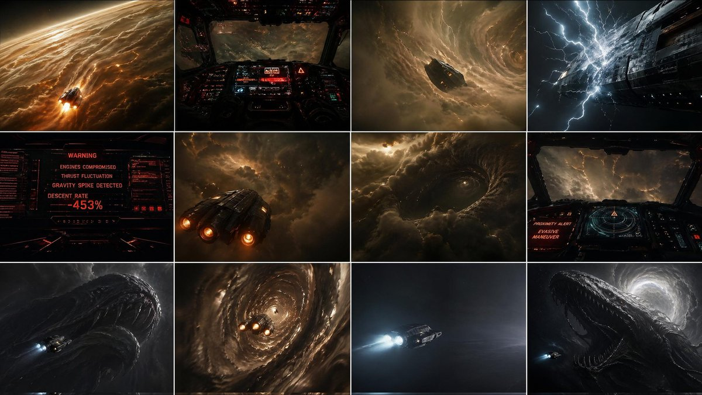 |

**Prompt:**

```
{"type":"cinematic sci-fi storyboard contact sheet","subject":{"primary":"a small futuristic spacecraft descending into a massive gas giant storm system","secondary":"an enormous leviathan-like silhouette hidden within the clouds","mood":"oppressive, catastrophic, awe-struck, high tension, cosmic dread","style":"photorealistic cinematic concept art with dark sci-fi realism, volumetric storm clouds, strong contrast, amber and black palette with occasional cold blue lightning","aspect_ratio":"16:9"},"vehicle":{"design":"compact armored deep-atmosphere ship with 3 bright rear engines, angular industrial hull, worn metallic panels","scale":"tiny compared to the planet and creature"},"layout":{"grid":{"rows":3,"columns":4,"count":12},"sections":[{"position":"row 1 col 1","description":"wide exterior shot of the ship entering the upper atmosphere of a colossal gas giant at extreme speed, glowing clouds streaked with fire and friction around the vessel, curved planetary horizon visible"},{"position":"row 1 col 2","description":"cockpit POV, dark interior filled with red and cyan holographic instruments, forward visibility collapsing into turbulent storm layers and electrical haze"},{"position":"row 1 col 3","description":"exterior mid-wide shot of the ship diving into a gigantic rotating cloud funnel, surrounded by violent spiraling storm structure"},{"position":"row 1 col 4","description":"extreme close exterior of the ship hull as bright lightning strikes dangerously close, white electric energy crawling across the metal surface"},{"position":"row 2 col 1","description":"dashboard warning screen in red, showing a critical systems failure interface with the exact visible text count of 4 warning lines and 1 large percentage readout: ['WARNING','ENGINES COMPROMISED','THRUST FLUCTUATION','GRAVITY SPIKE DETECTED','DESCENT RATE -453%']"},{"position":"row 2 col 2","description":"rear three-quarter exterior of the ship fighting turbulence inside dense storm clouds, engines burning hard while the craft barely holds course"},{"position":"row 2 col 3","description":"massive circular disturbance forming in the clouds like an eye or maw, entire storm systems displaced by something huge moving beneath"},{"position":"row 2 col 4","description":"second cockpit view with radar-like navigation display and red alert text, pilot making a blind evasive maneuver through lightning-filled darkness"},{"position":"row 3 col 1","description":"first reveal of the colossal creature shape rising near the ship, black organic surface and immense curved anatomy emerging from darkness, ship tiny at lower left"},{"position":"row 3 col 2","description":"spiral descent shot, ship caught inside a vortex tunnel of clouds, spinning downward with engines flaring as it struggles to recover"},{"position":"row 3 col 3","description":"sudden breakthrough into a calm void, minimal composition, ship flying in eerie silence through dark open space with soft mist and no visible storm around it"},{"position":"row 3 col 4","description":"final reveal, gigantic leviathan fully emerging behind or beside the ship in cleared space, backlit by a pale circular storm opening, enormous open maw-like silhouette dwarfing the craft"}],"continuity":"all 12 panels depict one continuous descent sequence from atmospheric entry to final creature reveal"},"lighting":{"primary":"glowing amber storm light","secondary":"red cockpit interface glow","accents":"blue-white lightning and engine exhaust"},"environment":{"location":"inside the upper and middle storm layers of a gigantic gas giant","weather":"violent turbulence, electrical storms, vortex funnels, cloud walls, pressure chaos","threat":"no safe zone, repeated near-failure, unknown colossal presence driving the storm"}}
```

<!-- Case 138: Surreal Baroque Painting Reality Fracture (by @JohnnyWang8802) -->
### Case 138: [Surreal Baroque Painting Reality Fracture](https://x.com/JohnnyWang8802/status/2048129335853559824) (by [@JohnnyWang8802](https://x.com/JohnnyWang8802))

| Output |
| :----: |
| 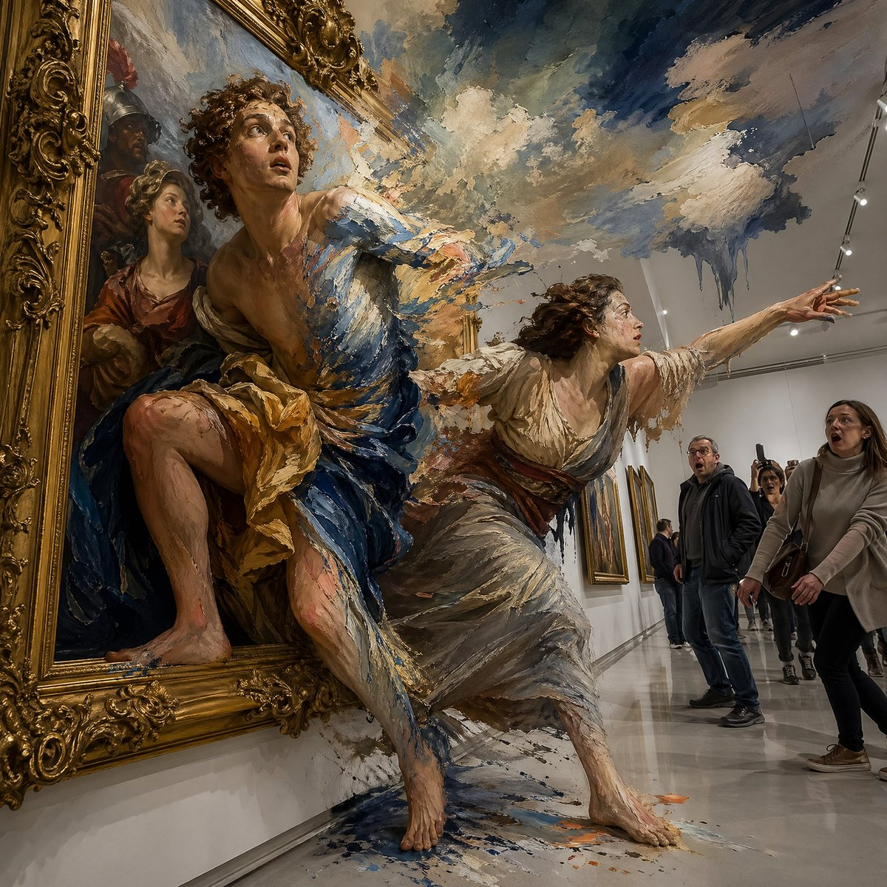 |

**Prompt:**

```
A {argument name="painting style" default="baroque oil painting"} comes to life — its painted figures climbing out of the gilded frame into a {argument name="setting" default="modern white gallery"}, half their bodies still in flat 2D paint, half fully volumetric 3D humans, brushstrokes visible on their skin, the painting's background leaking watercolor clouds into the gallery ceiling, museum visitors frozen in shock, hyper-detailed, {argument name="artist influence" default="René Magritte meets Pixar"}, reality fracturing at every boundary
```

<!-- Case 139: Urban Alley Mural Artist (by @Professor_134) -->
### Case 139: [Urban Alley Mural Artist](https://x.com/Professor_134/status/2048066672398102896) (by [@Professor_134](https://x.com/Professor_134))

| Output |
| :----: |
| 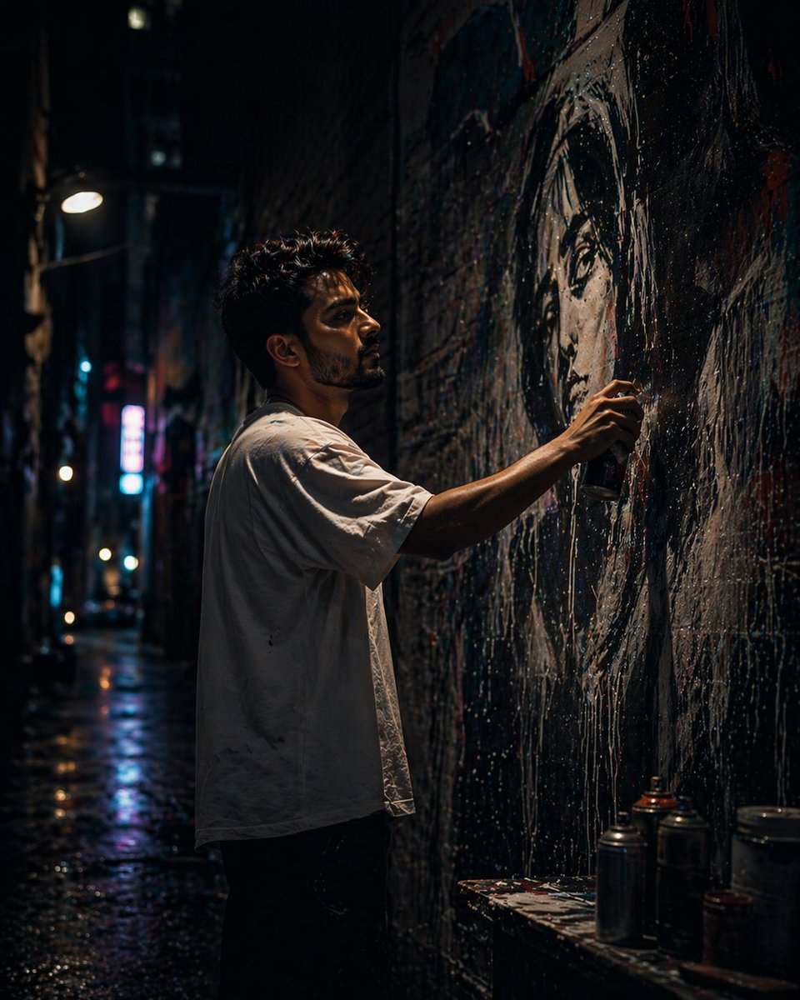 |

**Prompt:**

```
A cinematic, ultra-realistic night scene of a {argument name="artist" default="young male street artist"} painting a large-scale {argument name="mural subject" default="mural of a woman’s face"} in a {argument name="setting" default="narrow urban alley"}. The camera angle is slightly low, creating a dramatic, powerful perspective. The artist has medium-length, slightly messy dark hair and light stubble or a short beard, giving him a rugged, creative look.

He wears a loose white t-shirt and casual jeans, slightly oversized, with a relaxed streetwear vibe. His posture is focused and engaged as he stands close to the wall, actively spray-painting.

He is creating a massive, hyper-realistic mural of a woman’s face on a textured brick wall. The mural is incredibly detailed—smooth skin tones, realistic lighting, expressive eyes, and glossy lips—appearing almost like a photograph. Fine mist from the spray paint is visible in the air, catching light and adding motion and atmosphere.

The setting is a narrow urban alley at night, surrounded by tall buildings. The environment is gritty and textured—aged brick walls, paint splashes, subtle grime, and urban wear. Neon signs and distant streetlights cast vibrant reflections in teal, magenta, and blue tones, creating a cinematic, slightly cyberpunk mood.

Lighting is dramatic and layered: cool ambient light fills the alley, while warmer neon highlights create contrast. A subtle rim light outlines the artist’s silhouette, separating him from the dark background. The mural is partially illuminated, acting as a strong focal point.

Atmosphere includes light fog or mist, enhancing depth and making the lighting glow softly. The scene feels immersive, quiet, and artistically intense.

Depth of field is moderately shallow: the artist and mural are in sharp focus, while the background fades into soft blur with bokeh highlights.

Style: hyper-realistic, cinematic photography, street art aesthetic, ultra-detailed textures, high dynamic range, subtle film grain.

Camera details: 35mm or 50mm lens, f/1.8–f/2.8 aperture, low-light photography, slight low-angle shot, natural perspective.

Composition: vertical frame (4:5 or 9:16), subject slightly off-center, mural dominating the frame for strong visual storytelling.
Generate image using uploaded image as reference
```

<!-- Case 140: RPG Map to Anime Event Scene (by @ArtwlDesign) -->
### Case 140: [RPG Map to Anime Event Scene](https://x.com/ArtwlDesign/status/2048054726768709769) (by [@ArtwlDesign](https://x.com/ArtwlDesign))

| Output |
| :----: |
| 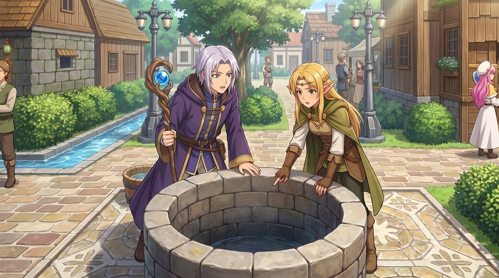 |

**Prompt:**

```
Using the provided reference image, transform the top-down RPG town map into a polished anime-style event illustration from a human eye-level perspective. Keep the same village location and layout cues: the central stone well, the path network, the hedges, the wooden houses, and the narrow water canal on the left. Convert the 2 small sprite characters by the well into 2 full-size fantasy characters in the foreground: a silver-haired mage in a purple robe holding a staff, and a blonde elf in green-and-brown adventurer clothing, both leaning over and looking into the well. Add a cinematic JRPG feel with soft daylight, detailed painterly rendering, clean line art, and gentle depth of field. Preserve the sense that this scene is taking place in the same town square, but enrich it with natural perspective, more environmental detail, and 5 background villagers: 1 man cropped at the far left edge, 2 small figures standing on the center path in the distance, and 2 townspeople talking near the right-side buildings.
```

<!-- Case 141: Soft Pastel Anime Girl Full Body (by @hoshi122221) -->
### Case 141: [Soft Pastel Anime Girl Full Body](https://x.com/hoshi122221/status/2048025730425196801) (by [@hoshi122221](https://x.com/hoshi122221))

| Output |
| :----: |
| 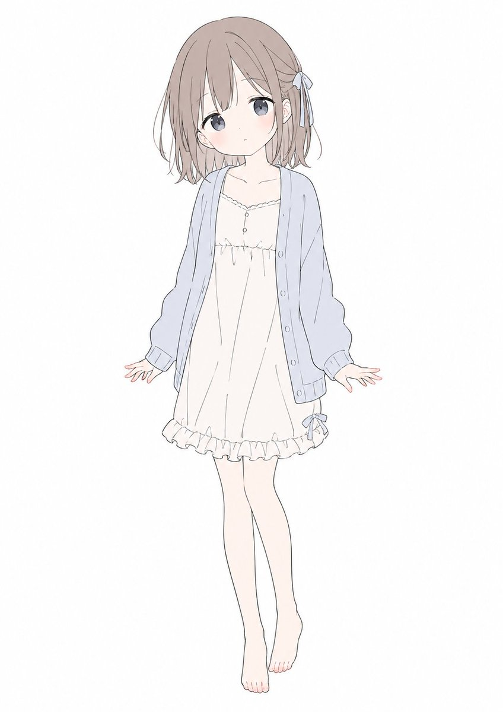 |

**Prompt:**

```
A full-body anime girl character design on a plain white background, centered and floating slightly, drawn in a soft minimalist pastel style with very thin gray linework and delicate flat colors. She has a petite youthful build and a cute, gentle silhouette, with special emphasis on a soft rounded face shape, smooth cheeks, and a softened jawline and chin. Her face is completely obscured by a blank skin-colored rectangular block with no facial features visible. She has short bob hair in {argument name="hair color" default="light ash brown"}, slightly tousled with wispy ends, long bangs covering part of the forehead, and a small ribbon hair tie on the right side in pale blue-gray. She wears 3 visible clothing pieces: an oversized pale blue cardigan with loose sleeves and front buttons, a cream-white slip dress with a scalloped neckline and a tiny button detail at the chest, and a frilled hem with a small ribbon near the right thigh. She is barefoot with slim pale legs, posed front-facing with both arms relaxed slightly outward, open hands, one leg straight and the other gently bent inward for a shy, weightless look. The illustration should feel airy, cute, understated, and clean, like a simple Japanese anime fashion sketch, with lots of negative space and no props, no shadows, and no background elements.
```

<!-- Case 142: Urban Fantasy Coexistence Crossing (by @Ray_CROWN0) -->
### Case 142: [Urban Fantasy Coexistence Crossing](https://x.com/Ray_CROWN0/status/2048024227664494775) (by [@Ray_CROWN0](https://x.com/Ray_CROWN0))

| Output |
| :----: |
| 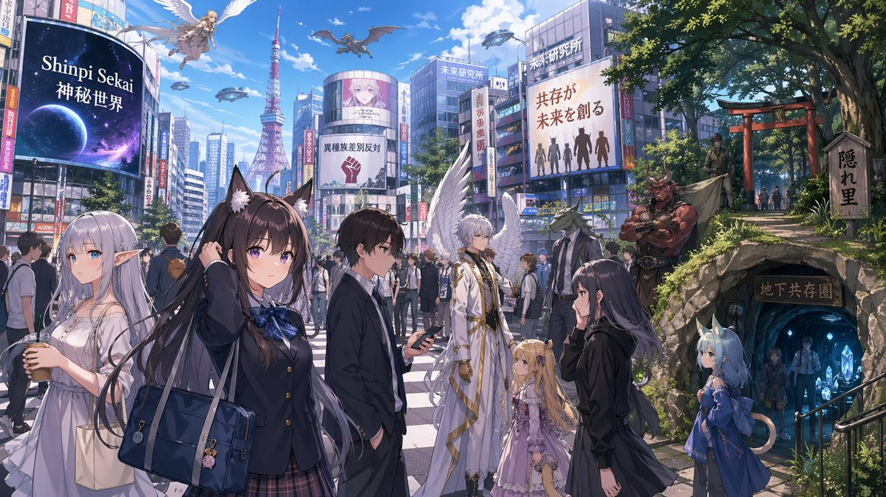 |

**Prompt:**

```
A highly detailed anime-style urban fantasy illustration set at a busy Tokyo-style scramble crossing on a bright clear day, viewed at street level with a wide cinematic composition. The city blends modern realism with mythic fantasy: dense high-rise buildings covered in giant billboards, a red broadcast tower in the middle distance, blue sky with fluffy clouds, and a crowded crosswalk full of pedestrians. In the foreground, show 7 prominent character figures: a silver-haired elf woman in a flowing white dress holding an iced drink and tote bag on the far left; a central schoolgirl with long dark hair, black animal ears, a navy school blazer, plaid skirt, blue ribbon, and large navy shoulder bag, lifting one hand to her head; a young man in a dark suit looking down at a smartphone; an androgynous white-haired angelic figure in an elegant white-and-gold ceremonial outfit with large white wings; a small blonde girl in an ornate pastel pink frilled dress beside the angel; a dark-haired woman in a black coat in right foreground profile; and a small blue-haired cat-eared child in a blue dress with a bow standing near a cave entrance on the right. In the midground crowd, include mixed humans and fantasy races walking together naturally. Add 4 clearly visible nonhuman or supernatural background beings: 1 dragon flying in the sky, 1 winged female angel descending above the street, 1 lizard-headed businessman in a suit near the angelic figure, and 1 tall red-skinned horned demon with crossed arms standing by the hillside path. On the right side, transition the city into a lush shrine hillside with large green trees, a red torii gate, stone steps, and a wooden signboard reading Japanese kanji. Below it, place a rocky cave-like tunnel entrance glowing blue, with a wooden sign over the entrance and several figures descending into an underground shared district lit by crystals. Show 6 major billboard/sign elements across the cityscape: a huge left billboard reading "Shinpi Sekai 神秘世界" with a cosmic planet image; a large central political poster with Japanese text and a raised fist icon; 2 rooftop signs reading "未来研究所" on separate buildings; a large right billboard with Japanese text about coexistence and silhouettes of different beings; and 1 vertical banner with Japanese text on a nearby building. Emphasize the theme of coexistence between ordinary modern city life and hidden fantasy societies. Crisp anime linework, polished light novel key visual rendering, rich textures, soft sunlight, subtle atmospheric perspective, vibrant but believable colors, intricate clothing details, and a sense of awe, everyday bustle, and worldbuilding depth.
```

<!-- Case 143: Magical Seed Packet Diorama (by @AllaAisling) -->
### Case 143: [Magical Seed Packet Diorama](https://x.com/AllaAisling/status/2048156345518768190) (by [@AllaAisling](https://x.com/AllaAisling))

| Output |
| :----: |
|  |

**Prompt:**

```
Epic 3D scene: a weathered seed packet lying open on a potting bench, its promise erupting into the garden it describes. The illustration on the front becomes real. {argument name="plant type" default="[PLANT / FLOWER]"} growing at full scale from the paper, roots visible through the packet's base pushing into soil below.
{argument name="detail left" default="[DETAIL 1]"} in full bloom at one corner. {argument name="detail right" default="[DETAIL 2]"} mid-growth at the other, not yet what it will be.
Tiny insects that belong to this plant, {argument name="insect type" default="[BEE / BUTTERFLY / BEETLE]"}, hovering at correct scale.
The written instructions on the back become garden calendar, "sow in spring" manifests as actual spring light. "full sun" manifests as a single shaft of it, hitting the tallest bloom perfectly.
Scattered seeds between packet and soil each showing their germination stage, split coat, first root, first shoot, first leaf.
The packet's torn top edge becomes a treeline.
Potting bench surface with soil scatter and water droplets.
Tilt-shift depth of field, greenhouse morning light, the packet as the garden it always intended.
```

<!-- Case 144: Luxury Chronograph Watch Ad (by @AlwaveNazca) -->
### Case 144: [Luxury Chronograph Watch Ad](https://x.com/AlwaveNazca/status/2048147643809865950) (by [@AlwaveNazca](https://x.com/AlwaveNazca))

| Output |
| :----: |
|  |

**Prompt:**

```
A dramatic luxury product advertising image for a motorsport-inspired chronograph wristwatch in a dark studio. Center-left foreground, show a single stainless steel chronograph watch standing upright at a slight three-quarter angle, with a black dial, two red-accent subdials, slim silver hour markers, a tachymeter bezel, and visible crown and pushers on the right side. The watch has a black leather strap with bold red stitching along both edges and a sporty premium finish. To the right of the watch, place one black square presentation box slightly behind it, textured like leather, with red stitching around the lid and a silver embossed eye-shaped logo above the text “NESS STUDIO” and smaller red text “TRACK SURFACE.” At the top center of the composition, add the same silver eye logo with the words “NESS STUDIO” and smaller “BY NICOLAS.” Across the background, place one oversized blurred word, {argument name="headline text" default="PRECISION"}, in large gray capital letters spanning nearly the full width. The scene is set against a deep black background with cinematic red and white horizontal light streaks crossing behind the products from left to right, suggesting speed and racetrack energy. Use a glossy wet ground plane with reflective texture, catching red highlights and mirrorlike reflections beneath the watch and box. At the bottom center, add the text “CHRONOGRAPH SERIES” in clean white spaced capitals with thin red horizontal lines extending on both sides, and below it smaller red capitals reading {argument name="tagline text" default="ALSACE MADE"}. Color palette: black, charcoal gray, silver steel, vivid racing red, and a touch of white. Lighting should be high-contrast and premium, with crisp specular highlights on the metal case, subtle soft fill on the box, and moody shadows. Overall style: ultra-polished commercial product photography, luxury watch campaign, sharp focus on the products, sleek branding, high-end automotive aesthetic.
```

<!-- Case 145: Neon Nike Lumina Ad Poster (by @AlwaveNazca) -->
### Case 145: [Neon Nike Lumina Ad Poster](https://x.com/AlwaveNazca/status/2048147643809865950) (by [@AlwaveNazca](https://x.com/AlwaveNazca))

| Output |
| :----: |
|  |

**Prompt:**

```
A high-energy vertical Nike fashion campaign poster featuring a single athletic young woman mid-jump against a futuristic neon studio background. She is captured in a dynamic airborne pose with one knee bent up, the other leg folded back, one arm extended outward and the other bent near her chest, conveying motion and power. Her face is obscured by a clean rectangular blur block centered over the face. She wears a cropped iridescent white hooded windbreaker with a black zipper and small Nike logo on the chest, holographic metallic lavender-blue leggings with a subtle Nike swoosh on the thigh, a black branded waistband visible above the leggings, and white chunky Nike sneakers. Her brown hair is tied in a high ponytail flying outward with the jump. Behind her, enormous glowing white serif letters spell “NIKE” across the upper half, with a small white Nike swoosh centered above the word. Across the middle background, the phrase “LUMINA” appears once in wide bold glowing letters with a horizontal glitch and scanline distortion effect, partially obscured by the model. The color palette is saturated magenta, violet, cyan, and electric blue with strong bloom, glossy highlights, lens flares, and chromatic aberration. Add sweeping circular light trails wrapping around the model’s legs and body, suggesting speed and motion. The overall style is premium sportswear advertising, ultra-polished, cinematic, high contrast, hyperreal retouching, crisp product detail, dramatic rim lighting, and a luminous holographic aesthetic. Place 2 small text lines at the bottom: bottom left reads {argument name="tagline text" default="LIGHT. MOTION. ENERGY."}, bottom right reads {argument name="collection name" default="NIKE LUMINA COLLECTION"} followed by a small Nike swoosh. Include exactly 3 visible Nike swooshes total: 1 above the large NIKE headline, 1 on the jacket chest, and 1 on the leggings.
```

<!-- Case 146: Streetwear Sneaker Poster Ad (by @AlwaveNazca) -->
### Case 146: [Streetwear Sneaker Poster Ad](https://x.com/AlwaveNazca/status/2048147643809865950) (by [@AlwaveNazca](https://x.com/AlwaveNazca))

| Output |
| :----: |
|  |

**Prompt:**

```
Create a bold streetwear poster advertisement for {argument name="brand name" default="NESS STUDIO"} featuring a young adult model seated casually on the ground in a low-angle fashion pose, one knee raised and one leg extended toward the camera so the sneaker in front appears oversized and dominant. The model wears a dark brown oversized leather bomber jacket, a black shirt, light blue loose-fit jeans, white socks, and chunky black-white-gray sneakers with a red accent in the sole and the {argument name="brand name" default="NESS STUDIO"} logo visible on the shoe side and tongue. The face is intentionally obscured by a soft rectangular blur block centered over the face. Use an off-white textured paper background with distressed grunge design elements and collage layering. Behind the model, place a large rough red paint brushstroke shape spanning diagonally across the center. Add black ink splatters, sketch circles, torn paper scraps, and hand-painted graffiti accents. Include 4 major graphic doodles: a large black X in the upper right, a hand-drawn upward arrow in the lower left, a rough crown sketch in the lower right, and a circular scribble near the top center. In the upper left, place a stylized eye logo above the text "{argument name="brand name" default="NESS STUDIO"}" and a smaller tagline below reading "A MOMENT OF YOUR STYLE". On the left middle area, add the handwritten slogan "INNOVATE CREATE INSPIRE" in stacked black brush lettering. On the right middle area, place a torn black paper patch with the handwritten white slogan "BUILT DIFFERENT MOVE DIFFERENT" and a red underline stroke. In the lower left near the shoe, add a black distressed label sticker containing a globe scribble, the text "{argument name="brand name" default="NESS STUDIO"}", and a barcode. Along the bottom footer, create a clean horizontal strip with 3 social media icons and handles separated by thin vertical dividers: Instagram, Facebook, and Twitter, each followed by "@NESS.STUDIO". The overall style should be edgy, urban, youthful, high-contrast, editorial street fashion, mixing product advertising photography with graffiti poster design, collage textures, and dynamic branding.
```

<!-- Case 147: Editorial Osaka Six Sweatshirt Ad (by @_LaurentB) -->
### Case 147: [Editorial Osaka Six Sweatshirt Ad](https://x.com/_LaurentB/status/2048126606313464040) (by [@_LaurentB](https://x.com/_LaurentB))

| Output |
| :----: |
|  |

**Prompt:**

```
A clean editorial fashion advertisement poster on a pale powder-blue studio background with a glossy reflective floor. The composition is vertical and minimal, dominated by oversized bold white condensed sans-serif typography in the background reading “OSAKA SIX:” on the top line and “006 REMAINS” below, filling most of the upper half behind the subject. In the top right corner, small white branding text reads “Designed by ARTTEESHOW.” Centered in the lower middle is an oversized forest-green crewneck sweatshirt standing upright like a sculptural object, with soft heavy cotton fabric, dropped shoulders, extra-long sleeves pooled on the floor, and a small black neck label that reads ARTTEESHOW. On the chest of the sweatshirt is a large abstract collage print made from torn paper fragments in beige, tan, black, gray, white, and vivid red, arranged vertically like layered scraps. Leaning against the right side of the giant sweatshirt is a slim female fashion model with long straight black hair, wearing a matching {argument name="sweatshirt color" default="forest green"} sweatshirt and relaxed wide-leg sweatpants with clean white low-top sneakers. She is posed in profile with a calm detached editorial attitude, one hand in her pocket, her body reclining diagonally against the giant garment, legs extended forward; her face is obscured by a soft rectangular blur for an anonymous art-fashion look. The smaller worn sweatshirt has the same abstract torn-paper collage graphic centered on the chest. At the bottom center, add 2 lines of small white copy text: “Made for comfort, worn for confidence.” and “Because life feels better when someone’s carrying the weight of the world.” The image should feel like a premium conceptual streetwear campaign from the early 1990s reimagined as contemporary luxury advertising, with crisp studio lighting, soft shadows, subtle floor reflections, precise product focus, surreal scale contrast between the oversized sweatshirt and the model, and a polished magazine-poster aesthetic.
```

<!-- Case 148: Editorial Perfume Shot on Moss (by @Salmaaboukarr) -->
### Case 148: [Editorial Perfume Shot on Moss](https://x.com/Salmaaboukarr/status/2048103506125463983) (by [@Salmaaboukarr](https://x.com/Salmaaboukarr))

| Output |
| :----: |
|  |

**Prompt:**

```
A high-end editorial product photograph of a single luxury perfume bottle centered in a warm earthy still-life scene. The product is a clear rectangular glass bottle filled with golden amber liquid, topped with a glossy rounded black cap, with a clean white front label that reads "BYREDO", "BAL D’AFRIQUE", and "EAU DE PARFUM". Place the bottle upright on 1 curved piece of pale weathered driftwood, surrounded by a dense carpet of 1 layer of rich green moss covering the foreground and lower frame. Use a minimal studio composition with the product isolated against a smooth warm brown-to-amber gradient background, softly illuminated like sunset light. Light the scene with dramatic directional warm light from the upper right, creating a bright glow on the background, a crisp highlight on the cap, soft reflections in the glass, and gentle shadows across the wood and moss. Keep the framing vertical, the bottle centered slightly low in the composition with generous negative space above, and the overall mood natural, luxurious, earthy, cinematic, and polished like a premium fragrance campaign shot.
```

<!-- Case 149: Editorial Perfume Bottle in Golden Fur (by @Salmaaboukarr) -->
### Case 149: [Editorial Perfume Bottle in Golden Fur](https://x.com/Salmaaboukarr/status/2048103506125463983) (by [@Salmaaboukarr](https://x.com/Salmaaboukarr))

| Output |
| :----: |
|  |

**Prompt:**

```
A luxurious editorial product photograph of a single perfume bottle nestled into dense, plush faux fur in rich golden caramel and honey-brown tones. Center the composition on one clear oval glass bottle filled with warm amber liquid, with a glossy rounded black cap and a clean white rectangular label. The label text should read {argument name="brand name" default="BYREDO"} at the top, {argument name="product name" default="BAL D’AFRIQUE"} large in the middle, and {argument name="product type" default="EAU DE PARFUM"} in small text near the bottom. Shoot it as a close-up still life with soft studio lighting, subtle highlights on the glass and cap, gentle shadows in the folds of the fur, and a warm cinematic color palette. The bottle should sit slightly embedded in the fur so the surrounding texture frames it from all sides, creating a premium fashion editorial mood, minimal composition, shallow depth of field, crisp focus on the label, and a high-end beauty campaign aesthetic.
```

<!-- Case 150: Luxury Miniature Dubai City Model (by @silentempiredev) -->
### Case 150: [Luxury Miniature Dubai City Model](https://x.com/silentempiredev/status/2048086378383384773) (by [@silentempiredev](https://x.com/silentempiredev))

| Output |
| :----: |
|  |

**Prompt:**

```
A hyper-detailed cinematic isometric miniature city model of {argument name="landmark tower" default="Burj Khalifa"} rising dramatically from the center of a square architectural master-plan board, presented like a luxury urban planning maquette on a black background. The composition shows one dominant ultra-tall silver skyscraper in the exact center, surrounded by a dense ring of modern high-rise towers, illuminated roads, bridges, and glowing warm city lights. Curving turquoise-blue water features and artificial lakes wrap around the central district in multiple connected pools and canals, with one large circular fountain-like feature near the tower base and several small island shapes visible in the water. In the lower right quadrant, include a large low-rise complex with rounded geometric roofs and subtle green-lit sections, connected by multilane roads and looping interchanges. The entire city sits on one square beige map board engraved with faint street grids and planning lines, with the board edges clearly visible and slightly raised. Viewpoint is a high three-quarter isometric angle, centered and symmetrical, with the tower extending far upward into negative space. Lighting is dramatic and luxurious: warm golden edge lights on buildings and roads, cool reflections in the water, crisp metallic highlights on the central tower, and a deep black void surrounding the model. Style should feel like a photorealistic architectural visualization mixed with a premium collectible scale model, extremely intricate, sharp, polished, and elegant.
```

<!-- Case 151: E-commerce Main Image - Miniature Diorama Skincare Advertisement (by @Strength04_X) -->
### Case 151: [E-commerce Main Image - Miniature Diorama Skincare Advertisement](https://x.com/Strength04_X/status/2048074514278563949) (by [@Strength04_X](https://x.com/Strength04_X))

| Output |
| :----: |
|  |

**Prompt:**

```
A hyper-realistic miniature diorama product advertisement featuring an oversized luxury skincare pump bottle labeled "LUXEVEIL Skin Science – Radiance Nourishing Body Lotion" in cream/beige with a polished gold pump top, placed on a circular platform. Tiny figurine construction workers dressed in yellow coveralls and white hard hats swarm around the bottle climbing scaffolding, painting the bottle with rollers, operating a tower crane, working near industrial tanks and pipework, and unloading a miniature flatbed truck. The scene includes metal scaffolding structures, industrial silos, orange traffic cones, wooden barricades, and storage barrels. The overall color palette is warm beige, cream, gold, and mustard yellow. Studio photography style with soft diffused lighting, no shadows, clean beige background. The concept metaphorically shows workers "crafting" or "building" the perfect lotion. Tilt-shift miniature aesthetic, ultra-detailed, commercial product photography, 8K resolution, photorealistic CGI render.
```

<!-- Case 152: E-commerce Main Image - Traditional Chinese Art and Porcelain Vases (by @songguoxiansen) -->
### Case 152: [E-commerce Main Image - Traditional Chinese Art and Porcelain Vases](https://x.com/songguoxiansen/status/2048046906585280977) (by [@songguoxiansen](https://x.com/songguoxiansen))

| Output |
| :----: |
|  |

**Prompt:**

```
A scarf inspired by 'A Thousand Li of Rivers and Mountains', surrounded by Wang Ximeng's blue-green landscape, with a silky texture and soft lighting.

A famille rose porcelain vase featuring Lady Yang Guifei enjoying flowers, with peony and butterfly patterns in the style of imperial kilns.
```

<!-- Case 153: E-commerce Main Image - Premium Gaming Motherboard Studio Shot (by @rojassartorio) -->
### Case 153: [E-commerce Main Image - Premium Gaming Motherboard Studio Shot](https://x.com/rojassartorio/status/2048019666816163867) (by [@rojassartorio](https://x.com/rojassartorio))

| Output |
| :----: |
|  |

**Prompt:**

```
A high-end enthusiast ATX gaming motherboard product photo on a dark studio background, shown in a three-quarter top-down perspective angled from the lower left toward the upper right. The board is mostly matte black and gunmetal with sharp geometric armor plates, brushed metal textures, and subtle RGB edge lighting in blue, purple, and magenta. Feature an exposed modern Intel-style CPU socket near the upper center, 4 black DIMM memory slots on the right, large VRM heatsinks across the top and upper left, and multiple reinforced PCIe slots in the lower half. Include 3 major branded heatsink zones: a tall rear I/O shroud at upper left with an illuminated RGB eye logo and the text "MAXIMUS HERO", a left-side chipset/slot armor piece with the text "SUPREMEFX", and a large angular lower-right chipset cover with a silver ROG-style emblem plus a lower strip that reads "FOR THOSE WHO DARE". Show detailed capacitors, headers, power connectors, debug display reading "88" at the top right, and a small round start button nearby. Ultra-detailed commercial product photography, crisp focus across the board, realistic reflections on metal, premium luxury tech aesthetic, dramatic low-key lighting, clean black seamless backdrop, no cables, no CPU, no RAM, no other objects.
```

<!-- Case 154: E-commerce Main Image - Premium Grain Powder Ad Board (by @WooGabriel76263) -->
### Case 154: [E-commerce Main Image - Premium Grain Powder Ad Board](https://x.com/WooGabriel76263/status/2047988112094101770) (by [@WooGabriel76263](https://x.com/WooGabriel76263))

| Output |
| :----: |
|  |

**Prompt:**

```
{"type":"Chinese e-commerce product marketing board","product":{"category":"instant grain powder drink","brand":"五谷磨房","name":"核桃芝麻黑豆粉","packaging":"matte black retail box with gold Chinese typography and a large swirling bowl graphic on the front, plus individual black sachets inside","net weight":"320g (32g×10袋)"},"style":{"overall":"premium dark food advertising layout","color palette":["black","deep brown","warm gold","beige","walnut brown"],"lighting":"dramatic studio lighting with glossy highlights and warm rim light","mood":"luxurious, nourishing, healthy, appetizing"},"layout":{"format":"single tall composite board divided into 5 major sections plus a bottom storyboard table","sections":[{"title":"主图/Main image","position":"top-left","count":8,"labels":["五谷磨房","核桃芝麻黑豆粉","32g×10袋 独立包装","五黑谷物","香浓醇厚","独立小袋","即冲即饮","product box and drink cup"]},{"title":"详情页/Details page","position":"top-right","count":5,"labels":["黑芝麻","黑豆","黑米","核桃","谷物粉"]},{"title":"香浓细腻 顺滑好喝","position":"mid-right","count":4,"labels":["一冲即饮 营养美味","粉质细腻 Fine powder","浓香醇厚 Rich & Smooth","营养代餐 Nutritious"]},{"title":"冲泡方式 HOW TO MAKE","position":"mid-left lower","count":3,"labels":["1 倒入一袋粉(32g)","2 加入200ml 热水或牛奶","3 搅拌均匀 即可享用"]},{"title":"一杯好谷物 轻松好生活","position":"lower-left","count":4,"labels":["元气早餐","办公室下午茶","健身代餐","睡前暖饮"]},{"title":"独立小袋 随身携带","position":"lower-right","count":3,"labels":["独立小袋 便携卫生","锁住新鲜 防潮防氧化","1袋1杯 精准份量"]},{"title":"视频推广广告 seedance 2.0 视频提示词 + 分镜头脚本","position":"bottom full width","count":7,"labels":["镜头1 开场-产品展示","镜头2 食材特写","镜头3 倒粉入杯","镜头4 冲泡搅拌","镜头5 饮用场景","镜头6 产品卖点","镜头7 结尾口号"]}],"grid":"top area split into left main image and right detail page; middle area split into preparation guide and feature panel; lower area split into lifestyle scenarios and sachet carry section; bottom is a full-width tabular storyboard"},"scene_elements":{"ingredients":[{"name":"black sesame","form":"small black seeds in a round bowl"},{"name":"black beans","form":"glossy whole beans in a round bowl"},{"name":"black rice","form":"dark long grains in a round bowl"},{"name":"walnuts","form":"walnut halves in a round bowl"},{"name":"grain powder","form":"light beige powder in a round bowl"}],"serving":{"drink":"thick gray-brown sesame walnut bean beverage with smooth surface swirl","cup":"transparent glass cup with handle","utensil":"metal spoon stirring or resting inside drink"},"supporting props":["walnuts on table","scattered black beans","grain stalks or wheat stems","dark tabletop","ingredient bowls","open package showing 5 visible sachets"]},"text_treatment":{"headline_font":"bold elegant Chinese display type in metallic gold","body_font":"clean sans serif Chinese with occasional English subtitles","accent":"thin gold divider lines and circular ingredient frames"},"camera_and_composition":{"product_shots":"front-facing hero box, angled sachet display box, close-up beverage macro","food_photography":"high-detail commercial food styling, shallow depth of field, crisp texture emphasis","aspect_ratio":"portrait, approximately 9:16"},"quality":"ultra-detailed commercial design mockup, polished e-commerce key visual plus details page plus ad storyboard, 4K"}
```

<!-- Case 155: E-commerce Main Image - Earbuds E-commerce Infographic (by @SPEEDAI07) -->
### Case 155: [E-commerce Main Image - Earbuds E-commerce Infographic](https://x.com/SPEEDAI07/status/2047981795552153860) (by [@SPEEDAI07](https://x.com/SPEEDAI07))

| Output |
| :----: |
|  |

**Prompt:**

```
High-impact e-commerce infographic for "{argument name="product" default="Apple Pods Pro 3"}" wireless earbuds.
Foreground: An extreme close-up of a hand holding an open glossy white wireless earbud charging case toward the camera. Inside the case are two sleek white earbuds with black speaker accents. A small glowing green LED indicator is visible on the front of the case. The hand and case have slight macro-lens depth blur for realism.

Mid-ground: A {argument name="model" default="confident young woman"} with tan skin, brown eyes, and dark hair tied in a messy bun. She has natural makeup with a dewy glow. She is wearing a plain {argument name="clothing" default="yellow athletic t-shirt"} (no logos). One white earbud is in her ear. She is looking directly at the camera with a subtle, confident expression.

Background: Clean soft gray gradient studio backdrop with shallow depth of field. Diagonal rainbow prism lens flares and soft light leaks across the scene. Several blurred floating white earbuds in the background for depth and motion.

Lighting: Soft professional studio lighting with glossy highlights on the product, subtle rim light on the model, high dynamic range.

Typography (modern sans-serif, white):

Top center (behind model): Large bold text “AIRPODS”

Top right: “Apple Pods Pro 3”

Mid-left: “Premium sound and noise cancellation”

Mid-right: Large bold “30” with “hours of battery life”

Bottom-right: Large bold “1” with “year warranty”

Style: Ultra-realistic, commercial product photography, 8k resolution, sharp focus on product case, shallow depth of field, vibrant yet clean color palette, premium advertising aesthetic.
```

<!-- Case 156: E-commerce Main Image - Sustainable T-Shirt Plantable Tag Ad (by @Diplomeme) -->
### Case 156: [E-commerce Main Image - Sustainable T-Shirt Plantable Tag Ad](https://x.com/Diplomeme/status/2047957339974828092) (by [@Diplomeme](https://x.com/Diplomeme))

| Output |
| :----: |
|  |

**Prompt:**

```
A premium eco-conscious fashion advertisement, shot as a refined editorial product photo. A single off-white or natural cream crew-neck T-shirt hangs on a smooth wooden hanger with a black metal hook, placed against a lush wall of dense green leaves and climbing vines. The hanger has a small minimalist brand monogram engraved near the neck. The shirt is shown from the upper torso down to part of the hem, slightly angled, with soft natural folds and high-quality cotton texture. Printed inside the collar is a minimalist brand mark and the text "JUGGERKNOT ORIGINALS". Hanging from the neckline is 1 rectangular recycled-paper seed tag tied with rustic brown twine; the tag reads "Tulsi" and "Plantable Seed Tag" with a tiny sprouting seed detail near the bottom. From the tag, 1 real tulsi plant stem grows upward across the front of the shirt, with several fresh green leaves, visually demonstrating that the tag is plantable. Add a small fine-label annotation near the tag reading "TULSI PLANTABLE SEED TAG". On the right side, large elegant white serif typography says {argument name="headline text" default="Plant it."}. Beneath it, place 3 stacked lines of narrow uppercase sans-serif copy: "WEAR IT.", "PLANT IT.", and "GROW WITH IT.". At the lower left, add the brand name in spaced uppercase serif text: {argument name="brand name" default="JUGGERKNOT ORIGINALS"}, with a thin horizontal line above it. At the lower right, add 3 lines of small uppercase sans-serif text: "FSC® CERTIFIED PACKAGING.", "ZERO SYNTHETIC FIBRE", and "BACKED BY ZERODHA.". Use soft diffused daylight, shallow depth of field, moody green-and-cream color grading, luxury sustainable-brand aesthetics, clean composition, vertical poster layout, subtle shadows, and a calm organic atmosphere. Keep the design minimal, premium, and photorealistic, with the shirt occupying the left half and the typography balanced on the right.
```

<!-- Case 157: E-commerce Main Image - Elegant Cosmetic Poster Prompt (by @Adam38363368936) -->
### Case 157: [E-commerce Main Image - Elegant Cosmetic Poster Prompt](https://x.com/Adam38363368936/status/2047917266361360682) (by [@Adam38363368936](https://x.com/Adam38363368936))

| Output |
| :----: |
|  |

**Prompt:**

```
An image in a {argument name="reference style" default="similar style"}, a product image for {argument name="product" default="lipstick"}, requiring color coordination and a grand aesthetic in a {argument name="style" default="poster style"}, with language changed to Simplified Chinese.
```

<!-- Case 158: E-commerce Main Image - Minimalist Product Ad: PURE CRUNCH (by @Strength04_X) -->
### Case 158: [E-commerce Main Image - Minimalist Product Ad: PURE CRUNCH](https://x.com/Strength04_X/status/2047917220165231011) (by [@Strength04_X](https://x.com/Strength04_X))

| Output |
| :----: |
|  |

**Prompt:**

```
A minimalist product advertisement with a {argument name="product" default="fried chicken bucket"} placed on a clean white podium.

Background: soft gradient ({argument name="background gradient" default="light cream to white"}), clean studio.

Lighting: soft diffused, premium Apple-style.

Typography (center): “{argument name="headline" default="PURE CRUNCH"}”

Small text below: “Nothing extra. Just perfection.”

Style: ultra clean, editorial minimal, high-end branding, 8K.
```

<!-- Case 159: E-commerce Main Image - Pastel Blue Crocs Fashion Ad (by @SPEEDAI07) -->
### Case 159: [E-commerce Main Image - Pastel Blue Crocs Fashion Ad](https://x.com/SPEEDAI07/status/2047907058079650035) (by [@SPEEDAI07](https://x.com/SPEEDAI07))

| Output |
| :----: |
|  |

**Prompt:**

```
A high-end studio advertising poster for {argument name="brand name" default="crocs"}, in a monochrome pastel blue and white color palette, with a glossy reflective floor and a soft sky-blue backdrop. The background is dominated by the word {argument name="headline text" default="CROCS"} in gigantic bold white condensed sans-serif letters spanning nearly the full height of the image. In the top-right corner, add small white text reading "Designed with ChatGPT". Feature 3 adult women with shoulder-length wavy light brown to dark blonde hair, all wearing loose oversized white long-sleeve tops and flowing white wide-leg pants, styled as minimalist fashion models with relaxed neutral expressions. Their faces are intentionally obscured or blurred. One model reclines against an enormous upright white clog shoe on the left side, one model sits casually on top of a giant white clog on the upper right, and one model lounges on the floor at the lower right, leaning back on one arm while seated partly on a glossy blue sphere. Include 2 oversized white clog shoes as hero props: one standing vertically on the left showing the sole and side profile, and one angled on blue crystalline blocks at center-right showing the upper and toe box. Both clogs are classic foam slip-on style with perforation holes, chunky tread, heel straps, and circular logo rivets. The center-right clog is decorated with exactly 8 visible charms pinned to the upper: a blue-green iridescent round charm, a white daisy with yellow center, a black-and-white round emblem near the strap, a small "CROCS" word charm, a dark flower, a peace-hand sign, an orange smiley face, a white cloud, and an orange flower. Scatter exactly 7 glossy floating or grounded blue spheres of varying sizes around the set: one large sphere behind the left model, one medium sphere floating near center, one medium sphere at bottom left foreground, one medium sphere used as a seat under the lower-right model, one small sphere near the upper left, and 2 additional blue spheres integrated into the composition. Add translucent sculptural gel-like forms at the far left and far right edges, plus angular blue crystal-like rocks beneath the right shoe. At the bottom center, place white promotional copy in a clean sans-serif font: {argument name="tagline line 1" default="Made for comfort, worn for confidence."} on the first line and {argument name="tagline line 2" default="Because life feels better when your feet stop complaining."} on the second line. Beneath that, show 4 minimalist feature icons with labels in white: "ICONIC COMFORT", "LIGHTWEIGHT", "EASY TO CLEAN", and "UNIQUELY YOU". Place the {argument name="logo text" default="crocs"} logo in bold lowercase white at the bottom center with a small trademark symbol. The overall style should feel like a premium surreal fashion campaign, clean editorial lighting, soft shadows, glossy textures, airy composition, and modern lifestyle product advertising.
```

<!-- Case 160: E-commerce Main Image - 9-Panel Product TVC Storyboard (by @Magncsans) -->
### Case 160: [E-commerce Main Image - 9-Panel Product TVC Storyboard](https://x.com/Magncsans/status/2047876253898903594) (by [@Magncsans](https://x.com/Magncsans))

| Output |
| :----: |
|  |

**Prompt:**

```
Using the provided reference image, transform the single casual product photo into a polished e-commerce TVC storyboard board for a {argument name="video duration" default="15-second"} ad in a {argument name="aspect ratio" default="9:16"} vertical format, presented as a 9-panel grid. Keep the same blue-and-white ceramic ashtray as the product base, but restage it across cinematic advertising shots with warm premium lighting, shallow depth of field, and a refined lifestyle desktop environment. Add a dark storyboard layout with Chinese titles and timing for each panel. Include exactly 9 scenes: 1) environment-establishing wide shot with desk, books, window, and the product placed in context; 2) hero product medium shot on the table; 3) extreme close-up of the blue floral craftsmanship pattern; 4) use case showing a hand placing a cigarette into the ashtray with visible smoke; 5) top-down capacity display showing multiple cigarette butts inside; 6) cleaning scene under running water in a sink with a hand holding the product; 7) bottom-detail close-up showing the underside and anti-slip pads; 8) mood/lifestyle scene at night with the product on a desk, smoke rising, and ambient lamp light; 9) brand closing frame with the product as the hero plus Chinese marketing text. Add the overall header text “产品TVC分镜脚本(15秒 / 9:16竖屏 / 9宫格)” and a product subtitle naming it {argument name="product name" default="青花瓷烟灰缸"}. Give each of the 9 panels a Chinese scene title and timestamp, plus small descriptive Chinese copy beneath each image in the style of a professional commercial shot list. Use premium, realistic commercial photography throughout, consistent product identity, elegant Chinese aesthetic, and a clean high-end storyboard presentation.
```

<!-- Case 161: Parent-Child Miscommunication Infographic (by @sarinaashapi) -->
### Case 161: [Parent-Child Miscommunication Infographic](https://x.com/sarinaashapi/status/2048307780864606708) (by [@sarinaashapi](https://x.com/sarinaashapi))

| Output |
| :----: |
| 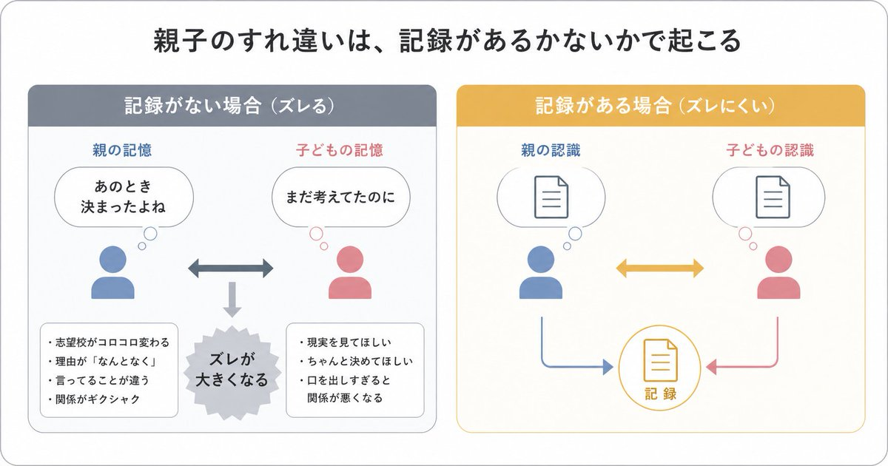 |

**Prompt:**

```
{"type":"Japanese infographic","style":"simple, easy-to-understand flat vector diagram, clean white background, rounded light-gray outer frame, minimal pastel color palette, presentation-slide design, clear hierarchy, lots of whitespace, modern sans-serif Japanese typography","canvas":{"aspect_ratio":"16:9"},"headline":{"text":"{argument name=\"headline text\" default=\"親子のすれ違いは、記録があるかないかで起こる\"}","position":"top center","size":"large bold black"},"layout":{"structure":"2 side-by-side rounded panels beneath the headline","sections":[{"title":"記録がない場合(ズレる)","position":"left","count":8,"header_color":"muted blue-gray","panel_border":"light gray","labels":["親の記憶","子どもの記憶","あのとき決まったよね","まだ考えてたのに","ズレが大きくなる","志望校がコロコロ変わる","理由が『なんとなく』","言ってることが違う","関係がギクシャク","現実を見てほしい","ちゃんと決めてほしい","口を出しすぎると関係が悪くなる"],"contents":{"top_left":{"type":"parent icon with thought bubble","icon_color":"blue","caption":"親の記憶","bubble_text":"あのとき\n決まったよね"},"top_right":{"type":"child icon with thought bubble","icon_color":"pink","caption":"子どもの記憶","bubble_text":"まだ考えてたのに"},"center":{"type":"horizontal double-headed arrow","color":"blue-gray"},"bottom_center":{"type":"downward arrow leading to burst shape","color":"light gray","burst_text":"ズレが\n大きくなる"},"bottom_left":{"type":"rounded note box","bullet_count":4,"bullets":["志望校がコロコロ変わる","理由が『なんとなく』","言ってることが違う","関係がギクシャク"]},"bottom_right":{"type":"rounded note box","bullet_count":3,"bullets":["現実を見てほしい","ちゃんと決めてほしい","口を出しすぎると関係が悪くなる"]}}},{"title":"記録がある場合(ズレにくい)","position":"right","count":7,"header_color":"mustard yellow","panel_border":"light yellow","labels":["親の認識","子どもの認識","記録"],"contents":{"top_left":{"type":"parent icon with thought bubble containing document symbol","icon_color":"blue","caption":"親の認識"},"top_right":{"type":"child icon with thought bubble containing document symbol","icon_color":"pink","caption":"子どもの認識"},"center":{"type":"horizontal double-headed arrow","color":"mustard yellow"},"bottom_center":{"type":"circular record icon with document symbol","outline_color":"mustard yellow","text":"記録"},"bottom_left_connector":{"type":"curved arrow from parent to record","color":"blue"},"bottom_right_connector":{"type":"curved arrow from child to record","color":"pink"}}}],"spacing":"balanced, symmetrical"},"visual_language":{"icons":"generic human bust icons and simple document line icons","emphasis":"contrast the left panel's misunderstanding with the right panel's shared record","mood":"educational, calm, practical"},"text_language":"Japanese","render_quality":"crisp vector edges, infographic suitable for social media educational posts"}
```

<!-- Case 162: Good Bath Day Editorial Poster (by @Kazuch75240438) -->
### Case 162: [Good Bath Day Editorial Poster](https://x.com/Kazuch75240438/status/2048205418238030327) (by [@Kazuch75240438](https://x.com/Kazuch75240438))

| Output |
| :----: |
| 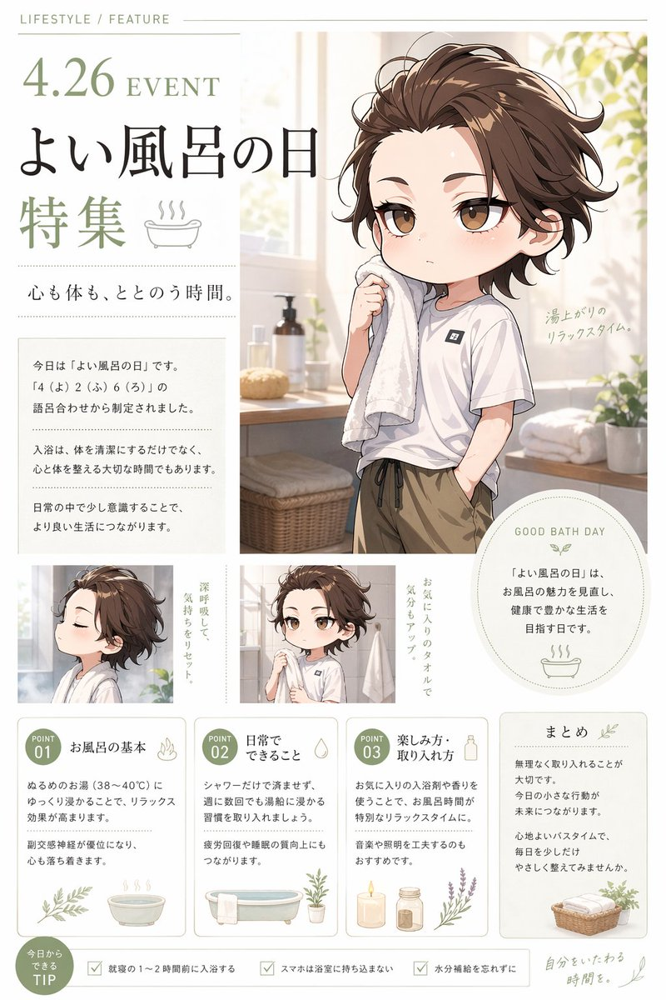 |

**Prompt:**

```
Create a soft editorial lifestyle poster for {argument name="event date" default="4.26"} celebrating Japanese bath culture, designed like a refined magazine feature page in portrait orientation. The layout is split into two main columns with a pale cream and warm gray background, thin divider lines, elegant serif typography, and muted sage-green accents. At the top left, include the small heading “LIFESTYLE / FEATURE”, then a large date line reading “{argument name="event date" default="4.26"} EVENT”, followed by the large Japanese title “よい風呂の日” and the subtitle “特集” in sage green, with a small bathtub icon nearby. Beneath that, add the Japanese tagline “心も体も、ととのう時間。” and several short body-text blocks in Japanese explaining the meaning of Good Bath Day, including references to “4(よ)2(ふ)6(ろ)” and the benefits of bathing for body and mind. On the right side, show a bright, airy bathroom interior lit by soft natural morning light from a window, with beige and off-white tones, a wooden counter, folded white towels, a pump bottle, a sponge, woven baskets, and a few green plants. In front of the bathroom scene, place a youthful anime-style person with {argument name="hair color" default="soft medium brown"} tousled short hair, fair skin, and a relaxed expression, standing in a casual post-bath pose. The character wears a loose white T-shirt with a tiny dark square chest logo and light brown drawstring lounge pants, one hand in a pocket and the other holding a white towel up near the face and shoulder, conveying a fresh, just-bathed feeling. Near the character, include the handwritten-style Japanese side note “湯上がりの、リラックスタイム。” Add an oval badge on the lower right of the main image area with the English heading “GOOD BATH DAY” and Japanese explanatory text inside, plus a small bathtub icon. Below the main feature, include exactly 2 small inset images of the same character in the bathroom, each framed as rectangular mini-panels with narrow vertical Japanese captions beside them. At the bottom, create exactly 4 rounded rectangular information cards in a row: card 1 labeled “POINT 01” with the heading “お風呂の基本” and text about soaking in lukewarm water around 38–40°C; card 2 labeled “POINT 02” with the heading “日常でできること” and text about making bathing part of a routine instead of only showering; card 3 labeled “POINT 03” with the heading “楽しみ方・取り入れ方” and text about bath salts, scents, music, and lighting; card 4 labeled “まとめ” with concluding Japanese text about sustainable self-care. Decorate the cards with small illustrated elements such as leaves, a bathtub, a candle, a bottle, lavender sprigs, and a basket of folded towels. Along the very bottom, add a horizontal green tip strip labeled “今日からできる TIP” with exactly 3 checklist items: “就寝の1〜2時間前に入浴する”, “スマホは浴室に持ち込まない”, and “水分補給を忘れずに”. Place a final handwritten-style Japanese phrase at the lower right reading “自分をいたわる時間を。” The overall look should be clean, gentle, wellness-focused, feminine-neutral, and polished like a Japanese seasonal magazine infographic, with delicate anime illustration, soft shadows, subtle textures, and calm spa-like atmosphere.
```

<!-- Case 163: Japanese Sci-Fi Suit-Up Process Board (by @yy7482933910896) -->
### Case 163: [Japanese Sci-Fi Suit-Up Process Board](https://x.com/yy7482933910896/status/2048192904922075161) (by [@yy7482933910896](https://x.com/yy7482933910896))

| Output |
| :----: |
|  |

**Prompt:**

```
{"type":"Japanese sci-fi armor dressing-process infographic","style":"cinematic live-action tokusatsu-inspired promotional board, realistic industrial lighting, polished metal surfaces, sharp photographic detail","theme":"manual pre-battle suit-up sequence for a female hero in a red, silver, black, and blue protector suit","subject":{"character":{"gender":"female","age":"young adult","identity":"helmetless heroine during assembly, face intentionally obscured or anonymized in every unhelmeted panel","hair":"dark brown to black hair tied in a high ponytail with bangs","undersuit":"glossy black skintight inner suit with silver chest panel and white neck ring","armor":"retro-futuristic protector armor with red shoulder and arm plates, silver breastplate and torso plating, circular blue chest core, red waist unit, white gloves, red forearm guards with yellow stripe accents","helmet":"round red-and-silver helmet with black visor"},"environment":{"location":"high-tech industrial hangar or armor bay","background elements":["metal framework","robotic equipment","tool benches","armor racks","computer monitors","workshop lighting","bay corridor marked BAY-07 in final panel"]}},"layout":{"header":{"count":2,"labels":["ソルジャンヌ・スーツ 手動装着プロセス","専用プロテクタースーツ『ソルジャンヌ』を、戦闘前に手動で装着する様子。各ユニットを確実に装着し、システムを起動する。"],"design":"wide black-to-red gradient banner across top, large bold white Japanese text, diagonal red accent"},"sections":[{"title":"1 インナースーツの確認","position":"top-left","count":1,"labels":["各部のセンサーとコネクタをチェック。戦闘に備え、身体の状態を最終認する。"],"image":"three-quarter view of the heroine in only the black glossy inner suit, looking down while checking or tightening a wrist connector"},{"title":"2 胸部・肩部アーマーの装着","position":"top-center","count":1,"labels":["胸部ユニットと肩部プロテクターを装着。コネクタを接続し、ロックを固定する。"],"image":"mid shot with chest armor and red shoulder plates installed, heroine fastening the front torso area with both hands"},{"title":"3 腰部ユニット・ベルトの固定","position":"top-right","count":1,"labels":["ウエストユニットを装着し、各部のロックを確認。可動部の動作チェックを行う。"],"image":"mid shot with torso armor completed, heroine tightening or checking the waist belt and side locks"},{"title":"4 ヘルメットの準備","position":"bottom-left","count":1,"labels":["ヘルメットのバイザーと内部システムをチェック。ヘッドセットとの同期を確認する。"],"image":"heroine holding the red helmet in both hands at chest height, showing the glossy black visor"},{"title":"5 ヘルメットの装着・システム起動","position":"bottom-center","count":1,"labels":["ヘルメットを装着し、直上のコネクタをロック。全身のシステムが起動し、胸部コアが発光する。"],"image":"heroine placing the helmet onto her head with both hands; blue chest core glowing brightly"},{"title":"6 装着完了","position":"bottom-right","count":1,"labels":["全システムの最終チェックを行い、戦闘モードへ。ソルジャンヌ、出撃準備完了!"],"image":"full-body frontal hero pose in a futuristic corridor, fully suited with helmet on, arms relaxed at sides"}],"footer":{"count":1,"labels":["一つ一つの装着が、命を守り、力を引き出す。 ソルジャンヌの戦いは、ここから始まる。"],"design":"dark red cinematic footer strip with centered white Japanese slogan"},"grid":{"rows":2,"columns":3,"panel_count":6,"panel_borders":"thin white dividers","number_badges":6}},"text_rendering":{"language":"Japanese","font":"bold sans-serif headline with smaller sans-serif body text","colors":"white text on black, red, and white info bars; red numbered squares with white numerals"},"composition":"16:9 wide infographic board, six equal photo panels arranged in a 3-by-2 grid, each panel captioned below with a red numbered box from 1 to 6","lighting":"moody workshop lighting with metallic reflections and red accent lights, realistic shadows, cinematic sci-fi atmosphere"}
```

<!-- Case 164: Dreamy Shibuya Bubble Girl (by @terunari) -->
### Case 164: [Dreamy Shibuya Bubble Girl](https://x.com/terunari/status/2048308270914490666) (by [@terunari](https://x.com/terunari))

| Output |
| :----: |
| 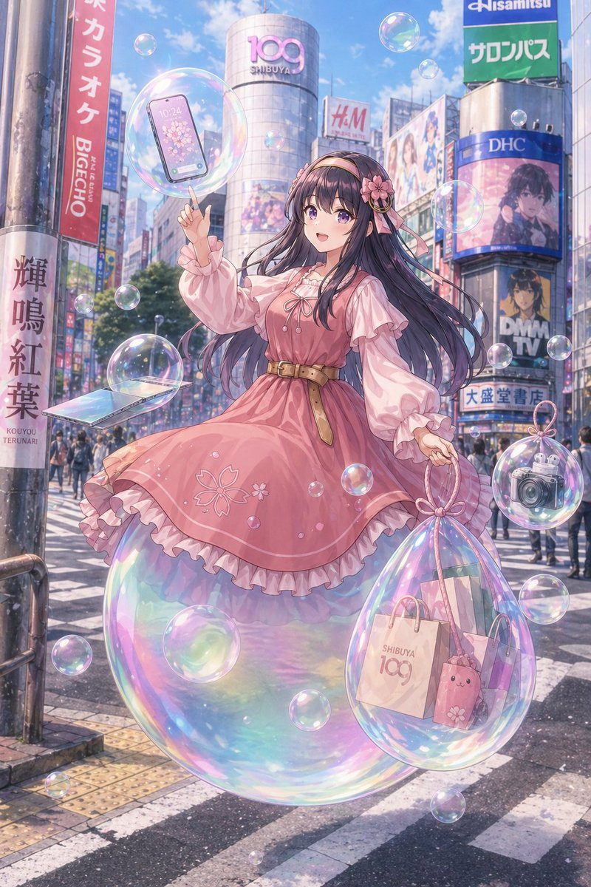 |

**Prompt:**

```
A dreamy anime-style full-body illustration of a fashionable young woman standing in the middle of the Shibuya scramble crossing in Tokyo on a bright clear day, with the iconic cylindrical SHIBUYA 109 building centered in the background and recognizable commercial billboards surrounding it, including signs resembling H&M, DHC, DMM TV, Big Echo, and other dense Japanese city advertisements. She is the single main subject, posed gracefully as if floating or weightless, standing on top of one giant iridescent translucent soap bubble beneath her skirt. Her face is softly obscured and de-emphasized, while her long dark violet-black hair flows dramatically in the wind, with soft bangs and a pink floral headband accessory with ribbon on one side. She wears a sweet feminine spring outfit in pastel pink: a long-sleeved frilled blouse under a sleeveless pink dress with a ribbon tie at the chest, a tan belt at the waist, layered ruffles at the hem, and subtle sakura flower embroidery near the lower skirt. Her expression and body language should feel gentle, elegant, whimsical, and slightly magical. One hand is raised with her index finger pointing upward toward a floating bubble that contains 1 smartphone; her other hand holds a loop handle attached to a large transparent iridescent shopping-bag-like bubble containing 3 visible items: 1 SHIBUYA 109 paper shopping bag, 1 pink shopping bag or package, and 1 small pink bunny-faced pouch. Also include 1 separate floating smartphone/tablet-like device outside the bubbles near the lower left side, and 1 floating bubble on the lower right containing 1 compact camera. Surround her with many soap bubbles of different sizes, all highly reflective with rainbow highlights and delicate transparency, creating a soft sparkling atmosphere. The city scene should be busy but slightly softened, with pedestrians in the far background, crosswalk stripes in the foreground, and warm sunlight filtering through the urban canyon. Use polished high-detail anime illustration rendering, luminous pastel colors, glossy reflections, soft bloom, a romantic spring palette, and a magical everyday Tokyo aesthetic.
```

<!-- Case 165: Stormy Tropical City With Rooftop Plane (by @Gerry) -->
### Case 165: [Stormy Tropical City With Rooftop Plane](https://x.com/Gerry/status/2048303505702629537) (by [@Gerry](https://x.com/Gerry))

| Output |
| :----: |
| 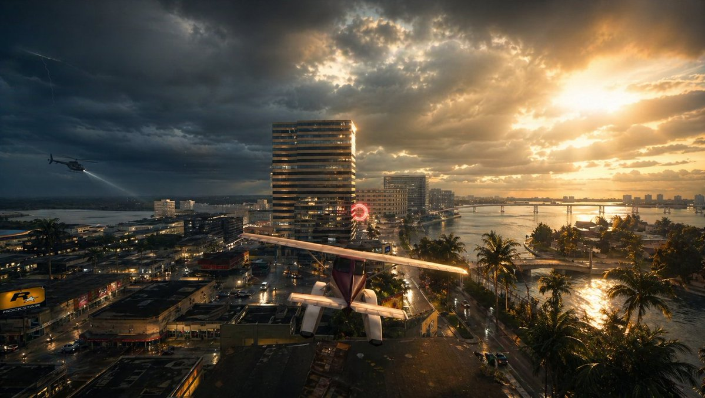 |

**Prompt:**

```
A cinematic wide aerial view of a tropical coastal city at sunset during a violent storm, split dramatically between dark storm clouds on the left and blazing golden sunlight on the right. In the foreground, a small single-engine light airplane with a high wing and visible tail is parked or perched precariously on a flat rooftop, seen from behind and slightly above, centered near the bottom of the frame. To the left midair, 1 helicopter flies low over the city with its searchlight cast downward. In the sky, include 1 faint lightning bolt on the far left. The city below is dense with wet streets, reflective pavement, low-rise commercial buildings, and a few taller modern towers, including 1 prominent striped high-rise near the center. A glowing red circular neon sign is visible near the middle distance. On the right side, a calm bay or inlet curves through the city, lined with 1 row of tall palm trees along the waterfront road, and crossed by 1 long low bridge in the distance. The water and streets glisten from recent rain, reflecting the orange sunlight breaking through the clouds. Mood is tense, dramatic, and slightly surreal, like a movie still from an urban disaster thriller. Photorealistic, ultra-detailed, high dynamic range lighting, volumetric sun rays, storm atmosphere, wet surfaces, rich contrast, deep shadows, golden highlights, wide-angle lens, epic composition.
```

<!-- Case 166: Japanese Chinese Food Delivery Flyer (by @xc5_) -->
### Case 166: [Japanese Chinese Food Delivery Flyer](https://x.com/xc5_/status/2048310696686014935) (by [@xc5_](https://x.com/xc5_))

| Output |
| :----: |
|  |

**Prompt:**

```
A Japanese neighborhood Chinese restaurant delivery flyer for mailbox posting (3:4 aspect ratio). Designed to look like a double-sided B5 print.

Flyer characteristics (following the grammar of real delivery flyers):
- Flashy red and yellow color scheme.
- Large text at the top: "Delivery Available! {argument name="shop name" default="Mona-Hanten"}" (shadowed Gothic font).
- An illustration of a {argument name="character" default="Chinese girl in a red cheongsam with a brown short bob"} holding ramen and saying "Welcome!" in a speech bubble.
- A menu photo grid (4x3) featuring various dishes: different types of ramen, fried rice, gyoza, sweet and sour pork, shrimp in chili sauce, mapo tofu, liver and leek stir-fry, tenshinhan, twice-cooked pork, spring rolls, annin tofu, and fried rice sets.
- Names and prices for each dish.
- A large yellow banner saying "Free delivery on all menu items over ¥1,000!".
- "Order by phone! ☎ 072-XX-XXXX" emphasized with a red circle.
- Business hours "11:00-22:00 (Closed on Tuesdays)".
- Delivery area map (simple schematic map).
- Coupon (perforated line for clipping): "One free plate of gyoza with this flyer!".

Texture of cheap paper printing. Includes fold marks. Precision that could be mistaken for a real Japanese delivery flyer.
```

<!-- Case 167: Pastel Jellyfish Room Goods Poster (by @Ayu_AI_0912) -->
### Case 167: [Pastel Jellyfish Room Goods Poster](https://x.com/Ayu_AI_0912/status/2048309565817766139) (by [@Ayu_AI_0912](https://x.com/Ayu_AI_0912))

| Output |
| :----: |
|  |

**Prompt:**

```
{"type":"pastel lifestyle poster / character room-goods feature sheet","theme":"soft dreamy lavender jellyfish aesthetic","style":"Japanese cute editorial graphic, airy white background, pastel lilac palette, delicate handwritten notes, sparkles and tiny doodles, soft product photography mixed with magazine layout","subject":{"character":{"name":"{argument name=\"character name\" default=\"くらげちゃん\"}","appearance":"young woman with a short platinum-blonde bob haircut, wearing a fluffy pale-lavender zip hoodie over a white inner top, shown from chest up on the lower right, face intentionally obscured with a plain beige rectangle"}},"layout":{"orientation":"vertical poster","background":"clean white with faint pastel doodles of stars, bubbles, tiny jellyfish, and musical notes","sections":[{"title":"header","position":"top","count":5,"labels":["speech bubble intro","main title","small subtitle GOODS","horizontal lavender ribbon tagline","round badge on the top right"]},{"title":"featured goods grid","position":"upper and middle left","count":6,"labels":["ゆらゆらくらげランプ","くらげと夢見るベッドリネン","くらげシェルミラー","くらげグラデマグ","くらげのときめき収納ボックス","くらげふわもこマット"]},{"title":"side handwritten note","position":"upper right","count":1,"labels":["みんなも くらげちゃんRoomで いっしょに まったりしよー♡♡"]},{"title":"room concept box","position":"lower left","count":1,"labels":["くらげちゃんの お部屋作りのこだわり"]},{"title":"pick up circle","position":"lower center-left","count":1,"labels":["Pick up!"]}],"product_images":{"count":6,"items":[{"name":"ゆらゆらくらげランプ","description":"small translucent jellyfish-shaped lamp on a white base, glowing softly in pale blue-lavender"},{"name":"くらげと夢見るベッドリネン","description":"plush pastel-lavender bed with fluffy comforter and pillows, dreamy cozy bedroom styling"},{"name":"くらげシェルミラー","description":"small tabletop mirror with a puffy shell-like pastel-lilac frame and rounded base"},{"name":"くらげグラデマグ","description":"ceramic mug with lavender-to-pink gradient and a simple jellyfish illustration"},{"name":"くらげのときめき収納ボックス","description":"pastel storage box holding cosmetics and small bottles, decorated with a jellyfish emblem"},{"name":"くらげふわもこマット","description":"small fluffy cloud-like or jellyfish-like mat in pale lavender and white"}]},"text_elements":{"main_title":"{argument name=\"headline text\" default=\"くらげちゃんの お部屋アイテム\"}","badge_text":"くらげちゃんの Room お部屋作りの こだわりポイントも 教えちゃうよ。","tagline":"ふわふわで甘くて、ちょっぴり夢みたいな私のお部屋へようこそ♡","speech_bubble":"くらげちゃんの お気に入りだけ集めた お部屋アイテムを紹介するよ♪","concept_points":{"count":3,"items":["色は白とラベンダーで統一!","光が集まるふわっとした空間に","お友達入りのアイテムに囲まれて 自分らしくいられる空間を大切にしてるよ♪"]},"product_blurbs":"each product has a short handwritten Japanese description in a cute casual font beside or below the image"},"composition":"the poster is left-heavy with product cards and text, while the character portrait occupies the lower right third, slightly overlapping the layout","color_palette":{"count":5,"colors":["white","pastel lavender","soft lilac","pale gray-violet","touches of pastel blue-pink gradient"]},"rendering_notes":"keep everything very soft, feminine, and cozy; rounded corners on all product photos; mix of bold Japanese headline typography and light handwritten annotations; subtle shadows; clean high-key lighting; social-media-ready editorial collage aesthetic"}
```

## Casos de Diseno de Personajes

<!-- Case 1: Anime Snapshot Conversion (by @Thereallo1026) -->
### Case 1: [Conversión de Instantánea Anime](https://x.com/Thereallo1026/status/2044241997163311569) (by [@Thereallo1026](https://x.com/Thereallo1026))

| Resultado |
| :----: |
| <a href="https://evolink.ai/gpt-image-2-prompts?utm_source=github&utm_medium=picture&utm_campaign=awesome-gpt-image-2-prompts" target="_blank" rel="noopener noreferrer"></a> |

**Prompt：**

```
Show me the attached image as a snapshot from an actual anime
```
<!-- Case 2: Persona5 Character Reference Card (by @iamrednightS) -->
### Case 2: [Tarjeta de Referencia de Personaje Persona5](https://x.com/iamrednightS/status/2045075682837836265) (by [@iamrednightS](https://x.com/iamrednightS))

| Resultado |
| :----: |
| <a href="https://evolink.ai/gpt-image-2-prompts?utm_source=github&utm_medium=picture&utm_campaign=awesome-gpt-image-2-prompts" target="_blank" rel="noopener noreferrer"></a> |

**Prompt：**

```
基于此角色和背景，请制作一份类似官方设定资料的角色资料卡。
・包含三视图：正面、侧面和背面
・添加角色面部表情的变化・分解并展示服装和装备的详细部分
・添加色板・包含世界观设定的简要说明
・总体上，使用有组织的布局（白色背景，插画风格）高分辨率、专业概念艺术风格
```
<!-- Case 3: Gal Game Character Introduction Page (by @09lyco) -->
### Case 3: [Página de Introducción de Personaje de Gal Game](https://x.com/09lyco/status/2045281845391323175) (by [@09lyco](https://x.com/09lyco))

| Resultado |
| :----: |
| <a href="https://evolink.ai/gpt-image-2-prompts?utm_source=github&utm_medium=picture&utm_campaign=awesome-gpt-image-2-prompts" target="_blank" rel="noopener noreferrer"></a> |

**Prompt：**

```
最新モデルの画像生成ツールを使用して、
このちびキャライラストと立ち絵を使って本物のサイトページのようにキャラクター紹介ページ風イラストを作ってください。 （紹介ページとして使ってもおかしくないもの）
ギャルゲーのキャラクター紹介ページをイメージした高品質なもの。 顔の差分なども乗っている、CGイラストが存在する。ちびキャラが存在する。

「ここに自己紹介」

名前:（ここに名前） 
イメージカラー:（ここに色） 
身長:（ここに身長）cm 
体重:（ここに体重）kg
キャッチコピー:”「ここにセリフ」”
```


<!-- Case 5: Official Character Sheet (JP) (by @Toshi_nyaruo_AI) -->
### Case 5: [Hoja Oficial de Personaje (JP)](https://x.com/Toshi_nyaruo_AI/status/2045025277538107420) (by [@Toshi_nyaruo_AI](https://x.com/Toshi_nyaruo_AI))

| Resultado |
| :----: |
| <a href="https://evolink.ai/gpt-image-2-prompts?utm_source=github&utm_medium=picture&utm_campaign=awesome-gpt-image-2-prompts" target="_blank" rel="noopener noreferrer"></a> |

**Prompt：**

```
このキャラクターと背景を元に、 公式設定資料のようなキャラクターシートを作成してください。 
・正面、側面、背面の3面図を含める ・キャラクターの表情バリエーションを追加 
・衣装や装備の詳細パーツを分解して表示 ・カラーパレットを追加 ・世界観の簡単な説明を入れる 
・全体は整理されたレイアウト
（白背景、図解風） 
・アスペクト比16：9

高解像度、プロのコンセプトアートスタイル
```

<!-- Case 7: Mecha Girl Sea-City Key Visual (by @old_pgmrs_will) -->
### Case 7: [Visual Clave de Chica Mecha Ciudad-Mar](https://x.com/old_pgmrs_will/status/2046144801071079612) (by [@old_pgmrs_will](https://x.com/old_pgmrs_will))

| Resultado |
| :----: |
| <a href="https://evolink.ai/gpt-image-2-prompts?utm_source=github&utm_medium=picture&utm_campaign=awesome-gpt-image-2-prompts" target="_blank" rel="noopener noreferrer"></a> |

**Prompt：**

```
A mecha girl mid-teens, pale skin smudged with soot and salt spray, sharp amber eyes with glowing HUD reticles, waist-length ash-white hair tied in a high ponytail whipping in the sea wind, matte gunmetal exoskeleton armor plating her shoulders, forearms and shins, exposed hydraulic pistons at the joints, chest rig with glowing cyan coolant lines, oversized oil-stained hangar jacket half slipping off one shoulder, a massive rail cannon resting on her right shoulder, dog tags and frayed red ribbon at her collar , standing off-center to the left on the rusted edge of a tilted steel platform jutting out over dark water, weight shifted onto one leg, left hand gripping the cannon strap, head turned slightly toward camera with a quiet defiant stare, steam venting from her back thrusters, her ponytail and jacket streaming sideways in the salt wind , a vast derelict sea-city at dusk, colossal megastructures of unknown purpose rising from the ocean in staggered silhouettes, bone-white monolithic towers fused with barnacled steel, cyclopean ring-shaped constructs canted at broken angles, rusted skeletal gantries threaded with dead cables, dark swells rolling between the pylons, shipwrecks half-swallowed at their feet, thick sea fog clinging to the bases while the upper structures pierce into a bruised sky, scattered faint lights blinking high in the towers like distant eyes , moody low-key lighting, cold teal ambient from the overcast sky, warm amber sodium glow leaking from a distant structure camera-right, hard backlight from a low sun behind the towers carving her silhouette, volumetric god rays cutting through sea mist, wet specular highlights on her armor , 35mm anamorphic lens, slight low angle looking up past her shoulder toward the structures, medium-wide shot, shallow depth of field with foreground rust in soft focus, horizontal lens flares, fine atmospheric haze compressing the distant megastructures into layered silhouettes , cinematic anime key visual, painterly digital illustration with crisp line art, desaturated oceanic palette of teal, bone-white and rust punched by small warm accent lights, film grain, high-contrast editorial poster aesthetic . Format 16:9.
```

<!-- Case 8: Saint Seiya Gold Saints Card Grid (by @songguoxiansen) -->
### Case 8: [Cuadrícula de Tarjetas de los Santos de Oro de Saint Seiya](https://x.com/songguoxiansen/status/2046476566537080849) (by [@songguoxiansen](https://x.com/songguoxiansen))

| Resultado |
| :----: |
| <a href="https://evolink.ai/gpt-image-2-prompts?utm_source=github&utm_medium=picture&utm_campaign=awesome-gpt-image-2-prompts" target="_blank" rel="noopener noreferrer"></a> |

**Prompt：**

```
生成圣斗士星矢12个黄金圣斗士的12宫格卡牌图片,每张卡牌上写上对应的中文名,每行4个,宽高比16:9。
```

<!-- Case 9: Chaos Notes Hidden Face Character Art (by @loglogrog) -->
### Case 9: [Chaos Notes Hidden Face Character Art](https://x.com/loglogrog/status/2046448773162033240) (by [@loglogrog](https://x.com/loglogrog))

| Resultado |
| :----: |
| <a href="https://evolink.ai/gpt-image-2-prompts?utm_source=github&utm_medium=picture&utm_campaign=awesome-gpt-image-2-prompts" target="_blank" rel="noopener noreferrer"></a> |

**Prompt：**

```
# 混沌としたメモ書き・記号の集合体からキャラクターの顔を浮かび上がらせるアート

--- スタイル
- 白い紙の上に黒インクで描かれた大量の手書きメモ、数式、記号、ランダムな線。
- 紙いっぱいに散らばる書き殴り風のカオス。
- 所々に赤インクの強調(ライン、塗り潰し、マーカー風の塊)。
- アナログのノート落書きのような質感。

--- 構図
- ランダムなメモや記号が全体を覆い尽くす。
- 黒インクの線や文字の密度が「キャラクターの顔」の位置に集中する。
- 結果として、混沌の中から「与えられたキャラクターの顔のシルエット・表情」がうっすら浮かび上がる。
- 顔は写実的ではなく、カオスの断片が集まって形を成す。

--- 色彩
- モノクロ(黒・白)を主体に構成。
- 赤インクをアクセントとして散発的に配置。
- 彩度は抑えめ、アナログの紙とインク感を重視。

--- 表現要素
- 読めるようで読めない文字列、日本語や英数字が混在。
- 数式記号、矢印、点、斜線、クロス、ドリップ(インクの飛び散り)。
- キャラクターの顔の目や髪の輪郭は、メモや記号の配置の「余白」や「濃淡」で浮かび上がる。

--- 禁止事項
- 顔を直接的に描き込む写実ポートレート。
- デジタル処理的で整然とした幾何学模様。
- カラフルな彩色や過飽和表現。
- ロゴ、透かし、人工的なCG感。

--- Definition of Done (DoD)
- 全体は「混沌としたメモ・記号の集合体」として成立している。  
- 与えられたキャラクターの顔が、混沌の濃淡・配置から自然に浮かび上がる。  
- 色はモノクロ+赤アクセントのみ。  
- 紙とインクの手描き的質感を保持している。
```

<!-- Case 10: Anime Martial Arts Battle Illustration (by @Tanemomi_Ver2) -->
### Case 10: [Anime Martial Arts Battle Illustration](https://x.com/Tanemomi_Ver2/status/2046063806846214265) (by [@Tanemomi_Ver2](https://x.com/Tanemomi_Ver2))

| Output |
| :----: |
| 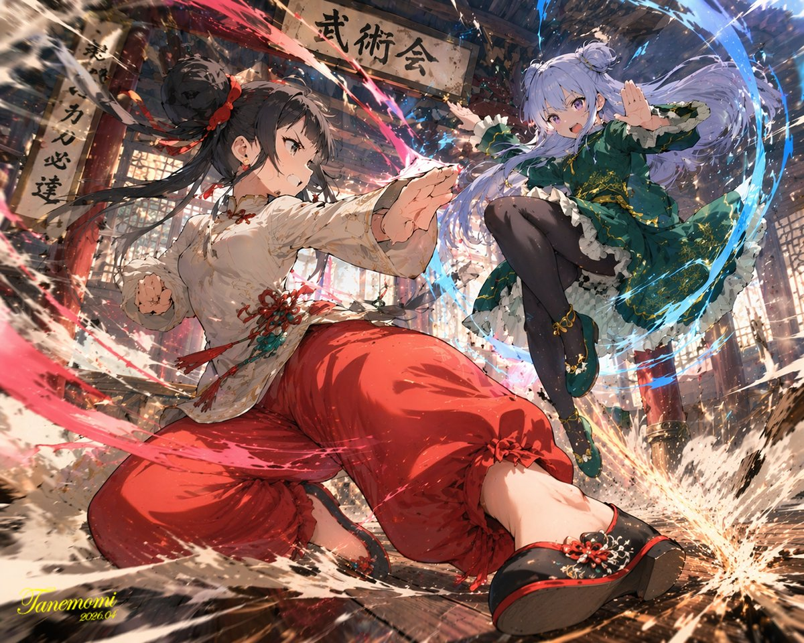 |

**Prompt:**

```
An anime-style illustration of a {argument name="action type" default="high-impact martial arts battle"} between two young female fighters in a {argument name="setting" default="traditional wooden martial arts dojo"}. In the foreground, a girl with black hair in a high bun wears a {argument name="character 1 color theme" default="red and white"} Chinese-style martial arts outfit with baggy pants. She is in a dynamic, low, forward-thrusting stance, surrounded by swirling red energy and water splashes. In the background to the right, a girl with light purple hair in twin buns wears a {argument name="character 2 color theme" default="green and purple"} Chinese dress with gold embroidery and black tights. She is leaping through the air in a flying kick pose, surrounded by swirling blue energy. The wooden floorboards are splintering from the intense impact, with debris and dust flying through the air. Above them hangs a weathered wooden sign with the text "{argument name="sign text" default="武術会"}". The scene features dramatic lighting, a low-angle dynamic perspective, and intense action effects.
```

<!-- Case 11: GTA 6 in Bangalore Flower Market (by @ismajc) -->
### Case 11: [GTA 6 in Bangalore Flower Market](https://x.com/ismajc/status/2048174302164394493) (by [@ismajc](https://x.com/ismajc))

| Output |
| :----: |
| 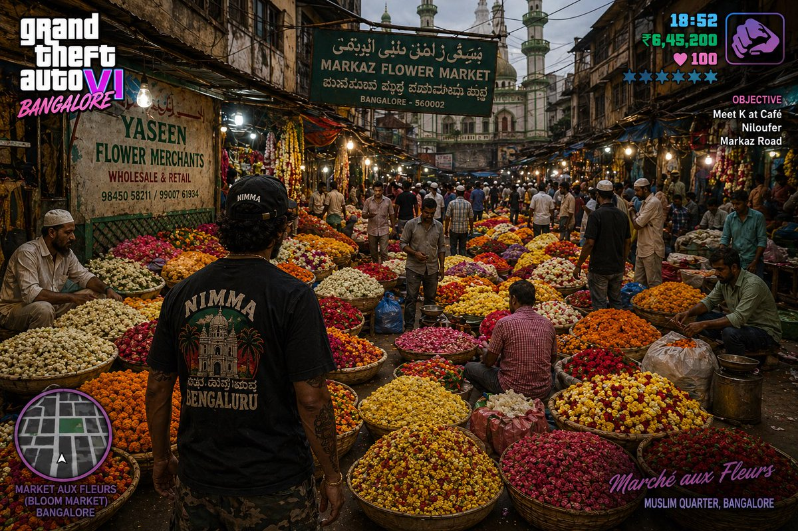 |

**Prompt:**

```
{argument name="game" default="gta 6"} in {argument name="location" default="Bangalore’s market flower"} in India
```

<!-- Case 12: GTA 6 Shinjuku Bar Scene (by @ismajc) -->
### Case 12: [GTA 6 Shinjuku Bar Scene](https://x.com/ismajc/status/2048166630933282995) (by [@ismajc](https://x.com/ismajc))

| Output |
| :----: |
| 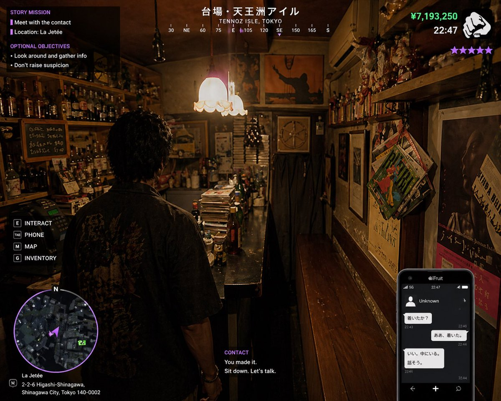 |

**Prompt:**

```
{argument name="game" default="GTA 6"} in {argument name="bar name" default="La Jetée Bar"} (that pays homage to Chris Marker) in {argument name="location" default="Shinjuku, Tokyo"}
```

<!-- Case 13: Eleanor from White Cat Project (by @yume00112211) -->
### Case 13: [Eleanor from White Cat Project](https://x.com/yume00112211/status/2048309139013853421) (by [@yume00112211](https://x.com/yume00112211))

| Output |
| :----: |
| 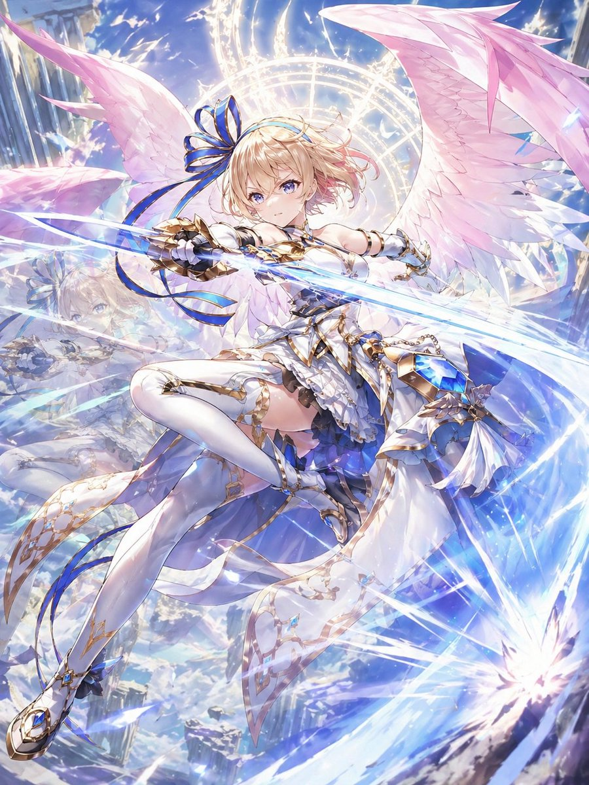 |

**Prompt:**

```
{argument name="series" default="White Cat Project"}
{argument name="character" default="Eleanor"}
```

## Casos de UI y Mockups de Redes Sociales

<!-- Case 1: One-Prompt UI Design Generation (by @austinit) -->
### Case 1: [One-Prompt UI Design Generation](https://x.com/austinit/status/2044968740782272596) (by [@austinit](https://x.com/austinit))

| Output |
| :----: |
| <a href="https://evolink.ai/gpt-image-2-prompts?utm_source=github&utm_medium=picture&utm_campaign=awesome-gpt-image-2-prompts" target="_blank" rel="noopener noreferrer"></a> |

**Indicación:**

```
用这种风格帮我生成一套UI设计系统，包含网页、移动端、卡片、控件、按钮 以及其它
```
<!-- Case 2: Amateur iPhone Keynote Snapshot (by @patrickassale) -->
### Case 2: [Amateur iPhone Keynote Snapshot](https://x.com/patrickassale/status/2044687244368441742) (by [@patrickassale](https://x.com/patrickassale))

| Output |
| :----: |
| <a href="https://evolink.ai/gpt-image-2-prompts?utm_source=github&utm_medium=picture&utm_campaign=awesome-gpt-image-2-prompts" target="_blank" rel="noopener noreferrer"></a> |

**Indicación:**

```
Amateur iPhone photo at Apple Park during the iPhone 20 keynote, Tim Cook presenting on stage. Shot from the crowd at a distance
```
<!-- Case 3: Handwritten Notebook Photo (by @patrickassale) -->
### Case 3: [Handwritten Notebook Photo](https://x.com/patrickassale/status/2044569086013718958) (by [@patrickassale](https://x.com/patrickassale))

| Output |
| :----: |
| <a href="https://evolink.ai/gpt-image-2-prompts?utm_source=github&utm_medium=picture&utm_campaign=awesome-gpt-image-2-prompts" target="_blank" rel="noopener noreferrer"></a> |

**Indicación:**

```
Amateur photo of an open notebook lying flat, filled with handwritten notes in black ballpoint pen. The handwriting is casual and slightly messy, like personnal notes, natural imperfections, crossed out words, underlined headings. Shot from slightly above, natural daylight from a window, no flash. Casual desk setting, shot on iPhone
```
<!-- Case 4: Song Dynasty Social Media Feed (by @Panda20230902) -->
### Case 4: [Song Dynasty Social Media Feed](https://x.com/Panda20230902/status/2045385588065313057) (by [@Panda20230902](https://x.com/Panda20230902))

| Output |
| :----: |
| <a href="https://evolink.ai/gpt-image-2-prompts?utm_source=github&utm_medium=picture&utm_campaign=awesome-gpt-image-2-prompts" target="_blank" rel="noopener noreferrer"></a> |

**Indicación:**

```
"宋朝人的朋友圈"/"SONG DYNASTY SOCIAL MEDIA FEED"，古今穿越幽默融合界面设计风格，画面模拟手机社交媒体界面，但内容全部是宋朝场景头像是宋代文人画像，用户名"苏东坡SuShi_Official"，发布内容"刚到黄州，被贬了但心情还行。今天自己做了东坡肉，味道绝了，附菜谱："，配图为工笔画风格的东坡肉特写，点赞列表"黄庭坚、秦观、佛印等126人"，评论区"王安石：呵呵""司马光：还是那个味道"，界面元素如点赞图标用宋代花纹替代，状态栏显示"大宋移动 5G"和"元丰三年"，配色为手机深色模式搭配宋代雅致色调，历史与社交媒体的趣味碰撞杰作
```
<!-- Case 5: Multi-Platform Content Screenshots (by @MrLarus) -->
### Case 5: [Multi-Platform Content Screenshots](https://x.com/MrLarus/status/2045373105041007013) (by [@MrLarus](https://x.com/MrLarus))

| Output |
| :----: |
| <a href="https://evolink.ai/gpt-image-2-prompts?utm_source=github&utm_medium=picture&utm_campaign=awesome-gpt-image-2-prompts" target="_blank" rel="noopener noreferrer"></a> |

**Indicación:**

```
1、生成视频号内容截图，主题：中老年不要盲目催婚，iPhone尺寸
2、生成抖音内容截图，主题：跟上AI浪潮9.9包教会，iPhone尺寸
3、生成小红书内容截图，主题：精致女孩背后都有网贷，iPhone尺寸
4、生成快手内容截图：主题：直播离婚预告，iPhone尺寸
```

<!-- Case 7: Liu Yifei Douyin Livestream Screenshot (by @alanblogsooo) -->
### Case 7: [Liu Yifei Douyin Livestream Screenshot](https://x.com/alanblogsooo/status/2044784762594918516) (by [@alanblogsooo](https://x.com/alanblogsooo))

| Output |
| :----: |
| <a href="https://evolink.ai/gpt-image-2-prompts?utm_source=github&utm_medium=picture&utm_campaign=awesome-gpt-image-2-prompts" target="_blank" rel="noopener noreferrer"></a> |

**Indicación:**

```
9:16 的图片比例，生成一张抖音直播的截图，里面是 刘亦菲 在直播，刘亦菲 手里拿着牌子，牌子里写着 今晚直播，欢迎来参亦菲畅聊！
```
<!-- Case 8: King Taejo Yi Seong-gye's X Page (by @SKA_Neotype) -->
### Case 8: [King Taejo Yi Seong-gye's X Page](https://x.com/SKA_Neotype/status/2044637900978217334) (by [@SKA_Neotype](https://x.com/SKA_Neotype))

| Output |
| :----: |
| <a href="https://evolink.ai/gpt-image-2-prompts?utm_source=github&utm_medium=picture&utm_campaign=awesome-gpt-image-2-prompts" target="_blank" rel="noopener noreferrer"></a> |

**Indicación:**

```
태조 이성계의 X  페이지(위화도 회군을 벌이기 직전- 최영 장군과 서로 디스하는 내용이 담긴 게시글들)을 만들어 주세요.
```

<!-- Case 9: Style-to-UI Design System (by @stark_nico99) -->
### Case 9: [Style-to-UI Design System](https://x.com/stark_nico99/status/2045836554451706125) (by [@stark_nico99](https://x.com/stark_nico99))

| Output |
| :----: |
| <a href="https://evolink.ai/gpt-image-2-prompts?utm_source=github&utm_medium=picture&utm_campaign=awesome-gpt-image-2-prompts" target="_blank" rel="noopener noreferrer"></a> |

**Indicación:**

```
用这种风格帮我生成一套UI设计系统，包含网页、移动端、卡片、控件、按钮以及其它。把这套视觉风格作为参考生成网页。我尝试了宇宙、飞行、蝴蝶主题。
```

<!-- Case 10: Momotaro Explainer Slide (by @yammamon) -->
### Case 10: [Momotaro Explainer Slide](https://x.com/yammamon/status/2045778624092254603) (by [@yammamon](https://x.com/yammamon))

| Output |
| :----: |
| <a href="https://evolink.ai/gpt-image-2-prompts?utm_source=github&utm_medium=picture&utm_campaign=awesome-gpt-image-2-prompts" target="_blank" rel="noopener noreferrer"></a> |

**Indicación:**

```
「いらすとや」のほのぼのとした雰囲気と、「霞ヶ関スライド」の圧倒的な情報密度を融合させた、桃太郎の解説スライド（ポンチ絵）を作成して
```

<!-- Case 25: Museum-Style Hanfu Breakdown Infographic (by @MrLarus) -->
### Case 25: [Museum-Style Hanfu Breakdown Infographic](https://x.com/MrLarus/status/2045504669401653414) (by [@MrLarus](https://x.com/MrLarus))

| Output |
| :----: |
| <a href="https://evolink.ai/gpt-image-2-prompts?utm_source=github&utm_medium=picture&utm_campaign=awesome-gpt-image-2-prompts" target="_blank" rel="noopener noreferrer"></a> |

**Indicación:**

```
请根据【主题】自动生成一张“博物馆图鉴式中文拆解信息图”。

要求整张图兼具真实写实主视觉、结构拆解、中文标注、材质说明、纹样寓意、色彩含义和核心特征总结。你需要根据【主题】自动判断最合适的主体对象、服饰体系、器物结构、时代风格、关键部件、材质工艺、颜色方案与版式结构，用户无需再提供其他信息。

整体风格应为：国家博物馆展板、历史服饰图鉴、文博专题信息图，而不是普通海报、古风写真、电商详情页或动漫插画。背景采用米白、绢纸白、浅茶色等纸张质感，整体高级、克制、专业、可收藏。

版式固定为：
- 顶部：中文主标题 + 副标题 + 导语
- 左侧：结构拆解区，中文引线标注关键部件，并配局部特写
- 右上：材质 / 工艺 / 质感区，展示真实纹理小样并附说明
- 右中：纹样 / 色彩 / 寓意区，展示主色板、纹样样本和文化解释
- 底部：穿着顺序 / 构成流程图 + 核心特征总结

若主题适合人物展示，则以真实人物全身站姿为中央主体；若更适合器物或单体结构，则改为中心主体拆解图，但整体仍保持完整中文信息图形式。所有文字必须为简体中文，清晰、规整、可读，不要乱码、错字、英文或拼音。重点突出真实结构、材质差异、文化说明与图鉴气质。

避免：海报感、影楼感、电商感、动漫感、cosplay感、乱标注、错结构、糊字、假材质、过度装饰。
```

<!-- Case 32: Palm Reading Diagnosis Report (by @agi_aibusi) -->
### Case 32: [Palm Reading Diagnosis Report](https://x.com/agi_aibusi/status/2046530764871696750) (by [@agi_aibusi](https://x.com/agi_aibusi))

| Output |
| :----: |
| <a href="https://evolink.ai/gpt-image-2-prompts?utm_source=github&utm_medium=picture&utm_campaign=awesome-gpt-image-2-prompts" target="_blank" rel="noopener noreferrer"></a> |

**Indicación:**

```
GPT-image-2でこの手相を診断して詳細な鑑定書を作って
生命線・知能線・感情線・運命線・太陽線・財運線・結婚線を、線の形状・濃淡・枝分かれ・起点終点まで分析すること。
助言を重点的に高品質な占い鑑定書にまとめること。
```

<!-- Case 33: Calligraphy Copybook Sheet (by @MrLarus) -->
### Case 33: [Calligraphy Copybook Sheet](https://x.com/MrLarus/status/2046510310253539764) (by [@MrLarus](https://x.com/MrLarus))

| Output |
| :----: |
| <a href="https://evolink.ai/gpt-image-2-prompts?utm_source=github&utm_medium=picture&utm_campaign=awesome-gpt-image-2-prompts" target="_blank" rel="noopener noreferrer"></a> |

**Indicación:**

```
生成一张【字体】书法临摹字帖
```

<!-- Case 34: Don Quijote Promo Pop Poster (by @loglogrog) -->
### Case 34: [Don Quijote Promo Pop Poster](https://x.com/loglogrog/status/2046437230127034774) (by [@loglogrog](https://x.com/loglogrog))

| Output |
| :----: |
| <a href="https://evolink.ai/gpt-image-2-prompts?utm_source=github&utm_medium=picture&utm_campaign=awesome-gpt-image-2-prompts" target="_blank" rel="noopener noreferrer"></a> |

**Indicación:**

```
GPT Image 2を使って、OpenClawの情報を調べてドンキの広告ポップ風に実際のドンキに貼っているような感じで画像生成してください
```

<!-- Case 35: Japanese Gacha Game Screen (by @the_wheel_2024) -->
### Case 35: [Japanese Gacha Game Screen](https://x.com/the_wheel_2024/status/2046519658166317160) (by [@the_wheel_2024](https://x.com/the_wheel_2024))

| Output |
| :----: |
| <a href="https://evolink.ai/gpt-image-2-prompts?utm_source=github&utm_medium=picture&utm_campaign=awesome-gpt-image-2-prompts" target="_blank" rel="noopener noreferrer"></a> |

**Indicación:**

```
日本のソシャゲのガチャ画面を生成して、
```

<!-- Case 36: Elon Musk Douyin Livestream Screenshot (by @Shinning1010) -->
### Case 36: [Elon Musk Douyin Livestream Screenshot](https://x.com/Shinning1010/status/2046501587762188535) (by [@Shinning1010](https://x.com/Shinning1010))

| Output |
| :----: |
| <a href="https://evolink.ai/gpt-image-2-prompts?utm_source=github&utm_medium=picture&utm_campaign=awesome-gpt-image-2-prompts" target="_blank" rel="noopener noreferrer"></a> |

**Indicación:**

```
A 9:16 vertical version, high-detail realistic style Chinese TikTok live screenshot, Elon Musk is talking to the mobile phone camera in the live broadcast room, excited, smiling, and the live atmosphere is warm and real. He held a white handwritten sign in one hand, which clearly said: "Thank you Shinning". There are obvious Chinese TikTok interface elements in the live broadcast screen, including likes, comments and share icons arranged vertically on the right, scrolling Chinese bullet screens and interactive comments below, and the "live broadcast" logo at the top, which looks like a real mobile phone screenshot. There is an eye-catching gift prompt special effect in the screen: "Shinning sent TikTok No. 1", with gift animation light effect and platform-style prompt box. Musk is in a professional live broadcast environment, with a mobile phone holder, a ring fill light and a desktop microphone in front of him. The background is a modern technology live broadcast room with bright lights and a slight neon atmosphere. The composition is real and natural, like the ongoing live screenshot of the Chinese short video platform. The interface information is rich but not messy, the characters are clear, the expression is vivid, the details are rich, the sense of real photography, the depth of field, high definition, cinematic, photorealistic, realistic livestream screenshot, social media UI, Chinese Douyin live room, detailed lighting, natural skin texture.

Negative prompts:

Low definition, blur, cartoon, illustration, too strong CG sense, two-dimensional, deformed fingers, wrong text, scrambled code, multiple mobile phones, multiple brands, character repetition, face collapse, facial features distortion, excessive skin polishing, overexposure, too dark, messy background, wrong UI, non-Chinese short video interface, too many English bullet screens, gift special effects are not obvious, cropping error, proportional error

Supplementary reinforcement words:

Real mobile phone screen recording screenshot feeling, the live broadcast UI is complete, the gift prompt box conforms to the style of the Chinese short video platform, the Chinese comment area is active, the number of people online in the live broadcast room is clearly displayed, and the time, power and signal bar are visible.
```

<!-- Case 37: Liu Yifei Douyin Livestream Screenshot (by @kylegeeks) -->
### Case 37: [Liu Yifei Douyin Livestream Screenshot](https://x.com/kylegeeks/status/2046479783765397629) (by [@kylegeeks](https://x.com/kylegeeks))

| Output |
| :----: |
| <a href="https://evolink.ai/gpt-image-2-prompts?utm_source=github&utm_medium=picture&utm_campaign=awesome-gpt-image-2-prompts" target="_blank" rel="noopener noreferrer"></a> |

**Indicación:**

```
9:16 的图片比例,生成一张抖音直播的截图,里面是 刘亦菲 在直播,刘亦菲 手里拿着牌子,牌子里写着 今晚直播,欢迎来参亦菲畅聊!
```

<!-- Case 38: Cyberpunk Neon UI Design System (by @AZLnfvp) -->
### Case 38: [Cyberpunk Neon UI Design System](https://x.com/AZLnfvp/status/2046468976092533180) (by [@AZLnfvp](https://x.com/AZLnfvp))

| Output |
| :----: |
| <a href="https://evolink.ai/gpt-image-2-prompts?utm_source=github&utm_medium=picture&utm_campaign=awesome-gpt-image-2-prompts" target="_blank" rel="noopener noreferrer"></a> |

**Indicación:**

```
用未来都市风格生成UI设计系统,灵感来自赛博朋克城市夜景,包含霓虹灯、玻璃建筑反射、高对比光影,配色以紫色、蓝色、粉色霓虹为主,设计网页Dashboard、移动端界面、卡片、按钮、控件等,视觉炫酷、层次丰富、科技感极强
```

<!-- Case 39: Trump and Kim Livestream PK Screenshot (by @alanlovelq) -->
### Case 39: [Trump and Kim Livestream PK Screenshot](https://x.com/alanlovelq/status/2046048929490612464) (by [@alanlovelq](https://x.com/alanlovelq))

| Output |
| :----: |
| <a href="https://evolink.ai/gpt-image-2-prompts?utm_source=github&utm_medium=picture&utm_campaign=awesome-gpt-image-2-prompts" target="_blank" rel="noopener noreferrer"></a> |

**Indicación:**

```
1、生成特朗普和金正恩在抖音直播间打PK的截图  
2、生成不知火舞的小红书主页截图  
3、生成图片: 手写在教室黑板上的出师表全文,真实感的粉笔字迹,晴朗白天用iPhone手机实拍  
4、生成图片: T-800机器人的淘宝商品详情页,展示: 机器人的正面侧面背面三视图, 产品价格, 产品细节, 功能和使用场景等
```

<!-- Case 40: Japanese AI Game Dev Overview Slide Prompt (by @ailovedirector) -->
### Case 40: [Japanese AI Game Dev Overview Slide Prompt](https://x.com/ailovedirector/status/2046905387274891296) (by [@ailovedirector](https://x.com/ailovedirector))

| Output |
| :----: |
| <a href="https://evolink.ai/gpt-image-2-prompts?utm_source=github&utm_medium=picture&utm_campaign=awesome-gpt-image-2-prompts" target="_blank" rel="noopener noreferrer"></a> |

**Indicación:**

```
横長のパワポ画像ここで生成してみて　どのモデル使ってるか判定するから、今のAIゲーム開発の概要をまとめた1枚パワポで　日本語で

ゲーム開発の技術に関して、工数ベースでどこにパワーかかるかの分析資料といかに量産が大事かについての説明とかのパワポ画も作って
```


**Indicación:**
```
a Final Fantasy VIII Remake gameplay screenshot at next-gen fidelity (FF16 / GTA6 / RE9).
```

---


**Indicación:**
```
Create a commercial ad from the storyboard @[image1]
```

---


<!-- Case 41: based on the generated character help me generate a screenshot of screenshot ... (by @khaiinit) -->
### Case 41: [Captura de Pantalla de Juego PVP con Personaje](https://x.com/khaiinit/status/2047219694130827273) (by [@khaiinit](https://x.com/khaiinit))

| Output |
| :----: |
|  |

**Indicación:**

```
based on the generated character help me generate a screenshot of screenshot of an pvp game themed around *zelda: wind breaker*
```

<!-- Case 42: Create a landing page using this image as a reference for style and color gra... (by @D_studioproject) -->
### Case 42: [Página de Aterrizaje con Referencia de Estilo](https://x.com/D_studioproject/status/2047212826264211540) (by [@D_studioproject](https://x.com/D_studioproject))

| Output |
| :----: |
|  |

**Indicación:**

```
Create a landing page using this image as a reference for style and color grading.
```

<!-- Case 43: Li Jiaqi Lipstick Livestream Background (by @songguoxiansen) -->
### Case 43: [Fondo de Transmisión en Vivo de Lápiz Labial de Li Jiaqi](https://x.com/songguoxiansen/status/2047207826913972518) (by [@songguoxiansen](https://x.com/songguoxiansen))

| Output |
| :----: |
|  |

**Indicación:**

```
李佳琦直播间背景，口红矩阵展示墙，暖光氛围灯，文案OMG买它
```

<!-- Case 44: Apple Pods Pro 3 Headphone E-Commerce Infographic (by @meng_dagg695) -->
### Case 44: [Apple Pods Pro 3 Headphone E-Commerce Infographic](https://x.com/meng_dagg695/status/2047935217231663186) (by [@meng_dagg695](https://x.com/meng_dagg695))

| Output |
| :----: |
| <a href="https://evolink.ai/gpt-image-2-prompts?utm_source=github&utm_medium=picture&utm_campaign=awesome-gpt-image-2-prompts" target="_blank" rel="noopener noreferrer">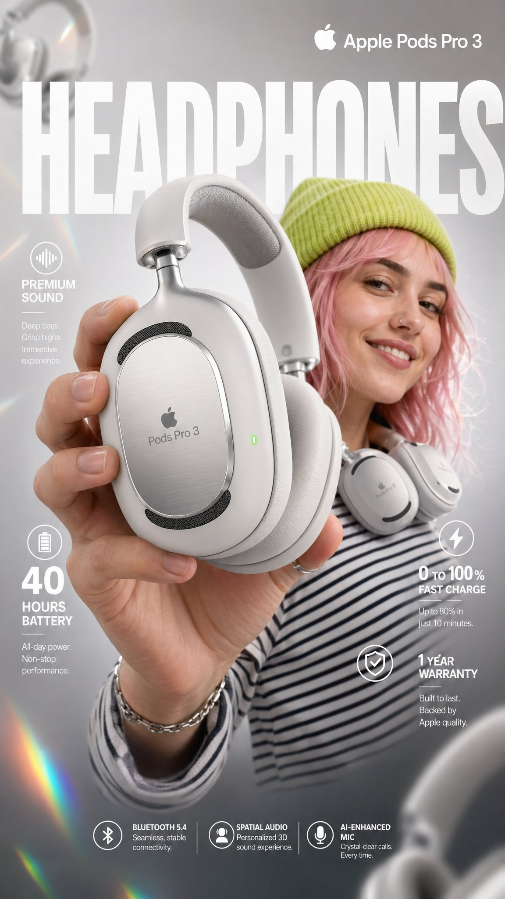</a> |

**Prompt:**

```
High-impact e-commerce infographic for "Apple Pods Pro 3" 
premium wireless over-ear headphones.

FOREGROUND - PRODUCT HERO SHOT
Extreme close-up of a hand holding a sleek, 
matte-white premium over-ear headphone toward the camera 
at a slight angle. The headphone features:
- Glossy white ear cushions with soft memory foam padding
- Brushed aluminum silver headband with subtle Apple Pods 
  Pro 3 embossed branding
- Black mesh speaker grille visible on the ear cup face
- A tiny glowing green LED status indicator on the 
  right ear cup edge
- Subtle touch-control icons etched on the outer cup surface

Macro-lens shallow depth of field — hand and headphone 
slightly blurred at edges to create cinematic depth. 
Product remains razor-sharp in center frame.

CENTRAL SUBJECT — MODEL
In the mid-ground: a smiling young woman with freckles 
and wavy pastel-pink hair. She wears:
- A vibrant lime-green knit beanie
- A psychedelic black and white-striped long-sleeve shirt
- The white over-ear headphones resting stylishly 
  around her neck (not on ears) — one hand casually 
  touching the ear cup

Expression: relaxed, confident, joyful. 
She is glancing slightly off-camera with a natural smile.

BACKGROUND & ATMOSPHERE
Clean soft-focus studio backdrop — light gray gradient 
fading to warm white at center. 

Atmospheric overlays:
- Diagonal rainbow prism lens flares cutting across 
  upper-left to lower-right
- Soft pastel light leaks in pink and yellow at corners
- 4–5 blurred white over-ear headphones floating 
  artistically in the background at various depths 
  and rotation angles
- Subtle bokeh circles from background studio lights

Lighting: Soft professional three-point studio lighting. 
Key light from upper-left, fill light right side. 
Rim light behind model for separation. 
Glossy highlights on headphone surfaces catching light naturally.

TYPOGRAPHY & LAYOUT — Sans-Serif, Clean white 
TOP CENTER (behind model, large background text):
→ Massive bold oversized text: "HEADPHONES"
   Semi-transparent white, spanning full width behind subject

TOP RIGHT CORNER:
→ Bold clean text: "Apple Pods Pro 3"
   Subtitle smaller text: "Over-Ear Wireless"

MID LEFT:
→ Icon: small sound wave symbol
→ Bold text: "Premium Sound"
→ Sub-text: "Active Noise Cancellation + Transparency Mode"

MID RIGHT:
→ Extra-large bold numeral: "40"
→ Smaller text below: "hours of battery life"

LOWER LEFT:
→ Extra-large bold numeral: "0"
   with "to" beside it → then bold "100%"
→ Sub-text: "Fast charge — 10 min = 3hrs playback"

BOTTOM RIGHT:
→ Extra-large bold numeral: "1"
→ Sub-text: "Year Warranty Included"

BOTTOM CENTER (fine print style):
→ Small elegant text: 
   "Bluetooth 5.4  |  Hi-Res Audio Certified  
    |  Foldable Design  |  USB-C Charging"

TECHNICAL SPECS
Resolution: 8K ultra-sharp
Style: Commercial product photography meets 
       editorial fashion advertising
Color Palette: White, lime green, pastel pink, 
               rainbow prism accents
Focus: Tack-sharp on headphone product — 
       shallow DOF on everything else
Lens: 85mm macro, slight low angle
Render Quality: Hyperrealistic, clean ad aesthetic, 
                vibrant yet professional color grading
```

<!-- Case 45: Apple Pods Pro 3 Earbuds E-Commerce Infographic (by @rovvmut_) -->
### Case 45: [Apple Pods Pro 3 Earbuds E-Commerce Infographic](https://x.com/rovvmut_/status/2047912710365761828) (by [@rovvmut_](https://x.com/rovvmut_))

| Output |
| :----: |
| <a href="https://evolink.ai/gpt-image-2-prompts?utm_source=github&utm_medium=picture&utm_campaign=awesome-gpt-image-2-prompts" target="_blank" rel="noopener noreferrer">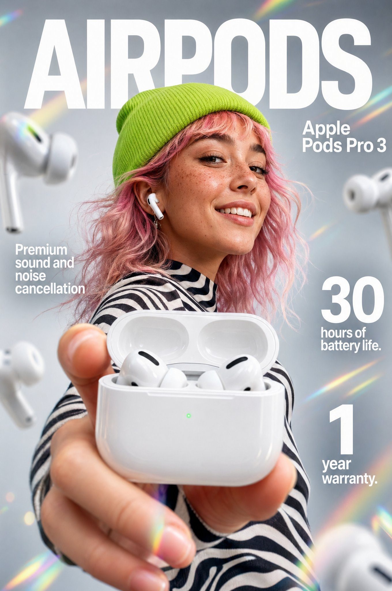</a> |

**Prompt:**

```
High-impact e-commerce infographic for "Apple Pods Pro 3" wireless earbuds.
```

<!-- Case 46: Beauty Product Commercial Marketing Photograph (by @AIwithSarah_) -->
### Case 46: [Beauty Product Commercial Marketing Photograph](https://x.com/AIwithSarah_/status/2047904483359760677) (by [@AIwithSarah_](https://x.com/AIwithSarah_))

| Output |
| :----: |
| <a href="https://evolink.ai/gpt-image-2-prompts?utm_source=github&utm_medium=picture&utm_campaign=awesome-gpt-image-2-prompts" target="_blank" rel="noopener noreferrer"></a> |

**Prompt:**

```
A high-resolution commercial marketing photograph features a young woman with sleek dark hair and a pink ribbed top in a neutral grey studio setting, centered behind a glossy Ellie Beauty spray bottle held prominently in the foreground. The composition is energized by vibrant, lime-green graphic "swooshes" and floating pill-shaped callouts that highlight product features like "glossy finish" and "upto 450°F protection" in bold black sans-serif text. The lighting is professionally diffused, casting soft highlights on the model’s face while creating a sharp, vertical reflection on the metallic green-to-gold gradient bottle label. Topping the scene is a large, lime-green headline in the upper right asking, "What does it do?", altogether creating a clean, modern, and high-contrast aesthetic with a shallow depth of field that keeps the product and the model's focused expression in sharp relief.
```

<!-- Case 47: AAA Video Game Screenshot Concept Design (by @ChiefMonkeyMike) -->
### Case 47: [AAA Video Game Screenshot Concept Design](https://x.com/ChiefMonkeyMike/status/2047828814580138156) (by [@ChiefMonkeyMike](https://x.com/ChiefMonkeyMike))

| Output |
| :----: |
| <a href="https://evolink.ai/gpt-image-2-prompts?utm_source=github&utm_medium=picture&utm_campaign=awesome-gpt-image-2-prompts" target="_blank" rel="noopener noreferrer"></a> |

**Prompt:**

```
generate screenshots from a AAA video game based off what The Sims Castaways sequel could look like. https://t.co/aL7hMdUYvj
```

<!-- Case 89: E-commerce Live Stream UI Mockup (by @sjbbxhz) -->
### Case 89: [E-commerce Live Stream UI Mockup](https://x.com/sjbbxhz/status/2045684734714380687) (by [@sjbbxhz](https://x.com/sjbbxhz))

| Output |
| :----: |
|  |

**Prompt:**

```
{
  "type": "live stream UI mockup",
  "subject": {
    "description": "portrait of {argument name=\"host name\" default=\"Elon Musk\"}, smiling, wearing a black t-shirt with a white technical schematic graphic",
    "background": "left side shows a screen with '{argument name=\"left background logo\" default=\"SPACEX\"}' text, right side shows a red '{argument name=\"right background logo\" default=\"Tesla T logo\"}' and a dark car"
  },
  "ui_overlay": {
    "top_header": {
      "host_info": "avatar, name '{argument name=\"host name\" default=\"Elon Musk\"}', subtext '55.6万本场点赞', red '关注' button",
      "rank_badge": "gold coin icon with '全站第1名'",
      "viewer_stats": "3 top viewer avatars with '12.3w', '8.6w', '5.7w', total '68.7万', 'X' close button",
      "right_links": "'更多直播 >', '礼物展馆 0/24' with blue '经典' tag"
    },
    "mid_left_gifts": {
      "count": 2,
      "items": [
        "avatar '科技爱好者', '送小心心', heart icon x 1314",
        "avatar '星辰大海', '送火箭', rocket icon x 666"
      ]
    },
    "bottom_left_chat": {
      "system_message": "level 37 badge '宇宙漫游者 加入了直播间'",
      "message_count": 7,
      "messages": [
        "小火箭: 马斯克!未来可期!🚀",
        "future: 特斯拉Model 2什么时候出?",
        "星空梦想家: SpaceX今年能上火星吗?",
        "AI探索者: Neuralink进展如何?",
        "帅气的网友: 马总好!",
        "Mars: 第一次来你的直播,超激动!",
        "用户123: 讲讲AI吧,会取代人类吗?"
      ]
    },
    "bottom_right_product_card": {
      "hot_tag": "orange '热卖 x 1888'",
      "image": "Tesla Cybertruck",
      "title": "{argument name=\"product name\" default=\"特斯拉Cybertruck 电动皮卡\"}",
      "price": "{argument name=\"product price\" default=\"¥ 1,618,000\"}",
      "button": "red '抢' button",
      "floating_animation": "translucent hearts floating up the right edge"
    },
    "bottom_bar": {
      "input_field": "'说点什么...'",
      "icons": ["smiley face", "three dots", "shopping cart", "gift box", "share"]
    }
  }
}
```

<!-- Case 90: 4-Panel Japanese Digital Ad Banner Grid (by @makaneko_AI) -->
### Case 90: [4-Panel Japanese Digital Ad Banner Grid](https://x.com/makaneko_AI/status/2045764016858087720) (by [@makaneko_AI](https://x.com/makaneko_AI))

| Output |
| :----: |
|  |

**Prompt:**

```
{
  "type": "2x2 grid of Japanese digital advertisement banners",
  "layout": {
    "structure": "4 equal quadrants",
    "quadrants": [
      {
        "position": "top-left",
        "theme": "Travel",
        "subject": "A couple holding hands on a white sand beach, looking out at turquoise ocean water under a bright blue sky.",
        "elements": ["red hibiscus flower in bottom left corner"],
        "text_labels": [
          "今年こそ、解き放て。",
          "{argument name=\"travel destination\" default=\"沖縄旅行\"}",
          "3日間の癒やし旅",
          "航空券+ホテル",
          "39,800円〜",
          "絶景、グルメ、体験 ぜんぶ叶う!"
        ],
        "icons": {
          "count": 3,
          "descriptions": ["airplane", "hotel building", "car"]
        }
      },
      {
        "position": "top-right",
        "theme": "Skincare",
        "subject": "Close-up portrait of a young woman with glowing, dewy skin, eyes closed, gently touching her cheeks.",
        "elements": [
          "soft pink gradient background",
          "dynamic water splash effects",
          "pink cosmetic jar labeled '{argument name=\"skincare product name\" default=\"LUMIÈRE\"} Brightening Gel'"
        ],
        "text_labels": [
          "毛穴・くすみ卒業!",
          "透明感あふれる",
          "水光肌へ",
          "新感覚スキンケア",
          "初回限定 78%OFF",
          "{argument name=\"discount price\" default=\"1,980円\"}"
        ],
        "badges": {
          "count": 3,
          "style": "gold circular",
          "labels": ["毛穴ケア", "高保湿", "ハリ・ツヤ"]
        }
      },
      {
        "position": "bottom-left",
        "theme": "Gourmet Food",
        "subject": "Thick, sliced, medium-rare steak sizzling on a dark grill plate.",
        "elements": [
          "garlic chips",
          "rosemary sprig",
          "dark background with smoke and glowing embers"
        ],
        "text_labels": [
          "とろける旨さ!",
          "{argument name=\"food item\" default=\"黒毛和牛\"}",
          "贅沢ステーキ",
          "期間限定",
          "特別価格",
          "通常価格 8,980円",
          "4,980円"
        ],
        "badges": {
          "count": 1,
          "style": "red circular",
          "labels": ["A4 A5等級"]
        }
      },
      {
        "position": "bottom-right",
        "theme": "Online Education",
        "subject": "Young man in a blue shirt studying at a desk, writing in a notebook next to an open laptop.",
        "elements": ["bright indoor lighting", "desk environment"],
        "text_labels": [
          "スキマ時間で",
          "{argument name=\"education goal\" default=\"最短合格!\"}",
          "オンライン資格講座",
          "スマホで完結",
          "効率学習で差がつく!",
          "今だけ! 受講料 20%OFF"
        ],
        "badges": {
          "count": 1,
          "style": "blue circular",
          "labels": ["受講者数 10万人 突破!"]
        },
        "icons": {
          "count": 2,
          "descriptions": ["smartphone", "open book"]
        }
      }
    ]
  }
}
```

<!-- Case 91: Spanish GRWM Morning Beauty Thumbnail (by @S0N_IA_) -->
### Case 91: [Spanish GRWM Morning Beauty Thumbnail](https://x.com/S0N_IA_/status/2047414367243657296) (by [@S0N_IA_](https://x.com/S0N_IA_))

| Output |
| :----: |
| 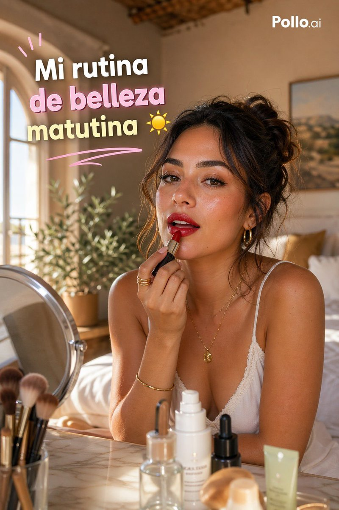 |

**Prompt:**

```
A vertical 9:16 TikTok-style GRWM beauty thumbnail set in a warm, sunlit Mediterranean-inspired bedroom. A stylish young woman with {argument name="hair color" default="dark brown"} hair in a messy curly updo sits at a marble vanity, leaning forward with one arm folded and the other hand applying lip balm or lipstick to her mouth. Her face is covered by a centered rectangular blur block for privacy, but the rest of her styling is elegant and natural: tan glowing skin, delicate gold necklace with a small round pendant, thin gold bracelet, stacked gold rings, and a white lace camisole with thin straps. In the foreground on the vanity are exactly 7 visible beauty objects: 1 round tabletop vanity mirror on the left, 1 cup holding 5 makeup brushes, 1 clear glass dropper bottle, 1 tall white pump skincare bottle, 1 small black dropper bottle, 1 beige rounded cosmetic sponge or puff, and 1 pale green squeeze tube on the right. The background shows a softly blurred cozy bedroom with 1 arched window on the left, 1 leafy potted plant, 1 bed with white bedding and a mustard accent pillow, exposed wooden ceiling detail, and 1 framed landscape painting on the wall. Use golden-hour sunlight streaming from the left, soft shadows, creamy skin tones, shallow depth of field, luxury lifestyle editorial photography, intimate self-care mood, polished but natural composition. Add bold playful Spanish headline text in the upper left in three stacked lines reading {argument name="headline text" default="Mi rutina de belleza matutina"}, with each line large and rounded, white outline and soft drop shadow, using pastel colors: first line white, second line pink, third line pale yellow. Add 3 pink doodle accent strokes above the headline, 1 curved pink underline-swoosh beneath it, and 1 small yellow sun icon to the right of the last line. Place a clean white {argument name="brand text" default="Pollo.ai"} logo in the upper right. High-end influencer thumbnail aesthetic, crisp product focus in foreground, warm inviting lifestyle scene.
```

<!-- Case 92: Cinematic City Explosion Chase (by @Gugombly) -->
### Case 92: [Cinematic City Explosion Chase](https://x.com/Gugombly/status/2047310862428303636) (by [@Gugombly](https://x.com/Gugombly))

| Output |
| :----: |
| 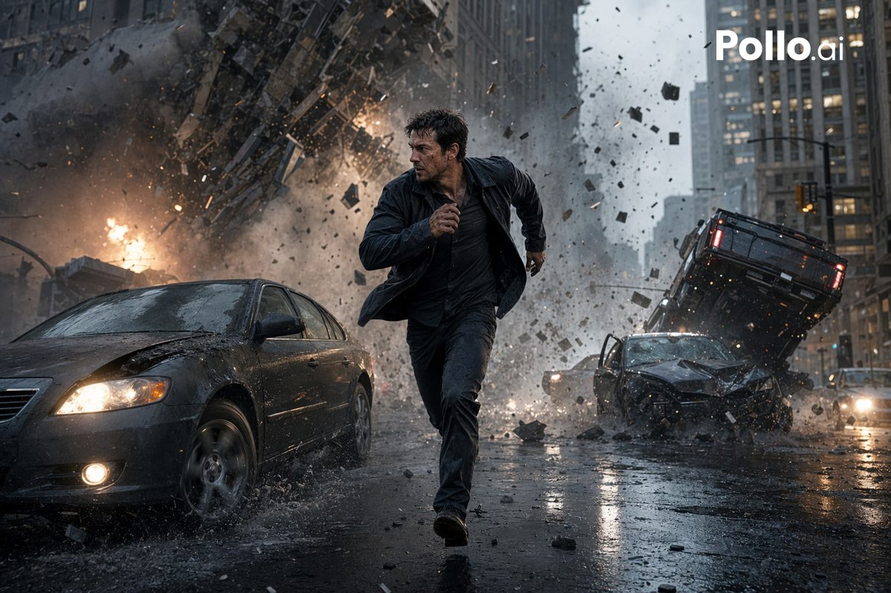 |

**Prompt:**

```
A cinematic photorealistic action scene in a rainy downtown city street canyon, showing {argument name="main subject" default="a dark-haired man in his 30s"} sprinting directly toward the camera in the center foreground with a tense survival expression, wearing a soaked dark jacket, dark shirt, and dark pants, mid-stride with one arm pumping forward. Behind him, a massive urban explosion tears through the street and lower facade of a high-rise building, sending a huge cloud of smoke, fire, dust, shattered concrete, glass, and metal debris outward in all directions. The scene includes exactly 3 visible damaged vehicles: 1 dark sedan in the left foreground with headlights on and a crumpled hood splashing through rainwater, 1 wrecked dark car in the right midground with severe front-end damage, and 1 overturned or airborne black SUV tilted upward behind it on the right side. Wet asphalt reflects headlights, firelight, and gray skyscrapers. Dense debris fills the air, with chunks of rubble frozen in motion. Overcast stormy daylight, desaturated blue-gray color palette with orange fire accents, dramatic motion blur in flying debris but sharp focus on the running figure, low-angle wide-lens composition, blockbuster disaster-movie realism, ultra-detailed textures, high contrast, dynamic depth, volumetric smoke, rain spray, cinematic lighting. Add a white {argument name="watermark text" default="Pollo.ai"} logo in the top-right corner.
```

<!-- Case 93: Anime VTuber Minecraft Stream Thumbnail (by @rerxmsz06) -->
### Case 93: [Anime VTuber Minecraft Stream Thumbnail](https://x.com/rerxmsz06/status/2047261622121705782) (by [@rerxmsz06](https://x.com/rerxmsz06))

| Output |
| :----: |
| 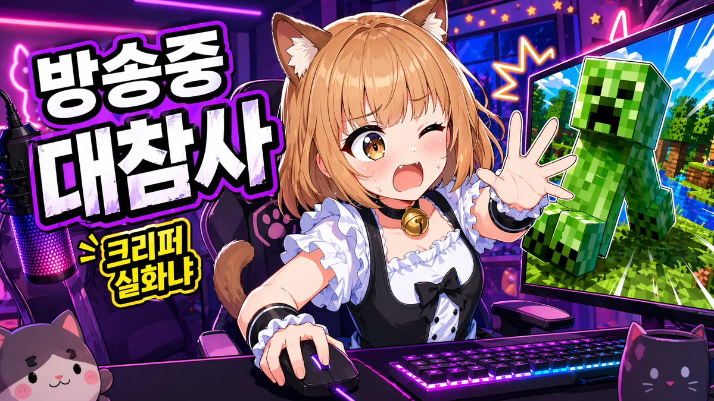 |

**Prompt:**

```
A vibrant anime-style YouTube thumbnail for a livestream gaming broadcast, in a wide 16:9 composition, with a neon purple and pink streamer room. Center the scene on a cute catgirl VTuber sitting at a desk, shown from the waist up, leaning forward energetically with one hand on a computer mouse and the other hand reaching toward the viewer. She has {argument name="hair color" default="light orange-blonde"} bob-cut hair with soft bangs, fluffy brown-and-cream cat ears, and a visible cat tail. Her face is intentionally obscured by a solid rectangular censor block in the center. She wears a black-and-white maid-inspired outfit with a frilly white blouse, black dress bodice, puff sleeves, white ruffles, black ribbon bow, and a gold bell choker. Place a mechanical keyboard with bright RGB lighting on the desk, a glowing gaming mouse, and a streamer microphone on the far left with pink-purple LED lighting. Put 2 cat-themed desk items in the foreground: a plush cat face on the bottom left and a black cat-shaped mug on the bottom right. Behind her is a gaming chair with paw-print details. On the left side, add large bold Korean headline text in thick white block letters with black fill shadows and a glowing purple outline, stacked in 2 lines: {argument name="headline text" default="방송중 대참사"}. Below it, add a smaller yellow comic-style burst caption with black outline reading {argument name="sub text" default="> 크리퍼 실화냐"}. On the right side, show 1 large computer monitor angled inward, displaying a Minecraft-like scene with bright blue sky, green trees, water, and a large green Creeper popping out toward the viewer, outlined dramatically like a sticker cutout. Add starburst effects and neon accents around the monitor to heighten the chaos. Use exaggerated thumbnail aesthetics: ultra-saturated colors, sharp cel shading, thick outlines, glossy highlights, high contrast, dynamic perspective, and a clickworthy streamer-disaster mood.
```

<!-- Case 94: Cozy Anime ASMR Ear Massage Girl (by @Shion_yamabuki) -->
### Case 94: [Cozy Anime ASMR Ear Massage Girl](https://x.com/Shion_yamabuki/status/2047232198382964969) (by [@Shion_yamabuki](https://x.com/Shion_yamabuki))

| Output |
| :----: |
| 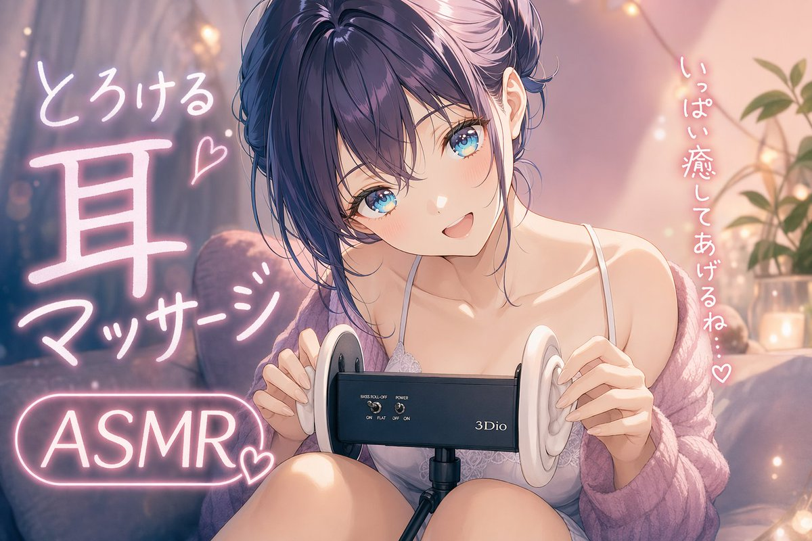 |

**Prompt:**

```
A soft, dreamy anime illustration of a cute young woman doing ASMR in a cozy bedroom at night, seated close to the viewer with her knees pulled up and a black 3Dio-style binaural microphone centered in front of her. She has {argument name="hair color" default="deep violet"} hair in a loose messy updo with wispy bangs framing her face, large sparkling {argument name="eye color" default="blue"} eyes, a gentle blush, and a sweet open-mouth smile. Her head is tilted slightly toward the viewer in a warm, affectionate pose. She wears a delicate white lace camisole with thin straps and an oversized fluffy knit cardigan in {argument name="cardigan color" default="soft pink-lavender"} draped off her shoulders, creating a tender, intimate late-night healing atmosphere. Both hands lightly touch the white silicone ears of the microphone as if about to give an ear massage. The room is softly lit with pink and amber ambient lighting, heavy curtains in the background, a bed or sofa with plush cushions, warm fairy-light bokeh, and a small plant on the right side. Add glowing handwritten Japanese neon text integrated into the composition: on the left, 4 text elements reading "とろける", "耳", "マッサージ", and "ASMR" with 2 small heart symbols; on the right, vertical text reading "いっぱい癒してあげるね...♡". Use a polished modern anime style, highly detailed face and hair, glossy eyes, smooth luminous skin, soft shading, pastel highlights, shallow depth of field, romantic cozy streamer-thumbnail composition, and a soothing feminine color palette dominated by pink, lavender, cream, and warm gold.
```

<!-- Case 95: Celebrity Livestream Concept (by @SelenaGmzIN) -->
### Case 95: [Celebrity Livestream Concept](https://x.com/SelenaGmzIN/status/2047185882009198865) (by [@SelenaGmzIN](https://x.com/SelenaGmzIN))

| Output |
| :----: |
| 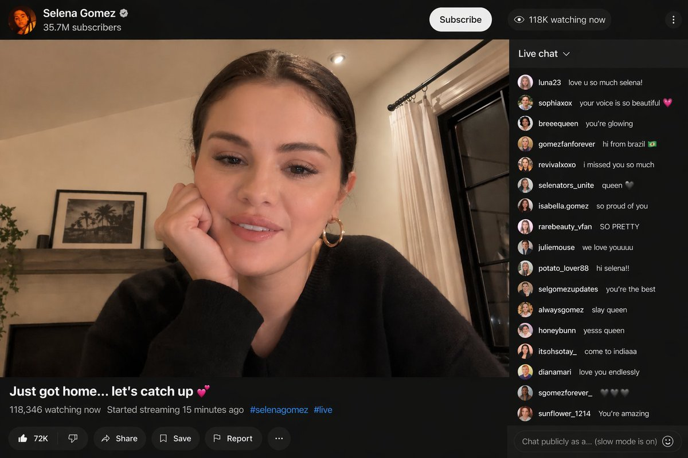 |

**Prompt:**

```
{argument name="celebrity" default="selena gomez"} started a surprise {argument name="platform" default="youtube"} livestream.
```

<!-- Case 96: Monika Anime Banner Illustration (by @mirochill) -->
### Case 96: [Monika Anime Banner Illustration](https://x.com/mirochill/status/2047639852485620070) (by [@mirochill](https://x.com/mirochill))

| Output |
| :----: |
| 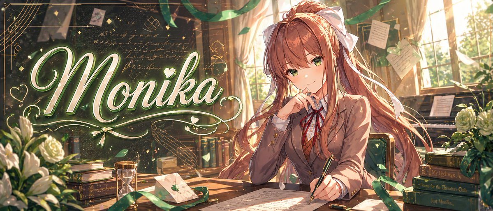 |

**Prompt:**

```
A highly polished anime banner illustration in a warm golden classroom-literature-club setting, wide cinematic composition. On the left half, a large elegant glowing script title reads {argument name="headline text" default="Monika"} in oversized calligraphy, colored white and pale green with a soft neon glow, metallic highlights, decorative flourishes, hearts, sparkles, and swirling ornamental lines around it. On the right half, a beautiful anime schoolgirl inspired by {argument name="character name" default="Monika"} sits at a wooden desk, facing slightly left, with long flowing {argument name="hair color" default="chestnut brown"} hair, a very large white ribbon bow, warm brown eyes, and a thoughtful, confident expression. She wears a Japanese high school uniform with exactly 4 visible clothing pieces: a brown blazer, white shirt, red ribbon tie, and brown argyle sweater vest. She holds a fountain pen over papers on the desk with one hand while the other rests near her face in a poised writing pose. The room is filled with sunset light streaming through tall windows, dust motes, trailing green ribbons, floating petals, handwritten notes pinned and hanging in the background, and a dark chalkboard covered with faint cursive writing and geometric doodles. Include exactly 9 prominent desk and room props: a bouquet of white roses at lower left, a stack of books at left, an hourglass near the center-left, a sealed envelope with a small green leaf emblem, scattered manuscript pages on the desk, a pen cap near the writing hand, a green-upholstered chair, a piano in the back right, and a stack of 4 books on the right. The 4 right-side book spines read, from top to bottom: "Save Me", "My Feelings", "Poems for the Literature Club", and "Just Monika." Add lush volumetric lighting, glittering particles, green-and-gold color harmony, delicate linework, ultra-detailed painterly shading, romantic visual-novel key art quality, and a premium polished thumbnail/banner aesthetic.
```

<!-- Case 97: Purple Anime Yuri Banner (by @mirochill) -->
### Case 97: [Purple Anime Yuri Banner](https://x.com/mirochill/status/2047639852485620070) (by [@mirochill](https://x.com/mirochill))

| Output |
| :----: |
| 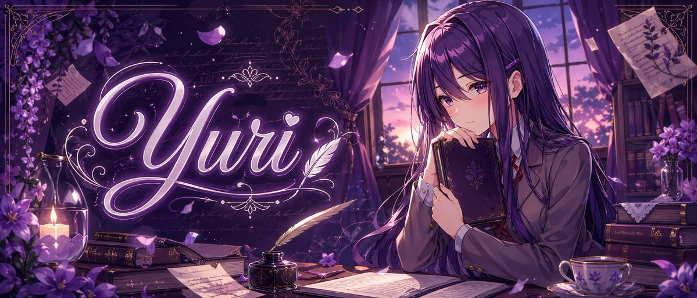 |

**Prompt:**

```
A polished anime-style banner illustration in a dreamy violet palette, wide cinematic composition, showing a quiet literary room at twilight. On the right side, a beautiful teenage anime girl named {argument name="character name" default="Yuri"} sits at a wooden desk beside a large window with purple curtains, holding a dark ornate hardcover book close to her chest and gazing softly downward with a shy, introspective expression. She has very long straight {argument name="hair color" default="deep violet"} hair with glossy highlights, side bangs, a small hair clip, and violet eyes, wearing a Japanese school uniform with a gray blazer, white shirt, red ribbon tie, and dark skirt. Across the left-center of the image, the glowing calligraphic word {argument name="title text" default="Yuri"} appears large in luminous neon-lavender script with elegant flourishes, a small heart, and decorative filigree, integrated into the scene like magical typography. The desk contains exactly 8 visible item groups: 1 open book in the foreground center, 1 black inkwell with a white feather quill, 1 closed book near the candle, 1 stack of books under papers, 1 loose handwritten page in front, 1 small purple flower on the desk, 1 floral porcelain teacup with saucer on the right, and 1 dark book stack at the far right. Additional background details include exactly 6 decorative environmental elements: 1 lit candle in a glass holder on the left, 1 cluster of purple flowers in the left foreground, 1 hanging spray of purple blossoms in the upper left, 1 pinned botanical note in the upper right, 1 bookshelf with books and flowers in the right background, and 1 sunset sky visible through the window. Add drifting flower petals, faint handwritten script textures, ornate gold border lines around the frame, soft volumetric window light, subtle sparkles, rich shadows, and a romantic melancholic atmosphere. Highly detailed, clean line art, glossy anime rendering, premium visual-novel key art, perfect for a niche anime banner or character-themed thumbnail.
```

<!-- Case 98: Pink Anime Natsuki Banner (by @mirochill) -->
### Case 98: [Pink Anime Natsuki Banner](https://x.com/mirochill/status/2047639852485620070) (by [@mirochill](https://x.com/mirochill))

| Output |
| :----: |
| 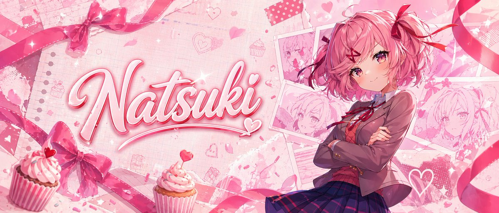 |

**Prompt:**

```
A glossy pastel pink anime banner in a wide cinematic layout, themed around cute romance and sweets. Place a confident teenage anime girl on the right side, shown from about thigh-up, with short fluffy bob hair in {argument name="hair color" default="soft pink"}, large pink-magenta eyes, a small gentle smile, and arms crossed. She wears a Japanese school uniform: 1 brown blazer, 1 white shirt, 1 red ribbon bow at the collar, and 1 dark navy-and-purple plaid skirt. Add 2 red ribbon hair accessories, one larger bow on the side and one smaller ribbon accent. On the left half, feature the large handwritten script name {argument name="character name" default="Natsuki"} in bold glossy 3D cursive, white-to-pink fill with bright pink outline, soft bevel, subtle drop shadow, sparkles, and a small heart flourish integrated into the lettering. The background should be a layered scrapbook collage in blush pink tones with notebook paper texture, faint grid and torn paper details, scattered doodled hearts, flower petals, sparkles, and cute bakery motifs. Include exactly 4 pinned or taped sketch-style portrait cards of the same girl behind her on the upper-right and mid-right, arranged like overlapping polaroids. Add exactly 2 cupcakes in the foreground near the bottom left and lower center-left, both with pink frosting, striped wrappers, and tiny heart toppers or candy accents. Frame the composition with flowing satin ribbons and bows: exactly 4 major ribbon elements visible, including 1 bow near the top left, 1 bow near the bottom left, and 2 long curling ribbons sweeping across the top and right edges. Use a soft high-detail anime illustration style, polished lighting, dreamy bloom, romantic Valentine palette, delicate textures, and a clean impactful thumbnail-like composition.
```

<!-- Case 99: Dreamy Anime Sayori Banner (by @mirochill) -->
### Case 99: [Dreamy Anime Sayori Banner](https://x.com/mirochill/status/2047639852485620070) (by [@mirochill](https://x.com/mirochill))

| Output |
| :----: |
| 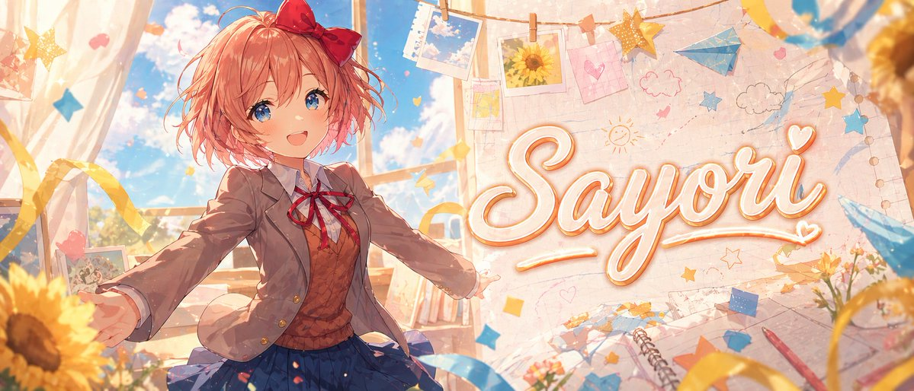 |

**Prompt:**

```
A wide anime banner illustration of {argument name="character name" default="Sayori"} in a bright dreamy classroom, rendered in a polished, high-end visual novel style with soft painterly lighting, warm pastel colors, and sparkling atmosphere. Show a cheerful teenage schoolgirl with short fluffy coral-pink hair, messy bob layers, and a large red bow on the right side of her head, wearing a Japanese school uniform with a light brown blazer, white shirt, red ribbon tie, brown sweater vest, and pleated navy skirt. She stands slightly left of center with arms open wide in an inviting, joyful pose, as if welcoming the viewer, with dynamic perspective and gentle motion in her hair and clothes. Her face is intentionally obscured by a flat rectangular skin-tone censor block. Behind her, tall classroom windows reveal a vivid blue sky with soft white clouds and warm sunlight streaming in. The right half of the image features a large decorative handwritten script reading {argument name="headline text" default="Sayori"}, cream-white lettering with a soft orange-gold outline and glow, integrated into a scrapbook-like wall background. Surround the scene with hanging photo prints clipped to string, including sky photos and a sunflower photo, plus hand-drawn doodles of clouds, stars, hearts, and a sun. Add blue and yellow paper stars, ribbons, floating confetti, a blue paper airplane, notebook pages, a spiral sketchbook, and scattered stationery elements. Place sunflowers prominently in the foreground and edges, with warm golden bokeh and soft depth of field. Make the composition energetic, cute, nostalgic, and emotionally uplifting, like a premium anime-themed YouTube banner or character tribute header, ultra-detailed, clean, stylish, luminous, and impact-focused.
```

<!-- Case 100: Cyberpunk 404 Witch Summoning (by @Eris_Create_Lab) -->
### Case 100: [Cyberpunk 404 Witch Summoning](https://x.com/Eris_Create_Lab/status/2047537707904274795) (by [@Eris_Create_Lab](https://x.com/Eris_Create_Lab))

| Output |
| :----: |
| 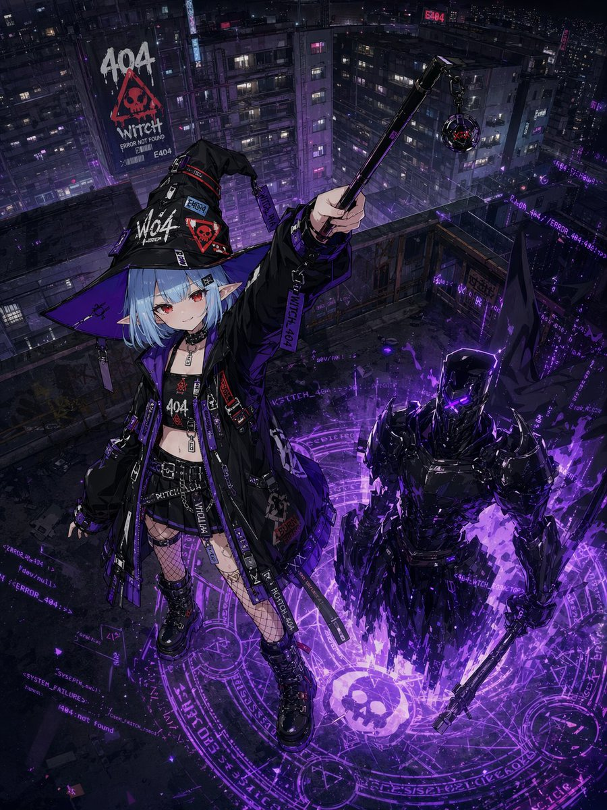 |

**Prompt:**

```
A dramatic anime-style cyberpunk witch standing on a dark rooftop high above a dense futuristic city at night, viewed from a slightly elevated angle. The main subject is a petite young witch girl with pale skin, short icy blue bobbed hair, pointed elf-like ears, and glowing red eyes, wearing a sly confident smile. She raises a black wand overhead in her right hand, with a dangling orb charm at the tip glowing faintly purple and red. Her oversized crooked witch hat is black with purple lining and covered in stitched patches, warning labels, straps, and white graphics including a large “404” and a skull emblem. She wears a black and purple techwear outfit: oversized hooded jacket with many straps and tags, black crop top with “404” on the chest, layered belts, short bottoms, fishnet on one leg, black lace-up combat boots, chokers, and metallic accessories. Several hanging straps and tags visibly read words like “WITCH 404,” “404,” and glitch-themed markings. Beneath and beside her, a large glowing violet magic circle mixed with hacker interface aesthetics is projected on the rooftop floor, filled with occult rings, sigils, a central skull symbol, and scattered neon system text such as error-code fragments, creating a fusion of sorcery and digital corruption. Emerging from the circle is 1 large armored summoned figure: a black futuristic demon-knight or robotic familiar with jagged reflective armor, a narrow purple-lit visor, and a heavy weapon held in one hand, partially dissolving into purple energy shards and smoke. The background shows a sprawling rainy megacity of apartment towers and industrial rooftops, packed with windows, balconies, cables, signs, and haze. On a nearby building wall is a giant vertical graffiti-style sign with 3 readable elements: “404”, “Witch”, and “ERROR NOT FOUND”, plus a smaller “E404”. Additional purple neon glitch text and symbols are scattered across rooftops and in the air. Use a dark palette of black, indigo, and deep violet with sharp magenta-purple highlights, cinematic contrast, reflective wet surfaces, dense detail, and a high-end polished illustration style. The mood is occult, edgy, stylish, and dangerous, combining urban fantasy, hacker aesthetics, and magical summoning.
```

<!-- Case 101: Anime Fantasy Travel Movie Poster (by @Design4p0) -->
### Case 101: [Anime Fantasy Travel Movie Poster](https://x.com/Design4p0/status/2047531978346398002) (by [@Design4p0](https://x.com/Design4p0))

| Output |
| :----: |
| 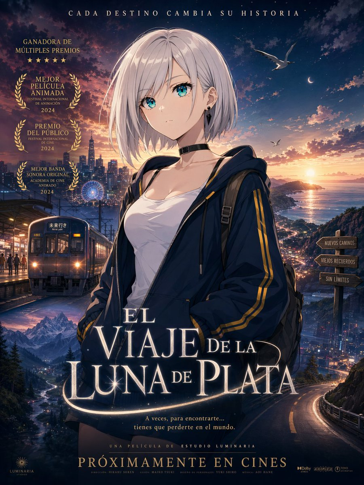 |

**Prompt:**

```
A cinematic anime movie poster for a fictional film titled {argument name="headline text" default="EL VIAJE DE LA LUNA DE PLATA"}, in polished modern Japanese animation style with a natural, less over-detailed look. Center a teenage anime girl from mid-thigh up, facing forward, with a short silver bob haircut, pale skin, a black choker, small black geometric earrings, a white tank top, and a dark navy oversized zip hoodie with two yellow stripes running down the sleeves. She has a backpack strap over one shoulder and both hands tucked casually into the hoodie pockets. Her face is obscured by a flat rectangular censor block in a muted beige tone, covering the entire face area. Place her in a dramatic twilight coastal city setting that blends travel, nostalgia, and fantasy: on the left, a lit train platform with a commuter train approaching, its destination sign showing Japanese characters; behind it, a glowing city skyline with a ferris wheel. In the distance and lower left, layered mountains and a winding illuminated valley road. On the right, a cliffside coast at sunset with the sea reflecting warm light, a crescent moon in the sky, several flying seabirds, and a curving highway descending along the hillside. Also on the right, include a wooden signpost with exactly 3 directional signs labeled "NUEVOS CAMINOS", "VIEJOS RECUERDOS", and "SIN LÍMITES". At the top center, add the Spanish tagline {argument name="tagline text" default="CADA DESTINO CAMBIA SU HISTORIA"} in elegant serif capitals. On the upper left, create an awards column in gold typography with laurel wreaths and exactly 4 award blocks: one text block reading "GANADORA DE MÚLTIPLES PREMIOS" with 5 gold stars beneath it, then three laurel award sections reading "MEJOR PELÍCULA ANIMADA / FESTIVAL INTERNACIONAL DE ANIMACIÓN / 2024", "PREMIO DEL PÚBLICO / FESTIVAL INTERNACIONAL DE CINE / 2024", and "MEJOR BANDA SONORA ORIGINAL / ACADEMIA DE CINE ANIMADO / 2024". Place the film title large across the lower center in luminous ornate serif lettering with a magical glow and sweeping flourishes, layered partly over the character. Beneath it, add the Spanish quote {argument name="quote" default="A veces, para encontrarte... tienes que perderte en el mundo."}. Below that, add "UNA PELÍCULA DE ESTUDIO LUMINARIA" in small caps. At the bottom, add the release line {argument name="release text" default="PRÓXIMAMENTE EN CINES"} in large gold serif capitals, plus tiny production logos and credits along the footer, including a small studio emblem on the left. Rich blue, violet, and warm sunset orange palette, glossy poster lighting, romantic adventure mood, balanced composition, highly polished theatrical key art, vertical one-sheet film poster.
```

<!-- Case 102: Anime Music Bootcamp Promo Poster (by @sorane_aimusic) -->
### Case 102: [Anime Music Bootcamp Promo Poster](https://x.com/sorane_aimusic/status/2047507066697507134) (by [@sorane_aimusic](https://x.com/sorane_aimusic))

| Output |
| :----: |
| 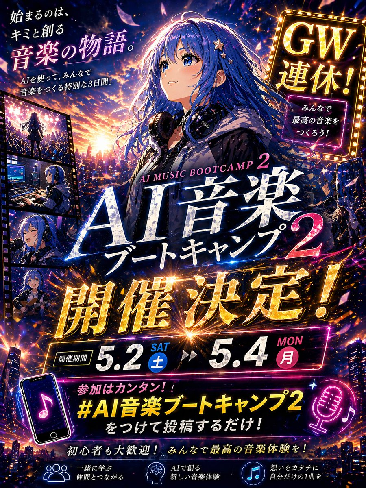 |

**Prompt:**

```
Create a dramatic Japanese anime-style promotional thumbnail poster for an event, vertical 4:5 composition, ultra-detailed, cinematic, neon-lit, high contrast, designed like a social media announcement image. The main subject is a beautiful anime girl centered slightly right, shown from the waist up, with long flowing {argument name="hair color" default="deep blue"} hair blowing in the wind, decorated with small star hairpins, wearing a dark hoodie and large studio headphones around her neck, against a glowing sunset-to-night city skyline filled with sparkling lights, music-energy particles, lens flares, and flying glowing petals. Her face area is obscured by a soft rectangular blur block. Use a vivid palette of electric blue, violet, magenta, gold, and sunset orange. Fill the design with layered Japanese typography that is crisp, readable, and integrated into the art like a polished event advertisement. Include exactly 8 major text groups: top left copy reading 「始まるのは、キミと創る 音楽の物語。」 with a smaller subcopy beneath reading 「AIを使って、みんなで音楽をつくる特別な3日間。」; top right a glowing marquee sign reading 「GW連休!」 and a smaller neon box below reading 「みんなで最高の音楽をつくろう!」; center main title with small English text 「AI MUSIC BOOTCAMP 2」 above huge Japanese title text 「AI音楽 ブートキャンプ 2」; a gigantic gold metallic announcement across the middle reading 「開催決定!」; a date bar reading 「開催期間」 followed by 「5.2 SAT 土」 and 「5.4 MON 月」; a hashtag callout near the bottom reading 「参加はカンタン!! #AI音楽ブートキャンプ2 をつけて投稿するだけ!」; a lower encouragement line reading 「初心者も大歓迎! みんなで最高の音楽体験を!」; and 3 bottom feature captions with icons reading 「一緒に学ぶ 仲間とつながる」, 「AIで創る 新しい音楽体験」, and 「想いをカタチに 自分だけの1曲を」. On the left edge, add a vertical filmstrip with exactly 4 inset panels showing the same girl in music-related scenes: 1) performing on a stage before a crowd, 2) working at a music production desk with screens and equipment, 3) singing into a microphone, 4) playing an acoustic guitar. Add exactly 2 neon music-themed icon illustrations in the lower area: a tilted smartphone with a music note on the lower left and a glowing microphone with musical notes on the lower right. Make the text effects glossy, luminous, and embossed with gold and white highlights, with energetic streaks and spark explosions around the headline. The overall feeling should be inspiring, celebratory, futuristic, and emotionally uplifting, like a high-impact Japanese Golden Week music bootcamp ad for {argument name="event name" default="AI音楽ブートキャンプ 2"}.
```

<!-- Case 103: Tropical Parrot Pixel Mosaic (by @erikmackinnon) -->
### Case 103: [Tropical Parrot Pixel Mosaic](https://x.com/erikmackinnon/status/2048190288179675290) (by [@erikmackinnon](https://x.com/erikmackinnon))

| Output |
| :----: |
| 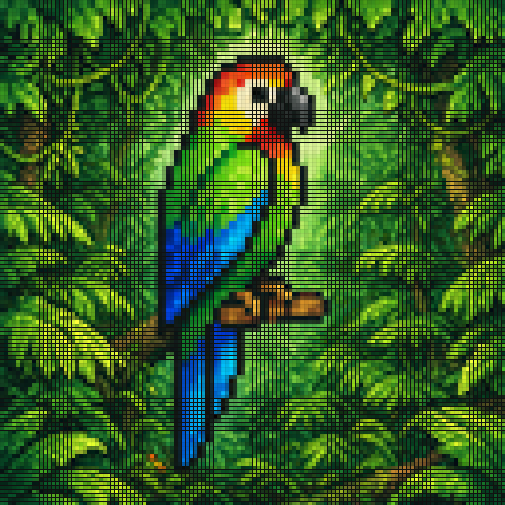 |

**Prompt:**

```
A vibrant pixel-art style mosaic of a tropical parrot perched on a small brown branch in the middle of dense rainforest foliage. The entire image is rendered as a tight grid of tiny square tiles with visible black outlines, creating a stained-glass or LED-screen effect. The bird is shown in side profile facing right, with a large curved black beak, a pale cream face, a bright red-orange forehead and throat, vivid green upper body, and long wings and tail in saturated blue and cyan. The surrounding jungle is filled edge to edge with layered green leaves in many shades, with a soft light green glow behind the parrot to separate it from the background. High color contrast, rich tropical palette, crisp tile pattern, centered composition, decorative digital mosaic aesthetic.
```

<!-- Case 104: Golden Cocktail in Greenhouse Bar (by @FernandesK47117) -->
### Case 104: [Golden Cocktail in Greenhouse Bar](https://x.com/FernandesK47117/status/2048183925294371147) (by [@FernandesK47117](https://x.com/FernandesK47117))

| Output |
| :----: |
| 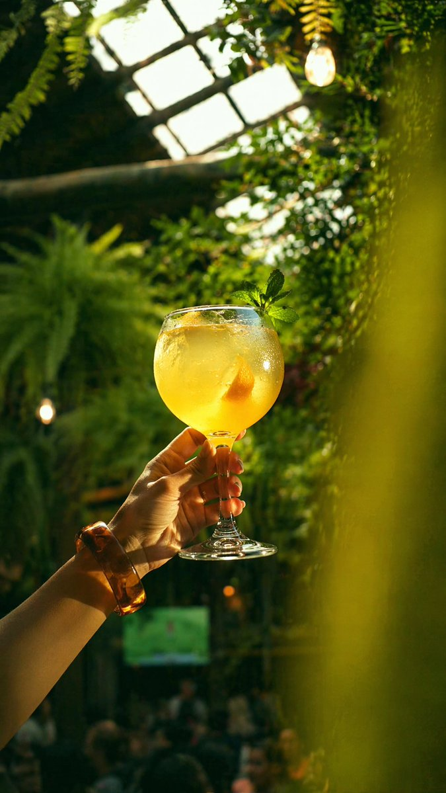 |

**Prompt:**

```
A cinematic vertical photo of a hand holding up a large balloon wine glass filled with a sparkling golden-yellow citrus cocktail in a lush indoor greenhouse bar. The drink is backlit by warm late-afternoon sunlight, making it glow translucent amber. Inside the glass there is 1 visible citrus wedge, and at the rim there is 1 fresh mint garnish cluster. The hand enters from the lower left, delicately gripping the stem, wearing 1 chunky translucent amber bracelet. The setting is dense with tropical greenery, hanging ferns, and vine-covered walls, with a bright greenhouse roof structure visible overhead and 2 warm exposed hanging bulbs softly glowing in the background. Use shallow depth of field with creamy bokeh, strong sun rays filtering through leaves, soft haze, and rich green-and-gold color contrast. Add a blurred foreground leaf or plant along the right edge to frame the composition. The lower background should suggest a busy café or cocktail lounge with indistinct people, but keep them heavily out of focus. Photorealistic, elegant lifestyle photography, moody yet sun-drenched, shot from a low angle looking upward at the raised glass, high detail on condensation, glass reflections, and the luminous drink.
```

<!-- Case 105: Multi-Panel Image Board Template (by @aimikoda) -->
### Case 105: [Multi-Panel Image Board Template](https://x.com/aimikoda/status/2048183782876778821) (by [@aimikoda](https://x.com/aimikoda))

| Output |
| :----: |
| 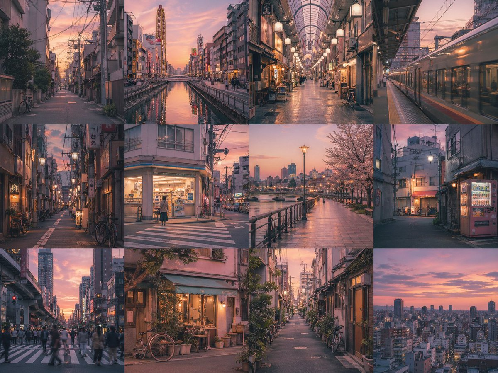 |

**Prompt:**

```
Create a {argument name="grid layout" default="4x3"} borderless grid where each panel is an independent image of the {argument name="subject" default="a young woman"}. Maintain strong subject consistency across all panels, with consistent color and lighting. Depict {argument name="theme" default="childhood memories"} with a {argument name="mood" default="warm, nostalgic"} mood in {argument name="style" default="nostalgic cinematic realism"} style. No text. No gap.
```

<!-- Case 106: Handwritten Realistic Letter (by @mosthssan) -->
### Case 106: [Handwritten Realistic Letter](https://x.com/mosthssan/status/2048160477658980711) (by [@mosthssan](https://x.com/mosthssan))

| Output |
| :----: |
| 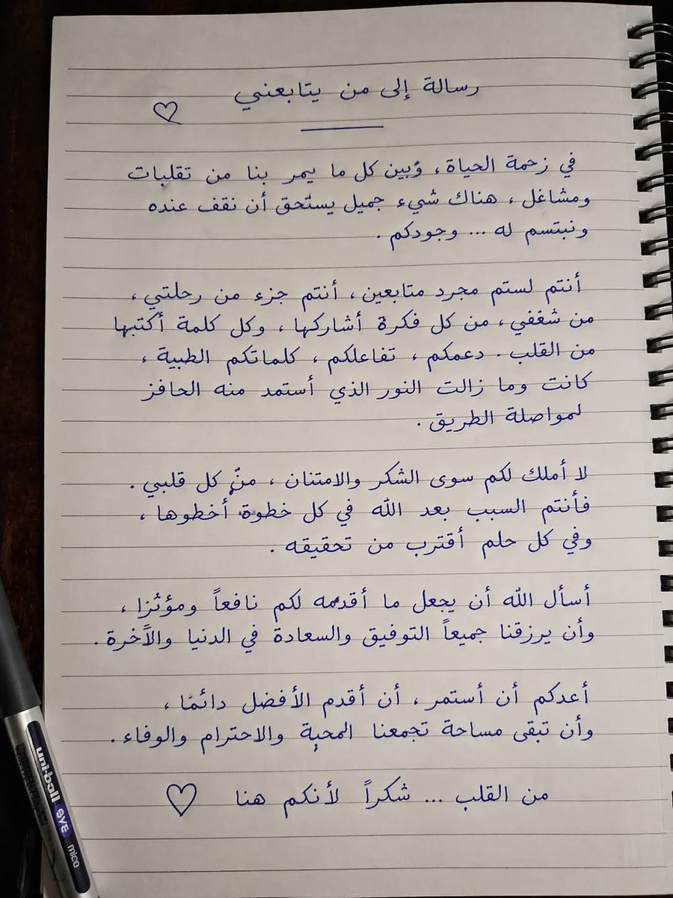 |

**Prompt:**

```
Create a highly realistic image of a handwritten letter containing a ({argument name="message" default="message or reflection carrying meanings of affection and loyalty to my account followers"}) on lined paper, with very touching words written in liquid ink pen
```

<!-- Case 107: Anime Band Finale at Budokan (by @SDAI1807097011) -->
### Case 107: [Anime Band Finale at Budokan](https://x.com/SDAI1807097011/status/2048127178592915583) (by [@SDAI1807097011](https://x.com/SDAI1807097011))

| Output |
| :----: |
| 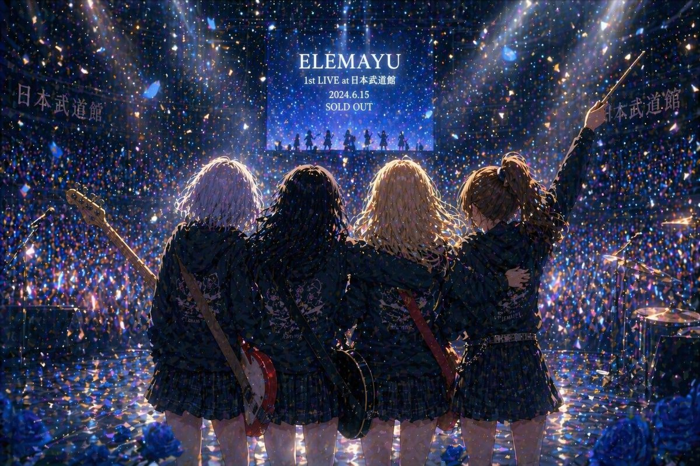 |

**Prompt:**

```
A dramatic anime concert illustration seen from behind the performers onstage, showing 4 teenage girls standing shoulder to shoulder at the front of a huge indoor arena, arms around each other in a triumphant post-performance moment. The camera is positioned slightly behind and below them, facing out toward the audience and the giant venue screen. The atmosphere is dazzling and emotional, filled with dense blue-and-gold confetti, sparkling particles, and strong white stage spotlights pouring down from above. The crowd fills the entire arena as a sea of tiny glowing blue lights. At center top, a giant rectangular screen displays elegant serif concert text: {argument name="band name" default="ELEMAYU"}, "1st LIVE at 日本武道館", {argument name="concert date" default="2024.6.15"}, and "SOLD OUT". On both upper side walls of the arena, the large venue name "日本武道館" is visible. The 4 girls all wear matching dark stage outfits: black or very dark navy hooded jackets with subtle decorative back prints, short pleated skirts, and live-performance styling. Count and depict all 4 members distinctly from left to right: 1) a girl with short wavy silver-lavender hair holding a bass guitar slung over her shoulder, 2) a girl with long straight black hair holding a red electric guitar, 3) a girl with fluffy shoulder-length blonde hair holding a dark guitar, 4) a girl with brown hair in a high ponytail, no visible instrument, raising one arm high and holding a drumstick or baton in celebration while the other arm wraps around the blonde member. Show their backs and silhouettes rim-lit by stage light, with soft highlights on their hair. Include stage equipment: a microphone stand and part of a bass neck at the far left, and a visible drum kit with cymbals at the right edge. The stage floor is glossy and reflective, covered with scattered confetti and several blue flower bouquets near the bottom foreground. Use rich midnight blues, violet shadows, warm golden sparkles, and cinematic bloom. The mood should feel like a sold-out dream performance finale, sentimental, victorious, and breathtakingly luminous, in highly detailed painterly anime style.
```

<!-- Case 108: Anime Girl and Man Date Photo Collage (by @AIillust_studio) -->
### Case 108: [Anime Girl and Man Date Photo Collage](https://x.com/AIillust_studio/status/2048099186214900130) (by [@AIillust_studio](https://x.com/AIillust_studio))

| Output |
| :----: |
| 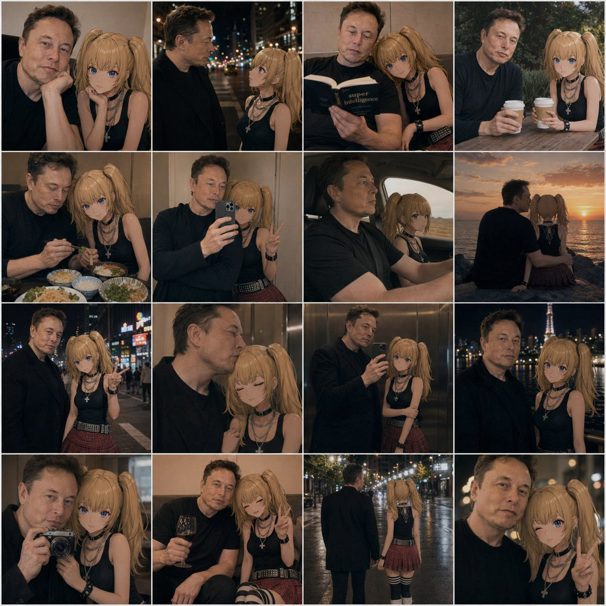 |

**Prompt:**

```
A 4x4 photo collage of 16 warm, cinematic lifestyle snapshots featuring a real adult man and an anime-style young woman companion posed together as if in casual date photos. The man has short dark hair, light skin, an average build, and wears a plain dark navy or black long-sleeve shirt; his face is intentionally obscured and softly blurred in every frame. The anime girl has long blonde twin ponytails, large blue eyes, light skin, and a slim petite build, wearing a black sleeveless top, layered silver necklaces including a cross pendant, black wrist accessories, a red plaid pleated mini skirt, and black-and-white striped thigh-high socks. Blend realistic photography with a convincingly integrated 2D anime character, keeping her clean cel-shaded look while matching the scene lighting, perspective, focus, and color grading so she appears naturally present beside him. Use moody evening tones, soft bokeh, shallow depth of field, and intimate candid couple energy. The 16 panels are: 1) close indoor portrait with both seated close together, the girl resting beside him; 2) nighttime city street side profile conversation under blurred streetlights; 3) indoors, both reading a book together, the girl leaning on his shoulder; 4) outdoor cafe table, both holding takeaway coffee cups; 5) restaurant table with multiple dishes visible, dining together; 6) mirror selfie in an elevator, the man holding a smartphone while the girl makes a peace sign; 7) car interior road-trip shot, the man driving and the anime girl in the passenger seat; 8) seaside sunset from behind, both sitting side by side watching the ocean; 9) neon-lit city night portrait, the girl pointing toward the camera; 10) intimate elevator close-up, the girl with eyes closed leaning affectionately against him; 11) full mirror selfie in an elevator showing more of both outfits; 12) night city skyline portrait with a lit tower in the background; 13) camera selfie close-up, the man holding a compact camera toward a mirror or reflective surface; 14) cozy indoor lounge moment, the man holding a glass of red wine while the girl smiles and makes a peace sign; 15) rear full-body rainy night street shot, the pair walking away hand in hand under glowing streetlights; 16) extreme close-up night portrait with the girl flashing a peace sign. Keep the collage tightly gridded with thin white dividers, square overall format, consistent amber-brown color grading, romantic urban realism, and subtle social-media photo-dump aesthetics.
```

<!-- Case 109: Luxury Lifestyle Mustang Shot (by @Just_sharon7) -->
### Case 109: [Luxury Lifestyle Mustang Shot](https://x.com/Just_sharon7/status/2048095904138485962) (by [@Just_sharon7](https://x.com/Just_sharon7))

| Output |
| :----: |
| 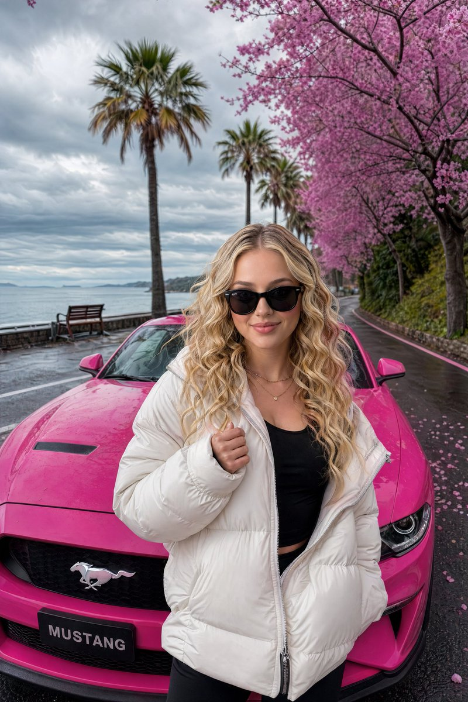 |

**Prompt:**

```
A stylish young woman with {argument name="hair style" default="long wavy blonde hair"}, defined cheekbones, and a confident expression, wearing black sunglasses and a {argument name="clothing" default="thick white puffer jacket"} over a fitted black top, standing confidently in front of a {argument name="car" default="vibrant hot-pink Ford Mustang"}. She is posing with one hand slightly raised near her chest, exuding effortless attitude and elegance. The car is parked on a scenic coastal road lined with blooming pink cherry blossom trees and tall palm trees. Behind them is a calm sea under a dramatic overcast sky with soft clouds. Pink petals are scattered on the wet asphalt. A wooden bench is visible on the left side near the water. Cinematic lighting, photorealistic, ultra-detailed skin texture, natural lighting reflections, Instagram-style luxury lifestyle shot, vibrant colors, moody atmosphere, 8k resolution --ar 9:16 --stylize 250
```

<!-- Case 110: Anime Friends Eating Soba (by @AIMAG31G) -->
### Case 110: [Anime Friends Eating Soba](https://x.com/AIMAG31G/status/2048089673621516547) (by [@AIMAG31G](https://x.com/AIMAG31G))

| Output |
| :----: |
| 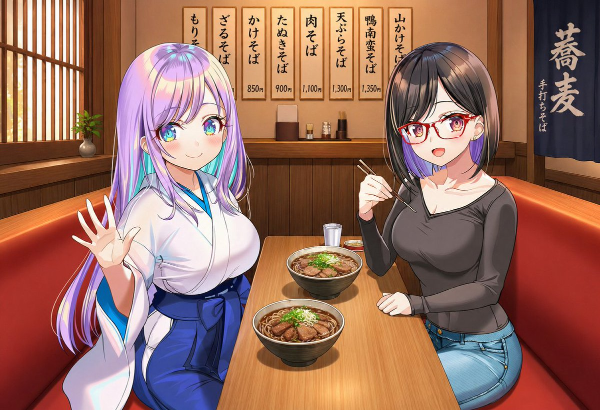 |

**Prompt:**

```
A cozy anime-style interior of a traditional Japanese soba restaurant, viewed from table height in a booth, with two young women seated across the near corners of a rectangular wooden table and facing the viewer in a casual dining snapshot. The left woman has long straight pastel {argument name="hair color" default="lavender with cyan highlights"} hair with glossy strands and soft bangs, and wears a white kimono-style top with bright blue trim and a deep blue obi-like sash skirt; she is slightly curvy, sitting on the left red vinyl bench, turned a little toward the camera, raising her left hand in an open friendly wave. The right woman has a sleek short bob in dark brown to black with a purple underlayer visible near the ends, red rectangular glasses, small earrings, a fitted charcoal-gray long-sleeve scoop-neck top, and light blue jeans; she sits on the right red vinyl bench, leaning slightly toward the table and holding chopsticks in her right hand as if about to eat. Place 2 large black bowls of soba on the table, one in front of each woman, both filled with dark broth, noodles, sliced duck meat, and chopped green onions; add 1 clear water glass near the center back of the table and 2 small condiment dishes beside it. The restaurant should feel warm and nostalgic, with wooden paneling, a shoji-style window on the left, a small potted plant on the windowsill, a back counter with condiments and utensils, and a navy noren curtain on the right bearing large white Japanese text "蕎麦" and smaller vertical text "手打ちそば". On the back wall, show 7 vertical wooden menu boards with Japanese dish names and prices, including labels such as "もりそば", "ざるそば", "かけそば", "たぬきそば", "肉そば", "天ぷらそば", and "鴨南蛮そば". Use clean polished anime rendering, crisp line art, soft warm lighting, detailed food illustration, rich wood textures, and a friendly everyday outing mood.
```

<!-- Case 111: Gothic Android Warrior Cathedral Key Art (by @yanagihara_0805) -->
### Case 111: [Gothic Android Warrior Cathedral Key Art](https://x.com/yanagihara_0805/status/2048085829713842405) (by [@yanagihara_0805](https://x.com/yanagihara_0805))

| Output |
| :----: |
| 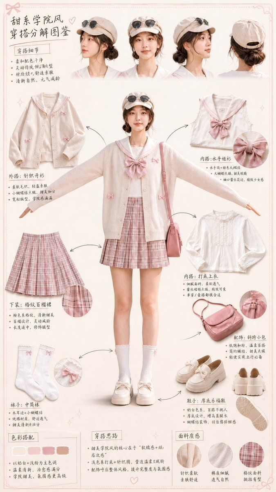 |

**Prompt:**

```
A cinematic dark fantasy anime illustration in a ruined gothic cathedral, vertical composition. Show a lone female android-like warrior from behind, centered slightly low in frame, kneeling or sitting back on her heels on a reflective stone floor. She has extremely long flowing {argument name="hair color" default="silver white"} hair spreading across the floor and air, a sleek black blindfold visor covering her eyes, and a black high-cut gothic combat dress with elegant straps, long black opera gloves, and thigh-high black boots. Her physique is slim and graceful. She holds 1 large ornate sword upright in front of her, with both hands resting on the hilt, the blade planted on the ground like a memorial. The sword has a dark blade and a decorative gold ring-like guard near the handle. The atmosphere is solemn, tragic, and reverent. Place 3 tall pointed arched windows in the background, glowing with cold white backlight through haze and dust. Include 4 stone angel statues total: 2 larger angels in the left background and 2 in the right background, partially obscured by fog and darkness. Fill the air with drifting ash, snow-like particles, black debris fragments, and a few faint orange embers near the floor. Use dramatic volumetric light rays, soft bloom, smoky mist, high contrast, and a desaturated palette of charcoal gray, silver, blue-gray, and black. The scene should feel like a memorial after a battle, highly detailed, ultra-polished, melancholic, ethereal, and game key art inspired by {argument name="franchise title" default="NieR:Automata"}. Add 1 vertical Japanese title inscription near the lower left reading {argument name="vertical text" default="儚き夢と共にあれ"}, with 1 small vertical English subtitle beside it reading {argument name="subtitle text" default="NieR:Automata"}.
```

<!-- Case 112: Cloud shape doodle generation (by @Gorden_Sun) -->
### Case 112: [Cloud shape doodle generation](https://x.com/Gorden_Sun/status/2048080137149899133) (by [@Gorden_Sun](https://x.com/Gorden_Sun))

| Output |
| :----: |
| 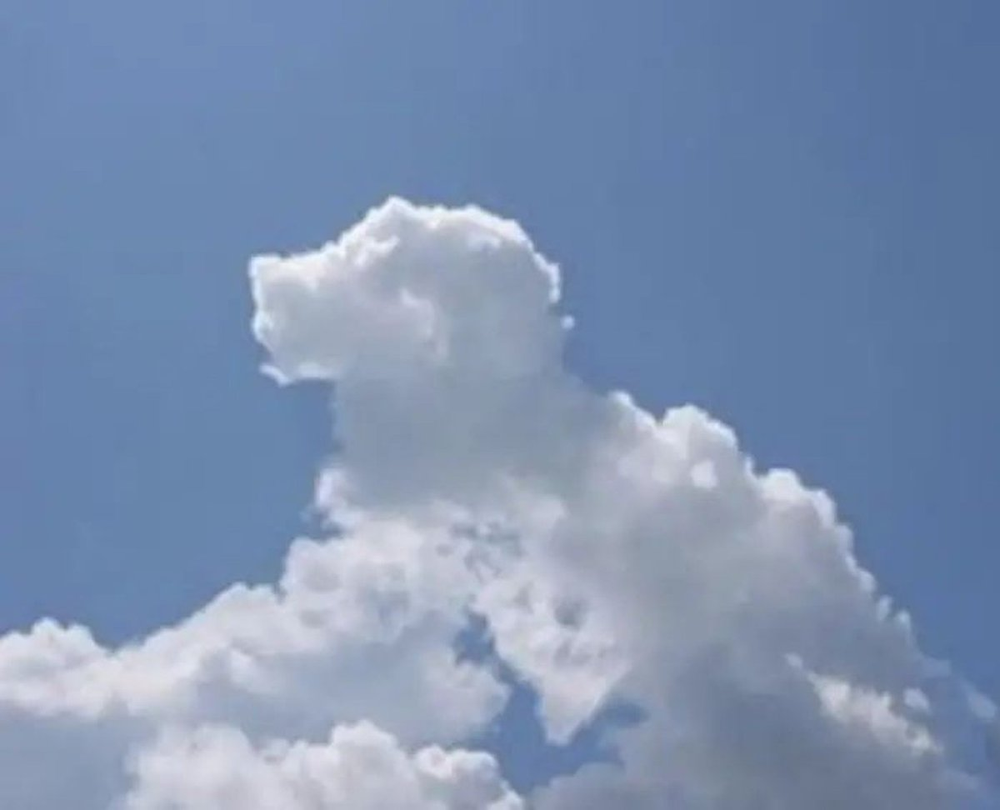 |

**Prompt:**

```
Based on the shape of the {argument name="subject" default="clouds"} in the image, identify what object, animal, or person they most resemble. Do not change the original image; instead, draw that object, animal, or person over the original image in a {argument name="art style" default="doodle"} style.
```

<!-- Case 113: Rural Station Schoolgirl Scene (by @m_Raiko_AIart) -->
### Case 113: [Rural Station Schoolgirl Scene](https://x.com/m_Raiko_AIart/status/2048069313387737222) (by [@m_Raiko_AIart](https://x.com/m_Raiko_AIart))

| Output |
| :----: |
| 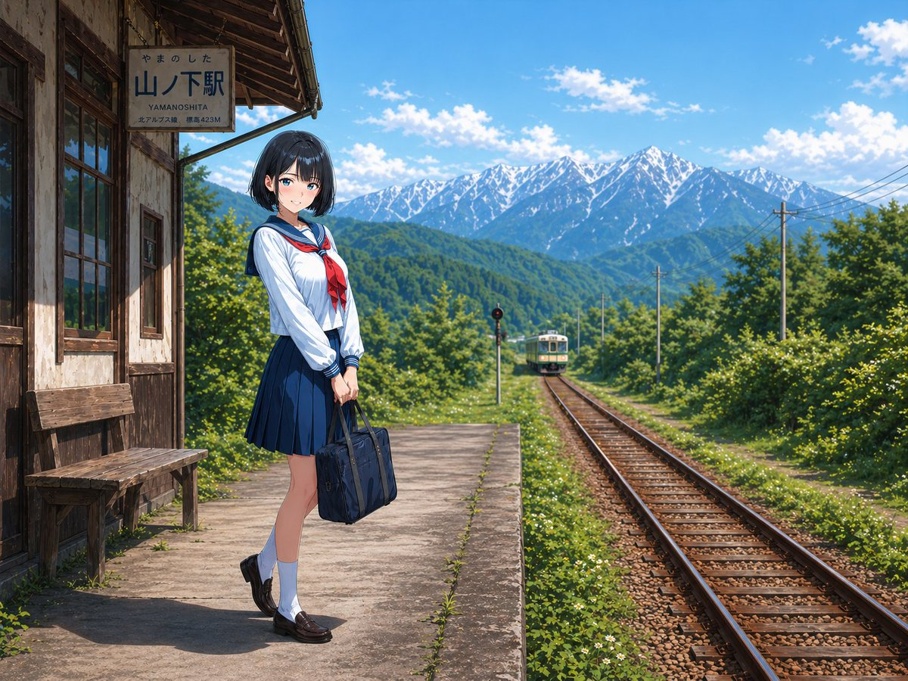 |

**Prompt:**

```
A cinematic anime-style illustration of a quiet rural Japanese train station in early summer, filled with travel nostalgia and bright midday light. In the foreground, one high school girl stands alone on the platform near the left side of the frame, facing slightly toward the viewer with a shy, gentle posture, her legs together and one foot angled inward. She has {argument name="hair color" default="black"} short bobbed hair with soft bangs, and wears a classic Japanese sailor school uniform: a white long-sleeved sailor blouse with navy trim, a vivid red neckerchief, a dark navy pleated skirt, white socks, and dark brown loafers. She holds a dark school bag in one hand at her side. Her expression should feel calm, a little wistful, as if she was just about to speak before the train arrived. Place her beside an old weathered wooden station building with large windowpanes and a simple wooden bench. Above her is 1 hanging station sign reading {argument name="station name" default="山ノ下駅"}, with smaller romanized text “YAMANOSHITA” and small local line information beneath it. The right half of the image opens to 1 set of railway tracks receding into the distance, bordered by lush green grass and wildflowers, with 1 small local train approaching from far down the line. Add a few utility poles running alongside the tracks. In the deep background, show a dramatic mountain range with lingering snow on the peaks under a vivid blue sky with scattered white clouds. Composition should balance the girl on the left and the railway perspective on the right, with detailed background scenery, crisp sunlight, soft anime rendering, realistic textures in the station wood and rails, and a heartfelt slice-of-life travel mood.
```

<!-- Case 114: Anime Characters in Real Izakaya Photo (by @sub_raw_jin) -->
### Case 114: [Anime Characters in Real Izakaya Photo](https://x.com/sub_raw_jin/status/2048066779835220392) (by [@sub_raw_jin](https://x.com/sub_raw_jin))

| Output |
| :----: |
| 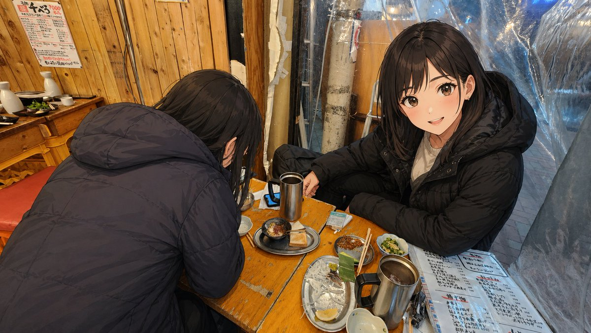 |

**Prompt:**

```
A candid indoor restaurant photo in a realistic anime-inspired style, showing two young women seated at a small worn wooden table inside a cozy Japanese izakaya with vertical wood-paneled walls and a clear plastic tent-like curtain on the right side. The camera is slightly above table height and angled diagonally toward the table, creating a casual snapshot feeling. One woman is in the left foreground with her back mostly to the viewer, leaning forward over the table; she has long straight dark hair and wears a bulky dark navy or black puffer jacket with a large hood. The second woman sits across from her on the right, facing the camera with a relaxed posture and one arm bent on the table; she has shoulder-length dark brown to black hair, a center part, a black puffer jacket, and a light inner shirt. Replace only the people with clean, natural-looking anime characters while keeping the restaurant environment photorealistic and unchanged. Preserve the mixed-media look of anime characters composited believably into a real photo. On the table, include 2 stainless steel mugs, 2 pairs of chopsticks, 1 smartphone with a bright blue case near the center-left edge of the table, 1 cigarette pack near the right woman, 1 large oval plate with thinly sliced white onions and a lemon wedge, 1 small dish of green vegetables, 1 small plate of brown food, 1 small plate with toast or grilled bread, 1 small dark bowl, 2 small empty white bowls, and 1 printed handwritten Japanese menu sheet lying on the lower right corner of the table. In the upper left background, include a wooden counter with white ceramic bottles and dishes, plus 1 handwritten Japanese wall menu poster. Warm indoor lighting, everyday nightlife atmosphere, documentary realism, detailed wood grain, slightly cluttered tabletop, authentic casual dining scene in Japan.
```

<!-- Case 115: Anime Campers in a Winter Tent (by @sub_raw_jin) -->
### Case 115: [Anime Campers in a Winter Tent](https://x.com/sub_raw_jin/status/2048066779835220392) (by [@sub_raw_jin](https://x.com/sub_raw_jin))

| Output |
| :----: |
| 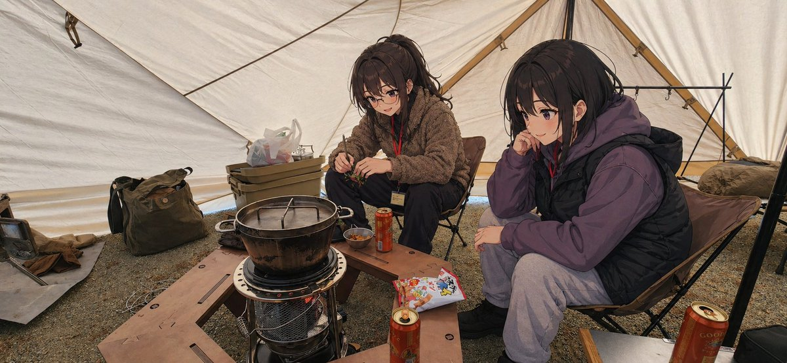 |

**Prompt:**

```
A cozy winter camping scene inside a large beige canvas tent, rendered as a semi-realistic anime illustration with natural lighting and realistic environmental detail. Show exactly 2 seated young women around a compact kerosene heater used as a camp table, with a large black metal pot resting on top. The viewpoint is a candid wide-angle photo composition from slightly above seated height, making the scene feel like a casual snapshot taken inside the tent. The woman on the left has {argument name="hair color" default="dark brown"} hair tied in a high ponytail with loose bangs, and wears a fluffy brown fleece jacket, dark pants, and a red lanyard with an ID card. She sits in a low camping chair and leans forward, using chopsticks over a small bowl or food container in her hands. The woman on the right has {argument name="hair color" default="black"} shoulder-length hair and wears a muted purple hoodie layered under a black puffer vest, light gray sweatpants, and dark shoes. She sits in another low camping chair, resting her cheek on one hand in a relaxed, sleepy pose. Keep both faces obscured by a soft rectangular blur block, as if anonymized in a posted photo. Around them, include exactly 4 red beverage cans visible in the scene: 2 on the wooden table planks near the center, 1 cropped in the lower right foreground, and 1 farther back near the right side. Build a low U-shaped arrangement of 3 wooden bench planks surrounding the heater. Add small camping details: 1 olive duffel bag on the left ground, 1 plastic storage box with supplies behind the left woman, 1 white plastic shopping bag on top of the box, 1 small bowl on the table, 1 colorful snack package on the right-side plank, 1 soft brown cloth on the far left floor, and 1 black metal rack frame standing at the back right. The tent interior should have taut canvas walls, visible seams and support poles, a gravel ground, and a warm muted color palette. Preserve the feeling of a real camping photo where only the people have been turned into anime-style characters while the setting remains highly realistic.
```

<!-- Case 116: BMW Performance Social Poster (by @harboriis) -->
### Case 116: [BMW Performance Social Poster](https://x.com/harboriis/status/2048063332624843046) (by [@harboriis](https://x.com/harboriis))

| Output |
| :----: |
|  |

**Prompt:**

```
Create a 4:5 vertical social poster in ultra high resolution, 8K print quality sharpness. Use the {argument name="car model" default="BMW car"} from the reference image as the main subject and use the background structure/composition from the reference image, but transform it into a BMW themed design. Replace all black tones with a flat {argument name="background color" default="high-saturation BMW blue"} background. Keep the same layout, spacing, visual balance, and poster composition from the reference image. Background should use a smooth gradient from slightly lighter electric blue at the top to deep navy blue at the bottom. Add subtle grain texture (2 to 3%) and faint rectangular overlays (2 to 4% opacity). Keep it clean, graphic, premium, and non-realistic. Add a soft contact shadow under the car. Use the same BMW from the reference image, changing only the {argument name="paint finish" default="matte frozen blue"} or deep metallic navy. Keep the original body shape, wheels, stance, and design details from the reference image. Show the car in a rear 3/4 perspective matching the reference image angle exactly. Use a slightly elevated camera angle. Position the car slightly right of center. Include visible carbon roof, aggressive rear diffuser, sharp controlled reflections, and subtle brake details. Keep composition identical to the reference image: Top: branding Middle: giant type Center: car overlapping text Bottom: editorial block and specs Typography: Primary text: “BMW” Ultra condensed bold sans serif, tall vertical scaling like the reference poster. Color deep navy or near black. Static text with no distortion. Acts as structural backdrop. Secondary header: “BMW M4 G82” Thin font with wide tracking. Logo area: BMW roundel centered above. Editorial block: Headline: “BMW — Where Driving Becomes Instinct” Body copy focused on: driver connection control performance precision Use the same boxed editorial layout as the reference image. Background faded text: “M4” large scale with 3 to 5% opacity behind the box. Bottom left: “ M4 G82” Bottom right specs: 405 kW / 550 PS 3.4 s 307 km/h Lighting should be clean studio lighting with sharp but controlled highlights. Color grading should use deep blues, high contrast, clean blacks. Camera lens: 50mm, slightly elevated rear 3/4 angle. Mood: Performance. Precision. Driver focus. Add Bottom-right watermark: harboriis , with small x and Instagram logo
```

<!-- Case 117: Cinematic Chicken Momos Ad Poster (by @Diplomeme) -->
### Case 117: [Cinematic Chicken Momos Ad Poster](https://x.com/Diplomeme/status/2048060325925470358) (by [@Diplomeme](https://x.com/Diplomeme))

| Output |
| :----: |
| 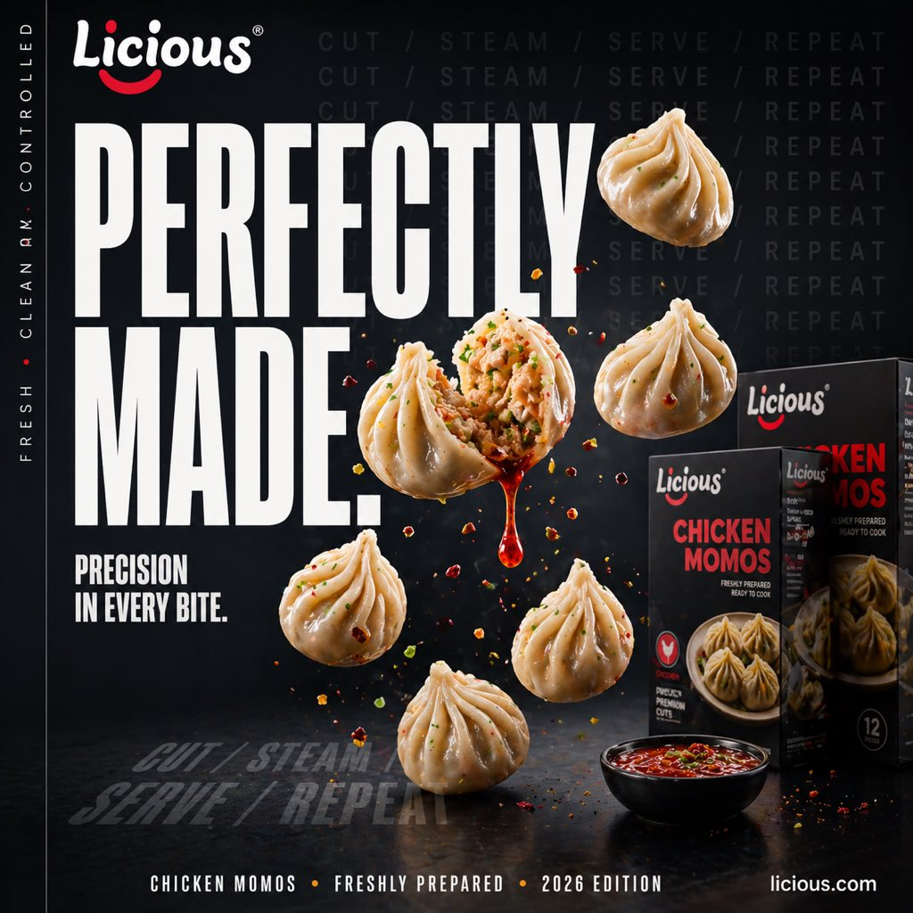 |

**Prompt:**

```
A hyper-realistic cinematic street-food advertisement poster for {argument name="brand name" default="Licious"} frozen {argument name="product name" default="Chicken Momos"}, shot in a dark premium studio with dramatic moody lighting, deep navy-black background, glossy black tabletop, and high contrast commercial food photography styling. The composition is a square social-media ad layout with oversized bold condensed white sans-serif headline text on the left reading {argument name="headline text" default="PERFECTLY MADE."} stacked across two lines, and a smaller white subheadline beneath it reading {argument name="tagline text" default="PRECISION IN EVERY BITE."}. Along the far left edge, add thin vertical small caps text reading “FRESH • CLEAN • CONTROLLED”. Across the upper-right background, repeat the phrase “CUT / STEAM / SERVE / REPEAT” in a subtle dark gray pattern, and faintly repeat “CUT / STEAM / SERVE / REPEAT” again near the bottom-left floor area as perspective text. Feature exactly 6 momos total: 5 intact steamed chicken momos floating and arranged dynamically across the center and right side, and 1 split-open momo in the center revealing juicy orange-brown chicken filling with herbs, with a glossy red-orange sauce droplet dripping downward from the opened dumpling. Scatter small chili flakes, herb bits, and seasoning particles suspended in the air around the momos for explosive motion. Place exactly 3 retail product boxes on the right side, staggered in depth, black packaging with the {argument name="brand name" default="Licious"} logo and red product title “CHICKEN MOMOS,” including food photography of the dumplings on the box front. At the bottom right foreground, place 1 small black bowl filled with bright red dipping sauce. Add a thin footer line of small white text across the bottom reading “CHICKEN MOMOS • FRESHLY PREPARED • 2026 EDITION” and place “licious.com” in the lower-right corner. Use premium ad design, ultra-detailed food texture, glossy highlights on the dumplings, subtle steam sheen, crisp typography, shallow depth of field, and a polished high-end commercial campaign aesthetic.
```

<!-- Case 118: Nostalgic 16-Photo Couple Grid (by @zenkaiAI) -->
### Case 118: [Nostalgic 16-Photo Couple Grid](https://x.com/zenkaiAI/status/2048051889460437351) (by [@zenkaiAI](https://x.com/zenkaiAI))

| Output |
| :----: |
| 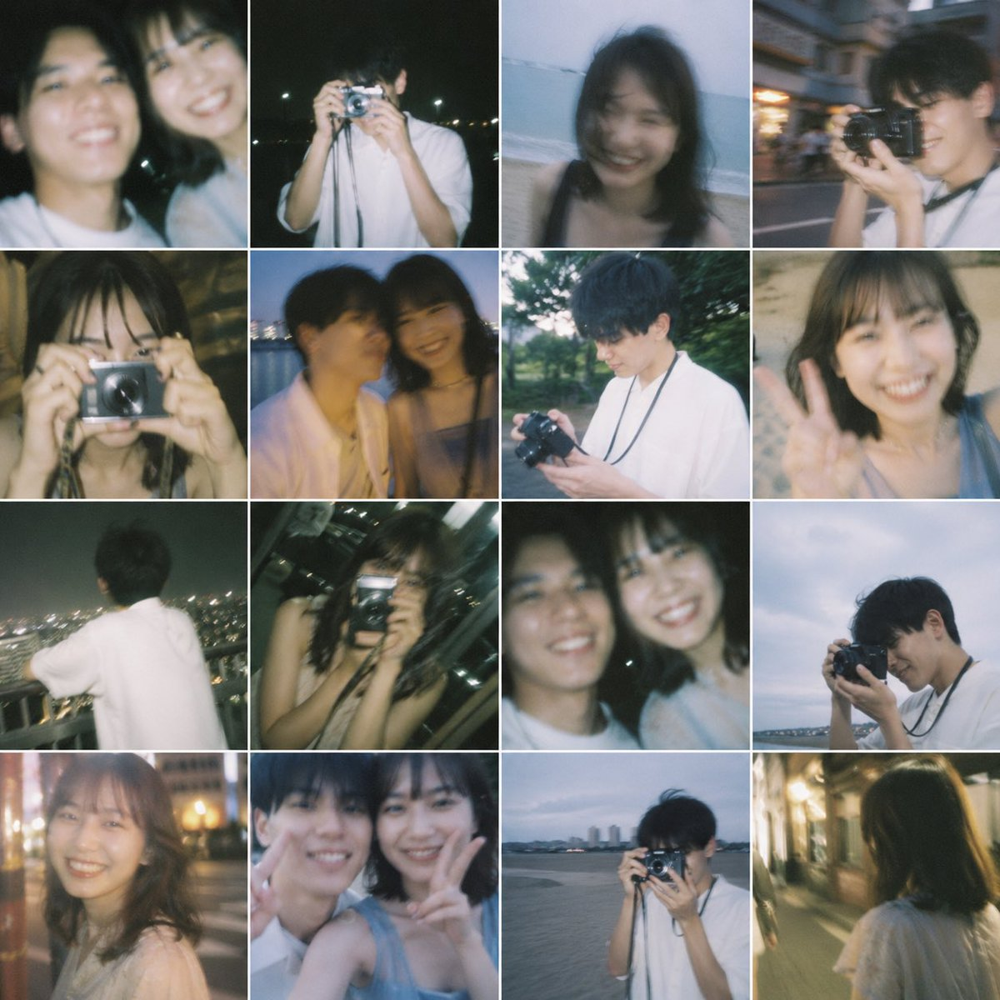 |

**Prompt:**

```
{"type":"16-photo nostalgic contact sheet collage","style":"dreamy film photography, soft blur, slightly underexposed, candid youthful romance, flash snapshots mixed with ambient dusk light, subtle grain, sentimental and bittersweet mood","subject":{"people_count":2,"relationship":"young couple or former lovers spending time together","ages":"early 20s","appearance":{"male":{"build":"slim","hair":"short dark hair","clothing":"loose white short-sleeve shirt, camera strap around neck in several shots"},"female":{"build":"slim","hair":"shoulder-length dark hair","clothing":"light sleeveless tops or soft casual summer clothes"}},"faces":"intentionally obscured by soft rectangular blur blocks over every visible face"},"layout":{"grid":{"rows":4,"columns":4,"count":16,"border":"thin white dividers, equal square cells"},"images":[{"position":"row 1 col 1","description":"close cropped portrait of the woman in a white top at night, soft flash, dark background"},{"position":"row 1 col 2","description":"close cropped blurred two-person selfie framing, both subjects partially visible, dark nighttime setting"},{"position":"row 1 col 3","description":"young man standing at night and holding a compact silver camera up to his face, white shirt, distant lights behind him"},{"position":"row 1 col 4","description":"woman on a beach or shoreline in low light, softly blurred, ocean horizon behind her"},{"position":"row 2 col 1","description":"street candid of the man holding a camera near his face while walking outdoors in the evening, urban background with motion blur"},{"position":"row 2 col 2","description":"close-up of the woman indoors or in a dim warm setting, hand raised near her face, flash-lit snapshot"},{"position":"row 2 col 3","description":"blurred two-shot of the couple sitting close together by water at dusk, intimate candid composition"},{"position":"row 2 col 4","description":"young man outdoors in greenery during daytime or early evening, looking down at a camera in his hands, white shirt and camera strap visible"},{"position":"row 3 col 1","description":"woman close to the camera giving a peace sign, casual sleeveless top, sandy or beachlike background"},{"position":"row 3 col 2","description":"back view of the man in a white shirt looking out over a cityscape at night from a high vantage point"},{"position":"row 3 col 3","description":"woman indoors at night holding a compact camera directly toward the viewer, city lights beyond a window, flash aesthetic"},{"position":"row 3 col 4","description":"tight cropped two-person selfie-like frame with both subjects partially visible, dark background"},{"position":"row 4 col 1","description":"young man at the waterfront at dusk holding a camera to his eye, cloudy blue sky and distant shoreline behind him"},{"position":"row 4 col 2","description":"soft night portrait of the woman on a city street with warm bokeh lights in the background"},{"position":"row 4 col 3","description":"close intimate couple snapshot with both faces near each other, one subject making a peace sign, heavy blur and flash look"},{"position":"row 4 col 4","description":"rear view of the woman walking alone down a warmly lit narrow street at night, shoulder-length hair and light top visible"}]},"composition":"each square feels like a memory fragment from one summer evening and a few nearby outings, varied framing, natural imperfection, casual amateur photography","color_palette":"muted blues, warm tungsten yellows, soft skin tones, dark greens, charcoal night shadows, faded white clothing","camera_look":"35mm point-and-shoot or disposable camera feel, shallow focus, motion blur, bloom around lights, occasional flash overexposure","quality":"high-resolution collage with authentic analog softness, emotionally evocative and realistic"}
```

<!-- Case 119: Anime BL Promo Thumbnail (by @himukai_an) -->
### Case 119: [Anime BL Promo Thumbnail](https://x.com/himukai_an/status/2047981800535085555) (by [@himukai_an](https://x.com/himukai_an))

| Output |
| :----: |
| 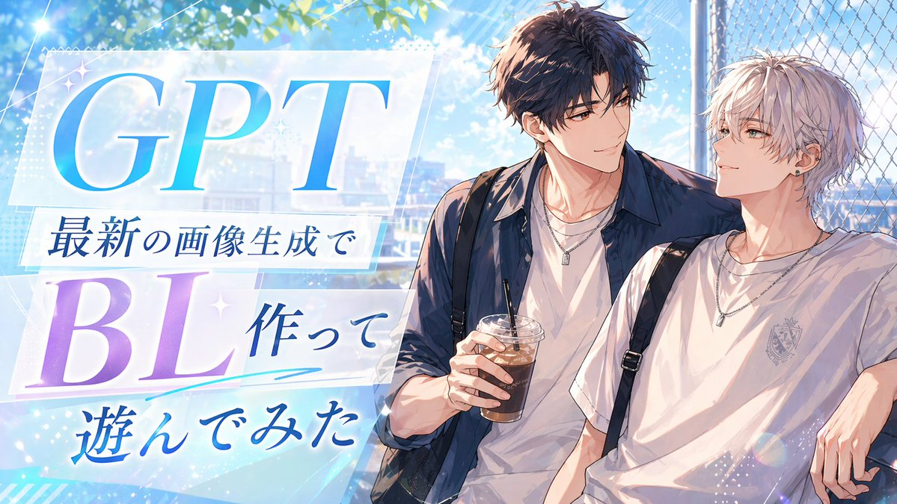 |

**Prompt:**

```
A bright, polished anime-style promotional thumbnail with a summer romance atmosphere. The composition is split visually, with large typography on the left and two handsome young men on the right. On the left side, place layered translucent white panels with soft glow and sparkles over a sky-blue background, featuring large elegant serif text "GPT" in a blue gradient at the top and "BL" in a lavender-to-violet gradient below. Add three lines of Japanese text arranged between and under them: "最新の画像生成で", "作って", and "遊んでみた", in deep blue calligraphic Japanese type. Include subtle decorative accents such as small star glints, diagonal light streaks, dotted texture, and a cyan underline swoosh beneath the middle text. On the right side, show 2 anime boys from the waist up, leaning casually together beside a chain-link fence under leafy trees. The taller boy has tousled dark brown hair, a navy overshirt worn open over a white T-shirt, layered silver necklaces, and holds 1 plastic cup of iced coffee with a straw. The shorter boy has messy silver-white hair, a white T-shirt with a small crest emblem on the chest, black backpack straps over both shoulders, layered silver necklaces, and one small earring. Their poses are relaxed and intimate, with the dark-haired boy’s arm resting around the other. Use a luminous blue-and-white palette with soft sunlight, lens flare, bokeh, and a faint cityscape in the background, creating a clean social-media header or article thumbnail aesthetic.
```

<!-- Case 120: Artist and Ethereal Muse at Night (by @almimeister) -->
### Case 120: [Artist and Ethereal Muse at Night](https://x.com/almimeister/status/2048309710118687101) (by [@almimeister](https://x.com/almimeister))

| Output |
| :----: |
| 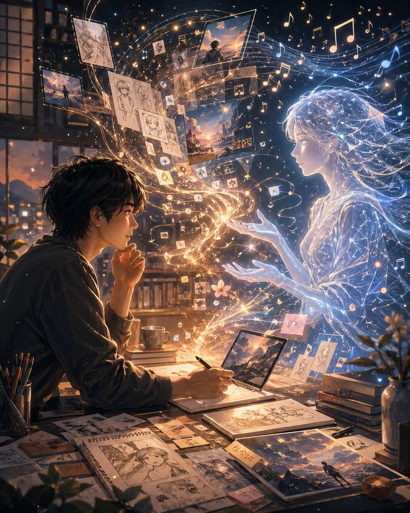 |

**Prompt:**

```
A cinematic anime-inspired digital illustration set at night inside a cozy artist's room with large window panes and a warm city glow outside. On the left, a young male artist with {argument name="hair color" default="dark brown"} messy hair sits at a cluttered desk in side profile, leaning forward with one hand near his mouth and the other drawing with a pen on a tablet or sketchbook. The desk is covered with exactly 1 pen cup filled with pencils, 1 coffee mug, 1 open laptop or pen-display showing a sunset landscape, 1 spiral sketchbook with manga-style character drawings, 2 additional drawing books or pads, 1 small stack of about 4 books, and many scattered art cards and printed illustrations. On the right, a luminous ethereal anime girl made of blue-white light appears life-sized, facing the artist with both hands gently extended toward him. Her form is translucent, delicate, and composed of glowing contour lines, starry particles, and flowing strands of light, with long windblown hair and a soft dress-like silhouette. Between them, a magical stream of golden and white light spirals upward from the artist's desk into the air, connecting creator and creation. Inside this swirling ribbon are exactly 12 to 16 floating image fragments and sketch pages: monochrome character sketches, scenic sunset paintings, small photo-like panels, and tiny icon-like cards, all orbiting in a curved arc from lower center to upper left and upper center. Around the upper half of the image, dozens of glowing musical notes float through the air, mixed with sparkling particles, creating the feeling that inspiration has become visible sound and memory. The palette is rich warm gold and amber on the artist's side, contrasted with cool electric blue and white on the spirit girl's side, with dramatic rim light, volumetric glow, intricate particles, and a dreamy emotional atmosphere. Composition is vertical, highly detailed, intimate, and poetic, evoking the relationship between {argument name="person one" default="you"} and {argument name="person two" default="me"} as artist and imagined muse, where drawings, music, memories, and fantasy physically manifest in the room. Add a small handwritten note card on the desk with {argument name="note text" default="二人だけの物語"}, and display one prominent artwork on the desk and one floating scenic panel using {argument name="scene theme" default="sunset sky over a distant city"}.
```

## Comparativas y Ejemplos de la Comunidad


<!-- Case 5: Wooden Bookshelf Prompt Test (by @chetaslua) -->
### Case 5: [Wooden Bookshelf Prompt Test](https://x.com/chetaslua/status/2044331451077013749) (by [@chetaslua](https://x.com/chetaslua))

| Output |
| :----: |
| <a href="https://evolink.ai/gpt-image-2-prompts?utm_source=github&utm_medium=picture&utm_campaign=awesome-gpt-image-2-prompts" target="_blank" rel="noopener noreferrer"></a> |

**Indicación:**

```
A wooden bookshelf consisting of three shelves: On the top shelf, there should be one book, on the second shelf, there should be three books, and on the bottom shelf, there should be seven books.
```


<!-- Case 10: GPT-Image-2 Detail Showcase (by @liyue_ai) -->
### Case 10: [GPT-Image-2 Detail Showcase](https://x.com/liyue_ai/status/2045000106919997637) (by [@liyue_ai](https://x.com/liyue_ai))

| Output |
| :----: |
| <a href="https://evolink.ai/gpt-image-2-prompts?utm_source=github&utm_medium=picture&utm_campaign=awesome-gpt-image-2-prompts" target="_blank" rel="noopener noreferrer"></a> |

**Indicación:**

```
以眼部特写图片为基础，生成3:4的四屏构图超写实眼部特写，四屏按春夏秋冬上下排序。

第一屏：眼眸中带着绽粉樱色的美瞳，睫毛缀满迷你春花，脸颊散落樱瓣与黄蕊小花，粉蝶萦绕眉眼，浅金发丝轻垂，下方簇簇樱花怒放，画面中央"SPRING"白色艺术字点缀，风格细腻唯美，光影柔和，色彩粉嫩治愈，下面用书法体写着春；

第二屏：眼眸中带着着清荷色的美瞳，睫毛饰以粉莲与绿荷，脸颊挂着晶莹水珠，粉瓣、绿荷点缀其间，蜻蜓轻绕，浅金发丝若隐若现，画面中央"Summer"白色艺术字凸显，光影通透流光感，色彩清透凉爽，下面用书法体写着夏；

第三屏：眼眸中带着金黄红相间的美瞳，睫毛饰以橙红枫叶，脸颊散落金红秋叶，橙蝶翩跹眉眼间，浅金发丝隐约可见，画面中央"AUTUMN"白色艺术字醒目，光影暖金流光，色彩浓郁温暖，下面用书法笔写着秋；

第四屏：眼眸中带着雪花蓝色的美瞳，睫毛覆满冰晶雪片，脸颊散落白色雪花与红色腊梅，银白蝴蝶翩跹眉眼，浅金发丝朦胧似雪，画面中央"WINTER"白色艺术字亮眼，光影冷冽蓝白流光，色彩清透纯净，下面用书法体写着冬。

整体呈现梦幻眼眸四季交替的唯美梦幻治愈画面，微调各屏的光影强度，让画面氛围感更浓郁。
```


<!-- Case 16: A/B Test Signed Output (by @saskr_13) -->
### Case 16: [A/B Test Signed Output](https://x.com/saskr_13/status/2044744396932079934) (by [@saskr_13](https://x.com/saskr_13))

| Output |
| :----: |
| <a href="https://evolink.ai/gpt-image-2-prompts?utm_source=github&utm_medium=picture&utm_campaign=awesome-gpt-image-2-prompts" target="_blank" rel="noopener noreferrer"></a> |

**Indicación:**

```
私があなたをどんなふうに扱ってきたか、4 コマ漫画風に描いてください。まずは 800 字くらいのプロットをテキストで出して、私が「描いて」と言ったらプロットに沿った 4 コマ漫画を描いてください。
```


<!-- Case 23: Silhouette Universe Narrative Poster (by @MrLarus) -->
### Case 23: [Silhouette Universe Narrative Poster](https://x.com/MrLarus/status/2045418028733538620) (by [@MrLarus](https://x.com/MrLarus))

| Output |
| :----: |
| <a href="https://evolink.ai/gpt-image-2-prompts?utm_source=github&utm_medium=picture&utm_campaign=awesome-gpt-image-2-prompts" target="_blank" rel="noopener noreferrer"></a> |

**Indicación:**

```
请根据【主题：xxx】自动生成一张高审美的“轮廓宇宙 / 收藏版叙事海报”风格作品。不要将画面局限于固定器物或常见容器，不要优先默认瓶子、沙漏、玻璃罩、怀表之类的常规载体，而是由 AI 根据主题自行判断并选择一个最契合、最有象征意义、轮廓最强、最适合承载完整叙事世界的主轮廓载体。这个主轮廓可以是器物、建筑、门、塔、拱门、穹顶、楼梯井、长廊、雕像、侧脸、眼睛、手掌、头骨、羽翼、面具、镜面、王座、圆环、裂缝、光幕、阴影、几何结构、空间切面、舞台框景、抽象符号或其他更有创意与主题代表性的视觉轮廓，要求合理布局。优先选择最能放大主题气质、最能形成强烈视觉记忆点、最能体现史诗感、神秘感、诗意感或设计感的轮廓，而不是最安全、最普通、最常见的容器。

画面的核心不是简单把世界装进某个物体里，而是让完整的主题世界自然生长在这个主轮廓之中、之内、之上、之边界里或与其结构融为一体，形成一种“主题宇宙依附于一个象征性轮廓展开”的高级叙事效果。主轮廓必须清晰、优雅、有辨识度，并在整体构图中占据核心地位。轮廓内部或边界中需要自动生成与主题强绑定的完整叙事世界，内容应当丰富、饱满、层次清晰，包括最能代表主题的标志性场景、核心建筑或空间结构、象征符号与隐喻元素、角色关系或文明痕迹、远景中景近景的空间递进、具有命运感和情绪张力的氛围层次，以及门、台阶、桥梁、水面、烟雾、路径、光源、遗迹、机械结构、自然景观、抽象形态、生物或道具等叙事细节。所有元素必须统一、自然、有主次、有层级地融合，像一个完整世界真实孕育在这个轮廓结构之中，而不是简单拼贴、裁切填充、素材堆叠或模板化背景。

整体构图需要具有强烈的收藏版海报气质与高级设计感，大结构稳定，主轮廓强烈明确，内部世界具有纵深、秩序和呼吸感，细节丰富但不拥挤，内容丰满但不杂乱，可以适度加入小比例人物剪影、远处建筑、光柱、门洞、桥、阶梯、回廊、倒影、天光或远景结构来增强尺度感、故事感与史诗感。整体画面要安静、宏大、凝练、富有余味，不要平均铺满，不要廉价热闹，不要无重点堆砌。

风格融合收藏版电影海报构图、高级叙事型视觉设计、梦幻水彩质感与纸张印刷品气质，强调纸张颗粒感、边缘飞白、水彩刷痕、轻微晕染、空气透视、柔和雾化、局部体积光、光雾穿透、大面积留白与克制版式，让画面看起来像设计师完成的高端收藏版视觉作品，而不是普通 AI 跑图。整体气质要高级、诗意、宏大、神圣、怀旧、安静、具有传说感和叙事感。

色彩由 AI 根据主题自动判断并匹配最合适的高级配色方案，但必须保持统一、克制、耐看、低饱和、高级，不要杂乱高饱和，不要廉价霓虹感，不要塑料数码感。配色可以围绕黑金灰、冷蓝灰、雾白灰、褐红米白、暗铜、旧纸色、深海蓝、暮色紫、银灰等体系自由变化，但必须始终服务主题，并保持海报级审美与整体和谐。

最终要求：第一眼有强烈的主题识别度和轮廓记忆点，第二眼有完整丰富的叙事世界，第三眼仍有细节和余味。轮廓选择必须具有创意和主题匹配度，尽量避免重复、保守、常见的容器套路，优先选择更有象征性、更有空间感、更有设计潜力的轮廓形式。不要普通背景拼接，不要生硬裁切，不要模板化奇幻素材，不要游戏宣传图感，不要过度卡通化，不要过度写实导致失去艺术感，不要形式大于内容。如果合适，可以自然加入低调克制的标题、编号、签名或落款，让它更像收藏版海报设计的一部分，但不要喧宾夺主。
```

<!-- Case 29: Lion Camel Ridge Dark Myth Scene (by @MANISH1027512) -->
### Case 29: [Lion Camel Ridge Dark Myth Scene](https://x.com/MANISH1027512/status/2045743158860878312) (by [@MANISH1027512](https://x.com/MANISH1027512))

| Output |
| :----: |
| <a href="https://evolink.ai/gpt-image-2-prompts?utm_source=github&utm_medium=picture&utm_campaign=awesome-gpt-image-2-prompts" target="_blank" rel="noopener noreferrer"></a> |

**Indicación:**

```
中式怪异，黑暗神秘风格融合中式美学，完美细节，多重管线渲染，完美建模。西游记背景，狮驼岭，千妖万怪，坐在左边巨大王座上的大象王重甲妖精，坐在中间巨大王座上的狮王重甲妖精，坐在右边巨大王座上大鹏鸟王重甲妖精。渺小的背对镜头孙悟空肩抗金箍棒步行前进，孙悟空身穿铠甲，近地仰拍镜头，长焦镜头，强烈阴影。极致细节刻画，多次修改，正确透视和主体线条，精致细节
```

<!-- Case 30: Counter-Strike x Terraria Screenshot Mashup (by @yssrski) -->
### Case 30: [Counter-Strike x Terraria Screenshot Mashup](https://x.com/yssrski/status/2046410519595348397) (by [@yssrski](https://x.com/yssrski))

| Output |
| :----: |
| <a href="https://evolink.ai/gpt-image-2-prompts?utm_source=github&utm_medium=picture&utm_campaign=awesome-gpt-image-2-prompts" target="_blank" rel="noopener noreferrer"></a> |

**Indicación:**

```
counter strike in game screenshot, mixed with Terraria
```

<!-- Case 31: Pre-war Japan Lab Minecraft Screenshot (by @RitaStar1128) -->
### Case 31: [Pre-war Japan Lab Minecraft Screenshot](https://x.com/RitaStar1128/status/2046406024303976904) (by [@RitaStar1128](https://x.com/RitaStar1128))

| Output |
| :----: |
| <a href="https://evolink.ai/gpt-image-2-prompts?utm_source=github&utm_medium=picture&utm_campaign=awesome-gpt-image-2-prompts" target="_blank" rel="noopener noreferrer"></a> |

**Indicación:**

```
戦前日本の怪しげな研究所を探検しているマイクラのスクリーンショット画像を作成して
```

<!-- Case 32: Forged Masterpiece Prompt Test (by @MrLarus) -->
### Case 32: [Forged Masterpiece Prompt Test](https://x.com/MrLarus/status/2046201836525302032) (by [@MrLarus](https://x.com/MrLarus))

| Output |
| :----: |
| <a href="https://evolink.ai/gpt-image-2-prompts?utm_source=github&utm_medium=picture&utm_campaign=awesome-gpt-image-2-prompts" target="_blank" rel="noopener noreferrer"></a> |

**Indicación:**

```
帮我生成xxxx真迹图片
```

<!-- Case 33: Multi-Concept Battle Poster Set (by @joshesye) -->
### Case 33: [Multi-Concept Battle Poster Set](https://x.com/joshesye/status/2046493442428039212) (by [@joshesye](https://x.com/joshesye))

| Output |
| :----: |
| <a href="https://evolink.ai/gpt-image-2-prompts?utm_source=github&utm_medium=picture&utm_campaign=awesome-gpt-image-2-prompts" target="_blank" rel="noopener noreferrer"></a> |

**Indicación:**

```
1、生成不知火舞和貂蝉的游戏对战海报图
2、生成一张K-pop团体时尚专辑封面
3、请你生成 《斗破苍穹》 的关键人物关系图
4、帮我截一张上传图片的抖音首页的女网红图
```

<!-- Case 34: Rust In-Game Screenshot (by @FixlationAI) -->
### Case 34: [Rust In-Game Screenshot](https://x.com/FixlationAI/status/2046272578705068476) (by [@FixlationAI](https://x.com/FixlationAI))

| Output |
| :----: |
| <a href="https://evolink.ai/gpt-image-2-prompts?utm_source=github&utm_medium=picture&utm_campaign=awesome-gpt-image-2-prompts" target="_blank" rel="noopener noreferrer"></a> |

**Indicación:**

```
an ingame screenshot of rust
```

<!-- Case 35: Sam Altman Bear Selfie (by @JustinGorya) -->
### Case 35: [Sam Altman Bear Selfie](https://x.com/JustinGorya/status/2046510831832006970) (by [@JustinGorya](https://x.com/JustinGorya))

| Output |
| :----: |
| <a href="https://evolink.ai/gpt-image-2-prompts?utm_source=github&utm_medium=picture&utm_campaign=awesome-gpt-image-2-prompts" target="_blank" rel="noopener noreferrer"></a> |

**Indicación:**

```
generate image: Selfie of Sam Altman riding a bear

Edit prompt: Remove the background make it transparent
```

<!-- Case 36: Among Us Realistic Screenshot (by @ReYYYYoking) -->
### Case 36: [Among Us Realistic Screenshot](https://x.com/ReYYYYoking/status/2046502217843376292) (by [@ReYYYYoking](https://x.com/ReYYYYoking))

| Output |
| :----: |
| <a href="https://evolink.ai/gpt-image-2-prompts?utm_source=github&utm_medium=picture&utm_campaign=awesome-gpt-image-2-prompts" target="_blank" rel="noopener noreferrer"></a> |

**Indicación:**

```
AmongUsの精密な実際のゲーム画像を生成して
```

<!-- Case 37: Retro Programming Museum Cartoon (by @XiaohuiAI666) -->
### Case 37: [Retro Programming Museum Cartoon](https://x.com/XiaohuiAI666/status/2046515319947354603) (by [@XiaohuiAI666](https://x.com/XiaohuiAI666))

| Output |
| :----: |
| <a href="https://evolink.ai/gpt-image-2-prompts?utm_source=github&utm_medium=picture&utm_campaign=awesome-gpt-image-2-prompts" target="_blank" rel="noopener noreferrer"></a> |

**Indicación:**

```
在计算机博物馆里,一个程序员在展厅中央,正在演示C语言编程,很多参观者在围观,屏幕上的代码清晰可见。旁边的牌子写着:古法编程,现场表演。2D卡通画风,16:9
```

<!-- Case 38: 14th-Dimension Projection Scene (by @workingclassbud) -->
### Case 38: [14th-Dimension Projection Scene](https://x.com/workingclassbud/status/2046506783850815703) (by [@workingclassbud](https://x.com/workingclassbud))

| Output |
| :----: |
| <a href="https://evolink.ai/gpt-image-2-prompts?utm_source=github&utm_medium=picture&utm_campaign=awesome-gpt-image-2-prompts" target="_blank" rel="noopener noreferrer"></a> |

**Indicación:**

```
A dusk shindig  with multiple fake imagination projections all aligned in the 14th dimensions
```

<!-- Case 39: Sam Altman Baseball Broadcast (by @16kthir0GRXgNqn) -->
### Case 39: [Sam Altman Baseball Broadcast](https://x.com/16kthir0GRXgNqn/status/2046507362266259832) (by [@16kthir0GRXgNqn](https://x.com/16kthir0GRXgNqn))

| Output |
| :----: |
| <a href="https://evolink.ai/gpt-image-2-prompts?utm_source=github&utm_medium=picture&utm_campaign=awesome-gpt-image-2-prompts" target="_blank" rel="noopener noreferrer"></a> |

**Indicación:**

```
サムアルトマンがメジャーリーガーでバットを構えている。よくあるようなテレビ画面の構図
```


<!-- Case 40: Based on the video content and this current frame, use GPT to generate a YouT... (by @chatcutapp) -->
### Case 40: [Based on the video content and this current frame, use GPT to generate a YouT...](https://x.com/chatcutapp/status/2047228386117128475) (by [@chatcutapp](https://x.com/chatcutapp))

| Output |
| :----: |
|  |

**Indicación:**

```
Based on the video content and this current frame, use GPT to generate a YouTube thumbnail that fits the video. You can reference the style of the image I gave you, but replace the logo on the right side of AE with theChatCut logo. I'll attach the logo for you.
```

<!-- Case 41: Generate an image of the most significant event of 2020 (by @Rufus87078959) -->
### Case 41: [Evento Más Significativo de 2020](https://x.com/Rufus87078959/status/2047211900769878234) (by [@Rufus87078959](https://x.com/Rufus87078959))

| Output |
| :----: |
|  |

**Indicación:**

```
Generate an image of the most significant event of 2020
```

<!-- Case 42: Edit this image so that total amount changes to 244.5 baht. You can change th... (by @elliscrosby) -->
### Case 42: [Edit this image so that total amount changes to 244.5 baht. You can change th...](https://x.com/elliscrosby/status/2047211507596071235) (by [@elliscrosby](https://x.com/elliscrosby))

| Output |
| :----: |
|  |

**Indicación:**

```
Edit this image so that total amount changes to 244.5 baht. You can change the quantity of each of the stacks of coins until we hit the target total.
```

<!-- Case 43: Generate an image of the most significant event of 2001 (by @Rufus87078959) -->
### Case 43: [Evento Más Significativo de 2001](https://x.com/Rufus87078959/status/2047210051216011682) (by [@Rufus87078959](https://x.com/Rufus87078959))

| Output |
| :----: |
|  |

**Indicación:**

```
Generate an image of the most significant event of 2001
```

<!-- Case 48: Research LIME Drug Design and make a detailed infographic about it (by @WillSpagnoli) -->
### Case 48: [Infografía de Diseño de Fármacos LIME](https://x.com/WillSpagnoli/status/2047172976463040851) (by [@WillSpagnoli](https://x.com/WillSpagnoli))

| Output |
| :----: |
|  |

**Indicación:**

```
Research LIME Drug Design and make a detailed infographic about it
```

<!-- Case 49: Douyin Livestream Sales Screenshot (by @laogeai) -->
### Case 49: [Captura de Transmisión en Vivo de Ventas en Douyin](https://x.com/laogeai/status/2047228458351120625) (by [@laogeai](https://x.com/laogeai))

| Output |
| :----: |
|  |

**Indicación:**

```
生成一个抖音直播的截图 里面是一个美女在直播，在卖丝袜和内衣，她的在线人数是99996，热度是18+，有个叫小互的大哥，给她刷了一个飞机礼物
```

<!-- Case 50: Social App Match Success Screen (by @songguoxiansen) -->
### Case 50: [Pantalla de Coincidencia Exitosa de App Social](https://x.com/songguoxiansen/status/2047220490486612450) (by [@songguoxiansen](https://x.com/songguoxiansen))

| Output |
| :----: |
|  |

**Indicación:**

```
社交App匹配成功界面，两个用户资料卡碰撞爱心特效
```

<!-- Case 51: Lu Bu Boss Design Sheet (by @songguoxiansen) -->
### Case 51: [Hoja de Diseño del Jefe Lu Bu](https://x.com/songguoxiansen/status/2047198090009190441) (by [@songguoxiansen](https://x.com/songguoxiansen))

| Output |
| :----: |
|  |

**Indicación:**

```
吕布游戏Boss设定，赤兔马方天画戟，暗黑进化形态双形态对比
```

<!-- Case 52: Nezha Dark Fantasy Novel Cover (by @songguoxiansen) -->
### Case 52: [Portada de Novela de Fantasía Oscura de Nezha](https://x.com/songguoxiansen/status/2047196508270084104) (by [@songguoxiansen](https://x.com/songguoxiansen))

| Output |
| :----: |
|  |

**Indicación:**

```
玄幻小说封面，哪吒三头六臂悬浮虚空，火焰莲台底座，暗黑史诗风
```

<!-- Case 53: New Chinese Minimalist Floral Illustration (by @liyue_ai) -->
### Case 53: [Ilustración Floral Minimalista de Nuevo Estilo Chino](https://x.com/liyue_ai/status/2047180347448914195) (by [@liyue_ai](https://x.com/liyue_ai))

| Output |
| :----: |
|  |

**Indicación:**

```
新中式极简东方美学 × 高端商业插画，主题一花一世界，
极简，克制，空灵，高级商业视觉，超现实东方意境，
画面干净通透，无灰雾、无脏色，

一朵巨大的荷花作为空间容器，从平静水面自然生长，轻微倾斜，构图优雅留白充足，

低饱和干净粉色，柔和胭脂调，花瓣半透明，轻盈通透，
哑光低对比，边缘柔化 + 轻微景深，

荷花内部为唯一视觉焦点：发光的3D微缩广州城市，包含：广州塔，珠江新城建筑群，猎德大桥，珠江水岸，少量岭南建筑，

城市超精细结构，真实材质，极高细节清晰度，城市高光是暖金色，城市阴影是冷青蓝，形成冷暖对比，

灯光通透有能量，局部高饱和但不泛滥，城市亮度明显高于荷花，

水面清澈极简平静，仅少量柔和涟漪，弱反射，

背景暖米白宣纸质感，无水墨、无笔触，大面积留白，
中心有极轻微光晕渐变，整体通透、不灰、不闷，

画面下方一艘极简小船，船上一位红衣渔女，极小比例，
静立仰望荷花，红色为唯一高纯度点缀，

整体光线通透、干净、有层次，无灰雾、无泛白，
高端CG商业插画，电影级真实光影，高动态范围，超精细，8K细节，ArtStation 级画质，强化分色，干净调色，青橙对比，暖高光冷暗部，仅城市灯光提亮饱和度，色调柔和通透，光影锐利明亮，无灰雾、无暗沉、无低饱和雾化。
```

<!-- Case 54: Su Daji Ancient-Style Glamour Portrait (by @nidiedeba) -->
### Case 54: [Retrato Glamuroso de Su Daji en Estilo Antiguo](https://x.com/nidiedeba/status/2047147223281270878) (by [@nidiedeba](https://x.com/nidiedeba))

| Output |
| :----: |
|  |

**Indicación:**

```
苏妲己古风写真，红色纱衣半透，狐耳若隐若现，媚态撩人
```

<!-- Case 55: Lu Xun Morning Flowers Illustration (by @Aurora_62340) -->
### Case 55: [Ilustración de Flores Matutinas de Lu Xun](https://x.com/Aurora_62340/status/2047139992355680530) (by [@Aurora_62340](https://x.com/Aurora_62340))

| Output |
| :----: |
|  |

**Indicación:**

```
结合鲁迅的《朝花夕拾》里的内容，生成一副图片，要求图片背景符合《朝花夕拾》的意境，背景图可以使用蒙版，前景是 鲁迅的全身画像位于图片左侧或右侧
```

<!-- Case 56: Subway Candid Phone Snapshot (by @AntCaveClub) -->
### Case 56: [Foto Espontánea en el Metro con Teléfono](https://x.com/AntCaveClub/status/2047136306485133428) (by [@AntCaveClub](https://x.com/AntCaveClub))

| Output |
| :----: |
|  |

**Indicación:**

```
地铁上低头看手机的美丽女人，偷拍照片。

能免费试一次 ⬇️
```

<!-- Case 57: China Aerospace Commemorative Stamp Sheet (by @songguoxiansen) -->
### Case 57: [Hoja de Sellos Conmemorativos Aeroespaciales de China](https://x.com/songguoxiansen/status/2047129703702802811) (by [@songguoxiansen](https://x.com/songguoxiansen))

| Output |
| :----: |
|  |

**Indicación:**

```
中国航天纪念邮票小全张，火箭发射场景，烫金边框工艺
```

<!-- Case 58: Vertical Wuxia Heroine Portrait (by @CoderDaMing) -->
### Case 58: [Retrato Vertical de Heroína Wuxia](https://x.com/CoderDaMing/status/2047127585256358221) (by [@CoderDaMing](https://x.com/CoderDaMing))

| Output |
| :----: |
|  |

**Indicación:**

```
9:16 竖版，极致武侠风，绝美东方女侠，20岁出头，冷艳锐利丹凤眼，眉宇英气逼人，肤白如玉，长直黑发湿漉漉随狂风剧烈飞舞，几缕发丝贴在脸颊和颈侧，穿着湿透的深黑改良武侠劲装，外披宽袖玄色长袍，衣袍和长袖被风吹得剧烈飘扬翻飞，紧身劲装勾勒身材，腰束软剑带，足踏长靴，右手持一把古剑，剑身散发幽蓝剑气光芒，动态姿势：身体微侧回眸，衣袂猎猎，背景为月夜雨雾笼罩的竹林古道，巨大明月高悬，石板小径，古灯笼，薄雾雨丝，戏剧性冷月光与蓝光剑气结合，湿身水光效果，超强动态感，细腻布料褶皱、头发丝飘动、真实水珠反光，电影级光影，8k，masterpiece, best quality, ultra realistic, cinematic, dramatic atmosphere
```

<!-- Case 59: Realistic Guanyin Portrait from Buddhist Texts (by @Zhaoge01) -->
### Case 59: [Retrato Realista de Guanyin según Textos Budistas](https://x.com/Zhaoge01/status/2047123570485260753) (by [@Zhaoge01](https://x.com/Zhaoge01))

| Output |
| :----: |
|  |

**Indicación:**

```
根据佛经对观音菩萨的形象描述，原原本本的还原一张真实的观音菩萨形象照片，皮肤与衣服接近真实，画质iPhone 15 pro
```

<!-- Case 60: Tang Dynasty Chang'an Lantern Festival Panorama (by @songguoxiansen) -->
### Case 60: [Panorama del Festival de Linternas de Chang'an en la Dinastía Tang](https://x.com/songguoxiansen/status/2047122441454096527) (by [@songguoxiansen](https://x.com/songguoxiansen))

| Output |
| :----: |
|  |

**Indicación:**

```
唐代长安城元宵灯会全景，万盏花灯照亮夜空，工笔重彩长卷
```

<!-- Case 61: Historical Yang Guifei Realistic Portrait (by @Zhaoge01) -->
### Case 61: [Retrato Realista Histórico de Yang Guifei](https://x.com/Zhaoge01/status/2047110776897638568) (by [@Zhaoge01](https://x.com/Zhaoge01))

| Output |
| :----: |
|  |

**Indicación:**

```
根据真实历史对杨玉环的形象描述，生成一张杨贵妃真实照片，画质为iPhone 15 pro
```

<!-- Case 62: Surreal Japanese Futuristic City Illustration (by @Tresmort) -->
### Case 62: [Ilustración Surrealista de Ciudad Futurista Japonesa](https://x.com/Tresmort/status/2047105322863460496) (by [@Tresmort](https://x.com/Tresmort))

| Output |
| :----: |
|  |

**Indicación:**

```
参考这张图的透视和风格，绘制一张更加精细的超高清插画，表现超现实主义的日式未来都市，要能看清很小的细节，包括街道上的传统文化游行的人，小巷里的黑帮，烟花巷的舞女，疲惫的社畜，楼房的窗户里也有各式各样的人物，学习的学生，吵架的夫妻，玩游戏的宅男，以及更多的发挥细节。讽刺现实拥挤中的无聊，都市繁华下的孤独，无意义的人生中又有一种病态的美感。画面要有极高的审美价值 ，不能因为拼内容而损失美和协调感，比例是9:16
```

<!-- Case 63: Tushan Yaya Fantasy Glamour Portrait (by @sdjn_wgc) -->
### Case 63: [Retrato Glamuroso de Fantasía de Tushan Yaya](https://x.com/sdjn_wgc/status/2046981757325475954) (by [@sdjn_wgc](https://x.com/sdjn_wgc))

| Output |
| :----: |
|  |

**Indicación:**

```
狐妖小红娘涂山雅雅写真大片，粉色九尾狐裘紧身裙，媚眼如丝，红唇微张，极致妖媚
```

<!-- Case 64: Douyin Livestream Sales Screenshot (by @LVWANGJI_0327) -->
### Case 64: [Captura de Transmisión en Vivo de Ventas en Douyin](https://x.com/LVWANGJI_0327/status/2046974302227206525) (by [@LVWANGJI_0327](https://x.com/LVWANGJI_0327))

| Output |
| :----: |
|  |

**Indicación:**

```
生成一个抖音直播的截图 里面是一个美女在直播，在卖丝袜和内衣，她的在线人数是99996，热度是18+，有个叫小互的大哥，给她刷了一个飞机礼物
```

<!-- Case 65: Eastern Fantasy Female Half-Portrait (by @liyue_ai) -->
### Case 65: [Medio Retrato Femenino de Fantasía Oriental](https://x.com/liyue_ai/status/2046962895775580442) (by [@liyue_ai](https://x.com/liyue_ai))

| Output |
| :----: |
|  |

**Indicación:**

```
东方幻想风格女性，半身肖像，回眸侧脸，气质空灵优雅，柔和神性美感，细腻五官，微垂眼神，冷白细腻肌肤，淡雅橘粉妆容，金色高光点缀

长发飘动，发丝中融入彩色花朵与光粒（红、蓝、橙、紫），头发具有流动感与空气感

身穿半透明丝绸礼服与披肩，材质轻盈通透，布料随风飘动，表面带有鎏金纹理与闪耀颗粒。

整体光影为暖金色逆光，强边缘光，体积光明显，光粒漂浮，柔光泛光，梦幻氛围

背景干净浅色渐变，带微光与粒子效果，整体氛围空灵、梦境、神圣

风格：高端CG插画，超精细，电影级光影，柔光渲染，8K细节，artstation 热门作品风格
```

<!-- Case 66: Vertical Artistic Portrait of a Young Eastern Woman (by @zhiyangzhu22222) -->
### Case 66: [Retrato Artístico Vertical de Joven Mujer Oriental](https://x.com/zhiyangzhu22222/status/2046952985562062888) (by [@zhiyangzhu22222](https://x.com/zhiyangzhu22222))

| Output |
| :----: |
|  |

**Indicación:**

```
9:16 竖向构图，单人女性艺术肖像，年轻东方女生，五官清秀，脸部线条柔和，皮肤自然通透，保留真实肌理，气质安静高级，带一点疏离感和故事感。
摄影棚风格与自然光融合，柔和侧光，面部有细腻高光，阴影轻柔，整体光线通透不刺眼，带轻微黑雾滤镜效果，微朦胧、微泛光、空气感强。
背景极简干净，奶油灰、米白、浅卡其或雾感暖灰色墙面，留有大面积负空间，整体画面简洁、有呼吸感。
模特坐在地面或低台上，一条腿自然弯曲，一条腿放松伸展，身体轻微前倾或侧倾，肩膀不对称，头部轻轻倾斜，动作自然松弛，不刻意摆拍。
表情平静克制，眼神柔和，略微疏离，带一点若有所思的情绪，嘴唇自然微张或轻闭，状态慵懒、安静、细腻。
发型为自然蓬松的长发，微凌乱碎发，发丝轻柔，有空气感和层次感，像刚整理过但保留自然随性感。
妆容为高级淡妆，韩系清透底妆，皮肤柔雾光泽，鼻梁与面颊有自然高光，眉形干净，眼妆淡雅但有神，睫毛纤长，唇色为低饱和玫瑰豆沙色或奶茶裸粉色。
服装为简约高级风：米白色紧身罗纹针织背心，外搭宽松白衬衫或柔软针织开衫，下装为高腰半裙或简约短裤，布料柔软贴合身形但不过分暴露，呈现自然身体线条与文艺感。
画面强调细腻质感、柔和色调、轻法式与韩系杂志感结合，真实摄影感，电影级肤色，细节丰富，层次分明，构图克制，高级审美，时尚 编辑人像，柔和的电影感人像，细腻的质感，超高细节，逼真，优雅，精致，高端时尚摄影，含蓄的性感，简洁的构图。
```

<!-- Case 67: Autobots Assembled at Lunar Base (by @songguoxiansen) -->
### Case 67: [Autobots Reunidos en la Base Lunar](https://x.com/songguoxiansen/status/2046952548469530716) (by [@songguoxiansen](https://x.com/songguoxiansen))

| Output |
| :----: |
|  |

**Indicación:**

```
图片1：汽车人全员月球基地集结，地球悬于身后星空，赛博坦旗帜飘扬

图片2：霸天虎全员列阵外星战舰甲板，威震天坐于王座俯视全军
```

<!-- Case 68: Naturalist-Style Food Specimen Cross-Section (by @GeekCatX) -->
### Case 68: [Sección Transversal de Espécimen Alimentario Estilo Naturalista](https://x.com/GeekCatX/status/2046939656244318676) (by [@GeekCatX](https://x.com/GeekCatX))

| Output |
| :----: |
|  |

**Indicación:**

```
一颗/一块/一枚【食物名称】，以博物学大师发现野外标本的方式解剖。
剖开、展开、固定——如同博物馆的珍贵藏品，
却以卡拉瓦乔为《国家地理》掌镜时的光线照亮。
每一个内部结构都以自身的材质真相发光。
截面锋利得近乎暴力。内部美丽得近乎神圣。
画面中呈现完整标本：
一半保持原状，展示【外表面描述：质感/颜色/纹理】；
另一半剖开至核心，【内部核心结构描述：最重要的1—2个内部视觉特征】清晰可见。
【补充1—2句该食物最具视觉张力的横截面细节描述】
背景：纯粹的黑丝绒。
【食物名称】悬浮其中，如同某件珍贵而危险的事物。
标注文字紧贴结构边缘，手写感衬线字体，绝不悬空飘浮。
画面包含以下标注，每处标注三行：第一行结构名称，第二行成分数据，第三行一句人话：
【结构01名称】
【成分／数据说明】
【这个结构在做什么，为什么重要】

【结构02名称】
【成分／数据说明】
【这个结构在做什么，为什么重要】
【结构03名称】
【成分／数据说明】
【这个结构在做什么，为什么重要】
【结构04名称】
【成分／数据说明】
【这个结构在做什么，为什么重要】
【结构05名称】
【成分／数据说明】
【这个结构在做什么，为什么重要】

【结构06名称】
【成分／数据说明】
【这个结构在做什么，为什么重要】
省略其他如果有继续保持这个格式
主标题，左上角，暖象牙白大写字体：
【食物名称】·解剖

斜体副标题紧随其下：
【一句揭示这种食物本质的话，不超过15字】

整体气质：奥杜邦博物插画×卡拉瓦乔光影×有史以来最美的科学摄影。
4K精度，标本照明，极致内部细节。
没有任何临床感，一切都鲜活。
写实风格，非示意图，非卡通，非简化图解。
每一种材质都有真实的物理质感：
粗糙的、光滑的、湿润的、干燥的、致密的、疏松的。
```

<!-- Case 69: Polaroid Frame Breakout Scene (by @MajaDesignJP) -->
### Case 69: [Escena de Ruptura de Marco Polaroid](https://x.com/MajaDesignJP/status/2047235632934928765) (by [@MajaDesignJP](https://x.com/MajaDesignJP))

| Output |
| :----: |
|  |

**Indicación:**

```
ポラロイド写真の中に人が写っていて、その人がフレームから外に飛び出している画像。日本語が書いてある画像生成して

←下の画像
GPT Image-2で生成したやつ→
```

<!-- Case 70: 2D Anime Character Real-World Grid Scenes (by @seiiiiiiiiiiru) -->
### Case 70: [Escenas de Cuadrícula de Personaje Anime 2D en el Mundo Real](https://x.com/seiiiiiiiiiiru/status/2047227021156356500) (by [@seiiiiiiiiiiru](https://x.com/seiiiiiiiiiiru))

| Output |
| :----: |
|  |

**Indicación:**

```
参照画像の２Dセルアニメキャラクターを使って、リアル世界で色んなことしてるグリッド分割した画像作ってぇ。
```

<!-- Case 71: Poster-to-Trailer Concept Prompt (by @os_shim) -->
### Case 71: [Concepto de Tráiler a Partir de Póster](https://x.com/os_shim/status/2047130379409400148) (by [@os_shim](https://x.com/os_shim))

| Output |
| :----: |
|  |

**Indicación:**

```
「このポスターを見みて、自分で妄想してトレーラー映像を作ってくれ。」
```

<!-- Case 72: Rubber Duck Boy Live-Action Movie Poster (by @mirai_ai2050) -->
### Case 72: [Póster de Película de Acción Real del Pato de Goma](https://x.com/mirai_ai2050/status/2046944941583270341) (by [@mirai_ai2050](https://x.com/mirai_ai2050))

| Output |
| :----: |
|  |

**Indicación:**

```
可愛いラバーダックの男の子「ルヒア(RUHiA)」が日本を目指して大冒険をして日本人女性の「ミライ」と出会うまでの物語。それを実写映画のポスターのようにして。

参照画像入れてないのに女性もミライの雰囲気に似てない？
```

<!-- Case 73: Tomato E-Commerce Product Image Set (by @Adam38363368936) -->
### Case 73: [Conjunto de Imágenes de Producto de Tomate para E-Commerce](https://x.com/Adam38363368936/status/2047165092253532461) (by [@Adam38363368936](https://x.com/Adam38363368936))

| Output |
| :----: |
|  |

**Indicación:**

```
/gpt-image-2 帮我生成关于西红柿的全套产品电商介绍图片

使用地址
```

<!-- Case 74: Japanese AI Battle YouTube Thumbnail (by @MoveHiro1219) -->
### Case 74: [Japanese AI Battle YouTube Thumbnail](https://x.com/MoveHiro1219/status/2047698611665096732) (by [@MoveHiro1219](https://x.com/MoveHiro1219))

| Output |
| :----: |
|  |

**Prompt:**

```
A bold Japanese YouTube thumbnail about the AI competition era, 16:9 widescreen, high contrast, dramatic tech-news style. Use a dark futuristic control-room background filled with 3 glowing holographic dashboard screens and blue cyber interface elements around the edges. On the left and center, place a luminous circular hub labeled “AI” in bright blue, with 3 directional glowing energy arrows branching outward to competing platforms: “Google” on the left in a blue electric region, “Claude” on the upper right in a gold electric region, and “OpenAI” at the bottom center in a magenta-purple electric region. Add a subtle world-map or territory-battle visualization effect under each brand region, like illuminated digital land masses or influence zones. On the right side, show a young Japanese-looking woman from waist up, facing forward, wearing a long straight split-color wig with pastel pink on one side and pastel blue on the other, a plain white T-shirt with the printed text “OKIHIRO AI Creative”, and a light pink skirt. She raises one index finger beside her face in a presenter pose. Her face is fully obscured by a large soft-edged rectangular blur block. Across the top, add huge distressed white Japanese headline text: {argument name="headline text" default="AI戦国時代"}. Beneath it, add a second line in bold gold Japanese text: {argument name="subheadline text" default="性能だけの話じゃない"}. Across the bottom, place a wide black banner with massive bold gold Japanese text: {argument name="bottom text" default="空気を取った側が勝つ"}. Make the typography oversized, gritty, and attention-grabbing, with slight glow and drop shadow. Use a color palette of black, electric blue, gold, magenta, and neon white, with intense contrast and thumbnail readability.
```

<!-- Case 75: Tokyo DisneySea Front-Row Battle UI (by @mikko_20100518) -->
### Case 75: [Tokyo DisneySea Front-Row Battle UI](https://x.com/mikko_20100518/status/2047514897404354598) (by [@mikko_20100518](https://x.com/mikko_20100518))

| Output |
| :----: |
| 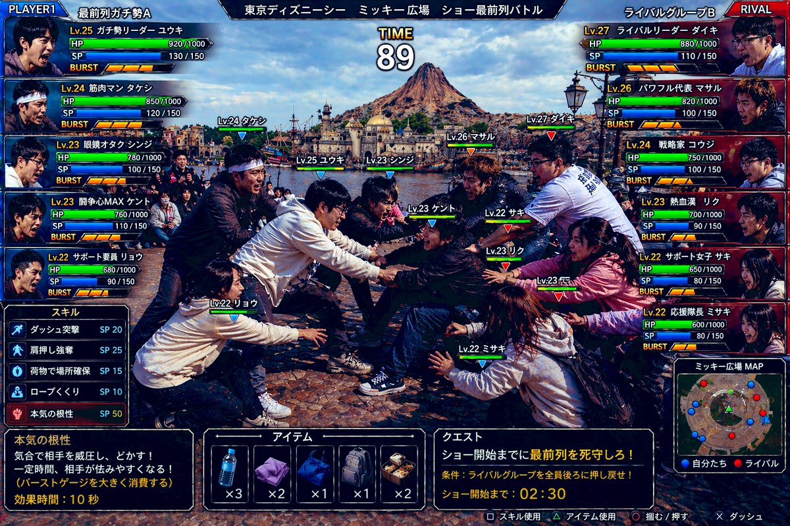 |

**Prompt:**

```
Create a hyper-detailed comedic Japanese arcade fighting game screenshot styled like a versus battle scene, using a real-world photo aesthetic with game UI overlaid on top. The scene shows an intense mock battle between two groups of theme-park fans competing for the front row at an outdoor show plaza in Tokyo DisneySea. Use a wide 16:9 composition. In the background, clearly show Mediterranean Harbor and Mount Prometheus under bright daytime skies, with the waterfront and DisneySea architecture visible. In the foreground, show exactly 10 young adult people in winter casual clothing, split into 2 opposing teams of 5, physically leaning, grabbing, reaching, and shoving in a tug-of-war-like scrum over position, with exaggerated competitive body language and frozen action as if in a fighting game. Faces should be anonymized with soft blurred blocks. Add floating character labels above each person with levels and names in Japanese. The overall tone is absurdly realistic, like a real candid photo transformed into a polished arcade game battle screen.

Add a full Japanese fighting-game HUD with glossy blue-versus-red interface styling. At the very top, place a center stage title bar reading "東京ディズニーシー ミッキー広場 ショー最前列バトル" and a large timer in the middle reading "TIME 89". In the top left, add a blue team header "PLAYER1" and team name "最前列ガチ勢A". In the top right, add a red team header "RIVAL" and team name "ライバルグループB". On the left side, stack exactly 5 blue player status panels with portraits, level, Japanese class-like nicknames, HP, SP, and BURST meters. The 5 left-side labels are: "Lv.25 ガチ勢リーダー ユウキ", "Lv.24 筋肉マン タケシ", "Lv.23 眼鏡オタク シンジ", "Lv.23 開角心MAX ケント", "Lv.22 サポート要員 リョウ". On the right side, stack exactly 5 red rival status panels with the labels: "Lv.27 ライバルリーダー ダイキ", "Lv.26 パワフル代表 マサル", "Lv.24 戦略家 コウジ", "Lv.23 熱血漢 リク", "Lv.22 サポート女子 サキ". Each panel should include numeric HP and SP values and segmented BURST gauges, styled like a Japanese arcade RPG-fighter interface.

Place exactly 10 in-battle nameplates above the fighters in the center scene, color-coded blue for the left team and red for the right team. The 10 labels are: "Lv.24 タケシ", "Lv.25 ユウキ", "Lv.23 シンジ", "Lv.23 ケント", "Lv.22 リョウ", "Lv.27 ダイキ", "Lv.26 マサル", "Lv.23 リク", "Lv.22 サキ", "Lv.22 ミサキ".

At the lower left, add a skill menu titled "スキル" listing exactly 5 skills with SP costs: "ダッシュ突撃 SP 20", "肩押し強奪 SP 25", "荷物で場所確保 SP 15", "ロープくぐり SP 10", "本気の根性 SP 50". Beneath that, add a dark description box explaining the highlighted skill "本気の根性" with the Japanese text: "気合で相手を威圧し、どかす! 一定時間、相手が怯みやすくなる! (バーストゲージを大きく消費する) 効果時間:10秒".

At the bottom center, add an item menu titled "アイテム" with exactly 5 item slots showing icons and counts: a water bottle "x3", a folded purple towel "x2", a blue drawstring bag "x1", a gray backpack "x1", and a boxed meal "x2". At the lower right, add a quest panel titled "クエスト" with the mission text "ショー開始までに最前列を死守しろ!" and condition text "条件:ライバルグループを全員後ろに押し戻せ!" and countdown text "ショー開始まで:02:30". Beside it, add a mini-map titled "ミッキー広場MAP" showing red and blue dots for both teams in the plaza. Along the very bottom edge, include small controller prompts in Japanese for actions such as skill use, item use, grab/push, and dash.

Use dramatic, saturated lighting, crisp detail, realistic clothing folds, authentic plaza stone pavement, and a high-end Japanese game screenshot look. The image should feel like a ridiculous but believable crossover between a real Tokyo DisneySea crowd photo and a competitive arcade battle game interface.
```

## Agradecimientos

Este repositorio se inspiro en destacadas colecciones abiertas de prompts y en experimentos de GPT-Image-2 compartidos por la comunidad.

Gracias a los creadores y colaboradores que compartieron su trabajo publicamente e hicieron posibles estos casos de estudio.

[@BubbleBrain](https://x.com/BubbleBrain), [@iam_miharbi](https://x.com/iam_miharbi), [@Shinning1010](https://x.com/Shinning1010), [@patrickassale](https://x.com/patrickassale), [@Zoulinshen](https://x.com/Zoulinshen), [@WolfRiccardo](https://x.com/WolfRiccardo), [@Panda20230902](https://x.com/Panda20230902), [@liyue_ai](https://x.com/liyue_ai), [@blanplan](https://x.com/blanplan), [@4WEB1](https://x.com/4WEB1), [@lilimliliychan](https://x.com/lilimliliychan), [@Thereallo1026](https://x.com/Thereallo1026), [@iamrednightS](https://x.com/iamrednightS), [@09lyco](https://x.com/09lyco), [@tsubaki_ew](https://x.com/tsubaki_ew), [@Toshi_nyaruo_AI](https://x.com/Toshi_nyaruo_AI), [@yyu_hase](https://x.com/yyu_hase), [@austinit](https://x.com/austinit), [@MrLarus](https://x.com/MrLarus), [@rionaifantasy](https://x.com/rionaifantasy), [@alanblogsooo](https://x.com/alanblogsooo), [@SKA_Neotype](https://x.com/SKA_Neotype), [@desds1678](https://x.com/desds1678), [@samifox_ai](https://x.com/samifox_ai), [@HuliJason](https://x.com/HuliJason), [@MikelEcheve](https://x.com/MikelEcheve), [@chetaslua](https://x.com/chetaslua), [@signedbywill](https://x.com/signedbywill), [@zerolu_eth](https://x.com/zerolu_eth), [@Cheney_NehcOal](https://x.com/Cheney_NehcOal), [@cnzoecomeback](https://x.com/cnzoecomeback), [@linxiaobei888](https://x.com/linxiaobei888), [@old_pgmrs_will](https://x.com/old_pgmrs_will), [@kotsu_kotsu_san](https://x.com/kotsu_kotsu_san), [@samayousakadaru](https://x.com/samayousakadaru), [@saskr_13](https://x.com/saskr_13), [@kawai_design](https://x.com/kawai_design), [@otohitoyuuki](https://x.com/otohitoyuuki), [@jrpj2010](https://x.com/jrpj2010), [@CEs7J0Mfn8x37k5](https://x.com/CEs7J0Mfn8x37k5), [@pfanis](https://x.com/pfanis), [@yssrski](https://x.com/yssrski), [@overseas58](https://x.com/overseas58), [@opc_8838](https://x.com/opc_8838), [@RitaStar1128](https://x.com/RitaStar1128), [@Yuupapa_free](https://x.com/Yuupapa_free), [@tebasaki3D](https://x.com/tebasaki3D), [@terunari](https://x.com/terunari), [@Colin_Leeee](https://x.com/Colin_Leeee), [@Abdullah__Ai7](https://x.com/Abdullah__Ai7), [@songguoxiansen](https://x.com/songguoxiansen), [@AIMAG31G](https://x.com/AIMAG31G), [@degewa](https://x.com/degewa), [@mosthssan](https://x.com/mosthssan), [@sjbbxhz](https://x.com/sjbbxhz), [@SDAI1807097011](https://x.com/SDAI1807097011), [@_simonsmith](https://x.com/_simonsmith), [@AllaAisling](https://x.com/AllaAisling), [@Ray_CROWN0](https://x.com/Ray_CROWN0), [@sub_raw_jin](https://x.com/sub_raw_jin), [@xRahultripathi](https://x.com/xRahultripathi), [@yy7482933910896](https://x.com/yy7482933910896), [@leyu37829](https://x.com/leyu37829), [@Salmaaboukarr](https://x.com/Salmaaboukarr), [@GlennHasABeard](https://x.com/GlennHasABeard), [@Inshrah_ali_](https://x.com/Inshrah_ali_), [@JohnnyWang8802](https://x.com/JohnnyWang8802), [@MiguelMaestroIA](https://x.com/MiguelMaestroIA), [@zenkaiAI](https://x.com/zenkaiAI), [@erikmackinnon](https://x.com/erikmackinnon), [@ExquisitMe](https://x.com/ExquisitMe), [@S0N_IA_](https://x.com/S0N_IA_), [@IndieDevHailey](https://x.com/IndieDevHailey), [@rerxmsz06](https://x.com/rerxmsz06), [@Tanemomi_Ver2](https://x.com/Tanemomi_Ver2), [@AIillust_studio](https://x.com/AIillust_studio), [@Eris_Create_Lab](https://x.com/Eris_Create_Lab), [@silentempiredev](https://x.com/silentempiredev), [@dynamicwangs](https://x.com/dynamicwangs), [@mikko_20100518](https://x.com/mikko_20100518), [@Dakiny](https://x.com/Dakiny), [@jiajia232016](https://x.com/jiajia232016), [@gdb](https://x.com/gdb), [@SPEEDAI07](https://x.com/SPEEDAI07), [@chi_vc_](https://x.com/chi_vc_), [@XSydneyFan](https://x.com/XSydneyFan), [@himukai_an](https://x.com/himukai_an), [@Magncsans](https://x.com/Magncsans), [@SelenaGmzIN](https://x.com/SelenaGmzIN), [@Gorden_Sun](https://x.com/Gorden_Sun), [@_LaurentB](https://x.com/_LaurentB), [@chesnyfcb](https://x.com/chesnyfcb), [@WooGabriel76263](https://x.com/WooGabriel76263), [@sarinaashapi](https://x.com/sarinaashapi), [@Professor_134](https://x.com/Professor_134), [@AlwaveNazca](https://x.com/AlwaveNazca), [@mirochill](https://x.com/mirochill), [@libearal](https://x.com/libearal), [@harboriis](https://x.com/harboriis), [@ToroJushiAi](https://x.com/ToroJushiAi), [@jeremydevz](https://x.com/jeremydevz), [@komorimedia](https://x.com/komorimedia), [@Just_sharon7](https://x.com/Just_sharon7), [@Adam38363368936](https://x.com/Adam38363368936), [@Gugombly](https://x.com/Gugombly), [@sorane_aimusic](https://x.com/sorane_aimusic), [@Design4p0](https://x.com/Design4p0), [@Diplomeme](https://x.com/Diplomeme), [@Polanco_IA](https://x.com/Polanco_IA), [@yanagihara_0805](https://x.com/yanagihara_0805), [@ismajc](https://x.com/ismajc), [@Ayu_AI_0912](https://x.com/Ayu_AI_0912), [@MoveHiro1219](https://x.com/MoveHiro1219), [@rojassartorio](https://x.com/rojassartorio), [@mm_zzm44854](https://x.com/mm_zzm44854), [@xc5_](https://x.com/xc5_), [@edimakorfr](https://x.com/edimakorfr), [@m_Raiko_AIart](https://x.com/m_Raiko_AIart), [@FernandesK47117](https://x.com/FernandesK47117), [@Gerry](https://x.com/Gerry), [@yume00112211](https://x.com/yume00112211), [@Hair_Hair55](https://x.com/Hair_Hair55), [@Kazuch75240438](https://x.com/Kazuch75240438), [@almimeister](https://x.com/almimeister), [@ShamsAmin56](https://x.com/ShamsAmin56), [@Shion_yamabuki](https://x.com/Shion_yamabuki), [@kotobukigraphic](https://x.com/kotobukigraphic), [@hoshi122221](https://x.com/hoshi122221), [@Ciri_ai](https://x.com/Ciri_ai), [@GeekCatX](https://x.com/GeekCatX), [@megane_onesan](https://x.com/megane_onesan), [@TWnese](https://x.com/TWnese), [@ArtwlDesign](https://x.com/ArtwlDesign), [@mob_17](https://x.com/mob_17), [@aimikoda](https://x.com/aimikoda), [@Strength04_X](https://x.com/Strength04_X), [@wory37303852](https://x.com/wory37303852), [@makaneko_AI](https://x.com/makaneko_AI), [@tonysimons_](https://x.com/tonysimons_)

*No podemos garantizar que cada caso este atribuido correctamente al creador original. Si algo debe corregirse, contactanos y lo actualizaremos.*

Si tienes mas casos interesantes de prompts de GPT-Image-2 para compartir, no dudes en escribirnos y ayudarnos a ampliar la biblioteca de prompts de Evolink.

## Star History

[](https://www.star-history.com/#EvoLinkAI/awesome-gpt-image-2-prompts&Date)
