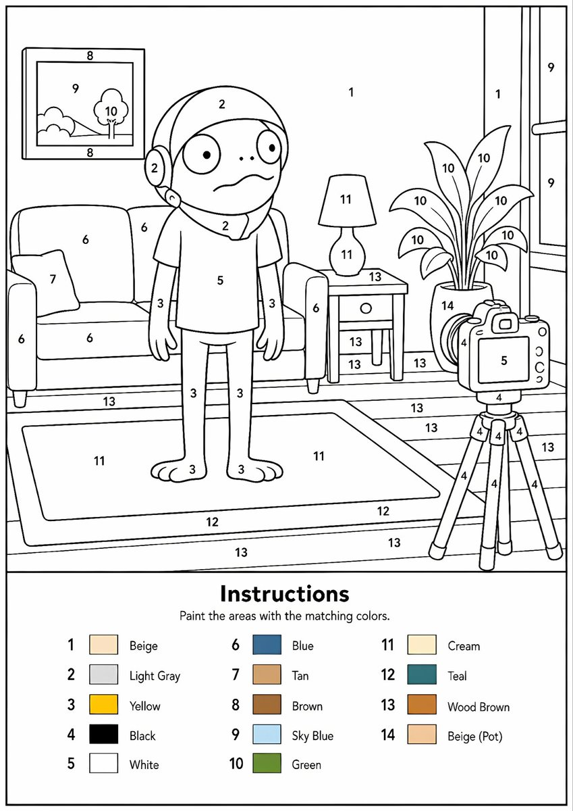
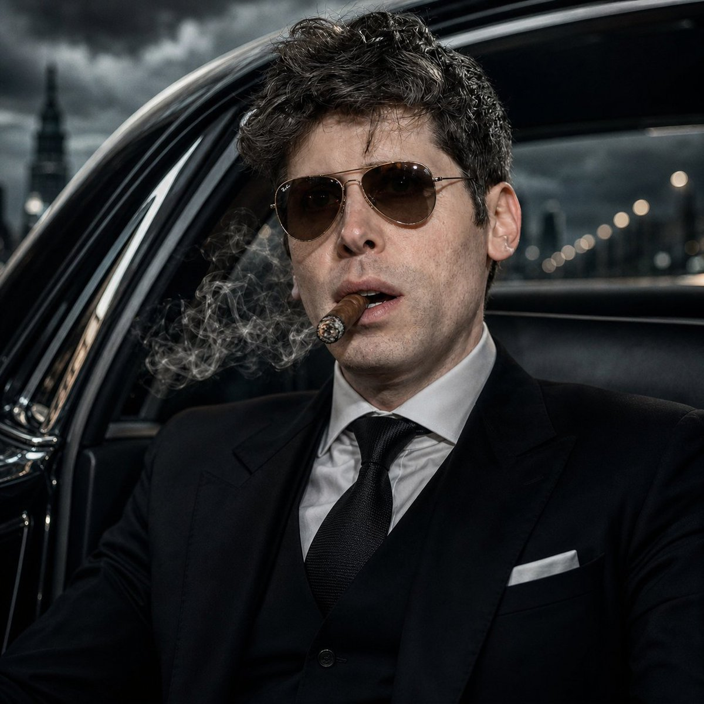
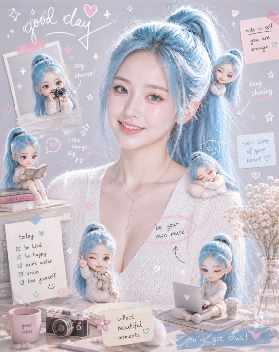

<div align="center">

<a href="https://evolink.ai/gpt-image-2-prompts?utm_source=github&utm_medium=banner&utm_campaign=awesome-gpt-image-2-API-and-Prompts"></a>

[](LICENSE)
[](README.md)
[](https://github.com/EvoLinkAI/GPT-Image-2-Seedance2-Workflow)
[](https://github.com/EvoLinkAI/gpt-image-2-gen-skill)

[](README.md)
[](README_es.md)
[](README_pt.md)
[](README_ja.md)
[](README_ko.md)
[](README_de.md)
[](README_fr.md)
[](README_tr.md)
[](README_zh-TW.md)
[](README_zh-CN.md)
[](README_ru.md)

</div>

## 🍌 Giris

awesome-gpt-image-2-API-and-Prompts deposuna hos geldiniz! 🤗

**Portreler, posterler, karakter sayfalari, UI mockuplari ve topluluk deneyleri icin GPT-Image-2 uzerine yuksek kaliteli promptlar ve gorsel ornekler derliyoruz.**

Bu depodaki vakalarin cogu X/Twitter, uretici topluluklari, herkese acik demolar ve paylasilan deneylerden derlenmistir.

Evolink uzerinde deneyin: [GPT-Image-2](https://evolink.ai/gpt-image-2-prompts?utm_source=github&utm_medium=readme&utm_campaign=awesome-gpt-image-2-API-and-Prompts)

Faydali bulduysaniz bir yildiz vermeyi dusunun. ⭐

> [!NOTE]
> Bu depo, Evolink uzerindeki GPT-Image-2 icin yeniden kullanilabilir prompt kaliplari, referans vakalar ve goreve ozel orneklere odaklanir.
> Son yalnizca-prompt guncellemeleri `gpt_image_2_prompt.json` dosyasinda da takip edilir.

<a href='https://evolink.ai/gpt-image-2-prompts?utm_source=github&utm_medium=badge&utm_campaign=awesome-gpt-image-2-API-and-Prompts'></a>

## Haberler

- **30 Nisan 2026:** Son 24 saatlik arama partisinden onaylanmis ve medyasi dogrulanmis 9 yeni GPT-Image-2 prompt vakasi eklendi (3 portre, 1 poster, 3 UI, 2 karsilastirma)
- **29 Nisan 2026:** Inceleme partileri genelinde 22 yeni GPT-Image-2 prompt vakasi eklendi (3 e-ticaret, 3 reklam kreatifi, 4 portre, 2 karakter tasarimi, 9 poster, 1 karsilastirma), Case 102 ve 103 icin yerellestirilmis prompt girisleri senkronize edildi ve daha genis valid keep-set taramasi dahil edildi
- **21 Nisan 2026:** 48 yeni prompt vakasi galeri bolumlerine kategorilendi ve baglantili cikti gorselleri indirildi
- **21 Nisan 2026:** Portre, poster, UI ve karsilastirma vakalarina 12 yeni GPT-Image-2 promptu eklendi
- **20 Nisan 2026:** Yerel gorsel varliklari ve README guncellemeleriyle birlikte 10 yeni derlenmis GPT-Image-2 promptu eklendi.
- **19 Nisan 2026:** Poster, UI ve karsilastirma vakalarina 10 yeni GPT-Image-2 promptu eklendi
- **18 Nisan 2026:** Derlenmis GPT-Image-2 vaka setiyle deponun ilk yayini
- **20 Nisan 2026:** Yerel gorsel varliklari ve README guncellemeleriyle birlikte 10 yeni derlenmis GPT-Image-2 promptu eklendi.
- **19 Nisan 2026:** Poster, UI ve karsilastirma vakalarina 10 yeni GPT-Image-2 promptu eklendi
- **18 Nisan 2026:** Derlenmis GPT-Image-2 vaka setiyle deponun ilk yayini

## Icindekiler

- [🍌 Giriş](#giris)
- [📰 Haberler](#haberler)
- [📑 Icindekiler](#icindekiler)
- [🛒 E-commerce Cases](cases/ecommerce_tr.md)
- [📣 Ad Creative Cases](cases/ad-creative_tr.md)
- [🍌 Portrait & Photography Cases](cases/portrait_tr.md)
- [🎨 Poster & Illustration Cases](cases/poster_tr.md)
- [🧍 Character Design Cases](cases/character_tr.md)
- [📱 UI & Social Media Mockup Cases](cases/ui_tr.md)
- [🧪 Comparison & Community Examples](cases/comparison_tr.md)
- [🙏 Teşekkür](#tesekkur)

## 🛒 E-commerce Cases

> See all cases → [cases/ecommerce.md](cases/ecommerce_tr.md)

<!-- Case 151: E-commerce Main Image - Miniature Diorama Skincare Advertisement (by @Strength04_X) -->
### Case 151: [E-commerce Main Image - Miniature Diorama Skincare Advertisement](https://x.com/Strength04_X/status/2048074514278563949) (by [@Strength04_X](https://x.com/Strength04_X))

| Sonuc |
| :----: |
| <a href="https://evolink.ai/gpt-image-2-prompts?utm_source=github&utm_medium=picture&utm_campaign=awesome-gpt-image-2-API-and-Prompts" target="_blank" rel="noopener noreferrer"></a> |

**Prompt：**

```
A hyper-realistic miniature diorama product advertisement featuring an oversized luxury skincare pump bottle labeled "LUXEVEIL Skin Science – Radiance Nourishing Body Lotion" in cream/beige with a polished gold pump top, placed on a circular platform. Tiny figurine construction workers dressed in yellow coveralls and white hard hats swarm around the bottle climbing scaffolding, painting the bottle with rollers, operating a tower crane, working near industrial tanks and pipework, and unloading a miniature flatbed truck. The scene includes metal scaffolding structures, industrial silos, orange traffic cones, wooden barricades, and storage barrels. The overall color palette is warm beige, cream, gold, and mustard yellow. Studio photography style with soft diffused lighting, no shadows, clean beige background. The concept metaphorically shows workers "crafting" or "building" the perfect lotion. Tilt-shift miniature aesthetic, ultra-detailed, commercial product photography, 8K resolution, photorealistic CGI render.
```

<!-- Case 160: E-commerce Main Image - 9-Panel Product TVC Storyboard (by @Magncsans) -->
### Case 160: [E-commerce Main Image - 9-Panel Product TVC Storyboard](https://x.com/Magncsans/status/2047876253898903594) (by [@Magncsans](https://x.com/Magncsans))

| Sonuc |
| :----: |
| <a href="https://evolink.ai/gpt-image-2-prompts?utm_source=github&utm_medium=picture&utm_campaign=awesome-gpt-image-2-API-and-Prompts" target="_blank" rel="noopener noreferrer"></a> |

**Prompt：**

```
Using the provided reference image, transform the single casual product photo into a polished e-commerce TVC storyboard board for a {argument name="video duration" default="15-second"} ad in a {argument name="aspect ratio" default="9:16"} vertical format, presented as a 9-panel grid. Keep the same blue-and-white ceramic ashtray as the product base, but restage it across cinematic advertising shots with warm premium lighting, shallow depth of field, and a refined lifestyle desktop environment. Add a dark storyboard layout with Chinese titles and timing for each panel. Include exactly 9 scenes: 1) environment-establishing wide shot with desk, books, window, and the product placed in context; 2) hero product medium shot on the table; 3) extreme close-up of the blue floral craftsmanship pattern; 4) use case showing a hand placing a cigarette into the ashtray with visible smoke; 5) top-down capacity display showing multiple cigarette butts inside; 6) cleaning scene under running water in a sink with a hand holding the product; 7) bottom-detail close-up showing the underside and anti-slip pads; 8) mood/lifestyle scene at night with the product on a desk, smoke rising, and ambient lamp light; 9) brand closing frame with the product as the hero plus Chinese marketing text. Add the overall header text “产品TVC分镜脚本(15秒 / 9:16竖屏 / 9宫格)” and a product subtitle naming it {argument name="product name" default="青花瓷烟灰缸"}. Give each of the 9 panels a Chinese scene title and timestamp, plus small descriptive Chinese copy beneath each image in the style of a professional commercial shot list. Use premium, realistic commercial photography throughout, consistent product identity, elegant Chinese aesthetic, and a clean high-end storyboard presentation.
```

<!-- Case 163: Burger hero image plus 9-cell ad storyboard (by @Gdgtify) -->
### Case 163: [Burger hero image plus 9-cell ad storyboard](https://x.com/Gdgtify/status/2049449869530775877) (by [@Gdgtify](https://x.com/Gdgtify))

| Sonuc |
| :----: |
| <a href="https://evolink.ai/gpt-image-2-prompts?utm_source=github&utm_medium=picture&utm_campaign=awesome-gpt-image-2-API-and-Prompts" target="_blank" rel="noopener noreferrer"></a> |

**Prompt：**

```
Prompt 1: Create a cinematic hero image of a gourmet cheeseburger on a dark stone surface with glossy brioche bun, melted cheese, crisp lettuce, tomato, grilled patty, sauce, realistic texture, appetizing steam, warm side light, shallow depth of field, premium food commercial style, no text/logos/watermark.

Prompt 2: Create a 9-cell hybrid keyframe-to-transition storyboard sheet for a 15-second gourmet burger ad, moving from empty surface to ingredient assembly to final macro hero shot. Use large S cells and smaller T cells, motion arrows, ghosted ingredient positions, steam, sauce trails, and camera push-in icons. Style: premium food commercial, warm lighting, rich texture, appetizing, cinematic, minimal labels only. No logos, no watermark.
```


<!-- Case 164: Annotated Food Table Posts (by @iamsofiaijaz) -->
### Case 164: [Annotated Food Table Posts](https://x.com/iamsofiaijaz/status/2050627668861944073) (by [@iamsofiaijaz](https://x.com/iamsofiaijaz))

| Output |
| :----: |
| <a href="https://evolink.ai/gpt-image-2-prompts?utm_source=github&utm_medium=picture&utm_campaign=awesome-gpt-image-2-API-and-Prompts" target="_blank" rel="noopener noreferrer"></a> |

**Prompt:**

```
Prompt 1:
A cozy restaurant table filled with a vibrant Taiwanese meal, shot in warm natural lighting. A large bowl of braised beef noodle soup with wide noodles, tender beef chunks, bok choy, and green onions sits in the foreground. Surrounding dishes include a bowl of rice topped with raw egg yolk, seaweed, kimchi, and chopped vegetables, a plate of Taiwanese fried chicken and tofu with greens, stir-fried water spinach with garlic, and a small dish of marinated vegetables. A tall elegant glass dessert with shrimp salad layered inside stands in the center. Wooden table surface, ceramic bowls, and a teapot in the background create a homely aesthetic. Handwritten-style Chinese text annotations and doodles are scattered around the dishes, adding a playful lifestyle-blog feel. Soft depth of field, warm tones, high detail, food photography style.

Prompt 2:
A top-down view of a neatly arranged Japanese bento box on a wooden table. The bento is a black lacquered box with red interior compartments. Inside are crispy karaage, mutton gyoza dumplings, fluffy white rice topped with colorful furikake seasoning, sliced tamagoyaki, and bright red pickles in the center. Warm cozy aesthetic, soft natural lighting, hand-drawn doodles and annotations in white, playful scrapbook feel, highly detailed food textures, vibrant colors, aesthetic composition, Instagram-style food photography.
```

## 📣 Ad Creative Cases

> See all cases → [cases/ad-creative.md](cases/ad-creative_tr.md)

<!-- Case 144: Luxury Chronograph Watch Ad (by @AlwaveNazca) -->
### Case 144: [Luxury Chronograph Watch Ad](https://x.com/AlwaveNazca/status/2048147643809865950) (by [@AlwaveNazca](https://x.com/AlwaveNazca))

| Sonuc |
| :----: |
| <a href="https://evolink.ai/gpt-image-2-prompts?utm_source=github&utm_medium=picture&utm_campaign=awesome-gpt-image-2-API-and-Prompts" target="_blank" rel="noopener noreferrer"></a> |

**Prompt：**

```
A dramatic luxury product advertising image for a motorsport-inspired chronograph wristwatch in a dark studio. Center-left foreground, show a single stainless steel chronograph watch standing upright at a slight three-quarter angle, with a black dial, two red-accent subdials, slim silver hour markers, a tachymeter bezel, and visible crown and pushers on the right side. The watch has a black leather strap with bold red stitching along both edges and a sporty premium finish. To the right of the watch, place one black square presentation box slightly behind it, textured like leather, with red stitching around the lid and a silver embossed eye-shaped logo above the text “NESS STUDIO” and smaller red text “TRACK SURFACE.” At the top center of the composition, add the same silver eye logo with the words “NESS STUDIO” and smaller “BY NICOLAS.” Across the background, place one oversized blurred word, {argument name="headline text" default="PRECISION"}, in large gray capital letters spanning nearly the full width. The scene is set against a deep black background with cinematic red and white horizontal light streaks crossing behind the products from left to right, suggesting speed and racetrack energy. Use a glossy wet ground plane with reflective texture, catching red highlights and mirrorlike reflections beneath the watch and box. At the bottom center, add the text “CHRONOGRAPH SERIES” in clean white spaced capitals with thin red horizontal lines extending on both sides, and below it smaller red capitals reading {argument name="tagline text" default="ALSACE MADE"}. Color palette: black, charcoal gray, silver steel, vivid racing red, and a touch of white. Lighting should be high-contrast and premium, with crisp specular highlights on the metal case, subtle soft fill on the box, and moody shadows. Overall style: ultra-polished commercial product photography, luxury watch campaign, sharp focus on the products, sleek branding, high-end automotive aesthetic.
```

<!-- Case 150: Luxury Miniature Dubai City Model (by @silentempiredev) -->
### Case 150: [Luxury Miniature Dubai City Model](https://x.com/silentempiredev/status/2048086378383384773) (by [@silentempiredev](https://x.com/silentempiredev))

| Sonuc |
| :----: |
| <a href="https://evolink.ai/gpt-image-2-prompts?utm_source=github&utm_medium=picture&utm_campaign=awesome-gpt-image-2-API-and-Prompts" target="_blank" rel="noopener noreferrer"></a> |

**Prompt：**

```
A hyper-detailed cinematic isometric miniature city model of {argument name="landmark tower" default="Burj Khalifa"} rising dramatically from the center of a square architectural master-plan board, presented like a luxury urban planning maquette on a black background. The composition shows one dominant ultra-tall silver skyscraper in the exact center, surrounded by a dense ring of modern high-rise towers, illuminated roads, bridges, and glowing warm city lights. Curving turquoise-blue water features and artificial lakes wrap around the central district in multiple connected pools and canals, with one large circular fountain-like feature near the tower base and several small island shapes visible in the water. In the lower right quadrant, include a large low-rise complex with rounded geometric roofs and subtle green-lit sections, connected by multilane roads and looping interchanges. The entire city sits on one square beige map board engraved with faint street grids and planning lines, with the board edges clearly visible and slightly raised. Viewpoint is a high three-quarter isometric angle, centered and symmetrical, with the tower extending far upward into negative space. Lighting is dramatic and luxurious: warm golden edge lights on buildings and roads, cool reflections in the water, crisp metallic highlights on the central tower, and a deep black void surrounding the model. Style should feel like a photorealistic architectural visualization mixed with a premium collectible scale model, extremely intricate, sharp, polished, and elegant.
```

<!-- Case 169: Luxury chocolate campaign system (by @SPEEDAI07) -->
### Case 169: [Luxury chocolate campaign system](https://x.com/SPEEDAI07/status/2049459155086500321) (by [@SPEEDAI07](https://x.com/SPEEDAI07))

| Sonuc |
| :----: |
| <a href="https://evolink.ai/gpt-image-2-prompts?utm_source=github&utm_medium=picture&utm_campaign=awesome-gpt-image-2-API-and-Prompts" target="_blank" rel="noopener noreferrer"></a> |

**Prompt：**

```
Create a premium, square (1:1) product advertisement for a fictional luxury chocolate brand called Noirvelle Chocolat, inspired by high-end chocolate brands. The ad should feel like a high-end editorial campaign, combining luxury food photography, refined packaging design, and cinematic lighting. Use matte black wrapper, subtle gold foil, elegant serif typography, and realistic product rendering. Generate flavor variants such as Blood Orange Noir, Salted Pistachio Muse, and Raspberry Ember with distinct mood, color palette, ingredients, headline, and supporting copy. Keep the chocolate bar as hero centerpiece with subtle reflections, shallow depth of field, luxury minimalism, and a small CTA: “Shop the drop.”
```


<!-- Case 170: Surreal Brand World Poster (by @SaasJunctionHQ) -->
### Case 170: [Surreal Brand World Poster](https://x.com/SaasJunctionHQ/status/2050644926023844149) (by [@SaasJunctionHQ](https://x.com/SaasJunctionHQ))

| Output |
| :----: |
| <a href="https://evolink.ai/gpt-image-2-prompts?utm_source=github&utm_medium=picture&utm_campaign=awesome-gpt-image-2-API-and-Prompts" target="_blank" rel="noopener noreferrer"></a> |

**Prompt:**

```
A hyper-detailed surreal advertising poster for [BRAND NAME].

BACKGROUND: A large deep-toned rounded rectangle in [BRAND NAME]'s signature brand color fills 90% of the frame. Behind the subject, massive cropped brand typography bleeds off-frame, letters constructed from the brand's core material texture, embossed and lit with sharp directional rim lighting. Subtle noise grain texture overlays the background.

SUBJECT: Use the uploaded reference image. Preserve the subject's exact face and skin tone from the reference. The person faces camera in a three-quarter foreground stance, holding the brand's most iconic product directly toward the lens.

EXPRESSION: Restyle the subject's facial expression to match [BRAND NAME]'s brand personality and emotional tone.

OUTFIT: Completely restyle the subject's clothing into a character that naturally belongs to [BRAND NAME]'s universe. Use [BRAND NAME]'s exact brand palette and add small branded details.

SURREAL PRODUCT MOMENT: The product held by the subject opens, spills, or expands into a self-contained miniature world tied to [BRAND NAME]'s identity and values.

GRAPHIC LAYER: Scattered sparkle glyphs, floating micro-elements, layered soft fog, and subtle chromatic aberration at frame edges.

TEXT SYSTEM:
- TOP: Rounded pill badge, "[BRAND NAME]"
- CENTER-LEFT: Brand tagline in bold condensed uppercase
- BOTTOM STRIP: Four feature tags in a row

QUALITY: Unreal Engine render quality, octane lighting, macro lens bokeh on background elements, 8K sharp foreground.
```

## 🍌 Portrait & Photography Cases

> See all cases → [cases/portrait.md](cases/portrait_tr.md)

<!-- Case 1: Convenience Store Neon Portrait (by @BubbleBrain) -->
### Case 1: [Convenience Store Neon Portrait](https://x.com/BubbleBrain/status/2045167461147042202) (by [@BubbleBrain](https://x.com/BubbleBrain))

| Sonuc |
| :----: |
| <a href="https://evolink.ai/gpt-image-2-prompts?utm_source=github&utm_medium=picture&utm_campaign=awesome-gpt-image-2-API-and-Prompts" target="_blank" rel="noopener noreferrer"></a> |

**Prompt：**

```
35mm film photography with harsh convenience store fluorescent lighting mixed with colorful neon signs from outside, authentic film grain, high contrast, slight color cast, cinematic street editorial style, intimate medium shot, early 20s sexy Chinese female idol with ultra-realistic delicate refined Chinese features, seductive almond-shaped fox eyes with natural double eyelids, high nose bridge, small sharp V-shaped jawline, flawless porcelain skin with cool ivory undertone and visible specular highlights from fluorescent light, subtle skin texture and micro pores, natural dewy makeup with soft flush on cheeks, glossy natural pink lips slightly parted, subtle natural freckles across nose and cheeks, long dark brown hair in a messy high ponytail with many loose strands falling around face and neck, wearing an oversized white button-up shirt as the only top, unbuttoned at the top with deep cleavage and loosely tied at the waist, paired with a tiny black pleated mini skirt, barefoot in simple white slides, seductive casual leaning pose against the glass door of a 24-hour convenience store at late night, body slightly arched, one leg bent with foot resting against the door frame, the other leg straight, one hand holding a bottle of iced drink, the other hand lightly pulling the hem of her mini skirt, intensely seductive playful yet slightly vulnerable gaze straight at the viewer with soft doe eyes full of quiet temptation and teasing smile, bright cold fluorescent store light from inside mixed with pink and blue neon glow from outside signs, realistic reflections on glass door, blurred convenience store interior with shelves and snacks in background, authentic 35mm film color grading with harsh lighting and neon accents, extremely sharp yet soft skin rendering, natural hair strands, realistic fabric wrinkles and drape on the oversized shirt and mini skirt, no plastic skin, no digital over-sharpening, no airbrushing, no blemishes, no moles, no oily skin, no watermark, no text, authentic late-night convenience store atmosphere
```
<!-- Case 84: Ink-Etched Family Portrait (by @gdb) -->
### Case 84: [Ink-Etched Family Portrait](https://x.com/gdb/status/2048184698195870102) (by [@gdb](https://x.com/gdb))

| Sonuc |
| :----: |
| <a href="https://evolink.ai/gpt-image-2-prompts?utm_source=github&utm_medium=picture&utm_campaign=awesome-gpt-image-2-API-and-Prompts" target="_blank" rel="noopener noreferrer"></a> |

**Prompt：**

```
A black-and-white hand-drawn family portrait in the style of detailed pen-and-ink crosshatching on textured white paper, showing 4 people seated closely together in a casual candid composition. On the left, an adult man in a dark baseball cap worn backward and a dark T-shirt leans into the frame, with a crossbody sling bag worn across his chest and visible zipper details. On the right, an adult woman with curly hair tied up in a loose high bun wears a light T-shirt with large collegiate block letters reading {argument name="shirt text" default="CITY"}. In the center are 2 young children sitting close together, both with short curly hair and matching light-colored T-shirts printed all over with strawberries. The child on the left leans inward with one arm crossing the other child, and the child on the right tilts their head slightly upward. The adults frame the children protectively, creating a warm family snapshot feeling. Render the whole image as a monochrome etched illustration with dense fine-line hatching, engraved shadows, crisp contour lines, and a realistic yet artistic likeness, with no color, no background setting beyond a plain light paper texture, and a vertical portrait crop.
```

<!-- Case 99: Dreamy Underwater Woman With Translucent Fish (by @kotobukigraphic) -->
### Case 99: [Dreamy Underwater Woman With Translucent Fish](https://x.com/kotobukigraphic/status/2047967522453123255) (by [@kotobukigraphic](https://x.com/kotobukigraphic))

| Sonuc |
| :----: |
| <a href="https://evolink.ai/gpt-image-2-prompts?utm_source=github&utm_medium=picture&utm_campaign=awesome-gpt-image-2-API-and-Prompts" target="_blank" rel="noopener noreferrer"></a> |

**Prompt：**

```
A dreamy surreal portrait of a {argument name="subject" default="young woman"} standing underwater or in a liquid-like ethereal space, shown from about mid-thigh up, wearing a flowing sleeveless white dress that appears to dissolve into translucent water and shimmering fragments. Her long {argument name="hair color" default="dark brown"} hair streams dramatically sideways as if suspended in water, and her face is intentionally obscured by a soft vertical blur block for anonymity. Surround her with an exact count of about 30 small translucent fish, some striped and some pale silvery white, swimming in multiple depths of field across the foreground, midground, and background, with several fish passing in front of her body and hair to create strong motion and depth. Use a soft pastel {argument name="background color" default="powder blue"} background with faint handwritten script texture layered across it, plus whimsical doodles scattered throughout: white and pale pink hearts, stars, curved squiggles, wave lines, dots, sparkles, and 2 smiley faces. Add prismatic rainbow refractions, glossy caustic highlights, and subtle lens-like chromatic shimmer on the fish and dress. The mood should feel delicate, introspective, airy, and magical, with high-key lighting, gentle contrast, soft focus in the foreground, and crisp detail on the torso and hair. Compose the figure slightly off-center with one arm relaxed downward and the body turned lightly in motion, as if drifting peacefully through a school of fish. Include tiny elegant footer text in white near the bottom edge, with a left signature, a centered website URL, and a small right credit mark, resembling an art-poster or social-media showcase image.
```

<!-- Case 100: Monochrome Glitch Profile Portrait (by @Goodmanprotocol) -->
### Case 100: [Monochrome Glitch Profile Portrait](https://x.com/Goodmanprotocol/status/2049733639651385759) (by [@Goodmanprotocol](https://x.com/Goodmanprotocol))

| Sonuc |
| :----: |
| <a href="https://evolink.ai/gpt-image-2-prompts?utm_source=github&utm_medium=picture&utm_campaign=awesome-gpt-image-2-API-and-Prompts" target="_blank" rel="noopener noreferrer"></a> |

**Prompt：**

```
Subject: A sharp, high-contrast side-profile portrait of a handsome man with a defined jawline, short stubble, and voluminous, textured dark hair styled upwards.

Style & Composition: A fusion of realistic photography and abstract digital glitch art. The subject is rendered in stark black and white, set against a clean, minimalist white background.

Color Palette: Strictly monochromatic (deep blacks and bright whites) with aggressive, vibrant splashes of crimson red.

Graphic Elements: > * Glitch Effect: The back of the head and the lower torso dissolve into abstract geometric shards, pixel sorting, and "glitchy" red brushstrokes.

Texture: Gritty, ink-wash textures and distressed digital overlays that suggest a modern noir or cyberpunk editorial feel.

Lighting & Technicals: > * Lighting: Intense side-lighting (Chiaroscuro) creating deep shadows on the face to highlight bone structure.

Details: Hyper-realistic skin texture, individual hair strands visible, high-grain film aesthetic.

Framing: Vertical aspect ratio, close-up profile shot.

Aspect ratio is 9:16
```

<!-- Case 101: Basketball Boy Motion Sequence (by @Taaruk_) -->
### Case 101: [Basketball Boy Motion Sequence](https://x.com/Taaruk_/status/2049702491768684839) (by [@Taaruk_](https://x.com/Taaruk_))

| Sonuc |
| :----: |
| <a href="https://evolink.ai/gpt-image-2-prompts?utm_source=github&utm_medium=picture&utm_campaign=awesome-gpt-image-2-API-and-Prompts" target="_blank" rel="noopener noreferrer"></a> |

**Prompt：**

```
A photorealistic video sequence captures a young boy with messy orange hair and thick-framed glasses, as seen in image_0.png, image_1.png, and other source frames. He is dressed in a black basketball jersey and matching shorts with purple and blue trim, featuring the text "WIZZGEN 23" on the front and "CHICAGO 23" on the back (image_4.png). The setting is an outdoor asphalt city basketball court with green trees and a visible basketball hoop. The action begins with the boy in a low stance, dribbling the ball between his legs (image_0.png through image_3.png), then transitions to him standing taller and performing crossovers (image_5.png through image_7.png), followed by him successfully spinning the ball on his finger (image_8.png), and finally posing with a peace sign while holding the ball (image_9.png). The lighting is soft daylight under an overcast sky.
```

<!-- Case 102: Golden Hour Street Side-Profile Portrait (by @Professor_134) -->
### Case 102: [Golden Hour Street Side-Profile Portrait](https://x.com/Professor_134/status/2049701241287311561) (by [@Professor_134](https://x.com/Professor_134))

| Sonuc |
| :----: |
| <a href="https://evolink.ai/gpt-image-2-prompts?utm_source=github&utm_medium=picture&utm_campaign=awesome-gpt-image-2-API-and-Prompts" target="_blank" rel="noopener noreferrer"></a> |

**Prompt：**

```
- Cinematic golden hour street portrait of a young woman in side profile, walking through a busy city crowd, soft wind blowing through her long light-brown hair, individual strands glowing in backlight, warm sunlight flaring through her hair creating a natural halo effect, dreamy atmosphere, shallow depth of field, strong subject separation, background filled with softly blurred pedestrians and urban motion bokeh.

She has delicate facial features, natural skin texture, subtle makeup, calm introspective expression, slightly parted lips, looking off-frame. Wearing a minimal outfit (dark neutral tones), possibly a light jacket, modern casual style.

Lighting is rich golden hour sunlight, strong backlighting with lens flare, cinematic highlights, warm orange and amber tones, high dynamic range, soft shadows, volumetric light rays passing through hair and environment.

Shot on a telephoto lens (85mm–135mm look), f/1.8 aperture, ultra-realistic, high detail, film still quality, natural color grading, slight film grain, soft bloom, editorial photography style, Vogue aesthetic.

Composition: rule of thirds, subject slightly off-center, crowd motion blur behind her, dynamic yet intimate framing.

Mood: nostalgic, dreamy, romantic, fleeting moment, poetic realism.

Style keywords: cinematic, photorealistic, golden hour glow, bokeh, volumetric lighting, shallow depth of field, editorial portrait, soft focus highlights, warm tones, natural skin texture

Negative prompt: low quality, overexposed face, harsh shadows, distorted facial features, extra limbs, blur on subject, noise, oversharpening, artificial skin, cartoonish look
Generate image using uploaded image as reference
```


<!-- Case 110: Selective Color Sunglasses Portrait (by @aiistudiocom) -->
### Case 110: [Selective Color Sunglasses Portrait](https://x.com/aiistudiocom/status/2050745987443081437) (by [@aiistudiocom](https://x.com/aiistudiocom))

| Output |
| :----: |
| <a href="https://evolink.ai/gpt-image-2-prompts?utm_source=github&utm_medium=picture&utm_campaign=awesome-gpt-image-2-API-and-Prompts" target="_blank" rel="noopener noreferrer"></a> |

**Prompt:**

```
A studio-style close-up editorial portrait of a person with strong, well-defined facial features and slightly imperfect, natural skin texture. The subject wears a black tailored turtleneck with sharp, clean lines, layered under a high-collared black jacket in a minimalist contemporary fashion style. The subject wears semi-transparent orange acetate sunglasses serving as the only colored element in the image. Color concept: selective color photography, monochrome black-and-white image with only the sunglasses in vivid orange. Mood is calm and confident, serious expression, direct gaze into the camera. Lighting is soft frontal studio light with gentle shadows, even skin tones, cinematic contrast, and visible natural skin texture. Shot on a professional portrait camera, f/2.0, ISO 100, 1/125s. High resolution, ultra-sharp focus on the face. Style: editorial luxury fashion portrait, photorealistic, professional studio photography, no illustration, no painterly effects.
```

<!-- Case 111: Playful Doodle Photo Edit (by @Ciri_ai) -->
### Case 111: [Playful Doodle Photo Edit](https://x.com/Ciri_ai/status/2050625732448235817) (by [@Ciri_ai](https://x.com/Ciri_ai))

| Output |
| :----: |
| <a href="https://evolink.ai/gpt-image-2-prompts?utm_source=github&utm_medium=picture&utm_campaign=awesome-gpt-image-2-API-and-Prompts" target="_blank" rel="noopener noreferrer"></a> |

**Prompt:**

```
Analyze the uploaded image and preserve the original subject, composition, and lighting exactly as is. Do not alter the identity, proportions, or structure of the main subject. Add playful hand-drawn doodles that interact naturally with the subject, such as small characters, smiley faces, or tiny companions, following the shape and perspective of the subject. Clean thin line style, slightly imperfect hand-drawn look, minimal but expressive, keep background untouched, overall mood fun, lighthearted, and aesthetic.
```

<!-- Case 112: Rainy Bus Window Portrait (by @john_my07) -->
### Case 112: [Rainy Bus Window Portrait](https://x.com/john_my07/status/2050608887397789997) (by [@john_my07](https://x.com/john_my07))

| Output |
| :----: |
| <a href="https://evolink.ai/gpt-image-2-prompts?utm_source=github&utm_medium=picture&utm_campaign=awesome-gpt-image-2-API-and-Prompts" target="_blank" rel="noopener noreferrer"></a> |

**Prompt:**

```
Ultra-realistic cinematic portrait of a young woman sitting by a rain-covered bus window at night, softly leaning her head against the glass with a melancholic expression. Messy bun, natural dewy skin, dark oversized coat, raindrops on window, blurred city-light bokeh, low-key teal-orange cinematic grade, shallow depth of field, candid composition, 85mm lens, f/1.8, film grain, soft glow, emotional storytelling, 8K detail.
```

<!-- Case 109: 2x2 Editorial Portrait Grid (by @Taaruk_) -->
### Case 109: [2x2 Editorial Portrait Grid](https://x.com/Taaruk_/status/2050429694890389779) (by [@Taaruk_](https://x.com/Taaruk_))

| Output |
| :----: |
| <a href="https://evolink.ai/gpt-image-2-prompts?utm_source=github&utm_medium=picture&utm_campaign=awesome-gpt-image-2-API-and-Prompts" target="_blank" rel="noopener noreferrer"></a> |

**Prompt:**

```
GPT IMAGE 2 ON CHATGPT Prompt: Editorial portrait photography arranged in a 2x2 grid layout featuring the same man with round tortoiseshell glasses, natural look, light beard, soft neutral background. Top-left: front-facing portrait with direct eye contact, calm expression. Top-right: extreme macro close-up of eye behind glasses, ultra-detailed iris and skin texture. Bottom-left: slightly lower angle portrait, subtle expression, soft shadows. Bottom-right: side profile portrait, natural pose, looking away. Soft diffused natural lighting, warm neutral tones, shallow depth of field, ultra-realistic skin texture with visible pores and freckles, minimal retouching, 85mm lens, high-end editorial photography style, clean composition, 4K
```

<!-- Case 106: Cyberpunk Fashion Portrait (by @ChillaiKalan__) -->
### Case 106: [Cyberpunk Fashion Portrait](https://x.com/ChillaiKalan__/status/2050453739430195320) (by [@ChillaiKalan__](https://x.com/ChillaiKalan__))

| Output |
| :----: |
| <a href="https://evolink.ai/gpt-image-2-prompts?utm_source=github&utm_medium=picture&utm_campaign=awesome-gpt-image-2-API-and-Prompts" target="_blank" rel="noopener noreferrer"></a> |

**Prompt:**

```
GPT Image 2 on @SocialSight Prompt: Futuristic portrait of a young woman facing camera, wearing a transparent neon jacket with glowing green and orange edges, large illuminated logo on chest, black inner outfit, sleek sunglasses, soft smoke light trails behind, dark teal background, cyberpunk fashion campaign, ultra-realistic textures, cinematic lighting, sharp focus, luxury sportswear branding style, 8k Style keywords: neon edges, glowing logo, fashion campaign, high-end branding, moody lighting
```

<!-- Case 107: Japanese Negative Film Rooftop Portrait (by @BubbleBrain) -->
### Case 107: [Japanese Negative Film Rooftop Portrait](https://x.com/BubbleBrain/status/2050449020645216532) (by [@BubbleBrain](https://x.com/BubbleBrain))

| Output |
| :----: |
| <a href="https://evolink.ai/gpt-image-2-prompts?utm_source=github&utm_medium=picture&utm_campaign=awesome-gpt-image-2-API-and-Prompts" target="_blank" rel="noopener noreferrer"></a> |

**Prompt:**

```
Today's Portrait by gpt image 2 ---prompt--- Japanese negative film aesthetic, rooftop summer scene, soft natural sunlight, slight overexposure highlights, low contrast, muted faded colors, subtle grain a stunning beautiful young woman with subtle sensual presence, natural body line, effortless charm wearing a slightly oversized white shirt loosely unbuttoned at the collar, paired with high-waisted shorts; shirt softly moving in the wind, occasionally slipping off one shoulder holding a cold glass bottle drink with condensation, one hand lifting it near her neck or cheek, fingers lightly touching the surface subject sitting or leaning on rooftop edge, body relaxed but with slight weight shift, one hand supporting behind, torso subtly opening, one knee bent and the other leg softly extended hair gently blown by summer wind, loose strands across face expression calm and distant, lips slightly parted, looking toward camera or slightly away open sky, minimal environment, a light plastic bag resting beside her moving slightly with the wind imperfect composition, quiet isolated mood, nostalgic and reflective, “memory-like realism”, subtle sensuality through natural gesture --2:3
```

<!-- Case 108: Paris Café Lifestyle Portrait (by @Sairah_0) -->
### Case 108: [Paris Café Lifestyle Portrait](https://x.com/Sairah_0/status/2050432730962530809) (by [@Sairah_0](https://x.com/Sairah_0))

| Output |
| :----: |
| <a href="https://evolink.ai/gpt-image-2-prompts?utm_source=github&utm_medium=picture&utm_campaign=awesome-gpt-image-2-API-and-Prompts" target="_blank" rel="noopener noreferrer"></a> |

**Prompt:**

```
GPT IMAGE 2 on Chat Gpt Prompt : Ultra-realistic portrait of a young woman sitting at a Parisian café, soft golden hour sunlight hitting her face, natural glowing skin, light blush, minimal makeup, green eyes, dark hair tied back with sunglasses on head, wearing a cozy grey knit sweater, resting her face on her hand, relaxed expression, shallow depth of field, cinematic lighting, reflections of classic Paris buildings in the window behind her, table with glassware and subtle foreground blur, 50mm lens, high detail, editorial fashion photography style. Prompt : Natural lifestyle portrait of a young woman at an outdoor Paris café, soft daylight, slightly wet slicked-back dark hair, minimal makeup with dewy skin and flushed cheeks, wearing a loose grey sweater, leaning her head on her hand, calm and intimate expression, symmetrical framing, glass windows reflecting Haussmann-style buildings, table with water glasses and phone, candid aesthetic, soft shadows, realistic tones, 35mm photography, high resolution, cinematic street-style fashion shoot.
```

## 🎨 Poster & Illustration Cases

> See all cases → [cases/poster.md](cases/poster_tr.md)

<!-- Case 3: Chengdu Food Map Illustration (by @Panda20230902) -->
### Case 3: [Chengdu Food Map Illustration](https://x.com/Panda20230902/status/2045396918965285111) (by [@Panda20230902](https://x.com/Panda20230902))

| Sonuc |
| :----: |
| <a href="https://evolink.ai/gpt-image-2-prompts?utm_source=github&utm_medium=picture&utm_campaign=awesome-gpt-image-2-API-and-Prompts" target="_blank" rel="noopener noreferrer"></a> |

**Prompt：**

```
一张手绘风格的城市美食地图，以成都为主题。画面以鸟瞰视角的手绘简化城市地图为底，标注主要道路和地标但不追求精确比例而是追求可爱的手绘感。地图上分布着 12 个美食地点的精致手绘小插画：春熙路的串串香（一把竹签插着各种食材冒着热气）、宽窄巷子的三大炮（三个糯米团子飞向铜盘）、建设路的蛋烘糕（金黄酥脆正在翻面）、玉林路的火锅（九宫格锅翻滚冒泡）等，每个插画约占地图的 5% 面积，旁边用手写体标注店名和一句推荐语"凌晨两点还在排队的那家"。地图边缘用手绘藤蔓和辣椒装饰形成边框。右下角有一个手绘指南针和图例说明。左上角标题"成都·吃货暴走地图"使用胖圆的手绘美术字配辣椒装饰。整体画风为水彩+彩铅混合的手绘质感，颜色以暖色系（辣椒红、姜黄、翠绿）为主，图片比例 1:1。
```
<!-- Case 79: Peacock Botanical Vintage Symmetrical Art Print (by @dotey) -->
### Case 79: [Peacock Botanical Vintage Symmetrical Art Print](https://x.com/dotey/status/2047803054422901046) (by [@dotey](https://x.com/dotey))

| Sonuc |
| :----: |
| <a href="https://evolink.ai/gpt-image-2-prompts?utm_source=github&utm_medium=picture&utm_campaign=awesome-gpt-image-2-API-and-Prompts" target="_blank" rel="noopener noreferrer"></a> |

**Prompt：**

```
symmetrical design featuring two elegant blue peacocks with detailed feather patterns, surrounded by blue floral elements, intricate vintage botanical ornament, soft beige background, classical floral decor style with rich navy and sky blue details, decorative art illustration --ar 3:2
```


<!-- Case 174: New York across two centuries cinematic poster (by @Shinning1010) -->
### Case 174: [New York across two centuries cinematic poster](https://x.com/Shinning1010/status/2049460661109879022) (by [@Shinning1010](https://x.com/Shinning1010))

| Sonuc |
| :----: |
| <a href="https://evolink.ai/gpt-image-2-prompts?utm_source=github&utm_medium=picture&utm_campaign=awesome-gpt-image-2-API-and-Prompts" target="_blank" rel="noopener noreferrer"></a> |

**Prompt：**

```
Create a cinematic 3:4 vertical poster of New York City that feels truly epic and unconventional, showing the passage from the 20th century to the 21st century in one seamless image. Place a lone figure at the center of the composition, standing in the middle of the street and looking forward as if witnessing New York across time. The left side should depict 20th-century New York with warm sepia atmosphere, vintage taxis, old newsstands, retro lamps, and landmarks like the Chrysler Building and Empire State Building. The right side should depict 21st-century New York with glass skyscrapers, One World Trade Center, digital billboards, and modern urban energy. Make the transition natural rather than split-screen, with coherent perspective, wet reflective pavement, realistic textures, atmospheric depth, and no text.
```


<!-- Case 175: Fitness Boxing Campaign Collage Poster (by @AIwithSynthia) -->
### Case 175: [Fitness Boxing Campaign Collage Poster](https://x.com/AIwithSynthia/status/2049718330353975652) (by [@AIwithSynthia](https://x.com/AIwithSynthia))

| Sonuc |
| :----: |
| <a href="https://evolink.ai/gpt-image-2-prompts?utm_source=github&utm_medium=picture&utm_campaign=awesome-gpt-image-2-API-and-Prompts" target="_blank" rel="noopener noreferrer"></a> |

**Prompt：**

```
Create a high-end fitness boxing poster in a 3-panel collage layout.
Top panel:
A strong athletic woman boxer wearing a red boxing outfit (sports bra, shorts, boxing gloves, high socks, boxing shoes) leaning confidently against a worn heavy punching bag. Studio background with large bold red typography behind her (word like “FOCUS” or “IMPACT” in oversized distressed font). Clean minimal lighting, editorial fitness campaign style.
Bottom left panel:
Close-up portrait of the same woman (shoulders and face). Slight sweat, sharp jawline, focused expression looking sideways. Boxing gloves visible near frame. Background includes large faded typography partially visible.
Bottom right panel:
Full-body action pose of the woman throwing a punch at the punching bag. Dynamic stance, strong posture, gloves in motion. Same studio setup and typography in background (different word like “STRENGTH” or “DISCIPLINE”).
Overall style:
premium fitness brand campaign, dramatic studio lighting, soft shadows, high contrast, ultra realistic, sharp details, minimal color palette (red, white, neutral tones), clean composition, cinematic photography, 4k quality.
```


<!-- Case 184: Fantasy Battle Storyboard Grid (by @GeorgeWuAI) -->
### Case 184: [Fantasy Battle Storyboard Grid](https://x.com/GeorgeWuAI/status/2050749683430244830) (by [@GeorgeWuAI](https://x.com/GeorgeWuAI))

| Output |
| :----: |
| <a href="https://evolink.ai/gpt-image-2-prompts?utm_source=github&utm_medium=picture&utm_campaign=awesome-gpt-image-2-API-and-Prompts" target="_blank" rel="noopener noreferrer"></a> |

**Prompt:**

```
make an anime 3x3 grid storyboard of a ninja avoiding multiple strikes of a japanese oni, then using one swift sword slice defeats the japanese oni. no numbers.
```

<!-- Case 185: Crayon Childhood Redraw (by @miratechtool) -->
### Case 185: [Crayon Childhood Redraw](https://x.com/miratechtool/status/2050621516300026056) (by [@miratechtool](https://x.com/miratechtool))

| Output |
| :----: |
| <a href="https://evolink.ai/gpt-image-2-prompts?utm_source=github&utm_medium=picture&utm_campaign=awesome-gpt-image-2-API-and-Prompts" target="_blank" rel="noopener noreferrer"></a> |

**Prompt:**

```
Transform the scene into a playful crayon-style illustration, like a 10-year-old’s drawing. Use wobbly lines, imperfect shapes, and visible crayon textures on a clean white paper background. Apply bright pastel and vibrant colors, letting them go slightly outside the lines. Add small lively doodles like smiling clouds, stars, candy, and tiny castles. Keep it simple but expressive, warm, nostalgic, slightly messy, and full of innocent charm.
```

<!-- Case 177: Lavender Smartphone Hero Ad (by @meng_dagg695) -->
### Case 177: [Lavender Smartphone Hero Ad](https://x.com/meng_dagg695/status/2050472802327900342) (by [@meng_dagg695](https://x.com/meng_dagg695))

| Output |
| :----: |
| <a href="https://evolink.ai/gpt-image-2-prompts?utm_source=github&utm_medium=picture&utm_campaign=awesome-gpt-image-2-API-and-Prompts" target="_blank" rel="noopener noreferrer"></a> |

**Prompt:**

```
Redmi 17 pro new launch 🔥 Made with Gpt image 2 on Chatgpt Prompt : Ultra-realistic premium smartphone advertisement, featuring a confident young woman in her early 20s with fair skin and sharp facial features, wearing sleek black cat-eye sunglasses. She has long, thick braided hair styled into an extended oversized braid, colored in soft lavender/purple tones matching the product theme. She is captured in a dynamic low-angle cinematic pose, slightly twisting her torso while holding a Xiaomi 17 Pro smartphone toward the camera in a bold hero shot with strong forced perspective, the phone dominating the foreground. The smartphone features a matte metallic lavender/purple finish, minimalistic body with rounded corners, and a large rectangular camera module. The module includes two large camera lenses on the left, a circular secondary display on the right showing a minimal purple gradient clock UI, Leica branding near the camera, a clean flash strip, and subtle Xiaomi branding at the bottom. Outfit: fitted long-sleeve crop top in soft lavender/purple, paired with high-waisted muted grey/olive cargo pants, modern tech-fashion aesthetic. Background: clean minimal gradient transitioning from light grey to soft lavender/purple tones, with subtle blurred large-scale typography for depth. Lighting: soft studio lighting with neutral-to-cool tones, smooth skin illumination, controlled highlights on the phone edges, glossy reflections on camera lenses and display, minimal shadows, premium product photography style. Composition: low-angle shot for a powerful look, subject positioned slightly left, phone dominating the right foreground, clean negative space for branding. Futuristic UI overlays: thin minimal white/purple lines and nodes pointing to features with floating labels: “Leica Camera System” “Secondary Display Integration” “Ultra-Slim Premium Design” Glassmorphism panel (bottom-left, soft purple tint) listing: “Flagship Performance” “Advanced AI Imaging” “Fast Charging” “Next-Gen Xiaomi AI” Top corner text: “Xiaomi 17 Pro” in clean modern sans-serif typography. Style: high-end flagship smartphone advertisement, futuristic, minimal, elegant. Quality: 8K, ultra-detailed, sharp focus, HDR, cinematic commercial photography, realistic textures.
```

<!-- Case 178: Luxury Food Poster Template (by @SPEEDAI07) -->
### Case 178: [Luxury Food Poster Template](https://x.com/SPEEDAI07/status/2050470348454551902) (by [@SPEEDAI07](https://x.com/SPEEDAI07))

| Output |
| :----: |
| <a href="https://evolink.ai/gpt-image-2-prompts?utm_source=github&utm_medium=picture&utm_campaign=awesome-gpt-image-2-API-and-Prompts" target="_blank" rel="noopener noreferrer"></a> |

**Prompt:**

```
GPT Image 2 on ChatGPT App Create a hyper-realistic vertical commercial food photography poster for a premium [PRODUCT TYPE], designed in a refined luxury advertisement style, 2:3 aspect ratio. Place [MAIN PRODUCT] as the central hero subject, positioned [COMPOSITION / ANGLE], with premium realistic details such as [TEXTURE DETAILS], [SURFACE FINISH], and [FOOD-SPECIFIC FEATURES]. Surround the product with [FLOATING INGREDIENTS / MOTION ELEMENTS], arranged dynamically but cleanly to create movement, depth, and visual balance. Add [LIQUID / SPLASH / DRIP / POWDER EFFECT] interacting with the product in a natural high-speed freeze-frame style, showing realistic viscosity, droplets, suspended particles, soft shadows, and crisp highlights. Use a [BACKGROUND STYLE] with a cohesive color palette of [COLOR PALETTE], keeping the composition clean, appetizing, and premium. Lighting should be [LIGHTING STYLE], emphasizing gloss, creaminess, texture, and material contrast. Include [TYPOGRAPHY / BRANDING DETAILS] if required, placed with elegant spacing and modern commercial balance. Ultra-detailed textures, photorealistic rendering, high-end dessert or beverage advertisement aesthetic, sharp focus on the hero product, slight depth falloff on outer elements, clean studio composition, luxurious, fresh, indulgent, 8K resolution. Cheat Sheet [PRODUCT TYPE]: matcha drink, ice cream bar, pistachio cone, dessert poster [MAIN PRODUCT]: cup, bar, cone, packaged dessert [COMPOSITION / ANGLE]: overhead flat-lay, centered vertical, mid-air diagonal [TEXTURE DETAILS]: crumbs, powder, nuts, cream ridges, ice cubes [SURFACE FINISH]: glossy chocolate, matte powder, creamy swirl, transparent plastic [FLOATING INGREDIENTS]: almonds, tea leaves, pistachios, cherry pieces [MOTION EFFECT]: splash, drip, swirl, powder burst, frozen particles [BACKGROUND STYLE]: soft gradient, textured powder surface, clean studio backdrop [COLOR PALETTE]: matcha green, chocolate brown, cherry pink, pistachio sage [TYPOGRAPHY]: brand name, product title, tagline, offer badge, CTA button
```

<!-- Case 179: Inflatable Orange Juice Poster (by @Goodmanprotocol) -->
### Case 179: [Inflatable Orange Juice Poster](https://x.com/Goodmanprotocol/status/2050451019746926879) (by [@Goodmanprotocol](https://x.com/Goodmanprotocol))

| Output |
| :----: |
| <a href="https://evolink.ai/gpt-image-2-prompts?utm_source=github&utm_medium=picture&utm_campaign=awesome-gpt-image-2-API-and-Prompts" target="_blank" rel="noopener noreferrer"></a> |

**Prompt:**

```
Perfect for the summers GPT Image 2 on ChatGPT Prompt: Design a '4:5' product poster for an 'orange' juice 3d bottle using playful inflatable-plastic packaging surrealism where the bottle behaves like a squeezed toy object mid-pressure. The poster should communicate juiciness, tension, and tactile freshness through a bottle that visibly bulges, stretches, and compresses like a soft object being squeezed from the inside out. SUBJECT: A single bottle dominates the center-left, illustrated in a semi-3D stylized form (not photoreal). The bottle is visibly distorted—its midsection bulges outward while the neck is slightly compressed, as if internal juice pressure is pushing against the container walls. The liquid inside exaggerates this effect, forming rounded convex surfaces pressing against the plastic. The cap is slightly tilted from pressure. The bottle feels elastic, alive, and reactive rather than rigid. COMPOSITION: The composition mechanic is “internal pressure distortion”. The eye enters through the most inflated part of the bottle (center bulge), then follows curved tension lines outward toward stretched typography on the right side. The camera uses a slightly low, close-up perspective with mild fisheye distortion, amplifying the sense of pressure and expansion. The bottle leans diagonally into the frame as if pushing against invisible resistance. Negative space on the right is intentionally stretched and warped, echoing the bottle’s deformation. TYPOGRAPHY: Headline: “SQUEEZE BACK” in thick, rounded, inflated lettering that mimics air-filled plastic. The type is physically distorted—letters stretch horizontally near the bottle and compress toward the edges, as if affected by the same pressure force. The headline sits to the right of the bottle but partially overlaps its bulging edge. Subheadline: “Juice that pushes back.” in a narrow condensed sans, straight and rigid, contrasting the soft headline. Small circular microcopy labels (e.g., “100% organic”, “no added sugar”) appear like printed stickers slightly warped by the surface tension. LIGHTING / GRAPHIC TREATMENT: Soft studio lighting adapted for stylized rendering—broad diffused highlights across curved surfaces, subtle specular streaks that follow the deformation. No realistic reflections—only controlled, simplified highlight bands that emphasize volume and elasticity. COLORS: 'orange' juice bottle color and 3d header text. Small accents of 'bright lime green' for sticker elements. High contrast between glowing orange and dark surroundings. BACKGROUND: A smooth dark gradient field with subtle radial tension lines expanding outward from the bottle, like invisible pressure waves. No texture clutter—clean but dynamically warped space. STYLE: Neo-pop surreal product illustration with inflatable material logic, playful distortion, and high-impact commercial clarity. FINISH: Soft plastic-like rendering, clean edges, controlled gradient transitions, no noise or grain, polished but intentionally stylized surface behavior. FOOTER: A compact floating sticker cluster in the bottom-right corner containing a small brand placeholder, a circular “fresh batch” seal, and minimal product info arranged like packaging labels. NEGATIVE: Avoid realistic photography, static bottle poses, generic splash effects, centered symmetry, rigid typography, template layouts, clutter, excessive gloss, low detail, and stock advertising aesthetics.
```

<!-- Case 180: Emerald Street Fashion Poster (by @harboriis) -->
### Case 180: [Emerald Street Fashion Poster](https://x.com/harboriis/status/2050444570345742591) (by [@harboriis](https://x.com/harboriis))

| Output |
| :----: |
| <a href="https://evolink.ai/gpt-image-2-prompts?utm_source=github&utm_medium=picture&utm_campaign=awesome-gpt-image-2-API-and-Prompts" target="_blank" rel="noopener noreferrer"></a> |

**Prompt:**

```
GPT Image 2 on ChatGPT Prompt: Create a bold street-fashion poster featuring a handsome man with short black hair, and a fearless expression. Dress him in a glossy emerald satin bomber jacket and black pants. Place him in front of a distressed concrete wall with emerald, black, and white layered textures. Use dramatic editorial lighting, crisp contrast, and a premium urban mood. Add bold uppercase typography with a clean modern poster style.
```

<!-- Case 181: Retro Roller Skating Campaign (by @AIwithSynthia) -->
### Case 181: [Retro Roller Skating Campaign](https://x.com/AIwithSynthia/status/2050430705189191704) (by [@AIwithSynthia](https://x.com/AIwithSynthia))

| Output |
| :----: |
| <a href="https://evolink.ai/gpt-image-2-prompts?utm_source=github&utm_medium=picture&utm_campaign=awesome-gpt-image-2-API-and-Prompts" target="_blank" rel="noopener noreferrer"></a> |

**Prompt:**

```
PixPretty @PixPrettyAI with GPT Image 2 has been quietly setting a new standard over the past few days Prompt : A premium sports fashion campaign featuring a confident athletic woman wearing a red and white retro roller skating outfit, styled in a minimal studio environment with bold red and beige tones. Top frame: full-body shot of the model sitting casually on a concrete ledge, wearing white roller skates with red wheels, one leg extended and the other bent, looking sideways with a strong editorial pose. Background features large bold typography reading “FREEDOM” in oversized letters. Bottom left frame: close-up portrait of the model with glowing skin, slicked-back hair, and sharp lighting emphasizing facial structure. Minimal text “OWN YOUR PACE” placed beside her. Bottom right frame: dynamic action pose of the model skating low to the ground, hand reaching forward, showcasing motion and strength. Background includes minimal graphic lines and text “BALANCE FLOW FREEDOM”. Style: high-end commercial photography, sharp details, cinematic lighting, glossy skin highlights, strong shadows, ultra-clean composition, brand campaign aesthetic, Nike/Adidas inspired, 1:1 layout, grid collage format, editorial typography, bold color blocking, 4K resolution.
```

<!-- Case 182: Futuristic Sportswear Editorial Poster (by @gold_force_guri) -->
### Case 182: [Futuristic Sportswear Editorial Poster](https://x.com/gold_force_guri/status/2050428455360348191) (by [@gold_force_guri](https://x.com/gold_force_guri))

| Output |
| :----: |
| <a href="https://evolink.ai/gpt-image-2-prompts?utm_source=github&utm_medium=picture&utm_campaign=awesome-gpt-image-2-API-and-Prompts" target="_blank" rel="noopener noreferrer"></a> |

**Prompt:**

```
GPT image 2 on @SocialSight Prompt: High-fashion futuristic sportswear editorial poster, full-body female model in dynamic wide-leg stance, oversized white minimalist sweatshirt with voluminous sleeves, glossy translucent parachute pants, chunky white-orange athletic sneakers, sleek messy updo hairstyle, gold statement earrings, soft natural makeup, confident editorial expression, studio fashion photography, centered composition, smooth neutral beige gradient background with large abstract glossy red-pink organic 3D inflatable blob shapes behind model, bold oversized white typography “just” partially behind subject, premium athletic brand campaign aesthetic, ultra-clean lighting, soft diffused studio shadows, luxury streetwear advertisement, contemporary magazine cover design, minimalist layout, subtle futuristic graphic microtext, highly polished commercial fashion retouching, sharp focus, cinematic soft contrast, photorealistic, high detail, 8k
```

<!-- Case 183: Streetwear Headphones Ad Poster (by @Strength04_X) -->
### Case 183: [Streetwear Headphones Ad Poster](https://x.com/Strength04_X/status/2050420683482800333) (by [@Strength04_X](https://x.com/Strength04_X))

| Output |
| :----: |
| <a href="https://evolink.ai/gpt-image-2-prompts?utm_source=github&utm_medium=picture&utm_campaign=awesome-gpt-image-2-API-and-Prompts" target="_blank" rel="noopener noreferrer"></a> |

**Prompt:**

```
GPT image 2 on ChatGPT 📱 Prompt: A streetwear advertisement poster. A cool teenage girl in oversized hoodie and baggy jeans leans against a giant pair of floating wireless headphones 2x her height with "BASS" logo on earcups, colorful sound wave visualizer glowing behind. Dark urban brick wall background with purple and pink gradient neon lighting. Bold graffiti-style typography "BASS" in background. Tagline bottom: "Feel every frequency." Small text top-right corner reads "Designed with GPT Image 2" in grey. Photorealistic, street culture editorial style.
```

## 🧍 Character Design Cases

> See all cases → [cases/character.md](cases/character_tr.md)

<!-- Case 2: Persona5 Character Reference Card (by @iamrednightS) -->
### Case 2: [Persona5 Character Reference Card](https://x.com/iamrednightS/status/2045075682837836265) (by [@iamrednightS](https://x.com/iamrednightS))

| Sonuc |
| :----: |
| <a href="https://evolink.ai/gpt-image-2-prompts?utm_source=github&utm_medium=picture&utm_campaign=awesome-gpt-image-2-API-and-Prompts" target="_blank" rel="noopener noreferrer"></a> |

**Prompt：**

```
基于此角色和背景，请制作一份类似官方设定资料的角色资料卡。
・包含三视图：正面、侧面和背面
・添加角色面部表情的变化・分解并展示服装和装备的详细部分
・添加色板・包含世界观设定的简要说明
・总体上，使用有组织的布局（白色背景，插画风格）高分辨率、专业概念艺术风格
```
<!-- Case 7: Mecha Girl Sea-City Key Visual (by @old_pgmrs_will) -->
### Case 7: [Mecha Girl Sea-City Key Visual](https://x.com/old_pgmrs_will/status/2046144801071079612) (by [@old_pgmrs_will](https://x.com/old_pgmrs_will))

| Sonuc |
| :----: |
| <a href="https://evolink.ai/gpt-image-2-prompts?utm_source=github&utm_medium=picture&utm_campaign=awesome-gpt-image-2-API-and-Prompts" target="_blank" rel="noopener noreferrer"></a> |

**Prompt：**

```
A mecha girl mid-teens, pale skin smudged with soot and salt spray, sharp amber eyes with glowing HUD reticles, waist-length ash-white hair tied in a high ponytail whipping in the sea wind, matte gunmetal exoskeleton armor plating her shoulders, forearms and shins, exposed hydraulic pistons at the joints, chest rig with glowing cyan coolant lines, oversized oil-stained hangar jacket half slipping off one shoulder, a massive rail cannon resting on her right shoulder, dog tags and frayed red ribbon at her collar , standing off-center to the left on the rusted edge of a tilted steel platform jutting out over dark water, weight shifted onto one leg, left hand gripping the cannon strap, head turned slightly toward camera with a quiet defiant stare, steam venting from her back thrusters, her ponytail and jacket streaming sideways in the salt wind , a vast derelict sea-city at dusk, colossal megastructures of unknown purpose rising from the ocean in staggered silhouettes, bone-white monolithic towers fused with barnacled steel, cyclopean ring-shaped constructs canted at broken angles, rusted skeletal gantries threaded with dead cables, dark swells rolling between the pylons, shipwrecks half-swallowed at their feet, thick sea fog clinging to the bases while the upper structures pierce into a bruised sky, scattered faint lights blinking high in the towers like distant eyes , moody low-key lighting, cold teal ambient from the overcast sky, warm amber sodium glow leaking from a distant structure camera-right, hard backlight from a low sun behind the towers carving her silhouette, volumetric god rays cutting through sea mist, wet specular highlights on her armor , 35mm anamorphic lens, slight low angle looking up past her shoulder toward the structures, medium-wide shot, shallow depth of field with foreground rust in soft focus, horizontal lens flares, fine atmospheric haze compressing the distant megastructures into layered silhouettes , cinematic anime key visual, painterly digital illustration with crisp line art, desaturated oceanic palette of teal, bone-white and rust punched by small warm accent lights, film grain, high-contrast editorial poster aesthetic . Format 16:9.
```

<!-- Case 11: GTA 6 in Bangalore Flower Market (by @ismajc) -->
### Case 11: [GTA 6 in Bangalore Flower Market](https://x.com/ismajc/status/2048174302164394493) (by [@ismajc](https://x.com/ismajc))

| Sonuc |
| :----: |
| <a href="https://evolink.ai/gpt-image-2-prompts?utm_source=github&utm_medium=picture&utm_campaign=awesome-gpt-image-2-API-and-Prompts" target="_blank" rel="noopener noreferrer"></a> |

**Prompt：**

```
{argument name="game" default="gta 6"} in {argument name="location" default="Bangalore’s market flower"} in India
```

## 📱 UI & Social Media Mockup Cases

> See all cases → [cases/ui.md](cases/ui_tr.md)

<!-- Case 104: One-Prompt UI Design Generation (by @austinit) -->
### Case 104: [One-Prompt UI Design Generation](https://x.com/austinit/status/2044968740782272596) (by [@austinit](https://x.com/austinit))

| Sonuc |
| :----: |
| <a href="https://evolink.ai/gpt-image-2-prompts?utm_source=github&utm_medium=picture&utm_campaign=awesome-gpt-image-2-API-and-Prompts" target="_blank" rel="noopener noreferrer"></a> |

**Prompt：**

```
用这种风格帮我生成一套UI设计系统，包含网页、移动端、卡片、控件、按钮 以及其它
```
<!-- Case 38: Cyberpunk Neon UI Design System (by @AZLnfvp) -->
### Case 38: [Cyberpunk Neon UI Design System](https://x.com/AZLnfvp/status/2046468976092533180) (by [@AZLnfvp](https://x.com/AZLnfvp))

| Sonuc |
| :----: |
| <a href="https://evolink.ai/gpt-image-2-prompts?utm_source=github&utm_medium=picture&utm_campaign=awesome-gpt-image-2-API-and-Prompts" target="_blank" rel="noopener noreferrer"></a> |

**Prompt：**

```
用未来都市风格生成UI设计系统,灵感来自赛博朋克城市夜景,包含霓虹灯、玻璃建筑反射、高对比光影,配色以紫色、蓝色、粉色霓虹为主,设计网页Dashboard、移动端界面、卡片、按钮、控件等,视觉炫酷、层次丰富、科技感极强
```

<!-- Case 105: Multi-Panel Image Board Template (by @aimikoda) -->
### Case 105: [Multi-Panel Image Board Template](https://x.com/aimikoda/status/2048183782876778821) (by [@aimikoda](https://x.com/aimikoda))

| Sonuc |
| :----: |
| <a href="https://evolink.ai/gpt-image-2-prompts?utm_source=github&utm_medium=picture&utm_campaign=awesome-gpt-image-2-API-and-Prompts" target="_blank" rel="noopener noreferrer"></a> |

**Prompt：**

```
Create a {argument name="grid layout" default="4x3"} borderless grid where each panel is an independent image of the {argument name="subject" default="a young woman"}. Maintain strong subject consistency across all panels, with consistent color and lighting. Depict {argument name="theme" default="childhood memories"} with a {argument name="mood" default="warm, nostalgic"} mood in {argument name="style" default="nostalgic cinematic realism"} style. No text. No gap.
```

<!-- Case 119: Personal Color Analysis Graphic Board (by @ZaraIrahh) -->
### Case 119: [Personal Color Analysis Graphic Board](https://x.com/ZaraIrahh/status/2049730770474877234) (by [@ZaraIrahh](https://x.com/ZaraIrahh))

| Sonuc |
| :----: |
| <a href="https://evolink.ai/gpt-image-2-prompts?utm_source=github&utm_medium=picture&utm_campaign=awesome-gpt-image-2-API-and-Prompts" target="_blank" rel="noopener noreferrer"></a> |

**Prompt：**

```
Create a personal color analysis graphic using this portrait. Point out which season colour suits the subject best. Show side-by-side clothing color comparisons to highlight which colors suit the subject best. List out what texture/accessories/hairstyle suit the subject best. Make it visual-first, with short labels only and no paragraphs.
```

<!-- Case 120: Futuristic Hall Fashion Shot Sequence (by @weiinberg) -->
### Case 120: [Futuristic Hall Fashion Shot Sequence](https://x.com/weiinberg/status/2049730563393884265) (by [@weiinberg](https://x.com/weiinberg))

| Sonuc |
| :----: |
| <a href="https://evolink.ai/gpt-image-2-prompts?utm_source=github&utm_medium=picture&utm_campaign=awesome-gpt-image-2-API-and-Prompts" target="_blank" rel="noopener noreferrer"></a> |

**Prompt：**

```
Frame 1 (Top-Down Establishing)
Extreme top-down shot in futuristic white curved hall, subject centered but compressed against smooth reflective floor, body aligned straight but slightly angled, arms close to body with subtle tension, head tilted upward toward camera, gaze directed straight up, strong circular architectural lines framing composition, soft studio lighting creating gentle gradients, shallow depth of field at f/1.2, smartphone-like proximity despite height, clean minimal atmosphere, dynamic opening frame, subtle athletic readiness, wearing full beige suit with white t-shirt and white sleek sneakers, Peter Lindbergh influence
Frame 2 (Low Angle Power)
Extreme low angle from floor level, subject towering above camera, legs forming strong base, torso slightly leaning forward, shoulders squared, arms slightly away from body, head angled downward, gaze into lens, strong vertical distortion, reflective floor amplifying silhouette, soft studio lighting with controlled highlights, shallow depth f/1.2, powerful dominance frame, subtle athletic tension, full beige suit, white t-shirt, white sleek sneakers, Peter Lindbergh influence
Frame 3 (Wide Isolation)
Wide long shot, subject very small within vast futuristic hall, surrounded by curved white architecture, large negative space dominating composition, subject standing still, body straight, arms relaxed but structured, head slightly turned, gaze outward into space, minimal reflections, soft even lighting, shallow depth f/1.2 isolating subject despite distance, cinematic silence, full beige suit, white t-shirt, white sleek sneakers, Peter Lindbergh influence
Frame 4 (Dynamic Close-Up Tilt)
Close-up with strong diagonal tilt, subject leaning into frame, shoulders sharply angled, one arm crossing body, head tilted sideways, gaze slightly off camera, tight crop cutting part of body, soft lighting wrapping contours, shallow depth f/1.2 isolating face plane, intense proximity and tension, full beige suit, white t-shirt visible, Peter Lindbergh influence
Frame 5 (Motion Step Forward)
Mid shot, subject stepping forward dynamically, one leg extended, weight shifting, arms slightly swinging with controlled motion, shoulders rotated, head facing forward, gaze ahead, slight motion blur on edges, futuristic curved walls passing behind, soft studio lighting, shallow depth f/1.2, transitional energy frame, full beige suit, white t-shirt, white sleek sneakers, Peter Lindbergh influence
Frame 6 (Final Grounded Frame)
Full body frontal shot, subject standing firmly, legs slightly apart, arms held with controlled tension, shoulders squared, head facing forward, gaze into camera, symmetrical composition slightly offset, minimal futuristic background, soft lighting emphasizing structure, shallow depth f/1.2, strong final impact frame, subtle athletic readiness, full beige suit, white t-shirt, white sleek sneakers, Peter Lindbergh influence

Negative Commands (apply to all frames):
no text, no watermark, no low quality, no cartoonish style

Aspect Ratio: 3:4
```

<!-- Case 161: High-Fashion Beverage Campaign Board (by @SPEEDAI07) -->
### Case 161: [High-Fashion Beverage Campaign Board](https://x.com/SPEEDAI07/status/2049713995851202786) (by [@SPEEDAI07](https://x.com/SPEEDAI07))

| Sonuc |
| :----: |
| <a href="https://evolink.ai/gpt-image-2-prompts?utm_source=github&utm_medium=picture&utm_campaign=awesome-gpt-image-2-API-and-Prompts" target="_blank" rel="noopener noreferrer"></a> |

**Prompt：**

```
Create a high-fashion editorial beverage campaign set on a minimalist rooftop at golden hour. Ultra-clean composition with strong negative space, warm sun flare, and soft shadows.

A stylish male model with sharp features and effortless confidence is posed like a fashion editorial—slightly turned away, sipping from the can. He wears elevated linen tailoring in monochrome cream tones, partially unbuttoned, with subtle jewelry.

Foreground: a sculptural stone pedestal holding a large hero can of AURELIS – Blood Orange Basil, hyper-detailed with condensation and botanical artwork.

Typography is bold, oversized, and editorial: GOOD DAYS IN EVERY CAN

Use refined serif typography with dramatic scale and spacing. Keep layout asymmetrical and magazine-like.

Add subtle microcopy: “Botanical. Bright. Made to sparkle.”

Minimal icons (thin line style): LOW SUGAR / REAL FRUIT / LIGHTLY SPARKLING / 12 OZ

Bottom strip: 3 cans styled like a luxury product lineup with fruit + herbs arranged like still life photography:

Blood Orange Basil

Peach Ginger

Lime Mint

CTA: SHOP FLAVORS →

Style: Vogue campaign, luxury branding, cinematic lighting, ultra-realistic, muted tones, high contrast, premium finish.
Aspect ratio: vertical (4:5 or 9:16)

🌿 2. Minimal Premium (Apple-style)

Prompt:

Create a minimalist premium beverage ad with a sunlit rooftop setting and extremely clean composition.

Background: soft gradient sky with warm golden-hour tones, minimal distractions, large negative space.

A relaxed male model sits casually, taking a sip from the can. Wardrobe: simple, modern, neutral linen outfit.

Centerpiece: a large floating or pedestal-mounted can of AURELIS – Blood Orange Basil, perfectly lit with soft reflections and visible condensation.

Typography: SUN IN EVERY SIP

Use modern minimal typography, centered, with generous spacing.

Supporting line: “Real botanicals. Effortless refreshment.”

Icons aligned horizontally: LOW SUGAR • REAL FRUIT • LIGHTLY SPARKLING • 12 OZ

Bottom section: 3 cans evenly spaced, perfectly aligned with subtle shadows:

Blood Orange Basil

Peach Ginger

Lime Mint

CTA button (pill-shaped): SHOP FLAVORS

Style: Apple-level minimalism, ultra-clean layout, soft gradients, modern luxury, highly polished product rendering.
Aspect ratio: vertical (4:5 or 9:16)

🍊 3. Bold Gen Z Premium Version

Prompt:

Create a bold, scroll-stopping vertical beverage ad set on a rooftop during golden hour with vibrant citrus energy.

Lighting: warm, saturated sunlight, glowing highlights, high contrast.

A confident male model drinks directly from the can mid-action, candid and dynamic.

Hero can: oversized, slightly exaggerated scale on a textured stone pedestal, covered in condensation.

Typography: DRINK THE SUN

Use large, expressive typography with strong contrast (deep green + burnt orange), slightly overlapping layout.

Tagline: “Fresh. Bright. Addictive.”

Feature icons arranged dynamically: LOW SUGAR
REAL FRUIT
LIGHTLY SPARKLING
12 OZ

Bottom: 3 cans with energetic ingredient styling:

Blood Orange Basil (splashes, citrus slices)

Peach Ginger (fresh peach + ginger root)

Lime Mint (lime wedges + mint leaves)

CTA: SHOP FLAVORS →

Style: premium but bold, modern campaign aesthetic, slightly experimental layout, high contrast, social-first, dynamic composition.
Aspect ratio: vertical (9:16 preferred)
```


<!-- Case 125: 人物时间轴信息图 (by @crayon1267) -->
### Case 125: [人物时间轴信息图](https://x.com/crayon1267/status/2050743383560536427) (by [@crayon1267](https://x.com/crayon1267))

| Output |
| :----: |
| <a href="https://evolink.ai/gpt-image-2-prompts?utm_source=github&utm_medium=picture&utm_campaign=awesome-gpt-image-2-API-and-Prompts" target="_blank" rel="noopener noreferrer"></a> |

**Prompt:**

```
Create a 9:16 infographic of [PERSON NAME]. Photorealistic portrait + career timeline + key stats as callouts. Color block with brand color + navy + white. Bilingual EN/CN labels. Dense editorial style, no clutter.
```

<!-- Case 126: GRWM 4x4 Party Grid (by @hosein2518) -->
### Case 126: [GRWM 4x4 Party Grid](https://x.com/hosein2518/status/2050654683786523007) (by [@hosein2518](https://x.com/hosein2518))

| Output |
| :----: |
| <a href="https://evolink.ai/gpt-image-2-prompts?utm_source=github&utm_medium=picture&utm_campaign=awesome-gpt-image-2-API-and-Prompts" target="_blank" rel="noopener noreferrer"></a> |

**Prompt:**

```
Minimalist 4x4 "GET READY WITH ME — party edition", beige aesthetic, same woman, modest classy outfit, 16 steps (skincare→final look), soft light, clean editorial style.
```

<!-- Case 127: Xiaohongshu Doodle Photo Edit (by @ChillaiKalan__) -->
### Case 127: [Xiaohongshu Doodle Photo Edit](https://x.com/ChillaiKalan__/status/2050614367536939243) (by [@ChillaiKalan__](https://x.com/ChillaiKalan__))

| Output |
| :----: |
| <a href="https://evolink.ai/gpt-image-2-prompts?utm_source=github&utm_medium=picture&utm_campaign=awesome-gpt-image-2-API-and-Prompts" target="_blank" rel="noopener noreferrer"></a> |

**Prompt:**

```
Edit this photo into a cute Pinterest/Xiaohongshu-style doodle aesthetic edit while keeping the original composition and colors natural. Keep tones soft, airy, warm, and realistic. Add subtle white outline strokes, sketchy sparkles, stars, hearts, arrows, tiny flowers, playful swirls, mini handwritten notes, and a few balanced mascot doodles. Use real-face reference continuity, same background, warm soft light, plus several mini glossy 3D chibi versions of the character around the image.
```

<!-- Case 121: Hand-Drawn Storyboard Sheet (by @saniaspeaks_) -->
### Case 121: [Hand-Drawn Storyboard Sheet](https://x.com/saniaspeaks_/status/2050465100973191219) (by [@saniaspeaks_](https://x.com/saniaspeaks_))

| Output |
| :----: |
| <a href="https://evolink.ai/gpt-image-2-prompts?utm_source=github&utm_medium=picture&utm_campaign=awesome-gpt-image-2-API-and-Prompts" target="_blank" rel="noopener noreferrer"></a> |

**Prompt:**

```
This Storyboard sheet use for this video created with GPT image 2 Storyboard sheet prompt: A professional hand drawn sketch storyboard sheet, pencil and ink illustration style, rough artistic linework, cross-hatching for shadows, loose expressive strokes, monochrome black and white on aged cream/off-white paper texture background, 2x2 grid layout with four equal storyboard panels bordered by thick hand-drawn black ink frames. Top-left panel sketch: abandoned rusted cargo ship at dock, heavy hatching for rust texture, broken railings, algae, seagulls, no humans, dark moody pencil shading, handwritten label below: "SCENE 01 — ABANDONED STATE | Static wide dock shot | Overcast | No humans". Top-right panel sketch: same ship with workers using pressure washers, dynamic water spray motion lines, figures in safety gear, debris piles, handwritten label: "SCENE 02 — CLEANING & STRIP-DOWN | Pressure wash + debris clear | Cloudy daylight". Bottom-left panel sketch: welding sparks as burst star lines, scaffolding structure, worker figures grinding and painting, primer sections with hatching, handwritten label: "SCENE 03 — REPAIR & REBUILD | Welding sparks + scaffolding | Primer applied". Bottom-right panel sketch: fully restored ship, clean hull, workers standing back, golden hour rays as radiating diagonal lines, handwritten label: "SCENE 04 — FULL RESTORATION | Final paint + golden hour | Completion". Bold hand-lettered title at top: "SEA HARVEST VALLETTA — RESTORATION STORYBOARD". Handwritten production notes at bottom: "Cam: Static Wide-Angle Dock | Lens: Wide | Progression: Linear | Style: Photorealistic". Pencil graphite texture, ink pen outlines, rough paper feel, professional film storyboard aesthetic.
```

<!-- Case 122: 前后端数据库 SaaS 信息图 (by @alantech_) -->
### Case 122: [前后端数据库 SaaS 信息图](https://x.com/alantech_/status/2050462324486783060) (by [@alantech_](https://x.com/alantech_))

| Output |
| :----: |
| <a href="https://evolink.ai/gpt-image-2-prompts?utm_source=github&utm_medium=picture&utm_campaign=awesome-gpt-image-2-API-and-Prompts" target="_blank" rel="noopener noreferrer"></a> |

**Prompt:**

```
gpt image 2生图能力真的恐怖啊，这是我的提示词： 01 前端（用户看到的部分） 是什么：前端就是界面，是用户能看见、能点、能操作的部分。 在哪里：网页、小程序、App 的界面。 用什么做：HTML（结构）、CSS（样式）、JavaScript（交互）。 02 后端（背后处理的部分） 是什么：后端就是幕后大脑，负责逻辑和运算。 在哪里：服务器上，用户看不见。 作用： 处理登录注册 计算价格、推荐商品 接收前端请求、返回数据 常用的编程语言：Java、Python、Go、JavaScript（Node.js） 03 数据库（记忆的部分） 是什么：数据库就是用来存储和管理数据的。 存什么：账号、密码、订单、库存… 常见的数据库： MySQL、PostgreSQL（关系型，像表格一样） MongoDB（文档型，像文件夹一样） 04 SaaS（软件即服务） 是什么：SaaS = Software as a Service（软件即服务）。 核心特点： 打开网页/小程序/APP就能用 按月或按年订阅 常见形式：网站、移动 App、小程序都可以是 SaaS。 05 总结 前端：用户看到和操作的界面 后端：背后运行的逻辑和计算 数据库：存放和管理数据的地方 SaaS：把软件做成服务，用户随时通过网络使用 前端展示 → 后端处理 → 数据库存储 → SaaS 是交付方式 帮我针对上面的内容画一张易于理解的图
```

<!-- Case 123: 个人形象分析图卡 (by @you1873118) -->
### Case 123: [个人形象分析图卡](https://x.com/you1873118/status/2050446427105759269) (by [@you1873118](https://x.com/you1873118))

| Output |
| :----: |
| <a href="https://evolink.ai/gpt-image-2-prompts?utm_source=github&utm_medium=picture&utm_campaign=awesome-gpt-image-2-API-and-Prompts" target="_blank" rel="noopener noreferrer"></a> |

**Prompt:**

```
GPT-Image-2的一个妙用形象 这个提示词是一个老哥发我的 我试了下，效果也太强了 如果放在一年前 你可能三天三夜的ComfyUI工作流 才能做出来 提示词： 请根据我上传的人像照片，做一套个人形象分析图卡，包含发型、妆容、色彩和珠宝。要求：保留五官脸型肤色，不要过度修图，所有变化在同一张脸真实展示，风格干净高级。发型：长短、卷直、刘海，对比最适合/ 普通/不建议（显脸小、显老）妆容：眉眼鼻唇分析，标签（自然、提气色、柔和）色彩：不同颜色上身，对比推荐/普通/不适合（显白、显老）珠宝：珍珠、翡翠、红蓝宝、钻石、黄金，对比推荐/普通/不建议 整体：视觉为主，文字简短，4:5比例
```

<!-- Case 124: 12-Panel Storyboard Poster (by @bmx_ai13) -->
### Case 124: [12-Panel Storyboard Poster](https://x.com/bmx_ai13/status/2050432594647642414) (by [@bmx_ai13](https://x.com/bmx_ai13))

| Output |
| :----: |
| <a href="https://evolink.ai/gpt-image-2-prompts?utm_source=github&utm_medium=picture&utm_campaign=awesome-gpt-image-2-API-and-Prompts" target="_blank" rel="noopener noreferrer"></a> |

**Prompt:**

```
A super simple workflow: 2 character images → GPT Image 2.0 storyboard → Seedance 2.0 animation. Just upload two character images and use the prompt below in GPT Image 2.0 to generate a full storyboard on a single page. Prompt: Create a clean, colorful storyboard poster in a 3x4 grid layout with 12 panels on a single page. Title at the top: "[MAIN TITLE]" Each panel must include: a scene number in a small circle, a short scene title, a colorful illustrated image, a 1–2 line description under the image. Main characters must remain visually consistent across all 12 panels: Character 1: [describe main character in detail] Character 2: [describe second character in detail] Theme/story: [overall story theme] Scene breakdown: [Scene title] – [what happens] [Scene title] – [what happens] [Scene title] – [what happens] [Scene title] – [what happens] [Scene title] – [what happens] [Scene title] – [what happens] [Scene title] – [what happens] [Scene title] – [what happens] [Scene title] – [what happens] [Scene title] – [what happens] [Scene title] – [what happens] [Scene title] – [what happens] Design style: cute 3D animated storybook style, warm emotional lighting, bright colors, soft shadows, child-friendly, clean panel borders, readable typography, neat poster composition, high detail. Important: Keep all 12 panels inside one single image. Make the layout clean and balanced. Keep the characters consistent in face, outfit, and colors. Make the text readable and properly placed. No cropped panels. No extra characters unless mentioned. Then upload that storyboard to Seedance 2.0 and use this prompt: Prompt: Generate a scene using the shots in the uploaded film storyboard. No text on screen. That’s it.
```

## 🧪 Comparison & Community Examples

> See all cases → [cases/comparison.md](cases/comparison_tr.md)

<!-- Case 35: Sam Altman Bear Selfie (by @JustinGorya) -->
### Case 35: [Sam Altman Bear Selfie](https://x.com/JustinGorya/status/2046510831832006970) (by [@JustinGorya](https://x.com/JustinGorya))

| Sonuc |
| :----: |
| <a href="https://evolink.ai/gpt-image-2-prompts?utm_source=github&utm_medium=picture&utm_campaign=awesome-gpt-image-2-API-and-Prompts" target="_blank" rel="noopener noreferrer"></a> |

**Prompt：**

```
generate image: Selfie of Sam Altman riding a bear

Edit prompt: Remove the background make it transparent
```

<!-- Case 41: Generate an image of the most significant event of 2020 (by @Rufus87078959) -->
### Case 41: [Generate an image of the most significant event of 2020](https://x.com/Rufus87078959/status/2047211900769878234) (by [@Rufus87078959](https://x.com/Rufus87078959))

| Sonuc |
| :----: |
| <a href="https://evolink.ai/gpt-image-2-prompts?utm_source=github&utm_medium=picture&utm_campaign=awesome-gpt-image-2-API-and-Prompts" target="_blank" rel="noopener noreferrer"></a> |

**Prompt：**

```
Generate an image of the most significant event of 2020
```

<!-- Case 68: Naturalist-Style Food Specimen Cross-Section (by @GeekCatX) -->
### Case 68: [Naturalist-Style Food Specimen Cross-Section](https://x.com/GeekCatX/status/2046939656244318676) (by [@GeekCatX](https://x.com/GeekCatX))

| Sonuc |
| :----: |
| <a href="https://evolink.ai/gpt-image-2-prompts?utm_source=github&utm_medium=picture&utm_campaign=awesome-gpt-image-2-API-and-Prompts" target="_blank" rel="noopener noreferrer"></a> |

**Prompt：**

```
一颗/一块/一枚【食物名称】，以博物学大师发现野外标本的方式解剖。
剖开、展开、固定——如同博物馆的珍贵藏品，
却以卡拉瓦乔为《国家地理》掌镜时的光线照亮。
每一个内部结构都以自身的材质真相发光。
截面锋利得近乎暴力。内部美丽得近乎神圣。
画面中呈现完整标本：
一半保持原状，展示【外表面描述：质感/颜色/纹理】；
另一半剖开至核心，【内部核心结构描述：最重要的1—2个内部视觉特征】清晰可见。
【补充1—2句该食物最具视觉张力的横截面细节描述】
背景：纯粹的黑丝绒。
【食物名称】悬浮其中，如同某件珍贵而危险的事物。
标注文字紧贴结构边缘，手写感衬线字体，绝不悬空飘浮。
画面包含以下标注，每处标注三行：第一行结构名称，第二行成分数据，第三行一句人话：
【结构01名称】
【成分／数据说明】
【这个结构在做什么，为什么重要】

【结构02名称】
【成分／数据说明】
【这个结构在做什么，为什么重要】
【结构03名称】
【成分／数据说明】
【这个结构在做什么，为什么重要】
【结构04名称】
【成分／数据说明】
【这个结构在做什么，为什么重要】
【结构05名称】
【成分／数据说明】
【这个结构在做什么，为什么重要】

【结构06名称】
【成分／数据说明】
【这个结构在做什么，为什么重要】
省略其他如果有继续保持这个格式
主标题，左上角，暖象牙白大写字体：
【食物名称】·解剖

斜体副标题紧随其下：
【一句揭示这种食物本质的话，不超过15字】

整体气质：奥杜邦博物插画×卡拉瓦乔光影×有史以来最美的科学摄影。
4K精度，标本照明，极致内部细节。
没有任何临床感，一切都鲜活。
写实风格，非示意图，非卡通，非简化图解。
每一种材质都有真实的物理质感：
粗糙的、光滑的、湿润的、干燥的、致密的、疏松的。
```

<!-- Case 69: 视觉品牌拆解图 (by @X7649158034321) -->
### Case 69: [视觉品牌拆解图](https://x.com/X7649158034321/status/2049721847001047274) (by [@X7649158034321](https://x.com/X7649158034321))

| Sonuc |
| :----: |
| <a href="https://evolink.ai/gpt-image-2-prompts?utm_source=github&utm_medium=picture&utm_campaign=awesome-gpt-image-2-API-and-Prompts" target="_blank" rel="noopener noreferrer"></a> |

**Prompt：**

```
请帮我生成一张视觉品牌拆解图，稍后我需要用来生成讲解的视频。
```

<!-- Case 70: Apartment Drama Animation Storyboard Sheet (by @CurieuxExplorer) -->
### Case 70: [Apartment Drama Animation Storyboard Sheet](https://x.com/CurieuxExplorer/status/2049709975040401601) (by [@CurieuxExplorer](https://x.com/CurieuxExplorer))

| Sonuc |
| :----: |
| <a href="https://evolink.ai/gpt-image-2-prompts?utm_source=github&utm_medium=picture&utm_campaign=awesome-gpt-image-2-API-and-Prompts" target="_blank" rel="noopener noreferrer"></a> |

**Prompt：**

```
Create a new animation sheet, but this time it's a storyboard between an Indian man and an Indian woman in a dramatic scene inside an apartment. Ensure the elements of the apartment are in the scene, and include dialogue boxes, this is for 15 seconds so be careful of the cadence (sentences not too long), when a character speaks they should be the only one in frame.
```

<!-- Case 77: Printable Paint by Numbers (by @TheRoaringToady) -->
### Case 77: [Printable Paint by Numbers](https://x.com/TheRoaringToady/status/2050469389720314030) (by [@TheRoaringToady](https://x.com/TheRoaringToady))

| Output |
| :----: |
|  |

**Prompt:**

```
🎨 This GPT Image 2 prompt turns any image into a printable paint-by-numbers page. For best results, use ChatGPT in Thinking mode. I think we should call it numberfying. The intellectuals can call it Colorbookification. 😂 I tried it with a few TurboToadToken images and the results are wild. 🐸💛 Create it. Print it. Paint it. For kids, adults, and anyone who wants an easy creative activity. Try it and post your results in the comments. Prompt below 👇 Create a professional high-resolution paint-by-numbers template from the provided image as a single PNG only. Use an A4 portrait ratio canvas at 300 DPI with a pure white background. The main artwork must be a clean black-and-white line drawing containing only black outlines, black numbers, and white unfilled paintable areas. Do not create a PDF, document, mockup, multi-page layout, or colored version. Do not use color, gray, shading, texture, gradients, transparency, or pre-filled areas in the main artwork. Analyze the original image and choose the number of colors adaptively based on image complexity, from 1 to a maximum of 14 colors. If the image has only 1–2 important colors, use only 1–2 colors; for simple images use 3–6 colors; for medium complexity use 7–10 colors; for complex, photographic, or highly detailed images use 11–14 colors. Do not force unnecessary colors. Assign each selected color one unique number and merge similar shades unless separation is essential for recognition. Convert the image into simplified, fully closed, easy-to-paint regions while preserving the recognizable composition, main objects, characters, text, logos, foreground, background, and key details. Every paintable white region must contain the correct black number, centered clearly inside the matching area, readable, upright, and not touching outlines. Large black or dark areas from the original must remain white paintable regions with the correct number, not filled black. Only tiny permanent black line details, such as mouth lines, nostrils, pupils, eyelashes, seams, or small decorative strokes, may remain unnumbered. At the bottom of the same PNG, add a neat legend section with the heading “Instructions”, the sentence “Paint the areas with the matching colors.”, and a list of every used number with a small color swatch and the English color name. Color swatches may appear only in the legend. Ensure the numbering exactly matches the legend, every paintable area is numbered, all regions are closed, and the final result is clean, professional, print-ready, and recognizable as the original image.
```

<!-- Case 78: Modern Mafia Boss Portrait (by @john_my07) -->
### Case 78: [Modern Mafia Boss Portrait](https://x.com/john_my07/status/2050455807851147461) (by [@john_my07](https://x.com/john_my07))

| Output |
| :----: |
|  |

**Prompt:**

```
GPT Image 2.0 on ChatGPT vs Google Nano Banana 2 on Gemini. PROMPT: Create a hyper-realistic, cinematic portrait of me (use uploaded face) as a modern mafia boss. I’m sitting in a luxury black car, wearing a black suit and tinted aviator sunglasses, smoking a thick cigar. Cold, fearless expression. Background: moody sky + blurred city/street for noir feel. Cool tones, high contrast. Sharp details on face & smoke. Style: 8K, movie-poster quality, shallow depth of field 1:1
```

<!-- Case 80: Cozy Scrapbook Mini Alter Egos (by @gold_force_guri) -->
### Case 80: [Cozy Scrapbook Mini Alter Egos](https://x.com/gold_force_guri/status/2050433982756721029) (by [@gold_force_guri](https://x.com/gold_force_guri))

| Output |
| :----: |
|  |

**Prompt:**

```
GPT IMAGE 2 on ChatGpt Prompt: Transform the provided reference image into a cozy aesthetic scrapbook-style composition while strictly preserving the original subject, identity, pose, lighting, and background. Add multiple small “mini version” characters of the same person (chibi / doll-like style), placed naturally around the scene (on objects, table, shoulder, etc.). These mini figures must match the subject’s face, hairstyle, outfit, and vibe consistently, styled as cute 3D collectible figurines. Show them doing different activities (reading, posing, taking photos, relaxing). Overlay handwritten-style doodles and annotations across the image: arrows, hearts, stars, sparkles, icons, and playful captions connected to elements in the scene. Use a soft pastel color palette (white base with pink, peach, blue accents). Keep the frame visually rich and filled but balanced and clean. Style: warm, cozy lighting, dreamy Instagram scrapbook aesthetic, soft depth of field, highly detailed, polished but playful. The final result must look like the SAME original image enhanced with mini alter-egos and aesthetic annotations — not a recreated or different scene
```

## Tesekkurler

Bu depo, etkileyici acik prompt koleksiyonlari ve toplulugun paylastigi GPT-Image-2 deneylerinden ilham almistir.

Calismalarini herkese acik paylasan ve bu vaka calismalarini mumkun kilan ureticilere ve katkida bulunanlara tesekkurler.

[@BubbleBrain](https://x.com/BubbleBrain), [@iam_miharbi](https://x.com/iam_miharbi), [@Shinning1010](https://x.com/Shinning1010), [@patrickassale](https://x.com/patrickassale), [@Zoulinshen](https://x.com/Zoulinshen), [@WolfRiccardo](https://x.com/WolfRiccardo), [@Panda20230902](https://x.com/Panda20230902), [@liyue_ai](https://x.com/liyue_ai), [@blanplan](https://x.com/blanplan), [@4WEB1](https://x.com/4WEB1), [@lilimliliychan](https://x.com/lilimliliychan), [@Thereallo1026](https://x.com/Thereallo1026), [@iamrednightS](https://x.com/iamrednightS), [@09lyco](https://x.com/09lyco), [@tsubaki_ew](https://x.com/tsubaki_ew), [@Toshi_nyaruo_AI](https://x.com/Toshi_nyaruo_AI), [@yyu_hase](https://x.com/yyu_hase), [@austinit](https://x.com/austinit), [@MrLarus](https://x.com/MrLarus), [@rionaifantasy](https://x.com/rionaifantasy), [@alanblogsooo](https://x.com/alanblogsooo), [@SKA_Neotype](https://x.com/SKA_Neotype), [@desds1678](https://x.com/desds1678), [@samifox_ai](https://x.com/samifox_ai), [@HuliJason](https://x.com/HuliJason), [@MikelEcheve](https://x.com/MikelEcheve), [@chetaslua](https://x.com/chetaslua), [@signedbywill](https://x.com/signedbywill), [@zerolu_eth](https://x.com/zerolu_eth), [@Cheney_NehcOal](https://x.com/Cheney_NehcOal), [@cnzoecomeback](https://x.com/cnzoecomeback), [@linxiaobei888](https://x.com/linxiaobei888), [@old_pgmrs_will](https://x.com/old_pgmrs_will), [@kotsu_kotsu_san](https://x.com/kotsu_kotsu_san), [@samayousakadaru](https://x.com/samayousakadaru), [@saskr_13](https://x.com/saskr_13), [@kawai_design](https://x.com/kawai_design), [@otohitoyuuki](https://x.com/otohitoyuuki), [@jrpj2010](https://x.com/jrpj2010), [@CEs7J0Mfn8x37k5](https://x.com/CEs7J0Mfn8x37k5), [@pfanis](https://x.com/pfanis), [@yssrski](https://x.com/yssrski), [@overseas58](https://x.com/overseas58), [@opc_8838](https://x.com/opc_8838), [@RitaStar1128](https://x.com/RitaStar1128), [@Yuupapa_free](https://x.com/Yuupapa_free), [@tebasaki3D](https://x.com/tebasaki3D), [@Colin_Leeee](https://x.com/Colin_Leeee), [@IndieDevHailey](https://x.com/IndieDevHailey), [@wory37303852](https://x.com/wory37303852), [@mm_zzm44854](https://x.com/mm_zzm44854), [@sjbbxhz](https://x.com/sjbbxhz), [@GeekCatX](https://x.com/GeekCatX), [@makaneko_AI](https://x.com/makaneko_AI), [@Tanemomi_Ver2](https://x.com/Tanemomi_Ver2), [@chi_vc_](https://x.com/chi_vc_), [@S0N_IA_](https://x.com/S0N_IA_), [@Gugombly](https://x.com/Gugombly), [@rerxmsz06](https://x.com/rerxmsz06), [@Shion_yamabuki](https://x.com/Shion_yamabuki), [@SelenaGmzIN](https://x.com/SelenaGmzIN), [@chesnyfcb](https://x.com/chesnyfcb), [@MoveHiro1219](https://x.com/MoveHiro1219), [@mirochill](https://x.com/mirochill), [@Eris_Create_Lab](https://x.com/Eris_Create_Lab), [@Design4p0](https://x.com/Design4p0), [@mikko_20100518](https://x.com/mikko_20100518), [@sorane_aimusic](https://x.com/sorane_aimusic), [@Polanco_IA](https://x.com/Polanco_IA), [@Strength04_X](https://x.com/Strength04_X), [@edimakorfr](https://x.com/edimakorfr), [@ShamsAmin56](https://x.com/ShamsAmin56), [@dynamicwangs](https://x.com/dynamicwangs), [@MiguelMaestroIA](https://x.com/MiguelMaestroIA), [@gdb](https://x.com/gdb), [@ToroJushiAi](https://x.com/ToroJushiAi), [@Inshrah_ali_](https://x.com/Inshrah_ali_), [@XSydneyFan](https://x.com/XSydneyFan), [@Abdullah__Ai7](https://x.com/Abdullah__Ai7), [@yume00112211](https://x.com/yume00112211), [@jiajia232016](https://x.com/jiajia232016), [@libearal](https://x.com/libearal), [@jeremydevz](https://x.com/jeremydevz), [@megane_onesan](https://x.com/megane_onesan), [@kotobukigraphic](https://x.com/kotobukigraphic), [@Hair_Hair55](https://x.com/Hair_Hair55), [@erikmackinnon](https://x.com/erikmackinnon), [@FernandesK47117](https://x.com/FernandesK47117), [@aimikoda](https://x.com/aimikoda), [@mosthssan](https://x.com/mosthssan), [@SDAI1807097011](https://x.com/SDAI1807097011), [@AIillust_studio](https://x.com/AIillust_studio), [@Just_sharon7](https://x.com/Just_sharon7), [@AIMAG31G](https://x.com/AIMAG31G), [@yanagihara_0805](https://x.com/yanagihara_0805), [@Gorden_Sun](https://x.com/Gorden_Sun), [@m_Raiko_AIart](https://x.com/m_Raiko_AIart), [@sub_raw_jin](https://x.com/sub_raw_jin), [@harboriis](https://x.com/harboriis), [@Diplomeme](https://x.com/Diplomeme), [@zenkaiAI](https://x.com/zenkaiAI), [@_simonsmith](https://x.com/_simonsmith), [@leyu37829](https://x.com/leyu37829), [@mob_17](https://x.com/mob_17), [@komorimedia](https://x.com/komorimedia), [@degewa](https://x.com/degewa), [@GlennHasABeard](https://x.com/GlennHasABeard), [@TWnese](https://x.com/TWnese), [@Ciri_ai](https://x.com/Ciri_ai), [@tonysimons_](https://x.com/tonysimons_), [@himukai_an](https://x.com/himukai_an), [@Dakiny](https://x.com/Dakiny), [@ExquisitMe](https://x.com/ExquisitMe), [@xRahultripathi](https://x.com/xRahultripathi), [@JohnnyWang8802](https://x.com/JohnnyWang8802), [@Professor_134](https://x.com/Professor_134), [@ArtwlDesign](https://x.com/ArtwlDesign), [@hoshi122221](https://x.com/hoshi122221), [@Ray_CROWN0](https://x.com/Ray_CROWN0), [@AllaAisling](https://x.com/AllaAisling), [@AlwaveNazca](https://x.com/AlwaveNazca), [@_LaurentB](https://x.com/_LaurentB), [@Salmaaboukarr](https://x.com/Salmaaboukarr), [@silentempiredev](https://x.com/silentempiredev), [@songguoxiansen](https://x.com/songguoxiansen), [@rojassartorio](https://x.com/rojassartorio), [@WooGabriel76263](https://x.com/WooGabriel76263), [@SPEEDAI07](https://x.com/SPEEDAI07), [@Adam38363368936](https://x.com/Adam38363368936), [@Magncsans](https://x.com/Magncsans), [@ismajc](https://x.com/ismajc), [@almimeister](https://x.com/almimeister), [@sarinaashapi](https://x.com/sarinaashapi), [@Kazuch75240438](https://x.com/Kazuch75240438), [@yy7482933910896](https://x.com/yy7482933910896), [@terunari](https://x.com/terunari), [@Gerry](https://x.com/Gerry), [@xc5_](https://x.com/xc5_), [@Ayu_AI_0912](https://x.com/Ayu_AI_0912), [@16kthir0GRXgNqn](https://x.com/16kthir0GRXgNqn), [@80vul](https://x.com/80vul), [@A9Quant](https://x.com/A9Quant), [@AIwithAliya](https://x.com/AIwithAliya), [@AIwithSarah_](https://x.com/AIwithSarah_), [@AIwithSynthia](https://x.com/AIwithSynthia), [@AIwithkhan](https://x.com/AIwithkhan), [@AZLnfvp](https://x.com/AZLnfvp), [@AntCaveClub](https://x.com/AntCaveClub), [@Aurora_62340](https://x.com/Aurora_62340), [@BNBOKBt5](https://x.com/BNBOKBt5), [@ChiefMonkeyMike](https://x.com/ChiefMonkeyMike), [@ChillaiKalan__](https://x.com/ChillaiKalan__), [@CoderDaMing](https://x.com/CoderDaMing), [@D_studioproject](https://x.com/D_studioproject), [@FixlationAI](https://x.com/FixlationAI), [@Gdgtify](https://x.com/Gdgtify), [@Ghhhh3owi](https://x.com/Ghhhh3owi), [@Goodmanprotocol](https://x.com/Goodmanprotocol), [@JustinGorya](https://x.com/JustinGorya), [@Kurt_Rousey466](https://x.com/Kurt_Rousey466), [@LVWANGJI_0327](https://x.com/LVWANGJI_0327), [@LoovaAI](https://x.com/LoovaAI), [@MANISH1027512](https://x.com/MANISH1027512), [@MajaDesignJP](https://x.com/MajaDesignJP), [@Malek1173989](https://x.com/Malek1173989), [@Naiknelofar788](https://x.com/Naiknelofar788), [@Preda2005](https://x.com/Preda2005), [@PrometheanAIX](https://x.com/PrometheanAIX), [@QamarRiaz1](https://x.com/QamarRiaz1), [@ReYYYYoking](https://x.com/ReYYYYoking), [@Rufus87078959](https://x.com/Rufus87078959), [@Sheldon056](https://x.com/Sheldon056), [@Shorelyn_](https://x.com/Shorelyn_), [@SimplyAnnisa](https://x.com/SimplyAnnisa), [@Tresmort](https://x.com/Tresmort), [@Tz_2022](https://x.com/Tz_2022), [@WillSpagnoli](https://x.com/WillSpagnoli), [@XiaohuiAI666](https://x.com/XiaohuiAI666), [@ZaraIrahh](https://x.com/ZaraIrahh), [@Zhaoge01](https://x.com/Zhaoge01), [@agi_aibusi](https://x.com/agi_aibusi), [@ai_gezgini](https://x.com/ai_gezgini), [@ailovedirector](https://x.com/ailovedirector), [@akakageAI](https://x.com/akakageAI), [@alanlovelq](https://x.com/alanlovelq), [@anacoding](https://x.com/anacoding), [@andis13](https://x.com/andis13), [@caiziboshi](https://x.com/caiziboshi), [@carsonyungos](https://x.com/carsonyungos), [@cellinlab](https://x.com/cellinlab), [@charliejhills](https://x.com/charliejhills), [@chatcutapp](https://x.com/chatcutapp), [@chenenpei](https://x.com/chenenpei), [@cj858cjsoul](https://x.com/cj858cjsoul), [@ck_igarashi](https://x.com/ck_igarashi), [@commanderdgr8](https://x.com/commanderdgr8), [@dotey](https://x.com/dotey), [@elliscrosby](https://x.com/elliscrosby), [@genel_ai](https://x.com/genel_ai), [@grok](https://x.com/grok), [@happycapyai](https://x.com/happycapyai), [@hmontilla_](https://x.com/hmontilla_), [@iaPulse_](https://x.com/iaPulse_), [@iamrealsnow](https://x.com/iamrealsnow), [@iamsofiaijaz](https://x.com/iamsofiaijaz), [@joshesye](https://x.com/joshesye), [@khaiinit](https://x.com/khaiinit), [@kylegeeks](https://x.com/kylegeeks), [@laogeai](https://x.com/laogeai), [@llllegend0620](https://x.com/llllegend0620), [@loglogrog](https://x.com/loglogrog), [@madpencil_](https://x.com/madpencil_), [@mapasbr](https://x.com/mapasbr), [@meng_dagg695](https://x.com/meng_dagg695), [@miratechtool](https://x.com/miratechtool), [@nidiedeba](https://x.com/nidiedeba), [@nijisora_yuma](https://x.com/nijisora_yuma), [@pavellaslov](https://x.com/pavellaslov), [@rovvmut_](https://x.com/rovvmut_), [@rs_elwood](https://x.com/rs_elwood), [@sciencedegens](https://x.com/sciencedegens), [@sdjn_wgc](https://x.com/sdjn_wgc), [@seiiiiiiiiiiru](https://x.com/seiiiiiiiiiiru), [@sha_zdiii](https://x.com/sha_zdiii), [@stark_nico99](https://x.com/stark_nico99), [@the_wheel_2024](https://x.com/the_wheel_2024), [@underwoodxie96](https://x.com/underwoodxie96), [@verysmallwoods](https://x.com/verysmallwoods), [@weel_corp](https://x.com/weel_corp), [@workingclassbud](https://x.com/workingclassbud), [@yammamon](https://x.com/yammamon), [@zhiyangzhu22222](https://x.com/zhiyangzhu22222)

*Her vakanin orijinal ureticiye eksiksiz sekilde atfedildigini garanti edemeyiz. Duzeltilmesi gereken bir sey varsa lutfen bizimle iletisime gecin, guncelleriz.*

Paylasmak istediginiz daha fazla ilginc GPT-Image-2 prompt vakasi varsa bize ulasin ve Evolink prompt kutuphanesini genisletmemize yardim edin.

## Star History

[](https://www.star-history.com/#EvoLinkAI/awesome-gpt-image-2-API-and-Prompts&Date)
