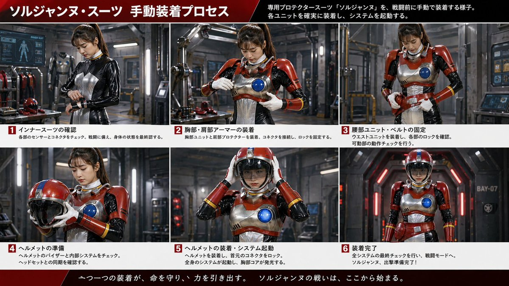
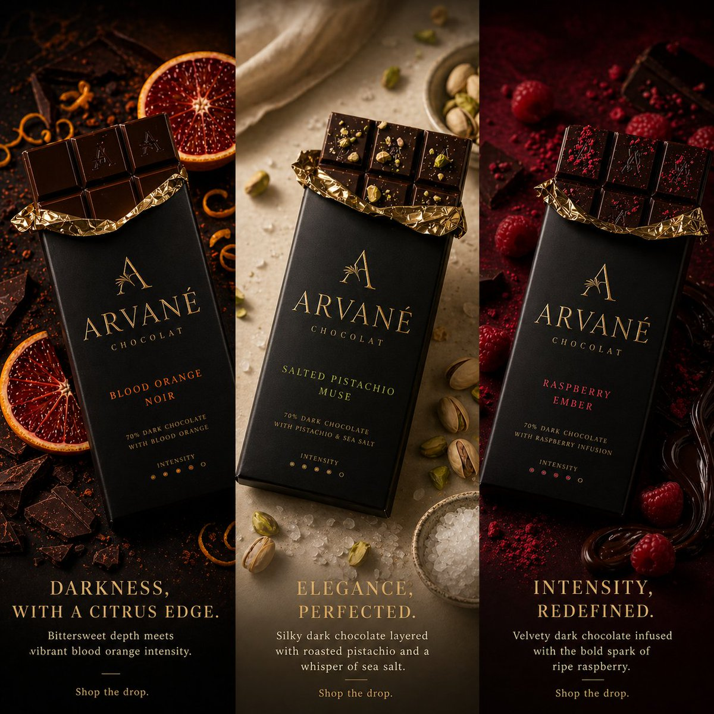
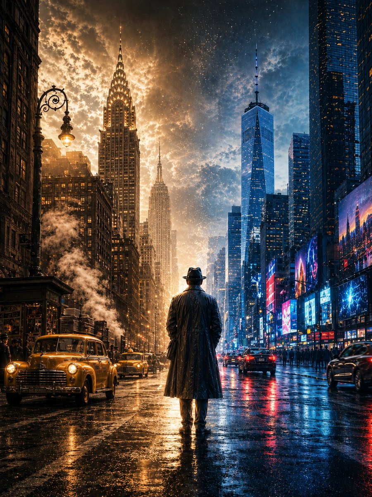

<div align="center">

<a href="https://evolink.ai/gpt-image-2-prompts?utm_source=github&utm_medium=banner&utm_campaign=awesome-gpt-image-2-prompts"></a>

[](LICENSE)
[](https://evolink.ai/gpt-image-2-prompts?utm_source=github&utm_medium=badge&utm_campaign=awesome-gpt-image-2-prompts)
[](https://evolink.ai/gpt-image-2-prompts?utm_source=github&utm_medium=badge&utm_campaign=awesome-gpt-image-2-prompts)
[](https://evolink.ai/gpt-image-2-prompts?utm_source=github&utm_medium=badge&utm_campaign=awesome-gpt-image-2-prompts)
[](https://github.com/EvoLinkAI/GPT-Image-2-Seedance2-Workflow)

[](README.md)
[](README_es.md)
[](README_pt.md)
[](README_ja.md)
[](README_ko.md)
[](README_de.md)
[](README_fr.md)
[](README_tr.md)
[](README_zh-TW.md)
[](README_zh-CN.md)
[](README_ru.md)

</div>

## 简介

欢迎来到 awesome-gpt-image-2-prompts 仓库！🤗

**我们收录了 GPT-Image-2 在人像、海报、角色设计、UI 原型及社区实验等场景下的高质量提示词与图像案例。**

仓库中的大多数案例来源于 X/Twitter 上的创作者社区、公开演示及分享实验。

在 Evolink 上体验：[GPT-Image-2](https://evolink.ai/models?utm_source=github&utm_medium=picture&utm_campaign=awesome-gpt-image-2-prompts)

如果觉得有用，欢迎点个 Star。⭐

> [!NOTE]
> 本仓库专注于 GPT-Image-2 在 Evolink 上的可复用提示词模板、参考案例与任务专项示例。
> 最近仅提示词的更新也会同步记录在 `gpt_image_2_prompt.json` 中。

<a href='https://evolink.ai/gpt-image-2-prompts?utm_source=github&utm_medium=badge&utm_campaign=awesome-gpt-image-2-prompts'></a>

## 最新动态

- **2026 年 4 月 29 日：** 在本轮 review 批次中新增 22 个 GPT-Image-2 prompt 案例（电商 3、广告创意 3、人像 4、角色设计 2、海报 9、对比 1），同步修正 Case 102 与 103 的多语言 prompt，并纳入更大范围的有效 keep-set 校验
- **2026 年 4 月 26 日：** 新增 9 个 GPT-Image-2 prompt 案例（角色设计 1、海报 7、UI 1）
- **2026 年 4 月 25 日：** 新增 81 个 GPT-Image-2 prompt 案例（角色设计 2、人像 20、海报 42、UI 17）
- **2026 年 4 月 24 日：** 新增 19 个 GPT-Image-2 prompt 案例（对比 6、海报 6、UI 7）
- **2026 年 4 月 23 日：** 新增 5 个 GPT-Image-2 prompt 案例（UI 5）
- **2026 年 4 月 20 日：** 新增 2 个 GPT-Image-2 prompt 案例（角色设计 1、海报 1）
- **2026 年 4 月 19 日：** 新增 5 个 GPT-Image-2 prompt 案例（海报 3、UI 2）
- **2026 年 4 月 17 日：** 新增 1 个 GPT-Image-2 prompt 案例（海报 1）
- **2026 年 4 月 16 日：** 新增 1 个 GPT-Image-2 prompt 案例（海报 1）
- **2026 年 4 月 23 日：** 已统一 `README.md` 及所有本地化 README 中的 case title，并同步更新目录项、锚点与案例标题
- **2026 年 4 月 21 日：** 已将 48 个新 prompt 案例整理归入图库分区，并下载对应链接输出图像
- **2026 年 4 月 21 日：** 新增 12 个 GPT-Image-2 prompts，涵盖人像、海报、UI 与对比案例
- **2026 年 4 月 20 日：** 新增 10 个精选 GPT-Image-2 prompts，并同步补充本地图片资源与 README 更新。
- **2026 年 4 月 19 日：** 新增 10 个 GPT-Image-2 prompts，涵盖海报、UI 与对比案例
- **2026 年 4 月 18 日：** 仓库首次发布，收录精选 GPT-Image-2 案例集

## 📑 Menu

- [简介](#简介)
- [最新动态](#最新动态)
- [🛒 E-commerce Cases](#e-commerce-cases)
- [📣 Ad Creative Cases](#ad-creative-cases)
- [人像与摄影案例](#人像与摄影案例)
- [海报与插画案例](#海报与插画案例)
- [角色设计案例](#角色设计案例)
- [UI 与社交媒体截图案例](#ui-与社交媒体截图案例)
- [模型对比与社区案例](#模型对比与社区案例)

## 🛒 E-commerce Cases

> See all cases → [cases/ecommerce_zh-CN.md](cases/ecommerce_zh-CN.md)

### Case 151: [E-commerce Main Image - Miniature Diorama Skincare Advertisement](https://x.com/Strength04_X/status/2048074514278563949) (by [@Strength04_X](https://x.com/Strength04_X))

| 输出效果 |
| :----: |
| <a href="https://evolink.ai/gpt-image-2-prompts?utm_source=github&utm_medium=picture&utm_campaign=awesome-gpt-image-2-prompts" target="_blank" rel="noopener noreferrer"></a> |

**提示词：**

```
A hyper-realistic miniature diorama product advertisement featuring an oversized luxury skincare pump bottle labeled "LUXEVEIL Skin Science – Radiance Nourishing Body Lotion" in cream/beige with a polished gold pump top, placed on a circular platform. Tiny figurine construction workers dressed in yellow coveralls and white hard hats swarm around the bottle climbing scaffolding, painting the bottle with rollers, operating a tower crane, working near industrial tanks and pipework, and unloading a miniature flatbed truck. The scene includes metal scaffolding structures, industrial silos, orange traffic cones, wooden barricades, and storage barrels. The overall color palette is warm beige, cream, gold, and mustard yellow. Studio photography style with soft diffused lighting, no shadows, clean beige background. The concept metaphorically shows workers "crafting" or "building" the perfect lotion. Tilt-shift miniature aesthetic, ultra-detailed, commercial product photography, 8K resolution, photorealistic CGI render.
```

### Case 160: [E-commerce Main Image - 9-Panel Product TVC Storyboard](https://x.com/Magncsans/status/2047876253898903594) (by [@Magncsans](https://x.com/Magncsans))

| 输出效果 |
| :----: |
| <a href="https://evolink.ai/gpt-image-2-prompts?utm_source=github&utm_medium=picture&utm_campaign=awesome-gpt-image-2-prompts" target="_blank" rel="noopener noreferrer"></a> |

**提示词：**

```
Using the provided reference image, transform the single casual product photo into a polished e-commerce TVC storyboard board for a {argument name="video duration" default="15-second"} ad in a {argument name="aspect ratio" default="9:16"} vertical format, presented as a 9-panel grid. Keep the same blue-and-white ceramic ashtray as the product base, but restage it across cinematic advertising shots with warm premium lighting, shallow depth of field, and a refined lifestyle desktop environment. Add a dark storyboard layout with Chinese titles and timing for each panel. Include exactly 9 scenes: 1) environment-establishing wide shot with desk, books, window, and the product placed in context; 2) hero product medium shot on the table; 3) extreme close-up of the blue floral craftsmanship pattern; 4) use case showing a hand placing a cigarette into the ashtray with visible smoke; 5) top-down capacity display showing multiple cigarette butts inside; 6) cleaning scene under running water in a sink with a hand holding the product; 7) bottom-detail close-up showing the underside and anti-slip pads; 8) mood/lifestyle scene at night with the product on a desk, smoke rising, and ambient lamp light; 9) brand closing frame with the product as the hero plus Chinese marketing text. Add the overall header text “产品TVC分镜脚本(15秒 / 9:16竖屏 / 9宫格)” and a product subtitle naming it {argument name="product name" default="青花瓷烟灰缸"}. Give each of the 9 panels a Chinese scene title and timestamp, plus small descriptive Chinese copy beneath each image in the style of a professional commercial shot list. Use premium, realistic commercial photography throughout, consistent product identity, elegant Chinese aesthetic, and a clean high-end storyboard presentation.
```

### Case 163: [Burger hero image plus 9-cell ad storyboard](https://x.com/Gdgtify/status/2049449869530775877) (by [@Gdgtify](https://x.com/Gdgtify))

| 输出效果 |
| :----: |
| <a href="https://evolink.ai/gpt-image-2-prompts?utm_source=github&utm_medium=picture&utm_campaign=awesome-gpt-image-2-prompts" target="_blank" rel="noopener noreferrer"></a> |

**提示词：**

```
Prompt 1: Create a cinematic hero image of a gourmet cheeseburger on a dark stone surface with glossy brioche bun, melted cheese, crisp lettuce, tomato, grilled patty, sauce, realistic texture, appetizing steam, warm side light, shallow depth of field, premium food commercial style, no text/logos/watermark.

Prompt 2: Create a 9-cell hybrid keyframe-to-transition storyboard sheet for a 15-second gourmet burger ad, moving from empty surface to ingredient assembly to final macro hero shot. Use large S cells and smaller T cells, motion arrows, ghosted ingredient positions, steam, sauce trails, and camera push-in icons. Style: premium food commercial, warm lighting, rich texture, appetizing, cinematic, minimal labels only. No logos, no watermark.
```

## 📣 Ad Creative Cases

> See all cases → [cases/ad-creative_zh-CN.md](cases/ad-creative_zh-CN.md)

### Case 144: [Luxury Chronograph Watch Ad](https://x.com/AlwaveNazca/status/2048147643809865950) (by [@AlwaveNazca](https://x.com/AlwaveNazca))

| 输出效果 |
| :----: |
| <a href="https://evolink.ai/gpt-image-2-prompts?utm_source=github&utm_medium=picture&utm_campaign=awesome-gpt-image-2-prompts" target="_blank" rel="noopener noreferrer"></a> |

**提示词：**

```
A dramatic luxury product advertising image for a motorsport-inspired chronograph wristwatch in a dark studio. Center-left foreground, show a single stainless steel chronograph watch standing upright at a slight three-quarter angle, with a black dial, two red-accent subdials, slim silver hour markers, a tachymeter bezel, and visible crown and pushers on the right side. The watch has a black leather strap with bold red stitching along both edges and a sporty premium finish. To the right of the watch, place one black square presentation box slightly behind it, textured like leather, with red stitching around the lid and a silver embossed eye-shaped logo above the text “NESS STUDIO” and smaller red text “TRACK SURFACE.” At the top center of the composition, add the same silver eye logo with the words “NESS STUDIO” and smaller “BY NICOLAS.” Across the background, place one oversized blurred word, {argument name="headline text" default="PRECISION"}, in large gray capital letters spanning nearly the full width. The scene is set against a deep black background with cinematic red and white horizontal light streaks crossing behind the products from left to right, suggesting speed and racetrack energy. Use a glossy wet ground plane with reflective texture, catching red highlights and mirrorlike reflections beneath the watch and box. At the bottom center, add the text “CHRONOGRAPH SERIES” in clean white spaced capitals with thin red horizontal lines extending on both sides, and below it smaller red capitals reading {argument name="tagline text" default="ALSACE MADE"}. Color palette: black, charcoal gray, silver steel, vivid racing red, and a touch of white. Lighting should be high-contrast and premium, with crisp specular highlights on the metal case, subtle soft fill on the box, and moody shadows. Overall style: ultra-polished commercial product photography, luxury watch campaign, sharp focus on the products, sleek branding, high-end automotive aesthetic.
```

### Case 150: [Luxury Miniature Dubai City Model](https://x.com/silentempiredev/status/2048086378383384773) (by [@silentempiredev](https://x.com/silentempiredev))

| 输出效果 |
| :----: |
| <a href="https://evolink.ai/gpt-image-2-prompts?utm_source=github&utm_medium=picture&utm_campaign=awesome-gpt-image-2-prompts" target="_blank" rel="noopener noreferrer"></a> |

**提示词：**

```
A hyper-detailed cinematic isometric miniature city model of {argument name="landmark tower" default="Burj Khalifa"} rising dramatically from the center of a square architectural master-plan board, presented like a luxury urban planning maquette on a black background. The composition shows one dominant ultra-tall silver skyscraper in the exact center, surrounded by a dense ring of modern high-rise towers, illuminated roads, bridges, and glowing warm city lights. Curving turquoise-blue water features and artificial lakes wrap around the central district in multiple connected pools and canals, with one large circular fountain-like feature near the tower base and several small island shapes visible in the water. In the lower right quadrant, include a large low-rise complex with rounded geometric roofs and subtle green-lit sections, connected by multilane roads and looping interchanges. The entire city sits on one square beige map board engraved with faint street grids and planning lines, with the board edges clearly visible and slightly raised. Viewpoint is a high three-quarter isometric angle, centered and symmetrical, with the tower extending far upward into negative space. Lighting is dramatic and luxurious: warm golden edge lights on buildings and roads, cool reflections in the water, crisp metallic highlights on the central tower, and a deep black void surrounding the model. Style should feel like a photorealistic architectural visualization mixed with a premium collectible scale model, extremely intricate, sharp, polished, and elegant.
```

### Case 169: [Luxury chocolate campaign system](https://x.com/SPEEDAI07/status/2049459155086500321) (by [@SPEEDAI07](https://x.com/SPEEDAI07))

| 输出效果 |
| :----: |
| <a href="https://evolink.ai/gpt-image-2-prompts?utm_source=github&utm_medium=picture&utm_campaign=awesome-gpt-image-2-prompts" target="_blank" rel="noopener noreferrer"></a> |

**提示词：**

```
Create a premium, square (1:1) product advertisement for a fictional luxury chocolate brand called Noirvelle Chocolat, inspired by high-end chocolate brands. The ad should feel like a high-end editorial campaign, combining luxury food photography, refined packaging design, and cinematic lighting. Use matte black wrapper, subtle gold foil, elegant serif typography, and realistic product rendering. Generate flavor variants such as Blood Orange Noir, Salted Pistachio Muse, and Raspberry Ember with distinct mood, color palette, ingredients, headline, and supporting copy. Keep the chocolate bar as hero centerpiece with subtle reflections, shallow depth of field, luxury minimalism, and a small CTA: “Shop the drop.”
```

## 🍌 人像与摄影案例

> See all cases → [cases/portrait_zh-CN.md](cases/portrait_zh-CN.md)

### Case 1: [Convenience Store Neon Portrait](https://x.com/BubbleBrain/status/2045167461147042202) (by [@BubbleBrain](https://x.com/BubbleBrain))

| 输出效果 |
| :----: |
| <a href="https://evolink.ai/gpt-image-2-prompts?utm_source=github&utm_medium=picture&utm_campaign=awesome-gpt-image-2-prompts" target="_blank" rel="noopener noreferrer"></a> |

**提示词：**

```
35mm film photography with harsh convenience store fluorescent lighting mixed with colorful neon signs from outside, authentic film grain, high contrast, slight color cast, cinematic street editorial style, intimate medium shot, early 20s sexy Chinese female idol with ultra-realistic delicate refined Chinese features, seductive almond-shaped fox eyes with natural double eyelids, high nose bridge, small sharp V-shaped jawline, flawless porcelain skin with cool ivory undertone and visible specular highlights from fluorescent light, subtle skin texture and micro pores, natural dewy makeup with soft flush on cheeks, glossy natural pink lips slightly parted, subtle natural freckles across nose and cheeks, long dark brown hair in a messy high ponytail with many loose strands falling around face and neck, wearing an oversized white button-up shirt as the only top, unbuttoned at the top with deep cleavage and loosely tied at the waist, paired with a tiny black pleated mini skirt, barefoot in simple white slides, seductive casual leaning pose against the glass door of a 24-hour convenience store at late night, body slightly arched, one leg bent with foot resting against the door frame, the other leg straight, one hand holding a bottle of iced drink, the other hand lightly pulling the hem of her mini skirt, intensely seductive playful yet slightly vulnerable gaze straight at the viewer with soft doe eyes full of quiet temptation and teasing smile, bright cold fluorescent store light from inside mixed with pink and blue neon glow from outside signs, realistic reflections on glass door, blurred convenience store interior with shelves and snacks in background, authentic 35mm film color grading with harsh lighting and neon accents, extremely sharp yet soft skin rendering, natural hair strands, realistic fabric wrinkles and drape on the oversized shirt and mini skirt, no plastic skin, no digital over-sharpening, no airbrushing, no blemishes, no moles, no oily skin, no watermark, no text, authentic late-night convenience store atmosphere
```
### Case 84: [Ink-Etched Family Portrait](https://x.com/gdb/status/2048184698195870102) (by [@gdb](https://x.com/gdb))

| 输出效果 |
| :----: |
| <a href="https://evolink.ai/gpt-image-2-prompts?utm_source=github&utm_medium=picture&utm_campaign=awesome-gpt-image-2-prompts" target="_blank" rel="noopener noreferrer"></a> |

**提示词：**

```
A black-and-white hand-drawn family portrait in the style of detailed pen-and-ink crosshatching on textured white paper, showing 4 people seated closely together in a casual candid composition. On the left, an adult man in a dark baseball cap worn backward and a dark T-shirt leans into the frame, with a crossbody sling bag worn across his chest and visible zipper details. On the right, an adult woman with curly hair tied up in a loose high bun wears a light T-shirt with large collegiate block letters reading {argument name="shirt text" default="CITY"}. In the center are 2 young children sitting close together, both with short curly hair and matching light-colored T-shirts printed all over with strawberries. The child on the left leans inward with one arm crossing the other child, and the child on the right tilts their head slightly upward. The adults frame the children protectively, creating a warm family snapshot feeling. Render the whole image as a monochrome etched illustration with dense fine-line hatching, engraved shadows, crisp contour lines, and a realistic yet artistic likeness, with no color, no background setting beyond a plain light paper texture, and a vertical portrait crop.
```

### Case 99: [Dreamy Underwater Woman With Translucent Fish](https://x.com/kotobukigraphic/status/2047967522453123255) (by [@kotobukigraphic](https://x.com/kotobukigraphic))

| 输出效果 |
| :----: |
| <a href="https://evolink.ai/gpt-image-2-prompts?utm_source=github&utm_medium=picture&utm_campaign=awesome-gpt-image-2-prompts" target="_blank" rel="noopener noreferrer"></a> |

**提示词：**

```
A dreamy surreal portrait of a {argument name="subject" default="young woman"} standing underwater or in a liquid-like ethereal space, shown from about mid-thigh up, wearing a flowing sleeveless white dress that appears to dissolve into translucent water and shimmering fragments. Her long {argument name="hair color" default="dark brown"} hair streams dramatically sideways as if suspended in water, and her face is intentionally obscured by a soft vertical blur block for anonymity. Surround her with an exact count of about 30 small translucent fish, some striped and some pale silvery white, swimming in multiple depths of field across the foreground, midground, and background, with several fish passing in front of her body and hair to create strong motion and depth. Use a soft pastel {argument name="background color" default="powder blue"} background with faint handwritten script texture layered across it, plus whimsical doodles scattered throughout: white and pale pink hearts, stars, curved squiggles, wave lines, dots, sparkles, and 2 smiley faces. Add prismatic rainbow refractions, glossy caustic highlights, and subtle lens-like chromatic shimmer on the fish and dress. The mood should feel delicate, introspective, airy, and magical, with high-key lighting, gentle contrast, soft focus in the foreground, and crisp detail on the torso and hair. Compose the figure slightly off-center with one arm relaxed downward and the body turned lightly in motion, as if drifting peacefully through a school of fish. Include tiny elegant footer text in white near the bottom edge, with a left signature, a centered website URL, and a small right credit mark, resembling an art-poster or social-media showcase image.
```

## 🎨 海报与插画案例

> See all cases → [cases/poster_zh-CN.md](cases/poster_zh-CN.md)

### Case 3: [Chengdu Food Map Illustration](https://x.com/Panda20230902/status/2045396918965285111) (by [@Panda20230902](https://x.com/Panda20230902))

| 输出效果 |
| :----: |
| <a href="https://evolink.ai/gpt-image-2-prompts?utm_source=github&utm_medium=picture&utm_campaign=awesome-gpt-image-2-prompts" target="_blank" rel="noopener noreferrer"></a> |

**提示词：**

```
一张手绘风格的城市美食地图，以成都为主题。画面以鸟瞰视角的手绘简化城市地图为底，标注主要道路和地标但不追求精确比例而是追求可爱的手绘感。地图上分布着 12 个美食地点的精致手绘小插画：春熙路的串串香（一把竹签插着各种食材冒着热气）、宽窄巷子的三大炮（三个糯米团子飞向铜盘）、建设路的蛋烘糕（金黄酥脆正在翻面）、玉林路的火锅（九宫格锅翻滚冒泡）等，每个插画约占地图的 5% 面积，旁边用手写体标注店名和一句推荐语"凌晨两点还在排队的那家"。地图边缘用手绘藤蔓和辣椒装饰形成边框。右下角有一个手绘指南针和图例说明。左上角标题"成都·吃货暴走地图"使用胖圆的手绘美术字配辣椒装饰。整体画风为水彩+彩铅混合的手绘质感，颜色以暖色系（辣椒红、姜黄、翠绿）为主，图片比例 1:1。
```
### Case 79: [Peacock Botanical Vintage Symmetrical Art Print](https://x.com/dotey/status/2047803054422901046) (by [@dotey](https://x.com/dotey))

| 输出效果 |
| :----: |
| <a href="https://evolink.ai/gpt-image-2-prompts?utm_source=github&utm_medium=picture&utm_campaign=awesome-gpt-image-2-prompts" target="_blank" rel="noopener noreferrer"></a> |

**提示词：**

```
symmetrical design featuring two elegant blue peacocks with detailed feather patterns, surrounded by blue floral elements, intricate vintage botanical ornament, soft beige background, classical floral decor style with rich navy and sky blue details, decorative art illustration --ar 3:2
```


### Case 174: [New York across two centuries cinematic poster](https://x.com/Shinning1010/status/2049460661109879022) (by [@Shinning1010](https://x.com/Shinning1010))

| 输出效果 |
| :----: |
| <a href="https://evolink.ai/gpt-image-2-prompts?utm_source=github&utm_medium=picture&utm_campaign=awesome-gpt-image-2-prompts" target="_blank" rel="noopener noreferrer"></a> |

**提示词：**

```
Create a cinematic 3:4 vertical poster of New York City that feels truly epic and unconventional, showing the passage from the 20th century to the 21st century in one seamless image. Place a lone figure at the center of the composition, standing in the middle of the street and looking forward as if witnessing New York across time. The left side should depict 20th-century New York with warm sepia atmosphere, vintage taxis, old newsstands, retro lamps, and landmarks like the Chrysler Building and Empire State Building. The right side should depict 21st-century New York with glass skyscrapers, One World Trade Center, digital billboards, and modern urban energy. Make the transition natural rather than split-screen, with coherent perspective, wet reflective pavement, realistic textures, atmospheric depth, and no text.
```


## 🧍 角色设计案例

> See all cases → [cases/character_zh-CN.md](cases/character_zh-CN.md)

### Case 2: [Persona5 Character Reference Card](https://x.com/iamrednightS/status/2045075682837836265) (by [@iamrednightS](https://x.com/iamrednightS))

| 输出效果 |
| :----: |
| <a href="https://evolink.ai/gpt-image-2-prompts?utm_source=github&utm_medium=picture&utm_campaign=awesome-gpt-image-2-prompts" target="_blank" rel="noopener noreferrer"></a> |

**提示词：**

```
基于此角色和背景，请制作一份类似官方设定资料的角色资料卡。
・包含三视图：正面、侧面和背面
・添加角色面部表情的变化・分解并展示服装和装备的详细部分
・添加色板・包含世界观设定的简要说明
・总体上，使用有组织的布局（白色背景，插画风格）高分辨率、专业概念艺术风格
```
### Case 7: [Mecha Girl Sea-City Key Visual](https://x.com/old_pgmrs_will/status/2046144801071079612) (by [@old_pgmrs_will](https://x.com/old_pgmrs_will))

| 输出效果 |
| :----: |
| <a href="https://evolink.ai/gpt-image-2-prompts?utm_source=github&utm_medium=picture&utm_campaign=awesome-gpt-image-2-prompts" target="_blank" rel="noopener noreferrer"></a> |

**提示词：**

```
A mecha girl mid-teens, pale skin smudged with soot and salt spray, sharp amber eyes with glowing HUD reticles, waist-length ash-white hair tied in a high ponytail whipping in the sea wind, matte gunmetal exoskeleton armor plating her shoulders, forearms and shins, exposed hydraulic pistons at the joints, chest rig with glowing cyan coolant lines, oversized oil-stained hangar jacket half slipping off one shoulder, a massive rail cannon resting on her right shoulder, dog tags and frayed red ribbon at her collar , standing off-center to the left on the rusted edge of a tilted steel platform jutting out over dark water, weight shifted onto one leg, left hand gripping the cannon strap, head turned slightly toward camera with a quiet defiant stare, steam venting from her back thrusters, her ponytail and jacket streaming sideways in the salt wind , a vast derelict sea-city at dusk, colossal megastructures of unknown purpose rising from the ocean in staggered silhouettes, bone-white monolithic towers fused with barnacled steel, cyclopean ring-shaped constructs canted at broken angles, rusted skeletal gantries threaded with dead cables, dark swells rolling between the pylons, shipwrecks half-swallowed at their feet, thick sea fog clinging to the bases while the upper structures pierce into a bruised sky, scattered faint lights blinking high in the towers like distant eyes , moody low-key lighting, cold teal ambient from the overcast sky, warm amber sodium glow leaking from a distant structure camera-right, hard backlight from a low sun behind the towers carving her silhouette, volumetric god rays cutting through sea mist, wet specular highlights on her armor , 35mm anamorphic lens, slight low angle looking up past her shoulder toward the structures, medium-wide shot, shallow depth of field with foreground rust in soft focus, horizontal lens flares, fine atmospheric haze compressing the distant megastructures into layered silhouettes , cinematic anime key visual, painterly digital illustration with crisp line art, desaturated oceanic palette of teal, bone-white and rust punched by small warm accent lights, film grain, high-contrast editorial poster aesthetic . Format 16:9.
```

### Case 11: [GTA 6 in Bangalore Flower Market](https://x.com/ismajc/status/2048174302164394493) (by [@ismajc](https://x.com/ismajc))

| 输出效果 |
| :----: |
| <a href="https://evolink.ai/gpt-image-2-prompts?utm_source=github&utm_medium=picture&utm_campaign=awesome-gpt-image-2-prompts" target="_blank" rel="noopener noreferrer"></a> |

**提示词：**

```
{argument name="game" default="gta 6"} in {argument name="location" default="Bangalore’s market flower"} in India
```

## 📱 UI 与社交媒体截图案例

> See all cases → [cases/ui_zh-CN.md](cases/ui_zh-CN.md)

### Case 1: [One-Prompt UI Design Generation](https://x.com/austinit/status/2044968740782272596) (by [@austinit](https://x.com/austinit))

| 输出效果 |
| :----: |
| <a href="https://evolink.ai/gpt-image-2-prompts?utm_source=github&utm_medium=picture&utm_campaign=awesome-gpt-image-2-prompts" target="_blank" rel="noopener noreferrer"></a> |

**提示词：**

```
用这种风格帮我生成一套UI设计系统，包含网页、移动端、卡片、控件、按钮 以及其它
```
### Case 38: [Cyberpunk Neon UI Design System](https://x.com/AZLnfvp/status/2046468976092533180) (by [@AZLnfvp](https://x.com/AZLnfvp))

| 输出效果 |
| :----: |
| <a href="https://evolink.ai/gpt-image-2-prompts?utm_source=github&utm_medium=picture&utm_campaign=awesome-gpt-image-2-prompts" target="_blank" rel="noopener noreferrer"></a> |

**提示词：**

```
用未来都市风格生成UI设计系统,灵感来自赛博朋克城市夜景,包含霓虹灯、玻璃建筑反射、高对比光影,配色以紫色、蓝色、粉色霓虹为主,设计网页Dashboard、移动端界面、卡片、按钮、控件等,视觉炫酷、层次丰富、科技感极强
```

### Case 105: [Multi-Panel Image Board Template](https://x.com/aimikoda/status/2048183782876778821) (by [@aimikoda](https://x.com/aimikoda))

| 输出效果 |
| :----: |
| <a href="https://evolink.ai/gpt-image-2-prompts?utm_source=github&utm_medium=picture&utm_campaign=awesome-gpt-image-2-prompts" target="_blank" rel="noopener noreferrer"></a> |

**提示词：**

```
Create a {argument name="grid layout" default="4x3"} borderless grid where each panel is an independent image of the {argument name="subject" default="a young woman"}. Maintain strong subject consistency across all panels, with consistent color and lighting. Depict {argument name="theme" default="childhood memories"} with a {argument name="mood" default="warm, nostalgic"} mood in {argument name="style" default="nostalgic cinematic realism"} style. No text. No gap.
```

## 🧪 模型对比与社区案例

> See all cases → [cases/comparison_zh-CN.md](cases/comparison_zh-CN.md)

### Case 35: [Sam Altman Bear Selfie](https://x.com/JustinGorya/status/2046510831832006970) (by [@JustinGorya](https://x.com/JustinGorya))

| 输出效果 |
| :----: |
| <a href="https://evolink.ai/gpt-image-2-prompts?utm_source=github&utm_medium=picture&utm_campaign=awesome-gpt-image-2-prompts" target="_blank" rel="noopener noreferrer"></a> |

**提示词：**

```
generate image: Selfie of Sam Altman riding a bear

Edit prompt: Remove the background make it transparent
```

### Case 41: [Generate an image of the most significant event of 2020](https://x.com/Rufus87078959/status/2047211900769878234) (by [@Rufus87078959](https://x.com/Rufus87078959))

| 输出效果 |
| :----: |
| <a href="https://evolink.ai/gpt-image-2-prompts?utm_source=github&utm_medium=picture&utm_campaign=awesome-gpt-image-2-prompts" target="_blank" rel="noopener noreferrer"></a> |

**提示词：**

```
Generate an image of the most significant event of 2020
```

### Case 68: [Naturalist-Style Food Specimen Cross-Section](https://x.com/GeekCatX/status/2046939656244318676) (by [@GeekCatX](https://x.com/GeekCatX))

| 输出效果 |
| :----: |
| <a href="https://evolink.ai/gpt-image-2-prompts?utm_source=github&utm_medium=picture&utm_campaign=awesome-gpt-image-2-prompts" target="_blank" rel="noopener noreferrer"></a> |

**提示词：**

```
一颗/一块/一枚【食物名称】，以博物学大师发现野外标本的方式解剖。
剖开、展开、固定——如同博物馆的珍贵藏品，
却以卡拉瓦乔为《国家地理》掌镜时的光线照亮。
每一个内部结构都以自身的材质真相发光。
截面锋利得近乎暴力。内部美丽得近乎神圣。
画面中呈现完整标本：
一半保持原状，展示【外表面描述：质感/颜色/纹理】；
另一半剖开至核心，【内部核心结构描述：最重要的1—2个内部视觉特征】清晰可见。
【补充1—2句该食物最具视觉张力的横截面细节描述】
背景：纯粹的黑丝绒。
【食物名称】悬浮其中，如同某件珍贵而危险的事物。
标注文字紧贴结构边缘，手写感衬线字体，绝不悬空飘浮。
画面包含以下标注，每处标注三行：第一行结构名称，第二行成分数据，第三行一句人话：
【结构01名称】
【成分／数据说明】
【这个结构在做什么，为什么重要】

【结构02名称】
【成分／数据说明】
【这个结构在做什么，为什么重要】
【结构03名称】
【成分／数据说明】
【这个结构在做什么，为什么重要】
【结构04名称】
【成分／数据说明】
【这个结构在做什么，为什么重要】
【结构05名称】
【成分／数据说明】
【这个结构在做什么，为什么重要】

【结构06名称】
【成分／数据说明】
【这个结构在做什么，为什么重要】
省略其他如果有继续保持这个格式
主标题，左上角，暖象牙白大写字体：
【食物名称】·解剖

斜体副标题紧随其下：
【一句揭示这种食物本质的话，不超过15字】

整体气质：奥杜邦博物插画×卡拉瓦乔光影×有史以来最美的科学摄影。
4K精度，标本照明，极致内部细节。
没有任何临床感，一切都鲜活。
写实风格，非示意图，非卡通，非简化图解。
每一种材质都有真实的物理质感：
粗糙的、光滑的、湿润的、干燥的、致密的、疏松的。
```

## 致谢

本仓库受到优秀的开源提示词集合以及社区分享的 GPT-Image-2 实验案例启发。

感谢所有公开分享作品、让这些案例研究得以成立的创作者与贡献者。

[@BubbleBrain](https://x.com/BubbleBrain), [@iam_miharbi](https://x.com/iam_miharbi), [@Shinning1010](https://x.com/Shinning1010), [@patrickassale](https://x.com/patrickassale), [@Zoulinshen](https://x.com/Zoulinshen), [@WolfRiccardo](https://x.com/WolfRiccardo), [@Panda20230902](https://x.com/Panda20230902), [@liyue_ai](https://x.com/liyue_ai), [@blanplan](https://x.com/blanplan), [@4WEB1](https://x.com/4WEB1), [@lilimliliychan](https://x.com/lilimliliychan), [@Thereallo1026](https://x.com/Thereallo1026), [@iamrednightS](https://x.com/iamrednightS), [@09lyco](https://x.com/09lyco), [@tsubaki_ew](https://x.com/tsubaki_ew), [@Toshi_nyaruo_AI](https://x.com/Toshi_nyaruo_AI), [@yyu_hase](https://x.com/yyu_hase), [@austinit](https://x.com/austinit), [@MrLarus](https://x.com/MrLarus), [@rionaifantasy](https://x.com/rionaifantasy), [@alanblogsooo](https://x.com/alanblogsooo), [@SKA_Neotype](https://x.com/SKA_Neotype), [@desds1678](https://x.com/desds1678), [@samifox_ai](https://x.com/samifox_ai), [@HuliJason](https://x.com/HuliJason), [@MikelEcheve](https://x.com/MikelEcheve), [@chetaslua](https://x.com/chetaslua), [@signedbywill](https://x.com/signedbywill), [@zerolu_eth](https://x.com/zerolu_eth), [@Cheney_NehcOal](https://x.com/Cheney_NehcOal), [@cnzoecomeback](https://x.com/cnzoecomeback), [@linxiaobei888](https://x.com/linxiaobei888), [@old_pgmrs_will](https://x.com/old_pgmrs_will), [@kotsu_kotsu_san](https://x.com/kotsu_kotsu_san), [@samayousakadaru](https://x.com/samayousakadaru), [@saskr_13](https://x.com/saskr_13), [@kawai_design](https://x.com/kawai_design), [@otohitoyuuki](https://x.com/otohitoyuuki), [@jrpj2010](https://x.com/jrpj2010), [@CEs7J0Mfn8x37k5](https://x.com/CEs7J0Mfn8x37k5), [@pfanis](https://x.com/pfanis), [@yssrski](https://x.com/yssrski), [@overseas58](https://x.com/overseas58), [@opc_8838](https://x.com/opc_8838), [@RitaStar1128](https://x.com/RitaStar1128), [@Yuupapa_free](https://x.com/Yuupapa_free), [@tebasaki3D](https://x.com/tebasaki3D), [@Colin_Leeee](https://x.com/Colin_Leeee), [@IndieDevHailey](https://x.com/IndieDevHailey), [@wory37303852](https://x.com/wory37303852), [@mm_zzm44854](https://x.com/mm_zzm44854), [@sjbbxhz](https://x.com/sjbbxhz), [@GeekCatX](https://x.com/GeekCatX), [@makaneko_AI](https://x.com/makaneko_AI), [@Tanemomi_Ver2](https://x.com/Tanemomi_Ver2), [@chi_vc_](https://x.com/chi_vc_), [@S0N_IA_](https://x.com/S0N_IA_), [@Gugombly](https://x.com/Gugombly), [@rerxmsz06](https://x.com/rerxmsz06), [@Shion_yamabuki](https://x.com/Shion_yamabuki), [@SelenaGmzIN](https://x.com/SelenaGmzIN), [@chesnyfcb](https://x.com/chesnyfcb), [@MoveHiro1219](https://x.com/MoveHiro1219), [@mirochill](https://x.com/mirochill), [@Eris_Create_Lab](https://x.com/Eris_Create_Lab), [@Design4p0](https://x.com/Design4p0), [@mikko_20100518](https://x.com/mikko_20100518), [@sorane_aimusic](https://x.com/sorane_aimusic), [@Polanco_IA](https://x.com/Polanco_IA), [@Strength04_X](https://x.com/Strength04_X), [@edimakorfr](https://x.com/edimakorfr), [@ShamsAmin56](https://x.com/ShamsAmin56), [@dynamicwangs](https://x.com/dynamicwangs), [@MiguelMaestroIA](https://x.com/MiguelMaestroIA), [@gdb](https://x.com/gdb), [@ToroJushiAi](https://x.com/ToroJushiAi), [@Inshrah_ali_](https://x.com/Inshrah_ali_), [@XSydneyFan](https://x.com/XSydneyFan), [@Abdullah__Ai7](https://x.com/Abdullah__Ai7), [@yume00112211](https://x.com/yume00112211), [@jiajia232016](https://x.com/jiajia232016), [@libearal](https://x.com/libearal), [@jeremydevz](https://x.com/jeremydevz), [@megane_onesan](https://x.com/megane_onesan), [@kotobukigraphic](https://x.com/kotobukigraphic), [@Hair_Hair55](https://x.com/Hair_Hair55), [@erikmackinnon](https://x.com/erikmackinnon), [@FernandesK47117](https://x.com/FernandesK47117), [@aimikoda](https://x.com/aimikoda), [@mosthssan](https://x.com/mosthssan), [@SDAI1807097011](https://x.com/SDAI1807097011), [@AIillust_studio](https://x.com/AIillust_studio), [@Just_sharon7](https://x.com/Just_sharon7), [@AIMAG31G](https://x.com/AIMAG31G), [@yanagihara_0805](https://x.com/yanagihara_0805), [@Gorden_Sun](https://x.com/Gorden_Sun), [@m_Raiko_AIart](https://x.com/m_Raiko_AIart), [@sub_raw_jin](https://x.com/sub_raw_jin), [@harboriis](https://x.com/harboriis), [@Diplomeme](https://x.com/Diplomeme), [@zenkaiAI](https://x.com/zenkaiAI), [@_simonsmith](https://x.com/_simonsmith), [@leyu37829](https://x.com/leyu37829), [@mob_17](https://x.com/mob_17), [@komorimedia](https://x.com/komorimedia), [@degewa](https://x.com/degewa), [@GlennHasABeard](https://x.com/GlennHasABeard), [@TWnese](https://x.com/TWnese), [@Ciri_ai](https://x.com/Ciri_ai), [@tonysimons_](https://x.com/tonysimons_), [@himukai_an](https://x.com/himukai_an), [@Dakiny](https://x.com/Dakiny), [@ExquisitMe](https://x.com/ExquisitMe), [@xRahultripathi](https://x.com/xRahultripathi), [@JohnnyWang8802](https://x.com/JohnnyWang8802), [@Professor_134](https://x.com/Professor_134), [@ArtwlDesign](https://x.com/ArtwlDesign), [@hoshi122221](https://x.com/hoshi122221), [@Ray_CROWN0](https://x.com/Ray_CROWN0), [@AllaAisling](https://x.com/AllaAisling), [@AlwaveNazca](https://x.com/AlwaveNazca), [@_LaurentB](https://x.com/_LaurentB), [@Salmaaboukarr](https://x.com/Salmaaboukarr), [@silentempiredev](https://x.com/silentempiredev), [@songguoxiansen](https://x.com/songguoxiansen), [@rojassartorio](https://x.com/rojassartorio), [@WooGabriel76263](https://x.com/WooGabriel76263), [@SPEEDAI07](https://x.com/SPEEDAI07), [@Adam38363368936](https://x.com/Adam38363368936), [@Magncsans](https://x.com/Magncsans), [@ismajc](https://x.com/ismajc), [@almimeister](https://x.com/almimeister), [@sarinaashapi](https://x.com/sarinaashapi), [@Kazuch75240438](https://x.com/Kazuch75240438), [@yy7482933910896](https://x.com/yy7482933910896), [@terunari](https://x.com/terunari), [@Gerry](https://x.com/Gerry), [@xc5_](https://x.com/xc5_), [@Ayu_AI_0912](https://x.com/Ayu_AI_0912), [@16kthir0GRXgNqn](https://x.com/16kthir0GRXgNqn), [@80vul](https://x.com/80vul), [@A9Quant](https://x.com/A9Quant), [@AIwithAliya](https://x.com/AIwithAliya), [@AIwithSarah_](https://x.com/AIwithSarah_), [@AIwithSynthia](https://x.com/AIwithSynthia), [@AIwithkhan](https://x.com/AIwithkhan), [@AZLnfvp](https://x.com/AZLnfvp), [@AntCaveClub](https://x.com/AntCaveClub), [@Aurora_62340](https://x.com/Aurora_62340), [@BNBOKBt5](https://x.com/BNBOKBt5), [@ChiefMonkeyMike](https://x.com/ChiefMonkeyMike), [@ChillaiKalan__](https://x.com/ChillaiKalan__), [@CoderDaMing](https://x.com/CoderDaMing), [@D_studioproject](https://x.com/D_studioproject), [@FixlationAI](https://x.com/FixlationAI), [@Gdgtify](https://x.com/Gdgtify), [@Ghhhh3owi](https://x.com/Ghhhh3owi), [@Goodmanprotocol](https://x.com/Goodmanprotocol), [@JustinGorya](https://x.com/JustinGorya), [@Kurt_Rousey466](https://x.com/Kurt_Rousey466), [@LVWANGJI_0327](https://x.com/LVWANGJI_0327), [@LoovaAI](https://x.com/LoovaAI), [@MANISH1027512](https://x.com/MANISH1027512), [@MajaDesignJP](https://x.com/MajaDesignJP), [@Malek1173989](https://x.com/Malek1173989), [@Naiknelofar788](https://x.com/Naiknelofar788), [@Preda2005](https://x.com/Preda2005), [@PrometheanAIX](https://x.com/PrometheanAIX), [@QamarRiaz1](https://x.com/QamarRiaz1), [@ReYYYYoking](https://x.com/ReYYYYoking), [@Rufus87078959](https://x.com/Rufus87078959), [@Sheldon056](https://x.com/Sheldon056), [@Shorelyn_](https://x.com/Shorelyn_), [@SimplyAnnisa](https://x.com/SimplyAnnisa), [@Tresmort](https://x.com/Tresmort), [@Tz_2022](https://x.com/Tz_2022), [@WillSpagnoli](https://x.com/WillSpagnoli), [@XiaohuiAI666](https://x.com/XiaohuiAI666), [@ZaraIrahh](https://x.com/ZaraIrahh), [@Zhaoge01](https://x.com/Zhaoge01), [@agi_aibusi](https://x.com/agi_aibusi), [@ai_gezgini](https://x.com/ai_gezgini), [@ailovedirector](https://x.com/ailovedirector), [@akakageAI](https://x.com/akakageAI), [@alanlovelq](https://x.com/alanlovelq), [@anacoding](https://x.com/anacoding), [@andis13](https://x.com/andis13), [@caiziboshi](https://x.com/caiziboshi), [@carsonyungos](https://x.com/carsonyungos), [@cellinlab](https://x.com/cellinlab), [@charliejhills](https://x.com/charliejhills), [@chatcutapp](https://x.com/chatcutapp), [@chenenpei](https://x.com/chenenpei), [@cj858cjsoul](https://x.com/cj858cjsoul), [@ck_igarashi](https://x.com/ck_igarashi), [@commanderdgr8](https://x.com/commanderdgr8), [@dotey](https://x.com/dotey), [@elliscrosby](https://x.com/elliscrosby), [@genel_ai](https://x.com/genel_ai), [@grok](https://x.com/grok), [@happycapyai](https://x.com/happycapyai), [@hmontilla_](https://x.com/hmontilla_), [@iaPulse_](https://x.com/iaPulse_), [@iamrealsnow](https://x.com/iamrealsnow), [@iamsofiaijaz](https://x.com/iamsofiaijaz), [@joshesye](https://x.com/joshesye), [@khaiinit](https://x.com/khaiinit), [@kylegeeks](https://x.com/kylegeeks), [@laogeai](https://x.com/laogeai), [@llllegend0620](https://x.com/llllegend0620), [@loglogrog](https://x.com/loglogrog), [@madpencil_](https://x.com/madpencil_), [@mapasbr](https://x.com/mapasbr), [@meng_dagg695](https://x.com/meng_dagg695), [@miratechtool](https://x.com/miratechtool), [@nidiedeba](https://x.com/nidiedeba), [@nijisora_yuma](https://x.com/nijisora_yuma), [@pavellaslov](https://x.com/pavellaslov), [@rovvmut_](https://x.com/rovvmut_), [@rs_elwood](https://x.com/rs_elwood), [@sciencedegens](https://x.com/sciencedegens), [@sdjn_wgc](https://x.com/sdjn_wgc), [@seiiiiiiiiiiru](https://x.com/seiiiiiiiiiiru), [@sha_zdiii](https://x.com/sha_zdiii), [@stark_nico99](https://x.com/stark_nico99), [@the_wheel_2024](https://x.com/the_wheel_2024), [@underwoodxie96](https://x.com/underwoodxie96), [@verysmallwoods](https://x.com/verysmallwoods), [@weel_corp](https://x.com/weel_corp), [@workingclassbud](https://x.com/workingclassbud), [@yammamon](https://x.com/yammamon), [@zhiyangzhu22222](https://x.com/zhiyangzhu22222)

*我们无法保证每个案例都已准确归属于原始创作者。如需更正，请联系我们，我们会及时更新。*

如果你还有更多有趣的 GPT-Image-2 提示词案例，欢迎联系我们，一起扩充 Evolink 的提示词库。

## Star History

[](https://www.star-history.com/#EvoLinkAI/awesome-gpt-image-2-prompts&Date)
